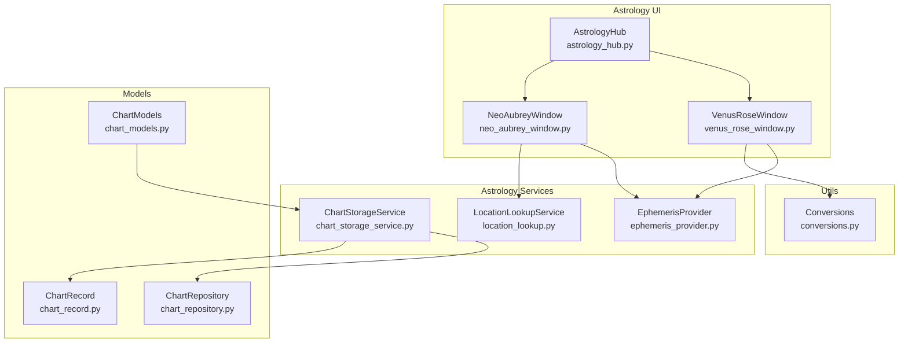
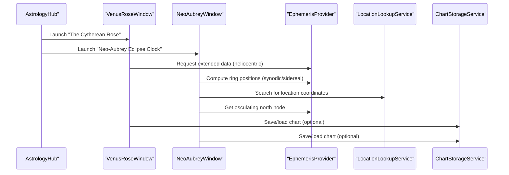
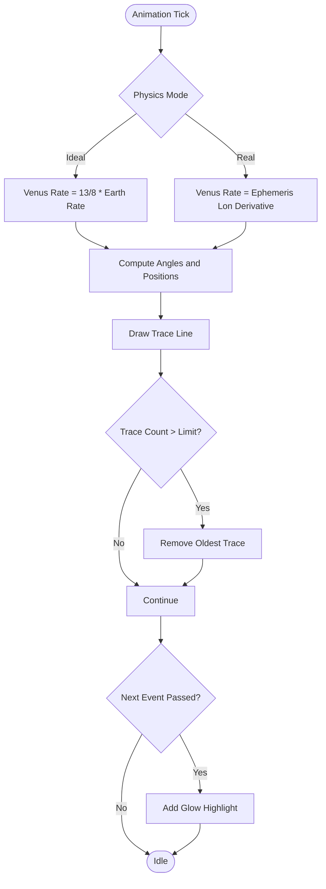
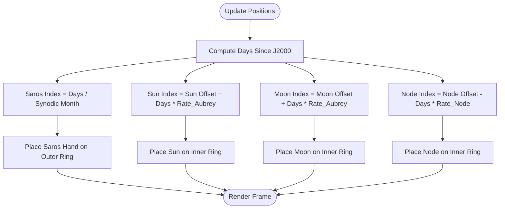
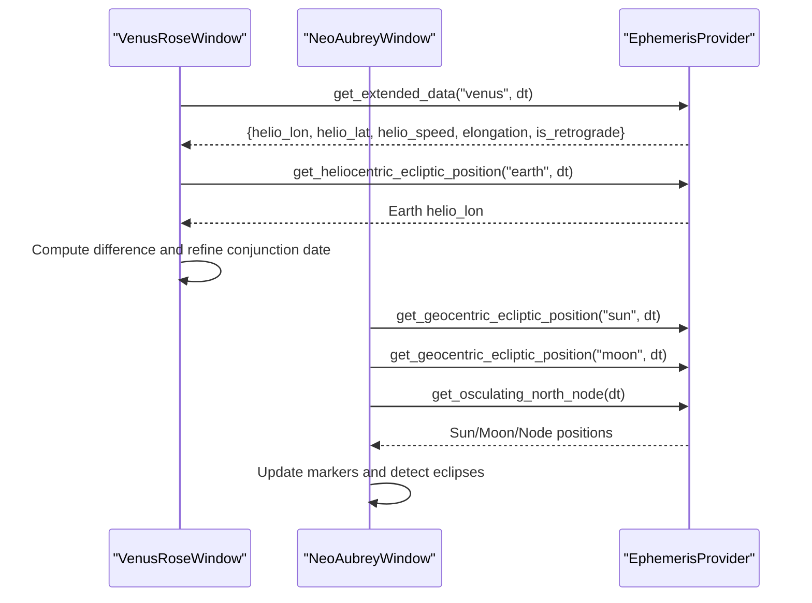
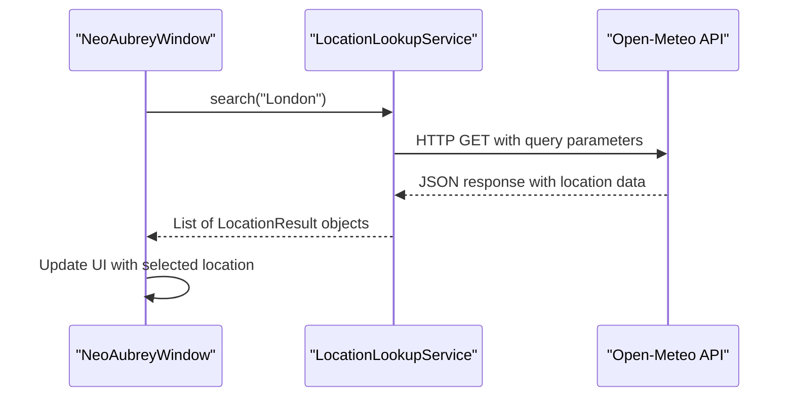
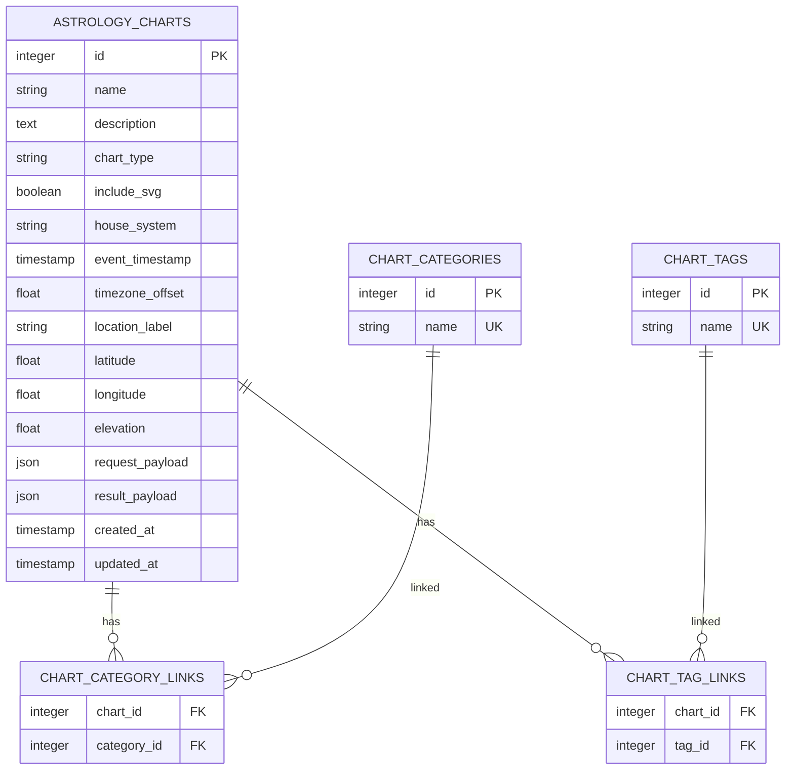
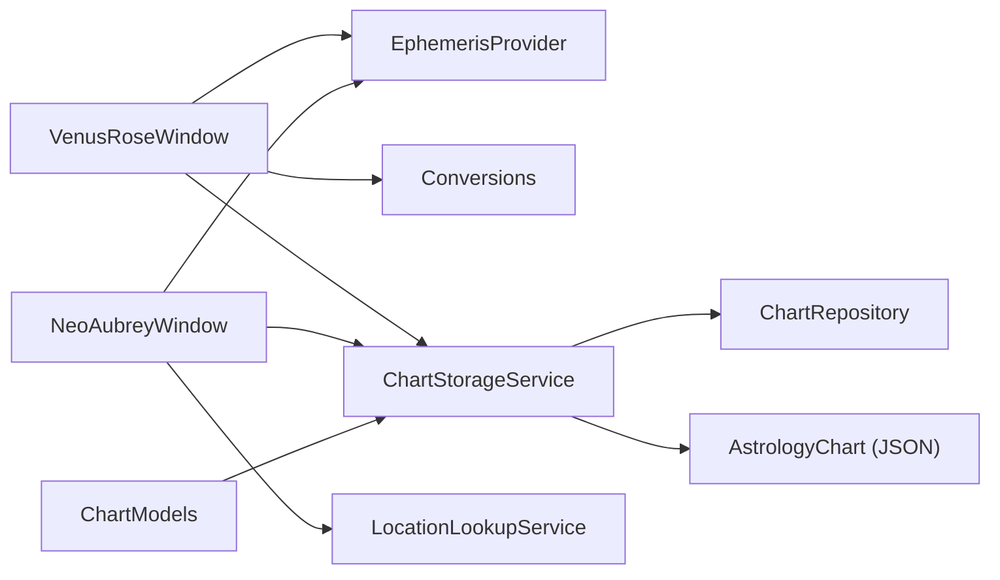

# Specialized Visualizations

<cite>
**Referenced Files in This Document**
- [venus_rose_window.py](file://src/pillars/astrology/ui/venus_rose_window.py)
- [neo_aubrey_window.py](file://src/pillars/astrology/ui/neo_aubrey_window.py)
- [astrology_hub.py](file://src/pillars/astrology/ui/astrology_hub.py)
- [ephemeris_provider.py](file://src/pillars/astrology/repositories/ephemeris_provider.py)
- [conversions.py](file://src/pillars/astrology/utils/conversions.py)
- [chart_models.py](file://src/pillars/astrology/models/chart_models.py)
- [chart_storage_service.py](file://src/pillars/astrology/services/chart_storage_service.py)
- [chart_repository.py](file://src/pillars/astrology/repositories/chart_repository.py)
- [chart_record.py](file://src/pillars/astrology/models/chart_record.py)
- [location_lookup.py](file://src/pillars/astrology/services/location_lookup.py)
</cite>

## Update Summary
**Changes Made**
- Updated Neo-Aubrey Eclipse Clock section to reflect real-time calculation using EphemerisProvider
- Added documentation for Lunar Nodes markers in the Neo-Aubrey visualization
- Documented location search functionality via LocationLookupService
- Enhanced eclipse detection details with Saros cycle logging capabilities
- Updated architecture overview and component analysis to reflect new features

## Table of Contents
1. [Introduction](#introduction)
2. [Project Structure](#project-structure)
3. [Core Components](#core-components)
4. [Architecture Overview](#architecture-overview)
5. [Detailed Component Analysis](#detailed-component-analysis)
6. [Dependency Analysis](#dependency-analysis)
7. [Performance Considerations](#performance-considerations)
8. [Troubleshooting Guide](#troubleshooting-guide)
9. [Conclusion](#conclusion)
10. [Appendices](#appendices)

## Introduction
This document explains the Specialized Visualizations component of the Astrology pillar, focusing on two dedicated UI windows that reveal harmonic and geometric relationships in planetary motion:
- The Cytherean Rose (Venus Rose): A generative visualization of the Pentagram of Venus (13:8 Earth–Venus resonance).
- The Neo-Aubrey Eclipse Clock: A dual-ring visualization tracking Saros (223) and Aubrey (56) eclipse cycles.

It covers how these visualizations are generated from planetary position data, including frequency mapping, angular spacing, and symmetry detection. It also documents configuration of harmonic multipliers, color schemes based on planetary rulerships, and overlaying sacred geometry templates. Persistence is handled through chart_storage_service and model extensions in chart_models.py. Performance optimization for real-time rendering of high-order harmonics and memory management during long-sequence visualizations is addressed, along with troubleshooting tips for display artifacts and synchronization errors. Finally, it explains how these visual forms integrate with Adyton’s 3D engine for immersive exploration.

## Project Structure
The Specialized Visualizations live under the Astrology pillar’s UI layer and rely on:
- UI windows for rendering and interaction
- Ephemeris provider for accurate heliocentric/geocentric positions
- Utilities for zodiacal conversions
- Persistence models and services for saving/loading chart data

**Diagram sources**
- [venus_rose_window.py](file://src/pillars/astrology/ui/venus_rose_window.py#L1-L605)
- [neo_aubrey_window.py](file://src/pillars/astrology/ui/neo_aubrey_window.py#L1-L487)
- [astrology_hub.py](file://src/pillars/astrology/ui/astrology_hub.py#L1-L127)
- [ephemeris_provider.py](file://src/pillars/astrology/repositories/ephemeris_provider.py#L1-L211)
- [location_lookup.py](file://src/pillars/astrology/services/location_lookup.py#L1-L94)
- [conversions.py](file://src/pillars/astrology/utils/conversions.py#L1-L37)
- [chart_models.py](file://src/pillars/astrology/models/chart_models.py#L1-L133)
- [chart_storage_service.py](file://src/pillars/astrology/services/chart_storage_service.py#L1-L205)
- [chart_repository.py](file://src/pillars/astrology/repositories/chart_repository.py#L1-L139)
- [chart_record.py](file://src/pillars/astrology/models/chart_record.py#L1-L99)

**Section sources**
- [venus_rose_window.py](file://src/pillars/astrology/ui/venus_rose_window.py#L1-L605)
- [neo_aubrey_window.py](file://src/pillars/astrology/ui/neo_aubrey_window.py#L1-L487)
- [astrology_hub.py](file://src/pillars/astrology/ui/astrology_hub.py#L1-L127)
- [ephemeris_provider.py](file://src/pillars/astrology/repositories/ephemeris_provider.py#L1-L211)
- [location_lookup.py](file://src/pillars/astrology/services/location_lookup.py#L1-L94)
- [conversions.py](file://src/pillars/astrology/utils/conversions.py#L1-L37)
- [chart_models.py](file://src/pillars/astrology/models/chart_models.py#L1-L133)
- [chart_storage_service.py](file://src/pillars/astrology/services/chart_storage_service.py#L1-L205)
- [chart_repository.py](file://src/pillars/astrology/repositories/chart_repository.py#L1-L139)
- [chart_record.py](file://src/pillars/astrology/models/chart_record.py#L1-L99)

## Core Components
- VenusRoseWindow: Renders the Pentagram of Venus using idealized 13:8 resonance or real ephemeris-derived heliocentric positions. It animates Earth and Venus, draws orbital traces, highlights conjunction points, and predicts future conjunctions with optional refinement to true heliocentric conjunction moments.
- NeoAubreyWindow: Renders Saros and Aubrey eclipse cycles on dual rings, moving markers according to synodic and sidereal rates. It supports fast-forward playback and date controls. Enhanced with real-time calculation using EphemerisProvider, Lunar Nodes markers, location search via LocationLookupService, and detailed eclipse detection with Saros cycle logging.
- EphemerisProvider: Singleton loader for astronomical ephemeris data, exposing geocentric and heliocentric positions and extended orbital data including speed and retrograde status.
- LocationLookupService: Service that queries the Open-Meteo geocoding API for city coordinates, enabling location-based astronomical calculations.
- Conversions: Utility for converting absolute ecliptic longitude to zodiacal degree notation.
- Chart models and storage: Data structures and persistence for chart requests/results, enabling saving/loading of visualization sessions and associated metadata.

**Section sources**
- [venus_rose_window.py](file://src/pillars/astrology/ui/venus_rose_window.py#L1-L605)
- [neo_aubrey_window.py](file://src/pillars/astrology/ui/neo_aubrey_window.py#L1-L487)
- [ephemeris_provider.py](file://src/pillars/astrology/repositories/ephemeris_provider.py#L1-L211)
- [location_lookup.py](file://src/pillars/astrology/services/location_lookup.py#L1-L94)
- [conversions.py](file://src/pillars/astrology/utils/conversions.py#L1-L37)
- [chart_models.py](file://src/pillars/astrology/models/chart_models.py#L1-L133)
- [chart_storage_service.py](file://src/pillars/astrology/services/chart_storage_service.py#L1-L205)

## Architecture Overview
The visualizations are interactive Qt windows backed by a Skyfield-based ephemeris provider. They compute angular positions from either:
- Idealized mean motion ratios (e.g., 13:8 resonance)
- Real ephemeris data (heliocentric longitude, speed, retrograde, elongation)

The Neo-Aubrey Eclipse Clock has been enhanced with real-time calculation using EphemerisProvider, Lunar Nodes markers, location search via LocationLookupService, and detailed eclipse detection with Saros cycle logging. The visualization now provides precise astronomical calculations for eclipse prediction and tracking.

**Diagram sources**
- [astrology_hub.py](file://src/pillars/astrology/ui/astrology_hub.py#L1-L127)
- [venus_rose_window.py](file://src/pillars/astrology/ui/venus_rose_window.py#L1-L605)
- [neo_aubrey_window.py](file://src/pillars/astrology/ui/neo_aubrey_window.py#L1-L487)
- [ephemeris_provider.py](file://src/pillars/astrology/repositories/ephemeris_provider.py#L1-L211)
- [location_lookup.py](file://src/pillars/astrology/services/location_lookup.py#L1-L94)
- [chart_storage_service.py](file://src/pillars/astrology/services/chart_storage_service.py#L1-L205)

## Detailed Component Analysis

### Venus Rose (Cytherean Rose)
Purpose:
- Visualize the 13:8 Earth–Venus orbital resonance as a static or animated pattern.
- Demonstrate heliocentric geometry and periodic conjunction points.

Key behaviors:
- Ideal vs. real physics modes:
  - Ideal: Fixed 13:8 ratio for Venus relative to Earth’s annual motion.
  - Real: Uses EphemerisProvider to compute heliocentric longitude and refine conjunction dates.
- Animation loop advances time by configurable steps, updating positions and drawing orbital traces.
- Conjunction highlighting with radial glow effects.
- Predictive table of upcoming inferior and superior conjunctions, with optional refinement to true heliocentric conjunction moments.

Algorithmic generation:
- Angular spacing:
  - Earth: rate = 360° / Earth orbital period.
  - Venus: rate = 13 × 360° / (8 × Earth orbital period) in ideal mode; otherwise derived from ephemeris.
- Symmetry detection:
  - The 13:8 resonance produces a five-petaled pentagram pattern over eight Earth years.
- Frequency mapping:
  - The “frequency” is implicit in the orbital periods and resulting angular velocities; the visualization emphasizes the ratio rather than explicit audio frequencies.

Configuration:
- Harmonic multipliers:
  - The ideal mode locks Venus to a 13:8 ratio; higher-order harmonics can be explored by adjusting the relative rates (e.g., multiples of 13 and 8) in the scene update logic.
- Color schemes:
  - Planetary colors are assigned per celestial body; conjunction highlights use radial gradients for visual emphasis.
- Sacred geometry overlays:
  - The zodiac ring and orbital circles can be extended to include angular templates (e.g., pentagram arms) by adding QGraphicsLineItem segments aligned to computed angles.

Persistence:
- ChartStorageService can serialize/deserialize ChartRequest and ChartResult payloads for saving visualization sessions and associated metadata.

Real-time rendering and memory:
- Trace lines are capped to a fixed count; older lines are removed to bound memory usage.
- Timer-driven animation runs at modest intervals; turbo mode increases time steps for long sequences.

Integration with Adyton:
- While the Venus Rose is a 2D Qt scene, its geometric patterns align with Adyton’s architectural themes. The visualization can be embedded as a 2D overlay or referenced as a symbolic template within immersive 3D environments.

**Diagram sources**
- [venus_rose_window.py](file://src/pillars/astrology/ui/venus_rose_window.py#L148-L207)
- [venus_rose_window.py](file://src/pillars/astrology/ui/venus_rose_window.py#L570-L605)

**Section sources**
- [venus_rose_window.py](file://src/pillars/astrology/ui/venus_rose_window.py#L1-L605)
- [ephemeris_provider.py](file://src/pillars/astrology/repositories/ephemeris_provider.py#L112-L178)
- [conversions.py](file://src/pillars/astrology/utils/conversions.py#L1-L37)
- [chart_storage_service.py](file://src/pillars/astrology/services/chart_storage_service.py#L1-L205)
- [chart_models.py](file://src/pillars/astrology/models/chart_models.py#L1-L133)

### Neo-Aubrey Eclipse Clock
Purpose:
- Visualize Saros (223) and Aubrey (56) eclipse cycles on dual concentric rings.
- Demonstrate long-term eclipse recurrence patterns and nodal precession.
- Enhanced with real-time calculation using EphemerisProvider, Lunar Nodes markers, location search via LocationLookupService, and detailed eclipse detection with Saros cycle logging.

Key behaviors:
- Dual rings:
  - Outer ring: Saros holes rotate at 1 hole per synodic month.
  - Inner ring: Aubrey holes track Sun, Moon, and Node positions scaled to the Aubrey cycle.
- Playback controls:
  - Play at 1-day or 1-month per tick; reset to current time.
- Visual markers:
  - Sun, Moon, North Node, South Node, and Saros hand markers move according to computed indices.
- Location search:
  - Integrated location search via LocationLookupService to enable geographically accurate eclipse calculations.
- Eclipse detection:
  - Detailed eclipse detection with Saros cycle logging that records solar and lunar eclipses with precise timing and positioning.

Algorithmic generation:
- Angular spacing:
  - Saros: index increments by 1 per synodic month.
  - Aubrey: Sun and Moon rates derived from known sidereal periods; Node moves retrogradely.
- Symmetry detection:
  - The 18-year Saros cycle emerges from the alignment of these rates.
- Frequency mapping:
  - The “frequency” is the rate of rotation per day across the ring indices.

Configuration:
- Harmonic multipliers:
  - Rates can be adjusted to explore higher-order harmonics (e.g., multiples of 223 and 56) by scaling the daily increments.
- Color schemes:
  - Distinct colors for Sun, Moon, Node, and Saros hand; stones are colored for major ticks.
- Sacred geometry overlays:
  - Major ticks and cardinal alignments can be emphasized by highlighting specific Aubrey indices.

Persistence:
- ChartStorageService can persist the current visualization state and associated metadata for later recall.

Real-time rendering and memory:
- The scene maintains discrete marker positions; memory usage remains bounded by the number of markers and their attributes.

Integration with Adyton:
- The Neo-Aubrey visualization complements Adyton’s architectural geometry, serving as a symbolic clock template for long-term cycles.

**Diagram sources**
- [neo_aubrey_window.py](file://src/pillars/astrology/ui/neo_aubrey_window.py#L130-L170)

**Section sources**
- [neo_aubrey_window.py](file://src/pillars/astrology/ui/neo_aubrey_window.py#L1-L487)
- [ephemeris_provider.py](file://src/pillars/astrology/repositories/ephemeris_provider.py#L69-L102)
- [location_lookup.py](file://src/pillars/astrology/services/location_lookup.py#L36-L88)
- [chart_storage_service.py](file://src/pillars/astrology/services/chart_storage_service.py#L1-L205)

### Ephemeris Provider and Data Flow
The ephemeris provider supplies:
- Heliocentric longitude and latitude
- Heliocentric speed (degrees per day)
- Geocentric elongation
- Retrograde flag
- Optional geocentric speed
- Osculating North Node of the Moon

These are used by the Venus Rose to refine conjunction dates and by the predictive table to annotate upcoming events. The Neo-Aubrey Eclipse Clock now utilizes the EphemerisProvider for real-time calculation of the Moon's osculating north node, enhancing the accuracy of eclipse predictions.

**Diagram sources**
- [venus_rose_window.py](file://src/pillars/astrology/ui/venus_rose_window.py#L495-L563)
- [neo_aubrey_window.py](file://src/pillars/astrology/ui/neo_aubrey_window.py#L374-L376)
- [ephemeris_provider.py](file://src/pillars/astrology/repositories/ephemeris_provider.py#L112-L178)

**Section sources**
- [ephemeris_provider.py](file://src/pillars/astrology/repositories/ephemeris_provider.py#L1-L211)
- [venus_rose_window.py](file://src/pillars/astrology/ui/venus_rose_window.py#L370-L428)
- [neo_aubrey_window.py](file://src/pillars/astrology/ui/neo_aubrey_window.py#L374-L376)

### Location Lookup Service
The LocationLookupService enables geographic location search for astronomical calculations:
- Queries the Open-Meteo geocoding API for city coordinates
- Returns structured LocationResult objects with latitude, longitude, and elevation
- Integrates with UI components to allow users to search for locations by name
- Supports selection from multiple candidates when multiple matches exist

This service is now integrated into the Neo-Aubrey Eclipse Clock, allowing users to search for specific locations to calculate geographically accurate eclipse events.

**Diagram sources**
- [neo_aubrey_window.py](file://src/pillars/astrology/ui/neo_aubrey_window.py#L302-L330)
- [location_lookup.py](file://src/pillars/astrology/services/location_lookup.py#L47-L87)

**Section sources**
- [location_lookup.py](file://src/pillars/astrology/services/location_lookup.py#L36-L88)
- [neo_aubrey_window.py](file://src/pillars/astrology/ui/neo_aubrey_window.py#L302-L330)

### Persistence and Model Extensions
Chart models define normalized request/result structures. ChartStorageService persists these to the database via ChartRepository, storing request and result payloads as JSON alongside location/time metadata and categorization.

**Diagram sources**
- [chart_record.py](file://src/pillars/astrology/models/chart_record.py#L1-L99)
- [chart_repository.py](file://src/pillars/astrology/repositories/chart_repository.py#L1-L139)
- [chart_storage_service.py](file://src/pillars/astrology/services/chart_storage_service.py#L1-L205)
- [chart_models.py](file://src/pillars/astrology/models/chart_models.py#L1-L133)

**Section sources**
- [chart_models.py](file://src/pillars/astrology/models/chart_models.py#L1-L133)
- [chart_storage_service.py](file://src/pillars/astrology/services/chart_storage_service.py#L1-L205)
- [chart_repository.py](file://src/pillars/astrology/repositories/chart_repository.py#L1-L139)
- [chart_record.py](file://src/pillars/astrology/models/chart_record.py#L1-L99)

## Dependency Analysis
- UI windows depend on:
  - EphemerisProvider for real-world positions
  - LocationLookupService for geographic coordinates
  - Conversions for zodiacal labeling
  - ChartStorageService for persistence
- Persistence depends on:
  - SQLAlchemy models and repository for storage
  - ChartStorageService for serialization/deserialization

**Diagram sources**
- [venus_rose_window.py](file://src/pillars/astrology/ui/venus_rose_window.py#L1-L605)
- [neo_aubrey_window.py](file://src/pillars/astrology/ui/neo_aubrey_window.py#L1-L487)
- [ephemeris_provider.py](file://src/pillars/astrology/repositories/ephemeris_provider.py#L1-L211)
- [location_lookup.py](file://src/pillars/astrology/services/location_lookup.py#L1-L94)
- [conversions.py](file://src/pillars/astrology/utils/conversions.py#L1-L37)
- [chart_storage_service.py](file://src/pillars/astrology/services/chart_storage_service.py#L1-L205)
- [chart_repository.py](file://src/pillars/astrology/repositories/chart_repository.py#L1-L139)
- [chart_record.py](file://src/pillars/astrology/models/chart_record.py#L1-L99)
- [chart_models.py](file://src/pillars/astrology/models/chart_models.py#L1-L133)

**Section sources**
- [venus_rose_window.py](file://src/pillars/astrology/ui/venus_rose_window.py#L1-L605)
- [neo_aubrey_window.py](file://src/pillars/astrology/ui/neo_aubrey_window.py#L1-L487)
- [ephemeris_provider.py](file://src/pillars/astrology/repositories/ephemeris_provider.py#L1-L211)
- [location_lookup.py](file://src/pillars/astrology/services/location_lookup.py#L1-L94)
- [chart_storage_service.py](file://src/pillars/astrology/services/chart_storage_service.py#L1-L205)

## Performance Considerations
- Trace line capping:
  - The Venus Rose limits the number of drawn trace lines to prevent unbounded memory growth. Adjust the cap based on desired history length and performance targets.
- Timer granularity:
  - Animation timers run at modest intervals; increase step size for long sequences (turbo mode) to reduce CPU load.
- Ephemeris loading:
  - The ephemeris provider loads asynchronously; guard against “not loaded” conditions and retry gracefully when data is unavailable.
- Rendering:
  - Use antialiasing judiciously; disable or reduce quality for heavy real-time sequences.
- Data structures:
  - Maintain lists of trace lines and highlights with bounded sizes; remove oldest entries when exceeding thresholds.

[No sources needed since this section provides general guidance]

## Troubleshooting Guide
Common issues and resolutions:
- Ephemeris not loaded:
  - Symptom: Exceptions raised when requesting extended data.
  - Resolution: Ensure the ephemeris provider has finished loading before invoking extended data; handle retries and display a loading indicator.
- Synchronization errors:
  - Symptom: Conjunction refinement fails to converge.
  - Resolution: Reduce search window or adjust tolerance; verify time zone handling for input datetimes.
- Display artifacts:
  - Symptom: Overdraw or flickering during rapid animation.
  - Resolution: Reduce trace count, simplify gradients, or lower refresh rate.
- Memory spikes during long sequences:
  - Symptom: Increased memory usage over time.
  - Resolution: Enforce strict caps on trace and highlight counts; periodically clear old items.
- Location lookup failures:
  - Symptom: Unable to find coordinates for a city name.
  - Resolution: Verify network connectivity and check that the Open-Meteo API is accessible; handle exceptions gracefully in the UI.

**Section sources**
- [ephemeris_provider.py](file://src/pillars/astrology/repositories/ephemeris_provider.py#L1-L211)
- [venus_rose_window.py](file://src/pillars/astrology/ui/venus_rose_window.py#L350-L404)
- [venus_rose_window.py](file://src/pillars/astrology/ui/venus_rose_window.py#L565-L605)
- [location_lookup.py](file://src/pillars/astrology/services/location_lookup.py#L59-L63)

## Conclusion
The Specialized Visualizations component brings deep harmonic and geometric insights into planetary motion through two distinct yet complementary views: the Venus Rose’s 13:8 resonance and the Neo-Aubrey Eclipse Clock’s Saros–Aubrey cycles. By combining idealized models with real ephemeris data, these windows enable both educational exploration and precise prediction. The Neo-Aubrey Eclipse Clock has been enhanced with real-time calculation using EphemerisProvider, Lunar Nodes markers, location search via LocationLookupService, and detailed eclipse detection with Saros cycle logging. Persistence and model extensions support saving and organizing visualization sessions, while performance strategies ensure smooth real-time rendering. Integration with Adyton’s 3D engine opens pathways for immersive, symbolic exploration of these cosmic patterns.

[No sources needed since this section summarizes without analyzing specific files]

## Appendices

### Configuration Examples
- Harmonic multipliers:
  - Ideal mode locks Venus to a 13:8 ratio; adjust the relative rates in the scene update logic to explore higher-order harmonics.
- Color schemes:
  - Planetary bodies and highlights use distinct colors; modify color constants to reflect planetary rulerships or thematic palettes.
- Sacred geometry overlays:
  - Add zodiac labels and orbital circles; extend to pentagram arms or Saros-aligned ticks by computing angles from orbital periods.

[No sources needed since this section provides general guidance]