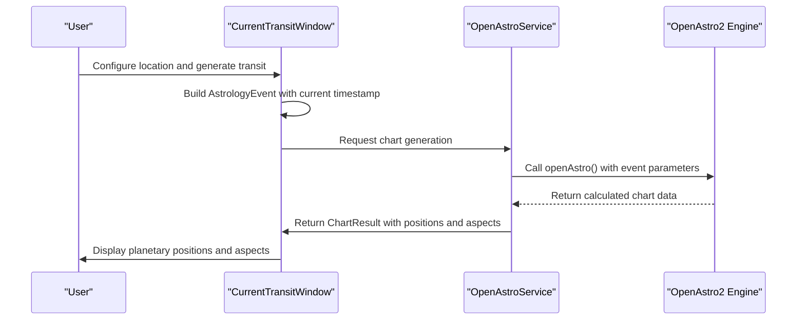
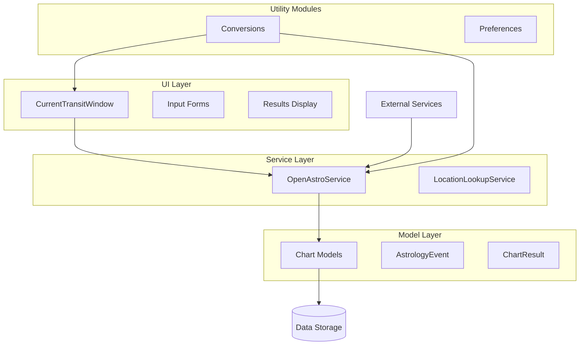
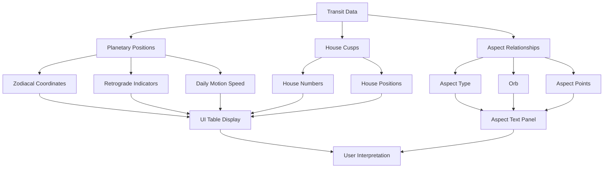
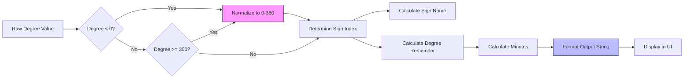

# Transit Dashboards

<cite>
**Referenced Files in This Document**   
- [current_transit_window.py](file://src/pillars/astrology/ui/current_transit_window.py)
- [openastro_service.py](file://src/pillars/astrology/services/openastro_service.py)
- [conversions.py](file://src/pillars/astrology/utils/conversions.py)
- [chart_models.py](file://src/pillars/astrology/models/chart_models.py)
- [location_lookup.py](file://src/pillars/astrology/services/location_lookup.py)
- [preferences.py](file://src/pillars/astrology/utils/preferences.py)
- [planetary_positions_window.py](file://src/pillars/astrology/ui/planetary_positions_window.py)
- [natal_chart_window.py](file://src/pillars/astrology/ui/natal_chart_window.py)
- [chart_record.py](file://src/pillars/astrology/models/chart_record.py)
</cite>

## Table of Contents
1. [Introduction](#introduction)
2. [Core Functionality](#core-functionality)
3. [Implementation Architecture](#implementation-architecture)
4. [Transit Analysis and Visualization](#transit-analysis-and-visualization)
5. [Configuration and Filtering](#configuration-and-filtering)
6. [Data Processing and Conversions](#data-processing-and-conversions)
7. [Performance Considerations](#performance-considerations)
8. [Integration and Export Capabilities](#integration-and-export-capabilities)
9. [Troubleshooting](#troubleshooting)
10. [Conclusion](#conclusion)

## Introduction
The Transit Dashboard feature within the Astrology pillar provides a comprehensive interface for analyzing planetary transits relative to a natal chart over time. This system enables users to visualize current astrological conditions, track planetary movements, and identify significant astrological events. The dashboard serves as a critical tool for astrological analysis, combining real-time planetary position calculations with intuitive visualizations and robust data export capabilities. The primary interface is implemented through the `current_transit_window.py` module, which orchestrates interactions between the user interface, data services, and external calculation engines.

**Section sources**
- [current_transit_window.py](file://src/pillars/astrology/ui/current_transit_window.py#L1-L523)
- [openastro_service.py](file://src/pillars/astrology/services/openastro_service.py#L1-L254)

## Core Functionality
The Transit Dashboard's core functionality revolves around analyzing planetary transits in relation to a natal chart over time. The system uses the `CurrentTransitWindow` class as its main interface, which provides a user-friendly GUI for generating and viewing current transit charts. The dashboard leverages the `OpenAstroService` to perform real-time planetary position calculations, accessing astronomical data through the OpenAstro2 library and Swiss Ephemeris data. When a user requests a transit analysis, the system creates an `AstrologyEvent` object containing the current timestamp and location data, which is then processed by the `OpenAstroService` to generate a comprehensive chart.

The transit analysis process begins with the user configuring their location parameters, including latitude, longitude, elevation, and timezone offset. The system supports both manual input and automated location lookup through the `LocationLookupService`, which queries the Open-Meteo geocoding API to resolve city names to geographic coordinates. Once the location is established, the system generates a transit chart by calculating the positions of all major celestial bodies (Sun, Moon, planets, and lunar nodes) at the current moment. The results include planetary positions in zodiacal coordinates, house cusp locations, and aspect relationships between celestial bodies.

**Diagram sources**
- [current_transit_window.py](file://src/pillars/astrology/ui/current_transit_window.py#L51-L523)
- [openastro_service.py](file://src/pillars/astrology/services/openastro_service.py#L31-L254)
- [chart_models.py](file://src/pillars/astrology/models/chart_models.py#L8-L133)

**Section sources**
- [current_transit_window.py](file://src/pillars/astrology/ui/current_transit_window.py#L51-L523)
- [openastro_service.py](file://src/pillars/astrology/services/openastro_service.py#L31-L254)
- [chart_models.py](file://src/pillars/astrology/models/chart_models.py#L8-L133)

## Implementation Architecture
The Transit Dashboard implementation follows a modular architecture with clear separation of concerns between user interface, business logic, and data services. The system is organized into several key components: the UI layer (`current_transit_window.py`), the service layer (`openastro_service.py`), the model layer (`chart_models.py`), and utility modules for data conversion and preferences management. This architecture enables maintainability, testability, and extensibility of the transit analysis functionality.

The UI layer is implemented as a PyQt6-based window that provides form inputs for location configuration, action buttons for generating and exporting transit data, and display components for showing planetary positions and aspects. The service layer acts as an orchestration layer between the UI and the underlying OpenAstro2 library, handling the translation of high-level chart requests into low-level API calls. The model layer defines data structures for representing astrological concepts such as events, charts, and planetary positions using Python dataclasses. Utility modules provide supporting functionality for coordinate conversions, location lookup, and user preferences storage.

**Diagram sources**
- [current_transit_window.py](file://src/pillars/astrology/ui/current_transit_window.py#L51-L523)
- [openastro_service.py](file://src/pillars/astrology/services/openastro_service.py#L31-L254)
- [chart_models.py](file://src/pillars/astrology/models/chart_models.py#L8-L133)
- [location_lookup.py](file://src/pillars/astrology/services/location_lookup.py#L1-L90)
- [preferences.py](file://src/pillars/astrology/utils/preferences.py#L1-L59)

**Section sources**
- [current_transit_window.py](file://src/pillars/astrology/ui/current_transit_window.py#L51-L523)
- [openastro_service.py](file://src/pillars/astrology/services/openastro_service.py#L31-L254)
- [chart_models.py](file://src/pillars/astrology/models/chart_models.py#L8-L133)

## Transit Analysis and Visualization
The Transit Dashboard provides comprehensive visualization of transit aspects, duration overlays, and trigger points for astrological events. The system displays planetary positions in a tabular format showing each celestial body's name and its zodiacal position, formatted using the `to_zodiacal_string` function from the `conversions.py` module. This function converts decimal degrees into traditional astrological notation (degrees, sign, minutes), making the data more accessible to users familiar with astrological conventions.

The dashboard visualizes transit aspects through a dedicated text panel that displays aspect information in JSON format, showing relationships between planets such as conjunctions, oppositions, trines, and squares. These aspects are calculated by the OpenAstro2 engine and extracted from the chart result by the `OpenAstroService`. The system also supports SVG visualization of the transit chart, which can be exported or opened in a web browser for detailed examination. The SVG rendering is handled by the `makeSVG2` method of the OpenAstro2 chart object, which generates a comprehensive visual representation of the astrological chart including planetary positions, house cusps, and aspect lines.

For long-term transit analysis, the system integrates with the `PlanetaryPositionsWindow` which provides ephemeris-style tables showing planetary positions over configurable time ranges. This allows users to identify retrograde cycles, planetary stations, and other significant astrological patterns. The ephemeris view supports filtering by planet and time step, enabling detailed analysis of specific planetary movements. Retrograde motion is indicated in the output with "(R)" notation, and daily motion speed is displayed in degrees per day, providing additional context for interpreting planetary influences.

**Diagram sources**
- [current_transit_window.py](file://src/pillars/astrology/ui/current_transit_window.py#L209-L339)
- [conversions.py](file://src/pillars/astrology/utils/conversions.py#L1-L37)
- [openastro_service.py](file://src/pillars/astrology/services/openastro_service.py#L214-L224)
- [planetary_positions_window.py](file://src/pillars/astrology/ui/planetary_positions_window.py#L75-L466)

**Section sources**
- [current_transit_window.py](file://src/pillars/astrology/ui/current_transit_window.py#L209-L339)
- [conversions.py](file://src/pillars/astrology/utils/conversions.py#L1-L37)
- [openastro_service.py](file://src/pillars/astrology/services/openastro_service.py#L214-L224)

## Configuration and Filtering
The Transit Dashboard provides extensive configuration options for customizing transit analysis and filtering results by various criteria. Users can configure their location either manually by entering latitude, longitude, and elevation, or automatically by searching for a city name using the integrated geocoding functionality. The system supports saving and loading default locations through the `AstrologyPreferences` class, which stores location data in a JSON file for quick access in future sessions.

The dashboard allows users to filter transit analysis by specific planets or aspect types through the integration with the `PlanetaryPositionsWindow`. This companion interface enables users to select which celestial bodies to include in the ephemeris output, with checkboxes for all major planets, the Sun, Moon, and lunar nodes. Users can also configure the time range and step size for the transit analysis, allowing them to examine planetary positions at daily, hourly, or custom intervals. The system enforces a maximum of 240 timestamps to maintain UI responsiveness during long-term transit sequence rendering.

For synastry analysis, the system can be extended to compare transit positions with natal chart positions, though this functionality is primarily implemented in the `NatalChartWindow` class. The transit dashboard focuses on current conditions but shares the same underlying data models and service layer, allowing for consistent interpretation of planetary positions across different astrological applications. The filtering and configuration options are designed to support both quick overviews of current transits and detailed analysis of specific planetary movements over time.

**Section sources**
- [current_transit_window.py](file://src/pillars/astrology/ui/current_transit_window.py#L123-L165)
- [preferences.py](file://src/pillars/astrology/utils/preferences.py#L1-L59)
- [planetary_positions_window.py](file://src/pillars/astrology/ui/planetary_positions_window.py#L192-L214)
- [natal_chart_window.py](file://src/pillars/astrology/ui/natal_chart_window.py#L145-L224)

## Data Processing and Conversions
The Transit Dashboard relies on the `conversions.py` module for critical date/time transformations and coordinate system conversions. The primary function in this module, `to_zodiacal_string`, converts decimal degrees (0-360) into traditional zodiacal notation that includes degrees, sign name, and minutes. This conversion is essential for presenting planetary positions in a format familiar to astrologers, transforming raw numerical data into meaningful astrological information. The function uses a lookup table of zodiac signs and mathematical operations to determine the appropriate sign based on the degree value and calculate the minute component.

Date and time processing is handled through Python's datetime module with timezone awareness provided by the pytz library. The system stores timestamps in UTC and converts them to local time based on the user's specified timezone offset. This ensures accurate calculation of planetary positions regardless of the user's location. Geographic coordinates are validated to ensure they fall within acceptable ranges (latitude: -90 to 90, longitude: -180 to 180) before being passed to the calculation engine. The `GeoLocation` dataclass enforces these constraints through its `__post_init__` method, raising ValueError exceptions for invalid coordinates.

The data flow for coordinate conversions follows a standardized pattern: raw calculation results from OpenAstro2 are extracted into `ChartResult` objects, which are then processed by the UI layer using conversion functions to produce user-friendly output. This separation of raw data and presentation allows for consistent formatting across different views and potential localization of output in future versions. The conversion system is designed to be extensible, allowing for additional formatting options or coordinate systems to be added without modifying the core calculation logic.

**Diagram sources**
- [conversions.py](file://src/pillars/astrology/utils/conversions.py#L1-L37)
- [chart_models.py](file://src/pillars/astrology/models/chart_models.py#L8-L133)

**Section sources**
- [conversions.py](file://src/pillars/astrology/utils/conversions.py#L1-L37)
- [chart_models.py](file://src/pillars/astrology/models/chart_models.py#L8-L133)

## Performance Considerations
The Transit Dashboard incorporates several performance optimizations to handle the computational demands of rendering long-term transit sequences and managing retrograde cycles. The system implements a maximum timestamp limit of 240 in the `PlanetaryPositionsWindow` to prevent UI freezing during extensive ephemeris generation. This safeguard ensures that even when users configure long time ranges with small step sizes, the system remains responsive and avoids excessive memory consumption.

For retrograde cycle analysis, the system efficiently processes planetary motion data by extracting retrograde indicators and daily motion speeds directly from the OpenAstro2 calculation results. Rather than recalculating these values, the dashboard leverages the pre-computed data in the chart's raw payload, specifically the "planets_retrograde" and "planets_speed" fields. This approach minimizes processing overhead and ensures consistency with the primary calculation engine's interpretation of retrograde motion.

The UI implements several performance-enhancing patterns, including the use of Qt's busy cursor during calculation periods to provide user feedback, and the deferral of expensive operations like SVG rendering until explicitly requested. The system also employs efficient data structures such as dictionaries for caching location lookup results and maintaining references to dialog windows to avoid unnecessary recreation. When rendering transit sequences, the system batches chart generation requests and processes them sequentially to avoid overwhelming the OpenAstro2 engine, which may have internal resource constraints.

**Section sources**
- [planetary_positions_window.py](file://src/pillars/astrology/ui/planetary_positions_window.py#L72-L466)
- [openastro_service.py](file://src/pillars/astrology/services/openastro_service.py#L246-L253)
- [current_transit_window.py](file://src/pillars/astrology/ui/current_transit_window.py#L258-L287)

## Integration and Export Capabilities
The Transit Dashboard provides robust integration and export capabilities that enable users to share transit data and incorporate it into other workflows. The system supports SVG export of transit charts, allowing users to save high-quality vector graphics for use in reports, presentations, or document annotations. The export functionality is implemented through the `_export_svg` method in `current_transit_window.py`, which writes the SVG document string to a user-specified file path. Users can also open the SVG directly in their default web browser or Chrome for interactive exploration.

For integration with TQ pattern analysis and other systems, the dashboard exposes raw transit data in JSON format through the aspects text panel. This structured data includes planetary positions, aspect relationships, and house cusps, which can be parsed and processed by external tools. The system also supports CSV export of ephemeris data through the `PlanetaryPositionsWindow`, enabling time-series analysis of planetary movements in spreadsheet applications or data analysis tools. The CSV export includes timestamps, planetary positions in zodiacal notation, retrograde indicators, and daily motion speeds.

The transit data model is designed to be compatible with the chart storage system implemented in `chart_record.py`, allowing transit charts to be saved alongside natal charts with associated metadata such as categories, tags, and notes. This integration enables users to build a comprehensive collection of transit analyses that can be searched, retrieved, and compared over time. The shared data model between transit and natal charts ensures consistency in data representation and facilitates cross-chart analysis.

**Section sources**
- [current_transit_window.py](file://src/pillars/astrology/ui/current_transit_window.py#L436-L449)
- [planetary_positions_window.py](file://src/pillars/astrology/ui/planetary_positions_window.py#L401-L419)
- [chart_record.py](file://src/pillars/astrology/models/chart_record.py#L1-L99)
- [natal_chart_window.py](file://src/pillars/astrology/ui/natal_chart_window.py#L611-L637)

## Troubleshooting
The Transit Dashboard includes comprehensive error handling and troubleshooting features to address common issues with synchronization and external data dependencies. When the OpenAstro2 library is not available, the system raises an `OpenAstroNotAvailableError` with instructions for installation, preventing the UI from attempting calculations that would inevitably fail. Location lookup errors are handled gracefully with user-friendly messages that explain why a city search might not return results, such as network connectivity issues or no matching locations found.

For synchronization issues with external ephemeris data, the system provides diagnostic information through its status reporting mechanism. The `status_label` in the UI displays real-time feedback about the current operation, including error messages when chart generation fails. The underlying `OpenAstroService` logs detailed information about chart generation attempts, which can be accessed for debugging purposes. When SVG rendering fails, the system continues to provide the textual data representation, ensuring that users can still access the core astrological information even if the visual component is unavailable.

Common troubleshooting steps for users include verifying that OpenAstro2 is properly installed via pip, checking internet connectivity for location lookups, ensuring sufficient system resources for calculation tasks, and validating that location coordinates are within acceptable ranges. The system's modular design allows for isolated testing of components, making it easier to identify whether issues stem from the UI, service layer, or external dependencies. For persistent synchronization issues, users can try regenerating the transit chart or restarting the application to clear any transient state that might be causing problems.

**Section sources**
- [current_transit_window.py](file://src/pillars/astrology/ui/current_transit_window.py#L259-L278)
- [openastro_service.py](file://src/pillars/astrology/services/openastro_service.py#L83-L91)
- [location_lookup.py](file://src/pillars/astrology/services/location_lookup.py#L57-L58)
- [current_transit_window.py](file://src/pillars/astrology/ui/current_transit_window.py#L511-L514)

## Conclusion
The Transit Dashboard feature provides a comprehensive solution for analyzing planetary transits relative to natal charts over time. By leveraging the OpenAstro2 library for accurate planetary position calculations and implementing an intuitive user interface through PyQt6, the system bridges the gap between complex astronomical computations and accessible astrological interpretation. The modular architecture with clear separation between UI, service, and model layers ensures maintainability and extensibility, while the integration of location lookup, data conversion, and export capabilities creates a complete workflow for astrological analysis.

The dashboard's ability to visualize transit aspects, duration overlays, and trigger points for astrological events makes it a valuable tool for both professional astrologers and enthusiasts. Its support for configuration, filtering, and long-term transit sequence analysis enables detailed examination of planetary movements, including retrograde cycles and other significant patterns. The system's performance optimizations and robust error handling ensure reliable operation even during intensive calculation tasks, while the export capabilities facilitate integration with other analytical tools and documentation workflows.

Future enhancements could include more sophisticated visualization options, automated detection of significant transit periods, integration with calendar systems for event planning, and enhanced synastry analysis capabilities. The existing foundation provides a solid platform for these extensions, demonstrating the effectiveness of the current implementation in meeting the core requirements of transit analysis within the Astrology pillar.