# Document Editing System

<cite>
**Referenced Files in This Document**
- [document_editor_window.py](file://src/pillars/document_manager/ui/document_editor_window.py)
- [rich_text_editor.py](file://src/pillars/document_manager/ui/rich_text_editor.py)
- [ribbon_widget.py](file://src/pillars/document_manager/ui/ribbon_widget.py)
- [image_features.py](file://src/pillars/document_manager/ui/image_features.py)
- [table_features.py](file://src/pillars/document_manager/ui/table_features.py)
- [list_features.py](file://src/pillars/document_manager/ui/list_features.py)
- [parsers.py](file://src/pillars/document_manager/utils/parsers.py)
- [document_service.py](file://src/pillars/document_manager/services/document_service.py)
- [document_repository.py](file://src/pillars/document_manager/repositories/document_repository.py)
- [verse_edit_log_repository.py](file://src/pillars/document_manager/repositories/verse_edit_log_repository.py)
- [document.py](file://src/pillars/document_manager/models/document.py)
- [document_verse.py](file://src/pillars/document_manager/models/document_verse.py)
- [document_manager_hub.py](file://src/pillars/document_manager/ui/document_manager_hub.py)
- [document_library.py](file://src/pillars/document_manager/ui/document_library.py)
- [document_search_window.py](file://src/pillars/document_manager/ui/document_search_window.py)
- [search_features.py](file://src/pillars/document_manager/ui/search_features.py)
- [search_repository.py](file://src/pillars/document_manager/repositories/search_repository.py)
</cite>

## Table of Contents
1. [Introduction](#introduction)
2. [Project Structure](#project-structure)
3. [Core Components](#core-components)
4. [Architecture Overview](#architecture-overview)
5. [Detailed Component Analysis](#detailed-component-analysis)
6. [Dependency Analysis](#dependency-analysis)
7. [Performance Considerations](#performance-considerations)
8. [Troubleshooting Guide](#troubleshooting-guide)
9. [Conclusion](#conclusion)
10. [Appendices](#appendices)

## Introduction
This document explains the Document Editing System within the Document Manager pillar. It focuses on document_editor_window as the primary editing interface, integrating rich_text_editor for formatted text handling and the Ribbon UI for tool access. It covers embedded media (images), structured data (tables), and ordered/unordered content (lists). It also documents the document model, versioning via verse_edit_log_repository, and persistence via document_repository. Integration with parsers.py enables ingestion of DOCX, PDF, RTF, and other formats. The document explains how edits propagate through the service layer to storage, common editing issues, performance considerations for large documents, and accessibility features.

## Project Structure
The Document Manager pillar organizes editing UI, model definitions, repositories, and services under src/pillars/document_manager. The editing UI is composed of:
- document_editor_window.py: The main editor window hosting rich_text_editor and menu actions.
- rich_text_editor.py: The rich text widget with Ribbon UI and integrated features.
- ribbon_widget.py: The Ribbon UI container and groups.
- image_features.py: Image insertion, cropping, and property dialogs.
- table_features.py: Table creation, editing, and property dialogs.
- list_features.py: Bullet/numbered lists and indentation.
- parsers.py: File ingestion for DOCX, PDF, RTF, HTML, TXT.
- document_service.py: Orchestrates persistence, indexing, and link updates.
- document_repository.py: CRUD operations for Document model.
- verse_edit_log_repository.py: Audit logs for verse edits.
- document.py and document_verse.py: ORM models for documents and curated verses.
- UI hubs and windows: document_manager_hub.py, document_library.py, document_search_window.py, search_features.py, and search_repository.py.

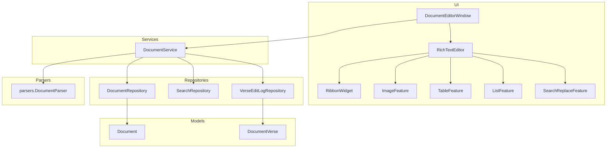

**Diagram sources**
- [document_editor_window.py](file://src/pillars/document_manager/ui/document_editor_window.py#L1-L329)
- [rich_text_editor.py](file://src/pillars/document_manager/ui/rich_text_editor.py#L1-L561)
- [ribbon_widget.py](file://src/pillars/document_manager/ui/ribbon_widget.py#L1-L118)
- [image_features.py](file://src/pillars/document_manager/ui/image_features.py#L1-L589)
- [table_features.py](file://src/pillars/document_manager/ui/table_features.py#L1-L798)
- [list_features.py](file://src/pillars/document_manager/ui/list_features.py#L1-L108)
- [parsers.py](file://src/pillars/document_manager/utils/parsers.py#L1-L275)
- [document_service.py](file://src/pillars/document_manager/services/document_service.py#L1-L257)
- [document_repository.py](file://src/pillars/document_manager/repositories/document_repository.py#L1-L86)
- [search_repository.py](file://src/pillars/document_manager/repositories/search_repository.py#L1-L201)
- [verse_edit_log_repository.py](file://src/pillars/document_manager/repositories/verse_edit_log_repository.py#L1-L45)
- [document.py](file://src/pillars/document_manager/models/document.py#L1-L47)
- [document_verse.py](file://src/pillars/document_manager/models/document_verse.py#L1-L104)

**Section sources**
- [document_editor_window.py](file://src/pillars/document_manager/ui/document_editor_window.py#L1-L329)
- [rich_text_editor.py](file://src/pillars/document_manager/ui/rich_text_editor.py#L1-L561)
- [parsers.py](file://src/pillars/document_manager/utils/parsers.py#L1-L275)
- [document_service.py](file://src/pillars/document_manager/services/document_service.py#L1-L257)
- [document_repository.py](file://src/pillars/document_manager/repositories/document_repository.py#L1-L86)
- [search_repository.py](file://src/pillars/document_manager/repositories/search_repository.py#L1-L201)
- [document.py](file://src/pillars/document_manager/models/document.py#L1-L47)
- [document_verse.py](file://src/pillars/document_manager/models/document_verse.py#L1-L104)

## Core Components
- DocumentEditorWindow: Hosts rich_text_editor, provides File menu actions (New, Open, Save, Save As, Export PDF), manages unsaved changes, and integrates wiki-link selection.
- RichTextEditor: Provides Ribbon UI, formatting, styles, find/replace, and integrates ImageFeature, TableFeature, ListFeature, and SearchReplaceFeature.
- RibbonWidget: A styled tabbed toolbar container for organizing tool groups.
- ImageFeature: Inserts edited images, supports cropping and properties dialogs, and sets alignment/margins.
- TableFeature: Creates and edits tables, merges/splits cells, adjusts borders, cell padding, and column widths.
- ListFeature: Toggles bullet/numbered lists and manages indentation/outdentation.
- parsers.DocumentParser: Converts DOCX, PDF, RTF, HTML, TXT to text and HTML for editing and indexing.
- DocumentService: Coordinates import, update, search, and link parsing; manages search index; provides context-managed sessions.
- DocumentRepository: CRUD operations for Document model with deferred content for metadata-heavy queries.
- SearchRepository: Whoosh-backed search index with schema, indexing, and search.
- VerseEditLogRepository: Audit logging for verse edits and teaching actions.
- Document and DocumentVerse models: Document stores title, content, raw_content, metadata; DocumentVerse stores curated segments and edit logs.

**Section sources**
- [document_editor_window.py](file://src/pillars/document_manager/ui/document_editor_window.py#L1-L329)
- [rich_text_editor.py](file://src/pillars/document_manager/ui/rich_text_editor.py#L1-L561)
- [ribbon_widget.py](file://src/pillars/document_manager/ui/ribbon_widget.py#L1-L118)
- [image_features.py](file://src/pillars/document_manager/ui/image_features.py#L1-L589)
- [table_features.py](file://src/pillars/document_manager/ui/table_features.py#L1-L798)
- [list_features.py](file://src/pillars/document_manager/ui/list_features.py#L1-L108)
- [parsers.py](file://src/pillars/document_manager/utils/parsers.py#L1-L275)
- [document_service.py](file://src/pillars/document_manager/services/document_service.py#L1-L257)
- [document_repository.py](file://src/pillars/document_manager/repositories/document_repository.py#L1-L86)
- [search_repository.py](file://src/pillars/document_manager/repositories/search_repository.py#L1-L201)
- [verse_edit_log_repository.py](file://src/pillars/document_manager/repositories/verse_edit_log_repository.py#L1-L45)
- [document.py](file://src/pillars/document_manager/models/document.py#L1-L47)
- [document_verse.py](file://src/pillars/document_manager/models/document_verse.py#L1-L104)

## Architecture Overview
The editing system follows a layered architecture:
- UI Layer: DocumentEditorWindow hosts RichTextEditor and menus. RichTextEditor composes RibbonWidget and feature modules.
- Service Layer: DocumentService orchestrates parsing, persistence, indexing, and link updates.
- Repository Layer: DocumentRepository, SearchRepository, and VerseEditLogRepository encapsulate persistence.
- Model Layer: Document and DocumentVerse define the data schema.
- Parser Integration: parsers.DocumentParser converts external formats to editable HTML/text.

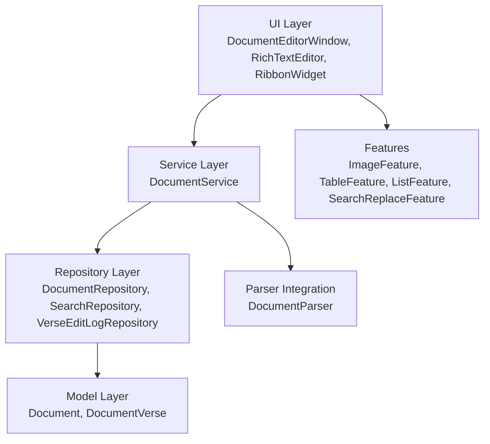

**Diagram sources**
- [document_editor_window.py](file://src/pillars/document_manager/ui/document_editor_window.py#L1-L329)
- [rich_text_editor.py](file://src/pillars/document_manager/ui/rich_text_editor.py#L1-L561)
- [document_service.py](file://src/pillars/document_manager/services/document_service.py#L1-L257)
- [document_repository.py](file://src/pillars/document_manager/repositories/document_repository.py#L1-L86)
- [search_repository.py](file://src/pillars/document_manager/repositories/search_repository.py#L1-L201)
- [verse_edit_log_repository.py](file://src/pillars/document_manager/repositories/verse_edit_log_repository.py#L1-L45)
- [parsers.py](file://src/pillars/document_manager/utils/parsers.py#L1-L275)
- [document.py](file://src/pillars/document_manager/models/document.py#L1-L47)
- [document_verse.py](file://src/pillars/document_manager/models/document_verse.py#L1-L104)

## Detailed Component Analysis

### DocumentEditorWindow
Responsibilities:
- Provides File menu actions: New, Open, Save, Save As, Export PDF.
- Integrates RichTextEditor and emits signals for text changes and wiki-link requests.
- Manages unsaved changes with a confirmation dialog.
- Loads documents from database (HTML preferred if present) or local files.
- Highlights search terms when opening from library/search.

Key behaviors:
- Wiki-link insertion triggers a selection dialog that queries DocumentService for metadata and inserts a title-based link into the editor.
- Saving writes either to database (service.update_document) or to a local HTML file depending on context.
- Export PDF uses QPrinter to render the editor’s content to PDF.

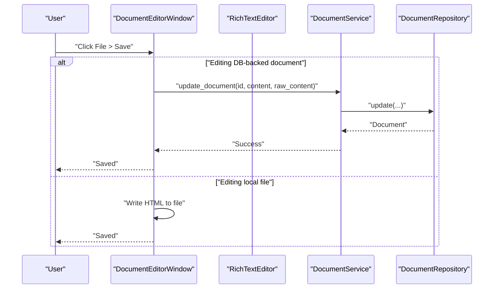

**Diagram sources**
- [document_editor_window.py](file://src/pillars/document_manager/ui/document_editor_window.py#L243-L280)
- [document_service.py](file://src/pillars/document_manager/services/document_service.py#L152-L172)
- [document_repository.py](file://src/pillars/document_manager/repositories/document_repository.py#L64-L71)

**Section sources**
- [document_editor_window.py](file://src/pillars/document_manager/ui/document_editor_window.py#L1-L329)

### RichTextEditor and Ribbon UI
Responsibilities:
- Hosts RibbonWidget with Home and Insert tabs.
- Home tab: Clipboard, Styles, Font, Paragraph, Edit.
- Insert tab: Tables, Illustrations, Symbols.
- Integrates SearchReplaceFeature, ImageFeature, TableFeature, ListFeature.
- Emits text_changed and wiki_link_requested signals.

Formatting and styles:
- Supports semantic styles (Title, Heading 1/2/3, Normal, Code) applied via HTML insertion to ensure consistent rendering.
- Provides find/replace dialog with case-sensitive and whole-word options.

Accessibility:
- Uses placeholder text and keyboard shortcuts (Ctrl+F).
- Virtual keyboard integration for specialized layouts.

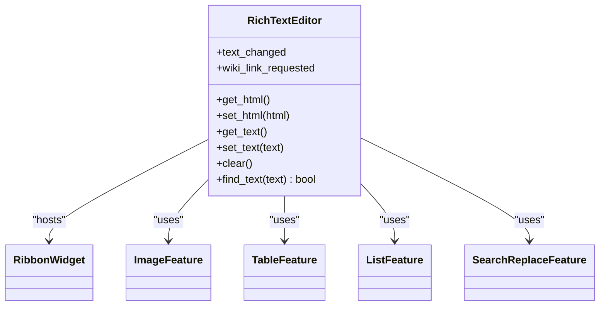

**Diagram sources**
- [rich_text_editor.py](file://src/pillars/document_manager/ui/rich_text_editor.py#L1-L561)
- [ribbon_widget.py](file://src/pillars/document_manager/ui/ribbon_widget.py#L1-L118)
- [image_features.py](file://src/pillars/document_manager/ui/image_features.py#L432-L589)
- [table_features.py](file://src/pillars/document_manager/ui/table_features.py#L441-L798)
- [list_features.py](file://src/pillars/document_manager/ui/list_features.py#L1-L108)
- [search_features.py](file://src/pillars/document_manager/ui/search_features.py#L1-L365)

**Section sources**
- [rich_text_editor.py](file://src/pillars/document_manager/ui/rich_text_editor.py#L1-L561)
- [ribbon_widget.py](file://src/pillars/document_manager/ui/ribbon_widget.py#L1-L118)
- [search_features.py](file://src/pillars/document_manager/ui/search_features.py#L1-L365)

### ImageFeature
Capabilities:
- Opens an image editor dialog with resizing, cropping, rotation, flipping, brightness/contrast adjustments.
- Inserts images into the document with configurable display size, alignment, and margins.
- Provides an image properties dialog to adjust width/height and other attributes.

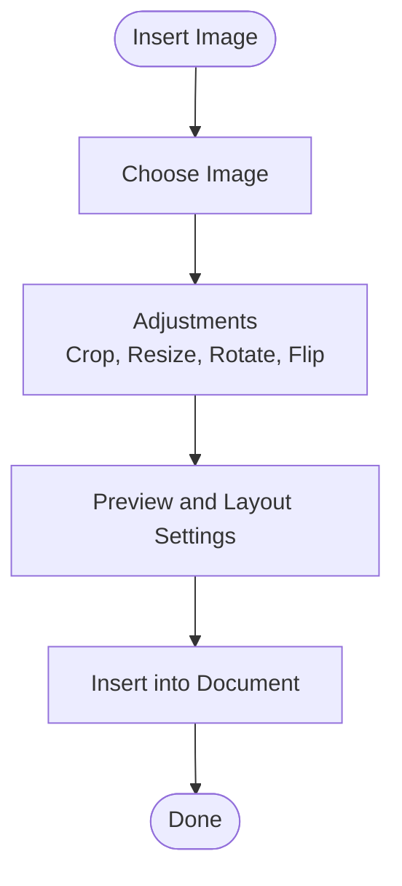

**Diagram sources**
- [image_features.py](file://src/pillars/document_manager/ui/image_features.py#L91-L589)

**Section sources**
- [image_features.py](file://src/pillars/document_manager/ui/image_features.py#L1-L589)

### TableFeature
Capabilities:
- Insert table with rows/columns, width, border, and spacing.
- Edit table properties (width, border, cell spacing/padding).
- Adjust column widths and distribute evenly.
- Merge/split cells, set cell background color, and edit individual cell borders and vertical alignment.
- Delete rows/columns/tables.

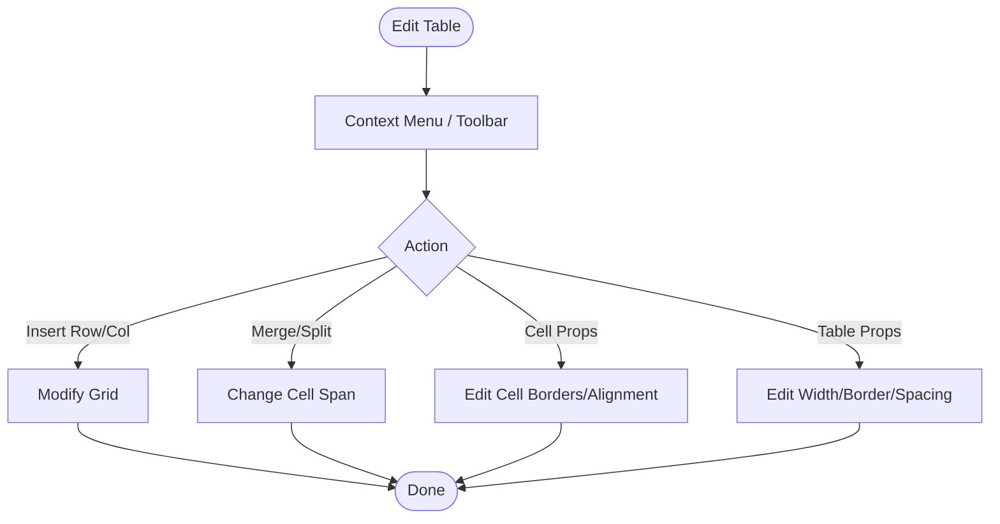

**Diagram sources**
- [table_features.py](file://src/pillars/document_manager/ui/table_features.py#L441-L798)

**Section sources**
- [table_features.py](file://src/pillars/document_manager/ui/table_features.py#L1-L798)

### ListFeature
Capabilities:
- Toggle bullet/numbered lists for selected paragraphs.
- Increase/decrease indentation for lists and paragraphs.
- Preserve list style when switching between bullet and number formats.

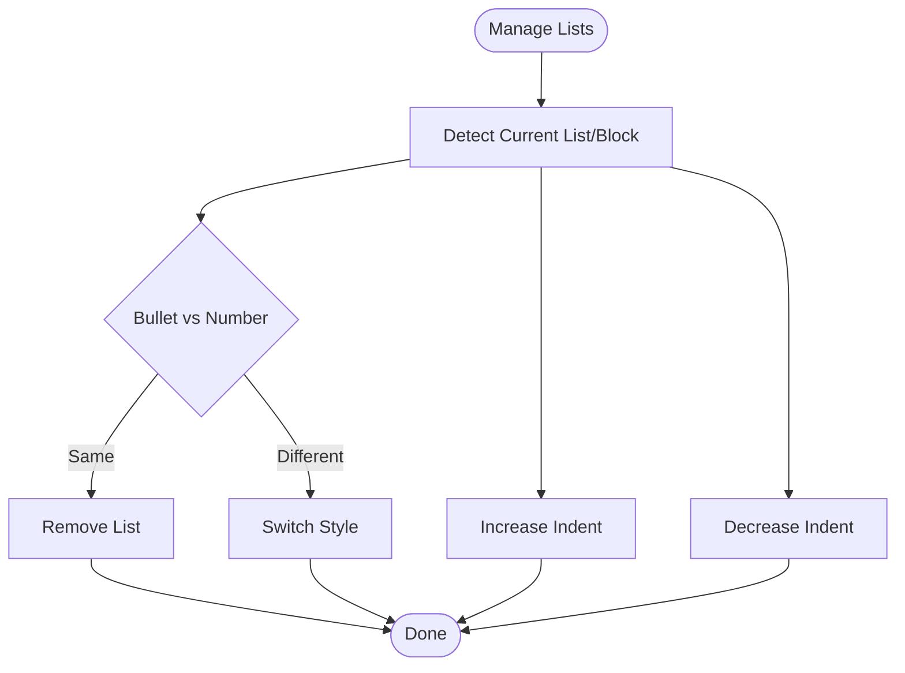

**Diagram sources**
- [list_features.py](file://src/pillars/document_manager/ui/list_features.py#L1-L108)

**Section sources**
- [list_features.py](file://src/pillars/document_manager/ui/list_features.py#L1-L108)

### Document Model and Persistence
Document model:
- Stores title, file_path, file_type, content (searchable text), raw_content (HTML/RTF), tags, author, collection, timestamps.
- Defines outgoing_links relationship for wiki-style linking.

Persistence:
- DocumentRepository provides get, get_all, get_all_metadata (deferred content), search, create, update, delete, and delete_all.
- DocumentService coordinates import/update, link parsing, and search index updates.
- SearchRepository maintains a Whoosh index for fast search across title, content, tags, author, and collection.

Versioning and audit:
- VerseEditLogRepository logs actions for DocumentVerse edits and rule applications.

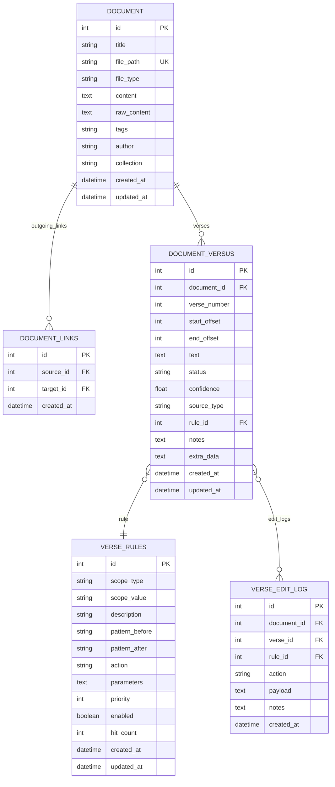

**Diagram sources**
- [document.py](file://src/pillars/document_manager/models/document.py#L1-L47)
- [document_verse.py](file://src/pillars/document_manager/models/document_verse.py#L1-L104)

**Section sources**
- [document.py](file://src/pillars/document_manager/models/document.py#L1-L47)
- [document_verse.py](file://src/pillars/document_manager/models/document_verse.py#L1-L104)
- [document_repository.py](file://src/pillars/document_manager/repositories/document_repository.py#L1-L86)
- [search_repository.py](file://src/pillars/document_manager/repositories/search_repository.py#L1-L201)
- [verse_edit_log_repository.py](file://src/pillars/document_manager/repositories/verse_edit_log_repository.py#L1-L45)

### Parsing and Ingestion
parsers.DocumentParser supports:
- TXT: Plain text to HTML preformatted block.
- HTML: Extracts text preserving layout via HTMLTextExtractor.
- DOCX: Uses mammoth for HTML and python-docx for text and metadata; ensures tables have visible borders.
- PDF: Attempts pdf2docx -> mammoth pipeline for better table/layout preservation; falls back to PyMuPDF or pypdf; extracts metadata.
- RTF: Uses striprtf to convert to plain text.

Integration:
- DocumentService.import_document invokes DocumentParser.parse_file and persists via DocumentRepository.
- On update, DocumentService._update_links parses content for [[WikiLinks]] and updates relationships.

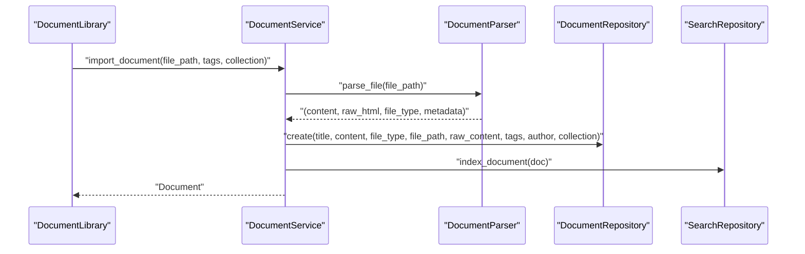

**Diagram sources**
- [document_service.py](file://src/pillars/document_manager/services/document_service.py#L50-L96)
- [parsers.py](file://src/pillars/document_manager/utils/parsers.py#L60-L275)
- [document_repository.py](file://src/pillars/document_manager/repositories/document_repository.py#L47-L62)
- [search_repository.py](file://src/pillars/document_manager/repositories/search_repository.py#L67-L91)

**Section sources**
- [parsers.py](file://src/pillars/document_manager/utils/parsers.py#L1-L275)
- [document_service.py](file://src/pillars/document_manager/services/document_service.py#L1-L257)

### UI Hubs and Workflows
- DocumentManagerHub: Launches DocumentEditorWindow, DocumentLibrary, DocumentSearchWindow, and MindscapeWindow.
- DocumentLibrary: Lists documents, supports import (single and batch), search, properties editing, tags, collections, and purge.
- DocumentSearchWindow: Performs Whoosh search with highlighted snippets and opens documents with search term highlighting.

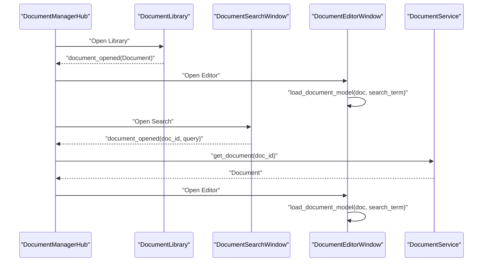

**Diagram sources**
- [document_manager_hub.py](file://src/pillars/document_manager/ui/document_manager_hub.py#L1-L205)
- [document_library.py](file://src/pillars/document_manager/ui/document_library.py#L1-L599)
- [document_search_window.py](file://src/pillars/document_manager/ui/document_search_window.py#L1-L125)
- [document_editor_window.py](file://src/pillars/document_manager/ui/document_editor_window.py#L164-L188)
- [document_service.py](file://src/pillars/document_manager/services/document_service.py#L149-L151)

**Section sources**
- [document_manager_hub.py](file://src/pillars/document_manager/ui/document_manager_hub.py#L1-L205)
- [document_library.py](file://src/pillars/document_manager/ui/document_library.py#L1-L599)
- [document_search_window.py](file://src/pillars/document_manager/ui/document_search_window.py#L1-L125)

## Dependency Analysis
- Coupling:
  - RichTextEditor depends on RibbonWidget and feature modules (ImageFeature, TableFeature, ListFeature, SearchReplaceFeature).
  - DocumentEditorWindow depends on RichTextEditor and DocumentService for DB operations.
  - DocumentService depends on DocumentRepository, SearchRepository, and parsers.DocumentParser.
  - Repositories depend on SQLAlchemy models.
- Cohesion:
  - Feature modules encapsulate specific editing capabilities (images, tables, lists).
  - DocumentService centralizes orchestration for import/update/link parsing/indexing.
- External dependencies:
  - PyQt6 for UI.
  - Whoosh for search indexing.
  - Optional libraries for DOCX/PDF/RTF parsing (mammoth, python-docx, pypdf, fitz, striprtf, pdf2docx).

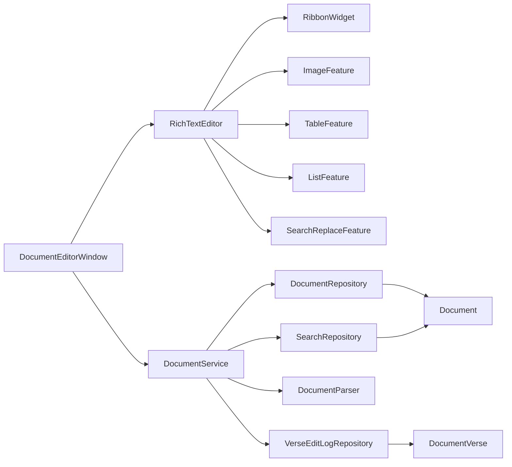

**Diagram sources**
- [document_editor_window.py](file://src/pillars/document_manager/ui/document_editor_window.py#L1-L329)
- [rich_text_editor.py](file://src/pillars/document_manager/ui/rich_text_editor.py#L1-L561)
- [document_service.py](file://src/pillars/document_manager/services/document_service.py#L1-L257)
- [document_repository.py](file://src/pillars/document_manager/repositories/document_repository.py#L1-L86)
- [search_repository.py](file://src/pillars/document_manager/repositories/search_repository.py#L1-L201)
- [parsers.py](file://src/pillars/document_manager/utils/parsers.py#L1-L275)
- [document.py](file://src/pillars/document_manager/models/document.py#L1-L47)
- [document_verse.py](file://src/pillars/document_manager/models/document_verse.py#L1-L104)
- [verse_edit_log_repository.py](file://src/pillars/document_manager/repositories/verse_edit_log_repository.py#L1-L45)

**Section sources**
- [document_editor_window.py](file://src/pillars/document_manager/ui/document_editor_window.py#L1-L329)
- [rich_text_editor.py](file://src/pillars/document_manager/ui/rich_text_editor.py#L1-L561)
- [document_service.py](file://src/pillars/document_manager/services/document_service.py#L1-L257)
- [document_repository.py](file://src/pillars/document_manager/repositories/document_repository.py#L1-L86)
- [search_repository.py](file://src/pillars/document_manager/repositories/search_repository.py#L1-L201)
- [parsers.py](file://src/pillars/document_manager/utils/parsers.py#L1-L275)
- [document.py](file://src/pillars/document_manager/models/document.py#L1-L47)
- [document_verse.py](file://src/pillars/document_manager/models/document_verse.py#L1-L104)
- [verse_edit_log_repository.py](file://src/pillars/document_manager/repositories/verse_edit_log_repository.py#L1-L45)

## Performance Considerations
- Large documents:
  - Use metadata-only queries for library views (DocumentRepository.get_all_metadata) to avoid loading heavy content fields.
  - Batch operations in DocumentLibrary for tags/collections updates.
  - Replace-all operations disable updates temporarily to reduce UI redraw overhead.
- Search:
  - Whoosh schema uses stemming analyzer for better recall; index is stored under user home directory.
  - SearchRepository.search returns highlighted snippets; rebuild_index clears and reindexes.
- Images:
  - ImageEditorDialog performs preview and adjustments; cache images in saved_documents/.cache_images for export stability.
- PDF/DOCX parsing:
  - Prefer pdf2docx -> mammoth pipeline for better table/layout preservation; fall back gracefully if dependencies unavailable.

[No sources needed since this section provides general guidance]

## Troubleshooting Guide
Common issues and resolutions:
- Wiki-link insertion:
  - Ensure DocumentService context is available; the selector queries all document metadata and filters by search term.
- Save conflicts:
  - DocumentEditorWindow checks for unsaved changes and prompts to save, discard, or cancel.
- PDF import failures:
  - Encrypted PDFs require decryption; otherwise, rely on pypdf fallback or install PyMuPDF for text extraction.
- Missing dependencies:
  - DOCX requires python-docx or mammoth; PDF requires pdf2docx and mammoth for best results; RTF requires striprtf.
- Large document freezes:
  - Use Replace All with updates disabled during bulk operations; consider batch tag updates in library.
- Export PDF issues:
  - Verify QPrinter availability and permissions for writing to the chosen path.

**Section sources**
- [document_editor_window.py](file://src/pillars/document_manager/ui/document_editor_window.py#L189-L205)
- [parsers.py](file://src/pillars/document_manager/utils/parsers.py#L1-L275)
- [search_features.py](file://src/pillars/document_manager/ui/search_features.py#L338-L365)

## Conclusion
The Document Editing System provides a robust, layered architecture for creating, formatting, and persisting documents. The primary editing surface is document_editor_window with rich_text_editor and a comprehensive Ribbon UI. Integrated features enable embedded media, structured tables, and list management. Persistence is handled by DocumentRepository and DocumentService, with Whoosh-based search indexing. Parsing utilities support multiple formats, and versioning/logging are available for curated content. The system balances usability, performance, and reliability across editing, import, and search workflows.

[No sources needed since this section summarizes without analyzing specific files]

## Appendices

### Example Workflows

- Create a new document:
  - Open DocumentManagerHub, click “New Document,” then DocumentEditorWindow.
  - Use Ribbon Home tab to format text and Insert tab to add images/tables/lists.
  - Save to database via File > Save.

- Import and edit a PDF:
  - In DocumentLibrary, click “Import Document” and select a PDF.
  - If pdf2docx and mammoth are installed, tables and layout are preserved; otherwise, text-only extraction occurs.
  - Open the imported document in DocumentEditorWindow and edit as needed.

- Embedding metadata:
  - During import, DocumentService captures metadata (e.g., author) and stores it with the Document.
  - Tags and collection fields can be updated via DocumentLibrary context menu or properties dialog.

- Versioning and audit:
  - For curated content, DocumentVerse records and VerseEditLogRepository capture edit actions and rule applications.

**Section sources**
- [document_manager_hub.py](file://src/pillars/document_manager/ui/document_manager_hub.py#L1-L205)
- [document_library.py](file://src/pillars/document_manager/ui/document_library.py#L1-L599)
- [document_service.py](file://src/pillars/document_manager/services/document_service.py#L50-L96)
- [parsers.py](file://src/pillars/document_manager/utils/parsers.py#L153-L241)
- [document_verse.py](file://src/pillars/document_manager/models/document_verse.py#L1-L104)
- [verse_edit_log_repository.py](file://src/pillars/document_manager/repositories/verse_edit_log_repository.py#L1-L45)