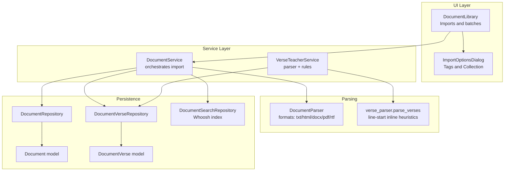
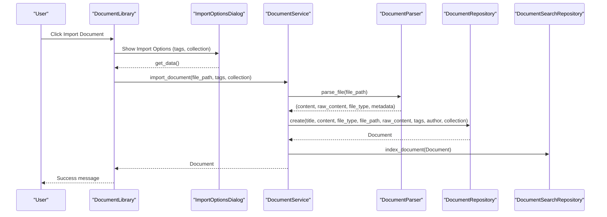
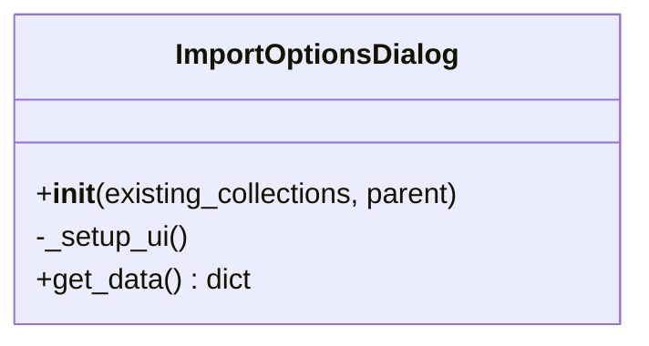
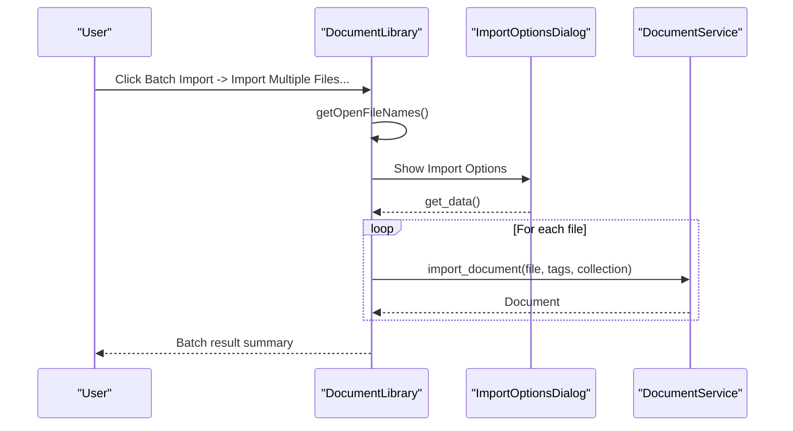
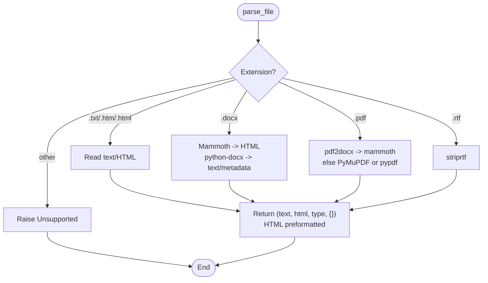
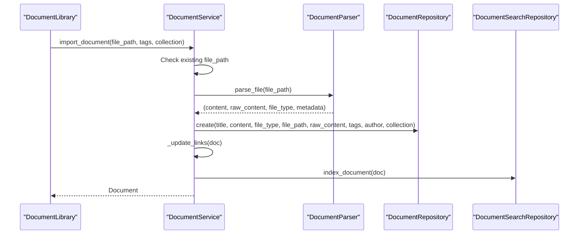
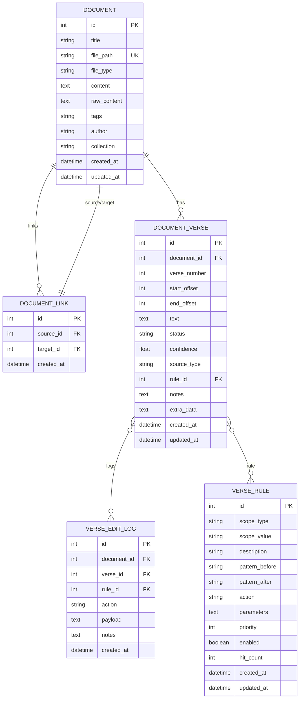
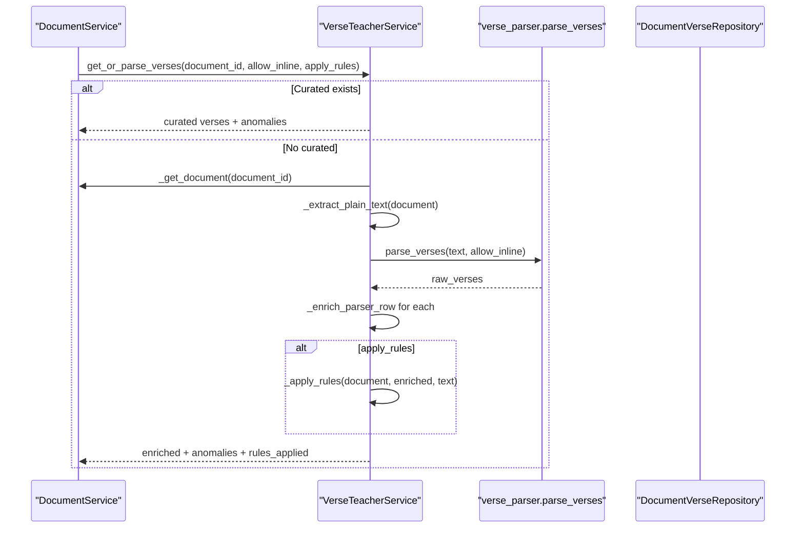
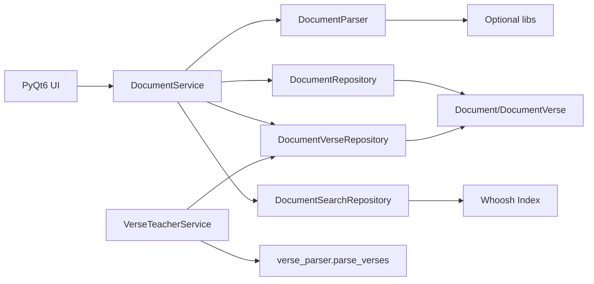

# Document Ingestion Pipeline

<cite>
**Referenced Files in This Document**
- [import_options_dialog.py](file://src/pillars/document_manager/ui/import_options_dialog.py)
- [document_library.py](file://src/pillars/document_manager/ui/document_library.py)
- [parsers.py](file://src/pillars/document_manager/utils/parsers.py)
- [document_service.py](file://src/pillars/document_manager/services/document_service.py)
- [document.py](file://src/pillars/document_manager/models/document.py)
- [document_verse.py](file://src/pillars/document_manager/models/document_verse.py)
- [verse_teacher_service.py](file://src/pillars/document_manager/services/verse_teacher_service.py)
- [verse_parser.py](file://src/pillars/gematria/utils/verse_parser.py)
- [document_repository.py](file://src/pillars/document_manager/repositories/document_repository.py)
- [document_verse_repository.py](file://src/pillars/document_manager/repositories/document_verse_repository.py)
- [search_repository.py](file://src/pillars/document_manager/repositories/search_repository.py)
- [requirements.txt](file://requirements.txt)
- [test_document_service.py](file://test/test_document_service.py)
</cite>

## Table of Contents
1. [Introduction](#introduction)
2. [Project Structure](#project-structure)
3. [Core Components](#core-components)
4. [Architecture Overview](#architecture-overview)
5. [Detailed Component Analysis](#detailed-component-analysis)
6. [Dependency Analysis](#dependency-analysis)
7. [Performance Considerations](#performance-considerations)
8. [Troubleshooting Guide](#troubleshooting-guide)
9. [Conclusion](#conclusion)
10. [Appendices](#appendices)

## Introduction
This document explains the Document Ingestion Pipeline within the Document Manager pillar. It covers how users select import options, how files are parsed into text and structured content, how metadata is extracted and normalized, how documents and verse segments are persisted, and how the system integrates with the verse teaching workflow. It also provides guidance on configuration, error handling, performance tuning, and troubleshooting.

## Project Structure
The ingestion pipeline spans UI dialogs, a parsing utility, a service layer, repositories, and models. The UI triggers ingestion; the service orchestrates parsing, persistence, and indexing; the parser extracts text and HTML from DOCX, PDF, RTF, TXT, and HTML; and the verse teacher service coordinates parser-driven verse segmentation and rule-based refinement.

**Diagram sources**
- [document_library.py](file://src/pillars/document_manager/ui/document_library.py#L377-L403)
- [import_options_dialog.py](file://src/pillars/document_manager/ui/import_options_dialog.py#L42-L47)
- [document_service.py](file://src/pillars/document_manager/services/document_service.py#L50-L96)
- [parsers.py](file://src/pillars/document_manager/utils/parsers.py#L60-L99)
- [verse_parser.py](file://src/pillars/gematria/utils/verse_parser.py#L6-L107)
- [verse_teacher_service.py](file://src/pillars/document_manager/services/verse_teacher_service.py#L33-L76)
- [document_repository.py](file://src/pillars/document_manager/repositories/document_repository.py#L47-L71)
- [document_verse_repository.py](file://src/pillars/document_manager/repositories/document_verse_repository.py#L26-L55)
- [search_repository.py](file://src/pillars/document_manager/repositories/search_repository.py#L67-L116)

**Section sources**
- [document_library.py](file://src/pillars/document_manager/ui/document_library.py#L377-L403)
- [import_options_dialog.py](file://src/pillars/document_manager/ui/import_options_dialog.py#L42-L47)
- [document_service.py](file://src/pillars/document_manager/services/document_service.py#L50-L96)
- [parsers.py](file://src/pillars/document_manager/utils/parsers.py#L60-L99)
- [document_repository.py](file://src/pillars/document_manager/repositories/document_repository.py#L47-L71)
- [document_verse_repository.py](file://src/pillars/document_manager/repositories/document_verse_repository.py#L26-L55)
- [search_repository.py](file://src/pillars/document_manager/repositories/search_repository.py#L67-L116)

## Core Components
- Import Options Dialog: Presents collection and tags fields for import.
- Document Library: Provides import, batch import, and library management UI.
- DocumentParser: Extracts text and HTML from supported formats.
- DocumentService: Coordinates ingestion, deduplication, indexing, and link updates.
- Repositories: Persist documents and document_verses; expose search index operations.
- Models: Define Document and DocumentVerse entities and indexes.
- Verse Teacher Service: Drives parser-based verse segmentation and rule application.
- Verse Parser: Heuristic-based verse detection from plain text.

**Section sources**
- [import_options_dialog.py](file://src/pillars/document_manager/ui/import_options_dialog.py#L42-L47)
- [document_library.py](file://src/pillars/document_manager/ui/document_library.py#L377-L403)
- [parsers.py](file://src/pillars/document_manager/utils/parsers.py#L60-L99)
- [document_service.py](file://src/pillars/document_manager/services/document_service.py#L50-L96)
- [document.py](file://src/pillars/document_manager/models/document.py#L18-L47)
- [document_verse.py](file://src/pillars/document_manager/models/document_verse.py#L21-L55)
- [verse_teacher_service.py](file://src/pillars/document_manager/services/verse_teacher_service.py#L33-L76)
- [verse_parser.py](file://src/pillars/gematria/utils/verse_parser.py#L6-L107)

## Architecture Overview
The ingestion pipeline follows a layered architecture:
- UI collects import options and invokes the service.
- Service parses the file, normalizes content, persists metadata, and indexes content.
- Optional verse segmentation is handled by the verse teacher service using the parser and rule engine.

**Diagram sources**
- [document_library.py](file://src/pillars/document_manager/ui/document_library.py#L377-L403)
- [import_options_dialog.py](file://src/pillars/document_manager/ui/import_options_dialog.py#L42-L47)
- [document_service.py](file://src/pillars/document_manager/services/document_service.py#L50-L96)
- [parsers.py](file://src/pillars/document_manager/utils/parsers.py#L60-L99)
- [document_repository.py](file://src/pillars/document_manager/repositories/document_repository.py#L47-L71)
- [search_repository.py](file://src/pillars/document_manager/repositories/search_repository.py#L67-L87)

## Detailed Component Analysis

### Import Options Dialog
- Purpose: Collects tags and collection for import.
- Behavior: Provides editable combo box for collection and text input for tags; returns a dictionary with stripped values.

**Diagram sources**
- [import_options_dialog.py](file://src/pillars/document_manager/ui/import_options_dialog.py#L6-L47)

**Section sources**
- [import_options_dialog.py](file://src/pillars/document_manager/ui/import_options_dialog.py#L42-L47)

### Document Library
- Purpose: Manages document library UI, import, batch import, and search.
- Import flow: Opens file dialog, shows ImportOptionsDialog, calls DocumentService.import_document, refreshes view.
- Batch import: Supports multiple files and folders; aggregates errors and reports counts.

**Diagram sources**
- [document_library.py](file://src/pillars/document_manager/ui/document_library.py#L440-L516)

**Section sources**
- [document_library.py](file://src/pillars/document_manager/ui/document_library.py#L377-L403)
- [document_library.py](file://src/pillars/document_manager/ui/document_library.py#L440-L516)

### Parsers Utility
- Supported formats: TXT, HTML, DOCX, PDF, RTF.
- Extraction logic:
  - TXT/HTML: direct read; HTMLTextExtractor preserves layout with line breaks.
  - DOCX: prefers Mammoth for HTML, falls back to python-docx for text and metadata.
  - PDF: attempts pdf2docx -> mammoth pipeline for better table/layout; falls back to PyMuPDF or pypdf; handles encryption.
  - RTF: uses striprtf.
- Encoding normalization: Uses UTF-8 with error handling to ignore invalid sequences.

**Diagram sources**
- [parsers.py](file://src/pillars/document_manager/utils/parsers.py#L60-L99)
- [parsers.py](file://src/pillars/document_manager/utils/parsers.py#L110-L151)
- [parsers.py](file://src/pillars/document_manager/utils/parsers.py#L153-L241)
- [parsers.py](file://src/pillars/document_manager/utils/parsers.py#L267-L275)

**Section sources**
- [parsers.py](file://src/pillars/document_manager/utils/parsers.py#L60-L99)
- [parsers.py](file://src/pillars/document_manager/utils/parsers.py#L110-L151)
- [parsers.py](file://src/pillars/document_manager/utils/parsers.py#L153-L241)
- [parsers.py](file://src/pillars/document_manager/utils/parsers.py#L243-L266)
- [parsers.py](file://src/pillars/document_manager/utils/parsers.py#L267-L275)

### DocumentService
- Deduplication: Checks existing file_path before importing.
- Parsing: Delegates to DocumentParser.parse_file.
- Title resolution: Uses metadata title if available; otherwise filename stem.
- Persistence: Creates Document via DocumentRepository; updates links; indexes.
- Search: Whoosh-based indexing and search.

**Diagram sources**
- [document_service.py](file://src/pillars/document_manager/services/document_service.py#L50-L96)
- [document_repository.py](file://src/pillars/document_manager/repositories/document_repository.py#L47-L71)
- [search_repository.py](file://src/pillars/document_manager/repositories/search_repository.py#L67-L87)

**Section sources**
- [document_service.py](file://src/pillars/document_manager/services/document_service.py#L50-L96)
- [document_service.py](file://src/pillars/document_manager/services/document_service.py#L138-L148)
- [document_service.py](file://src/pillars/document_manager/services/document_service.py#L226-L236)
- [document_repository.py](file://src/pillars/document_manager/repositories/document_repository.py#L47-L71)
- [search_repository.py](file://src/pillars/document_manager/repositories/search_repository.py#L67-L116)

### Models: Document and DocumentVerse
- Document: Stores title, file metadata, content, raw_content, tags, author, collection, timestamps, and outgoing links.
- DocumentVerse: Stores verse offsets, number, text, status, confidence, source_type, rule association, notes, and audit logs.

**Diagram sources**
- [document.py](file://src/pillars/document_manager/models/document.py#L18-L47)
- [document_verse.py](file://src/pillars/document_manager/models/document_verse.py#L21-L55)
- [document_verse.py](file://src/pillars/document_manager/models/document_verse.py#L56-L82)
- [document_verse.py](file://src/pillars/document_manager/models/document_verse.py#L84-L104)

**Section sources**
- [document.py](file://src/pillars/document_manager/models/document.py#L18-L47)
- [document_verse.py](file://src/pillars/document_manager/models/document_verse.py#L21-L55)
- [document_verse.py](file://src/pillars/document_manager/models/document_verse.py#L56-L82)
- [document_verse.py](file://src/pillars/document_manager/models/document_verse.py#L84-L104)

### Verse Segmentation and Rules
- Verse segmentation: Uses verse_parser.parse_verses to detect numbered verses with line-start and inline heuristics.
- Rule application: VerseTeacherService enriches parser output, applies rules scoped to document/collection/global, detects anomalies, and logs edits.

**Diagram sources**
- [verse_teacher_service.py](file://src/pillars/document_manager/services/verse_teacher_service.py#L33-L76)
- [verse_teacher_service.py](file://src/pillars/document_manager/services/verse_teacher_service.py#L151-L185)
- [verse_teacher_service.py](file://src/pillars/document_manager/services/verse_teacher_service.py#L186-L213)
- [verse_parser.py](file://src/pillars/gematria/utils/verse_parser.py#L6-L107)
- [document_verse_repository.py](file://src/pillars/document_manager/repositories/document_verse_repository.py#L26-L55)

**Section sources**
- [verse_teacher_service.py](file://src/pillars/document_manager/services/verse_teacher_service.py#L33-L76)
- [verse_teacher_service.py](file://src/pillars/document_manager/services/verse_teacher_service.py#L151-L185)
- [verse_teacher_service.py](file://src/pillars/document_manager/services/verse_teacher_service.py#L186-L213)
- [verse_parser.py](file://src/pillars/gematria/utils/verse_parser.py#L6-L107)
- [document_verse_repository.py](file://src/pillars/document_manager/repositories/document_verse_repository.py#L26-L55)

## Dependency Analysis
- External libraries: Whoosh (indexing), SQLAlchemy (ORM), and optional format libraries (mammoth, python-docx, pdf2docx, pypdf, PyMuPDF, striprtf).
- UI depends on DocumentService via context manager; DocumentService depends on repositories and parser.
- Verse segmentation depends on verse_parser and rule repositories.

**Diagram sources**
- [requirements.txt](file://requirements.txt#L1-L13)
- [document_service.py](file://src/pillars/document_manager/services/document_service.py#L1-L23)
- [parsers.py](file://src/pillars/document_manager/utils/parsers.py#L8-L38)
- [search_repository.py](file://src/pillars/document_manager/repositories/search_repository.py#L18-L47)
- [verse_teacher_service.py](file://src/pillars/document_manager/services/verse_teacher_service.py#L1-L18)

**Section sources**
- [requirements.txt](file://requirements.txt#L1-L13)
- [document_service.py](file://src/pillars/document_manager/services/document_service.py#L1-L23)
- [parsers.py](file://src/pillars/document_manager/utils/parsers.py#L8-L38)
- [search_repository.py](file://src/pillars/document_manager/repositories/search_repository.py#L18-L47)
- [verse_teacher_service.py](file://src/pillars/document_manager/services/verse_teacher_service.py#L1-L18)

## Performance Considerations
- Metadata-only loads: DocumentLibrary uses metadata-only fetch to reduce memory and speed up tree population.
- Deferred content loading: DocumentRepository defers heavy content fields when fetching metadata.
- Batch operations: DocumentService.update_documents iterates and indexes in bulk.
- Indexing: DocumentSearchRepository uses a single writer transaction per batch to minimize commits.
- PDF pipeline: Prefer pdf2docx -> mammoth for better table/layout preservation; fall back gracefully to text-only extraction.
- Encoding: UTF-8 with error handling prevents crashes on malformed encodings.

[No sources needed since this section provides general guidance]

## Troubleshooting Guide
- Unsupported file type: DocumentParser raises an error for unsupported extensions; ensure the file extension is among supported types.
- Missing optional dependencies:
  - DOCX: Requires python-docx and/or mammoth.
  - PDF: Requires pdf2docx, mammoth, and python-docx for best results; PyMuPDF or pypdf as fallbacks.
  - RTF: Requires striprtf.
- Encrypted PDFs: pypdf decrypts empty password; if decryption fails, a readable error is raised.
- Duplicate file_path: DocumentService skips import if a file is already present to avoid unique constraint errors.
- Large batches: DocumentLibrary’s batch import uses QProgressDialog and aggregates errors; review the summary dialog for failures.
- Search index corruption: DocumentSearchRepository recreates index if schema mismatch or corruption is detected; rebuild index if needed.

**Section sources**
- [parsers.py](file://src/pillars/document_manager/utils/parsers.py#L97-L99)
- [parsers.py](file://src/pillars/document_manager/utils/parsers.py#L140-L147)
- [parsers.py](file://src/pillars/document_manager/utils/parsers.py#L186-L191)
- [parsers.py](file://src/pillars/document_manager/utils/parsers.py#L211-L236)
- [document_service.py](file://src/pillars/document_manager/services/document_service.py#L60-L65)
- [document_library.py](file://src/pillars/document_manager/ui/document_library.py#L474-L516)
- [search_repository.py](file://src/pillars/document_manager/repositories/search_repository.py#L52-L63)
- [search_repository.py](file://src/pillars/document_manager/repositories/search_repository.py#L165-L195)

## Conclusion
The Document Ingestion Pipeline integrates a robust UI, flexible parsing, reliable persistence, and optional verse segmentation with rule enforcement. It emphasizes deduplication, efficient metadata loading, and resilient fallbacks for diverse file formats. The system provides clear configuration points via import options and offers mechanisms to diagnose and recover from common ingestion issues.

[No sources needed since this section summarizes without analyzing specific files]

## Appendices

### Configuration Options in Import Options Dialog
- Collection: Select or type a new collection name; used to organize documents virtually.
- Tags: Comma-separated tags associated with the imported document.

**Section sources**
- [import_options_dialog.py](file://src/pillars/document_manager/ui/import_options_dialog.py#L17-L30)

### Successful Ingestion Workflows
- Single file import:
  - Open Document Library, click Import Document, choose a supported file, enter tags and collection, confirm.
  - DocumentService parses, persists, indexes, and refreshes the library.
- Batch import:
  - Choose multiple files or a folder; confirm tags and collection; monitor progress; review summary.

**Section sources**
- [document_library.py](file://src/pillars/document_manager/ui/document_library.py#L377-L403)
- [document_library.py](file://src/pillars/document_manager/ui/document_library.py#L440-L516)
- [document_service.py](file://src/pillars/document_manager/services/document_service.py#L50-L96)

### Validation Rules During Ingestion
- Unique file_path: Prevents duplicate imports.
- Supported extensions: Raises explicit error for unsupported types.
- Metadata availability: Title fallback to filename stem if metadata title is absent.

**Section sources**
- [document_service.py](file://src/pillars/document_manager/services/document_service.py#L60-L65)
- [parsers.py](file://src/pillars/document_manager/utils/parsers.py#L97-L99)

### Integration with Verse Teacher Service
- Initial tagging: DocumentService does not tag automatically; use DocumentLibrary context menu to add tags or supply tags during import.
- Parser-driven segmentation: Use VerseTeacherService to generate parser-based verses; curated overrides can be saved and logged.

**Section sources**
- [document_library.py](file://src/pillars/document_manager/ui/document_library.py#L220-L295)
- [verse_teacher_service.py](file://src/pillars/document_manager/services/verse_teacher_service.py#L33-L76)
- [document_verse_repository.py](file://src/pillars/document_manager/repositories/document_verse_repository.py#L26-L55)

### Example Test Coverage
- Tests demonstrate import, search, update, batch updates, delete, and index rebuild.

**Section sources**
- [test_document_service.py](file://test/test_document_service.py#L114-L130)
- [test_document_service.py](file://test/test_document_service.py#L132-L149)
- [test_document_service.py](file://test/test_document_service.py#L151-L164)
- [test_document_service.py](file://test/test_document_service.py#L166-L179)
- [test_document_service.py](file://test/test_document_service.py#L181-L194)
- [test_document_service.py](file://test/test_document_service.py#L196-L209)