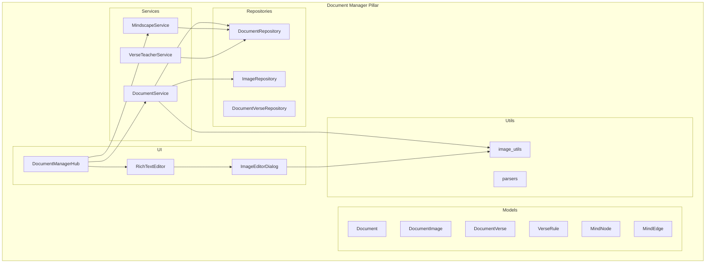
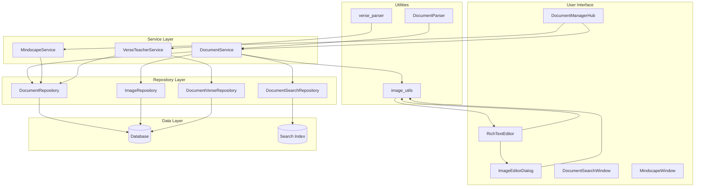
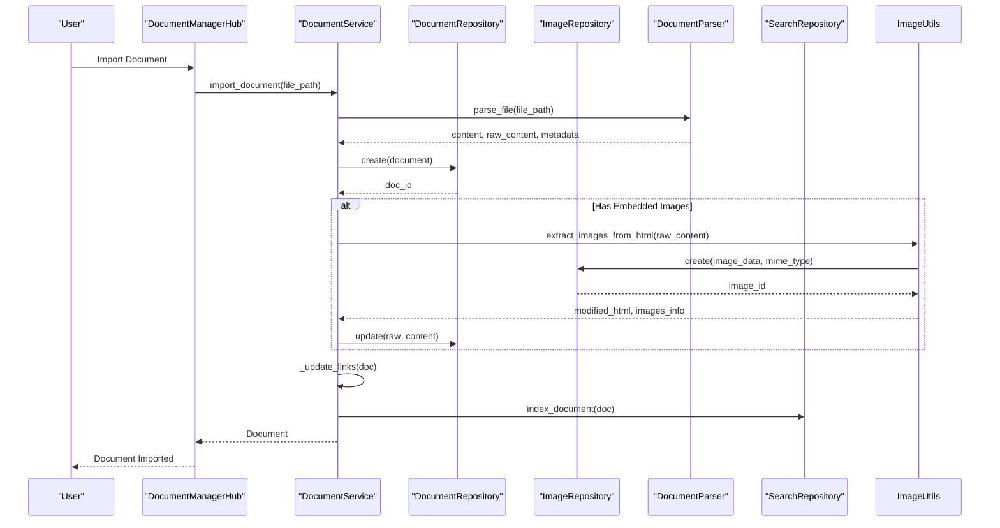
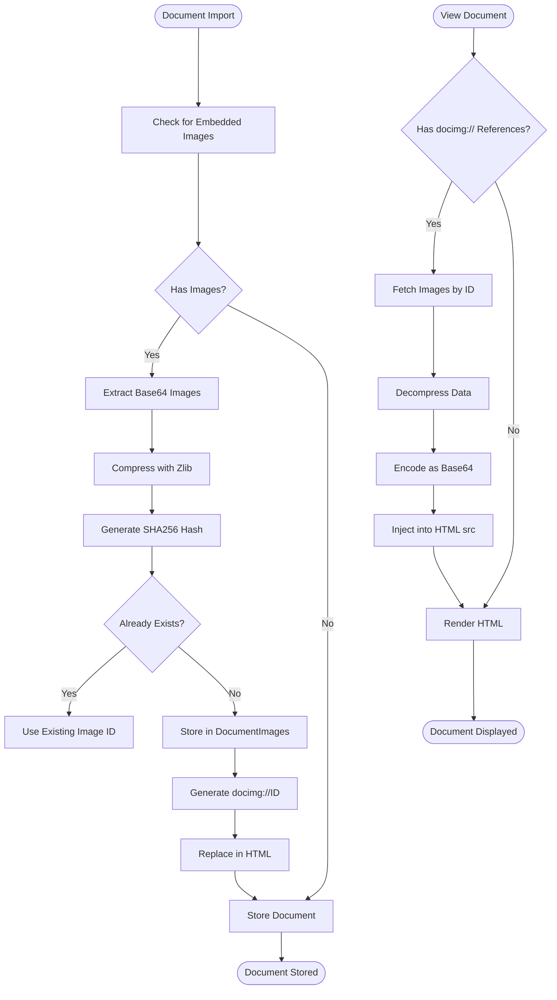
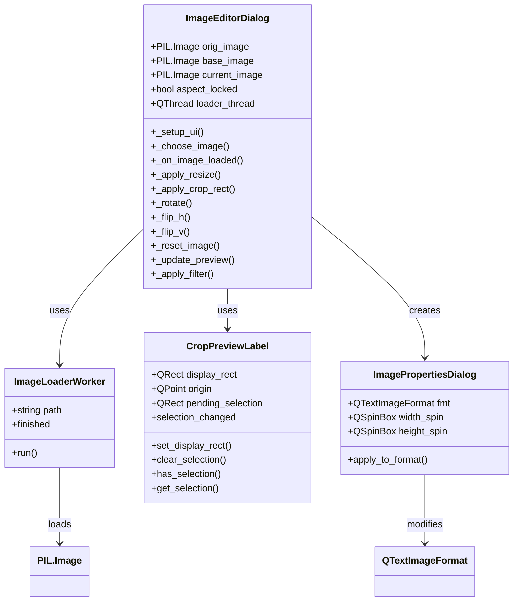
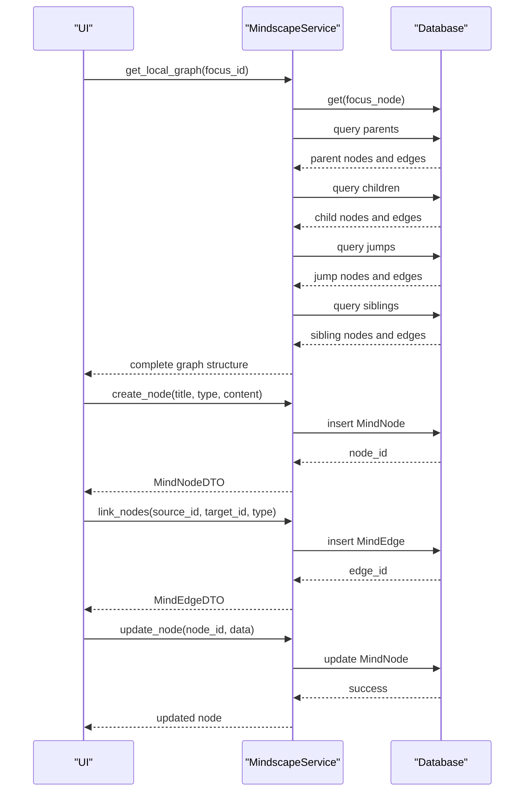

# Document Manager Image Editing Suite

<cite>
**Referenced Files in This Document**   
- [document.py](file://src/pillars/document_manager/models/document.py)
- [document_verse.py](file://src/pillars/document_manager/models/document_verse.py)
- [mindscape.py](file://src/pillars/document_manager/models/mindscape.py)
- [document_service.py](file://src/pillars/document_manager/services/document_service.py)
- [mindscape_service.py](file://src/pillars/document_manager/services/mindscape_service.py)
- [verse_teacher_service.py](file://src/pillars/document_manager/services/verse_teacher_service.py)
- [document_manager_hub.py](file://src/pillars/document_manager/ui/document_manager_hub.py)
- [rich_text_editor.py](file://src/pillars/document_manager/ui/rich_text_editor.py)
- [image_features.py](file://src/pillars/document_manager/ui/image_features.py)
- [image_utils.py](file://src/pillars/document_manager/utils/image_utils.py)
- [document_repository.py](file://src/pillars/document_manager/repositories/document_repository.py)
- [image_repository.py](file://src/pillars/document_manager/repositories/image_repository.py)
- [migrate_document_images.py](file://scripts/migrate_document_images.py)
</cite>

## Update Summary
**Changes Made**   
- Updated image handling system to extract base64 images from HTML content and store them separately in document_images table
- Added migration script for existing documents with embedded images
- Updated document service to handle image restoration when loading documents
- Modified document editor and library to work with restored HTML content
- Updated architectural diagrams to reflect new image storage and retrieval workflow

## Table of Contents
1. [Introduction](#introduction)
2. [Project Structure](#project-structure)
3. [Core Components](#core-components)
4. [Architecture Overview](#architecture-overview)
5. [Detailed Component Analysis](#detailed-component-analysis)
6. [Dependency Analysis](#dependency-analysis)
7. [Performance Considerations](#performance-considerations)
8. [Troubleshooting Guide](#troubleshooting-guide)
9. [Conclusion](#conclusion)

## Introduction
The Document Manager Image Editing Suite is a comprehensive document management and rich text editing system designed for organizing, analyzing, and visualizing textual content. The system features advanced image handling capabilities, document parsing, and a visual "mindscape" for creating connections between documents and concepts. Built with a modular architecture, the suite provides tools for document import, search, rich text editing with image manipulation, and semantic analysis through verse parsing and rule-based processing.

The system has recently been updated to improve image handling by extracting base64-encoded images from HTML content and storing them separately in a dedicated document_images table. This change enhances performance, reduces storage requirements, and enables better image management through deduplication and compression.

## Project Structure
The Document Manager suite is organized into a well-structured modular architecture with clear separation of concerns. The system follows a layered design pattern with distinct components for models, services, repositories, and user interface elements.



**Diagram sources**
- [document.py](file://src/pillars/document_manager/models/document.py)
- [document_verse.py](file://src/pillars/document_manager/models/document_verse.py)
- [mindscape.py](file://src/pillars/document_manager/models/mindscape.py)
- [document_service.py](file://src/pillars/document_manager/services/document_service.py)
- [mindscape_service.py](file://src/pillars/document_manager/services/mindscape_service.py)
- [verse_teacher_service.py](file://src/pillars/document_manager/services/verse_teacher_service.py)
- [document_repository.py](file://src/pillars/document_manager/repositories/document_repository.py)
- [image_repository.py](file://src/pillars/document_manager/repositories/image_repository.py)
- [document_manager_hub.py](file://src/pillars/document_manager/ui/document_manager_hub.py)
- [rich_text_editor.py](file://src/pillars/document_manager/ui/rich_text_editor.py)
- [image_features.py](file://src/pillars/document_manager/ui/image_features.py)
- [image_utils.py](file://src/pillars/document_manager/utils/image_utils.py)

**Section sources**
- [document.py](file://src/pillars/document_manager/models/document.py)
- [document_verse.py](file://src/pillars/document_manager/models/document_verse.py)
- [mindscape.py](file://src/pillars/document_manager/models/mindscape.py)

## Core Components

The Document Manager Image Editing Suite consists of three primary components that work together to provide a comprehensive document management solution:

1. **Document Management System**: Handles document storage, retrieval, search, and metadata management with support for various file formats and rich text content.

2. **Image Editing Suite**: Provides advanced image manipulation capabilities including cropping, filtering, brightness/contrast adjustments, and format conversion, integrated directly into the rich text editor.

3. **Mindscape Visualization**: A graph-based system for creating visual connections between documents and concepts, allowing users to explore relationships and build knowledge networks.

These components are supported by a robust service layer that handles business logic, data processing, and integration between different parts of the system.

**Section sources**
- [document_service.py](file://src/pillars/document_manager/services/document_service.py)
- [mindscape_service.py](file://src/pillars/document_manager/services/mindscape_service.py)
- [verse_teacher_service.py](file://src/pillars/document_manager/services/verse_teacher_service.py)

## Architecture Overview

The Document Manager Image Editing Suite follows a clean architecture pattern with well-defined layers and separation of concerns. The system is built around a central document model with supporting services for different aspects of document management and analysis.



**Diagram sources**
- [document_service.py](file://src/pillars/document_manager/services/document_service.py)
- [mindscape_service.py](file://src/pillars/document_manager/services/mindscape_service.py)
- [verse_teacher_service.py](file://src/pillars/document_manager/services/verse_teacher_service.py)
- [document_repository.py](file://src/pillars/document_manager/repositories/document_repository.py)
- [image_repository.py](file://src/pillars/document_manager/repositories/image_repository.py)
- [document_manager_hub.py](file://src/pillars/document_manager/ui/document_manager_hub.py)
- [rich_text_editor.py](file://src/pillars/document_manager/ui/rich_text_editor.py)
- [image_features.py](file://src/pillars/document_manager/ui/image_features.py)
- [image_utils.py](file://src/pillars/document_manager/utils/image_utils.py)

## Detailed Component Analysis

### Document Management System Analysis

The document management system forms the core of the application, providing functionality for document storage, retrieval, search, and metadata management. The system is designed to handle various document types while maintaining rich text formatting and embedded images.

#### Document Model Structure
```mermaid
classDiagram
class Document {
+int id
+string title
+string file_path
+string file_type
+string content
+string raw_content
+string tags
+string author
+string collection
+datetime created_at
+datetime updated_at
+list[DocumentImage] images
+list[Document] outgoing_links
}
class DocumentImage {
+int id
+int document_id
+string hash
+bytes data
+string mime_type
+string original_filename
+int width
+int height
+datetime created_at
}
class DocumentLink {
+int id
+int source_id
+int target_id
+datetime created_at
}
Document "1" *-- "0..*" DocumentImage : contains
Document "1" --> "0..*" Document : links to
Document "0..*" <-- "1" Document : linked from
DocumentLink "0..*" -- "0..*" Document : connects
DocumentImage --> Document : belongs to
DocumentImage : : data --> zlib : compressed
DocumentImage : : hash --> SHA256 : deduplication
```

**Diagram sources**
- [document.py](file://src/pillars/document_manager/models/document.py)

#### Document Service Workflow


**Diagram sources**
- [document_service.py](file://src/pillars/document_manager/services/document_service.py)
- [document_repository.py](file://src/pillars/document_manager/repositories/document_repository.py)
- [image_repository.py](file://src/pillars/document_manager/repositories/image_repository.py)
- [image_utils.py](file://src/pillars/document_manager/utils/image_utils.py)

### Image Editing Suite Analysis

The image editing suite provides comprehensive image manipulation capabilities integrated directly into the document editing workflow. The system handles image storage, compression, and on-the-fly processing for embedded images in documents.

#### Image Processing Pipeline


**Diagram sources**
- [image_utils.py](file://src/pillars/document_manager/utils/image_utils.py)
- [document_service.py](file://src/pillars/document_manager/services/document_service.py)
- [image_repository.py](file://src/pillars/document_manager/repositories/image_repository.py)

#### Image Editor Features


**Diagram sources**
- [image_features.py](file://src/pillars/document_manager/ui/image_features.py)

### Mindscape Visualization Analysis

The Mindscape system provides a graph-based visualization for creating connections between documents and concepts, enabling users to build knowledge networks and explore relationships between different pieces of information.

#### Mindscape Data Model
```mermaid
classDiagram
class MindNode {
+int id
+string title
+string type
+string content
+string tags
+string appearance
+string metadata_payload
+string icon
+int document_id
+datetime created_at
+datetime updated_at
}
class MindEdge {
+int id
+int source_id
+int target_id
+string relation_type
+string appearance
+datetime created_at
}
class MindEdgeType {
+PARENT
+JUMP
}
MindNode "1" --> "0..*" MindEdge : source of
MindNode "1" --> "0..*" MindEdge : target of
MindEdge --> MindNode : source
MindEdge --> MindNode : target
MindEdge : : relation_type --> MindEdgeType : enum
MindNode : : metadata_payload --> JSON : structured data
MindNode : : appearance --> JSON : visual styling
```

**Diagram sources**
- [mindscape.py](file://src/pillars/document_manager/models/mindscape.py)

#### Mindscape Service Operations


**Diagram sources**
- [mindscape_service.py](file://src/pillars/document_manager/services/mindscape_service.py)

## Dependency Analysis

The Document Manager Image Editing Suite has a well-structured dependency graph with clear separation between components. The system follows dependency inversion principles, with higher-level modules depending on abstractions rather than concrete implementations.

```mermaid
graph TD
Hub[DocumentManagerHub] --> DocumentService
Hub --> MindscapeService
Hub --> VerseTeacherService
Hub --> RichTextEditor
DocumentService --> DocumentRepository
DocumentService --> ImageRepository
DocumentService --> DocumentVerseRepository
DocumentService --> SearchRepository
DocumentService --> ImageUtils
DocumentService --> DocumentParser
MindscapeService --> DocumentRepository
MindscapeService --> MindNode
MindscapeService --> MindEdge
VerseTeacherService --> DocumentRepository
VerseTeacherService --> DocumentVerseRepository
VerseTeacherService --> VerseRuleRepository
VerseTeacherService --> VerseEditLogRepository
VerseTeacherService --> verse_parser
RichTextEditor --> ImageEditorDialog
RichTextEditor --> SearchReplaceFeature
RichTextEditor --> TableFeature
RichTextEditor --> ListFeature
ImageEditorDialog --> ImageUtils
ImageEditorDialog --> PIL.Image
ImageEditorDialog --> QThread
DocumentRepository --> Document
ImageRepository --> DocumentImage
DocumentVerseRepository --> DocumentVerse
VerseRuleRepository --> VerseRule
VerseEditLogRepository --> VerseEditLog
ImageUtils --> base64
ImageUtils --> re
DocumentParser --> various parsers
verse_parser --> re
Document --> SQLAlchemy
DocumentImage --> SQLAlchemy
MindNode --> SQLAlchemy
MindEdge --> SQLAlchemy
DocumentLink --> SQLAlchemy
DocumentService --> logging
MindscapeService --> logging
VerseTeacherService --> logging
```

**Diagram sources**
- [document_service.py](file://src/pillars/document_manager/services/document_service.py)
- [mindscape_service.py](file://src/pillars/document_manager/services/mindscape_service.py)
- [verse_teacher_service.py](file://src/pillars/document_manager/services/verse_teacher_service.py)
- [document_repository.py](file://src/pillars/document_manager/repositories/document_repository.py)
- [image_repository.py](file://src/pillars/document_manager/repositories/image_repository.py)
- [document_manager_hub.py](file://src/pillars/document_manager/ui/document_manager_hub.py)
- [rich_text_editor.py](file://src/pillars/document_manager/ui/rich_text_editor.py)
- [image_features.py](file://src/pillars/document_manager/ui/image_features.py)
- [image_utils.py](file://src/pillars/document_manager/utils/image_utils.py)

## Performance Considerations

The Document Manager Image Editing Suite incorporates several performance optimizations to handle large documents and complex operations efficiently:

1. **Image Compression**: All embedded images are compressed using zlib with level 6 compression to reduce storage requirements and improve load times.

2. **Metadata Query Optimization**: The `get_all_metadata()` method uses SQLAlchemy's `load_only()` to fetch only essential fields when displaying document lists, significantly reducing database load.

3. **Batch Operations**: The service layer supports batch updates for multiple documents, reducing the number of database transactions.

4. **Search Indexing**: Documents are indexed in a separate search repository (Whoosh) for fast full-text search operations without impacting the main database.

5. **Background Image Loading**: Large images are loaded in a separate thread to prevent UI freezing during document import.

6. **Lazy Loading**: Images are only decompressed and converted to base64 when needed for display, reducing memory usage.

7. **Connection Pooling**: Database connections are managed through a session context manager that handles connection pooling and transaction management.

8. **Caching**: The system implements deduplication for images using SHA256 hashes, preventing storage of identical images multiple times.

9. **Migration Support**: The system includes a migration script (`migrate_document_images.py`) that extracts embedded images from existing documents and stores them in the new document_images table, ensuring backward compatibility while optimizing storage.

**Section sources**
- [image_repository.py](file://src/pillars/document_manager/repositories/image_repository.py)
- [document_repository.py](file://src/pillars/document_manager/repositories/document_repository.py)
- [document_service.py](file://src/pillars/document_manager/services/document_service.py)
- [image_features.py](file://src/pillars/document_manager/ui/image_features.py)
- [migrate_document_images.py](file://scripts/migrate_document_images.py)

## Troubleshooting Guide

### Common Issues and Solutions

1. **Large Paste Operations Freezing the Application**
   - **Symptom**: Application becomes unresponsive when pasting large amounts of text
   - **Cause**: The SafeTextEdit component has a threshold of 100,000 characters that triggers a warning
   - **Solution**: Click "Yes" in the warning dialog to proceed with the paste operation, or break the content into smaller chunks

2. **Images Not Displaying in Documents**
   - **Symptom**: Image placeholders appear but no images are visible
   - **Cause**: The document contains docimg:// references but the images are missing from the database
   - **Solution**: Re-import the document or check database integrity

3. **Search Functionality Not Returning Expected Results**
   - **Symptom**: Search queries return no results or incomplete results
   - **Cause**: The search index may be out of sync with the database
   - **Solution**: Rebuild the search index using the DocumentService.rebuild_search_index() method

4. **Image Editor Fails to Load Images**
   - **Symptom**: Image editor shows "Load failed" error when opening images
   - **Cause**: Missing Pillow dependency or corrupted image file
   - **Solution**: Install Pillow using pip install Pillow, or verify the image file is not corrupted

5. **Mindscape Graph Not Loading**
   - **Symptom**: Mindscape visualization fails to display
   - **Cause**: Database connection issue or empty mindscape
   - **Solution**: Check database connection and ensure at least one node exists

6. **Document Import Failures**
   - **Symptom**: Document import fails with file not found error
   - **Cause**: File path is invalid or file has been moved
   - **Solution**: Verify the file path and ensure the file exists

7. **Missing Images After Migration**
   - **Symptom**: Documents that previously had embedded images now show broken image links
   - **Cause**: The migration script has not been run to extract images from existing documents
   - **Solution**: Run the migration script `python scripts/migrate_document_images.py` to extract embedded images and update document references

8. **Image Loading Performance Issues**
   - **Symptom**: Document loading is slow when documents contain many images
   - **Cause**: Images are being decompressed and converted to base64 during document loading
   - **Solution**: The system uses lazy loading for images, so performance should improve after initial load. Consider reducing image sizes before import.

**Section sources**
- [rich_text_editor.py](file://src/pillars/document_manager/ui/rich_text_editor.py)
- [document_service.py](file://src/pillars/document_manager/services/document_service.py)
- [mindscape_service.py](file://src/pillars/document_manager/services/mindscape_service.py)
- [image_features.py](file://src/pillars/document_manager/ui/image_features.py)
- [migrate_document_images.py](file://scripts/migrate_document_images.py)

## Conclusion

The Document Manager Image Editing Suite provides a comprehensive solution for document management and rich text editing with advanced image manipulation capabilities. The system's modular architecture separates concerns effectively, with distinct components for document storage, image processing, and knowledge visualization.

Key strengths of the system include:
- Robust document management with support for various file formats
- Advanced image editing capabilities integrated directly into the editor
- Efficient storage through image compression and deduplication
- Powerful search functionality with a dedicated search index
- Visual knowledge mapping through the Mindscape graph system
- Extensible architecture that supports additional features and integrations
- Improved image handling with separate storage in document_images table and docimg:// references

The system is designed for users who need to manage complex documents with embedded images while maintaining the ability to analyze and visualize relationships between different pieces of information. Its clean architecture and well-defined interfaces make it suitable for both standalone use and integration into larger applications.