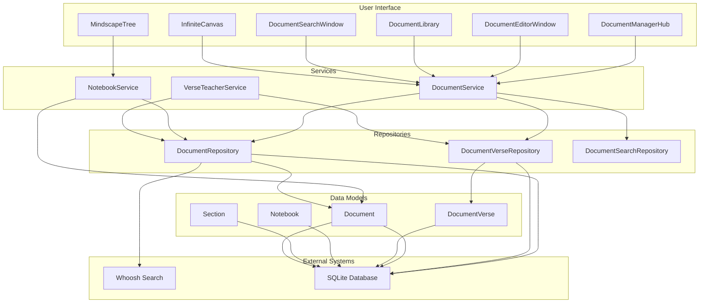
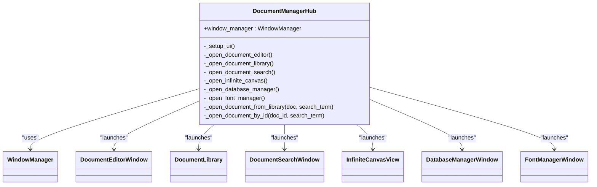
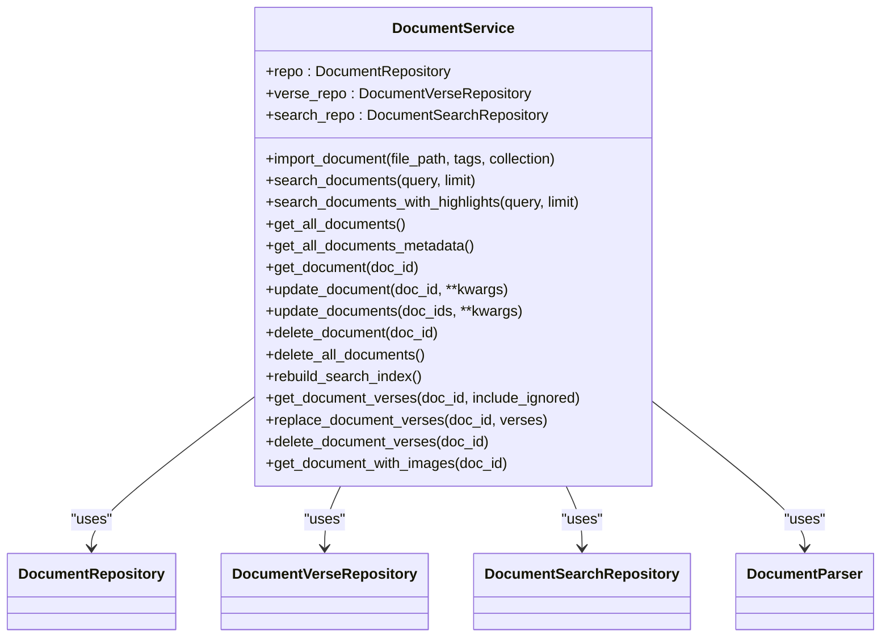
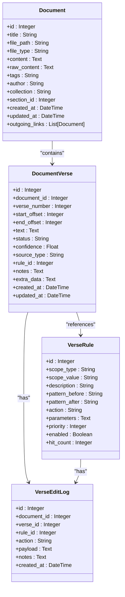
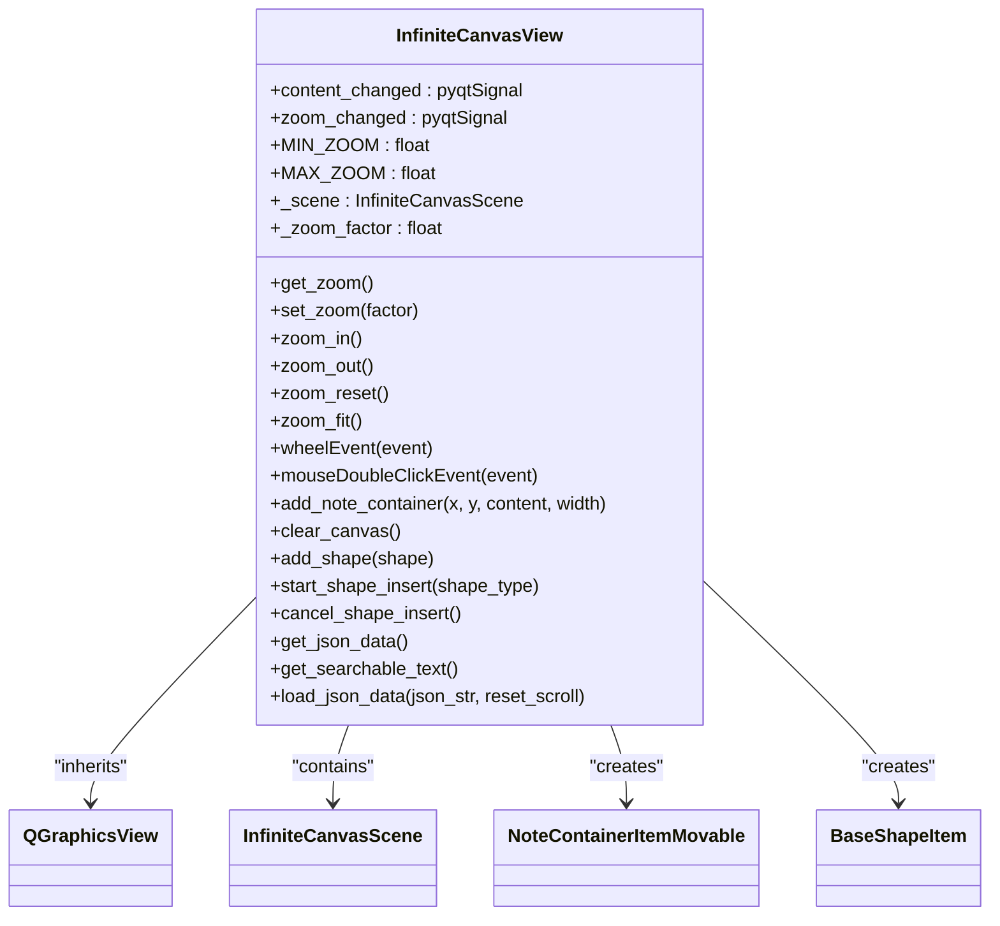
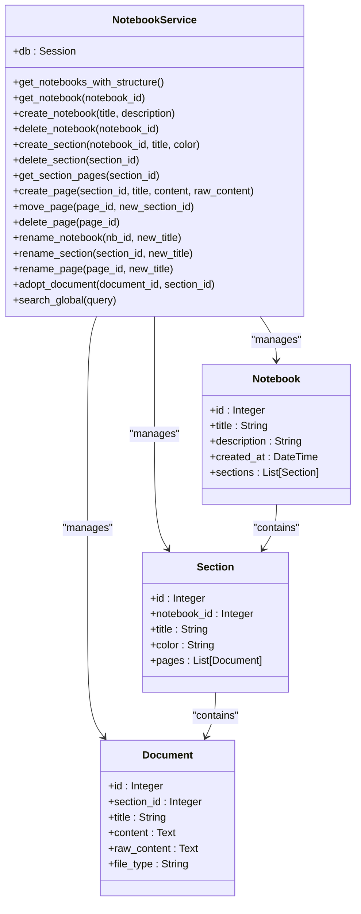
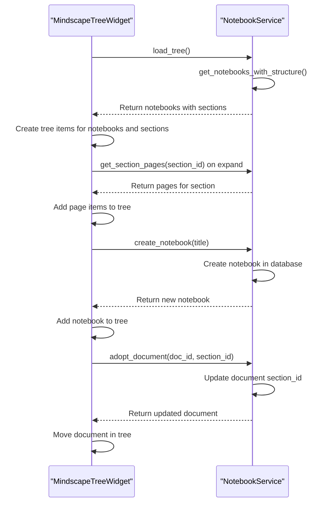

# Document Manager Pillar

<cite>
**Referenced Files in This Document**   
- [document_manager_hub.py](file://src/pillars/document_manager/ui/document_manager_hub.py)
- [document_service.py](file://src/pillars/document_manager/services/document_service.py)
- [document.py](file://src/pillars/document_manager/models/document.py)
- [document_verse.py](file://src/pillars/document_manager/models/document_verse.py)
- [document_editor_window.py](file://src/pillars/document_manager/ui/document_editor_window.py)
- [search_repository.py](file://src/pillars/document_manager/repositories/search_repository.py)
- [rich_text_editor.py](file://src/pillars/document_manager/ui/rich_text_editor.py)
- [notebook.py](file://src/pillars/document_manager/models/notebook.py)
- [notebook_service.py](file://src/pillars/document_manager/services/notebook_service.py)
- [mindscape_tree.py](file://src/pillars/document_manager/ui/mindscape_tree.py)
- [infinite_canvas.py](file://src/pillars/document_manager/ui/canvas/infinite_canvas.py)
- [note_container.py](file://src/pillars/document_manager/ui/canvas/note_container.py)
</cite>

## Update Summary
**Changes Made**   
- Updated documentation to reflect new features: infinite canvas, notebooks, and mindscape tree visualization
- Removed deprecated mindscape components and replaced with new notebook-based organization system
- Added detailed sections for new components: infinite canvas, notebook service, and mindscape tree
- Updated architecture overview to reflect new component relationships
- Removed outdated mindscape concept section and replaced with notebook hierarchy explanation

## Table of Contents
1. [Introduction](#introduction)
2. [Core Components](#core-components)
3. [Architecture Overview](#architecture-overview)
4. [Detailed Component Analysis](#detailed-component-analysis)
5. [Document Ingestion and Search](#document-ingestion-and-search)
6. [Notebook Hierarchy System](#notebook-hierarchy-system)
7. [Holy Book Teacher Integration](#holy-book-teacher-integration)
8. [Data Persistence Strategy](#data-persistence-strategy)
9. [Conclusion](#conclusion)

## Introduction

The Document Manager pillar of the isopgem application serves as a sophisticated document research environment designed for advanced text analysis, annotation, and knowledge organization. This comprehensive system provides researchers with powerful tools for document ingestion, full-text search, metadata visualization, and spatial organization through its innovative notebook hierarchy system. The architecture is built around a central hub interface that orchestrates specialized components for document management, rich text editing, and relationship mapping.

The system supports verse-level tagging and annotation, making it particularly valuable for textual analysis of religious and esoteric works. Its integration with the Holy Book teacher functionality enables sophisticated gematria analysis of document content. The document manager implements a robust full-text search capability using the Whoosh library, combined with a metadata graph visualization system that allows users to explore connections between documents and concepts in an intuitive spatial interface.

The recent update introduces three major new features: an infinite canvas workspace for free-form note organization, a notebook-based hierarchical organization system, and a mindscape tree visualization for navigating the document hierarchy. These features replace the deprecated mindscape components, providing a more structured and intuitive way to organize research materials.

**Section sources**
- [document_manager_hub.py](file://src/pillars/document_manager/ui/document_manager_hub.py#L1-L280)

## Core Components

The Document Manager pillar is composed of several key components that work together to provide a comprehensive document research environment. At the architectural center is the `document_manager_hub`, which serves as the primary interface for accessing all document management tools. This hub provides launch points for the document editor, document library, search functionality, and the new notebook-based organization system.

The `document_service` handles the core business logic for document operations, including creation, retrieval, updating, and deletion of documents. It coordinates between the user interface components and the underlying data persistence layers. The data model is represented by two primary classes: `document` for the main document content and metadata, and `document_verse` for verse-level annotations and tagging.

The user interface features specialized components including the `document_editor_window` for rich text editing, `infinite_canvas` for free-form workspace organization, `mindscape_tree` for hierarchical navigation, and `rich_text_editor` for formatted text manipulation. These UI components are designed to work seamlessly with the backend services to provide a cohesive user experience for document research and analysis.

**Section sources**
- [document_manager_hub.py](file://src/pillars/document_manager/ui/document_manager_hub.py#L1-L280)
- [document_service.py](file://src/pillars/document_manager/services/document_service.py#L1-L2)
- [document.py](file://src/pillars/document_manager/models/document.py#L1-L2)
- [document_verse.py](file://src/pillars/document_manager/models/document_verse.py#L1-L2)
- [document_editor_window.py](file://src/pillars/document_manager/ui/document_editor_window.py#L1-L2)
- [infinite_canvas.py](file://src/pillars/document_manager/ui/canvas/infinite_canvas.py#L1-L344)
- [mindscape_tree.py](file://src/pillars/document_manager/ui/mindscape_tree.py#L1-L432)

## Architecture Overview

The Document Manager pillar follows a clean architectural pattern with clear separation of concerns between presentation, business logic, and data access layers. The system is organized into distinct packages for models, services, repositories, and user interface components, following a service-oriented architecture that promotes maintainability and testability.

**Diagram sources**
- [document_manager_hub.py](file://src/pillars/document_manager/ui/document_manager_hub.py#L1-L280)
- [document_service.py](file://src/pillars/document_manager/services/document_service.py#L1-L2)
- [document_repository.py](file://src/pillars/document_manager/repositories/document_repository.py#L1-L2)
- [document_verse_repository.py](file://src/pillars/document_manager/repositories/document_verse_repository.py#L1-L2)
- [search_repository.py](file://src/pillars/document_manager/repositories/search_repository.py#L1-L2)
- [notebook_service.py](file://src/pillars/document_manager/services/notebook_service.py#L1-L2)
- [notebook.py](file://src/pillars/document_manager/models/notebook.py#L1-L2)

## Detailed Component Analysis

### Document Manager Hub Analysis
The `DocumentManagerHub` serves as the central interface for the Document Manager pillar, providing users with access to all document management tools through a clean, intuitive interface. The hub is implemented as a QWidget with a vertical layout containing buttons for key functionality: creating new documents, accessing the document library, searching documents, and opening the infinite canvas workspace.

**Diagram sources**
- [document_manager_hub.py](file://src/pillars/document_manager/ui/document_manager_hub.py#L1-L280)

### Document Service Analysis
The `DocumentService` is the core business logic component that handles all document-related operations. It provides methods for importing documents, searching content, managing document metadata, and coordinating with the search index. The service uses a repository pattern to abstract data access, working with `DocumentRepository` for database operations and `DocumentSearchRepository` for full-text search functionality.

**Diagram sources**
- [document_service.py](file://src/pillars/document_manager/services/document_service.py#L1-L2)

### Document and Document Verse Models Analysis
The data model for the Document Manager pillar is centered around two primary classes: `Document` and `DocumentVerse`. The `Document` class represents the main document entity with fields for title, content, file metadata, and relationships to other documents through wiki-style links. The `DocumentVerse` class provides verse-level annotation capabilities, allowing for detailed tagging and analysis of specific text segments.

**Diagram sources**
- [document.py](file://src/pillars/document_manager/models/document.py#L1-L2)
- [document_verse.py](file://src/pillars/document_manager/models/document_verse.py#L1-L2)

### Rich Text Editor Analysis
The `RichTextEditor` component provides a comprehensive rich text editing experience with a ribbon-style interface. It supports various formatting options including font selection, text styling (bold, italic, underline), alignment, lists, and table insertion. The editor also features a virtual keyboard for special characters and esoteric scripts, making it particularly suited for religious and mystical text analysis.

**Diagram sources**
- [rich_text_editor.py](file://src/pillars/document_manager/ui/rich_text_editor.py#L1-L2)

### Infinite Canvas Analysis
The `InfiniteCanvasView` provides a boundless workspace for free-form note organization, inspired by OneNote's click-to-type interface. Users can create multiple note containers, position them freely, and connect them with shapes to visualize relationships. The canvas supports zooming, panning, and dynamic expansion as content grows.

**Diagram sources**
- [infinite_canvas.py](file://src/pillars/document_manager/ui/canvas/infinite_canvas.py#L1-L344)
- [note_container.py](file://src/pillars/document_manager/ui/canvas/note_container.py#L1-L717)

## Document Ingestion and Search

### Document Ingestion Workflow
The document ingestion process in the Document Manager pillar is designed to handle various file formats while preserving both content and metadata. When a user imports a document, the system follows a structured workflow:

The `DocumentParser` class supports multiple file formats including plain text (.txt), HTML (.html), Word documents (.docx), PDF files (.pdf), and RTF files (.rtf). For each format, the parser extracts both the plain text content for search indexing and the formatted content (HTML/RTF) for rich text editing preservation.

**Section sources**
- [document_service.py](file://src/pillars/document_manager/services/document_service.py#L1-L2)
- [parsers.py](file://src/pillars/document_manager/utils/parsers.py#L1-L2)

### Full-Text Search Implementation
The Document Manager pillar implements a robust full-text search capability using the Whoosh library, which provides efficient indexing and querying of document content. The search functionality is exposed through the `DocumentSearchRepository` class, which manages the Whoosh index and provides methods for indexing documents, performing searches, and retrieving results with highlights.

The search index includes multiple fields for comprehensive querying: document ID, title (with boosted weight), content, file type, tags, author, collection, and timestamps. The schema uses a StemmingAnalyzer to enable matching of word variants (e.g., "running" matches "run"). Search results include text highlights showing where the query terms appear in the document content.

**Section sources**
- [search_repository.py](file://src/pillars/document_manager/repositories/search_repository.py#L1-L2)
- [document_service.py](file://src/pillars/document_manager/services/document_service.py#L1-L2)

## Notebook Hierarchy System

### Notebook Architecture
The notebook hierarchy system represents a structured approach to document organization, replacing the deprecated mindscape components. This system organizes documents in a hierarchical structure: Notebook -> Section -> Page (Document), similar to OneNote's organization model. This approach provides a more intuitive and scalable way to manage large collections of research materials.

**Diagram sources**
- [notebook_service.py](file://src/pillars/document_manager/services/notebook_service.py#L1-L2)
- [notebook.py](file://src/pillars/document_manager/models/notebook.py#L1-L2)

### Mindscape Tree Interaction Flow
The mindscape tree visualization provides a hierarchical navigation interface for the notebook system. Users can browse notebooks, sections, and pages in a tree structure, with context menus for creating, renaming, and deleting items. The tree supports drag-and-drop operations for reorganizing pages between sections.

The interaction model allows users to create new notebooks, sections, and pages directly from the tree interface. Documents can be imported from external files or linked from the document library into specific sections. The tree automatically updates to reflect changes in the document hierarchy.

**Section sources**
- [mindscape_tree.py](file://src/pillars/document_manager/ui/mindscape_tree.py#L1-L432)
- [notebook_service.py](file://src/pillars/document_manager/services/notebook_service.py#L1-L2)

## Holy Book Teacher Integration

### Verse-Level Tagging System
The Document Manager pillar integrates closely with the Holy Book teacher functionality through its verse-level tagging system. This system allows for precise annotation of text segments, enabling detailed analysis of religious and esoteric texts. The `DocumentVerse` model stores information about individual verses including their position in the text, confidence scores, and relationship to parsing rules.

The system supports multiple verse statuses including "auto" (automatically detected), "curated" (user-verified), and "ignored" (suppressed). Confidence scores are assigned based on detection method and can be modified by user actions or rule applications.

**Section sources**
- [verse_teacher_service.py](file://src/pillars/document_manager/services/verse_teacher_service.py#L1-L2)
- [document_verse.py](file://src/pillars/document_manager/models/document_verse.py#L1-L2)

### Gematria Analysis Integration
The Document Manager pillar enables gematria analysis of document content through its integration with the gematria calculation system. When analyzing documents, particularly religious texts, the system can extract verse content and pass it to the gematria calculator for numerical analysis based on various systems (Hebrew, Greek, etc.).

This integration allows researchers to explore numerical patterns in sacred texts, connecting the document management capabilities with the esoteric analysis features of the isopgem application.

**Section sources**
- [verse_teacher_service.py](file://src/pillars/document_manager/services/verse_teacher_service.py#L1-L2)
- [document_service.py](file://src/pillars/document_manager/services/document_service.py#L1-L2)

## Data Persistence Strategy

### Repository Pattern Implementation
The Document Manager pillar employs a repository pattern for data access, providing a clean abstraction between the business logic and the underlying database. This pattern is implemented across multiple repository classes that handle specific entity types and their persistence operations.

The `DocumentRepository` handles CRUD operations for document entities, with optimized methods like `get_all_metadata()` that defer loading of large content fields. The `DocumentVerseRepository` manages verse-level annotations, providing batch operations for efficient updates. The `DocumentSearchRepository` manages the Whoosh search index, ensuring that document changes are reflected in search results.

**Section sources**
- [document_repository.py](file://src/pillars/document_manager/repositories/document_repository.py#L1-L2)
- [document_verse_repository.py](file://src/pillars/document_manager/repositories/document_verse_repository.py#L1-L2)
- [search_repository.py](file://src/pillars/document_manager/repositories/search_repository.py#L1-L2)

### Data Model Relationships
The data persistence strategy includes carefully designed relationships between entities to support the application's functionality. The primary relationship is between `Document` and `DocumentVerse`, where a document can contain multiple verse annotations. Additionally, documents can link to each other through wiki-style links, creating a network of interconnected texts.

```mermaid
erDiagram
DOCUMENT {
integer id PK
string title
string file_path UK
string file_type
text content
text raw_content
string tags
string author
string collection
integer section_id FK
timestamp created_at
timestamp updated_at
}
DOCUMENT_VERSE {
integer id PK
integer document_id FK
integer verse_number
integer start_offset
integer end_offset
text text
string status
float confidence
string source_type
integer rule_id FK
text notes
text extra_data
timestamp created_at
timestamp updated_at
}
VERSE_RULE {
integer id PK
string scope_type
string scope_value
string description
string pattern_before
string pattern_after
string action
text parameters
integer priority
boolean enabled
integer hit_count
timestamp created_at
timestamp updated_at
}
VERSE_EDIT_LOG {
integer id PK
integer document_id FK
integer verse_id FK
integer rule_id FK
string action
text payload
text notes
timestamp created_at
}
NOTEBOOK {
integer id PK
string title
string description
timestamp created_at
}
SECTION {
integer id PK
integer notebook_id FK
string title
string color
timestamp created_at
}
DOCUMENT ||--o{ DOCUMENT_VERSE : "contains"
DOCUMENT_VERSE }o--|| VERSE_RULE : "applies"
DOCUMENT_VERSE ||--o{ VERSE_EDIT_LOG : "has"
VERSE_RULE ||--o{ VERSE_EDIT_LOG : "has"
NOTEBOOK ||--o{ SECTION : "contains"
SECTION ||--o{ DOCUMENT : "contains"
```

The database schema includes appropriate indexes to optimize query performance, particularly on frequently searched fields like document title and verse number. Foreign key constraints ensure data integrity, with cascading deletes to maintain consistency when documents are removed.

**Section sources**
- [document.py](file://src/pillars/document_manager/models/document.py#L1-L2)
- [document_verse.py](file://src/pillars/document_manager/models/document_verse.py#L1-L2)
- [notebook.py](file://src/pillars/document_manager/models/notebook.py#L1-L2)

## Conclusion

The Document Manager pillar of the isopgem application provides a comprehensive and sophisticated environment for document research and analysis. Its architecture effectively separates concerns through a clean layering of user interface, business logic, and data access components, making the system maintainable and extensible. The central `document_manager_hub` provides intuitive access to all document management tools, while the `document_service` orchestrates complex operations across multiple repositories.

Key strengths of the system include its robust full-text search implementation using Whoosh, which enables efficient discovery of content across large document collections. The new notebook hierarchy system offers a structured approach to knowledge organization, replacing the deprecated mindscape components with a more intuitive and scalable organization model. The infinite canvas workspace provides a flexible environment for free-form note-taking and relationship mapping, while the mindscape tree visualization enables easy navigation of the document hierarchy.

The verse-level tagging system and integration with the Holy Book teacher functionality make this pillar particularly valuable for the analysis of religious and esoteric texts, supporting both automated parsing and manual curation. The data persistence strategy, based on the repository pattern and well-designed data models, ensures data integrity while providing efficient access patterns for common operations. The system's ability to integrate with the gematria analysis features extends its utility for esoteric research, connecting textual analysis with numerical interpretation.

Overall, the Document Manager pillar represents a powerful research tool that combines traditional document management capabilities with innovative features for knowledge exploration and analysis, making it a central component of the isopgem application's functionality.