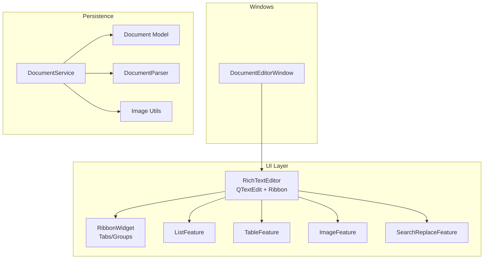
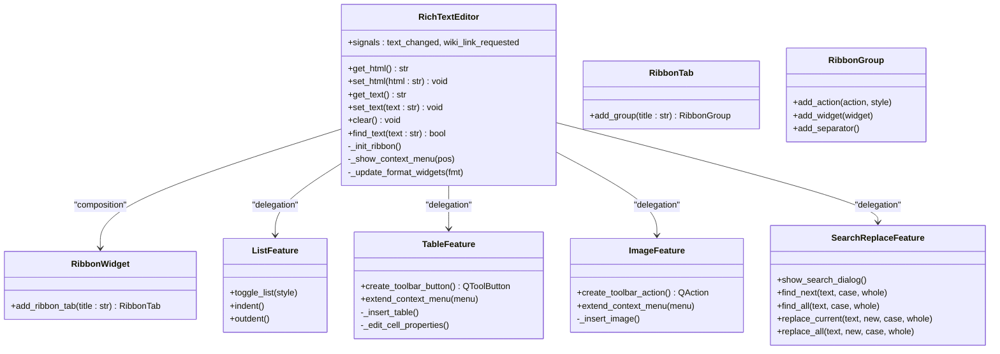
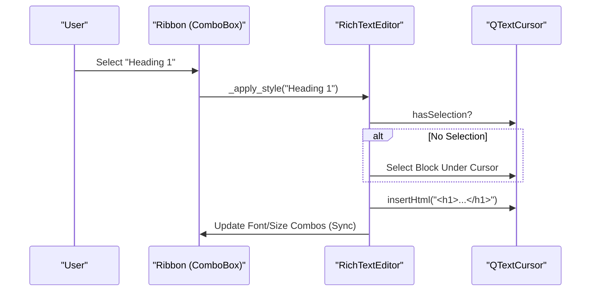
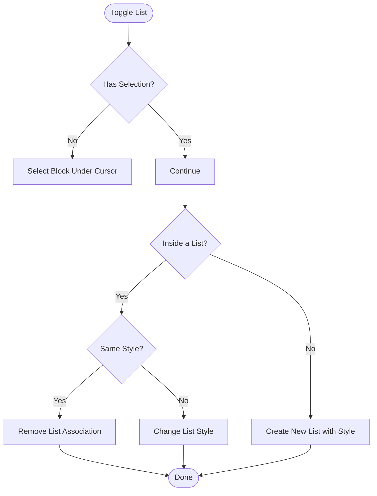
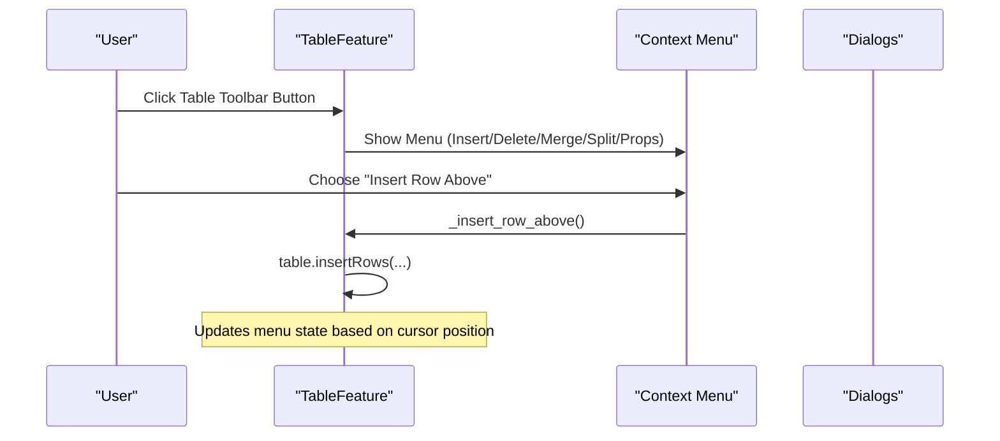
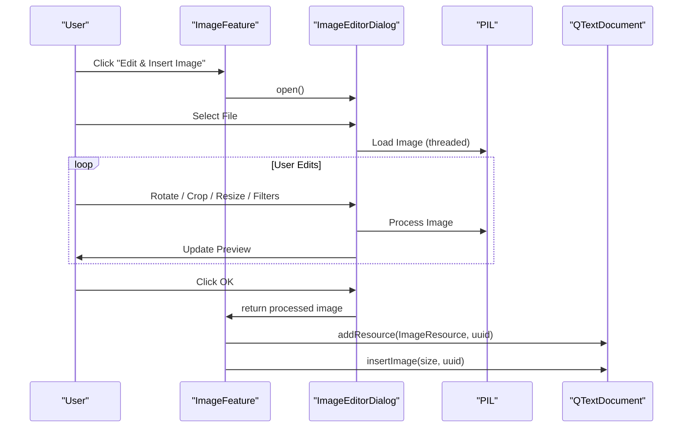
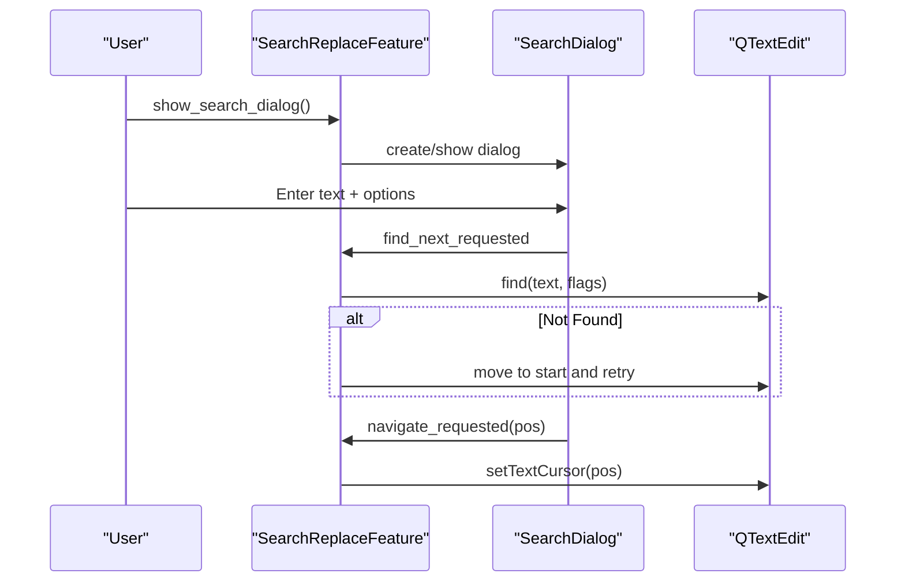
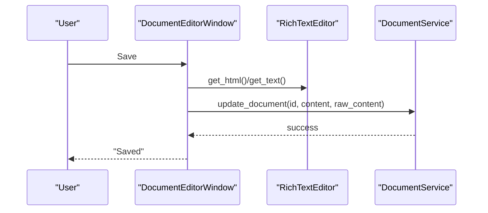
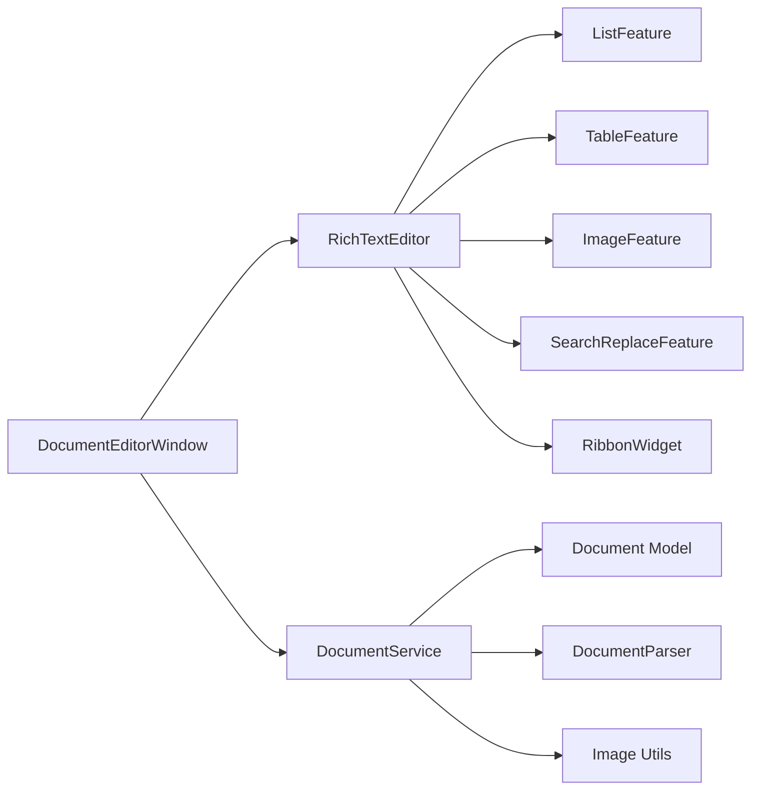

# Document Manager Rich Text Editor Enhancements

<cite>
**Referenced Files in This Document**
- [rich_text_editor.md](file://Docs/architecture/rich_text_editor.md)
- [rich_text_editor.py](file://src/pillars/document_manager/ui/rich_text_editor.py)
- [list_features.py](file://src/pillars/document_manager/ui/list_features.py)
- [table_features.py](file://src/pillars/document_manager/ui/table_features.py)
- [image_features.py](file://src/pillars/document_manager/ui/image_features.py)
- [search_features.py](file://src/pillars/document_manager/ui/search_features.py)
- [ribbon_widget.py](file://src/pillars/document_manager/ui/ribbon_widget.py)
- [document_editor_window.py](file://src/pillars/document_manager/ui/document_editor_window.py)
- [parsers.py](file://src/pillars/document_manager/utils/parsers.py)
- [image_utils.py](file://src/pillars/document_manager/utils/image_utils.py)
- [document.py](file://src/pillars/document_manager/models/document.py)
- [document_service.py](file://src/pillars/document_manager/services/document_service.py)
</cite>

## Table of Contents
1. [Introduction](#introduction)
2. [Project Structure](#project-structure)
3. [Core Components](#core-components)
4. [Architecture Overview](#architecture-overview)
5. [Detailed Component Analysis](#detailed-component-analysis)
6. [Dependency Analysis](#dependency-analysis)
7. [Performance Considerations](#performance-considerations)
8. [Troubleshooting Guide](#troubleshooting-guide)
9. [Conclusion](#conclusion)
10. [Appendices](#appendices)

## Introduction
This document describes the enhancements and capabilities of the Document Manager’s Rich Text Editor (RTE) subsystem. The RTE is a reusable PyQt-based widget that augments QTextEdit with a modern “Ribbon” interface and a suite of productivity features including lists, tables, images, hyperlinks, horizontal rules, special characters, page setup, printing, and PDF export. It also integrates tightly with the Document Manager’s persistence layer to support wiki-style linking, search, and image handling.

The goal is to provide both a high-level overview and code-level insights to help developers extend or integrate the editor effectively.

## Project Structure
The RTE resides in the Document Manager pillar and is composed of:
- A central editor widget with a Ribbon UI
- Feature modules for lists, tables, images, and search
- Ribbon infrastructure for organizing actions
- Dialogs for hyperlinks, horizontal rules, page setup, and PDF export
- Integration with the document service and persistence models

**Diagram sources**
- [rich_text_editor.py](file://src/pillars/document_manager/ui/rich_text_editor.py#L520-L1510)
- [list_features.py](file://src/pillars/document_manager/ui/list_features.py#L1-L108)
- [table_features.py](file://src/pillars/document_manager/ui/table_features.py#L1-L798)
- [image_features.py](file://src/pillars/document_manager/ui/image_features.py#L1-L983)
- [search_features.py](file://src/pillars/document_manager/ui/search_features.py#L1-L365)
- [document_editor_window.py](file://src/pillars/document_manager/ui/document_editor_window.py#L1-L339)
- [parsers.py](file://src/pillars/document_manager/utils/parsers.py#L1-L275)
- [image_utils.py](file://src/pillars/document_manager/utils/image_utils.py#L1-L143)
- [document.py](file://src/pillars/document_manager/models/document.py#L1-L71)
- [document_service.py](file://src/pillars/document_manager/services/document_service.py#L1-L330)

**Section sources**
- [rich_text_editor.py](file://src/pillars/document_manager/ui/rich_text_editor.py#L520-L1510)
- [document_editor_window.py](file://src/pillars/document_manager/ui/document_editor_window.py#L1-L339)

## Core Components
- RichTextEditor: Central widget that composes the Ribbon and delegates feature logic to specialized modules. It exposes signals for text changes and wiki-link triggers, and provides public APIs to get/set HTML/text.
- Feature Modules:
  - ListFeature: Bullet/number lists, indentation/outdenting, and list style switching.
  - TableFeature: Table creation, row/column operations, cell properties, borders, and table-wide properties.
  - ImageFeature: Image insertion with a pre-edit dialog (crop, rotate, resize, filters), and post-insertion properties.
  - SearchReplaceFeature: Non-modal find/replace dialog with find-all and replace-all.
- RibbonWidget: A themed tabbed toolbar organizing actions into logical groups.
- Dialogs: Hyperlink, Horizontal Rule, Page Setup, Export PDF, Special Characters, and Print Preview dialogs.
- Persistence Integration: DocumentEditorWindow wires the editor to DocumentService for save/open/export, and uses DocumentParser/ImageUtils for import/export.

**Section sources**
- [rich_text_editor.py](file://src/pillars/document_manager/ui/rich_text_editor.py#L520-L1510)
- [list_features.py](file://src/pillars/document_manager/ui/list_features.py#L1-L108)
- [table_features.py](file://src/pillars/document_manager/ui/table_features.py#L1-L798)
- [image_features.py](file://src/pillars/document_manager/ui/image_features.py#L1-L983)
- [search_features.py](file://src/pillars/document_manager/ui/search_features.py#L1-L365)
- [ribbon_widget.py](file://src/pillars/document_manager/ui/ribbon_widget.py#L1-L237)
- [document_editor_window.py](file://src/pillars/document_manager/ui/document_editor_window.py#L1-L339)

## Architecture Overview
The RTE follows a composition-over-inheritance design. The main widget initializes the Ribbon and feature modules, then delegates functionality to them. The editor emits signals consumed by the parent window (DocumentEditorWindow), which orchestrates persistence and UI actions.

**Diagram sources**
- [rich_text_editor.py](file://src/pillars/document_manager/ui/rich_text_editor.py#L520-L1510)
- [list_features.py](file://src/pillars/document_manager/ui/list_features.py#L1-L108)
- [table_features.py](file://src/pillars/document_manager/ui/table_features.py#L1-L798)
- [image_features.py](file://src/pillars/document_manager/ui/image_features.py#L1-L983)
- [search_features.py](file://src/pillars/document_manager/ui/search_features.py#L1-L365)
- [ribbon_widget.py](file://src/pillars/document_manager/ui/ribbon_widget.py#L1-L237)

**Section sources**
- [rich_text_editor.md](file://Docs/architecture/rich_text_editor.md#L1-L179)

## Detailed Component Analysis

### RichTextEditor: Ribbon, Styling, and Actions
- Ribbon initialization organizes actions into Home, Insert, and Page Layout tabs with groups for font, paragraph, tables, illustrations, symbols, links, elements, page setup, export, and print.
- Semantic styles (Title, Heading 1–3, Code) are applied by wrapping selected text in appropriate HTML tags with inline styles to ensure consistent rendering.
- Formatting synchronization: On cursor format changes, the Ribbon updates buttons for bold, italic, underline, strikethrough, subscript/superscript, and alignment.
- Page layout actions: Page Setup dialog stores page size/orientation/margins; Export PDF and Print/Preview dialogs use these settings.
- Wiki-link trigger: Detects when the user types two opening brackets and emits a signal to open a link selector dialog.

**Diagram sources**
- [rich_text_editor.py](file://src/pillars/document_manager/ui/rich_text_editor.py#L1156-L1204)

**Section sources**
- [rich_text_editor.py](file://src/pillars/document_manager/ui/rich_text_editor.py#L520-L1510)
- [rich_text_editor.md](file://Docs/architecture/rich_text_editor.md#L87-L154)

### ListFeature: Bulleted and Numbered Lists
- Toggles list style for the current selection or block.
- Supports nested indentation by creating sub-lists or increasing block indent.
- Ensures consistent behavior for exiting list mode and resetting paragraph indent.

**Diagram sources**
- [list_features.py](file://src/pillars/document_manager/ui/list_features.py#L1-L108)

**Section sources**
- [list_features.py](file://src/pillars/document_manager/ui/list_features.py#L1-L108)

### TableFeature: Tables, Rows, Columns, and Cell Properties
- Provides a toolbar button that opens a contextual menu with insert-row/insert-column, delete-row/delete-column, delete-table, merge/split cells, distribute columns, and properties.
- Offers dialogs for table properties (width, border, cell spacing/padding), cell properties (padding, vertical alignment), and cell border styles (per-side).
- Supports column width constraints and percentage/fixed sizing.

**Diagram sources**
- [table_features.py](file://src/pillars/document_manager/ui/table_features.py#L441-L798)

**Section sources**
- [table_features.py](file://src/pillars/document_manager/ui/table_features.py#L1-L798)

### ImageFeature: Pre-Edit Workflow and Insertion
- Provides an “Edit & Insert Image” action that opens a modal dialog with:
  - Image loader worker to offload decoding to a background thread
  - Crop preview with rubber-band selection and live crop confirmation
  - Adjustments: brightness, contrast, saturation, sharpness, and filters
  - Layout options: display size presets, alignment, and margins
- On accept, inserts the processed image into the document with a UUID resource and applies properties.

**Diagram sources**
- [image_features.py](file://src/pillars/document_manager/ui/image_features.py#L1-L983)

**Section sources**
- [image_features.py](file://src/pillars/document_manager/ui/image_features.py#L1-L983)

### SearchReplaceFeature: Find, Replace, and Navigation
- Non-modal dialog stays on top and supports find-next, find-all, replace-current, and replace-all.
- Highlights matches and lets users click results to navigate to positions.
- Uses QTextDocument find with case-sensitive and whole-word options and wraps around the document.

**Diagram sources**
- [search_features.py](file://src/pillars/document_manager/ui/search_features.py#L1-L365)

**Section sources**
- [search_features.py](file://src/pillars/document_manager/ui/search_features.py#L1-L365)

### RibbonWidget: Themed Tabs and Groups
- Provides a modern, shadowed tabbed interface with styled buttons and comboboxes.
- RibbonTab and RibbonGroup encapsulate layout and labeling for action organization.

**Section sources**
- [ribbon_widget.py](file://src/pillars/document_manager/ui/ribbon_widget.py#L1-L237)

### DocumentEditorWindow: Integration with Persistence and UI
- Hosts the RichTextEditor and wires signals for text changes and wiki-link requests.
- Implements File menu actions: New, Open, Save, Save As, Export PDF.
- Uses DocumentService to persist HTML content and plain text, and to restore images for display.

**Diagram sources**
- [document_editor_window.py](file://src/pillars/document_manager/ui/document_editor_window.py#L253-L290)
- [document_service.py](file://src/pillars/document_manager/services/document_service.py#L225-L245)

**Section sources**
- [document_editor_window.py](file://src/pillars/document_manager/ui/document_editor_window.py#L1-L339)
- [document_service.py](file://src/pillars/document_manager/services/document_service.py#L1-L330)

## Dependency Analysis
- Internal dependencies:
  - RichTextEditor depends on feature modules and RibbonWidget.
  - Feature modules depend on Qt GUI types and QText* formats.
  - DocumentEditorWindow depends on RichTextEditor and DocumentService.
- Persistence dependencies:
  - DocumentService uses SQLAlchemy models and repositories.
  - Image handling uses base64 extraction/restoration and database-backed storage.
  - Parsing supports multiple formats (.txt, .html, .docx, .pdf, .rtf) with optional third-party libraries.

**Diagram sources**
- [rich_text_editor.py](file://src/pillars/document_manager/ui/rich_text_editor.py#L520-L1510)
- [document_editor_window.py](file://src/pillars/document_manager/ui/document_editor_window.py#L1-L339)
- [document_service.py](file://src/pillars/document_manager/services/document_service.py#L1-L330)
- [parsers.py](file://src/pillars/document_manager/utils/parsers.py#L1-L275)
- [image_utils.py](file://src/pillars/document_manager/utils/image_utils.py#L1-L143)
- [document.py](file://src/pillars/document_manager/models/document.py#L1-L71)

**Section sources**
- [document_service.py](file://src/pillars/document_manager/services/document_service.py#L1-L330)
- [parsers.py](file://src/pillars/document_manager/utils/parsers.py#L1-L275)
- [image_utils.py](file://src/pillars/document_manager/utils/image_utils.py#L1-L143)
- [document.py](file://src/pillars/document_manager/models/document.py#L1-L71)

## Performance Considerations
- Large paste protection: The editor warns before inserting very large text to prevent UI freezes.
- Replace-all optimization: Temporarily disables updates during bulk replacements to reduce repaint overhead.
- Image processing offloading: Decoding and editing images runs in a background thread to keep the UI responsive.
- Printing/PDF: Uses Qt’s print pipeline; page layout is configurable and cached for subsequent operations.
- Search-all: Iterates the document to collect matches; consider limiting result lists for very large documents.

[No sources needed since this section provides general guidance]

## Troubleshooting Guide
- Paste freezes: The SafeTextEdit wrapper prompts before inserting extremely large content. Reduce clipboard size or paste in smaller chunks.
- Table formatting anomalies: TableFeature relies on Qt’s QTextTableFormat. If borders or spacing appear inconsistent, use the Table Properties dialog to normalize widths and styles.
- Image insertion issues: Ensure Pillow is installed for the “Edit & Insert” workflow. If crops fail, verify the selection rectangle is valid and the image is decodable.
- PDF export margins: Use Page Setup to define margins and orientation; Export PDF applies these settings automatically.
- Wiki links: When typing [[, the editor emits a signal; ensure the link selector dialog is reachable and that DocumentService is available to resolve titles.

**Section sources**
- [rich_text_editor.py](file://src/pillars/document_manager/ui/rich_text_editor.py#L24-L53)
- [table_features.py](file://src/pillars/document_manager/ui/table_features.py#L1-L798)
- [image_features.py](file://src/pillars/document_manager/ui/image_features.py#L1-L983)
- [document_editor_window.py](file://src/pillars/document_manager/ui/document_editor_window.py#L1-L339)

## Conclusion
The Document Manager’s Rich Text Editor is a robust, extensible component that brings professional-grade editing to the application. Its modular architecture, comprehensive Ribbon interface, and deep integration with persistence and search enable authors to produce rich documents with tables, images, and structured content. The enhancements outlined here—especially the image pre-edit workflow, table management, and print/export capabilities—make it suitable for advanced documentation scenarios.

[No sources needed since this section summarizes without analyzing specific files]

## Appendices

### API Surface Summary
- RichTextEditor
  - Signals: text_changed, wiki_link_requested
  - Methods: get_html, set_html, get_text, set_text, clear, find_text
- ListFeature: toggle_list, indent, outdent
- TableFeature: create_toolbar_button, extend_context_menu
- ImageFeature: create_toolbar_action, extend_context_menu
- SearchReplaceFeature: show_search_dialog, find_next, find_all, replace_current, replace_all
- RibbonWidget: add_ribbon_tab, RibbonTab.add_group, RibbonGroup.add_action/add_widget/add_separator

**Section sources**
- [rich_text_editor.py](file://src/pillars/document_manager/ui/rich_text_editor.py#L520-L1510)
- [list_features.py](file://src/pillars/document_manager/ui/list_features.py#L1-L108)
- [table_features.py](file://src/pillars/document_manager/ui/table_features.py#L1-L798)
- [image_features.py](file://src/pillars/document_manager/ui/image_features.py#L1-L983)
- [search_features.py](file://src/pillars/document_manager/ui/search_features.py#L1-L365)
- [ribbon_widget.py](file://src/pillars/document_manager/ui/ribbon_widget.py#L1-L237)