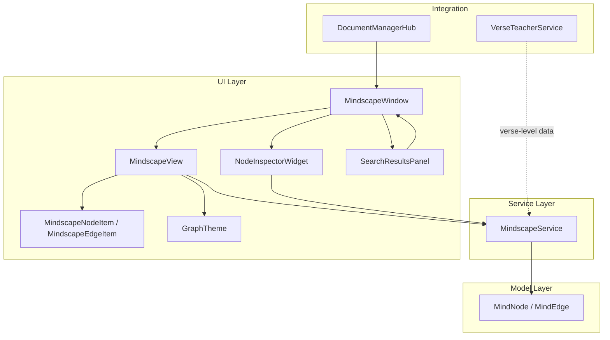
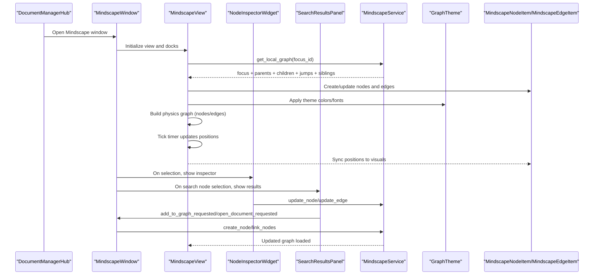
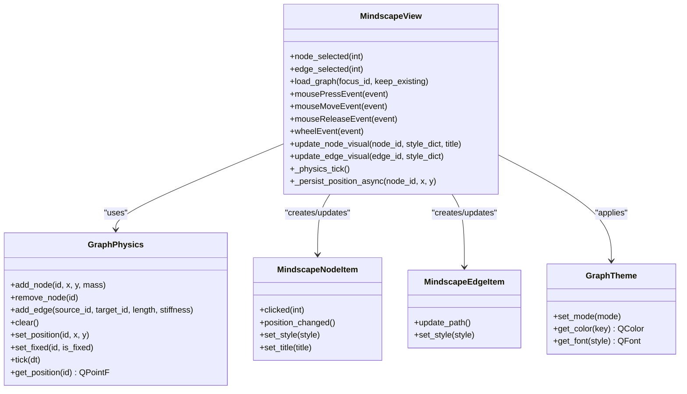
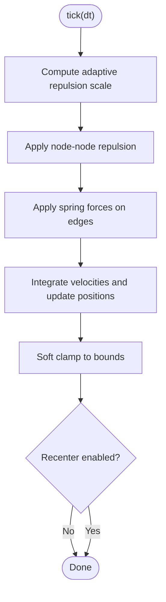
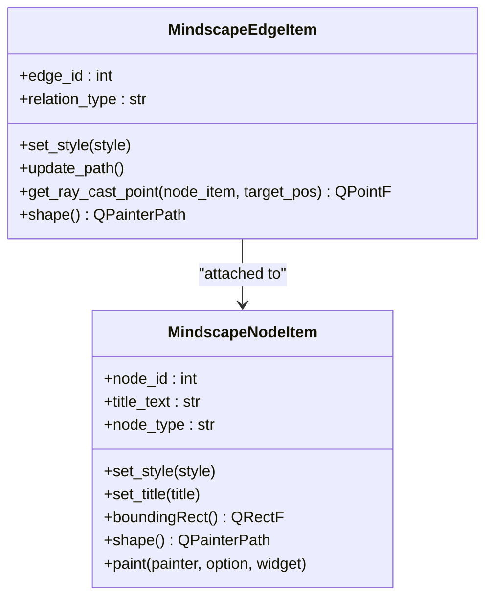
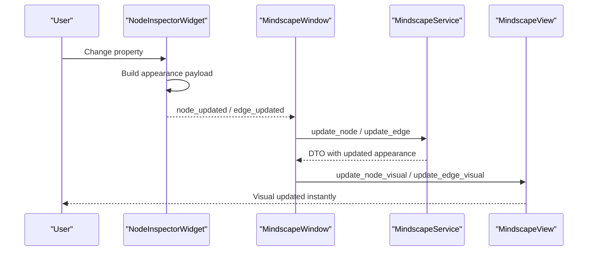
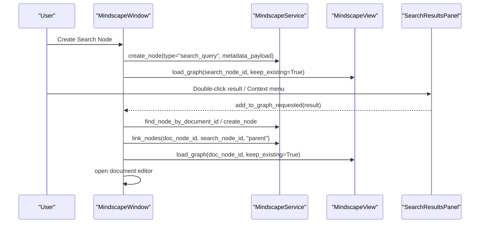
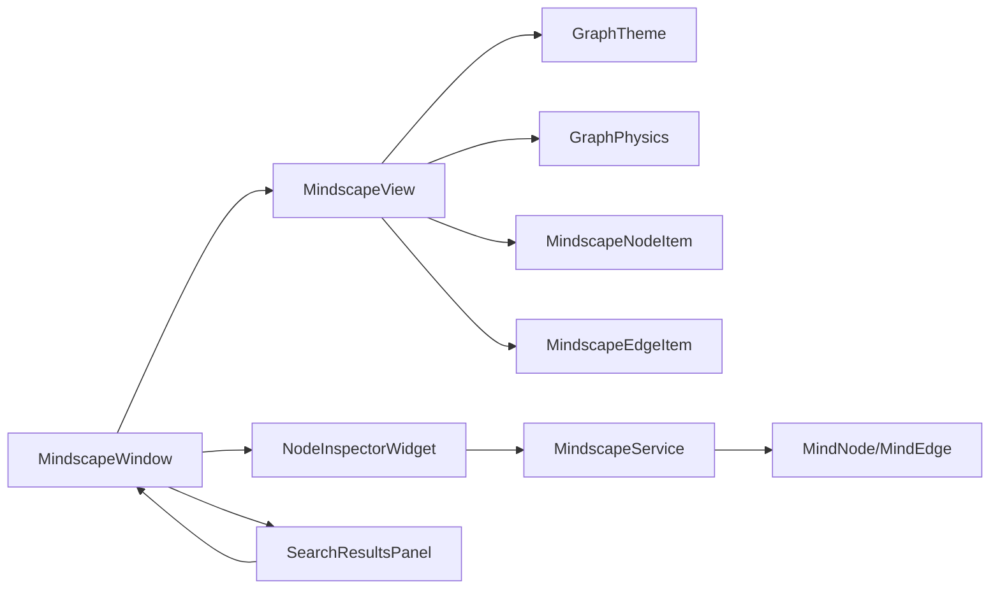

# Metadata Graph Visualization

<cite>
**Referenced Files in This Document**
- [mindscape_view.py](file://src/pillars/document_manager/ui/mindscape_view.py)
- [graph_physics.py](file://src/pillars/document_manager/ui/graph_physics.py)
- [mindscape_items.py](file://src/pillars/document_manager/ui/mindscape_items.py)
- [mindscape_theme.py](file://src/pillars/document_manager/ui/mindscape_theme.py)
- [mindscape_inspector.py](file://src/pillars/document_manager/ui/mindscape_inspector.py)
- [mindscape_window.py](file://src/pillars/document_manager/ui/mindscape_window.py)
- [mindscape_service.py](file://src/pillars/document_manager/services/mindscape_service.py)
- [mindscape.py](file://src/pillars/document_manager/models/mindscape.py)
- [search_results_panel.py](file://src/pillars/document_manager/ui/search_results_panel.py)
- [document_manager_hub.py](file://src/pillars/document_manager/ui/document_manager_hub.py)
- [verse_teacher_service.py](file://src/pillars/document_manager/services/verse_teacher_service.py)
- [graph_view.py](file://src/pillars/document_manager/ui/graph_view.py)
</cite>

## Table of Contents
1. [Introduction](#introduction)
2. [Project Structure](#project-structure)
3. [Core Components](#core-components)
4. [Architecture Overview](#architecture-overview)
5. [Detailed Component Analysis](#detailed-component-analysis)
6. [Dependency Analysis](#dependency-analysis)
7. [Performance Considerations](#performance-considerations)
8. [Troubleshooting Guide](#troubleshooting-guide)
9. [Conclusion](#conclusion)
10. [Appendices](#appendices)

## Introduction
This document describes the Metadata Graph Visualization system in the Document Manager pillar. It focuses on the Mindscape visualization, which organizes documents and ideas as a spatial graph. The system comprises:
- A graph view that renders nodes and edges
- A physics engine that computes dynamic layouts
- A mindscape model with nodes and edges
- Visual styling via a theme system
- An inspector for editing node and edge properties
- Context menus and interaction patterns
- Integration with search results and document workflows
- Guidance on performance and customization

## Project Structure
The visualization lives in the Document Manager UI layer and interacts with the service and model layers. The key files are organized as follows:
- UI: Mindscape view, items, theme, inspector, window, and search results panel
- Services: Mindscape service for graph traversal and persistence
- Models: Mindscape domain entities
- Integration: Document Manager hub and Verse Teacher service

**Diagram sources**
- [mindscape_window.py](file://src/pillars/document_manager/ui/mindscape_window.py#L1-L120)
- [mindscape_view.py](file://src/pillars/document_manager/ui/mindscape_view.py#L1-L120)
- [mindscape_items.py](file://src/pillars/document_manager/ui/mindscape_items.py#L1-L120)
- [mindscape_theme.py](file://src/pillars/document_manager/ui/mindscape_theme.py#L1-L79)
- [mindscape_inspector.py](file://src/pillars/document_manager/ui/mindscape_inspector.py#L1-L120)
- [search_results_panel.py](file://src/pillars/document_manager/ui/search_results_panel.py#L1-L80)
- [mindscape_service.py](file://src/pillars/document_manager/services/mindscape_service.py#L1-L120)
- [mindscape.py](file://src/pillars/document_manager/models/mindscape.py#L1-L53)
- [document_manager_hub.py](file://src/pillars/document_manager/ui/document_manager_hub.py#L1-L120)
- [verse_teacher_service.py](file://src/pillars/document_manager/services/verse_teacher_service.py#L1-L120)

**Section sources**
- [mindscape_window.py](file://src/pillars/document_manager/ui/mindscape_window.py#L1-L120)
- [mindscape_view.py](file://src/pillars/document_manager/ui/mindscape_view.py#L1-L120)
- [mindscape_service.py](file://src/pillars/document_manager/services/mindscape_service.py#L1-L120)
- [mindscape.py](file://src/pillars/document_manager/models/mindscape.py#L1-L53)

## Core Components
- MindscapeView: The interactive canvas that loads a “Plex” (local graph) around a focus node, manages physics, and updates visuals.
- GraphPhysics: A force-directed engine that simulates repulsion between nodes and spring forces along edges.
- MindscapeNodeItem / MindscapeEdgeItem: Qt graphics items that render nodes and edges with customizable shapes, colors, and strokes.
- GraphTheme: Palette-driven theming for colors and fonts.
- NodeInspectorWidget: Dockable panel to edit node and edge appearance and properties.
- MindscapeService: Service layer for CRUD, graph traversal, and persistence of nodes and edges.
- SearchResultsPanel: Dockable panel to display search results and add them to the graph.
- DocumentManagerHub: Launcher for the Mindscape window and other Document Manager tools.
- VerseTeacherService: Provides verse-level data that can inform thematic clustering and associations.

**Section sources**
- [mindscape_view.py](file://src/pillars/document_manager/ui/mindscape_view.py#L1-L120)
- [graph_physics.py](file://src/pillars/document_manager/ui/graph_physics.py#L1-L120)
- [mindscape_items.py](file://src/pillars/document_manager/ui/mindscape_items.py#L1-L120)
- [mindscape_theme.py](file://src/pillars/document_manager/ui/mindscape_theme.py#L1-L79)
- [mindscape_inspector.py](file://src/pillars/document_manager/ui/mindscape_inspector.py#L1-L120)
- [mindscape_service.py](file://src/pillars/document_manager/services/mindscape_service.py#L1-L120)
- [search_results_panel.py](file://src/pillars/document_manager/ui/search_results_panel.py#L1-L120)
- [document_manager_hub.py](file://src/pillars/document_manager/ui/document_manager_hub.py#L1-L120)
- [verse_teacher_service.py](file://src/pillars/document_manager/services/verse_teacher_service.py#L1-L120)

## Architecture Overview
The visualization architecture centers on a layered design:
- UI layer constructs and renders the graph, handles interactions, and updates visuals.
- Service layer encapsulates graph traversal and persistence.
- Model layer defines the mindscape entities and JSON-based appearance metadata.
- Integration layer connects to search and document workflows.

**Diagram sources**
- [document_manager_hub.py](file://src/pillars/document_manager/ui/document_manager_hub.py#L160-L182)
- [mindscape_window.py](file://src/pillars/document_manager/ui/mindscape_window.py#L1-L120)
- [mindscape_view.py](file://src/pillars/document_manager/ui/mindscape_view.py#L50-L190)
- [mindscape_service.py](file://src/pillars/document_manager/services/mindscape_service.py#L380-L456)
- [mindscape_items.py](file://src/pillars/document_manager/ui/mindscape_items.py#L1-L120)
- [mindscape_theme.py](file://src/pillars/document_manager/ui/mindscape_theme.py#L1-L79)
- [mindscape_inspector.py](file://src/pillars/document_manager/ui/mindscape_inspector.py#L1-L120)
- [search_results_panel.py](file://src/pillars/document_manager/ui/search_results_panel.py#L1-L120)

## Detailed Component Analysis

### MindscapeView: Rendering and Interaction
MindscapeView orchestrates loading a local graph, managing physics, and handling user interactions:
- Loads a “Plex” around a focus node (parents, children, jumps, siblings).
- Synchronizes items with the physics engine and updates visuals each tick.
- Handles node drag-and-drop, edge selection, zoom, and click-to-select.
- Persists node positions asynchronously to keep UI responsive.

**Diagram sources**
- [mindscape_view.py](file://src/pillars/document_manager/ui/mindscape_view.py#L1-L360)
- [graph_physics.py](file://src/pillars/document_manager/ui/graph_physics.py#L1-L189)
- [mindscape_items.py](file://src/pillars/document_manager/ui/mindscape_items.py#L1-L200)
- [mindscape_theme.py](file://src/pillars/document_manager/ui/mindscape_theme.py#L1-L79)

**Section sources**
- [mindscape_view.py](file://src/pillars/document_manager/ui/mindscape_view.py#L50-L360)

### GraphPhysics: Dynamic Layout Calculations
The physics engine implements a force-directed layout:
- Repulsion between nodes proportional to mass and inverse distance squared.
- Spring forces along edges based on desired length and stiffness.
- Damping and speed limiting to stabilize motion.
- Optional center gravity and recentering are configurable but disabled by default.

**Diagram sources**
- [graph_physics.py](file://src/pillars/document_manager/ui/graph_physics.py#L78-L189)

**Section sources**
- [graph_physics.py](file://src/pillars/document_manager/ui/graph_physics.py#L1-L189)

### Mindscape Items: Visual Representation
Nodes and edges are rendered with rich customization:
- Node shapes include capsule, circle, diamond, hexagon, triangle variants, and document-like shapes.
- Edges support solid, dashed, and dotted styles; jump edges default to dashed.
- Hover and selection glow effects; radial gradient fills; border customization.
- Ray-cast anchors ensure smooth curves and consistent edge routing.

**Diagram sources**
- [mindscape_items.py](file://src/pillars/document_manager/ui/mindscape_items.py#L1-L407)

**Section sources**
- [mindscape_items.py](file://src/pillars/document_manager/ui/mindscape_items.py#L1-L407)

### Theme System: Styling and Customization
GraphTheme provides palette-driven theming:
- Multiple palettes (Dark, Light, Egyptian) with named keys for background, node colors, edge colors, text, and glows.
- Fonts mapped by style; configurable per palette.

**Section sources**
- [mindscape_theme.py](file://src/pillars/document_manager/ui/mindscape_theme.py#L1-L79)

### Inspector: Node and Edge Editing
The inspector allows live editing of:
- Node: title, shape, tags, font family/size, text color, fill color, border width/style/color.
- Edge: relation type and style/color.
Updates are persisted via the service and reflected immediately in the view.

**Diagram sources**
- [mindscape_inspector.py](file://src/pillars/document_manager/ui/mindscape_inspector.py#L1-L302)
- [mindscape_window.py](file://src/pillars/document_manager/ui/mindscape_window.py#L360-L405)
- [mindscape_view.py](file://src/pillars/document_manager/ui/mindscape_view.py#L283-L316)

**Section sources**
- [mindscape_inspector.py](file://src/pillars/document_manager/ui/mindscape_inspector.py#L1-L302)
- [mindscape_window.py](file://src/pillars/document_manager/ui/mindscape_window.py#L360-L405)
- [mindscape_view.py](file://src/pillars/document_manager/ui/mindscape_view.py#L283-L316)

### Search Integration and Navigation Workflows
The system integrates with search and document workflows:
- Create a search node containing results metadata; select to show the Search Results panel.
- Add a document result to the graph as a node and link it to the current focus.
- Open a document directly from the graph or results panel.
- Import documents to create nodes and link them as jumps or parents.

**Diagram sources**
- [mindscape_window.py](file://src/pillars/document_manager/ui/mindscape_window.py#L108-L200)
- [search_results_panel.py](file://src/pillars/document_manager/ui/search_results_panel.py#L1-L140)
- [mindscape_service.py](file://src/pillars/document_manager/services/mindscape_service.py#L307-L348)

**Section sources**
- [mindscape_window.py](file://src/pillars/document_manager/ui/mindscape_window.py#L108-L200)
- [search_results_panel.py](file://src/pillars/document_manager/ui/search_results_panel.py#L1-L140)
- [mindscape_service.py](file://src/pillars/document_manager/services/mindscape_service.py#L307-L348)

### Verse-Level Associations and Thematic Clusters
Verse-level data can inform thematic clustering:
- The Verse Teacher service parses and curates verses, detects anomalies, and applies rules.
- These curated structures can be represented as document nodes and connected to concepts in the graph.
- The inspector supports adding tags and customizing appearance to reflect thematic groupings.

Practical steps:
- Use the Verse Teacher to curate a document’s verses.
- Create a document node in the graph and link it to a concept node representing a theme.
- Customize node appearance (shape, color, tags) to visually cluster related documents.

**Section sources**
- [verse_teacher_service.py](file://src/pillars/document_manager/services/verse_teacher_service.py#L1-L352)
- [mindscape_service.py](file://src/pillars/document_manager/services/mindscape_service.py#L1-L120)
- [mindscape_inspector.py](file://src/pillars/document_manager/ui/mindscape_inspector.py#L1-L120)

### Deprecated Knowledge Graph Placeholder
A deprecated knowledge graph placeholder remains for backward compatibility.

**Section sources**
- [graph_view.py](file://src/pillars/document_manager/ui/graph_view.py#L1-L8)

## Dependency Analysis
The visualization components depend on each other as follows:
- MindscapeWindow depends on MindscapeView, NodeInspectorWidget, and SearchResultsPanel.
- MindscapeView depends on GraphTheme, GraphPhysics, and MindscapeNodeItem/MindscapeEdgeItem.
- NodeInspectorWidget emits updates consumed by MindscapeWindow, which persists via MindscapeService.
- SearchResultsPanel emits requests processed by MindscapeWindow and MindscapeService.
- MindscapeService depends on the mindscape models and uses JSON columns for appearance metadata.

**Diagram sources**
- [mindscape_window.py](file://src/pillars/document_manager/ui/mindscape_window.py#L1-L120)
- [mindscape_view.py](file://src/pillars/document_manager/ui/mindscape_view.py#L1-L120)
- [mindscape_items.py](file://src/pillars/document_manager/ui/mindscape_items.py#L1-L120)
- [mindscape_theme.py](file://src/pillars/document_manager/ui/mindscape_theme.py#L1-L79)
- [graph_physics.py](file://src/pillars/document_manager/ui/graph_physics.py#L1-L120)
- [mindscape_service.py](file://src/pillars/document_manager/services/mindscape_service.py#L1-L120)
- [mindscape.py](file://src/pillars/document_manager/models/mindscape.py#L1-L53)

**Section sources**
- [mindscape_window.py](file://src/pillars/document_manager/ui/mindscape_window.py#L1-L120)
- [mindscape_view.py](file://src/pillars/document_manager/ui/mindscape_view.py#L1-L120)
- [mindscape_service.py](file://src/pillars/document_manager/services/mindscape_service.py#L1-L120)
- [mindscape.py](file://src/pillars/document_manager/models/mindscape.py#L1-L53)

## Performance Considerations
- Physics throttling: The view adapts timer intervals based on node count to keep the UI responsive for large graphs.
- Asynchronous position persistence: Position updates are offloaded to a worker thread to avoid blocking the UI.
- Edge path updates: Edges recalculate paths every tick to remain aligned with moving nodes.
- Rendering hints: Antialiasing and viewport update modes are configured for smooth visuals.
- Memory management: Dead items are removed when switching focus; edges are rebuilt when resetting.

Recommendations:
- Prefer keep-existing loading when navigating frequently to avoid rebuilding physics edges.
- Use the inspector to adjust node sizes and borders to reduce visual clutter.
- Limit simultaneous heavy animations (e.g., many simultaneous color changes) during large updates.

**Section sources**
- [mindscape_view.py](file://src/pillars/document_manager/ui/mindscape_view.py#L297-L360)

## Troubleshooting Guide
Common issues and resolutions:
- Blank canvas on startup: Ensure a root node exists or create one via the context menu.
- Nodes not sticking after drag: Verify that physics anchoring and position persistence are functioning; confirm asynchronous persistence completes.
- Edge visuals not updating: Ensure edges are rebuilt when resetting the view; otherwise, tick updates should synchronize paths.
- Search node not linking automatically: The UI intentionally isolates search nodes; manually add documents to the graph and link them.
- Inspector changes not reflected: Confirm the service update succeeded and the view was refreshed with update_node_visual/update_edge_visual.
- Large graph lag: Reduce node count or enable physics throttling; consider disabling physics temporarily for navigation.

**Section sources**
- [mindscape_window.py](file://src/pillars/document_manager/ui/mindscape_window.py#L310-L360)
- [mindscape_view.py](file://src/pillars/document_manager/ui/mindscape_view.py#L297-L360)
- [mindscape_service.py](file://src/pillars/document_manager/services/mindscape_service.py#L380-L456)

## Conclusion
The Metadata Graph Visualization system provides a flexible, interactive way to organize documents and ideas spatially. The MindscapeView, powered by GraphPhysics, offers dynamic layouts; the inspector enables deep customization; and integration with search and document workflows streamlines knowledge construction. The theme system and rich node/edge styling allow for thematic clustering and clear visual semantics.

## Appendices

### Example Workflows
- Knowledge graph construction:
  - Create a concept node (root or child).
  - Import documents to create document nodes.
  - Link documents to concepts as parents or jumps.
  - Use the inspector to customize shapes/colors/tags for thematic grouping.
- Navigation:
  - Select a node to center the view on it.
  - Use context menus to add children/parents/jumps.
  - Zoom with the mouse wheel; pan with scroll hand drag.
- Integration with search:
  - Create a search node; populate results.
  - Add a result to the graph; open the document editor to review highlights.

**Section sources**
- [mindscape_window.py](file://src/pillars/document_manager/ui/mindscape_window.py#L406-L775)
- [mindscape_view.py](file://src/pillars/document_manager/ui/mindscape_view.py#L199-L360)
- [mindscape_service.py](file://src/pillars/document_manager/services/mindscape_service.py#L380-L456)