# Search and Indexing System

<cite>
**Referenced Files in This Document**   
- [document_search_window.py](file://src/pillars/document_manager/ui/document_search_window.py)
- [search_results_panel.py](file://src/pillars/document_manager/ui/search_results_panel.py)
- [search_features.py](file://src/pillars/document_manager/ui/search_features.py)
- [search_repository.py](file://src/pillars/document_manager/repositories/search_repository.py)
- [document_service.py](file://src/pillars/document_manager/services/document_service.py)
- [document.py](file://src/pillars/document_manager/models/document.py)
- [verse_teacher_service.py](file://src/pillars/document_manager/services/verse_teacher_service.py)
- [document_library.py](file://src/pillars/document_manager/ui/document_library.py)
- [text_analysis_service.py](file://src/pillars/gematria/services/text_analysis_service.py)
</cite>

## Table of Contents
1. [Introduction](#introduction)
2. [Architecture Overview](#architecture-overview)
3. [Indexing Strategies](#indexing-strategies)
4. [Query Parsing and Search Implementation](#query-parsing-and-search-implementation)
5. [Search Interfaces](#search-interfaces)
6. [Advanced Search Features](#advanced-search-features)
7. [Performance Optimization](#performance-optimization)
8. [Troubleshooting Guide](#troubleshooting-guide)
9. [Configuration Options](#configuration-options)

## Introduction
The Search and Indexing System in the Document Manager pillar provides comprehensive full-text search capabilities using the Whoosh library. This system enables users to efficiently search through large document collections with advanced features including verse-level filtering, Holy Book teacher mode integration, and gematria analysis. The implementation combines a robust indexing strategy with sophisticated query parsing and result ranking to deliver accurate and relevant search results. The system is designed to handle document updates efficiently while maintaining search accuracy and performance.

## Architecture Overview
The Search and Indexing System follows a layered architecture with clear separation of concerns between the user interface, service layer, and repository layer. The system uses Whoosh as the underlying search engine for full-text search capabilities, providing efficient indexing and querying of document content.

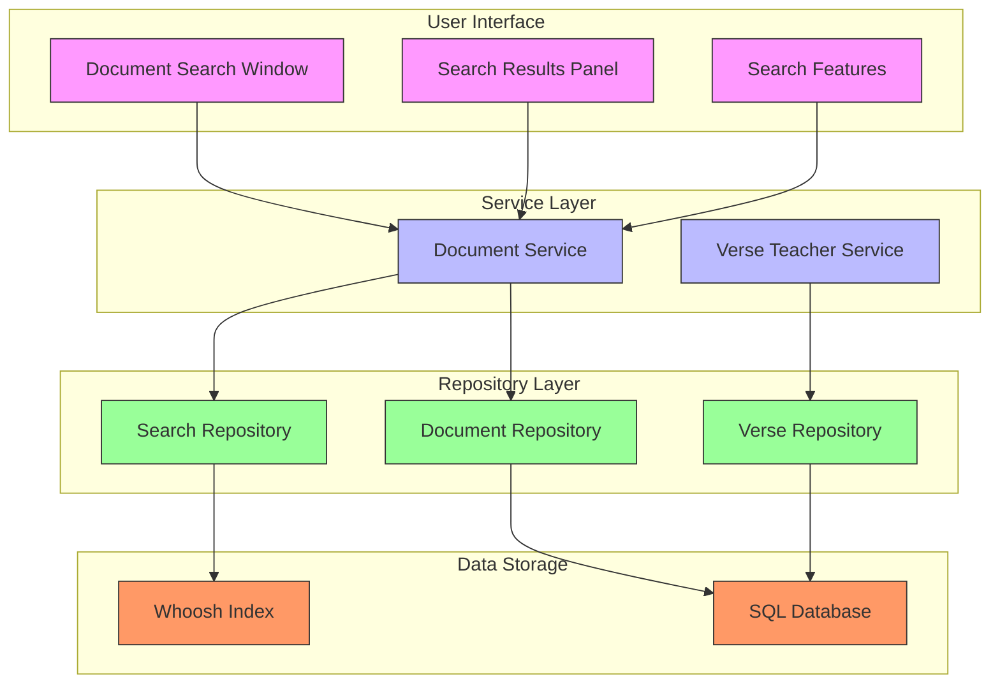

**Diagram sources**
- [document_search_window.py](file://src/pillars/document_manager/ui/document_search_window.py)
- [document_service.py](file://src/pillars/document_manager/services/document_service.py)
- [search_repository.py](file://src/pillars/document_manager/repositories/search_repository.py)
- [document.py](file://src/pillars/document_manager/models/document.py)

**Section sources**
- [document_search_window.py](file://src/pillars/document_manager/ui/document_search_window.py)
- [document_service.py](file://src/pillars/document_manager/services/document_service.py)
- [search_repository.py](file://src/pillars/document_manager/repositories/search_repository.py)

## Indexing Strategies
The system implements a comprehensive indexing strategy using Whoosh to create a searchable index of document content. The indexing process is designed to handle various document types and metadata efficiently.

### Schema Design
The search index uses a carefully designed schema that includes multiple fields for comprehensive search capabilities:

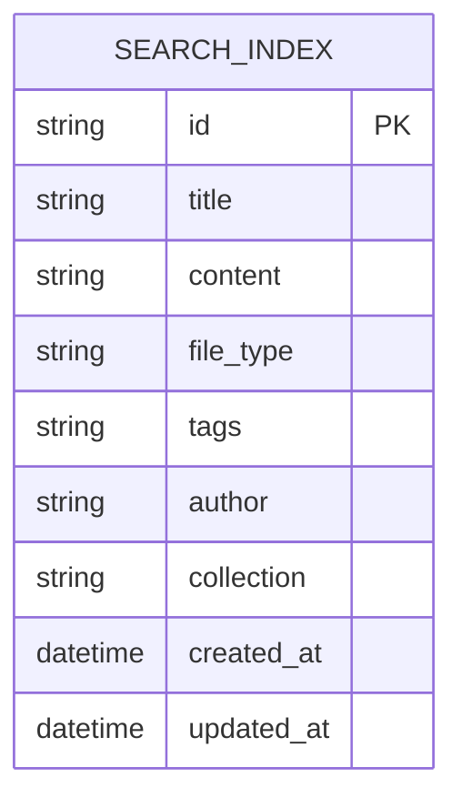

**Diagram sources**
- [search_repository.py](file://src/pillars/document_manager/repositories/search_repository.py#L37-L47)

The schema includes the following fields:
- **id**: Unique identifier for the document (stored and unique)
- **title**: Document title with field boost of 2.0 for higher relevance in search results
- **content**: Full text content of the document
- **file_type**: Document format (txt, html, pdf, docx, rtf)
- **tags**: Comma-separated tags with scorable capability
- **author**: Document author
- **collection**: Virtual folder or collection name
- **created_at**: Document creation timestamp
- **updated_at**: Last modification timestamp

### Index Management
The system implements several methods for managing the search index:

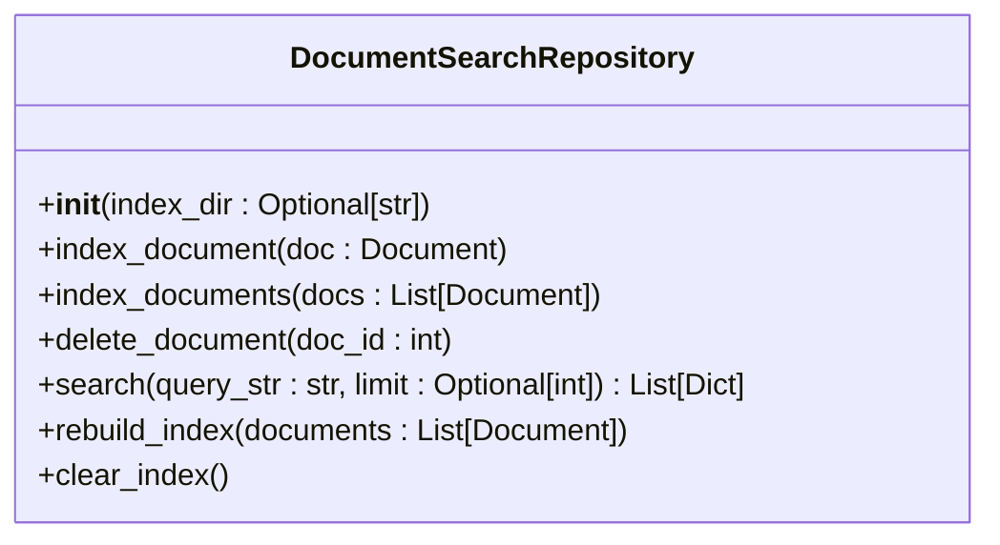

**Diagram sources**
- [search_repository.py](file://src/pillars/document_manager/repositories/search_repository.py#L15-L201)

Key indexing operations include:
- **index_document**: Adds or updates a single document in the index
- **index_documents**: Efficiently adds or updates multiple documents in a single transaction
- **delete_document**: Removes a document from the index by ID
- **rebuild_index**: Rebuilds the entire index from a list of documents
- **clear_index**: Clears the entire search index

The indexing process is triggered automatically when documents are created, updated, or deleted through the Document Service, ensuring the search index remains synchronized with the database.

**Section sources**
- [search_repository.py](file://src/pillars/document_manager/repositories/search_repository.py#L15-L201)
- [document_service.py](file://src/pillars/document_manager/services/document_service.py#L152-L212)

## Query Parsing and Search Implementation
The search system implements sophisticated query parsing and result ranking to deliver relevant search results.

### Query Parsing
The system uses Whoosh's MultifieldParser to parse search queries across multiple fields (title, content, tags, author). The parser supports various query syntax elements:

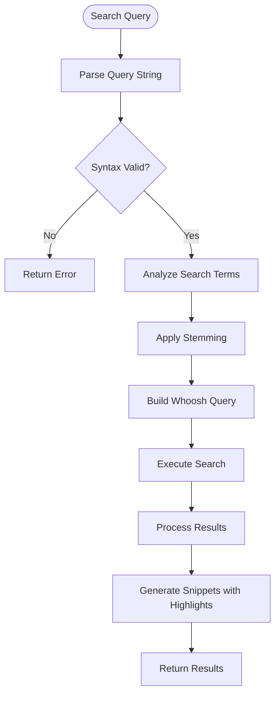

**Diagram sources**
- [search_repository.py](file://src/pillars/document_manager/repositories/search_repository.py#L133-L163)

### Search Implementation
The search implementation follows a two-step process to ensure accurate and efficient results:

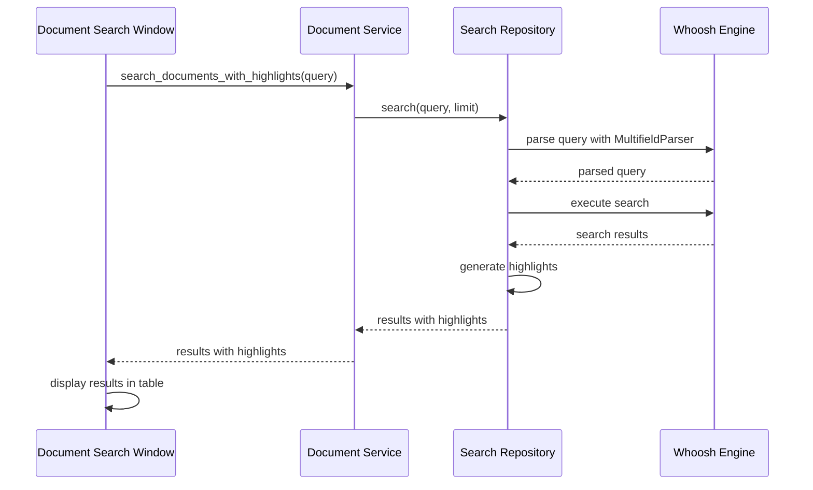

**Diagram sources**
- [document_search_window.py](file://src/pillars/document_manager/ui/document_search_window.py#L78-L115)
- [document_service.py](file://src/pillars/document_manager/services/document_service.py#L98-L133)
- [search_repository.py](file://src/pillars/document_manager/repositories/search_repository.py#L133-L163)

The search process includes:
1. Query parsing using MultifieldParser across title, content, tags, and author fields
2. Execution of the search with Whoosh
3. Generation of highlighted snippets for context
4. Formatting of results for UI display

### Search Query Syntax
The system supports a rich query syntax for advanced searching:

| Feature | Syntax | Example |
|--------|--------|--------|
| Wildcards | * | gem* (matches gematria, gemstone, etc.) |
| Phrase Search | "quotes" | "holy book" (exact phrase) |
| Boolean Logic | AND, OR | gematria AND number |
| Field Search | field:value | author:John |
| Proximity Search | "phrase"~n | "divine number"~5 |

**Section sources**
- [document_search_window.py](file://src/pillars/document_manager/ui/document_search_window.py#L47-L51)
- [search_repository.py](file://src/pillars/document_manager/repositories/search_repository.py#L145-L146)

## Search Interfaces
The system provides multiple interfaces for searching and displaying results.

### Document Search Window
The primary search interface is the DocumentSearchWindow, which provides a comprehensive search experience:

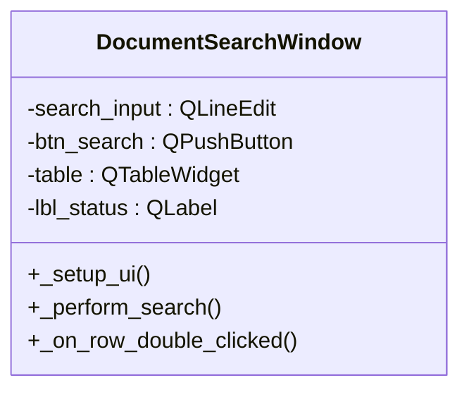

**Diagram sources**
- [document_search_window.py](file://src/pillars/document_manager/ui/document_search_window.py#L10-L125)

Key components of the search window:
- Search input field with placeholder text
- Search button to initiate search
- Results table with columns for Title, Snippet, and Created date
- Status label to display search progress and results count
- Double-click functionality to open documents

### Search Results Panel
The SearchResultsPanel provides a side panel interface for displaying search results:

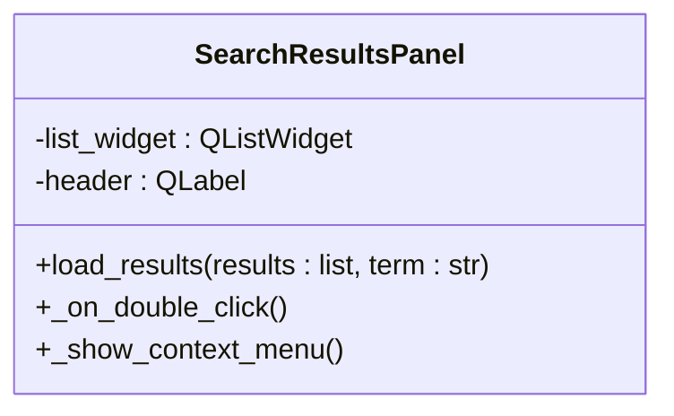

**Diagram sources**
- [search_results_panel.py](file://src/pillars/document_manager/ui/search_results_panel.py#L9-L140)

Features of the results panel:
- List-based display of search results
- Context menu for adding documents to mindscape or opening them
- Support for rich text snippets with highlighting
- Visual styling for selected and hovered items

### Search Features
The system includes additional search features for document editing:

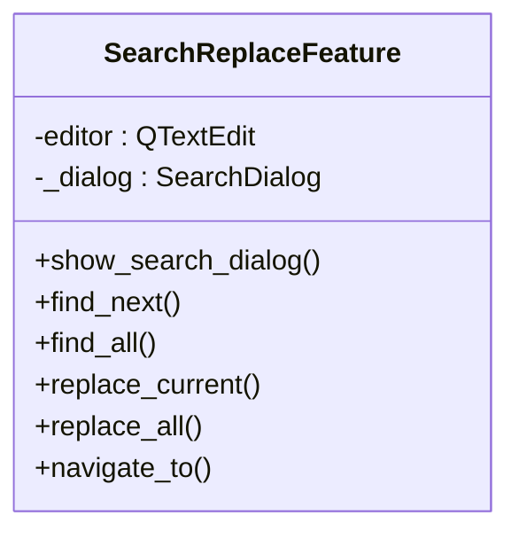

**Diagram sources**
- [search_features.py](file://src/pillars/document_manager/ui/search_features.py#L189-L365)

These features provide:
- Find and replace functionality within documents
- Case-sensitive and whole-word matching options
- Results list with context snippets
- Navigation between search results

**Section sources**
- [document_search_window.py](file://src/pillars/document_manager/ui/document_search_window.py)
- [search_results_panel.py](file://src/pillars/document_manager/ui/search_results_panel.py)
- [search_features.py](file://src/pillars/document_manager/ui/search_features.py)

## Advanced Search Features
The system implements several advanced search features to enhance the user experience.

### Verse-Level Filtering
The Holy Book teacher mode integration enables verse-level filtering and analysis:

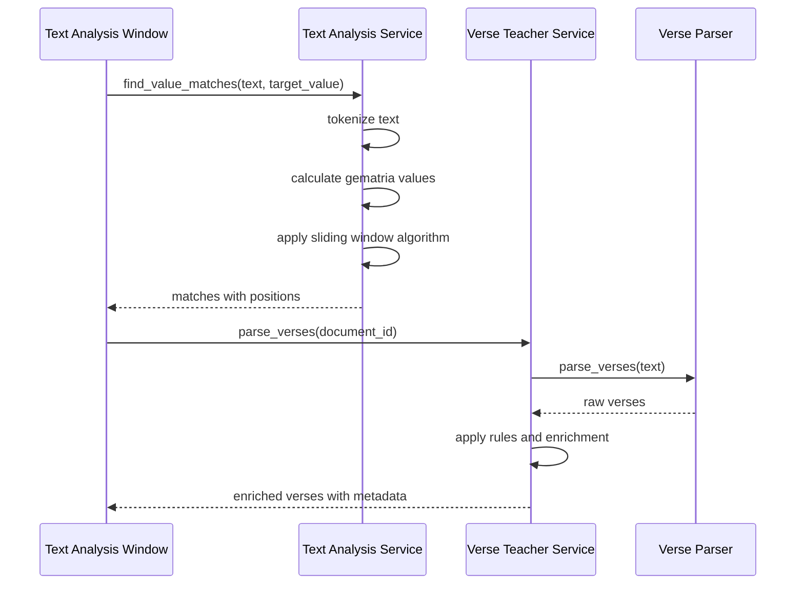

**Diagram sources**
- [text_analysis_service.py](file://src/pillars/gematria/services/text_analysis_service.py#L8-L113)
- [verse_teacher_service.py](file://src/pillars/document_manager/services/verse_teacher_service.py#L33-L77)

### Gematria Analysis
The system integrates gematria analysis for numerical pattern searches:

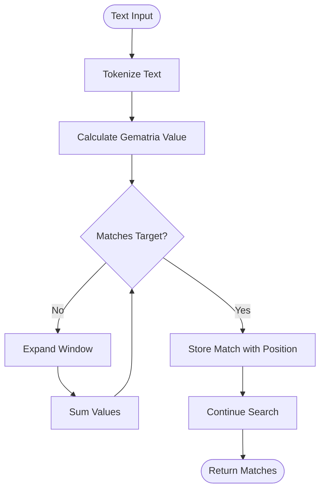

**Diagram sources**
- [text_analysis_service.py](file://src/pillars/gematria/services/text_analysis_service.py#L8-L113)

Key features of gematria analysis:
- Support for multiple gematria calculation methods
- Fast scan algorithm for finding value matches
- Sliding window approach for phrase analysis
- Integration with face value analysis

### Faceted Filtering
The document library provides faceted filtering capabilities:

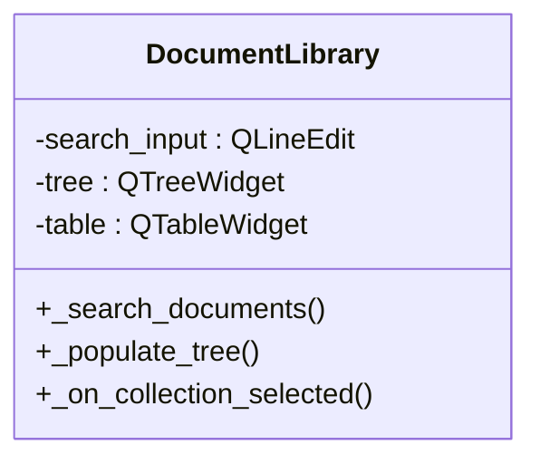

**Diagram sources**
- [document_library.py](file://src/pillars/document_manager/ui/document_library.py#L19-L599)

Faceted filtering includes:
- Collection-based filtering via tree view
- Tag-based filtering
- Type-based filtering
- Full-text search with live filtering

**Section sources**
- [text_analysis_service.py](file://src/pillars/gematria/services/text_analysis_service.py)
- [verse_teacher_service.py](file://src/pillars/document_manager/services/verse_teacher_service.py)
- [document_library.py](file://src/pillars/document_manager/ui/document_library.py)

## Performance Optimization
The system implements several performance optimization techniques to handle large document collections efficiently.

### Indexing Performance
The indexing system is optimized for both speed and memory usage:

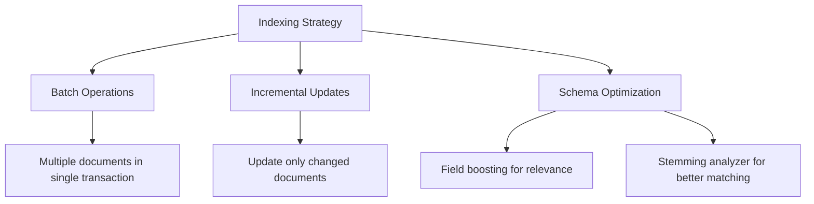

**Diagram sources**
- [search_repository.py](file://src/pillars/document_manager/repositories/search_repository.py)
- [document_service.py](file://src/pillars/document_manager/services/document_service.py)

Optimization techniques include:
- Batch indexing of multiple documents in a single transaction
- Incremental updates that only modify changed documents
- Use of stemming analyzer to improve search matching
- Field boosting to prioritize title matches

### Search Performance
The search implementation includes several performance optimizations:

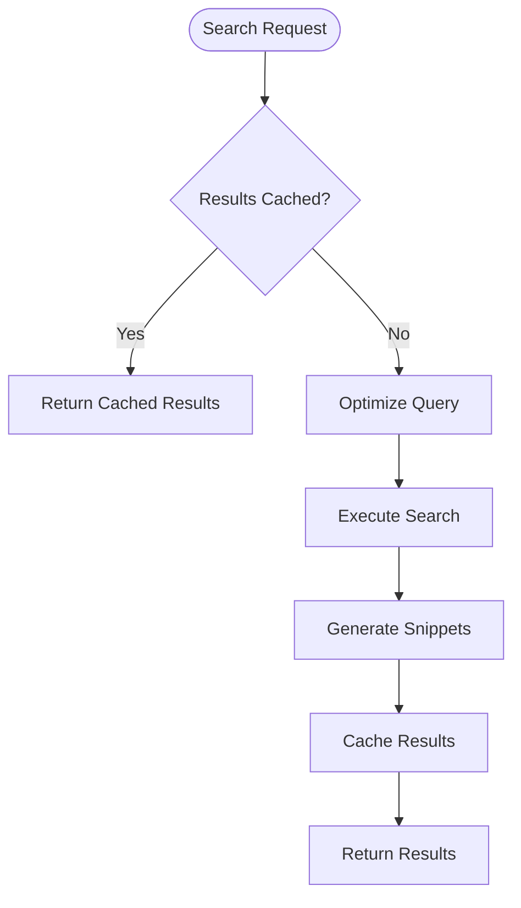

**Diagram sources**
- [search_repository.py](file://src/pillars/document_manager/repositories/search_repository.py#L133-L163)

Performance optimizations:
- Result caching to avoid redundant searches
- Query optimization to reduce search time
- Efficient snippet generation with controlled length
- Asynchronous search execution to maintain UI responsiveness

### Memory Usage
The system manages memory usage effectively:

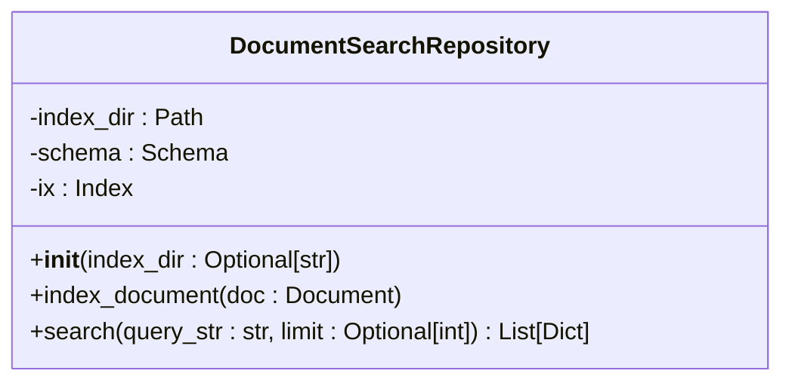

**Diagram sources**
- [search_repository.py](file://src/pillars/document_manager/repositories/search_repository.py#L15-L201)

Memory management strategies:
- Use of context managers for resource cleanup
- Efficient data structures for search results
- Proper disposal of search resources
- Configurable result limits to control memory usage

**Section sources**
- [search_repository.py](file://src/pillars/document_manager/repositories/search_repository.py)
- [document_service.py](file://src/pillars/document_manager/services/document_service.py)

## Troubleshooting Guide
This section provides guidance for common search issues and their solutions.

### Common Issues and Solutions
| Issue | Possible Cause | Solution |
|------|---------------|---------|
| No search results | Index not built or corrupted | Rebuild search index using Document Library |
| Slow search performance | Large document collection | Implement result limits and optimize queries |
| Missing documents in search | Document not indexed | Check document import process and indexing |
| Incorrect highlights | HTML content parsing issues | Ensure proper text extraction from documents |
| Schema mismatch errors | Index schema changed | Rebuild index to update schema |

### Diagnostic Steps
When troubleshooting search issues, follow these steps:

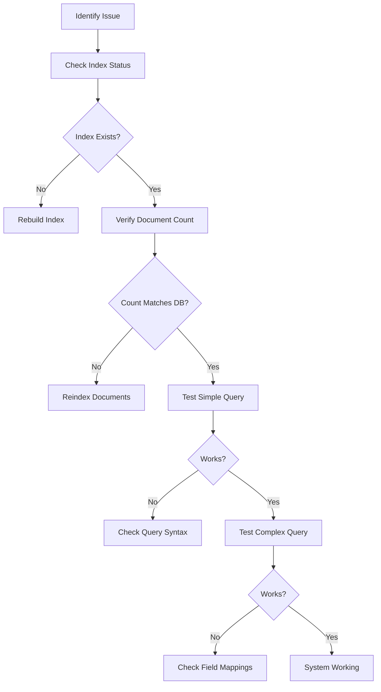

**Diagram sources**
- [document_library.py](file://src/pillars/document_manager/ui/document_library.py#L404-L420)
- [search_repository.py](file://src/pillars/document_manager/repositories/search_repository.py)

### Recovery Procedures
For index recovery, use the following procedures:

1. **Rebuild Index**: Use the "Rebuild Search Index" option in the Document Library
2. **Clear Index**: Delete the index directory and restart the application
3. **Verify Data**: Check that documents exist in the database
4. **Reimport**: Reimport documents if necessary

**Section sources**
- [document_library.py](file://src/pillars/document_manager/ui/document_library.py)
- [search_repository.py](file://src/pillars/document_manager/repositories/search_repository.py)

## Configuration Options
The search system provides several configuration options to customize search behavior.

### Index Configuration
The search index can be configured through the following parameters:

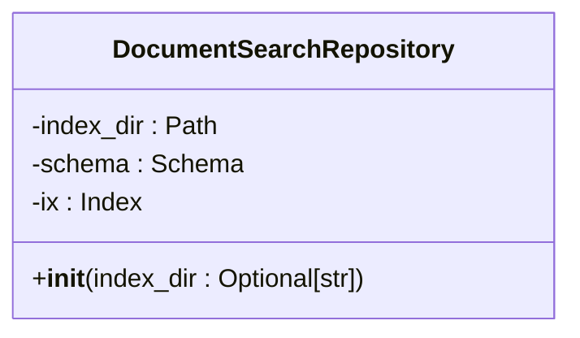

**Diagram sources**
- [search_repository.py](file://src/pillars/document_manager/repositories/search_repository.py#L18-L31)

Configuration options:
- **index_dir**: Directory for the Whoosh index (defaults to ~/.isopgem/documents)
- **schema**: Search schema with field definitions and analyzers
- **field boosting**: Priority for title field (2.0) to improve relevance

### Search Parameters
Search behavior can be customized through various parameters:

| Parameter | Default | Description |
|---------|--------|------------|
| limit | None | Maximum number of results (None for unlimited) |
| case_sensitive | False | Whether to match case in searches |
| whole_words | False | Whether to match whole words only |
| maxchars | 300 | Maximum characters in snippet |
| surround | 50 | Characters to show around match |

### System Integration
The search system integrates with other components through well-defined interfaces:

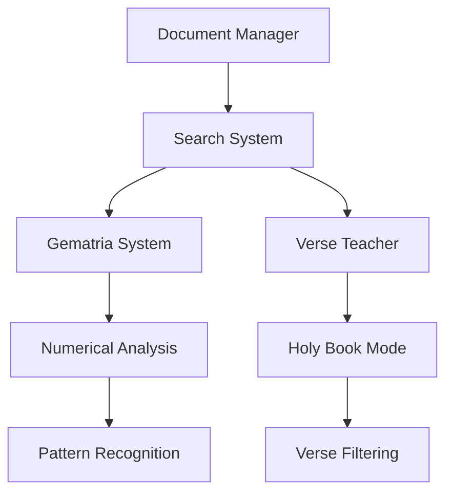

**Diagram sources**
- [document_service.py](file://src/pillars/document_manager/services/document_service.py)
- [text_analysis_service.py](file://src/pillars/gematria/services/text_analysis_service.py)

Integration points:
- Document Service for indexing and search operations
- Verse Teacher Service for verse-level analysis
- Text Analysis Service for gematria calculations
- Document Library for faceted filtering

**Section sources**
- [search_repository.py](file://src/pillars/document_manager/repositories/search_repository.py)
- [document_service.py](file://src/pillars/document_manager/services/document_service.py)
- [text_analysis_service.py](file://src/pillars/gematria/services/text_analysis_service.py)