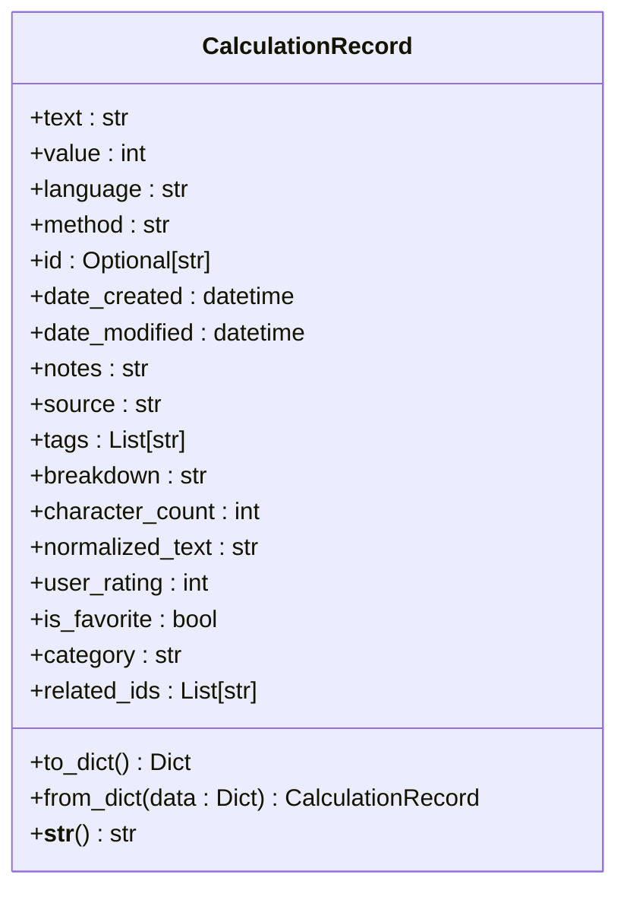
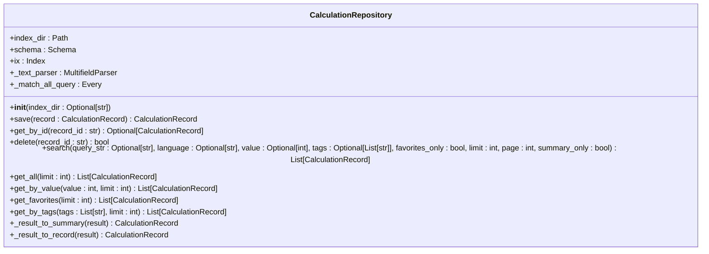
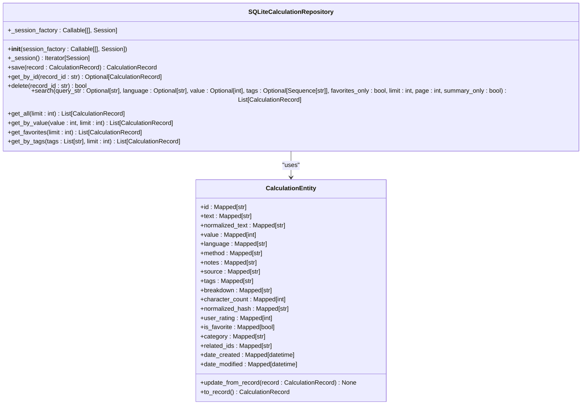
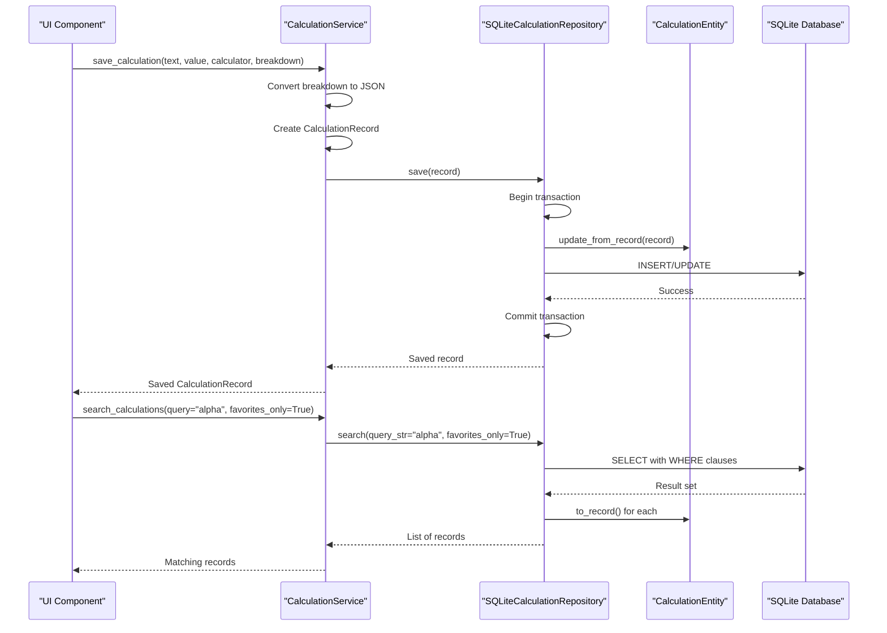
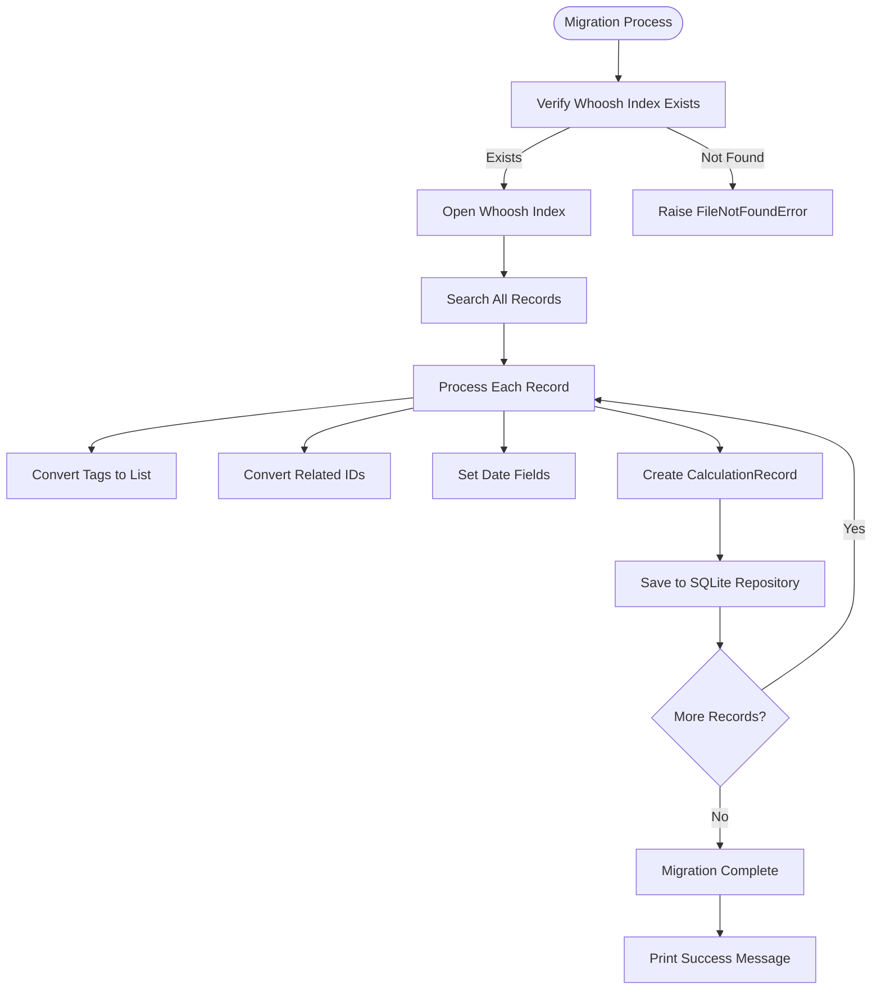

# Data Persistence and Repository

<cite>
**Referenced Files in This Document**   
- [calculation_record.py](file://src/pillars/gematria/models/calculation_record.py)
- [calculation_repository.py](file://src/pillars/gematria/repositories/calculation_repository.py)
- [sqlite_calculation_repository.py](file://src/pillars/gematria/repositories/sqlite_calculation_repository.py)
- [calculation_service.py](file://src/pillars/gematria/services/calculation_service.py)
- [calculation_entity.py](file://src/pillars/gematria/models/calculation_entity.py)
- [database.py](file://src/shared/database.py)
- [migrate_gematria_whoosh_to_sqlite.py](file://scripts/migrate_gematria_whoosh_to_sqlite.py)
- [update_db_schema.py](file://scripts/update_db_schema.py)
- [reset_database.py](file://scripts/reset_database.py)
</cite>

## Table of Contents
1. [Introduction](#introduction)
2. [Data Model](#data-model)
3. [Repository Pattern Implementation](#repository-pattern-implementation)
4. [SQLite Repository Details](#sqlite-repository-details)
5. [Service Layer Integration](#service-layer-integration)
6. [Database Migration and Schema Evolution](#database-migration-and-schema-evolution)
7. [Conclusion](#conclusion)

## Introduction
The Data Persistence and Repository system in IsopGem implements a robust data storage solution using the Repository Pattern with SQLite as the primary storage mechanism. This system enables users to save, retrieve, search, and organize gematria calculations with rich metadata. The architecture separates concerns between data models, repository interfaces, and service logic, providing a clean abstraction layer over the underlying database. Originally using Whoosh for indexing, the system has migrated to SQLite with SQLAlchemy for improved data integrity, transaction management, and query capabilities. This documentation explains the implementation details, focusing on the CalculationRecord data model, repository pattern, and integration with the service layer.

## Data Model
The core of the persistence system is the CalculationRecord data model, which captures comprehensive information about gematria calculations. This model includes both calculation-specific data and extensive user metadata for organization and retrieval.

**Diagram sources**
- [calculation_record.py](file://src/pillars/gematria/models/calculation_record.py#L8-L89)

**Section sources**
- [calculation_record.py](file://src/pillars/gematria/models/calculation_record.py#L8-L89)

The CalculationRecord class uses Python's dataclass decorator to define its structure with type hints for clarity. Key fields include:
- **Core calculation data**: text (the word/phrase calculated), value (the gematria result), language (e.g., "Hebrew (Standard)"), and method (e.g., "Standard Value")
- **Metadata**: id (unique identifier), date_created, and date_modified for tracking record lifecycle
- **Additional information**: notes (user annotations), source (reference material), and tags (searchable keywords)
- **Calculation details**: breakdown (JSON string of letter-value mappings), character_count, and normalized_text (cleaned version without diacritics)
- **User organization**: user_rating (0-5 stars), is_favorite (bookmark flag), category (user-defined grouping), and related_ids (connections to other calculations)

The model includes serialization methods (to_dict and from_dict) that handle JSON conversion for fields like tags and breakdown, ensuring proper storage and retrieval. The breakdown field stores the detailed letter-by-letter calculation as a JSON string, preserving the computational process for later analysis.

## Repository Pattern Implementation
The repository pattern is implemented through a clear separation between the abstract interface and concrete implementations. The CalculationRepository class originally provided Whoosh-based storage, establishing the interface contract that the SQLite implementation follows.

**Diagram sources**
- [calculation_repository.py](file://src/pillars/gematria/repositories/calculation_repository.py#L16-L329)

**Section sources**
- [calculation_repository.py](file://src/pillars/gematria/repositories/calculation_repository.py#L16-L329)

The repository abstracts data access operations, providing methods for CRUD operations and complex queries. Key features include:
- **Flexible search capabilities**: The search method supports multiple filter criteria including text queries, language, exact value, tags, and favorite status
- **Pagination**: Results can be paginated using the limit and page parameters
- **Performance optimization**: The summary_only parameter allows retrieval of lightweight records without full breakdown data
- **Transaction safety**: Operations use proper error handling with commit/rollback semantics

This interface enables the service layer to interact with data storage without knowledge of the underlying implementation, facilitating the migration from Whoosh to SQLite while maintaining compatibility.

## SQLite Repository Details
The SQLiteCalculationRepository provides a concrete implementation of the repository interface using SQLAlchemy ORM for database interactions. This implementation offers improved data integrity, transaction management, and query optimization compared to the previous Whoosh-based solution.

**Diagram sources**
- [sqlite_calculation_repository.py](file://src/pillars/gematria/repositories/sqlite_calculation_repository.py#L16-L143)
- [calculation_entity.py](file://src/pillars/gematria/models/calculation_entity.py#L18-L92)

**Section sources**
- [sqlite_calculation_repository.py](file://src/pillars/gematria/repositories/sqlite_calculation_repository.py#L16-L143)
- [calculation_entity.py](file://src/pillars/gematria/models/calculation_entity.py#L18-L92)

The implementation features:
- **SQLAlchemy ORM integration**: Uses the CalculationEntity model as the database representation, with proper column types, indexes, and constraints
- **Context manager pattern**: The _session method ensures proper transaction handling with automatic commit on success and rollback on exceptions
- **Efficient querying**: Uses SQLAlchemy's select construct with appropriate filtering and ordering (by date_modified descending)
- **Index optimization**: Database indexes on value, language, is_favorite, and normalized_hash fields enable fast queries
- **Lazy loading**: The CalculationEntity model converts to/from CalculationRecord only when needed, reducing memory overhead

The repository handles the impedance mismatch between the domain model (CalculationRecord) and database model (CalculationEntity) through conversion methods (update_from_record and to_record), ensuring data consistency across the application layers.

## Service Layer Integration
The CalculationService integrates with the repository to provide business logic for managing calculations. This service layer abstracts the repository details from the application's UI components, providing a clean API for calculation management.

**Diagram sources**
- [calculation_service.py](file://src/pillars/gematria/services/calculation_service.py#L11-L273)
- [sqlite_calculation_repository.py](file://src/pillars/gematria/repositories/sqlite_calculation_repository.py#L16-L143)

**Section sources**
- [calculation_service.py](file://src/pillars/gematria/services/calculation_service.py#L11-L273)

Key integration points include:
- **Repository injection**: The service accepts a repository instance through dependency injection, enabling easy testing and potential swapping of implementations
- **Data transformation**: The service converts between domain objects and repository requirements, such as serializing the breakdown list to JSON
- **Business logic**: Implements features like toggle_favorite that combine retrieval, modification, and saving in a single atomic operation
- **Error handling**: Propagates repository exceptions while providing meaningful error context to the UI layer
- **Performance considerations**: Supports summary-only queries to reduce data transfer when full details aren't needed

The service layer also handles the conversion between the breakdown data structure (list of tuples) and its JSON representation, ensuring data integrity during storage and retrieval.

## Database Migration and Schema Evolution
The system includes comprehensive tools for database migration and schema evolution, addressing the transition from the legacy Whoosh storage to the current SQLite implementation.

**Diagram sources**
- [migrate_gematria_whoosh_to_sqlite.py](file://scripts/migrate_gematria_whoosh_to_sqlite.py#L1-L75)

**Section sources**
- [migrate_gematria_whoosh_to_sqlite.py](file://scripts/migrate_gematria_whoosh_to_sqlite.py#L1-L75)
- [update_db_schema.py](file://scripts/update_db_schema.py)
- [reset_database.py](file://scripts/reset_database.py)

The migration strategy includes:
- **Data migration script**: The migrate_gematria_whoosh_to_sqlite.py script transfers all existing calculations from Whoosh to SQLite, preserving all metadata and relationships
- **Schema evolution**: The update_db_schema.py script handles incremental database schema changes, allowing for non-destructive updates as new fields are added
- **Database initialization**: The init_db function in database.py creates all tables based on the SQLAlchemy models, ensuring the database structure matches the code definitions
- **Reset capabilities**: Scripts like reset_database.py provide safe mechanisms for database recreation during development or troubleshooting
- **Path management**: The system uses proper path resolution relative to the project root, avoiding issues with current working directory changes

The migration process demonstrates careful attention to data integrity, with proper error handling and transaction management to prevent partial migrations. The system also maintains backward compatibility by preserving the repository interface, allowing existing code to work with the new storage mechanism without modification.

## Conclusion
The Data Persistence and Repository system in IsopGem provides a robust foundation for storing and managing gematria calculations. By implementing the Repository Pattern with SQLite and SQLAlchemy, the system offers reliable data storage with efficient querying capabilities. The CalculationRecord data model captures comprehensive information about calculations, including rich metadata for organization and retrieval. The clear separation between the service layer, repository interface, and database implementation enables maintainable code and facilitates future enhancements. Migration tools ensure data continuity from the previous storage system, while the architecture supports ongoing schema evolution. This implementation balances accessibility for beginners with technical depth for experienced developers, providing a solid foundation for the application's data management needs.