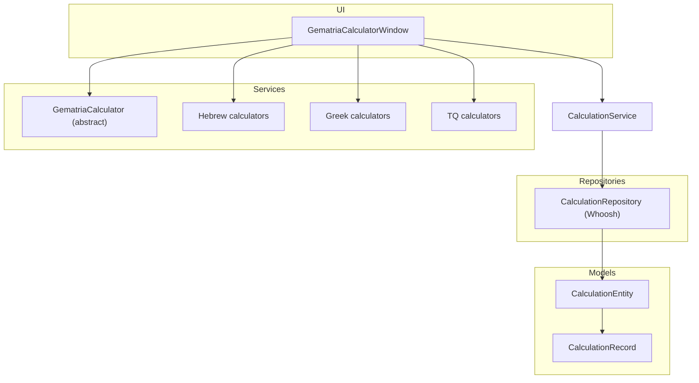
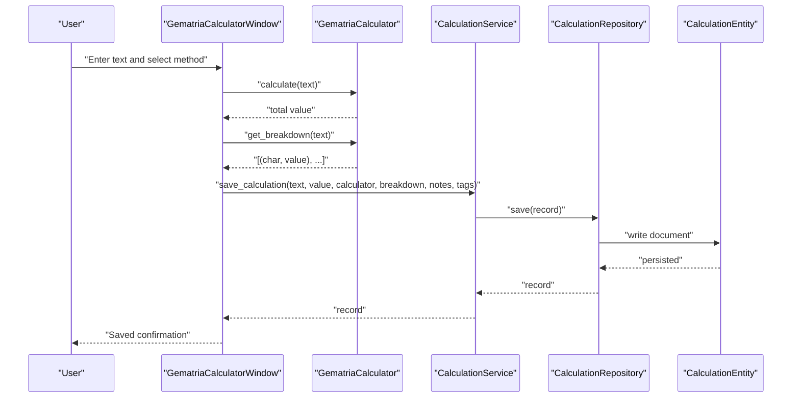
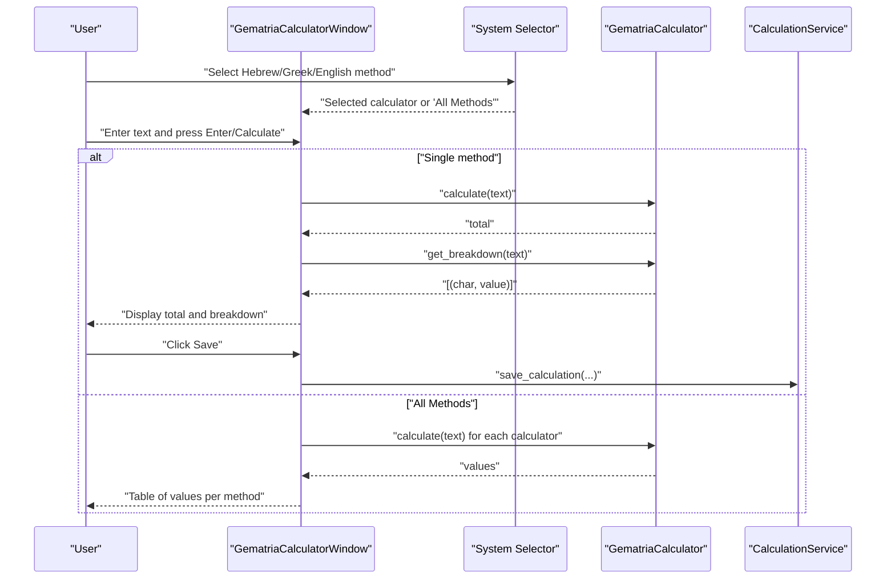
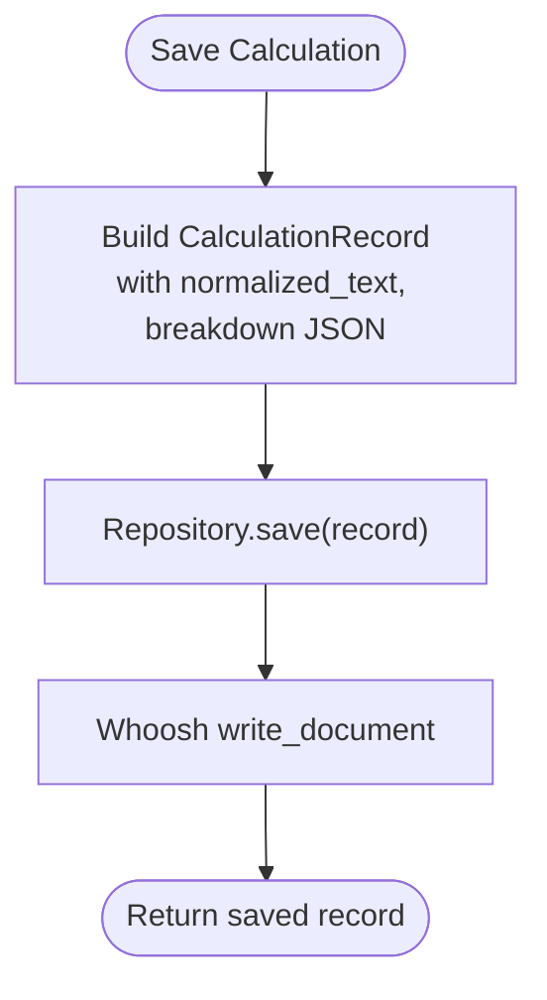
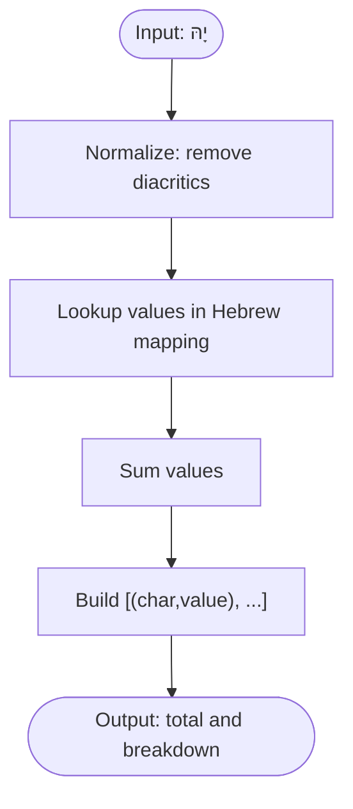
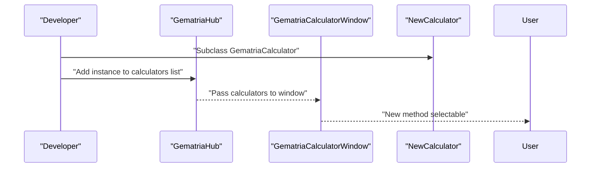
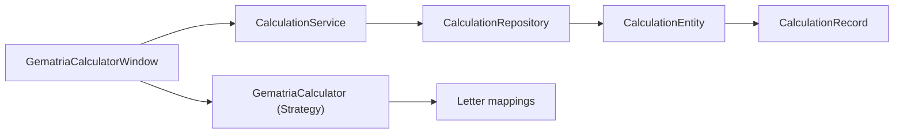

# Gematria Calculator

<cite>
**Referenced Files in This Document**
- [gematria_calculator_window.py](file://src/pillars/gematria/ui/gematria_calculator_window.py)
- [base_calculator.py](file://src/pillars/gematria/services/base_calculator.py)
- [hebrew_calculator.py](file://src/pillars/gematria/services/hebrew_calculator.py)
- [greek_calculator.py](file://src/pillars/gematria/services/greek_calculator.py)
- [tq_calculator.py](file://src/pillars/gematria/services/tq_calculator.py)
- [calculation_service.py](file://src/pillars/gematria/services/calculation_service.py)
- [calculation_entity.py](file://src/pillars/gematria/models/calculation_entity.py)
- [calculation_record.py](file://src/pillars/gematria/models/calculation_record.py)
- [calculation_repository.py](file://src/pillars/gematria/repositories/calculation_repository.py)
- [gematria_hub.py](file://src/pillars/gematria/ui/gematria_hub.py)
- [test_calculation_service.py](file://test/pillars/gematria/test_calculation_service.py)
</cite>

## Table of Contents
1. [Introduction](#introduction)
2. [Project Structure](#project-structure)
3. [Core Components](#core-components)
4. [Architecture Overview](#architecture-overview)
5. [Detailed Component Analysis](#detailed-component-analysis)
6. [Dependency Analysis](#dependency-analysis)
7. [Performance Considerations](#performance-considerations)
8. [Troubleshooting Guide](#troubleshooting-guide)
9. [Conclusion](#conclusion)
10. [Appendices](#appendices)

## Introduction
This document explains the Gematria Calculator component as the primary interface for performing Hebrew, Greek, and English (TQ) gematria calculations. It details the Strategy Pattern implementation where each calculator type inherits from the base GematriaCalculator abstract class and implements the calculate() method. The document also covers the UI that allows users to select multiple calculation methods simultaneously, the integration with CalculationService for saving results, and common issues around text normalization across languages.

## Project Structure
The Gematria Calculator spans UI, services, models, and repositories:
- UI: GematriaCalculatorWindow orchestrates user input, method selection, and results display.
- Services: Strategy Pattern calculators (Hebrew, Greek, TQ) inherit from GematriaCalculator.
- Models: CalculationRecord and CalculationEntity define persisted data.
- Repositories: CalculationRepository persists and searches records using Whoosh.
- Integration: CalculationService coordinates saving and metadata management.

**Diagram sources**
- [gematria_calculator_window.py](file://src/pillars/gematria/ui/gematria_calculator_window.py#L1-L500)
- [base_calculator.py](file://src/pillars/gematria/services/base_calculator.py#L1-L107)
- [hebrew_calculator.py](file://src/pillars/gematria/services/hebrew_calculator.py#L1-L800)
- [greek_calculator.py](file://src/pillars/gematria/services/greek_calculator.py#L1-L888)
- [tq_calculator.py](file://src/pillars/gematria/services/tq_calculator.py#L1-L381)
- [calculation_service.py](file://src/pillars/gematria/services/calculation_service.py#L1-L273)
- [calculation_entity.py](file://src/pillars/gematria/models/calculation_entity.py#L1-L92)
- [calculation_repository.py](file://src/pillars/gematria/repositories/calculation_repository.py#L1-L329)

**Section sources**
- [gematria_calculator_window.py](file://src/pillars/gematria/ui/gematria_calculator_window.py#L1-L500)
- [gematria_hub.py](file://src/pillars/gematria/ui/gematria_hub.py#L1-L352)

## Core Components
- GematriaCalculator (abstract): Defines the Strategy contract, including name, normalize_text(), calculate(), get_letter_value(), and get_breakdown().
- Concrete calculators:
  - Hebrew: Standard, Sofit, Letter Value, Ordinal, Small Value, AtBash, Kolel, Square, Cube, Triangular, Integral Reduced, Ordinal Square, Full Value, Albam.
  - Greek: Standard Isopsephy, Letter Value, Ordinal, Small Value, Kolel, Square, Cube, Triangular, Digital, Ordinal Square, Full Value, Reverse Substitution, Pair Matching, Next Letter.
  - TQ: Standard, Reduced, Square, Triangular, Position.
- CalculationService: Persists and manages records, serializes breakdowns, and exposes search/update APIs.
- CalculationRepository: Whoosh-backed persistence for gematria records.
- CalculationRecord/Entity: Data models for storage and transport.
- UI: GematriaCalculatorWindow provides method selection, input handling, and save integration.

**Section sources**
- [base_calculator.py](file://src/pillars/gematria/services/base_calculator.py#L1-L107)
- [hebrew_calculator.py](file://src/pillars/gematria/services/hebrew_calculator.py#L1-L800)
- [greek_calculator.py](file://src/pillars/gematria/services/greek_calculator.py#L1-L888)
- [tq_calculator.py](file://src/pillars/gematria/services/tq_calculator.py#L1-L381)
- [calculation_service.py](file://src/pillars/gematria/services/calculation_service.py#L1-L273)
- [calculation_repository.py](file://src/pillars/gematria/repositories/calculation_repository.py#L1-L329)
- [calculation_record.py](file://src/pillars/gematria/models/calculation_record.py#L1-L89)
- [calculation_entity.py](file://src/pillars/gematria/models/calculation_entity.py#L1-L92)
- [gematria_calculator_window.py](file://src/pillars/gematria/ui/gematria_calculator_window.py#L1-L500)

## Architecture Overview
The calculator UI composes a set of calculator instances and delegates calculation to the selected strategy. Results are formatted and optionally saved via CalculationService, which persists records using CalculationRepository.

**Diagram sources**
- [gematria_calculator_window.py](file://src/pillars/gematria/ui/gematria_calculator_window.py#L341-L500)
- [calculation_service.py](file://src/pillars/gematria/services/calculation_service.py#L23-L79)
- [calculation_repository.py](file://src/pillars/gematria/repositories/calculation_repository.py#L67-L117)
- [calculation_entity.py](file://src/pillars/gematria/models/calculation_entity.py#L18-L92)

## Detailed Component Analysis

### Strategy Pattern: GematriaCalculator and Concrete Implementations
- Base contract:
  - name: Human-readable calculator name.
  - normalize_text(): Removes diacritical marks and accents for consistent comparison across languages.
  - calculate(text): Computes total value using the mapping.
  - get_letter_value(char): Lookup single character value.
  - get_breakdown(text): Returns ordered list of (char, value) tuples for display.
- Hebrew calculators:
  - Standard, Sofit (final forms), Letter Value (spelled-out names), Ordinal, Small Value, AtBash, Kolel (+count), Square, Cube, Triangular, Integral Reduced, Ordinal Square, Full Value, Albam.
- Greek calculators:
  - Standard Isopsephy, Letter Value, Ordinal, Small Value, Kolel, Square, Cube, Triangular, Digital, Ordinal Square, Full Value, Reverse Substitution, Pair Matching, Next Letter.
- TQ calculators:
  - Standard, Reduced (digital root), Square, Triangular, Position (positional weighting).

```mermaid
classDiagram
class GematriaCalculator {
+string name
+normalize_text(text) string
+calculate(text) int
+get_letter_value(char) int
+get_breakdown(text) list
-_letter_values dict
-_initialize_mapping() dict
}
class HebrewGematriaCalculator
class HebrewSofitCalculator
class HebrewLetterValueCalculator
class HebrewOrdinalCalculator
class HebrewSmallValueCalculator
class HebrewAtBashCalculator
class HebrewKolelCalculator
class HebrewSquareCalculator
class HebrewCubeCalculator
class HebrewTriangularCalculator
class HebrewIntegralReducedCalculator
class HebrewOrdinalSquareCalculator
class HebrewFullValueCalculator
class HebrewAlbamCalculator
class GreekGematriaCalculator
class GreekLetterValueCalculator
class GreekOrdinalCalculator
class GreekSmallValueCalculator
class GreekKolelCalculator
class GreekSquareCalculator
class GreekCubeCalculator
class GreekTriangularCalculator
class GreekDigitalCalculator
class GreekOrdinalSquareCalculator
class GreekFullValueCalculator
class GreekReverseSubstitutionCalculator
class GreekPairMatchingCalculator
class GreekNextLetterCalculator
class TQGematriaCalculator
class TQReducedCalculator
class TQSquareCalculator
class TQTriangularCalculator
class TQPositionCalculator
GematriaCalculator <|-- HebrewGematriaCalculator
GematriaCalculator <|-- HebrewSofitCalculator
GematriaCalculator <|-- HebrewLetterValueCalculator
GematriaCalculator <|-- HebrewOrdinalCalculator
GematriaCalculator <|-- HebrewSmallValueCalculator
GematriaCalculator <|-- HebrewAtBashCalculator
GematriaCalculator <|-- HebrewKolelCalculator
GematriaCalculator <|-- HebrewSquareCalculator
GematriaCalculator <|-- HebrewCubeCalculator
GematriaCalculator <|-- HebrewTriangularCalculator
GematriaCalculator <|-- HebrewIntegralReducedCalculator
GematriaCalculator <|-- HebrewOrdinalSquareCalculator
GematriaCalculator <|-- HebrewFullValueCalculator
GematriaCalculator <|-- HebrewAlbamCalculator
GematriaCalculator <|-- GreekGematriaCalculator
GematriaCalculator <|-- GreekLetterValueCalculator
GematriaCalculator <|-- GreekOrdinalCalculator
GematriaCalculator <|-- GreekSmallValueCalculator
GematriaCalculator <|-- GreekKolelCalculator
GematriaCalculator <|-- GreekSquareCalculator
GematriaCalculator <|-- GreekCubeCalculator
GematriaCalculator <|-- GreekTriangularCalculator
GematriaCalculator <|-- GreekDigitalCalculator
GematriaCalculator <|-- GreekOrdinalSquareCalculator
GematriaCalculator <|-- GreekFullValueCalculator
GematriaCalculator <|-- GreekReverseSubstitutionCalculator
GematriaCalculator <|-- GreekPairMatchingCalculator
GematriaCalculator <|-- GreekNextLetterCalculator
GematriaCalculator <|-- TQGematriaCalculator
GematriaCalculator <|-- TQReducedCalculator
GematriaCalculator <|-- TQSquareCalculator
GematriaCalculator <|-- TQTriangularCalculator
GematriaCalculator <|-- TQPositionCalculator
```

**Diagram sources**
- [base_calculator.py](file://src/pillars/gematria/services/base_calculator.py#L1-L107)
- [hebrew_calculator.py](file://src/pillars/gematria/services/hebrew_calculator.py#L1-L800)
- [greek_calculator.py](file://src/pillars/gematria/services/greek_calculator.py#L1-L888)
- [tq_calculator.py](file://src/pillars/gematria/services/tq_calculator.py#L1-L381)

**Section sources**
- [base_calculator.py](file://src/pillars/gematria/services/base_calculator.py#L1-L107)
- [hebrew_calculator.py](file://src/pillars/gematria/services/hebrew_calculator.py#L1-L800)
- [greek_calculator.py](file://src/pillars/gematria/services/greek_calculator.py#L1-L888)
- [tq_calculator.py](file://src/pillars/gematria/services/tq_calculator.py#L1-L381)

### UI: GematriaCalculatorWindow
Key responsibilities:
- Presents nested menus for Hebrew, Greek, and English/TQ calculators.
- Supports “All Methods” mode per language to compute and compare all calculators for that language.
- Handles text input, normalization, calculation, breakdown display, and saving via CalculationService.
- Integrates a virtual keyboard for language-specific layouts.

**Diagram sources**
- [gematria_calculator_window.py](file://src/pillars/gematria/ui/gematria_calculator_window.py#L198-L442)
- [calculation_service.py](file://src/pillars/gematria/services/calculation_service.py#L23-L79)

**Section sources**
- [gematria_calculator_window.py](file://src/pillars/gematria/ui/gematria_calculator_window.py#L1-L500)

### Integration with CalculationService and Persistence
- Saving:
  - UI passes text, value, calculator instance, and breakdown to CalculationService.save_calculation().
  - Service serializes breakdown to JSON and normalizes text via calculator.normalize_text().
  - Service delegates to CalculationRepository.save(), which writes to Whoosh.
- Retrieval/search:
  - Repository supports search by text, language, value, tags, favorites, pagination, and summary vs full records.
  - Service exposes helpers like get_all_calculations(), get_by_value(), get_favorites(), toggle_favorite(), and get_breakdown_from_record().

**Diagram sources**
- [calculation_service.py](file://src/pillars/gematria/services/calculation_service.py#L23-L79)
- [calculation_repository.py](file://src/pillars/gematria/repositories/calculation_repository.py#L67-L117)
- [calculation_entity.py](file://src/pillars/gematria/models/calculation_entity.py#L18-L92)

**Section sources**
- [calculation_service.py](file://src/pillars/gematria/services/calculation_service.py#L1-L273)
- [calculation_repository.py](file://src/pillars/gematria/repositories/calculation_repository.py#L1-L329)
- [calculation_record.py](file://src/pillars/gematria/models/calculation_record.py#L1-L89)
- [calculation_entity.py](file://src/pillars/gematria/models/calculation_entity.py#L1-L92)

### Concrete Example: Text Processing and Calculation Chain
Consider the Hebrew word יָהּ (Yah) with Standard Hebrew calculator:
- Input text is normalized to remove diacritics.
- Characters are looked up in the Hebrew mapping and summed.
- Breakdown returns ordered pairs of characters and values.
- Total is displayed; optional save stores normalized text, method name, and serialized breakdown.

**Diagram sources**
- [base_calculator.py](file://src/pillars/gematria/services/base_calculator.py#L30-L107)
- [hebrew_calculator.py](file://src/pillars/gematria/services/hebrew_calculator.py#L42-L94)

**Section sources**
- [base_calculator.py](file://src/pillars/gematria/services/base_calculator.py#L30-L107)
- [hebrew_calculator.py](file://src/pillars/gematria/services/hebrew_calculator.py#L42-L94)

### Extensibility: Adding a New Calculator Type
To add a new calculator:
- Create a subclass of GematriaCalculator with a unique name and a private _initialize_mapping() returning the letter-to-value mapping.
- Optionally override calculate() if the method requires a different aggregation (e.g., Square, Cube, Triangular, Reduced).
- Register the calculator in the hub and UI where appropriate.

**Diagram sources**
- [gematria_hub.py](file://src/pillars/gematria/ui/gematria_hub.py#L137-L186)
- [base_calculator.py](file://src/pillars/gematria/services/base_calculator.py#L1-L107)

**Section sources**
- [gematria_hub.py](file://src/pillars/gematria/ui/gematria_hub.py#L137-L186)
- [base_calculator.py](file://src/pillars/gematria/services/base_calculator.py#L1-L107)

## Dependency Analysis
- UI depends on calculators and CalculationService.
- CalculationService depends on CalculationRepository and uses GematriaCalculator for normalization and mapping.
- Repository depends on Whoosh schema and persists CalculationEntity.
- Models encapsulate data transfer and persistence.

**Diagram sources**
- [gematria_calculator_window.py](file://src/pillars/gematria/ui/gematria_calculator_window.py#L1-L500)
- [calculation_service.py](file://src/pillars/gematria/services/calculation_service.py#L1-L273)
- [calculation_repository.py](file://src/pillars/gematria/repositories/calculation_repository.py#L1-L329)
- [calculation_entity.py](file://src/pillars/gematria/models/calculation_entity.py#L1-L92)
- [calculation_record.py](file://src/pillars/gematria/models/calculation_record.py#L1-L89)
- [base_calculator.py](file://src/pillars/gematria/services/base_calculator.py#L1-L107)

**Section sources**
- [gematria_calculator_window.py](file://src/pillars/gematria/ui/gematria_calculator_window.py#L1-L500)
- [calculation_service.py](file://src/pillars/gematria/services/calculation_service.py#L1-L273)
- [calculation_repository.py](file://src/pillars/gematria/repositories/calculation_repository.py#L1-L329)
- [calculation_entity.py](file://src/pillars/gematria/models/calculation_entity.py#L1-L92)
- [calculation_record.py](file://src/pillars/gematria/models/calculation_record.py#L1-L89)
- [base_calculator.py](file://src/pillars/gematria/services/base_calculator.py#L1-L107)

## Performance Considerations
- Text normalization uses Unicode normalization (NFD/NFC) to strip combining marks; this is efficient and consistent across languages.
- calculate() iterates characters once; mapping lookups are O(1) average.
- get_breakdown() preserves order and duplicates for accurate display.
- Saving involves JSON serialization of breakdown and Whoosh indexing; batching or limiting concurrent saves is recommended for bulk operations.
- “All Methods” mode computes multiple values; consider disabling save in multi-method mode to avoid ambiguity.

[No sources needed since this section provides general guidance]

## Troubleshooting Guide
Common issues and solutions:
- Unexpected zero totals:
  - Ensure input contains recognized characters for the selected mapping. Unrecognized characters contribute zero.
- Diacritics not affecting results:
  - normalize_text() removes diacritics; confirm input uses composed forms or rely on NFC normalization.
- Mixed-case English letters:
  - TQ mapping is case-sensitive; uppercase and lowercase entries differ. Align input to the intended mapping.
- “All Methods” save disabled:
  - Save is disabled in multi-method mode; switch to a single method or save each method separately.
- Malformed breakdown JSON:
  - Service.get_breakdown_from_record() gracefully handles malformed JSON and returns an empty list.

**Section sources**
- [base_calculator.py](file://src/pillars/gematria/services/base_calculator.py#L30-L107)
- [gematria_calculator_window.py](file://src/pillars/gematria/ui/gematria_calculator_window.py#L393-L442)
- [calculation_service.py](file://src/pillars/gematria/services/calculation_service.py#L241-L273)
- [test_calculation_service.py](file://test/pillars/gematria/test_calculation_service.py#L123-L134)

## Conclusion
The Gematria Calculator implements a clean Strategy Pattern with a shared base calculator and specialized calculators for Hebrew, Greek, and TQ systems. The UI enables single-method and multi-method comparisons, integrates a virtual keyboard, and seamlessly saves results through CalculationService and Whoosh persistence. Extensibility is straightforward: subclass GematriaCalculator, register in the hub, and leverage the existing service/repository pipeline.

[No sources needed since this section summarizes without analyzing specific files]

## Appendices

### UI Method Selection and Multi-Method Mode
- Nested menus organize calculators by language and method.
- “All Methods” per language computes values for all calculators of that language and displays a tabular summary.
- Save is disabled during multi-method mode to prevent ambiguous single-value persistence.

**Section sources**
- [gematria_calculator_window.py](file://src/pillars/gematria/ui/gematria_calculator_window.py#L198-L442)

### Testing Notes
- Tests demonstrate breakdown serialization, update semantics, favorite toggling, and robustness against malformed JSON.

**Section sources**
- [test_calculation_service.py](file://test/pillars/gematria/test_calculation_service.py#L1-L134)