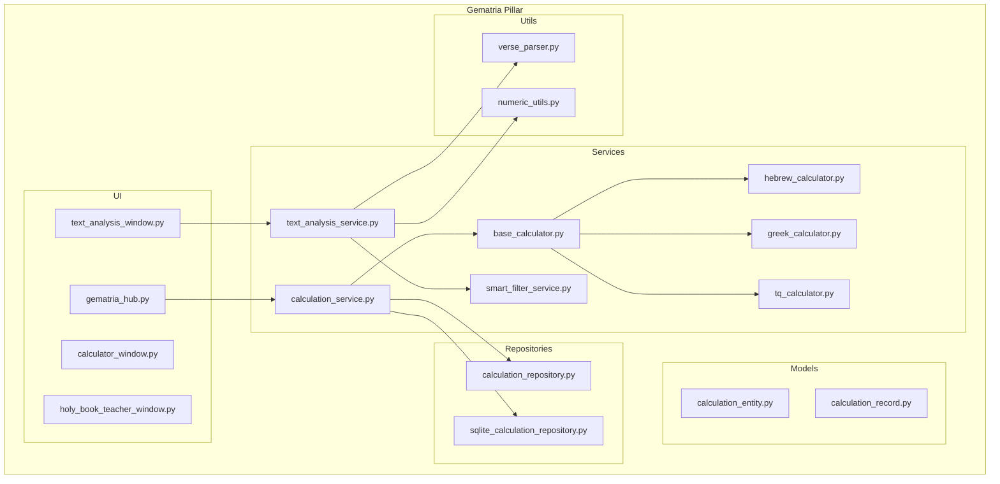
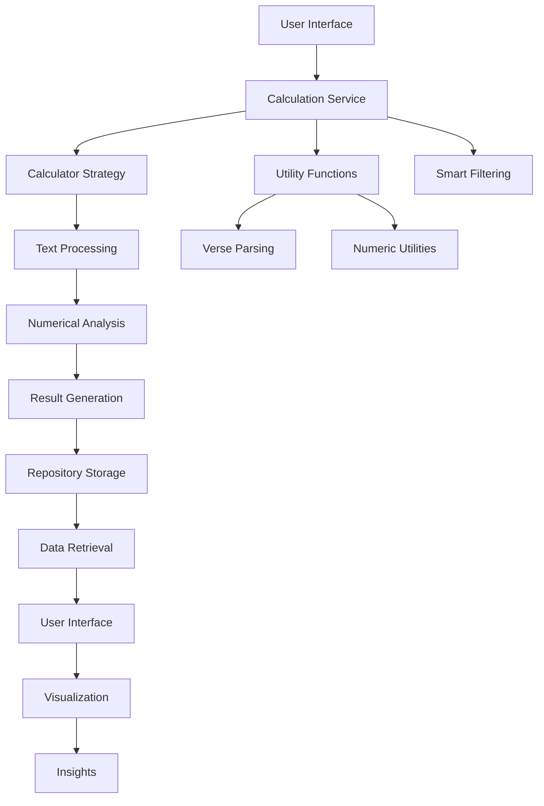
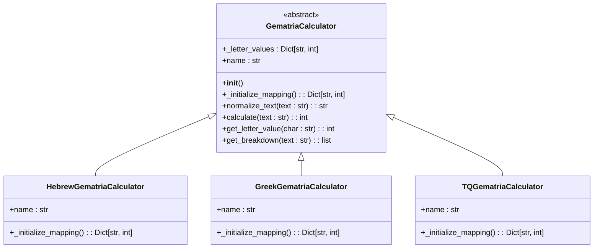
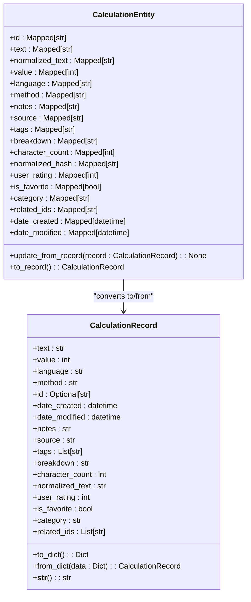
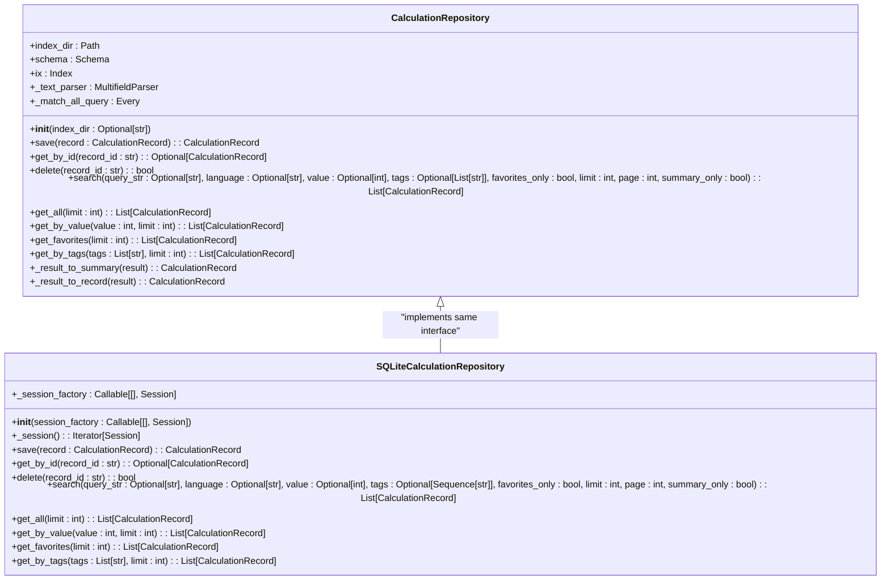
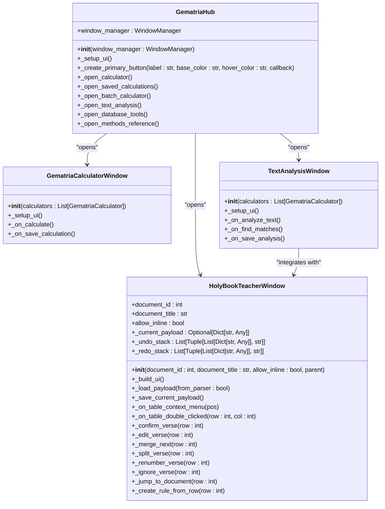
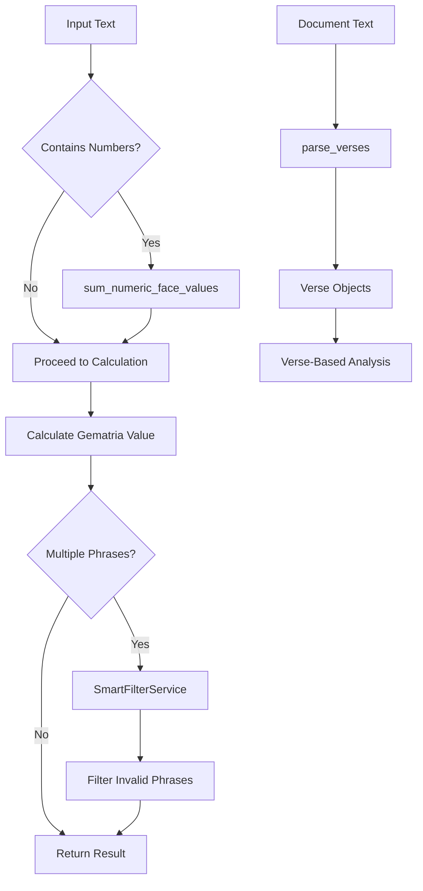
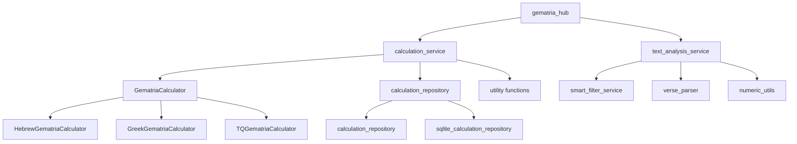

# Gematria Pillar

<cite>
**Referenced Files in This Document**   
- [__init__.py](file://src/pillars/gematria/__init__.py)
- [gematria_hub.py](file://src/pillars/gematria/ui/gematria_hub.py)
- [calculation_service.py](file://src/pillars/gematria/services/calculation_service.py)
- [calculation_entity.py](file://src/pillars/gematria/models/calculation_entity.py)
- [calculation_record.py](file://src/pillars/gematria/models/calculation_record.py)
- [base_calculator.py](file://src/pillars/gematria/services/base_calculator.py)
- [hebrew_calculator.py](file://src/pillars/gematria/services/hebrew_calculator.py)
- [greek_calculator.py](file://src/pillars/gematria/services/greek_calculator.py)
- [tq_calculator.py](file://src/pillars/gematria/services/tq_calculator.py)
- [calculation_repository.py](file://src/pillars/gematria/repositories/calculation_repository.py)
- [sqlite_calculation_repository.py](file://src/pillars/gematria/repositories/sqlite_calculation_repository.py)
- [verse_parser.py](file://src/pillars/gematria/utils/verse_parser.py)
- [numeric_utils.py](file://src/pillars/gematria/utils/numeric_utils.py)
- [smart_filter_service.py](file://src/pillars/gematria/services/smart_filter_service.py)
- [text_analysis_service.py](file://src/pillars/gematria/services/text_analysis_service.py)
- [holy_book_teacher_window.py](file://src/pillars/gematria/ui/holy_book_teacher_window.py)
- [gematria_calculator_window.py](file://src/pillars/gematria/ui/gematria_calculator_window.py)
- [text_analysis_window.py](file://src/pillars/gematria/ui/text_analysis_window.py)
</cite>

## Table of Contents
1. [Introduction](#introduction)
2. [Project Structure](#project-structure)
3. [Core Components](#core-components)
4. [Architecture Overview](#architecture-overview)
5. [Detailed Component Analysis](#detailed-component-analysis)
6. [Dependency Analysis](#dependency-analysis)
7. [Performance Considerations](#performance-considerations)
8. [Troubleshooting Guide](#troubleshooting-guide)
9. [Conclusion](#conclusion)

## Introduction
The Gematria pillar is a modular component within the isopgem application dedicated to numerological analysis using Hebrew, Greek, and English gematria systems. This documentation provides a comprehensive architectural overview of the pillar, detailing its internal structure, component interactions, and specialized features. The system follows a standard pillar pattern with distinct layers for UI components, service logic, data models, repositories, and utility functions. The architecture implements the Strategy Pattern to enable pluggable calculator types, allowing flexible analysis across different gematria systems. The gematria_hub serves as the central interface that integrates all subcomponents into a cohesive user experience.

## Project Structure
The Gematria pillar follows a well-organized directory structure that separates concerns according to the standard pillar pattern. The component is located at `src/pillars/gematria/` and contains subdirectories for models, repositories, services, UI components, and utilities. The models directory contains data definitions for calculation entities and records, while the repositories directory implements persistence logic with both Whoosh and SQLite backends. The services directory houses the core business logic including the calculation service and various calculator implementations. The UI directory contains the hub, calculator windows, and text analysis tools, while the utils directory provides supporting functions for verse parsing and numeric operations.

**Diagram sources**
- [gematria_hub.py](file://src/pillars/gematria/ui/gematria_hub.py)
- [calculation_service.py](file://src/pillars/gematria/services/calculation_service.py)
- [base_calculator.py](file://src/pillars/gematria/services/base_calculator.py)
- [hebrew_calculator.py](file://src/pillars/gematria/services/hebrew_calculator.py)
- [greek_calculator.py](file://src/pillars/gematria/services/greek_calculator.py)
- [tq_calculator.py](file://src/pillars/gematria/services/tq_calculator.py)
- [calculation_repository.py](file://src/pillars/gematria/repositories/calculation_repository.py)
- [sqlite_calculation_repository.py](file://src/pillars/gematria/repositories/sqlite_calculation_repository.py)
- [verse_parser.py](file://src/pillars/gematria/utils/verse_parser.py)
- [numeric_utils.py](file://src/pillars/gematria/utils/numeric_utils.py)
- [smart_filter_service.py](file://src/pillars/gematria/services/smart_filter_service.py)
- [text_analysis_service.py](file://src/pillars/gematria/services/text_analysis_service.py)

**Section sources**
- [__init__.py](file://src/pillars/gematria/__init__.py)
- [gematria_hub.py](file://src/pillars/gematria/ui/gematria_hub.py)

## Core Components
The Gematria pillar consists of several core components that work together to provide comprehensive numerological analysis capabilities. The system is built around a service layer that processes text input through various calculator strategies to generate numerical insights. The calculation_service acts as the central coordinator, managing the lifecycle of calculation records and orchestrating interactions between calculators, repositories, and utility functions. The base_calculator defines an abstract interface that all specific calculator implementations follow, enabling the Strategy Pattern for pluggable calculation methods. The repository layer provides persistence through both Whoosh-based and SQLite-based implementations, allowing for flexible storage and retrieval of calculation results. Utility functions like verse_parser and numeric_utils provide specialized capabilities for text processing and numeric analysis.

**Section sources**
- [calculation_service.py](file://src/pillars/gematria/services/calculation_service.py)
- [base_calculator.py](file://src/pillars/gematria/services/base_calculator.py)
- [calculation_repository.py](file://src/pillars/gematria/repositories/calculation_repository.py)
- [sqlite_calculation_repository.py](file://src/pillars/gematria/repositories/sqlite_calculation_repository.py)
- [verse_parser.py](file://src/pillars/gematria/utils/verse_parser.py)
- [numeric_utils.py](file://src/pillars/gematria/utils/numeric_utils.py)

## Architecture Overview
The Gematria pillar follows a layered architecture with clear separation of concerns between presentation, business logic, and data access layers. The system implements the Strategy Pattern to allow pluggable calculator types, enabling flexible analysis across different gematria systems. The architecture centers around the calculation_service, which coordinates the flow of data between UI components, calculator strategies, and persistence mechanisms. When a user inputs text for analysis, the request flows through the service layer where it is processed by the appropriate calculator strategy based on the selected gematria system. The results are then stored in the repository layer and made available for retrieval and further analysis.

**Diagram sources**
- [calculation_service.py](file://src/pillars/gematria/services/calculation_service.py)
- [base_calculator.py](file://src/pillars/gematria/services/base_calculator.py)
- [calculation_repository.py](file://src/pillars/gematria/repositories/calculation_repository.py)
- [verse_parser.py](file://src/pillars/gematria/utils/verse_parser.py)
- [numeric_utils.py](file://src/pillars/gematria/utils/numeric_utils.py)
- [smart_filter_service.py](file://src/pillars/gematria/services/smart_filter_service.py)

## Detailed Component Analysis

### Service Layer Analysis
The service layer of the Gematria pillar is responsible for coordinating the core business logic and orchestrating interactions between different components. The calculation_service serves as the primary entry point for all calculation operations, providing methods for saving, updating, deleting, and searching calculation records. The service layer implements the Strategy Pattern through the base_calculator abstract class, which defines a common interface for all calculator implementations. This design allows the system to support multiple gematria systems (Hebrew, Greek, and English/TQ) while maintaining a consistent API for calculation operations.

#### Strategy Pattern Implementation
The Strategy Pattern is implemented through the GematriaCalculator abstract base class, which defines the contract that all calculator implementations must follow. Each concrete calculator (Hebrew, Greek, TQ) inherits from this base class and provides its own implementation of the letter-to-value mapping and calculation logic. This design enables the system to easily extend support for new gematria systems by simply creating a new class that implements the required interface.

**Diagram sources**
- [base_calculator.py](file://src/pillars/gematria/services/base_calculator.py)
- [hebrew_calculator.py](file://src/pillars/gematria/services/hebrew_calculator.py)
- [greek_calculator.py](file://src/pillars/gematria/services/greek_calculator.py)
- [tq_calculator.py](file://src/pillars/gematria/services/tq_calculator.py)

**Section sources**
- [base_calculator.py](file://src/pillars/gematria/services/base_calculator.py)
- [hebrew_calculator.py](file://src/pillars/gematria/services/hebrew_calculator.py)
- [greek_calculator.py](file://src/pillars/gematria/services/greek_calculator.py)
- [tq_calculator.py](file://src/pillars/gematria/services/tq_calculator.py)

### Data Model Analysis
The data model of the Gematria pillar consists of two primary components: CalculationRecord and CalculationEntity. The CalculationRecord class represents the domain model for a saved gematria calculation, containing all the relevant metadata and calculation details. The CalculationEntity class represents the persistence model that maps to the database schema. This separation of concerns allows the system to maintain a clean domain model while providing flexibility in how data is stored and retrieved.

#### Data Model Relationships
The data model implements a pattern where the domain model (CalculationRecord) is converted to and from the persistence model (CalculationEntity) through dedicated methods. This approach provides a clear boundary between the business logic layer and the data access layer, allowing each to evolve independently.

**Diagram sources**
- [calculation_record.py](file://src/pillars/gematria/models/calculation_record.py)
- [calculation_entity.py](file://src/pillars/gematria/models/calculation_entity.py)

**Section sources**
- [calculation_record.py](file://src/pillars/gematria/models/calculation_record.py)
- [calculation_entity.py](file://src/pillars/gematria/models/calculation_entity.py)

### Repository Layer Analysis
The repository layer provides persistence capabilities for the Gematria pillar through two distinct implementations: a Whoosh-based repository and a SQLite-based repository. The CalculationRepository class implements a Whoosh-based storage system that provides full-text search capabilities for calculation records. The SQLiteCalculationRepository class provides a relational database implementation using SQLAlchemy, offering robust transaction support and complex querying capabilities. Both repositories implement the same interface, allowing them to be used interchangeably within the application.

#### Repository Implementation Details
The repository layer follows the Repository Pattern, providing an abstraction over the underlying data storage mechanisms. This design allows the service layer to interact with the repositories through a consistent API, regardless of the specific storage technology being used. The repositories handle all data access operations, including saving, retrieving, updating, and deleting calculation records.

**Diagram sources**
- [calculation_repository.py](file://src/pillars/gematria/repositories/calculation_repository.py)
- [sqlite_calculation_repository.py](file://src/pillars/gematria/repositories/sqlite_calculation_repository.py)

**Section sources**
- [calculation_repository.py](file://src/pillars/gematria/repositories/calculation_repository.py)
- [sqlite_calculation_repository.py](file://src/pillars/gematria/repositories/sqlite_calculation_repository.py)

### UI Component Analysis
The UI components of the Gematria pillar provide a cohesive interface for users to interact with the numerological analysis tools. The gematria_hub serves as the central launcher interface, providing access to all available tools including the gematria calculator, saved calculations browser, batch calculator, text analysis, database tools, and methods reference. Each tool is implemented as a separate window component that follows a consistent design pattern and integrates with the shared window manager.

#### UI Component Relationships
The UI components are organized in a hierarchical structure with the gematria_hub at the top level, coordinating the opening and management of other tool windows. The hub uses the window manager to instantiate and display the various tool windows, passing the necessary dependencies such as calculator instances and service objects.

**Diagram sources**
- [gematria_hub.py](file://src/pillars/gematria/ui/gematria_hub.py)
- [gematria_calculator_window.py](file://src/pillars/gematria/ui/gematria_calculator_window.py)
- [text_analysis_window.py](file://src/pillars/gematria/ui/text_analysis_window.py)
- [holy_book_teacher_window.py](file://src/pillars/gematria/ui/holy_book_teacher_window.py)

**Section sources**
- [gematria_hub.py](file://src/pillars/gematria/ui/gematria_hub.py)
- [gematria_calculator_window.py](file://src/pillars/gematria/ui/gematria_calculator_window.py)
- [text_analysis_window.py](file://src/pillars/gematria/ui/text_analysis_window.py)
- [holy_book_teacher_window.py](file://src/pillars/gematria/ui/holy_book_teacher_window.py)

### Utility Functions Analysis
The utility functions in the Gematria pillar provide specialized capabilities that support the core analysis features. The verse_parser module contains functions for parsing documents into numbered verses, which is essential for verse-based analysis in holy texts. The numeric_utils module provides functions for handling numeric face values in text, allowing the system to account for explicit numbers in addition to gematria calculations. The smart_filter_service uses NLP techniques to filter out linguistically invalid phrases, improving the quality of analysis results.

#### Utility Function Workflows
The utility functions are designed to be used as supporting components within the larger analysis workflow. They are typically called from within the service layer or UI components to provide specific processing capabilities that are not part of the core calculation logic.

**Diagram sources**
- [verse_parser.py](file://src/pillars/gematria/utils/verse_parser.py)
- [numeric_utils.py](file://src/pillars/gematria/utils/numeric_utils.py)
- [smart_filter_service.py](file://src/pillars/gematria/services/smart_filter_service.py)

**Section sources**
- [verse_parser.py](file://src/pillars/gematria/utils/verse_parser.py)
- [numeric_utils.py](file://src/pillars/gematria/utils/numeric_utils.py)
- [smart_filter_service.py](file://src/pillars/gematria/services/smart_filter_service.py)

## Dependency Analysis
The Gematria pillar has a well-defined dependency structure that follows the dependency inversion principle. Higher-level components depend on abstractions rather than concrete implementations, allowing for flexibility and testability. The calculation_service depends on the abstract GematriaCalculator interface rather than specific calculator implementations, enabling the Strategy Pattern. The service layer depends on the repository interface rather than specific repository implementations, allowing the system to switch between Whoosh and SQLite storage backends. The UI components depend on the service layer and shared utilities rather than directly accessing lower-level components.

**Diagram sources**
- [gematria_hub.py](file://src/pillars/gematria/ui/gematria_hub.py)
- [calculation_service.py](file://src/pillars/gematria/services/calculation_service.py)
- [base_calculator.py](file://src/pillars/gematria/services/base_calculator.py)
- [hebrew_calculator.py](file://src/pillars/gematria/services/hebrew_calculator.py)
- [greek_calculator.py](file://src/pillars/gematria/services/greek_calculator.py)
- [tq_calculator.py](file://src/pillars/gematria/services/tq_calculator.py)
- [calculation_repository.py](file://src/pillars/gematria/repositories/calculation_repository.py)
- [sqlite_calculation_repository.py](file://src/pillars/gematria/repositories/sqlite_calculation_repository.py)
- [text_analysis_service.py](file://src/pillars/gematria/services/text_analysis_service.py)
- [smart_filter_service.py](file://src/pillars/gematria/services/smart_filter_service.py)
- [verse_parser.py](file://src/pillars/gematria/utils/verse_parser.py)
- [numeric_utils.py](file://src/pillars/gematria/utils/numeric_utils.py)

**Section sources**
- [gematria_hub.py](file://src/pillars/gematria/ui/gematria_hub.py)
- [calculation_service.py](file://src/pillars/gematria/services/calculation_service.py)
- [base_calculator.py](file://src/pillars/gematria/services/base_calculator.py)
- [calculation_repository.py](file://src/pillars/gematria/repositories/calculation_repository.py)
- [text_analysis_service.py](file://src/pillars/gematria/services/text_analysis_service.py)

## Performance Considerations
The Gematria pillar has been designed with performance considerations in mind, particularly for text analysis operations that may involve processing large documents. The text_analysis_service implements a fast scan algorithm for finding value matches, which pre-calculates token values and uses a sliding window approach to efficiently identify phrases that match a target gematria value. The repository layer provides options for both full and summary record retrieval, allowing the system to minimize data transfer when only basic information is needed. The smart_filter_service uses batch processing with spaCy's NLP pipeline to efficiently analyze multiple phrases simultaneously. For large-scale analysis, the system can leverage the SQLite backend for faster querying and indexing capabilities compared to the Whoosh implementation.

## Troubleshooting Guide
When encountering issues with the Gematria pillar, consider the following common problems and solutions:

1. **Calculator not producing expected results**: Verify that the correct calculator type is selected and that the input text is properly formatted. Check for any diacritical marks or special characters that might affect the calculation.

2. **Performance issues with large documents**: For text analysis on large documents, consider using the SQLite repository backend instead of Whoosh, as it may provide better performance for large datasets. Also, adjust the max_words parameter in the find_value_matches method to limit the search space.

3. **Verse parsing not working correctly**: Ensure that the document contains properly formatted verse numbers. The verse_parser uses heuristics to identify verse markers, so inconsistent formatting may cause parsing issues. Use the Holy Book Teacher mode to manually correct and save verse boundaries.

4. **Smart filtering removing valid phrases**: The smart_filter_service uses NLP rules to identify linguistically valid phrases. If valid phrases are being filtered out, check the spaCy model loading and ensure that the "en_core_web_sm" model is properly installed.

5. **Repository storage issues**: If calculations are not being saved or retrieved correctly, verify that the storage directory has proper read/write permissions. For the SQLite backend, check that the database file is not corrupted and that the schema is up to date.

**Section sources**
- [calculation_service.py](file://src/pillars/gematria/services/calculation_service.py)
- [text_analysis_service.py](file://src/pillars/gematria/services/text_analysis_service.py)
- [verse_parser.py](file://src/pillars/gematria/utils/verse_parser.py)
- [smart_filter_service.py](file://src/pillars/gematria/services/smart_filter_service.py)
- [calculation_repository.py](file://src/pillars/gematria/repositories/calculation_repository.py)
- [sqlite_calculation_repository.py](file://src/pillars/gematria/repositories/sqlite_calculation_repository.py)

## Conclusion
The Gematria pillar provides a comprehensive framework for numerological analysis using Hebrew, Greek, and English gematria systems. The architecture follows a modular design with clear separation of concerns between UI components, service logic, data models, repositories, and utility functions. The implementation of the Strategy Pattern through the base_calculator abstract class enables flexible support for multiple gematria systems while maintaining a consistent API. The system integrates specialized features like the Holy Book teacher mode, smart filtering, and verse-based analysis to provide advanced capabilities for textual analysis. The repository layer offers both Whoosh-based and SQLite-based storage options, providing flexibility in how calculation results are persisted and retrieved. Overall, the Gematria pillar demonstrates a well-structured, extensible architecture that effectively supports complex numerological analysis tasks.