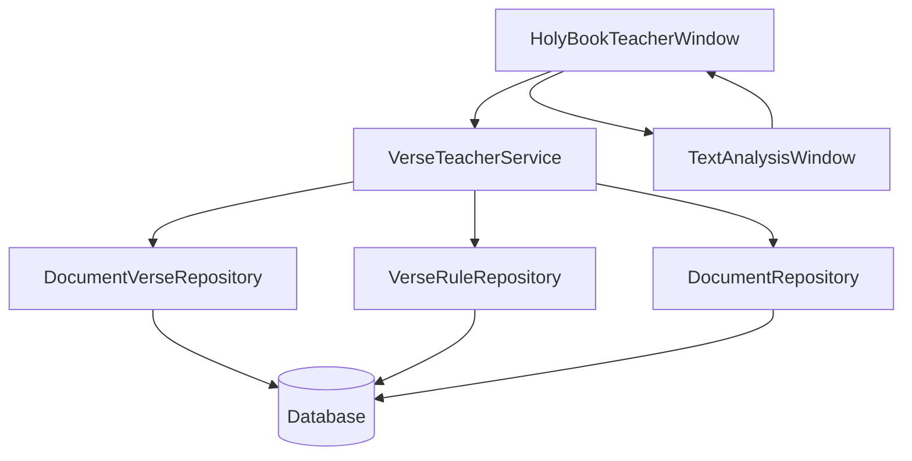
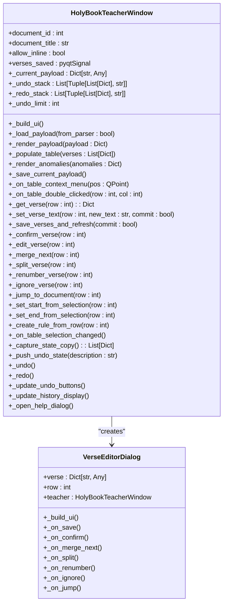
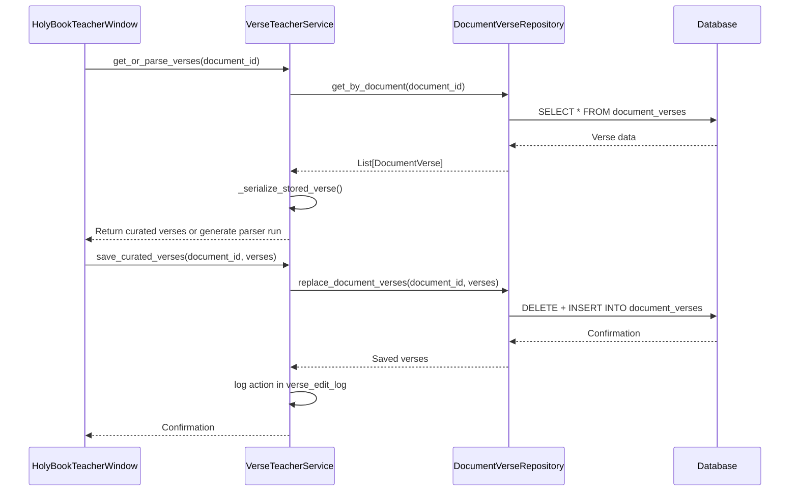
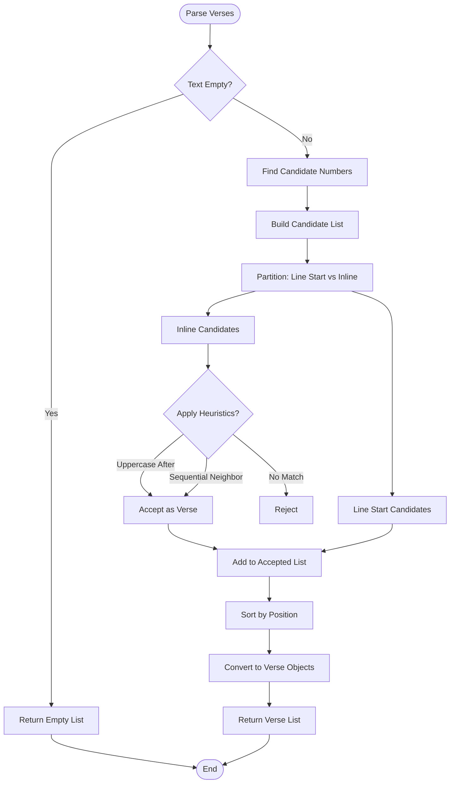
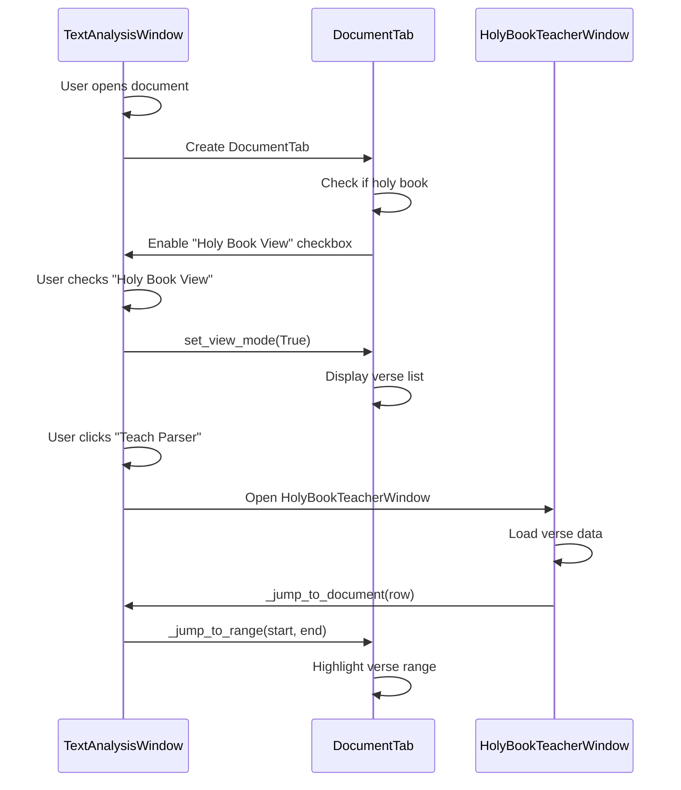
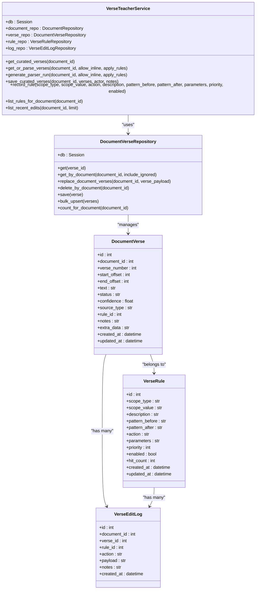

# Holy Book Teacher Mode

<cite>
**Referenced Files in This Document**   
- [holy_book_teacher_window.py](file://src/pillars/gematria/ui/holy_book_teacher_window.py)
- [verse_teacher_service.py](file://src/pillars/document_manager/services/verse_teacher_service.py)
- [document_verse_repository.py](file://src/pillars/document_manager/repositories/document_verse_repository.py)
- [verse_parser.py](file://src/pillars/gematria/utils/verse_parser.py)
- [document_tab.py](file://src/pillars/gematria/ui/text_analysis/document_tab.py)
- [document_manager_hub.py](file://src/pillars/document_manager/ui/document_manager_hub.py)
- [HOLY_BOOK_TEACHER_HELP.md](file://Docs/HOLY_BOOK_TEACHER_HELP.md)
</cite>

## Table of Contents
1. [Introduction](#introduction)
2. [Core Components](#core-components)
3. [Architecture Overview](#architecture-overview)
4. [Detailed Component Analysis](#detailed-component-analysis)
5. [Integration with DocumentManager](#integration-with-documentmanager)
6. [Verse Teacher Service and Document Verse Repository Relationship](#verse-teacher-service-and-document-verse-repository-relationship)
7. [Common Issues and Solutions](#common-issues-and-solutions)
8. [Extension Points for Additional Sacred Texts](#extension-points-for-additional-sacred-texts)
9. [Conclusion](#conclusion)

## Introduction
The Holy Book Teacher Mode is a specialized feature designed to provide contextual gematria analysis of sacred texts by enabling users to curate and analyze biblical verses with their numerical significance. This mode allows users to explore connections between verses based on numerical equivalences through a structured workflow that combines automated parsing with manual curation. The system integrates tightly with the DocumentManager to display verses alongside their gematria values, using the verse_teacher_service to correlate textual content with numerical data. This documentation explains the implementation details, component relationships, and practical usage of the Holy Book Teacher Mode, making it accessible to beginners while providing technical depth for developers interested in extending the system for additional sacred texts.

## Core Components
The Holy Book Teacher Mode consists of several interconnected components that work together to provide verse analysis and curation capabilities. The primary components include the HolyBookTeacherWindow for user interaction, the verse_teacher_service for business logic and data processing, and the document_verse_repository for data persistence. These components enable users to parse sacred texts into verses, manually correct parsing errors, create rules for consistent parsing, and save curated verse sequences for future use. The system also provides anomaly detection for duplicate or missing verse numbers and overlap detection between verse ranges.

**Section sources**
- [holy_book_teacher_window.py](file://src/pillars/gematria/ui/holy_book_teacher_window.py#L41-L788)
- [verse_teacher_service.py](file://src/pillars/document_manager/services/verse_teacher_service.py#L20-L352)
- [document_verse_repository.py](file://src/pillars/document_manager/repositories/document_verse_repository.py#L11-L90)

## Architecture Overview
The Holy Book Teacher Mode follows a layered architecture with clear separation between presentation, business logic, and data access layers. The user interface is implemented as a QMainWindow subclass (HolyBookTeacherWindow) that provides a comprehensive workspace for reviewing and editing verse data. This UI layer communicates with the verse_teacher_service, which encapsulates the core business logic for verse parsing, rule application, and data management. The service layer interacts with repository classes that handle data persistence through SQLAlchemy ORM, storing verse data, parsing rules, and audit logs in a relational database. This architecture enables a clean separation of concerns while maintaining high performance and data integrity.

**Diagram sources **
- [holy_book_teacher_window.py](file://src/pillars/gematria/ui/holy_book_teacher_window.py#L41-L788)
- [verse_teacher_service.py](file://src/pillars/document_manager/services/verse_teacher_service.py#L20-L352)
- [document_verse_repository.py](file://src/pillars/document_manager/repositories/document_verse_repository.py#L11-L90)

## Detailed Component Analysis

### HolyBookTeacherWindow Analysis
The HolyBookTeacherWindow provides a comprehensive user interface for reviewing, editing, and saving verse data. It displays verses in a table format with columns for verse number, status, start/end offsets, source type, confidence, and text content. The window includes several key features: an anomaly detection panel that identifies duplicate verse numbers, missing sequences, and overlapping ranges; undo/redo functionality with a 5-state history stack; and a context menu with actions for confirming, editing, merging, splitting, renumbering, and ignoring verses. Users can also create parsing rules from selected verses and jump to the corresponding text in the main document editor.

#### For Object-Oriented Components:

**Diagram sources **
- [holy_book_teacher_window.py](file://src/pillars/gematria/ui/holy_book_teacher_window.py#L41-L788)

**Section sources**
- [holy_book_teacher_window.py](file://src/pillars/gematria/ui/holy_book_teacher_window.py#L41-L788)

### Verse Teacher Service Analysis
The verse_teacher_service is the core business logic component that coordinates verse parsing, rule application, and data persistence. It provides methods for retrieving curated verses, generating parser runs, saving curated data, and creating parsing rules. The service applies heuristics to determine verse confidence based on whether markers appear at line starts or inline within text. It also implements rule-based processing that can suppress, promote, renumber, or annotate verses based on regex patterns in surrounding text. The service maintains audit logs of all editing actions and rule creations, providing traceability for verse curation workflows.

#### For API/Service Components:

**Diagram sources **
- [verse_teacher_service.py](file://src/pillars/document_manager/services/verse_teacher_service.py#L20-L352)

**Section sources**
- [verse_teacher_service.py](file://src/pillars/document_manager/services/verse_teacher_service.py#L20-L352)

### Verse Parser Analysis
The verse_parser module implements the core algorithm for detecting verse markers in sacred texts. It uses regular expressions to identify numeric markers that may appear at the start of lines or inline within text. The parser applies heuristics to determine whether inline numbers should be considered verse markers based on context, such as whether they are followed by uppercase letters (indicating a new sentence) or participate in sequential numbering patterns. The parser returns structured data including verse numbers, text content, and positional offsets, which serves as the foundation for gematria analysis and verse curation.

#### For Complex Logic Components:

**Diagram sources **
- [verse_parser.py](file://src/pillars/gematria/utils/verse_parser.py#L6-L107)

**Section sources**
- [verse_parser.py](file://src/pillars/gematria/utils/verse_parser.py#L6-L107)

## Integration with DocumentManager
The Holy Book Teacher Mode integrates seamlessly with the DocumentManager through the text analysis interface. When a user opens a document in the TextAnalysisWindow and enables the "Holy Book View" option, the system automatically detects whether the document belongs to a holy book collection or has appropriate tags. The DocumentTab component then switches to verse mode, displaying parsed verses instead of raw text. The "Teach Parser" button in the toolbar becomes enabled when a holy book document is active, allowing users to open the HolyBookTeacherWindow for that specific document. This integration provides a smooth workflow from document selection to verse curation, with bidirectional navigation between the teacher interface and the main document view.

**Diagram sources **
- [text_analysis/main_window.py](file://src/pillars/gematria/ui/text_analysis/main_window.py#L24-L223)
- [document_tab.py](file://src/pillars/gematria/ui/text_analysis/document_tab.py#L13-L150)

**Section sources**
- [text_analysis/main_window.py](file://src/pillars/gematria/ui/text_analysis/main_window.py#L24-L223)
- [document_tab.py](file://src/pillars/gematria/ui/text_analysis/document_tab.py#L13-L150)

## Verse Teacher Service and Document Verse Repository Relationship
The verse_teacher_service and document_verse_repository have a tightly coupled relationship that enables efficient data management for verse curation. The service acts as a facade that orchestrates operations across multiple repositories, with the document_verse_repository serving as the primary data access component for verse entities. When saving curated verses, the service delegates to the repository's replace_document_verses method, which performs an atomic delete-then-insert operation to ensure data consistency. The repository provides CRUD operations for verse records, including methods to retrieve verses by document, replace all verses for a document, and delete verses in bulk. This separation of concerns allows the service to focus on business logic while the repository handles data persistence details.

**Diagram sources **
- [verse_teacher_service.py](file://src/pillars/document_manager/services/verse_teacher_service.py#L20-L352)
- [document_verse_repository.py](file://src/pillars/document_manager/repositories/document_verse_repository.py#L11-L90)
- [document_verse.py](file://src/pillars/document_manager/models/document_verse.py#L21-L104)

**Section sources**
- [verse_teacher_service.py](file://src/pillars/document_manager/services/verse_teacher_service.py#L20-L352)
- [document_verse_repository.py](file://src/pillars/document_manager/repositories/document_verse_repository.py#L11-L90)

## Common Issues and Solutions
Several common issues may arise when using the Holy Book Teacher Mode, along with corresponding solutions:

**Verse Reference Accuracy**: Sometimes verse boundaries may be slightly off due to parsing errors. The solution is to use the "Jump to Document" feature to visually confirm the text range, then use "Set Start/End from Editor Selection" to precisely adjust the offsets based on manual selection in the main editor.

**Parsing Inconsistencies**: Documents with non-standard formatting may have inconsistent verse detection. The solution is to create parsing rules using the "Create Rule From This" feature, specifying regex patterns that identify context where numbers should or should not be treated as verse markers.

**Missing Verses**: Some verses may be missed if they don't follow standard numbering patterns. The solution is to use the "Split at Offset" feature to manually divide longer passages into individual verses, then renumber them appropriately.

**Duplicate Verse Numbers**: Multiple verses with the same number can occur in complex texts. The solution is to use the anomaly detection panel to identify duplicates, then manually renumber conflicting verses using the context menu.

**Performance with Large Documents**: Very large sacred texts may experience slow parsing. The solution is to work with smaller sections of the text at a time, saving curated verses frequently to avoid reprocessing the entire document.

**Section sources**
- [HOLY_BOOK_TEACHER_HELP.md](file://Docs/HOLY_BOOK_TEACHER_HELP.md#L1-L84)

## Extension Points for Additional Sacred Texts
The Holy Book Teacher Mode provides several extension points for supporting additional sacred texts beyond the default biblical corpus. Developers can extend the system by implementing custom verse parsing algorithms for texts with unique formatting conventions, creating specialized gematria calculation methods for different languages, or developing new rule types for context-specific verse detection. The modular architecture allows for plugging in alternative parsers through the verse_parser interface, while the database schema supports storing metadata specific to different religious traditions. The rule-based system can be extended to handle complex textual features found in various sacred writings, and the UI can be customized to display tradition-specific information alongside verse data.

**Section sources**
- [verse_parser.py](file://src/pillars/gematria/utils/verse_parser.py#L6-L107)
- [verse_teacher_service.py](file://src/pillars/document_manager/services/verse_teacher_service.py#L20-L352)

## Conclusion
The Holy Book Teacher Mode provides a comprehensive system for contextual gematria analysis of sacred texts, combining automated verse parsing with manual curation capabilities. By integrating with the DocumentManager and leveraging the verse_teacher_service, it enables users to explore numerical connections between biblical verses with high accuracy and flexibility. The system's architecture separates concerns effectively between UI, business logic, and data access layers, while providing robust features for verse management, rule creation, and anomaly detection. With its extensible design, the Holy Book Teacher Mode can be adapted to support additional sacred texts and analysis methods, making it a powerful tool for both casual exploration and scholarly research in gematria studies.