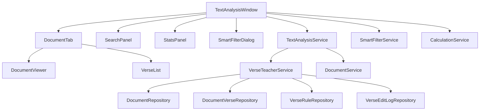
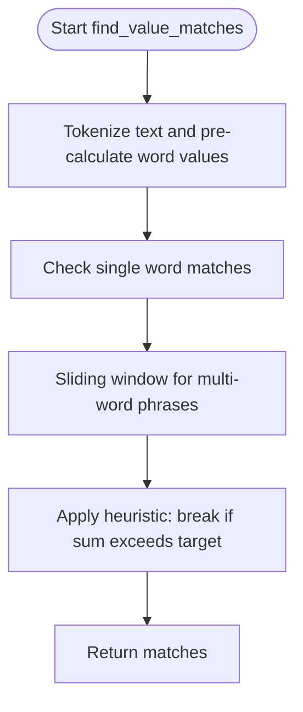
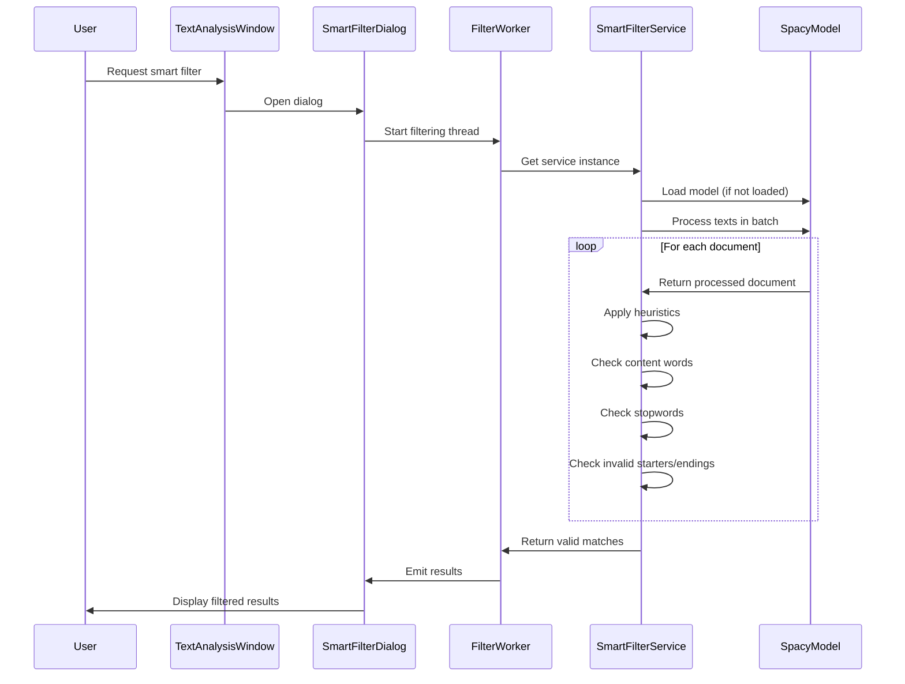
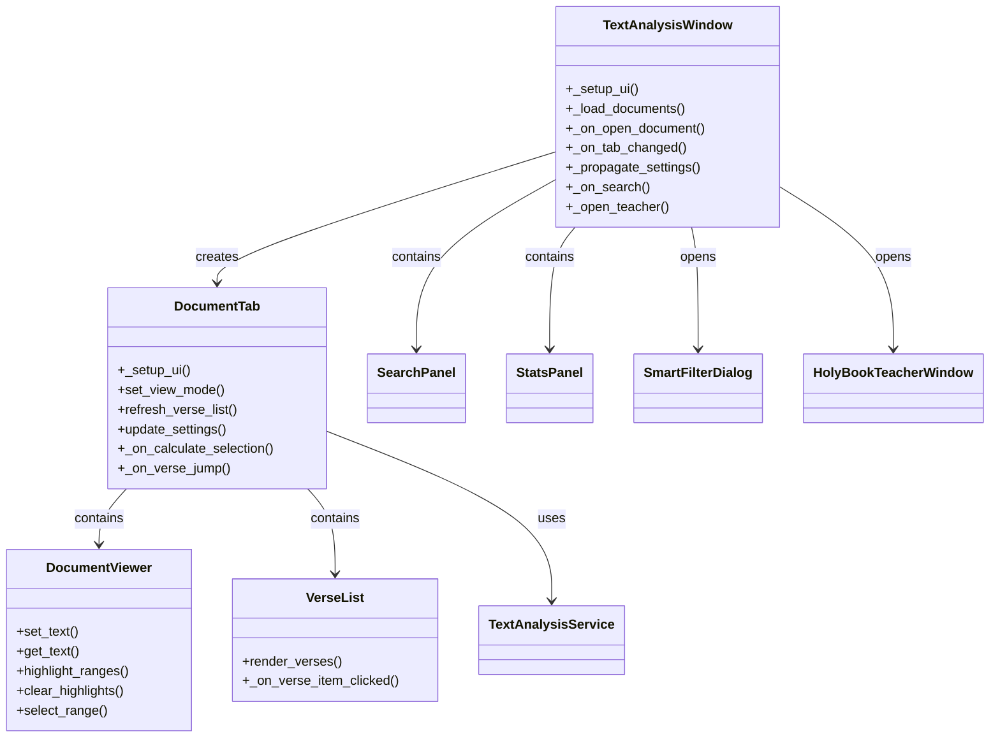

# Text Analysis System

<cite>
**Referenced Files in This Document**   
- [text_analysis_window.py](file://src/pillars/gematria/ui/text_analysis/main_window.py)
- [text_analysis_service.py](file://src/pillars/gematria/services/text_analysis_service.py)
- [smart_filter_service.py](file://src/pillars/gematria/services/smart_filter_service.py)
- [verse_teacher_service.py](file://src/pillars/document_manager/services/verse_teacher_service.py)
- [document_tab.py](file://src/pillars/gematria/ui/text_analysis/document_tab.py)
- [search_panel.py](file://src/pillars/gematria/ui/text_analysis/search_panel.py)
- [smart_filter_dialog.py](file://src/pillars/gematria/ui/text_analysis/smart_filter_dialog.py)
- [verse_parser.py](file://src/pillars/gematria/utils/verse_parser.py)
- [base_calculator.py](file://src/pillars/gematria/services/base_calculator.py)
- [calculation_service.py](file://src/pillars/gematria/services/calculation_service.py)
</cite>

## Table of Contents
1. [Introduction](#introduction)
2. [Architecture Overview](#architecture-overview)
3. [Core Components](#core-components)
4. [Text Analysis Service](#text-analysis-service)
5. [Smart Filter Service](#smart-filter-service)
6. [Integration with Document Manager](#integration-with-document-manager)
7. [Performance Considerations](#performance-considerations)
8. [Troubleshooting Guide](#troubleshooting-guide)
9. [Conclusion](#conclusion)

## Introduction

The Text Analysis System is an advanced feature that combines gematria calculations with document analysis from the Document Manager pillar. This system enables users to analyze verses and passages by applying multiple gematria methods to large texts, breaking them into segments for comprehensive analysis. The system integrates the TextAnalysisWindow with the DocumentManager to provide a seamless workflow for text analysis, pattern recognition, and contextual interpretation.

The system is designed to be accessible to beginners while providing sufficient technical depth for experienced developers. It addresses common issues such as performance bottlenecks when analyzing large documents and provides optimization strategies to ensure efficient processing.

**Section sources**
- [text_analysis_window.py](file://src/pillars/gematria/ui/text_analysis/main_window.py#L1-L465)

## Architecture Overview

The Text Analysis System follows a modular architecture with clear separation of concerns between UI components, services, and data models. The system is built around the TextAnalysisWindow, which serves as the main interface for users to interact with the text analysis features.

**Diagram sources**
- [text_analysis_window.py](file://src/pillars/gematria/ui/text_analysis/main_window.py#L24-L465)
- [document_tab.py](file://src/pillars/gematria/ui/text_analysis/document_tab.py#L13-L150)
- [search_panel.py](file://src/pillars/gematria/ui/text_analysis/search_panel.py#L9-L192)
- [smart_filter_dialog.py](file://src/pillars/gematria/ui/text_analysis/smart_filter_dialog.py#L21-L119)
- [text_analysis_service.py](file://src/pillars/gematria/services/text_analysis_service.py#L5-L185)
- [smart_filter_service.py](file://src/pillars/gematria/services/smart_filter_service.py#L5-L102)
- [verse_teacher_service.py](file://src/pillars/document_manager/services/verse_teacher_service.py#L20-L352)

## Core Components

The Text Analysis System consists of several core components that work together to provide comprehensive text analysis capabilities. The main components include the TextAnalysisWindow, which serves as the primary user interface, and the TextAnalysisService, which handles the core text processing and gematria calculations.

The system also includes the SmartFilterService for filtering results using NLP techniques, and integrates with the VerseTeacherService for contextual interpretation of verses. These components are designed to work together seamlessly, providing a powerful tool for analyzing texts using gematria methods.

The architecture follows a service-oriented design pattern, with clear separation between UI components and business logic. This allows for easy maintenance and extension of the system, as well as better testability of individual components.

**Section sources**
- [text_analysis_window.py](file://src/pillars/gematria/ui/text_analysis/main_window.py#L24-L465)
- [text_analysis_service.py](file://src/pillars/gematria/services/text_analysis_service.py#L5-L185)
- [smart_filter_service.py](file://src/pillars/gematria/services/smart_filter_service.py#L5-L102)

## Text Analysis Service

The TextAnalysisService is the core component responsible for handling text analysis operations. It provides several key methods for finding value matches, calculating text values, and parsing verses.

The `find_value_matches` method implements a Fast Scan algorithm that efficiently finds all text segments matching a target gematria value. The algorithm uses a two-step process: first tokenizing the text and pre-calculating word values, then using an integer sliding window to find matches. This approach ensures optimal performance even with large texts.

**Diagram sources**
- [text_analysis_service.py](file://src/pillars/gematria/services/text_analysis_service.py#L8-L113)

The service also includes the `calculate_stats` method for calculating text statistics such as word count, character count, total value, and average word value. This provides users with valuable insights into the text being analyzed.

Additionally, the `parse_verses` method integrates with the VerseTeacherService to provide contextual interpretation of verses. This method first attempts to load curated verse data from the VerseTeacherService, falling back to local parsing if necessary.

**Section sources**
- [text_analysis_service.py](file://src/pillars/gematria/services/text_analysis_service.py#L5-L185)

## Smart Filter Service

The SmartFilterService uses Spacy NLP to filter gematria phrases and remove linguistic nonsense. This service implements a singleton pattern to ensure efficient use of resources, particularly the Spacy model which can be memory-intensive.

The service works by loading the Spacy model lazily when first needed, then processing matches in batches for optimal performance. The filtering algorithm applies several heuristics to determine if a phrase is valid:

1. Must contain at least one content word (noun, verb, adjective, proper noun, or number)
2. Cannot consist entirely of stopwords and punctuation
3. Cannot start with conjunctions, particles, or punctuation
4. Cannot end with conjunctions, particles, punctuation, determiners, prepositions, or pronouns
5. Specific patterns like "DET + PREP" (e.g., "The of") or "ADJ + ADP" (e.g., "Good of") are rejected

**Diagram sources**
- [smart_filter_service.py](file://src/pillars/gematria/services/smart_filter_service.py#L5-L102)
- [smart_filter_dialog.py](file://src/pillars/gematria/ui/text_analysis/smart_filter_dialog.py#L21-L119)

The service processes texts in batches using Spacy's pipe functionality, which is more efficient than processing texts individually. This approach significantly improves performance when dealing with large numbers of matches.

**Section sources**
- [smart_filter_service.py](file://src/pillars/gematria/services/smart_filter_service.py#L5-L102)
- [smart_filter_dialog.py](file://src/pillars/gematria/ui/text_analysis/smart_filter_dialog.py#L21-L119)

## Integration with Document Manager

The Text Analysis System integrates closely with the Document Manager pillar through several key components. The TextAnalysisWindow uses the document_service_context to load documents and the verse_teacher_service_context to access verse interpretation functionality.

The integration follows a modular approach, with the TextAnalysisWindow creating DocumentTab instances for each document. Each DocumentTab contains a DocumentViewer for displaying text and a VerseList for showing parsed verses. The tab communicates with the main window through signals, enabling features like saving verses and opening the Holy Book Teacher.

**Diagram sources**
- [text_analysis_window.py](file://src/pillars/gematria/ui/text_analysis/main_window.py#L24-L465)
- [document_tab.py](file://src/pillars/gematria/ui/text_analysis/document_tab.py#L13-L150)

The system uses a context manager pattern for database access, ensuring proper resource management and transaction handling. When a user opens the Holy Book Teacher, the system passes the document ID and title to the teacher window, maintaining a consistent user experience across components.

The integration also includes performance optimizations such as lazy loading of documents and efficient text processing. The system only loads document content when a tab is opened, reducing memory usage and improving startup time.

**Section sources**
- [text_analysis_window.py](file://src/pillars/gematria/ui/text_analysis/main_window.py#L24-L465)
- [document_tab.py](file://src/pillars/gematria/ui/text_analysis/document_tab.py#L13-L150)
- [verse_teacher_service.py](file://src/pillars/document_manager/services/verse_teacher_service.py#L20-L352)

## Performance Considerations

The Text Analysis System includes several performance optimizations to handle large documents efficiently. The primary optimization is in the TextAnalysisService's find_value_matches method, which uses a Fast Scan algorithm with O(N) complexity for tokenization and an optimized sliding window approach for phrase matching.

Key performance features include:

1. **Pre-calculation of word values**: The service calculates gematria values for each word once during tokenization, avoiding redundant calculations during the search phase.

2. **Integer sliding window**: Instead of re-summing values for every window, the algorithm maintains a running sum, significantly reducing computational overhead.

3. **Early termination heuristic**: When the running sum exceeds the target value (assuming positive gematria values), the algorithm breaks the inner loop, avoiding unnecessary calculations.

4. **Batch processing**: The SmartFilterService processes texts in batches using Spacy's pipe functionality, which is more efficient than processing texts individually.

5. **Lazy loading**: Document content is only loaded when a tab is opened, reducing memory usage and improving startup time.

For very large documents, users may experience performance bottlenecks during initial text processing. To mitigate this, the system could implement additional optimizations such as:

- **Text segmentation**: Breaking large documents into smaller chunks for parallel processing
- **Caching**: Storing pre-processed text segments and their gematria values
- **Incremental processing**: Processing text in the background while allowing user interaction
- **Indexing**: Creating an index of word positions and values for faster lookups

The system's architecture supports these optimizations through its modular design, making it relatively straightforward to implement additional performance enhancements as needed.

**Section sources**
- [text_analysis_service.py](file://src/pillars/gematria/services/text_analysis_service.py#L8-L113)
- [smart_filter_service.py](file://src/pillars/gematria/services/smart_filter_service.py#L5-L102)

## Troubleshooting Guide

Common issues with the Text Analysis System typically relate to performance, configuration, or data handling. Here are some common problems and their solutions:

**Performance Issues with Large Documents**
- **Symptom**: Slow response times or application freezing when analyzing large texts
- **Solution**: Break the document into smaller sections for analysis, or use the "Strict Parsing" option to limit the scope of analysis

**Spacy Model Loading Issues**
- **Symptom**: Smart Filter fails to load or throws an error about missing model
- **Solution**: Ensure the "en_core_web_sm" model is installed using `python -m spacy download en_core_web_sm`

**Verse Parsing Problems**
- **Symptom**: Incorrect verse numbering or missing verses
- **Solution**: Use the Holy Book Teacher to manually curate verse boundaries, or adjust the parsing rules in the VerseRuleRepository

**Gematria Calculation Inconsistencies**
- **Symptom**: Unexpected gematria values for certain words
- **Solution**: Verify the selected gematria method (e.g., Hebrew Standard, Greek Isopsephy, English TQ) and check for special characters or diacritical marks that may affect calculations

**Document Loading Errors**
- **Symptom**: Unable to open documents or missing documents in the selector
- **Solution**: Verify document integrity and check database connectivity; use the Document Library to verify document availability

The system includes logging capabilities through Python's logging module, which can help diagnose issues. Error messages are displayed to users through QMessageBox dialogs, providing clear feedback about problems and potential solutions.

**Section sources**
- [text_analysis_service.py](file://src/pillars/gematria/services/text_analysis_service.py#L5-L185)
- [smart_filter_service.py](file://src/pillars/gematria/services/smart_filter_service.py#L5-L102)
- [verse_teacher_service.py](file://src/pillars/document_manager/services/verse_teacher_service.py#L20-L352)
- [text_analysis_window.py](file://src/pillars/gematria/ui/text_analysis/main_window.py#L24-L465)

## Conclusion

The Text Analysis System provides a comprehensive solution for combining gematria calculations with document analysis. By integrating the TextAnalysisWindow with the DocumentManager, the system enables users to analyze verses and passages using multiple gematria methods, with support for contextual interpretation through the VerseTeacherService.

The system's modular architecture, with clear separation between UI components and services, makes it both accessible to beginners and extensible for experienced developers. Performance optimizations such as the Fast Scan algorithm and batch processing ensure efficient analysis even with large documents.

Future enhancements could include additional gematria methods, improved NLP filtering, and enhanced visualization capabilities. The system's design supports these extensions while maintaining its core functionality and user experience.