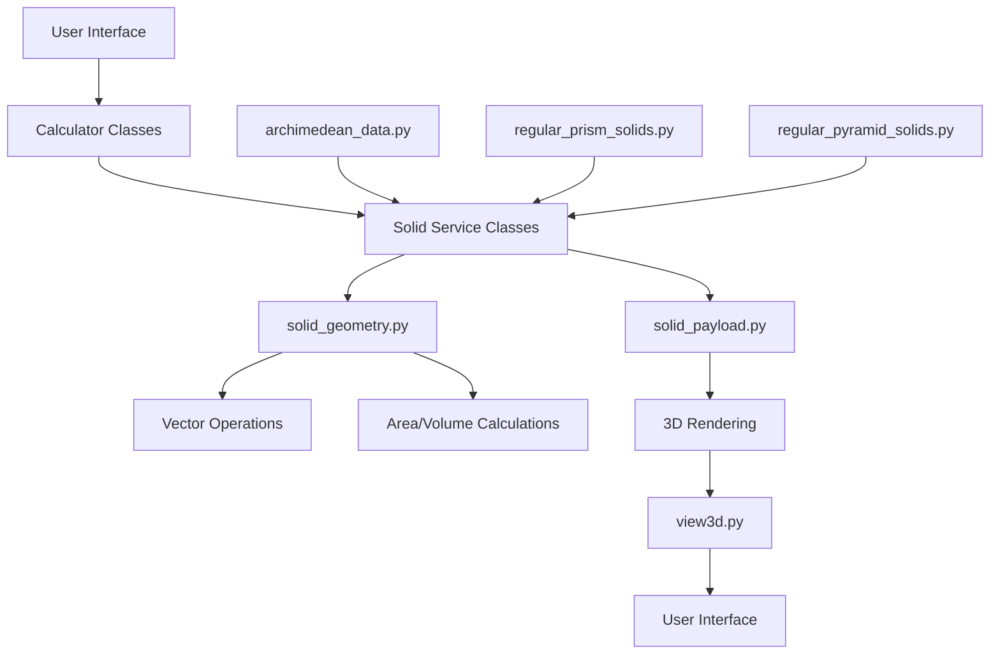
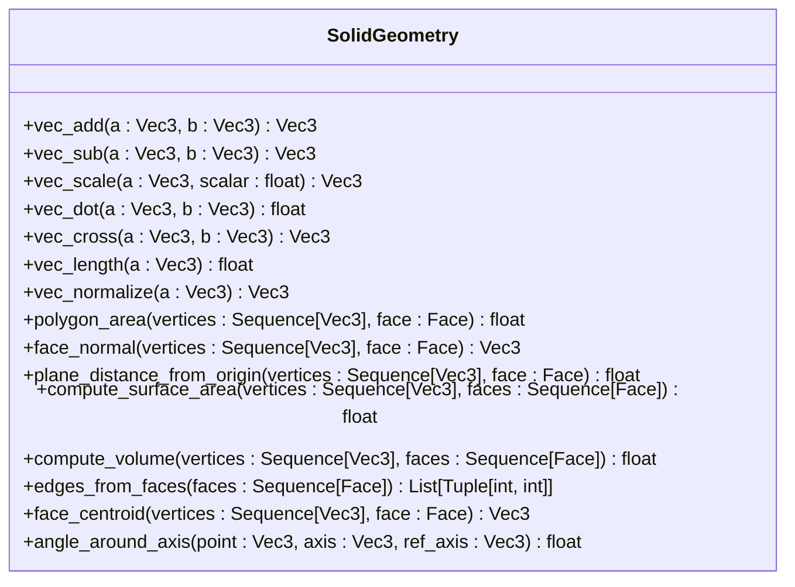
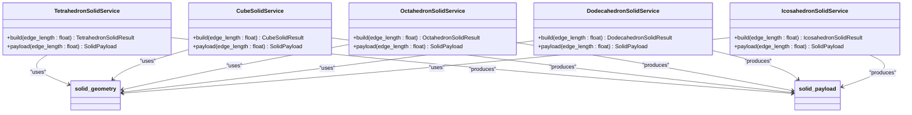
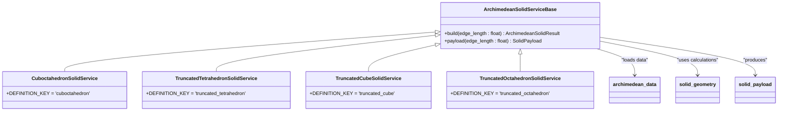
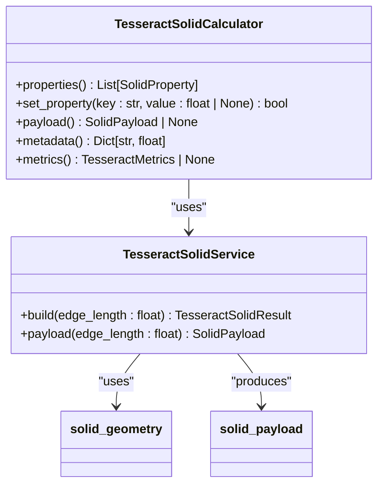
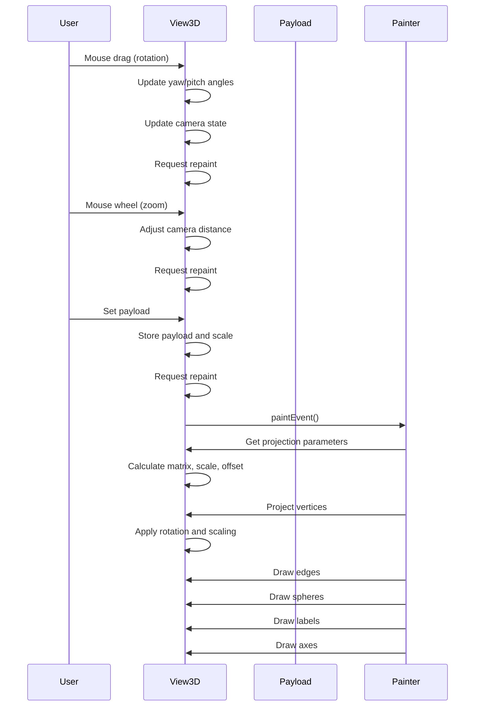

# 3D Solid Visualizations

<cite>
**Referenced Files in This Document**   
- [solid_geometry.py](file://src/pillars/geometry/services/solid_geometry.py)
- [view3d.py](file://src/pillars/geometry/ui/geometry3d/view3d.py)
- [tetrahedron_solid.py](file://src/pillars/geometry/services/tetrahedron_solid.py)
- [cube_solid.py](file://src/pillars/geometry/services/cube_solid.py)
- [octahedron_solid.py](file://src/pillars/geometry/services/octahedron_solid.py)
- [dodecahedron_solid.py](file://src/pillars/geometry/services/dodecahedron_solid.py)
- [icosahedron_solid.py](file://src/pillars/geometry/services/icosahedron_solid.py)
- [tesseract_solid.py](file://src/pillars/geometry/services/tesseract_solid.py)
- [archimedean_solids.py](file://src/pillars/geometry/services/archimedean_solids.py)
- [regular_prism_solids.py](file://src/pillars/geometry/services/regular_prism_solids.py)
- [regular_pyramid_solids.py](file://src/pillars/geometry/services/regular_pyramid_solids.py)
- [solid_payload.py](file://src/pillars/geometry/shared/solid_payload.py)
- [archimedean_data.py](file://src/pillars/geometry/services/archimedean_data.py)
</cite>

## Table of Contents
1. [Introduction](#introduction)
2. [Core Architecture](#core-architecture)
3. [Mathematical Foundations](#mathematical-foundations)
4. [Platonic Solids Implementation](#platonic-solids-implementation)
5. [Archimedean Solids Implementation](#archimedean-solids-implementation)
6. [Prisms and Pyramids Implementation](#prisms-and-pyramids-implementation)
7. [Higher-Dimensional Forms](#higher-dimensional-forms)
8. [3D Rendering Pipeline](#3d-rendering-pipeline)
9. [Developer Guidance](#developer-guidance)
10. [Conclusion](#conclusion)

## Introduction
The 3D solid visualization subsystem of the Geometry pillar provides comprehensive mathematical and visual representations of various geometric solids. This system supports Platonic solids, Archimedean solids, prisms, pyramids, and higher-dimensional forms like the tesseract. The implementation is built on a foundation of mathematical calculations for vertex generation, face construction, and volume/surface area computation, with integration into a 3D rendering component for visualization. The architecture follows a service-calculator pattern where specialized services generate geometric data and calculators provide bidirectional property manipulation.

## Core Architecture
The 3D solid visualization system follows a modular architecture with clear separation between mathematical computation, data representation, and rendering components. At its core is the `solid_geometry.py` module which provides fundamental vector operations and geometric calculations. Specialized solid classes extend this foundation to implement specific geometric forms, while the `view3d.py` component handles the 3D visualization aspects.



**Diagram sources**
- [solid_geometry.py](file://src/pillars/geometry/services/solid_geometry.py)
- [view3d.py](file://src/pillars/geometry/ui/geometry3d/view3d.py)
- [solid_payload.py](file://src/pillars/geometry/shared/solid_payload.py)
- [archimedean_data.py](file://src/pillars/geometry/services/archimedean_data.py)

**Section sources**
- [solid_geometry.py](file://src/pillars/geometry/services/solid_geometry.py)
- [view3d.py](file://src/pillars/geometry/ui/geometry3d/view3d.py)

## Mathematical Foundations
The mathematical foundation of the 3D solid visualization system is implemented in `solid_geometry.py`, which provides essential vector operations and geometric calculations. The module defines `Vec3` as a tuple of three floats and `Face` as a sequence of integers representing vertex indices. Key vector operations include addition, subtraction, scalar multiplication, dot product, cross product, length calculation, and normalization.

The system implements algorithms for calculating polygon area, face normal vectors, plane distance from origin, surface area, and volume. The surface area is computed by summing the areas of all faces using the cross product method for polygon area calculation. Volume is calculated using the scalar triple product approach, summing the absolute value of the dot product of vertex vectors with the cross product of edge vectors, divided by six.



**Diagram sources**
- [solid_geometry.py](file://src/pillars/geometry/services/solid_geometry.py)

**Section sources**
- [solid_geometry.py](file://src/pillars/geometry/services/solid_geometry.py)

## Platonic Solids Implementation
The Platonic solids (tetrahedron, cube, octahedron, dodecahedron, icosahedron) are implemented as specialized service classes that extend the mathematical foundation. Each solid has a canonical representation with standardized vertex coordinates, from which scaled versions are generated. The implementation follows a consistent pattern with service classes for generating geometric data and calculator classes for bidirectional property manipulation.

For example, the tetrahedron is defined with four vertices at (1,1,1), (-1,-1,1), (-1,1,-1), and (1,-1,-1), forming an equilateral tetrahedron with edge length 2√2. The cube uses the standard unit cube vertices scaled appropriately. The octahedron has vertices at (±1,0,0), (0,±1,0), and (0,0,±1). The dodecahedron and icosahedron implementations use the golden ratio φ = (1+√5)/2 in their vertex calculations, leveraging the dual relationship between these two solids.



**Diagram sources**
- [tetrahedron_solid.py](file://src/pillars/geometry/services/tetrahedron_solid.py)
- [cube_solid.py](file://src/pillars/geometry/services/cube_solid.py)
- [octahedron_solid.py](file://src/pillars/geometry/services/octahedron_solid.py)
- [dodecahedron_solid.py](file://src/pillars/geometry/services/dodecahedron_solid.py)
- [icosahedron_solid.py](file://src/pillars/geometry/services/icosahedron_solid.py)
- [solid_geometry.py](file://src/pillars/geometry/services/solid_geometry.py)
- [solid_payload.py](file://src/pillars/geometry/shared/solid_payload.py)

**Section sources**
- [tetrahedron_solid.py](file://src/pillars/geometry/services/tetrahedron_solid.py)
- [cube_solid.py](file://src/pillars/geometry/services/cube_solid.py)
- [octahedron_solid.py](file://src/pillars/geometry/services/octahedron_solid.py)
- [dodecahedron_solid.py](file://src/pillars/geometry/services/dodecahedron_solid.py)
- [icosahedron_solid.py](file://src/pillars/geometry/services/icosahedron_solid.py)

## Archimedean Solids Implementation
The Archimedean solids are implemented through a base service class that leverages pre-computed vertex and face data stored in `archimedean_data.py`. This data file contains canonical coordinates for all Archimedean solids, auto-generated from external sources. The implementation uses a service-calculator pattern similar to the Platonic solids, with `ArchimedeanSolidServiceBase` providing the foundation for specific solid implementations.

Each Archimedean solid is defined by its key (e.g., 'cuboctahedron', 'truncated_cube'), name, canonical vertices, faces, and derived properties like edge length, surface area, and volume. The service class scales the canonical representation to the desired edge length and generates a `SolidPayload` with vertices, edges, faces, labels, and metadata. The calculator classes enable bidirectional manipulation of properties, allowing users to set volume or surface area and have the corresponding edge length calculated.



**Diagram sources**
- [archimedean_solids.py](file://src/pillars/geometry/services/archimedean_solids.py)
- [archimedean_data.py](file://src/pillars/geometry/services/archimedean_data.py)
- [solid_geometry.py](file://src/pillars/geometry/services/solid_geometry.py)
- [solid_payload.py](file://src/pillars/geometry/shared/solid_payload.py)

**Section sources**
- [archimedean_solids.py](file://src/pillars/geometry/services/archimedean_solids.py)
- [archimedean_data.py](file://src/pillars/geometry/services/archimedean_data.py)

## Prisms and Pyramids Implementation
The system implements right regular prisms and pyramids through parameterized service classes that generate solids based on the number of sides and dimensions. The `RegularPrismSolidServiceBase` and `RegularPyramidSolidServiceBase` classes provide the foundation, with specific implementations for triangular, pentagonal, hexagonal, heptagonal, and octagonal variants.

For prisms, the implementation calculates vertices by placing points on a circle with radius equal to the circumradius of the regular polygon base, at z = ±height/2. Edges connect vertices in the bottom ring, top ring, and vertical connections between corresponding vertices. Faces include the two polygonal bases and rectangular lateral faces.

For pyramids, vertices are placed on a circle at z = -height/2 for the base, with the apex at (0,0,height/2). Edges connect adjacent base vertices and each base vertex to the apex. Faces include the polygonal base and triangular lateral faces connecting each base edge to the apex.

```mermaid
flowchart TD
A[Regular Prism/Pyramid Parameters] --> B[Calculate Base Geometry]
B --> C[Compute Apothem and Circumradius]
C --> D[Generate Base Vertices]
D --> E[Add Top Vertices or Apex]
E --> F[Connect Vertices with Edges]
F --> G[Create Face Definitions]
G --> H[Calculate Metrics]
H --> I[Generate SolidPayload]
I --> J[Return Result]
subgraph Base Geometry Calculations
C1[apothem = edge / (2 * tan(π/sides))]
C2[circumradius = edge / (2 * sin(π/sides))]
C3[area = (sides * edge²) / (4 * tan(π/sides))]
end
subgraph Vertex Generation
D1[For i in range(sides):]
D2[angle = 2πi/sides]
D3[x = radius * cos(angle)]
D4[y = radius * sin(angle)]
D5[z = ±height/2 for prisms]
D6[z = -height/2 for pyramid base]
D7[apex at (0,0,height/2)]
end
subgraph Edge and Face Creation
F1[Bottom ring edges: (i, i+1)]
F2[Top ring edges: (i+sides, i+1+sides)]
F3[Vertical edges: (i, i+sides) for prisms]
F4[Apothem edges: (i, apex) for pyramids]
G1[Base face: all base vertices]
G2[Top face: all top vertices for prisms]
G3[Lateral faces: quads for prisms, triangles for pyramids]
end
```

**Diagram sources**
- [regular_prism_solids.py](file://src/pillars/geometry/services/regular_prism_solids.py)
- [regular_pyramid_solids.py](file://src/pillars/geometry/services/regular_pyramid_solids.py)

**Section sources**
- [regular_prism_solids.py](file://src/pillars/geometry/services/regular_prism_solids.py)
- [regular_pyramid_solids.py](file://src/pillars/geometry/services/regular_pyramid_solids.py)

## Higher-Dimensional Forms
The tesseract (4-dimensional hypercube) is implemented as a Schlegel projection, which is a 3D representation of the 4D object. The implementation in `tesseract_solid.py` creates a visualization with two cubes (outer and inner) connected by edges, representing the 8 cubic cells of the tesseract. The outer cube has edge length 2.0, and the inner cube has edge length 1.0, with vertices connected to form 24 square faces.

The tesseract service generates vertices for both cubes and creates faces for the outer cube, inner cube, and connector faces between corresponding edges. The total structure has 16 vertices, 32 edges, and 24 faces. The calculator class supports manipulation of edge length, surface area, and volume, with bidirectional conversion between these properties.



**Diagram sources**
- [tesseract_solid.py](file://src/pillars/geometry/services/tesseract_solid.py)
- [solid_geometry.py](file://src/pillars/geometry/services/solid_geometry.py)
- [solid_payload.py](file://src/pillars/geometry/shared/solid_payload.py)

**Section sources**
- [tesseract_solid.py](file://src/pillars/geometry/services/tesseract_solid.py)

## 3D Rendering Pipeline
The 3D rendering component is implemented in `view3d.py` as the `Geometry3DView` widget, which provides an orthographic wireframe visualization of 3D solids. The rendering pipeline transforms 3D coordinates to 2D screen coordinates using a camera model with distance, yaw, pitch, pan, and zoom controls. The view supports interactive manipulation through mouse events for rotation and panning, and mouse wheel for zooming.

The camera state includes distance from the origin, yaw and pitch angles for orientation, and pan offsets for translation. The projection parameters are calculated based on the widget size and camera state, with vertices transformed by rotation matrix, scaling, and offset. The rendering process draws edges, spheres (representing insphere, midsphere, and circumsphere), labels, and coordinate axes.



**Diagram sources**
- [view3d.py](file://src/pillars/geometry/ui/geometry3d/view3d.py)

**Section sources**
- [view3d.py](file://src/pillars/geometry/ui/geometry3d/view3d.py)

## Developer Guidance
When implementing new 3D solid types, developers should follow the established patterns in the codebase. Create a service class that inherits from the appropriate base class or implements the same interface as existing services. The service should provide a `build` method that returns a `SolidResult` containing a `SolidPayload` and metrics, and a `payload` convenience method.

The `SolidPayload` should include vertices as 3D coordinates, edges as pairs of vertex indices, faces as sequences of vertex indices, labels for key measurements, metadata with calculated properties, and a suggested scale for rendering. Use the vector operations and geometric calculations from `solid_geometry.py` for consistency.

For parameterized solids, consider creating a base service class with a parameter (like number of sides) and derive specific implementations from it. Implement a calculator class that enables bidirectional property manipulation, allowing users to set any valid property and have related properties automatically updated.

Ensure proper error handling for invalid inputs, particularly for dimensions that must be positive. Include comprehensive metadata in the payload to support rendering and user interface components. Test the implementation thoroughly, verifying vertex counts, edge counts, face counts, and mathematical correctness of calculated properties.

## Conclusion
The 3D solid visualization subsystem provides a comprehensive framework for generating and rendering various geometric solids. The architecture separates mathematical computation from visualization, enabling consistent implementation across different solid types. The system supports Platonic solids, Archimedean solids, prisms, pyramids, and higher-dimensional forms like the tesseract, with a consistent API for property manipulation and visualization. The mathematical foundations in `solid_geometry.py` provide reliable vector operations and geometric calculations, while the rendering component in `view3d.py` offers an interactive 3D visualization experience. This modular design allows for easy extension to support additional solid types while maintaining consistency and accuracy.