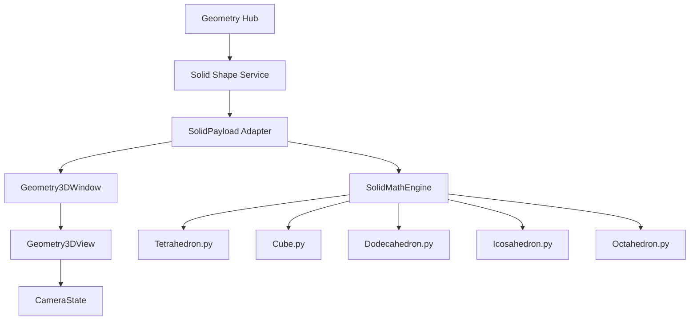
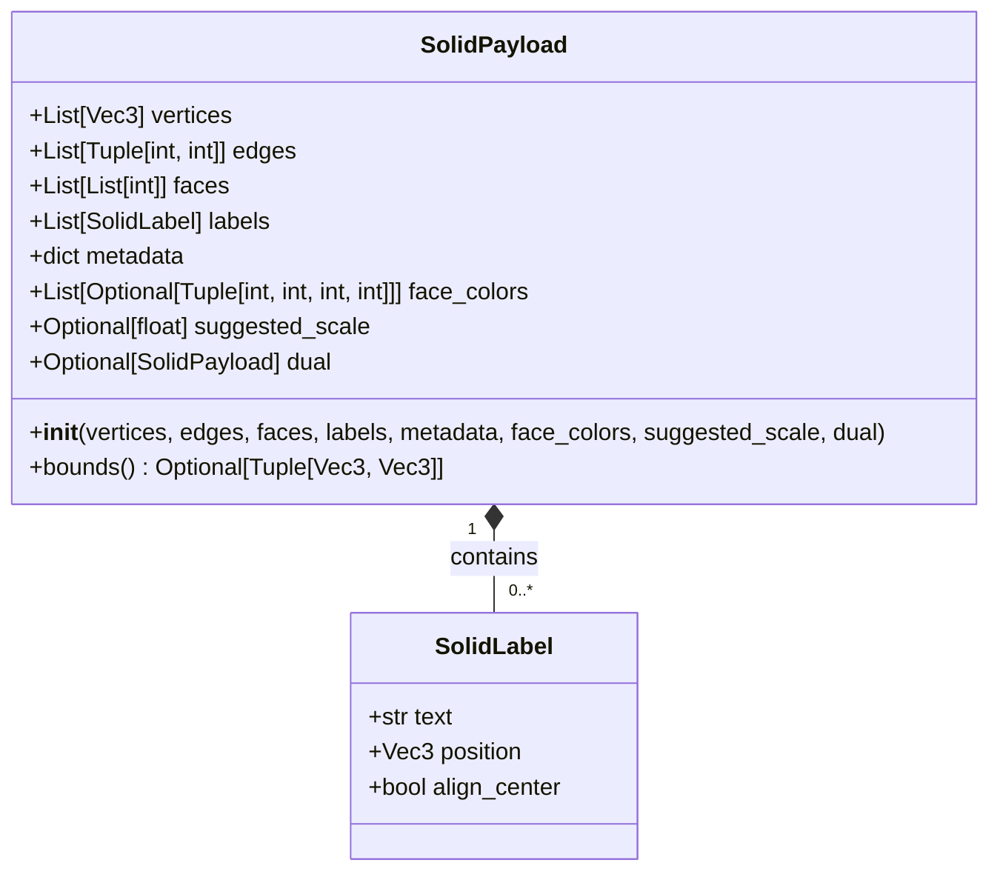
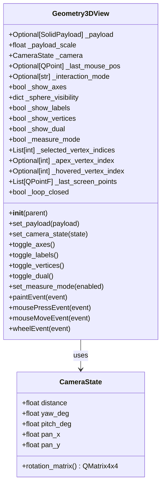
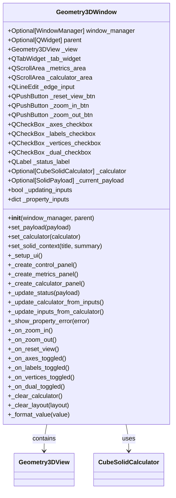
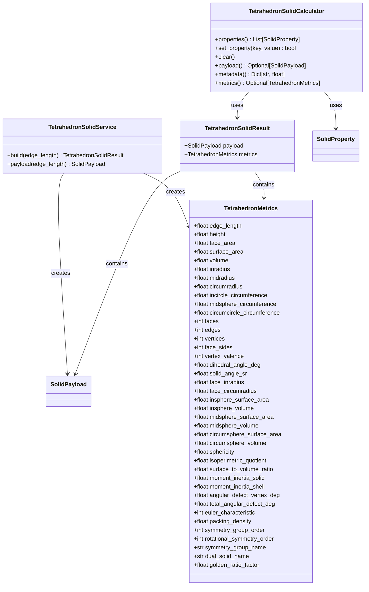
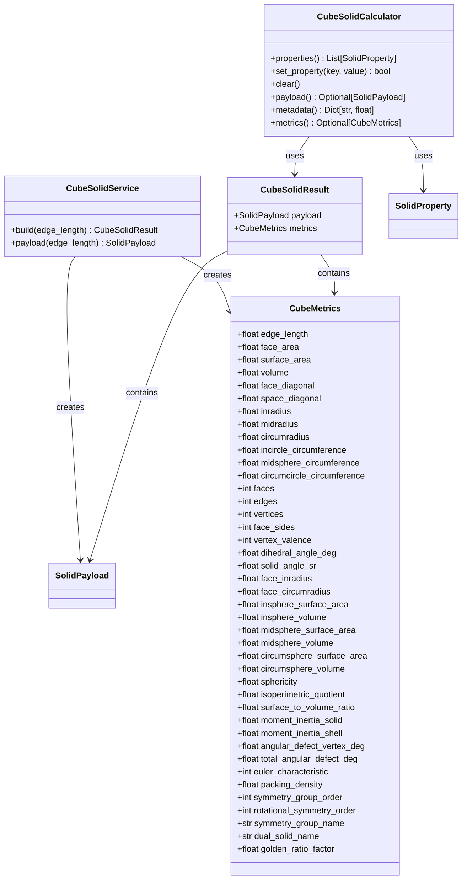
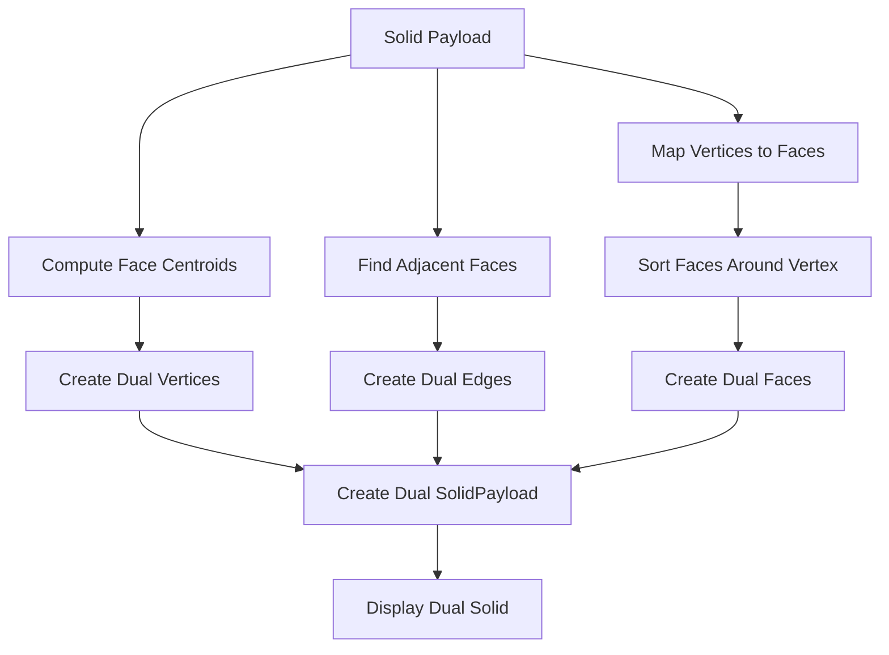
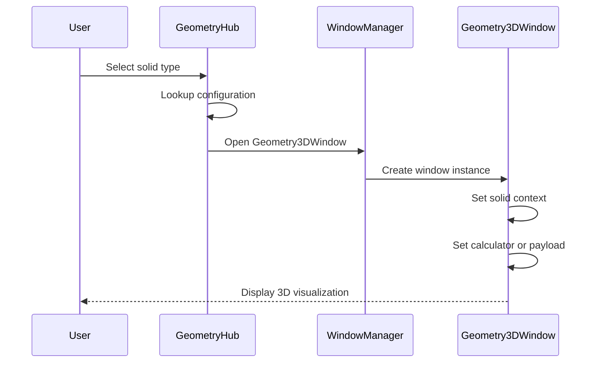
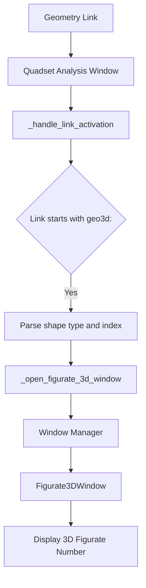

# 3D Solid Visualizations

<cite>
**Referenced Files in This Document**   
- [GEOMETRY_3D_PLAN.md](file://Docs/GEOMETRY_3D_PLAN.md)
- [geometry3d/view3d.py](file://src/pillars/geometry/ui/geometry3d/view3d.py)
- [geometry3d/window3d.py](file://src/pillars/geometry/ui/geometry3d/window3d.py)
- [solid_payload.py](file://src/shared/services/geometry/solid_payload.py)
- [tetrahedron.py](file://src/shared/services/geometry/tetrahedron.py)
- [cube.py](file://src/shared/services/geometry/cube.py)
- [geometry_hub.py](file://src/pillars/geometry/ui/geometry_hub.py)
- [geometry_definitions.py](file://src/pillars/geometry/ui/geometry_definitions.py)
- [figurate_3d_window.py](file://src/pillars/geometry/ui/figurate_3d_window.py)
- [geometric_transitions_3d_window.py](file://src/pillars/tq/ui/geometric_transitions_3d_window.py)
- [quadset_analysis_window.py](file://src/pillars/tq/ui/quadset_analysis_window.py)
</cite>

## Table of Contents
1. [Introduction](#introduction)
2. [Architecture Overview](#architecture-overview)
3. [Core Components](#core-components)
4. [3D Solid Implementations](#3d-solid-implementations)
5. [Visualization Features](#visualization-features)
6. [User Interaction](#user-interaction)
7. [Integration Points](#integration-points)
8. [Conclusion](#conclusion)

## Introduction

The 3D solid visualization system provides a comprehensive framework for rendering and interacting with three-dimensional geometric solids. This system enables users to visualize Platonic and Archimedean solids with detailed mathematical properties, wireframe rendering, and interactive controls. The implementation supports both educational and analytical use cases, allowing users to explore geometric relationships, calculate advanced metrics, and examine dual forms of polyhedra.

The visualization system is designed with modularity in mind, separating mathematical calculations from rendering logic to ensure maintainability and testability. The architecture follows a clean separation of concerns, with dedicated components for mathematical computation, data representation, and user interface rendering.

**Section sources**
- [GEOMETRY_3D_PLAN.md](file://Docs/GEOMETRY_3D_PLAN.md#L1-L65)

## Architecture Overview

The 3D visualization system follows a layered architecture that separates mathematical computation from rendering and user interface concerns. This design enables independent development and testing of mathematical algorithms while providing a flexible rendering framework.

**Diagram sources**
- [GEOMETRY_3D_PLAN.md](file://Docs/GEOMETRY_3D_PLAN.md#L9-L35)
- [geometry3d/window3d.py](file://src/pillars/geometry/ui/geometry3d/window3d.py#L31-L753)
- [geometry3d/view3d.py](file://src/pillars/geometry/ui/geometry3d/view3d.py#L58-L92)

The architecture consists of four main components:

1. **Geometry Hub**: The central controller that manages the creation and display of 3D visualizations, serving as the entry point for users to access different solid types.

2. **Solid Shape Services**: Mathematical engines that compute the geometric properties and vertex positions for each solid type, implemented as pure Python functions for easy testing.

3. **SolidPayload Adapter**: The data contract between mathematical services and the visualization layer, containing vertices, edges, faces, labels, and metadata.

4. **Geometry3DWindow and View**: The user interface components that render the 3D scene and handle user interactions, including camera controls and measurement tools.

This separation ensures that mathematical calculations can be unit-tested independently of the GUI framework, while the visualization components can be developed and refined without affecting the underlying geometry algorithms.

**Section sources**
- [GEOMETRY_3D_PLAN.md](file://Docs/GEOMETRY_3D_PLAN.md#L9-L35)
- [geometry3d/window3d.py](file://src/pillars/geometry/ui/geometry3d/window3d.py#L31-L753)

## Core Components

The 3D visualization system is built around several core components that work together to provide a seamless user experience. These components include the data model, rendering engine, and user interface controls.

### SolidPayload Data Model

The `SolidPayload` class serves as the central data structure for representing 3D solids. It contains all the necessary information to render a solid and display its properties.

**Diagram sources**
- [solid_payload.py](file://src/shared/services/geometry/solid_payload.py#L25-L87)

The `SolidPayload` class includes:

- **Vertices**: A list of 3D coordinates (x, y, z) that define the corners of the solid
- **Edges**: A list of vertex index pairs that define the lines connecting vertices
- **Faces**: A list of vertex index sequences that define the polygonal faces
- **Labels**: Text annotations positioned in 3D space
- **Metadata**: Key-value pairs containing calculated properties like surface area and volume
- **Face Colors**: Optional color definitions for individual faces
- **Suggested Scale**: A hint for appropriate rendering scale
- **Dual**: A reference to the dual solid's payload for visualization

This data structure serves as the contract between the mathematical computation layer and the rendering layer, ensuring consistent data exchange.

### Geometry3DView Rendering Engine

The `Geometry3DView` widget is responsible for rendering 3D solids using orthographic projection. It handles camera controls, wireframe rendering, and user interaction.

**Diagram sources**
- [geometry3d/view3d.py](file://src/pillars/geometry/ui/geometry3d/view3d.py#L58-L92)

The rendering engine supports orthographic projection with camera controls for rotation (yaw and pitch), panning, and zooming. It renders wireframe primitives with configurable colors and handles user interactions through mouse events.

### Geometry3DWindow Interface

The `Geometry3DWindow` class provides a complete user interface for 3D solid visualization, combining the rendering view with control panels and property displays.

**Diagram sources**
- [geometry3d/window3d.py](file://src/pillars/geometry/ui/geometry3d/window3d.py#L31-L753)

The window provides a comprehensive interface with:

- A main 3D view area for solid visualization
- Control buttons for zoom and reset operations
- Checkboxes to toggle display elements (axes, labels, vertices, dual)
- Tabbed panels for metrics and calculator views
- Status display for current solid information
- Integration with mathematical calculators for bidirectional property editing

**Section sources**
- [geometry3d/view3d.py](file://src/pillars/geometry/ui/geometry3d/view3d.py#L58-L92)
- [geometry3d/window3d.py](file://src/pillars/geometry/ui/geometry3d/window3d.py#L31-L753)
- [solid_payload.py](file://src/shared/services/geometry/solid_payload.py#L25-L87)

## 3D Solid Implementations

The system implements several Platonic solids with comprehensive mathematical properties and visualization capabilities. Each solid type is implemented as a service class that computes geometric properties and generates the corresponding payload.

### Tetrahedron Implementation

The tetrahedron is implemented as an equilateral triangular pyramid with four faces, six edges, and four vertices. The implementation provides comprehensive mathematical properties and bidirectional calculation capabilities.

**Diagram sources**
- [tetrahedron.py](file://src/shared/services/geometry/tetrahedron.py#L111-L564)

The tetrahedron implementation includes:

- **Canonical Coordinates**: Base vertices centered at the origin with edge length 2√2
- **Comprehensive Metrics**: Surface area, volume, inradius, midradius, circumradius, and advanced properties
- **Bidirectional Calculator**: Allows editing any property and recalculating all others
- **Dual Form**: Automatically generates the dual octahedron for visualization
- **Quality Metrics**: Sphericity, isoperimetric quotient, and surface-to-volume ratio

The implementation uses a base scale for calculations and applies scaling factors to generate solids of any size while maintaining geometric accuracy.

### Cube Implementation

The cube is implemented as a regular hexahedron with eight vertices, twelve edges, and six square faces. Like the tetrahedron, it provides comprehensive mathematical properties and visualization features.

**Diagram sources**
- [cube.py](file://src/shared/services/geometry/cube.py#L127-L618)

The cube implementation includes:

- **Base Vertices**: Eight vertices defined at (±1, ±1, ±1) with appropriate scaling
- **Face Definitions**: Six square faces with proper vertex ordering
- **Edge Calculation**: Automatic generation of edges from face definitions
- **Comprehensive Metrics**: All standard and advanced geometric properties
- **Dual Form**: Automatically generates the dual octahedron
- **Bidirectional Calculator**: Supports editing any property with automatic recalculation

The implementation uses helper functions to compute scaled values based on the edge length, ensuring accurate geometric relationships across different sizes.

### Other Platonic Solids

In addition to the tetrahedron and cube, the system implements other Platonic solids including the octahedron, dodecahedron, and icosahedron. These solids follow the same architectural pattern with dedicated service classes, metrics dataclasses, and calculator implementations.

The system also supports Archimedean solids and various figurate numbers, providing a comprehensive library of 3D geometric forms. Each solid type is accessible through the geometry hub interface, allowing users to explore different geometric relationships and properties.

**Section sources**
- [tetrahedron.py](file://src/shared/services/geometry/tetrahedron.py#L111-L564)
- [cube.py](file://src/shared/services/geometry/cube.py#L127-L618)
- [geometry_definitions.py](file://src/pillars/geometry/ui/geometry_definitions.py#L785-L1005)

## Visualization Features

The 3D visualization system provides several features to enhance the user experience and facilitate geometric exploration.

### Dual Solid Visualization

One of the key features is the ability to visualize the dual of any solid. The dual is generated by computing the centroids of the original solid's faces and connecting adjacent face centroids.

**Diagram sources**
- [geometry_visuals.py](file://src/shared/services/geometry/geometry_visuals.py#L24-L163)

The dual visualization feature allows users to explore the reciprocal relationships between Platonic solids:
- Tetrahedron is self-dual
- Cube and octahedron are duals
- Dodecahedron and icosahedron are duals

This feature is particularly useful for understanding geometric symmetry and transformation properties.

### Measurement and Analysis Tools

The system includes tools for measuring distances, areas, and volumes in 3D space. Users can select vertices to calculate various geometric properties.

The measurement system supports:
- Distance between two points in 3D space
- Area of polygonal faces
- Volume of the solid
- Angles between edges and faces
- Radii of inscribed and circumscribed spheres

These measurements are calculated using vector mathematics and are displayed in the interface for user reference.

### Quality and Advanced Metrics

The visualization system calculates and displays advanced geometric metrics that provide insight into the properties of each solid:

- **Sphericity**: Measures how closely the solid approximates a sphere
- **Isoperimetric Quotient**: Relates surface area to volume
- **Surface-to-Volume Ratio**: Important for physical applications
- **Moment of Inertia**: Physics properties for rotational dynamics
- **Angular Defect**: Topological property related to curvature
- **Packing Density**: How efficiently the solid fills space

These metrics are valuable for both mathematical analysis and practical applications in physics and engineering.

**Section sources**
- [geometry_visuals.py](file://src/shared/services/geometry/geometry_visuals.py#L24-L163)
- [tetrahedron.py](file://src/shared/services/geometry/tetrahedron.py#L111-L564)
- [cube.py](file://src/shared/services/geometry/cube.py#L127-L618)

## User Interaction

The 3D visualization system provides intuitive user interaction through mouse and keyboard controls.

### Camera Controls

Users can manipulate the camera to view solids from different angles:

- **Rotation**: Left mouse drag rotates the view around the center
- **Panning**: Middle mouse drag or Shift+left drag moves the view
- **Zoom**: Mouse wheel zooms in and out
- **Reset**: Button returns to default view

The camera uses orthographic projection to maintain consistent scaling regardless of distance, which is ideal for geometric analysis.

### Display Toggle Controls

Users can customize the visualization by toggling various display elements:

- **Axes**: Show or hide coordinate axes
- **Labels**: Show or hide text labels
- **Vertices**: Show or hide vertex markers
- **Dual**: Show or hide the dual solid
- **Measurement Mode**: Enable vertex selection for measurements

These controls allow users to focus on specific aspects of the geometry without visual clutter.

### Property Editing

The system includes a bidirectional calculator that allows users to edit any geometric property and see the solid update accordingly. When a user changes a property like volume or surface area, the system recalculates the edge length and updates the visualization.

This feature supports exploratory learning, allowing users to understand how changing one property affects all other properties of the solid.

**Section sources**
- [geometry3d/view3d.py](file://src/pillars/geometry/ui/geometry3d/view3d.py#L58-L92)
- [geometry3d/window3d.py](file://src/pillars/geometry/ui/geometry3d/window3d.py#L31-L753)

## Integration Points

The 3D visualization system integrates with various components throughout the application.

### Geometry Hub Integration

The primary entry point for 3D visualizations is through the Geometry Hub, which provides access to different solid types.

**Diagram sources**
- [geometry_hub.py](file://src/pillars/geometry/ui/geometry_hub.py#L388-L421)

The hub uses configuration data to determine which calculator or payload to use for each solid type, providing a consistent interface across different geometric forms.

### Figurate Number Visualization

The system integrates with figurate number visualizations, allowing users to explore 3D number patterns.

**Diagram sources**
- [quadset_analysis_window.py](file://src/pillars/tq/ui/quadset_analysis_window.py#L871-L900)
- [figurate_3d_window.py](file://src/pillars/geometry/ui/figurate_3d_window.py#L44-L69)

This integration allows users to visualize mathematical sequences as 3D geometric arrangements, connecting number theory with spatial geometry.

### Geometric Transitions

The system supports visualization of geometric transitions between different solid forms, particularly for Platonic solids.

The `GeometricTransitions3DWindow` provides an interactive interface for exploring how one solid can transform into another, highlighting the geometric relationships and symmetries between different forms.

**Section sources**
- [geometry_hub.py](file://src/pillars/geometry/ui/geometry_hub.py#L388-L421)
- [quadset_analysis_window.py](file://src/pillars/tq/ui/quadset_analysis_window.py#L871-L900)
- [figurate_3d_window.py](file://src/pillars/geometry/ui/figurate_3d_window.py#L44-L69)
- [geometric_transitions_3d_window.py](file://src/pillars/tq/ui/geometric_transitions_3d_window.py#L313-L333)

## Conclusion

The 3D solid visualization system provides a comprehensive framework for exploring geometric solids with mathematical precision and interactive capabilities. By separating mathematical computation from rendering and user interface concerns, the system achieves a clean architecture that is both maintainable and extensible.

Key strengths of the system include:
- Modular design with clear separation of concerns
- Comprehensive mathematical properties for each solid
- Interactive visualization with camera controls
- Dual solid generation and display
- Bidirectional property editing
- Integration with broader mathematical concepts

The system serves as an educational tool for understanding geometric relationships and as an analytical tool for exploring advanced mathematical properties. Its extensible architecture allows for the addition of new solid types and visualization features, making it a valuable component of the overall application.