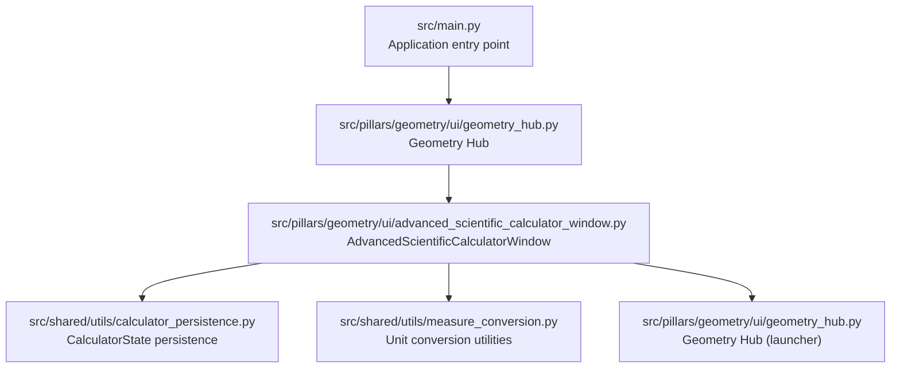
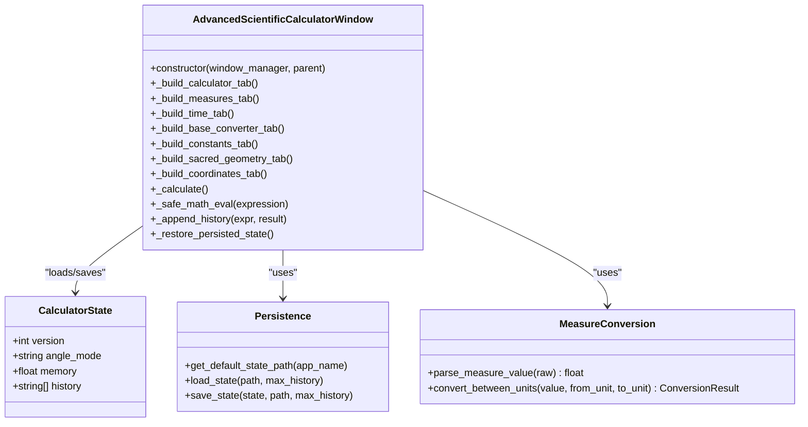
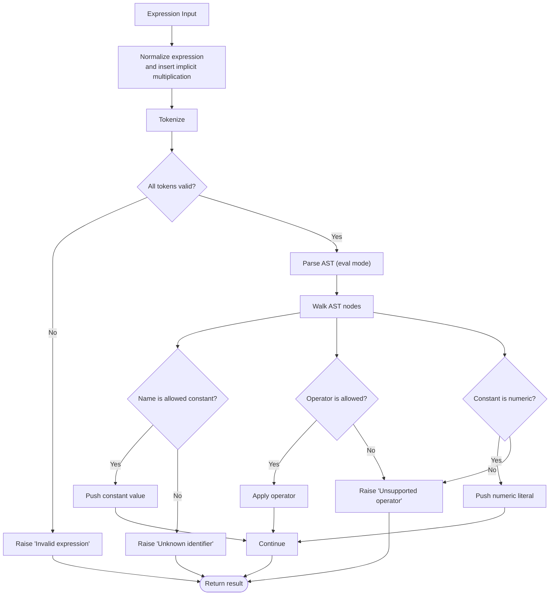
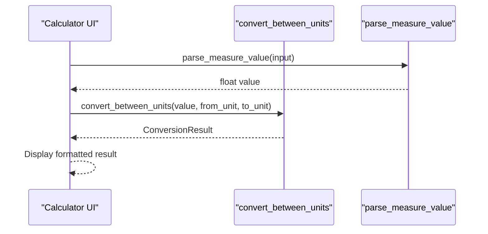
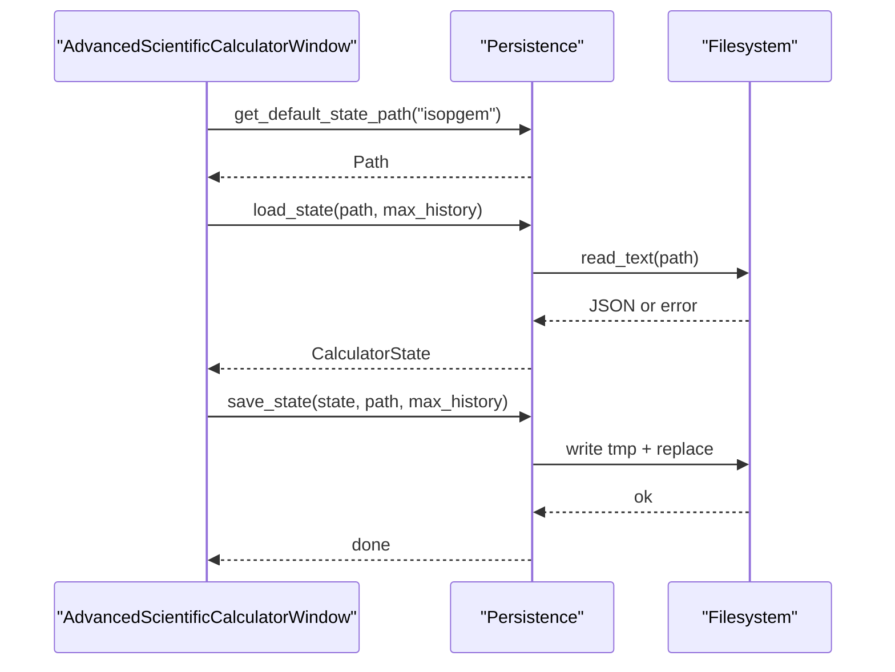
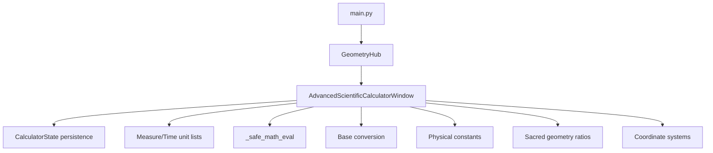

# Advanced Scientific Calculator

<cite>
**Referenced Files in This Document**
- [advanced_scientific_calculator_window.py](file://src/pillars/geometry/ui/advanced_scientific_calculator_window.py)
- [calculator_persistence.py](file://src/shared/utils/calculator_persistence.py)
- [measure_conversion.py](file://src/shared/utils/measure_conversion.py)
- [geometry_hub.py](file://src/pillars/geometry/ui/geometry_hub.py)
</cite>

## Update Summary
**Changes Made**
- Updated Introduction to reflect new tabs: Base Converter, Constants, Sacred Geometry, and Coordinates
- Added new sections for the Constants, Sacred Geometry, and Coordinates tabs
- Updated Core Components to include new capabilities
- Updated Detailed Component Analysis with new tab descriptions
- Added new architecture diagram for the expanded calculator
- Updated section and diagram sources throughout

**New Sections Added**
- Constants tab analysis
- Sacred Geometry tab analysis
- Coordinates tab analysis

**Deprecated/Removed Sections**
- None

## Table of Contents
1. [Introduction](#introduction)
2. [Project Structure](#project-structure)
3. [Core Components](#core-components)
4. [Architecture Overview](#architecture-overview)
5. [Detailed Component Analysis](#detailed-component-analysis)
6. [Dependency Analysis](#dependency-analysis)
7. [Performance Considerations](#performance-considerations)
8. [Troubleshooting Guide](#troubleshooting-guide)
9. [Conclusion](#conclusion)

## Introduction
This document describes the Advanced Scientific Calculator, a lightweight scientific calculator integrated into the Geometry pillar of the IsopGem application. It provides:
- A safe, constrained expression evaluator for math operations
- Built-in constants and functions suitable for scientific and esoteric calculations
- Conversion between historical and modern units of length, mass, and volume
- Conversion between time units spanning modern SI to astronomical and ancient cycles
- 100+ physical, astronomical, and mathematical constants
- Sacred geometry ratios and Platonic solids relationships
- Angle format conversion and celestial coordinate systems
- Base converter for integers across bases 2–36
- Persistent state across sessions (angle mode, memory, and history)

The calculator is implemented as a dedicated window embedded within the Geometry hub and is designed to be fast, secure, and easy to use for researchers and practitioners who need quick math support alongside geometry and esoteric tools.

**Section sources**
- [README.md](file://README.md#L1-L121)
- [main.py](file://src/main.py#L300-L331)
- [geometry_hub.py](file://src/pillars/geometry/ui/geometry_hub.py#L1-L60)

## Project Structure
The calculator lives under the Geometry pillar’s UI layer and integrates with shared utilities for persistence and unit conversion. The main application initializes the Geometry hub, which exposes the calculator window.

**Diagram sources**
- [main.py](file://src/main.py#L300-L331)
- [geometry_hub.py](file://src/pillars/geometry/ui/geometry_hub.py#L1-L60)
- [advanced_scientific_calculator_window.py](file://src/pillars/geometry/ui/advanced_scientific_calculator_window.py#L729-L766)
- [calculator_persistence.py](file://src/shared/utils/calculator_persistence.py#L1-L123)
- [measure_conversion.py](file://src/shared/utils/measure_conversion.py#L1-L81)

**Section sources**
- [README.md](file://README.md#L1-L121)
- [main.py](file://src/main.py#L300-L331)
- [geometry_hub.py](file://src/pillars/geometry/ui/geometry_hub.py#L1-L60)

## Core Components
- AdvancedScientificCalculatorWindow: The calculator UI and logic, including the safe evaluator, tabs for measures/time/constants/sacred geometry/coordinates, and base conversion.
- CalculatorState and persistence: Loads and saves calculator state (angle mode, memory, history) to a JSON file.
- Unit conversion utilities: Parse human-friendly numbers and convert between units using shared SI factors.

Key capabilities:
- Safe expression evaluation with explicit allowlists for functions and constants
- Trigonometric functions with degree/radian modes and helper conversions
- Postfix factorial and implicit multiplication
- Rich unit sets for length, mass, volume, and time
- 100+ physical, astronomical, and mathematical constants
- Sacred geometry ratios and Platonic solids relationships
- Angle format conversion and celestial coordinate systems
- Base conversion across 2–36

**Section sources**
- [advanced_scientific_calculator_window.py](file://src/pillars/geometry/ui/advanced_scientific_calculator_window.py#L729-L766)
- [advanced_scientific_calculator_window.py](file://src/pillars/geometry/ui/advanced_scientific_calculator_window.py#L1563-L1587)
- [advanced_scientific_calculator_window.py](file://src/pillars/geometry/ui/advanced_scientific_calculator_window.py#L1615-L1650)
- [advanced_scientific_calculator_window.py](file://src/pillars/geometry/ui/advanced_scientific_calculator_window.py#L1696-L1719)
- [advanced_scientific_calculator_window.py](file://src/pillars/geometry/ui/advanced_scientific_calculator_window.py#L1721-L1835)
- [advanced_scientific_calculator_window.py](file://src/pillars/geometry/ui/advanced_scientific_calculator_window.py#L1837-L1944)
- [calculator_persistence.py](file://src/shared/utils/calculator_persistence.py#L1-L123)
- [measure_conversion.py](file://src/shared/utils/measure_conversion.py#L1-L81)

## Architecture Overview
The calculator is a standalone window launched from the Geometry hub. It persists state via a dedicated persistence module and performs unit conversions using shared utilities.

**Diagram sources**
- [advanced_scientific_calculator_window.py](file://src/pillars/geometry/ui/advanced_scientific_calculator_window.py#L729-L766)
- [advanced_scientific_calculator_window.py](file://src/pillars/geometry/ui/advanced_scientific_calculator_window.py#L1563-L1587)
- [advanced_scientific_calculator_window.py](file://src/pillars/geometry/ui/advanced_scientific_calculator_window.py#L1615-L1650)
- [calculator_persistence.py](file://src/shared/utils/calculator_persistence.py#L1-L123)
- [measure_conversion.py](file://src/shared/utils/measure_conversion.py#L1-L81)

## Detailed Component Analysis

### Calculator UI and Tabs
The calculator window is a tabbed interface with:
- Calculator tab: Buttons for functions, constants, operators, and memory/answer helpers
- Ancient Measures tab: Length, mass, and volume conversions using historical units
- Time Units tab: Conversion across SI, astronomical, historical, and ancient time scales
- Base Converter tab: Integer conversion across bases 2–36
- Constants tab: 100+ physical, astronomical, and mathematical constants
- Sacred Geometry tab: Sacred ratios, Platonic solids relationships, and geometric constants
- Coordinates tab: Angle format conversion and celestial coordinate systems reference

It maintains internal state for angle mode (RAD/DEG), memory, and last answer, and persists history and settings.

**Section sources**
- [advanced_scientific_calculator_window.py](file://src/pillars/geometry/ui/advanced_scientific_calculator_window.py#L729-L766)
- [advanced_scientific_calculator_window.py](file://src/pillars/geometry/ui/advanced_scientific_calculator_window.py#L1422-L1447)
- [advanced_scientific_calculator_window.py](file://src/pillars/geometry/ui/advanced_scientific_calculator_window.py#L1448-L1465)
- [advanced_scientific_calculator_window.py](file://src/pillars/geometry/ui/advanced_scientific_calculator_window.py#L1466-L1483)
- [advanced_scientific_calculator_window.py](file://src/pillars/geometry/ui/advanced_scientific_calculator_window.py#L1484-L1501)
- [advanced_scientific_calculator_window.py](file://src/pillars/geometry/ui/advanced_scientific_calculator_window.py#L1502-L1519)
- [advanced_scientific_calculator_window.py](file://src/pillars/geometry/ui/advanced_scientific_calculator_window.py#L1520-L1537)
- [advanced_scientific_calculator_window.py](file://src/pillars/geometry/ui/advanced_scientific_calculator_window.py#L1538-L1555)

### Safe Expression Evaluator
The evaluator enforces a strict allowlist of functions and constants, inserts implicit multiplication, normalizes expressions, and uses AST parsing to reject unsafe constructs. It supports:
- Functions: sin, cos, tan, asin, acos, atan, sqrt, log, log10, exp, floor, ceil, pow, factorial, gcd, lcm, abs, round, min, max, deg, rad
- Constants: pi, e, tau, ans, mem
- Operators: +, −, *, /, %, **, unary plus/minus
- Postfix factorial and implicit multiplication

**Diagram sources**
- [advanced_scientific_calculator_window.py](file://src/pillars/geometry/ui/advanced_scientific_calculator_window.py#L1696-L1719)
- [advanced_scientific_calculator_window.py](file://src/pillars/geometry/ui/advanced_scientific_calculator_window.py#L1721-L1835)
- [advanced_scientific_calculator_window.py](file://src/pillars/geometry/ui/advanced_scientific_calculator_window.py#L1837-L1944)

**Section sources**
- [advanced_scientific_calculator_window.py](file://src/pillars/geometry/ui/advanced_scientific_calculator_window.py#L1615-L1650)
- [advanced_scientific_calculator_window.py](file://src/pillars/geometry/ui/advanced_scientific_calculator_window.py#L1696-L1719)
- [advanced_scientific_calculator_window.py](file://src/pillars/geometry/ui/advanced_scientific_calculator_window.py#L1721-L1835)
- [advanced_scientific_calculator_window.py](file://src/pillars/geometry/ui/advanced_scientific_calculator_window.py#L1837-L1944)
- [test_safe_math_eval.py](file://tests/test_safe_math_eval.py#L1-L185)

### Unit Conversion Utilities
The calculator defines extensive unit lists and uses a shared conversion routine:
- MEASURE_UNITS: Length, mass, and volume with SI equivalents
- TIME_UNITS: SI, astronomical, historical, and ancient time scales
- ConversionResult: standardized result with input value, names, base unit, and converted value
- parse_measure_value: supports integers, decimals, commas, and simple fractions

**Diagram sources**
- [advanced_scientific_calculator_window.py](file://src/pillars/geometry/ui/advanced_scientific_calculator_window.py#L52-L112)
- [advanced_scientific_calculator_window.py](file://src/pillars/geometry/ui/advanced_scientific_calculator_window.py#L115-L577)
- [measure_conversion.py](file://src/shared/utils/measure_conversion.py#L1-L81)

**Section sources**
- [advanced_scientific_calculator_window.py](file://src/pillars/geometry/ui/advanced_scientific_calculator_window.py#L52-L112)
- [advanced_scientific_calculator_window.py](file://src/pillars/geometry/ui/advanced_scientific_calculator_window.py#L115-L577)
- [measure_conversion.py](file://src/shared/utils/measure_conversion.py#L1-L81)

### Persistence and State Management
CalculatorState captures angle mode, memory, and history. The persistence module:
- Defines default state and coerces values safely
- Loads from JSON with robust error handling
- Saves atomically via temporary file replacement

**Diagram sources**
- [calculator_persistence.py](file://src/shared/utils/calculator_persistence.py#L1-L123)
- [advanced_scientific_calculator_window.py](file://src/pillars/geometry/ui/advanced_scientific_calculator_window.py#L729-L766)

**Section sources**
- [calculator_persistence.py](file://src/shared/utils/calculator_persistence.py#L1-L123)
- [advanced_scientific_calculator_window.py](file://src/pillars/geometry/ui/advanced_scientific_calculator_window.py#L729-L766)

### Base Conversion
The calculator supports integer conversion across bases 2–36 using a predefined digit set. The UI provides a base converter tab for interactive conversion.

**Section sources**
- [advanced_scientific_calculator_window.py](file://src/pillars/geometry/ui/advanced_scientific_calculator_window.py#L725-L727)
- [advanced_scientific_calculator_window.py](file://src/pillars/geometry/ui/advanced_scientific_calculator_window.py#L756-L766)

### Constants Tab
The Constants tab provides access to over 100 physical, astronomical, and mathematical constants organized into categories:
- Fundamental constants (speed of light, Planck constant, gravitational constant)
- Atomic and particle physics constants
- Thermodynamic constants
- Astronomical constants (astronomical unit, solar mass, Earth radius)
- Planck units
- Chemistry constants
- Mathematical constants (pi, e, golden ratio)

Users can filter constants by category or search by name/symbol, view detailed information including value, units, and notes, and copy values or insert them directly into the calculator.

**Section sources**
- [advanced_scientific_calculator_window.py](file://src/pillars/geometry/ui/advanced_scientific_calculator_window.py#L1386-L1588)

### Sacred Geometry Tab
The Sacred Geometry tab provides access to sacred ratios, geometric constants, and Platonic solids relationships:
- Primary sacred ratios (golden ratio, silver ratio, plastic number)
- Circle constants (pi, tau, pi/2, pi/3)
- Square roots and geometric means
- Vesica Piscis ratios
- Platonic solids edge-to-circumradius ratios
- Pentagon and pentagram relationships
- Hexagon and hexagram relationships
- Fibonacci and Lucas sequences
- Ancient Egyptian and other historical ratios

The tab includes a Fibonacci calculator that computes F(n) and shows the ratio approaching the golden ratio. Users can filter by category, search, view details, and copy values or insert them into the calculator.

**Section sources**
- [advanced_scientific_calculator_window.py](file://src/pillars/geometry/ui/advanced_scientific_calculator_window.py#L1606-L1837)

### Coordinates Tab
The Coordinates tab provides angle format conversion and celestial coordinate system reference:
- Angle format conversion between decimal degrees, DMS, HMS, radians, zodiacal notation, turns, and gradians
- Support for various input formats (45.5, 45°30'0", 12h30m, 15♈23)
- Reference for celestial coordinate systems:
  - Equatorial (RA/Dec)
  - Horizontal (Alt/Az)
  - Ecliptic
  - Galactic
  - Supergalactic
  - Hour Angle

Users can input an angle in any format and see conversions to all other formats, and explore coordinate system details including coordinate names, units, and descriptions.

**Section sources**
- [advanced_scientific_calculator_window.py](file://src/pillars/geometry/ui/advanced_scientific_calculator_window.py#L1854-L2152)

## Dependency Analysis
The calculator depends on:
- Shared persistence utilities for state management
- Shared measure conversion utilities for unit conversions
- Geometry hub for launching the calculator window

**Diagram sources**
- [advanced_scientific_calculator_window.py](file://src/pillars/geometry/ui/advanced_scientific_calculator_window.py#L729-L766)
- [geometry_hub.py](file://src/pillars/geometry/ui/geometry_hub.py#L1-L60)
- [main.py](file://src/main.py#L300-L331)

**Section sources**
- [geometry_hub.py](file://src/pillars/geometry/ui/geometry_hub.py#L1-L60)
- [main.py](file://src/main.py#L300-L331)

## Performance Considerations
- Expression evaluation uses AST parsing and a small, explicit allowlist, minimizing overhead and avoiding dynamic code execution risks.
- Unit conversion is O(1) per conversion using precomputed factors.
- History and state are persisted efficiently via JSON with bounded history sizes.
- UI updates are lightweight; avoid excessive re-parsing by batching input changes where appropriate.
- Constant lookups use dictionary access for O(1) performance.
- Angle format conversions use direct mathematical operations without iteration.

[No sources needed since this section provides general guidance]

## Troubleshooting Guide
Common issues and resolutions:
- Syntax errors in expressions: The evaluator raises a clear error for invalid expressions. Use the smart backspace helper to remove tokens cleanly.
- Domain errors (e.g., sqrt of negative): These raise ValueError; handle gracefully by displaying "Math Error".
- Unsafe constructs: Expressions attempting to access globals or unsupported operators are rejected.
- Unit conversion failures: Ensure units are valid and have non-zero conversion factors.
- Base conversion errors: Check that input digits are valid for the selected base.
- Angle parsing failures: Verify the input format matches the selected format (decimal, DMS, HMS, radians, zodiacal).

Validation and behavior are covered by tests for the evaluator and smart backspace.

**Section sources**
- [advanced_scientific_calculator_window.py](file://src/pillars/geometry/ui/advanced_scientific_calculator_window.py#L1563-L1587)
- [advanced_scientific_calculator_window.py](file://src/pillars/geometry/ui/advanced_scientific_calculator_window.py#L1945-L1994)
- [test_safe_math_eval.py](file://tests/test_safe_math_eval.py#L1-L185)

## Conclusion
The Advanced Scientific Calculator is a secure, extensible, and user-friendly tool embedded in the Geometry hub. It combines a safe evaluator, rich unit sets, comprehensive constants, sacred geometry ratios, celestial coordinate systems, and base conversion with persistent state management. Its modular design and strong safety guarantees make it suitable for both everyday calculations and esoteric research tasks.

[No sources needed since this section summarizes without analyzing specific files]