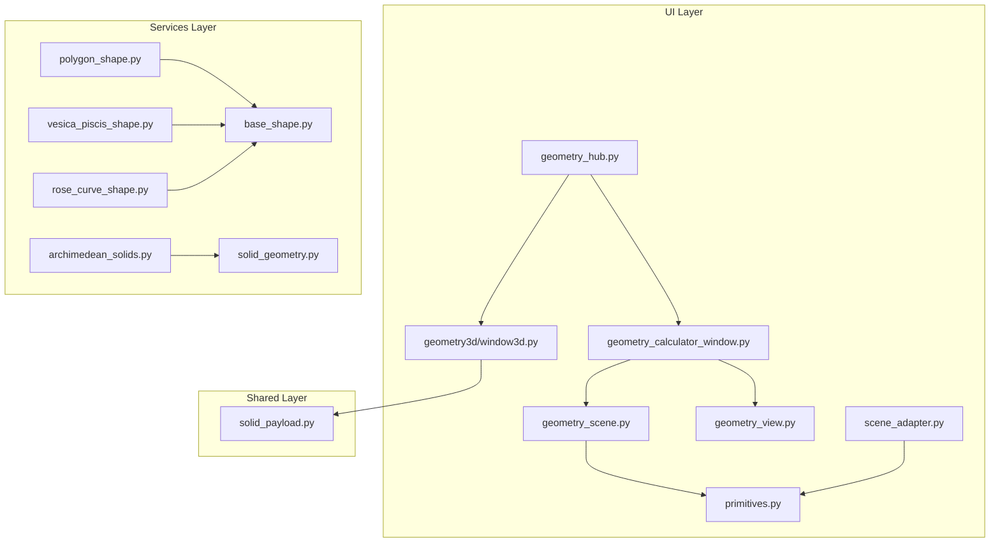
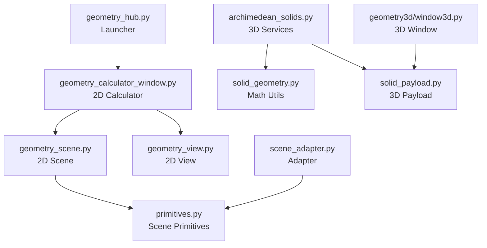
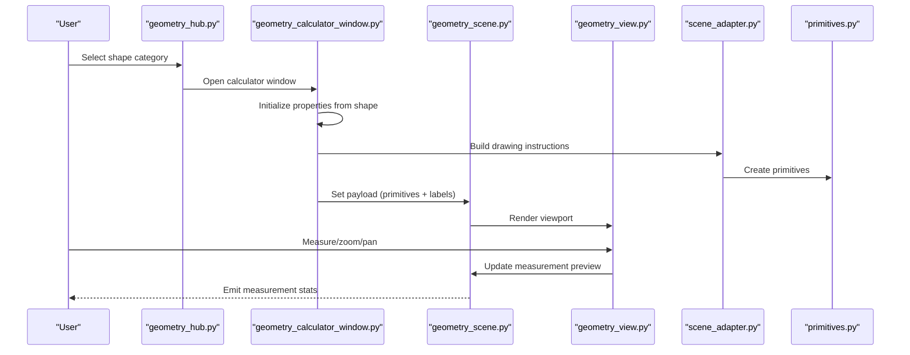
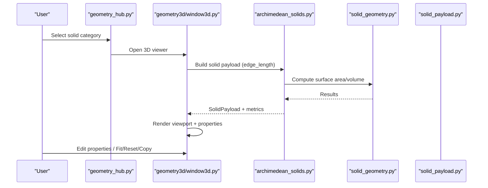
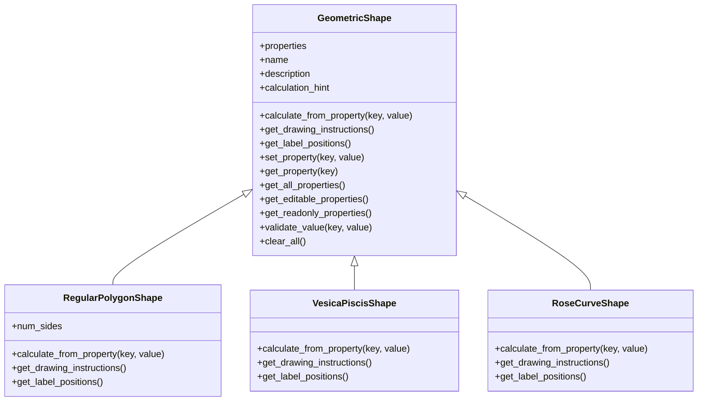
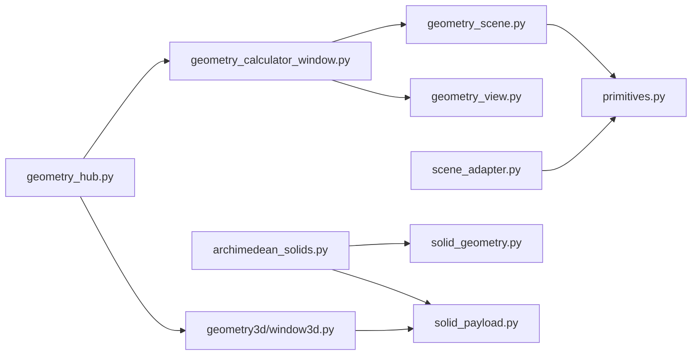

# Geometry Pillar

<cite>
**Referenced Files in This Document**
- [geometry_hub.py](file://src/pillars/geometry/ui/geometry_hub.py)
- [geometry_scene.py](file://src/pillars/geometry/ui/geometry_scene.py)
- [geometry_view.py](file://src/pillars/geometry/ui/geometry_view.py)
- [scene_adapter.py](file://src/pillars/geometry/ui/scene_adapter.py)
- [primitives.py](file://src/pillars/geometry/ui/primitives.py)
- [solid_geometry.py](file://src/pillars/geometry/services/solid_geometry.py)
- [archimedean_solids.py](file://src/pillars/geometry/services/archimedean_solids.py)
- [polygon_shape.py](file://src/pillars/geometry/services/polygon_shape.py)
- [base_shape.py](file://src/pillars/geometry/services/base_shape.py)
- [vesica_piscis_shape.py](file://src/pillars/geometry/services/vesica_piscis_shape.py)
- [rose_curve_shape.py](file://src/pillars/geometry/services/rose_curve_shape.py)
- [solid_payload.py](file://src/pillars/geometry/shared/solid_payload.py)
- [window3d.py](file://src/pillars/geometry/ui/geometry3d/window3d.py)
- [geometry_calculator_window.py](file://src/pillars/geometry/ui/geometry_calculator_window.py)
</cite>

## Table of Contents
1. [Introduction](#introduction)
2. [Project Structure](#project-structure)
3. [Core Components](#core-components)
4. [Architecture Overview](#architecture-overview)
5. [Detailed Component Analysis](#detailed-component-analysis)
6. [Dependency Analysis](#dependency-analysis)
7. [Performance Considerations](#performance-considerations)
8. [Troubleshooting Guide](#troubleshooting-guide)
9. [Conclusion](#conclusion)

## Introduction
The Geometry pillar is a comprehensive sacred geometry engine that supports both 2D shape calculations and 3D solid visualizations. It provides:
- A central UI hub to launch calculators and viewers
- A unified 2D visualization pipeline with interactive measurement and labeling
- A 3D visualization pipeline for Platonic and Archimedean solids and other sacred forms
- Shared primitives and adapters to bridge legacy drawing formats and modern 3D payloads
- Specialized calculators for polygons, vesica piscis, rose curves, and more

Users can interact with geometric calculators, switch between 2D and 3D representations, and leverage shared primitives to compute and display geometric properties consistently.

## Project Structure
The Geometry pillar is organized into three primary layers:
- UI Layer: Central hub, calculators, 2D/3D views, and adapters
- Services Layer: Shape calculators and solid geometry utilities
- Shared Layer: Payloads and primitives used across 2D and 3D paths

**Diagram sources**
- [geometry_hub.py](file://src/pillars/geometry/ui/geometry_hub.py#L1-L200)
- [geometry_calculator_window.py](file://src/pillars/geometry/ui/geometry_calculator_window.py#L1-L120)
- [geometry_scene.py](file://src/pillars/geometry/ui/geometry_scene.py#L1-L120)
- [geometry_view.py](file://src/pillars/geometry/ui/geometry_view.py#L1-L80)
- [scene_adapter.py](file://src/pillars/geometry/ui/scene_adapter.py#L1-L60)
- [primitives.py](file://src/pillars/geometry/ui/primitives.py#L1-L60)
- [archimedean_solids.py](file://src/pillars/geometry/services/archimedean_solids.py#L1-L60)
- [solid_geometry.py](file://src/pillars/geometry/services/solid_geometry.py#L1-L60)
- [polygon_shape.py](file://src/pillars/geometry/services/polygon_shape.py#L1-L60)
- [base_shape.py](file://src/pillars/geometry/services/base_shape.py#L1-L60)
- [vesica_piscis_shape.py](file://src/pillars/geometry/services/vesica_piscis_shape.py#L1-L60)
- [rose_curve_shape.py](file://src/pillars/geometry/services/rose_curve_shape.py#L1-L60)
- [solid_payload.py](file://src/pillars/geometry/shared/solid_payload.py#L1-L40)
- [window3d.py](file://src/pillars/geometry/ui/geometry3d/window3d.py#L1-L80)

**Section sources**
- [geometry_hub.py](file://src/pillars/geometry/ui/geometry_hub.py#L1-L200)
- [geometry_calculator_window.py](file://src/pillars/geometry/ui/geometry_calculator_window.py#L1-L120)
- [geometry_scene.py](file://src/pillars/geometry/ui/geometry_scene.py#L1-L120)
- [geometry_view.py](file://src/pillars/geometry/ui/geometry_view.py#L1-L80)
- [scene_adapter.py](file://src/pillars/geometry/ui/scene_adapter.py#L1-L60)
- [primitives.py](file://src/pillars/geometry/ui/primitives.py#L1-L60)
- [archimedean_solids.py](file://src/pillars/geometry/services/archimedean_solids.py#L1-L60)
- [solid_geometry.py](file://src/pillars/geometry/services/solid_geometry.py#L1-L60)
- [polygon_shape.py](file://src/pillars/geometry/services/polygon_shape.py#L1-L60)
- [base_shape.py](file://src/pillars/geometry/services/base_shape.py#L1-L60)
- [vesica_piscis_shape.py](file://src/pillars/geometry/services/vesica_piscis_shape.py#L1-L60)
- [rose_curve_shape.py](file://src/pillars/geometry/services/rose_curve_shape.py#L1-L60)
- [solid_payload.py](file://src/pillars/geometry/shared/solid_payload.py#L1-L40)
- [window3d.py](file://src/pillars/geometry/ui/geometry3d/window3d.py#L1-L80)

## Core Components
- geometry_hub: Central launcher for calculators and viewers, organizing categories of shapes and solids
- geometry_calculator_window: 3-pane calculator for 2D shapes with property inputs, viewport, and controls
- geometry_scene and geometry_view: Unified 2D rendering pipeline with measurement, labels, axes, and interactivity
- scene_adapter: Converts legacy drawing dictionaries into structured primitives for the scene
- primitives: Typed data structures for circles, polygons, lines, labels, and booleans
- archimedean_solids and solid_geometry: 3D solid services and math utilities for Platonic and Archimedean forms
- polygon_shape, vesica_piscis_shape, rose_curve_shape: Specialized calculators for polygons, vesica piscis, and rose curves
- solid_payload: Shared 3D payload structure for vertices, edges, faces, labels, and metadata
- geometry3d/window3d: 3D viewer window with property controls, camera, and output utilities

**Section sources**
- [geometry_hub.py](file://src/pillars/geometry/ui/geometry_hub.py#L1-L200)
- [geometry_calculator_window.py](file://src/pillars/geometry/ui/geometry_calculator_window.py#L1-L120)
- [geometry_scene.py](file://src/pillars/geometry/ui/geometry_scene.py#L1-L120)
- [geometry_view.py](file://src/pillars/geometry/ui/geometry_view.py#L1-L80)
- [scene_adapter.py](file://src/pillars/geometry/ui/scene_adapter.py#L1-L60)
- [primitives.py](file://src/pillars/geometry/ui/primitives.py#L1-L60)
- [archimedean_solids.py](file://src/pillars/geometry/services/archimedean_solids.py#L1-L60)
- [solid_geometry.py](file://src/pillars/geometry/services/solid_geometry.py#L1-L60)
- [polygon_shape.py](file://src/pillars/geometry/services/polygon_shape.py#L1-L60)
- [base_shape.py](file://src/pillars/geometry/services/base_shape.py#L1-L60)
- [vesica_piscis_shape.py](file://src/pillars/geometry/services/vesica_piscis_shape.py#L1-L60)
- [rose_curve_shape.py](file://src/pillars/geometry/services/rose_curve_shape.py#L1-L60)
- [solid_payload.py](file://src/pillars/geometry/shared/solid_payload.py#L1-L40)
- [window3d.py](file://src/pillars/geometry/ui/geometry3d/window3d.py#L1-L80)

## Architecture Overview
The Geometry pillar follows a layered architecture:
- UI Hub orchestrates access to calculators and 3D viewers
- 2D path: shape calculators produce drawing instructions, adapter builds primitives, scene renders with labels and measurement overlays
- 3D path: solid services compute metrics and payloads, window3d displays and allows property editing

**Diagram sources**
- [geometry_hub.py](file://src/pillars/geometry/ui/geometry_hub.py#L1-L200)
- [geometry_calculator_window.py](file://src/pillars/geometry/ui/geometry_calculator_window.py#L1-L120)
- [geometry_scene.py](file://src/pillars/geometry/ui/geometry_scene.py#L1-L120)
- [geometry_view.py](file://src/pillars/geometry/ui/geometry_view.py#L1-L80)
- [scene_adapter.py](file://src/pillars/geometry/ui/scene_adapter.py#L1-L60)
- [primitives.py](file://src/pillars/geometry/ui/primitives.py#L1-L60)
- [archimedean_solids.py](file://src/pillars/geometry/services/archimedean_solids.py#L1-L60)
- [solid_geometry.py](file://src/pillars/geometry/services/solid_geometry.py#L1-L60)
- [solid_payload.py](file://src/pillars/geometry/shared/solid_payload.py#L1-L40)
- [window3d.py](file://src/pillars/geometry/ui/geometry3d/window3d.py#L1-L80)

## Detailed Component Analysis

### Geometry Hub (Central UI Controller)
- Defines categories for circles, triangles, quadrilaterals, polygons, pyramids, prisms, antiprisms, Platonic solids, and Archimedean solids
- Provides factory entries for shape calculators and solid viewers
- Integrates with WindowManager to open calculators and 3D windows

Key responsibilities:
- Maintain category definitions and menu structures
- Open calculators and 3D viewers
- Route user selections to appropriate services

**Section sources**
- [geometry_hub.py](file://src/pillars/geometry/ui/geometry_hub.py#L1-L200)
- [geometry_hub.py](file://src/pillars/geometry/ui/geometry_hub.py#L200-L500)
- [geometry_hub.py](file://src/pillars/geometry/ui/geometry_hub.py#L500-L800)

### 2D Visualization Pipeline
- geometry_calculator_window: 3-pane layout with property inputs, viewport, and controls
- geometry_scene: Renders primitives, manages labels, axes, measurement overlays, and vertex highlights
- geometry_view: Handles zoom, pan, measurement mode, and selection
- scene_adapter: Translates legacy drawing dicts into structured primitives
- primitives: Typed dataclasses for rendering

Rendering flow:
- Shape calculators produce drawing instructions
- Adapter converts instructions to primitives
- Scene builds and renders primitives, labels, and overlays
- View provides interactive controls and measurement feedback

**Diagram sources**
- [geometry_hub.py](file://src/pillars/geometry/ui/geometry_hub.py#L1-L200)
- [geometry_calculator_window.py](file://src/pillars/geometry/ui/geometry_calculator_window.py#L1-L120)
- [geometry_scene.py](file://src/pillars/geometry/ui/geometry_scene.py#L1-L120)
- [geometry_view.py](file://src/pillars/geometry/ui/geometry_view.py#L1-L80)
- [scene_adapter.py](file://src/pillars/geometry/ui/scene_adapter.py#L1-L60)
- [primitives.py](file://src/pillars/geometry/ui/primitives.py#L1-L60)

**Section sources**
- [geometry_calculator_window.py](file://src/pillars/geometry/ui/geometry_calculator_window.py#L1-L120)
- [geometry_scene.py](file://src/pillars/geometry/ui/geometry_scene.py#L1-L120)
- [geometry_view.py](file://src/pillars/geometry/ui/geometry_view.py#L1-L80)
- [scene_adapter.py](file://src/pillars/geometry/ui/scene_adapter.py#L1-L60)
- [primitives.py](file://src/pillars/geometry/ui/primitives.py#L1-L60)

### 3D Visualization Pipeline
- archimedean_solids: Provides services and calculators for Archimedean solids
- solid_geometry: Math utilities for vectors, faces, surface area, and volume
- solid_payload: Shared 3D payload structure
- geometry3d/window3d: 3D viewer with property controls, camera, and output

Workflow:
- Solid services compute scaled vertices, edges, faces, and metrics
- Payload carries geometry and metadata
- 3D window displays geometry, allows property editing, and copies snapshots/summaries

**Diagram sources**
- [geometry_hub.py](file://src/pillars/geometry/ui/geometry_hub.py#L680-L800)
- [archimedean_solids.py](file://src/pillars/geometry/services/archimedean_solids.py#L1-L120)
- [solid_geometry.py](file://src/pillars/geometry/services/solid_geometry.py#L1-L120)
- [solid_payload.py](file://src/pillars/geometry/shared/solid_payload.py#L1-L40)
- [window3d.py](file://src/pillars/geometry/ui/geometry3d/window3d.py#L1-L120)

**Section sources**
- [archimedean_solids.py](file://src/pillars/geometry/services/archimedean_solids.py#L1-L120)
- [solid_geometry.py](file://src/pillars/geometry/services/solid_geometry.py#L1-L120)
- [solid_payload.py](file://src/pillars/geometry/shared/solid_payload.py#L1-L40)
- [window3d.py](file://src/pillars/geometry/ui/geometry3d/window3d.py#L1-L120)

### Specialized Calculators and Shared Primitives
- base_shape: Abstract base for shape calculators with property management
- polygon_shape: Regular polygon with diagonals, angles, and labeled outputs
- vesica_piscis_shape: Lens area, perimeter, and apex angle computation
- rose_curve_shape: Polar rose with petal count and total area
- primitives: Data structures for rendering
- scene_adapter: Legacy-to-primitive conversion

**Diagram sources**
- [base_shape.py](file://src/pillars/geometry/services/base_shape.py#L1-L143)
- [polygon_shape.py](file://src/pillars/geometry/services/polygon_shape.py#L1-L120)
- [vesica_piscis_shape.py](file://src/pillars/geometry/services/vesica_piscis_shape.py#L1-L120)
- [rose_curve_shape.py](file://src/pillars/geometry/services/rose_curve_shape.py#L1-L120)

**Section sources**
- [base_shape.py](file://src/pillars/geometry/services/base_shape.py#L1-L143)
- [polygon_shape.py](file://src/pillars/geometry/services/polygon_shape.py#L1-L120)
- [vesica_piscis_shape.py](file://src/pillars/geometry/services/vesica_piscis_shape.py#L1-L120)
- [rose_curve_shape.py](file://src/pillars/geometry/services/rose_curve_shape.py#L1-L120)
- [primitives.py](file://src/pillars/geometry/ui/primitives.py#L1-L120)
- [scene_adapter.py](file://src/pillars/geometry/ui/scene_adapter.py#L1-L120)

### Measurement and Interaction Flow (2D)

**Diagram sources**
- [geometry_view.py](file://src/pillars/geometry/ui/geometry_view.py#L120-L200)
- [geometry_scene.py](file://src/pillars/geometry/ui/geometry_scene.py#L200-L320)

**Section sources**
- [geometry_view.py](file://src/pillars/geometry/ui/geometry_view.py#L120-L200)
- [geometry_scene.py](file://src/pillars/geometry/ui/geometry_scene.py#L200-L320)

## Dependency Analysis
- UI Hub depends on shape and solid calculators/services
- 2D path depends on primitives and adapter
- 3D path depends on solid services and math utilities
- Both paths share common rendering abstractions

**Diagram sources**
- [geometry_hub.py](file://src/pillars/geometry/ui/geometry_hub.py#L1-L200)
- [geometry_calculator_window.py](file://src/pillars/geometry/ui/geometry_calculator_window.py#L1-L120)
- [geometry_scene.py](file://src/pillars/geometry/ui/geometry_scene.py#L1-L120)
- [geometry_view.py](file://src/pillars/geometry/ui/geometry_view.py#L1-L80)
- [scene_adapter.py](file://src/pillars/geometry/ui/scene_adapter.py#L1-L60)
- [primitives.py](file://src/pillars/geometry/ui/primitives.py#L1-L60)
- [archimedean_solids.py](file://src/pillars/geometry/services/archimedean_solids.py#L1-L60)
- [solid_geometry.py](file://src/pillars/geometry/services/solid_geometry.py#L1-L60)
- [solid_payload.py](file://src/pillars/geometry/shared/solid_payload.py#L1-L40)
- [window3d.py](file://src/pillars/geometry/ui/geometry3d/window3d.py#L1-L80)

**Section sources**
- [geometry_hub.py](file://src/pillars/geometry/ui/geometry_hub.py#L1-L200)
- [geometry_calculator_window.py](file://src/pillars/geometry/ui/geometry_calculator_window.py#L1-L120)
- [geometry_scene.py](file://src/pillars/geometry/ui/geometry_scene.py#L1-L120)
- [geometry_view.py](file://src/pillars/geometry/ui/geometry_view.py#L1-L80)
- [scene_adapter.py](file://src/pillars/geometry/ui/scene_adapter.py#L1-L60)
- [primitives.py](file://src/pillars/geometry/ui/primitives.py#L1-L60)
- [archimedean_solids.py](file://src/pillars/geometry/services/archimedean_solids.py#L1-L60)
- [solid_geometry.py](file://src/pillars/geometry/services/solid_geometry.py#L1-L60)
- [solid_payload.py](file://src/pillars/geometry/shared/solid_payload.py#L1-L40)
- [window3d.py](file://src/pillars/geometry/ui/geometry3d/window3d.py#L1-L80)

## Performance Considerations
- 2D measurement preview computes perimeter and area incrementally; keep point lists bounded for responsiveness
- Vertex snapping uses pixel distance; adjust snap threshold to balance precision and usability
- 3D rendering scales with vertex/face counts; consider suggested_scale for fitting
- Scene rebuild clears and re-adds items; minimize frequent payload swaps during interactive edits

[No sources needed since this section provides general guidance]

## Troubleshooting Guide
Common issues and resolutions:
- Measurement mode not updating: Ensure measurement mode is enabled and points are added; verify scene.update_measurement_preview is invoked
- Labels not visible: Toggle labels in the Display tab or via overlay buttons
- 3D properties not editable: Load a solid with a calculator; metadata-only mode hides editable fields
- Invalid property values: Validators enforce positive numbers; check error messages and precision
- 3D viewport not responding: Reset view or fit scene to bounds

**Section sources**
- [geometry_view.py](file://src/pillars/geometry/ui/geometry_view.py#L120-L200)
- [geometry_scene.py](file://src/pillars/geometry/ui/geometry_scene.py#L200-L320)
- [geometry_calculator_window.py](file://src/pillars/geometry/ui/geometry_calculator_window.py#L500-L620)
- [window3d.py](file://src/pillars/geometry/ui/geometry3d/window3d.py#L500-L620)

## Conclusion
The Geometry pillar integrates a robust 2D calculation and visualization pipeline with a powerful 3D solid engine. Through shared primitives and adapters, it ensures consistent rendering across 2D and 3D contexts. Specialized calculators enable deep exploration of sacred forms, while the UI hub streamlines user workflows from shape selection to interactive measurement and 3D inspection.