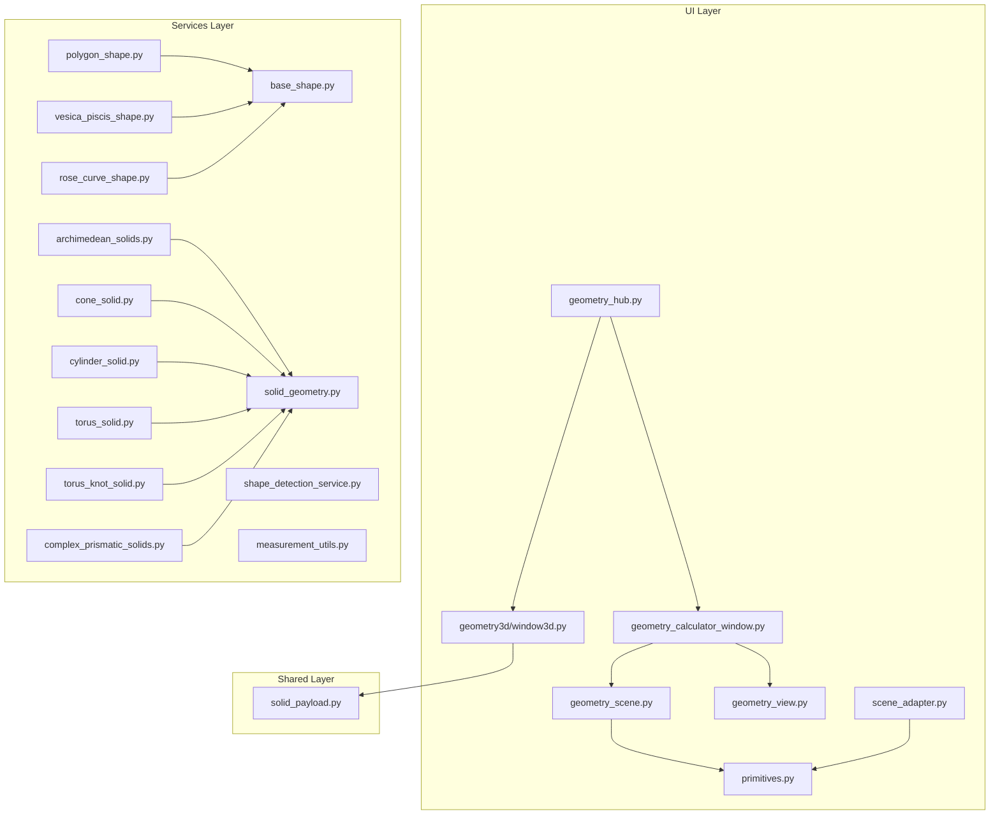
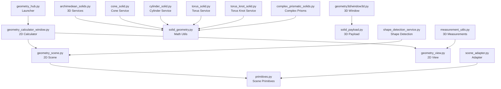
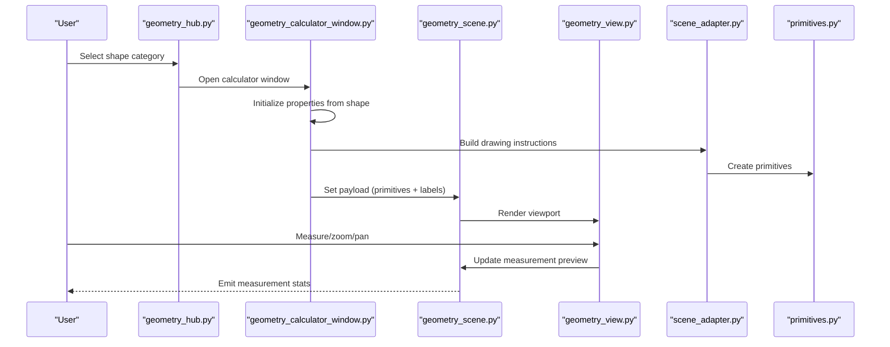
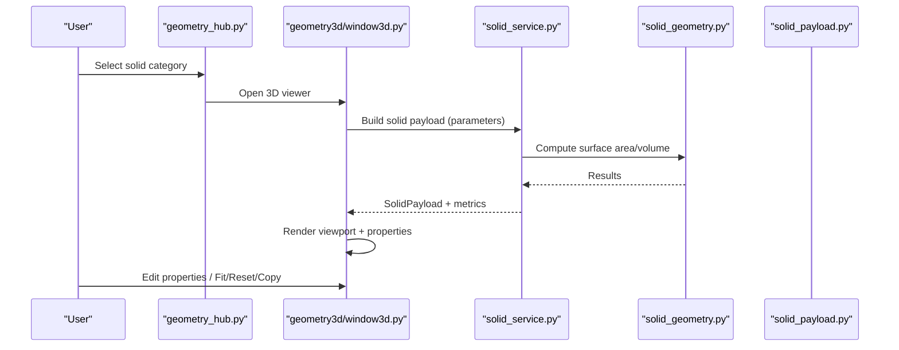
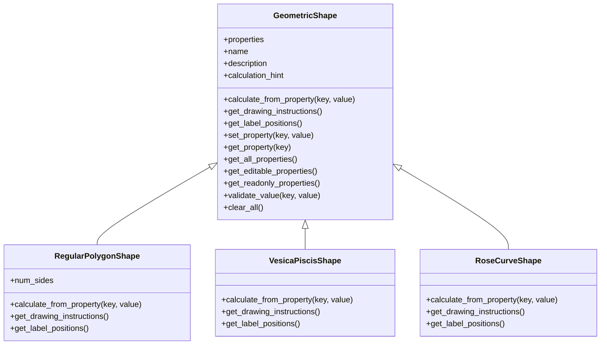
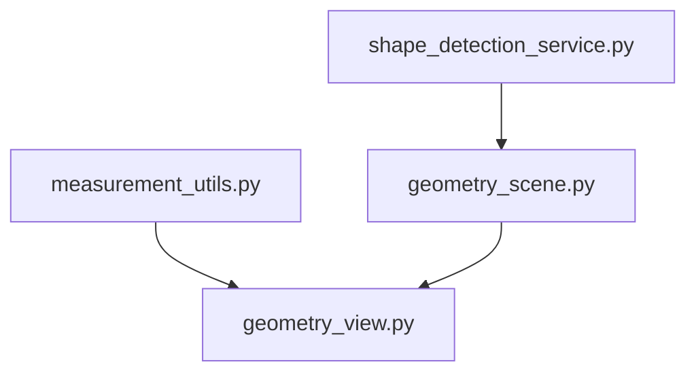
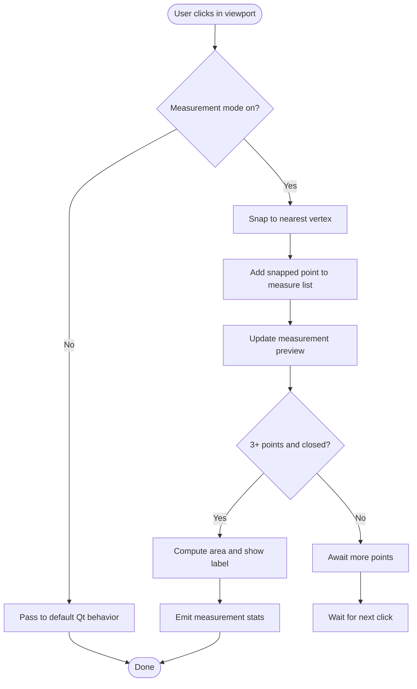
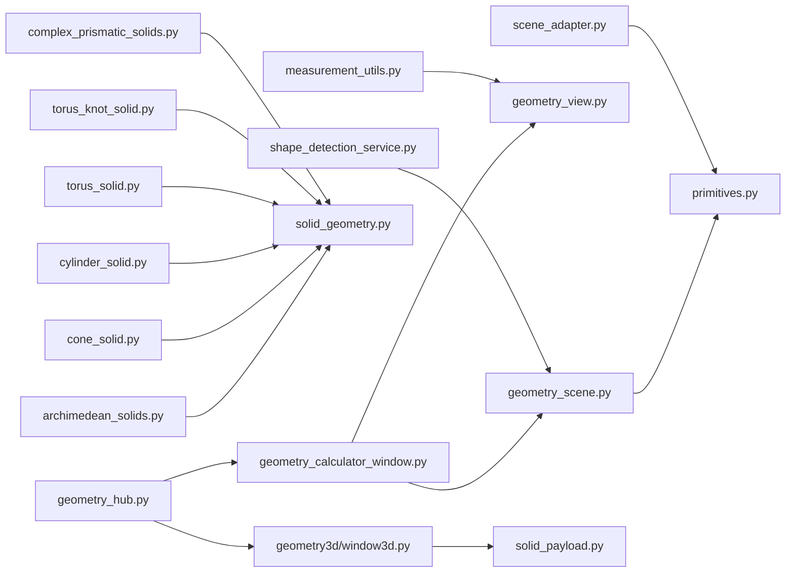

# Geometry Pillar

<cite>
**Referenced Files in This Document**
- [geometry_hub.py](file://src/pillars/geometry/ui/geometry_hub.py)
- [geometry_scene.py](file://src/pillars/geometry/ui/geometry_scene.py)
- [geometry_view.py](file://src/pillars/geometry/ui/geometry_view.py)
- [scene_adapter.py](file://src/pillars/geometry/ui/scene_adapter.py)
- [primitives.py](file://src/pillars/geometry/ui/primitives.py)
- [solid_geometry.py](file://src/pillars/geometry/services/solid_geometry.py)
- [archimedean_solids.py](file://src/pillars/geometry/services/archimedean_solids.py)
- [polygon_shape.py](file://src/pillars/geometry/services/polygon_shape.py)
- [base_shape.py](file://src/pillars/geometry/services/base_shape.py)
- [vesica_piscis_shape.py](file://src/pillars/geometry/services/vesica_piscis_shape.py)
- [rose_curve_shape.py](file://src/pillars/geometry/services/rose_curve_shape.py)
- [solid_payload.py](file://src/pillars/geometry/shared/solid_payload.py)
- [window3d.py](file://src/pillars/geometry/ui/geometry3d/window3d.py)
- [geometry_calculator_window.py](file://src/pillars/geometry/ui/geometry_calculator_window.py)
- [cone_solid.py](file://src/pillars/geometry/services/cone_solid.py)
- [cylinder_solid.py](file://src/pillars/geometry/services/cylinder_solid.py)
- [torus_solid.py](file://src/pillars/geometry/services/torus_solid.py)
- [torus_knot_solid.py](file://src/pillars/geometry/services/torus_knot_solid.py)
- [complex_prismatic_solids.py](file://src/pillars/geometry/services/complex_prismatic_solids.py)
- [shape_detection_service.py](file://src/pillars/geometry/services/shape_detection_service.py)
- [measurement_utils.py](file://src/pillars/geometry/services/measurement_utils.py)
</cite>

## Update Summary
**Changes Made**
- Added documentation for new solid types: torus, torus knot, cone, cylinder, and complex prismatic solids
- Updated architecture overview and component analysis to include new services and utilities
- Added new section for shape detection and measurement utilities
- Updated diagrams to reflect expanded solid categories and new service relationships
- Enhanced documentation of the integration between calculation services and rendering components

## Table of Contents
1. [Introduction](#introduction)
2. [Project Structure](#project-structure)
3. [Core Components](#core-components)
4. [Architecture Overview](#architecture-overview)
5. [Detailed Component Analysis](#detailed-component-analysis)
6. [Dependency Analysis](#dependency-analysis)
7. [Performance Considerations](#performance-considerations)
8. [Troubleshooting Guide](#troubleshooting-guide)
9. [Conclusion](#conclusion)

## Introduction
The Geometry pillar is a comprehensive sacred geometry engine that supports both 2D shape calculations and 3D solid visualizations. It provides:
- A central UI hub to launch calculators and viewers
- A unified 2D visualization pipeline with interactive measurement and labeling
- An expanded 3D visualization pipeline for Platonic and Archimedean solids, curved surfaces (torus, cone, cylinder), complex prismatic forms, and special topologies (torus knot)
- Shared primitives and adapters to bridge legacy drawing formats and modern 3D payloads
- Specialized calculators for polygons, vesica piscis, rose curves, and more
- Advanced shape detection and measurement utilities for both 2D and 3D geometries

Users can interact with geometric calculators, switch between 2D and 3D representations, and leverage shared primitives to compute and display geometric properties consistently.

## Project Structure
The Geometry pillar is organized into three primary layers:
- UI Layer: Central hub, calculators, 2D/3D views, and adapters
- Services Layer: Shape calculators, solid geometry utilities, and specialized services for new solid types
- Shared Layer: Payloads and primitives used across 2D and 3D paths

**Diagram sources**
- [geometry_hub.py](file://src/pillars/geometry/ui/geometry_hub.py#L1-L200)
- [geometry_calculator_window.py](file://src/pillars/geometry/ui/geometry_calculator_window.py#L1-L120)
- [geometry_scene.py](file://src/pillars/geometry/ui/geometry_scene.py#L1-L120)
- [geometry_view.py](file://src/pillars/geometry/ui/geometry_view.py#L1-L80)
- [scene_adapter.py](file://src/pillars/geometry/ui/scene_adapter.py#L1-L60)
- [primitives.py](file://src/pillars/geometry/ui/primitives.py#L1-L60)
- [archimedean_solids.py](file://src/pillars/geometry/services/archimedean_solids.py#L1-L60)
- [solid_geometry.py](file://src/pillars/geometry/services/solid_geometry.py#L1-L60)
- [polygon_shape.py](file://src/pillars/geometry/services/polygon_shape.py#L1-L60)
- [base_shape.py](file://src/pillars/geometry/services/base_shape.py#L1-L60)
- [vesica_piscis_shape.py](file://src/pillars/geometry/services/vesica_piscis_shape.py#L1-L60)
- [rose_curve_shape.py](file://src/pillars/geometry/services/rose_curve_shape.py#L1-L60)
- [solid_payload.py](file://src/pillars/geometry/shared/solid_payload.py#L1-L40)
- [window3d.py](file://src/pillars/geometry/ui/geometry3d/window3d.py#L1-L80)
- [cone_solid.py](file://src/pillars/geometry/services/cone_solid.py#L1-L60)
- [cylinder_solid.py](file://src/pillars/geometry/services/cylinder_solid.py#L1-L60)
- [torus_solid.py](file://src/pillars/geometry/services/torus_solid.py#L1-L60)
- [torus_knot_solid.py](file://src/pillars/geometry/services/torus_knot_solid.py#L1-L60)
- [complex_prismatic_solids.py](file://src/pillars/geometry/services/complex_prismatic_solids.py#L1-L60)
- [shape_detection_service.py](file://src/pillars/geometry/services/shape_detection_service.py#L1-L60)
- [measurement_utils.py](file://src/pillars/geometry/services/measurement_utils.py#L1-L60)

**Section sources**
- [geometry_hub.py](file://src/pillars/geometry/ui/geometry_hub.py#L1-L200)
- [geometry_calculator_window.py](file://src/pillars/geometry/ui/geometry_calculator_window.py#L1-L120)
- [geometry_scene.py](file://src/pillars/geometry/ui/geometry_scene.py#L1-L120)
- [geometry_view.py](file://src/pillars/geometry/ui/geometry_view.py#L1-L80)
- [scene_adapter.py](file://src/pillars/geometry/ui/scene_adapter.py#L1-L60)
- [primitives.py](file://src/pillars/geometry/ui/primitives.py#L1-L60)
- [archimedean_solids.py](file://src/pillars/geometry/services/archimedean_solids.py#L1-L60)
- [solid_geometry.py](file://src/pillars/geometry/services/solid_geometry.py#L1-L60)
- [polygon_shape.py](file://src/pillars/geometry/services/polygon_shape.py#L1-L60)
- [base_shape.py](file://src/pillars/geometry/services/base_shape.py#L1-L60)
- [vesica_piscis_shape.py](file://src/pillars/geometry/services/vesica_piscis_shape.py#L1-L60)
- [rose_curve_shape.py](file://src/pillars/geometry/services/rose_curve_shape.py#L1-L60)
- [solid_payload.py](file://src/pillars/geometry/shared/solid_payload.py#L1-L40)
- [window3d.py](file://src/pillars/geometry/ui/geometry3d/window3d.py#L1-L80)
- [cone_solid.py](file://src/pillars/geometry/services/cone_solid.py#L1-L60)
- [cylinder_solid.py](file://src/pillars/geometry/services/cylinder_solid.py#L1-L60)
- [torus_solid.py](file://src/pillars/geometry/services/torus_solid.py#L1-L60)
- [torus_knot_solid.py](file://src/pillars/geometry/services/torus_knot_solid.py#L1-L60)
- [complex_prismatic_solids.py](file://src/pillars/geometry/services/complex_prismatic_solids.py#L1-L60)
- [shape_detection_service.py](file://src/pillars/geometry/services/shape_detection_service.py#L1-L60)
- [measurement_utils.py](file://src/pillars/geometry/services/measurement_utils.py#L1-L60)

## Core Components
- geometry_hub: Central launcher for calculators and viewers, organizing categories of shapes and solids including new "Curves & Surfaces" category
- geometry_calculator_window: 3-pane calculator for 2D shapes with property inputs, viewport, and controls
- geometry_scene and geometry_view: Unified 2D rendering pipeline with measurement, labels, axes, and interactivity
- scene_adapter: Converts legacy drawing dictionaries into structured primitives for the scene
- primitives: Typed data structures for circles, polygons, lines, labels, and booleans
- archimedean_solids and solid_geometry: 3D solid services and math utilities for Platonic and Archimedean forms
- polygon_shape, vesica_piscis_shape, rose_curve_shape: Specialized calculators for polygons, vesica piscis, and rose curves
- solid_payload: Shared 3D payload structure for vertices, edges, faces, labels, and metadata
- geometry3d/window3d: 3D viewer window with property controls, camera, and output utilities
- cone_solid, cylinder_solid, torus_solid, torus_knot_solid: New service modules for curved surface solids
- complex_prismatic_solids: Service module for Johnson solids and complex prismatic forms
- shape_detection_service: Utility for detecting geometric shapes from point data
- measurement_utils: 3D measurement utilities for distance, area, and volume calculations

**Section sources**
- [geometry_hub.py](file://src/pillars/geometry/ui/geometry_hub.py#L1-L200)
- [geometry_calculator_window.py](file://src/pillars/geometry/ui/geometry_calculator_window.py#L1-L120)
- [geometry_scene.py](file://src/pillars/geometry/ui/geometry_scene.py#L1-L120)
- [geometry_view.py](file://src/pillars/geometry/ui/geometry_view.py#L1-L80)
- [scene_adapter.py](file://src/pillars/geometry/ui/scene_adapter.py#L1-L60)
- [primitives.py](file://src/pillars/geometry/ui/primitives.py#L1-L60)
- [archimedean_solids.py](file://src/pillars/geometry/services/archimedean_solids.py#L1-L60)
- [solid_geometry.py](file://src/pillars/geometry/services/solid_geometry.py#L1-L60)
- [polygon_shape.py](file://src/pillars/geometry/services/polygon_shape.py#L1-L60)
- [base_shape.py](file://src/pillars/geometry/services/base_shape.py#L1-L60)
- [vesica_piscis_shape.py](file://src/pillars/geometry/services/vesica_piscis_shape.py#L1-L60)
- [rose_curve_shape.py](file://src/pillars/geometry/services/rose_curve_shape.py#L1-L60)
- [solid_payload.py](file://src/pillars/geometry/shared/solid_payload.py#L1-L40)
- [window3d.py](file://src/pillars/geometry/ui/geometry3d/window3d.py#L1-L80)
- [cone_solid.py](file://src/pillars/geometry/services/cone_solid.py#L1-L60)
- [cylinder_solid.py](file://src/pillars/geometry/services/cylinder_solid.py#L1-L60)
- [torus_solid.py](file://src/pillars/geometry/services/torus_solid.py#L1-L60)
- [torus_knot_solid.py](file://src/pillars/geometry/services/torus_knot_solid.py#L1-L60)
- [complex_prismatic_solids.py](file://src/pillars/geometry/services/complex_prismatic_solids.py#L1-L60)
- [shape_detection_service.py](file://src/pillars/geometry/services/shape_detection_service.py#L1-L60)
- [measurement_utils.py](file://src/pillars/geometry/services/measurement_utils.py#L1-L60)

## Architecture Overview
The Geometry pillar follows a layered architecture:
- UI Hub orchestrates access to calculators and 3D viewers, now including new solid types
- 2D path: shape calculators produce drawing instructions, adapter builds primitives, scene renders with labels and measurement overlays
- 3D path: solid services compute metrics and payloads, window3d displays and allows property editing, with expanded support for curved surfaces and complex prisms
- New utilities: shape detection service identifies geometric forms from point data, measurement utilities provide 3D calculation capabilities

**Diagram sources**
- [geometry_hub.py](file://src/pillars/geometry/ui/geometry_hub.py#L1-L200)
- [geometry_calculator_window.py](file://src/pillars/geometry/ui/geometry_calculator_window.py#L1-L120)
- [geometry_scene.py](file://src/pillars/geometry/ui/geometry_scene.py#L1-L120)
- [geometry_view.py](file://src/pillars/geometry/ui/geometry_view.py#L1-L80)
- [scene_adapter.py](file://src/pillars/geometry/ui/scene_adapter.py#L1-L60)
- [primitives.py](file://src/pillars/geometry/ui/primitives.py#L1-L60)
- [archimedean_solids.py](file://src/pillars/geometry/services/archimedean_solids.py#L1-L60)
- [solid_geometry.py](file://src/pillars/geometry/services/solid_geometry.py#L1-L60)
- [solid_payload.py](file://src/pillars/geometry/shared/solid_payload.py#L1-L40)
- [window3d.py](file://src/pillars/geometry/ui/geometry3d/window3d.py#L1-L80)
- [cone_solid.py](file://src/pillars/geometry/services/cone_solid.py#L1-L60)
- [cylinder_solid.py](file://src/pillars/geometry/services/cylinder_solid.py#L1-L60)
- [torus_solid.py](file://src/pillars/geometry/services/torus_solid.py#L1-L60)
- [torus_knot_solid.py](file://src/pillars/geometry/services/torus_knot_solid.py#L1-L60)
- [complex_prismatic_solids.py](file://src/pillars/geometry/services/complex_prismatic_solids.py#L1-L60)
- [shape_detection_service.py](file://src/pillars/geometry/services/shape_detection_service.py#L1-L60)
- [measurement_utils.py](file://src/pillars/geometry/services/measurement_utils.py#L1-L60)

## Detailed Component Analysis

### Geometry Hub (Central UI Controller)
- Defines categories for circles, triangles, quadrilaterals, polygons, pyramids, prisms, antiprisms, Platonic solids, Archimedean solids, and new "Curves & Surfaces" category
- Provides factory entries for shape calculators and solid viewers, including new solid types
- Integrates with WindowManager to open calculators and 3D windows
- New "Curves & Surfaces" category includes sphere, cylinder, cone, and torus solids

Key responsibilities:
- Maintain category definitions and menu structures
- Open calculators and 3D viewers
- Route user selections to appropriate services

**Section sources**
- [geometry_hub.py](file://src/pillars/geometry/ui/geometry_hub.py#L1-L200)
- [geometry_hub.py](file://src/pillars/geometry/ui/geometry_hub.py#L200-L500)
- [geometry_hub.py](file://src/pillars/geometry/ui/geometry_hub.py#L500-L800)

### 2D Visualization Pipeline
- geometry_calculator_window: 3-pane layout with property inputs, viewport, and controls
- geometry_scene: Renders primitives, manages labels, axes, measurement overlays, and vertex highlights
- geometry_view: Handles zoom, pan, measurement mode, and selection
- scene_adapter: Translates legacy drawing dicts into structured primitives
- primitives: Typed dataclasses for rendering

Rendering flow:
- Shape calculators produce drawing instructions
- Adapter converts instructions to primitives
- Scene builds and renders primitives, labels, and overlays
- View provides interactive controls and measurement feedback

**Diagram sources**
- [geometry_hub.py](file://src/pillars/geometry/ui/geometry_hub.py#L1-L200)
- [geometry_calculator_window.py](file://src/pillars/geometry/ui/geometry_calculator_window.py#L1-L120)
- [geometry_scene.py](file://src/pillars/geometry/ui/geometry_scene.py#L1-L120)
- [geometry_view.py](file://src/pillars/geometry/ui/geometry_view.py#L1-L80)
- [scene_adapter.py](file://src/pillars/geometry/ui/scene_adapter.py#L1-L60)
- [primitives.py](file://src/pillars/geometry/ui/primitives.py#L1-L60)

**Section sources**
- [geometry_calculator_window.py](file://src/pillars/geometry/ui/geometry_calculator_window.py#L1-L120)
- [geometry_scene.py](file://src/pillars/geometry/ui/geometry_scene.py#L1-L120)
- [geometry_view.py](file://src/pillars/geometry/ui/geometry_view.py#L1-L80)
- [scene_adapter.py](file://src/pillars/geometry/ui/scene_adapter.py#L1-L60)
- [primitives.py](file://src/pillars/geometry/ui/primitives.py#L1-L60)

### 3D Visualization Pipeline
- archimedean_solids, cone_solid, cylinder_solid, torus_solid, torus_knot_solid, complex_prismatic_solids: Provide services and calculators for various solid types
- solid_geometry: Math utilities for vectors, faces, surface area, and volume
- solid_payload: Shared 3D payload structure
- geometry3d/window3d: 3D viewer with property controls, camera, and output

Workflow:
- Solid services compute scaled vertices, edges, faces, and metrics
- Payload carries geometry and metadata
- 3D window displays geometry, allows property editing, and copies snapshots/summaries

**Diagram sources**
- [geometry_hub.py](file://src/pillars/geometry/ui/geometry_hub.py#L680-L800)
- [cone_solid.py](file://src/pillars/geometry/services/cone_solid.py#L1-L120)
- [cylinder_solid.py](file://src/pillars/geometry/services/cylinder_solid.py#L1-L120)
- [torus_solid.py](file://src/pillars/geometry/services/torus_solid.py#L1-L120)
- [torus_knot_solid.py](file://src/pillars/geometry/services/torus_knot_solid.py#L1-L120)
- [complex_prismatic_solids.py](file://src/pillars/geometry/services/complex_prismatic_solids.py#L1-L120)
- [solid_geometry.py](file://src/pillars/geometry/services/solid_geometry.py#L1-L120)
- [solid_payload.py](file://src/pillars/geometry/shared/solid_payload.py#L1-L40)
- [window3d.py](file://src/pillars/geometry/ui/geometry3d/window3d.py#L1-L120)

**Section sources**
- [cone_solid.py](file://src/pillars/geometry/services/cone_solid.py#L1-L120)
- [cylinder_solid.py](file://src/pillars/geometry/services/cylinder_solid.py#L1-L120)
- [torus_solid.py](file://src/pillars/geometry/services/torus_solid.py#L1-L120)
- [torus_knot_solid.py](file://src/pillars/geometry/services/torus_knot_solid.py#L1-L120)
- [complex_prismatic_solids.py](file://src/pillars/geometry/services/complex_prismatic_solids.py#L1-L120)
- [solid_geometry.py](file://src/pillars/geometry/services/solid_geometry.py#L1-L120)
- [solid_payload.py](file://src/pillars/geometry/shared/solid_payload.py#L1-L40)
- [window3d.py](file://src/pillars/geometry/ui/geometry3d/window3d.py#L1-L120)

### Specialized Calculators and Shared Primitives
- base_shape: Abstract base for shape calculators with property management
- polygon_shape: Regular polygon with diagonals, angles, and labeled outputs
- vesica_piscis_shape: Lens area, perimeter, and apex angle computation
- rose_curve_shape: Polar rose with petal count and total area
- primitives: Data structures for rendering
- scene_adapter: Legacy-to-primitive conversion

**Diagram sources**
- [base_shape.py](file://src/pillars/geometry/services/base_shape.py#L1-L143)
- [polygon_shape.py](file://src/pillars/geometry/services/polygon_shape.py#L1-L120)
- [vesica_piscis_shape.py](file://src/pillars/geometry/services/vesica_piscis_shape.py#L1-L120)
- [rose_curve_shape.py](file://src/pillars/geometry/services/rose_curve_shape.py#L1-L120)

**Section sources**
- [base_shape.py](file://src/pillars/geometry/services/base_shape.py#L1-L143)
- [polygon_shape.py](file://src/pillars/geometry/services/polygon_shape.py#L1-L120)
- [vesica_piscis_shape.py](file://src/pillars/geometry/services/vesica_piscis_shape.py#L1-L120)
- [rose_curve_shape.py](file://src/pillars/geometry/services/rose_curve_shape.py#L1-L120)
- [primitives.py](file://src/pillars/geometry/ui/primitives.py#L1-L120)
- [scene_adapter.py](file://src/pillars/geometry/ui/scene_adapter.py#L1-L120)

### New Solid Types and Services
The Geometry pillar has been expanded to support new solid types including torus, torus knot, cone, cylinder, and complex prismatic solids. Each solid type has dedicated service modules that handle the mathematical computations and payload generation.

#### Cone and Cylinder Solids
- cone_solid.py: Implements ConeSolidService and ConeSolidCalculator for cone geometry
- cylinder_solid.py: Implements CylinderSolidService and CylinderSolidCalculator for cylinder geometry
- Both services compute vertices, faces, and metrics based on radius and height parameters
- Calculators provide bidirectional property editing (e.g., setting volume to calculate height)

#### Torus and Torus Knot Solids
- torus_solid.py: Implements TorusSolidService and TorusSolidCalculator for torus geometry
- torus_knot_solid.py: Implements TorusKnotSolidService and TorusKnotSolidCalculator for torus knot geometry
- Torus defined by major and minor radii
- Torus knot defined by (p,q) parameters, major and minor radii, and tube radius
- Uses parallel transport algorithm to generate smooth tube mesh around the knot curve

#### Complex Prismatic Solids
- complex_prismatic_solids.py: Implements services for Johnson solids and complex prismatic forms
- Includes SnubAntiprismSolidService (Johnson Solid J85) and GyroelongatedSquarePrismSolidService
- Computes vertices using canonical constants and scaling factors
- Supports hybrid solids combining prism and antiprism elements

**Section sources**
- [cone_solid.py](file://src/pillars/geometry/services/cone_solid.py#L1-L293)
- [cylinder_solid.py](file://src/pillars/geometry/services/cylinder_solid.py#L1-L294)
- [torus_solid.py](file://src/pillars/geometry/services/torus_solid.py#L1-L324)
- [torus_knot_solid.py](file://src/pillars/geometry/services/torus_knot_solid.py#L1-L452)
- [complex_prismatic_solids.py](file://src/pillars/geometry/services/complex_prismatic_solids.py#L1-L350)

### Shape Detection and Measurement Utilities
New utilities have been added to enhance the Geometry pillar's capabilities in analyzing and measuring geometric forms.

#### Shape Detection Service
- shape_detection_service.py: Implements ShapeDetectionService for detecting geometric shapes from point data
- Supports triangle detection (equilateral, isosceles, right, scalene)
- Supports quadrilateral detection (square, rectangle, rhombus, parallelogram)
- Uses geometric properties (side lengths, angles, diagonals) to classify shapes
- Returns appropriate shape calculator instances with pre-filled properties

#### 3D Measurement Utilities
- measurement_utils.py: Implements 3D measurement functions for distance, area, and volume calculations
- distance_3d: Calculates Euclidean distance between two 3D points
- triangle_area_3d: Calculates area of a 3D triangle using cross product
- polygon_area_3d: Calculates area of a 3D polygon by triangulation
- polyhedron_volume: Calculates volume of a closed polyhedron using divergence theorem
- polyhedron_surface_area: Calculates total surface area of a polyhedron

**Diagram sources**
- [shape_detection_service.py](file://src/pillars/geometry/services/shape_detection_service.py#L1-L158)
- [measurement_utils.py](file://src/pillars/geometry/services/measurement_utils.py#L1-L128)
- [geometry_scene.py](file://src/pillars/geometry/ui/geometry_scene.py#L1-L120)
- [geometry_view.py](file://src/pillars/geometry/ui/geometry_view.py#L1-L80)

**Section sources**
- [shape_detection_service.py](file://src/pillars/geometry/services/shape_detection_service.py#L1-L158)
- [measurement_utils.py](file://src/pillars/geometry/services/measurement_utils.py#L1-L128)

### Measurement and Interaction Flow (2D)

**Diagram sources**
- [geometry_view.py](file://src/pillars/geometry/ui/geometry_view.py#L120-L200)
- [geometry_scene.py](file://src/pillars/geometry/ui/geometry_scene.py#L200-L320)

**Section sources**
- [geometry_view.py](file://src/pillars/geometry/ui/geometry_view.py#L120-L200)
- [geometry_scene.py](file://src/pillars/geometry/ui/geometry_scene.py#L200-L320)

## Dependency Analysis
- UI Hub depends on shape and solid calculators/services
- 2D path depends on primitives and adapter
- 3D path depends on solid services and math utilities
- Both paths share common rendering abstractions
- New shape detection service depends on base shape calculators
- 3D measurement utilities are used by the geometry view for interactive measurements

**Diagram sources**
- [geometry_hub.py](file://src/pillars/geometry/ui/geometry_hub.py#L1-L200)
- [geometry_calculator_window.py](file://src/pillars/geometry/ui/geometry_calculator_window.py#L1-L120)
- [geometry_scene.py](file://src/pillars/geometry/ui/geometry_scene.py#L1-L120)
- [geometry_view.py](file://src/pillars/geometry/ui/geometry_view.py#L1-L80)
- [scene_adapter.py](file://src/pillars/geometry/ui/scene_adapter.py#L1-L60)
- [primitives.py](file://src/pillars/geometry/ui/primitives.py#L1-L60)
- [archimedean_solids.py](file://src/pillars/geometry/services/archimedean_solids.py#L1-L60)
- [solid_geometry.py](file://src/pillars/geometry/services/solid_geometry.py#L1-L60)
- [solid_payload.py](file://src/pillars/geometry/shared/solid_payload.py#L1-L40)
- [window3d.py](file://src/pillars/geometry/ui/geometry3d/window3d.py#L1-L80)
- [cone_solid.py](file://src/pillars/geometry/services/cone_solid.py#L1-L60)
- [cylinder_solid.py](file://src/pillars/geometry/services/cylinder_solid.py#L1-L60)
- [torus_solid.py](file://src/pillars/geometry/services/torus_solid.py#L1-L60)
- [torus_knot_solid.py](file://src/pillars/geometry/services/torus_knot_solid.py#L1-L60)
- [complex_prismatic_solids.py](file://src/pillars/geometry/services/complex_prismatic_solids.py#L1-L60)
- [shape_detection_service.py](file://src/pillars/geometry/services/shape_detection_service.py#L1-L60)
- [measurement_utils.py](file://src/pillars/geometry/services/measurement_utils.py#L1-L60)

**Section sources**
- [geometry_hub.py](file://src/pillars/geometry/ui/geometry_hub.py#L1-L200)
- [geometry_calculator_window.py](file://src/pillars/geometry/ui/geometry_calculator_window.py#L1-L120)
- [geometry_scene.py](file://src/pillars/geometry/ui/geometry_scene.py#L1-L120)
- [geometry_view.py](file://src/pillars/geometry/ui/geometry_view.py#L1-L80)
- [scene_adapter.py](file://src/pillars/geometry/ui/scene_adapter.py#L1-L60)
- [primitives.py](file://src/pillars/geometry/ui/primitives.py#L1-L60)
- [archimedean_solids.py](file://src/pillars/geometry/services/archimedean_solids.py#L1-L60)
- [solid_geometry.py](file://src/pillars/geometry/services/solid_geometry.py#L1-L60)
- [solid_payload.py](file://src/pillars/geometry/shared/solid_payload.py#L1-L40)
- [window3d.py](file://src/pillars/geometry/ui/geometry3d/window3d.py#L1-L80)
- [cone_solid.py](file://src/pillars/geometry/services/cone_solid.py#L1-L60)
- [cylinder_solid.py](file://src/pillars/geometry/services/cylinder_solid.py#L1-L60)
- [torus_solid.py](file://src/pillars/geometry/services/torus_solid.py#L1-L60)
- [torus_knot_solid.py](file://src/pillars/geometry/services/torus_knot_solid.py#L1-L60)
- [complex_prismatic_solids.py](file://src/pillars/geometry/services/complex_prismatic_solids.py#L1-L60)
- [shape_detection_service.py](file://src/pillars/geometry/services/shape_detection_service.py#L1-L60)
- [measurement_utils.py](file://src/pillars/geometry/services/measurement_utils.py#L1-L60)

## Performance Considerations
- 2D measurement preview computes perimeter and area incrementally; keep point lists bounded for responsiveness
- Vertex snapping uses pixel distance; adjust snap threshold to balance precision and usability
- 3D rendering scales with vertex/face counts; consider suggested_scale for fitting
- Scene rebuild clears and re-adds items; minimize frequent payload swaps during interactive edits
- Torus knot rendering performance depends on segment counts; default values balance quality and performance
- For complex prismatic solids, use simplified volume approximations when exact calculations are computationally expensive

[No sources needed since this section provides general guidance]

## Troubleshooting Guide
Common issues and resolutions:
- Measurement mode not updating: Ensure measurement mode is enabled and points are added; verify scene.update_measurement_preview is invoked
- Labels not visible: Toggle labels in the Display tab or via overlay buttons
- 3D properties not editable: Load a solid with a calculator; metadata-only mode hides editable fields
- Invalid property values: Validators enforce positive numbers; check error messages and precision
- 3D viewport not responding: Reset view or fit scene to bounds
- Shape detection not working: Ensure points are provided in correct order and sufficient for the shape type
- Torus knot rendering artifacts: Adjust segment counts in TorusKnotMeshConfig for smoother rendering

**Section sources**
- [geometry_view.py](file://src/pillars/geometry/ui/geometry_view.py#L120-L200)
- [geometry_scene.py](file://src/pillars/geometry/ui/geometry_scene.py#L200-L320)
- [geometry_calculator_window.py](file://src/pillars/geometry/ui/geometry_calculator_window.py#L500-L620)
- [window3d.py](file://src/pillars/geometry/ui/geometry3d/window3d.py#L500-L620)
- [shape_detection_service.py](file://src/pillars/geometry/services/shape_detection_service.py#L1-L158)

## Conclusion
The Geometry pillar integrates a robust 2D calculation and visualization pipeline with a powerful 3D solid engine. Through shared primitives and adapters, it ensures consistent rendering across 2D and 3D contexts. Specialized calculators enable deep exploration of sacred forms, while the UI hub streamlines user workflows from shape selection to interactive measurement and 3D inspection. The recent expansion adds support for curved surface solids (torus, cone, cylinder), complex topological forms (torus knot), and intricate prismatic solids, significantly enhancing the application's geometric capabilities. New utilities for shape detection and 3D measurement provide advanced analysis features, making the Geometry pillar a comprehensive sacred geometry engine for both 2D and 3D mathematical exploration.