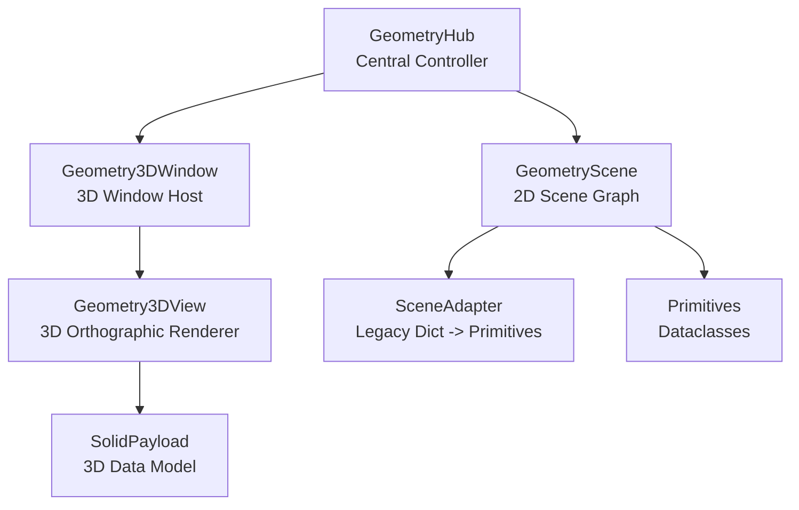
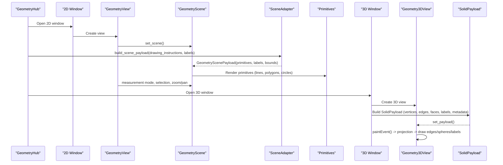
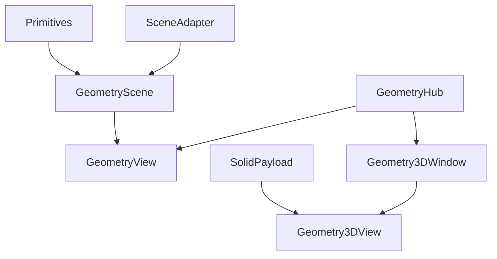
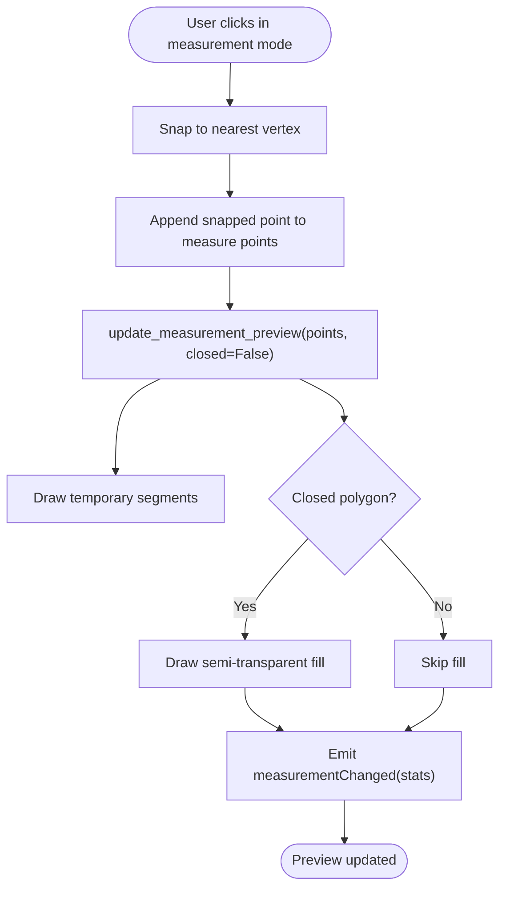
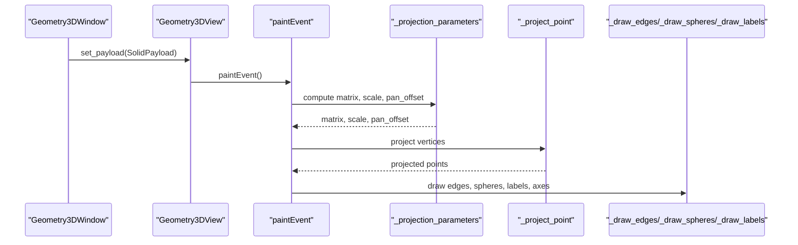

# Geometry Visualization Engine

<cite>
**Referenced Files in This Document**
- [geometry_hub.py](file://src/pillars/geometry/ui/geometry_hub.py)
- [geometry_scene.py](file://src/pillars/geometry/ui/geometry_scene.py)
- [geometry_view.py](file://src/pillars/geometry/ui/geometry_view.py)
- [scene_adapter.py](file://src/pillars/geometry/ui/scene_adapter.py)
- [primitives.py](file://src/pillars/geometry/ui/primitives.py)
- [geometry_interaction.py](file://src/pillars/geometry/ui/geometry_interaction.py)
- [view3d.py](file://src/pillars/geometry/ui/geometry3d/view3d.py)
- [solid_payload.py](file://src/pillars/geometry/shared/solid_payload.py)
- [window3d.py](file://src/pillars/geometry/ui/geometry3d/window3d.py)
</cite>

## Table of Contents
1. [Introduction](#introduction)
2. [Project Structure](#project-structure)
3. [Core Components](#core-components)
4. [Architecture Overview](#architecture-overview)
5. [Detailed Component Analysis](#detailed-component-analysis)
6. [Dependency Analysis](#dependency-analysis)
7. [Performance Considerations](#performance-considerations)
8. [Troubleshooting Guide](#troubleshooting-guide)
9. [Conclusion](#conclusion)
10. [Appendices](#appendices)

## Introduction
This document explains the Geometry Visualization Engine, focusing on the rendering pipeline from geometry_hub as the central controller through geometry_scene (scene graph management), geometry_view (viewport rendering), and scene_adapter (integration layer). It also covers shared primitives, 2D/3D geometric data transformation, user interaction handling, and the SolidPayload data structure used for 3D visualization. Guidance is provided for performance optimization, coordinate system transformations, and extending the visualization capabilities.

## Project Structure
The Geometry Visualization Engine resides under the geometry pillar and is organized around reusable primitives, a shared scene, and a 3D viewport. The hub orchestrates tools and opens windows that host the 2D and 3D views.

**Diagram sources**
- [geometry_hub.py](file://src/pillars/geometry/ui/geometry_hub.py#L1111-L1170)
- [geometry_scene.py](file://src/pillars/geometry/ui/geometry_scene.py#L62-L110)
- [geometry_view.py](file://src/pillars/geometry/ui/geometry_view.py#L14-L40)
- [scene_adapter.py](file://src/pillars/geometry/ui/scene_adapter.py#L19-L55)
- [primitives.py](file://src/pillars/geometry/ui/primitives.py#L14-L120)
- [view3d.py](file://src/pillars/geometry/ui/geometry3d/view3d.py#L41-L118)
- [solid_payload.py](file://src/pillars/geometry/shared/solid_payload.py#L12-L52)
- [window3d.py](file://src/pillars/geometry/ui/geometry3d/window3d.py#L30-L110)

**Section sources**
- [geometry_hub.py](file://src/pillars/geometry/ui/geometry_hub.py#L1111-L1170)
- [geometry_scene.py](file://src/pillars/geometry/ui/geometry_scene.py#L62-L110)
- [geometry_view.py](file://src/pillars/geometry/ui/geometry_view.py#L14-L40)
- [scene_adapter.py](file://src/pillars/geometry/ui/scene_adapter.py#L19-L55)
- [primitives.py](file://src/pillars/geometry/ui/primitives.py#L14-L120)
- [view3d.py](file://src/pillars/geometry/ui/geometry3d/view3d.py#L41-L118)
- [solid_payload.py](file://src/pillars/geometry/shared/solid_payload.py#L12-L52)
- [window3d.py](file://src/pillars/geometry/ui/geometry3d/window3d.py#L30-L110)

## Core Components
- geometry_hub: Central controller that defines categories of shapes and solids, and opens windows for 2D and 3D visualization.
- geometry_scene: QGraphicsScene-based renderer that accepts a GeometryScenePayload and draws primitives with labels, axes, and measurement overlays.
- geometry_view: QGraphicsView wrapper that manages zoom, pan, measurement mode, and selection rubberband.
- scene_adapter: Converts legacy drawing dictionaries into structured primitives and computes bounds.
- primitives: Dataclasses for PenStyle, BrushStyle, Bounds, CirclePrimitive, PolygonPrimitive, LinePrimitive, LabelPrimitive, BooleanPrimitive, and GeometryScenePayload.
- geometry_interaction: Interaction manager for grouping dots, drawing connections, and UI controls for dot/group management.
- view3d: Lightweight 3D viewport widget that renders edges and optional spheres from SolidPayload.
- solid_payload: 3D data model for vertices, edges, faces, labels, and metadata with suggested scale.
- window3d: Window that hosts the 3D view, property inputs, and controls.

**Section sources**
- [geometry_hub.py](file://src/pillars/geometry/ui/geometry_hub.py#L1111-L1170)
- [geometry_scene.py](file://src/pillars/geometry/ui/geometry_scene.py#L62-L110)
- [geometry_view.py](file://src/pillars/geometry/ui/geometry_view.py#L14-L40)
- [scene_adapter.py](file://src/pillars/geometry/ui/scene_adapter.py#L19-L55)
- [primitives.py](file://src/pillars/geometry/ui/primitives.py#L14-L120)
- [geometry_interaction.py](file://src/pillars/geometry/ui/geometry_interaction.py#L42-L150)
- [view3d.py](file://src/pillars/geometry/ui/geometry3d/view3d.py#L41-L118)
- [solid_payload.py](file://src/pillars/geometry/shared/solid_payload.py#L12-L52)
- [window3d.py](file://src/pillars/geometry/ui/geometry3d/window3d.py#L30-L110)

## Architecture Overview
The rendering pipeline starts at geometry_hub, which opens either 2D or 3D windows. The 2D path uses scene_adapter to translate legacy drawing dictionaries into primitives, which geometry_scene renders with labels, axes, and measurement previews. The 3D path uses SolidPayload to render edges and optional spheres in an orthographic viewport.

**Diagram sources**
- [geometry_hub.py](file://src/pillars/geometry/ui/geometry_hub.py#L1111-L1170)
- [geometry_scene.py](file://src/pillars/geometry/ui/geometry_scene.py#L104-L112)
- [geometry_view.py](file://src/pillars/geometry/ui/geometry_view.py#L14-L40)
- [scene_adapter.py](file://src/pillars/geometry/ui/scene_adapter.py#L19-L55)
- [primitives.py](file://src/pillars/geometry/ui/primitives.py#L14-L120)
- [view3d.py](file://src/pillars/geometry/ui/geometry3d/view3d.py#L62-L118)
- [solid_payload.py](file://src/pillars/geometry/shared/solid_payload.py#L12-L52)
- [window3d.py](file://src/pillars/geometry/ui/geometry3d/window3d.py#L85-L110)

## Detailed Component Analysis

### GeometryHub (Central Controller)
- Defines categories of shapes and solids, including 2D shapes and 3D solids.
- Opens 2D and 3D windows and routes user selections to appropriate viewers.
- Manages the hub UI and navigation.

Key responsibilities:
- Category definitions and menu construction.
- Opening geometry windows and passing window_manager for cross-window actions.
- Managing solid viewer entries that delegate to 3D window.

**Section sources**
- [geometry_hub.py](file://src/pillars/geometry/ui/geometry_hub.py#L1111-L1170)
- [geometry_hub.py](file://src/pillars/geometry/ui/geometry_hub.py#L142-L139)

### GeometryScene (Scene Graph Management)
- Accepts a GeometryScenePayload and rebuilds the scene graph.
- Renders primitives: circles, polygons, lines, and boolean combinations.
- Provides measurement preview with temporary lines and optional polygon fill and area label.
- Supports axes, labels, vertex highlights, and theme switching.
- Exposes signals for dot clicks and measurement updates.

Rendering highlights:
- Bounds derivation from primitives or provided bounds.
- Z-values for layering (labels above primitives).
- Vertex intersection detection for measurement overlay.
- Sphere 3D effect via radial gradient for circle primitives.

**Section sources**
- [geometry_scene.py](file://src/pillars/geometry/ui/geometry_scene.py#L104-L112)
- [geometry_scene.py](file://src/pillars/geometry/ui/geometry_scene.py#L140-L150)
- [geometry_scene.py](file://src/pillars/geometry/ui/geometry_scene.py#L214-L291)
- [geometry_scene.py](file://src/pillars/geometry/ui/geometry_scene.py#L440-L500)
- [geometry_scene.py](file://src/pillars/geometry/ui/geometry_scene.py#L501-L544)
- [geometry_scene.py](file://src/pillars/geometry/ui/geometry_scene.py#L545-L592)
- [geometry_scene.py](file://src/pillars/geometry/ui/geometry_scene.py#L593-L631)
- [geometry_scene.py](file://src/pillars/geometry/ui/geometry_scene.py#L633-L665)

### GeometryView (Viewport Rendering)
- Wraps GeometryScene with zoom, pan, measurement mode, and selection rubberband.
- Uses transformation anchors and viewport update modes for smooth interaction.
- Implements measurement mode snapping to scene vertices and preview updates.
- Emits dots_selected signal for rubberband selection.

**Section sources**
- [geometry_view.py](file://src/pillars/geometry/ui/geometry_view.py#L14-L40)
- [geometry_view.py](file://src/pillars/geometry/ui/geometry_view.py#L50-L96)
- [geometry_view.py](file://src/pillars/geometry/ui/geometry_view.py#L101-L118)
- [geometry_view.py](file://src/pillars/geometry/ui/geometry_view.py#L119-L138)
- [geometry_view.py](file://src/pillars/geometry/ui/geometry_view.py#L142-L207)
- [geometry_view.py](file://src/pillars/geometry/ui/geometry_view.py#L208-L270)
- [geometry_view.py](file://src/pillars/geometry/ui/geometry_view.py#L271-L281)

### SceneAdapter (Integration Layer)
- Translates legacy drawing dictionaries into structured primitives.
- Handles circle, polygon, star polygons, diagonals, circumcircle, incircle, and axis lines.
- Computes bounds from primitives and suggests grid span for scene layout.

**Section sources**
- [scene_adapter.py](file://src/pillars/geometry/ui/scene_adapter.py#L19-L55)
- [scene_adapter.py](file://src/pillars/geometry/ui/scene_adapter.py#L61-L95)
- [scene_adapter.py](file://src/pillars/geometry/ui/scene_adapter.py#L98-L141)
- [scene_adapter.py](file://src/pillars/geometry/ui/scene_adapter.py#L143-L151)
- [scene_adapter.py](file://src/pillars/geometry/ui/scene_adapter.py#L153-L169)
- [scene_adapter.py](file://src/pillars/geometry/ui/scene_adapter.py#L171-L179)
- [scene_adapter.py](file://src/pillars/geometry/ui/scene_adapter.py#L182-L188)
- [scene_adapter.py](file://src/pillars/geometry/ui/scene_adapter.py#L190-L199)
- [scene_adapter.py](file://src/pillars/geometry/ui/scene_adapter.py#L202-L234)
- [scene_adapter.py](file://src/pillars/geometry/ui/scene_adapter.py#L236-L253)
- [scene_adapter.py](file://src/pillars/geometry/ui/scene_adapter.py#L255-L347)

### Primitives (Shared Data Structures)
- PenStyle, BrushStyle, Bounds, CirclePrimitive, PolygonPrimitive, LinePrimitive, LabelPrimitive, BooleanPrimitive, GeometryScenePayload.
- GeometryScenePayload carries primitives, labels, bounds, and optional suggested grid span.

**Section sources**
- [primitives.py](file://src/pillars/geometry/ui/primitives.py#L14-L120)

### GeometryInteraction (User Interaction)
- Manages dot grouping, drawing connections, and UI controls for colors and widths.
- Emits signals for groups changed, connections added/cleared, mode changes, and draw start changes.
- Provides GroupManagementPanel and ConnectionToolBar widgets.

**Section sources**
- [geometry_interaction.py](file://src/pillars/geometry/ui/geometry_interaction.py#L42-L150)
- [geometry_interaction.py](file://src/pillars/geometry/ui/geometry_interaction.py#L154-L321)
- [geometry_interaction.py](file://src/pillars/geometry/ui/geometry_interaction.py#L322-L443)

### Geometry3DView (3D Rendering)
- Software-rendered orthographic 3D viewport.
- Projects 3D vertices to 2D using rotation matrix, scale, and pan offset.
- Draws edges, optional insphere/midsphere/circumsphere, labels, and axes.
- Supports camera controls: zoom, pan, rotate, reset, fit.

**Section sources**
- [view3d.py](file://src/pillars/geometry/ui/geometry3d/view3d.py#L41-L118)
- [view3d.py](file://src/pillars/geometry/ui/geometry3d/view3d.py#L122-L145)
- [view3d.py](file://src/pillars/geometry/ui/geometry3d/view3d.py#L146-L187)
- [view3d.py](file://src/pillars/geometry/ui/geometry3d/view3d.py#L191-L218)
- [view3d.py](file://src/pillars/geometry/ui/geometry3d/view3d.py#L219-L248)
- [view3d.py](file://src/pillars/geometry/ui/geometry3d/view3d.py#L249-L282)

### SolidPayload (3D Data Model)
- Encapsulates vertices, edges, faces, labels, metadata, and suggested scale.
- Provides bounds computation for automatic fitting.

**Section sources**
- [solid_payload.py](file://src/pillars/geometry/shared/solid_payload.py#L12-L52)

### Geometry3DWindow (3D Window Host)
- Hosts Geometry3DView and provides UI for controls, display toggles, camera presets, and property inputs.
- Integrates with a calculator to populate property inputs and update the 3D payload.
- Copies snapshots and measurement summaries to the clipboard.

**Section sources**
- [window3d.py](file://src/pillars/geometry/ui/geometry3d/window3d.py#L30-L110)
- [window3d.py](file://src/pillars/geometry/ui/geometry3d/window3d.py#L110-L200)
- [window3d.py](file://src/pillars/geometry/ui/geometry3d/window3d.py#L201-L252)
- [window3d.py](file://src/pillars/geometry/ui/geometry3d/window3d.py#L254-L356)
- [window3d.py](file://src/pillars/geometry/ui/geometry3d/window3d.py#L357-L444)
- [window3d.py](file://src/pillars/geometry/ui/geometry3d/window3d.py#L445-L550)
- [window3d.py](file://src/pillars/geometry/ui/geometry3d/window3d.py#L551-L675)
- [window3d.py](file://src/pillars/geometry/ui/geometry3d/window3d.py#L676-L807)

## Dependency Analysis
The 2D pipeline depends on primitives and scene_adapter to construct GeometryScenePayload, which GeometryScene renders. The 3D pipeline depends on SolidPayload and Geometry3DView. GeometryHub orchestrates both paths.

**Diagram sources**
- [primitives.py](file://src/pillars/geometry/ui/primitives.py#L14-L120)
- [geometry_scene.py](file://src/pillars/geometry/ui/geometry_scene.py#L104-L112)
- [scene_adapter.py](file://src/pillars/geometry/ui/scene_adapter.py#L19-L55)
- [geometry_view.py](file://src/pillars/geometry/ui/geometry_view.py#L14-L40)
- [solid_payload.py](file://src/pillars/geometry/shared/solid_payload.py#L12-L52)
- [view3d.py](file://src/pillars/geometry/ui/geometry3d/view3d.py#L62-L118)
- [window3d.py](file://src/pillars/geometry/ui/geometry3d/window3d.py#L85-L110)
- [geometry_hub.py](file://src/pillars/geometry/ui/geometry_hub.py#L1111-L1170)

**Section sources**
- [primitives.py](file://src/pillars/geometry/ui/primitives.py#L14-L120)
- [geometry_scene.py](file://src/pillars/geometry/ui/geometry_scene.py#L104-L112)
- [scene_adapter.py](file://src/pillars/geometry/ui/scene_adapter.py#L19-L55)
- [geometry_view.py](file://src/pillars/geometry/ui/geometry_view.py#L14-L40)
- [solid_payload.py](file://src/pillars/geometry/shared/solid_payload.py#L12-L52)
- [view3d.py](file://src/pillars/geometry/ui/geometry3d/view3d.py#L62-L118)
- [window3d.py](file://src/pillars/geometry/ui/geometry3d/window3d.py#L85-L110)
- [geometry_hub.py](file://src/pillars/geometry/ui/geometry_hub.py#L1111-L1170)

## Performance Considerations
- 2D measurement preview:
  - Use temporary items and clear them efficiently to avoid accumulating items.
  - Keep measurement preview updates minimal and only when points change.
  - Deduplicate vertices using quantization to reduce intersection computations.
- 3D rendering:
  - Avoid unnecessary recomputation in paintEvent; reuse projection parameters when possible.
  - Limit label drawing to visible labels and use conservative text backgrounds.
  - Use orthographic projection for consistent performance; avoid expensive transforms.
- Interaction:
  - Prefer direct dot selection via itemAt with view transform to minimize hit-testing overhead.
  - Batch UI updates (e.g., group lists) to avoid repeated re-layouts.
- Coordinate system transformations:
  - Ensure consistent mapping between scene coordinates and view coordinates for snapping and selection.
  - For 3D, maintain consistent sign conventions for Y-axis to match typical screen coordinates.

[No sources needed since this section provides general guidance]

## Troubleshooting Guide
Common issues and resolutions:
- Measurement preview not updating:
  - Verify that measurement mode is enabled and points are appended; ensure update_measurement_preview is called.
  - Check that scene rect is set appropriately after payload changes.
- Dot selection not firing:
  - Ensure dot items are selectable and have index stored in data(0).
  - Confirm mousePressEvent in GeometryScene uses the view transform for itemAt.
- 3D viewport not responding to mouse:
  - Check interaction mode detection (rotate vs pan) and that last mouse position is tracked.
  - Ensure wheelEvent adjusts camera distance within safe bounds.
- Property inputs not syncing:
  - Ensure calculator is set and sync routine is invoked after property changes.
  - Validate validators and precision settings for input fields.

**Section sources**
- [geometry_scene.py](file://src/pillars/geometry/ui/geometry_scene.py#L346-L372)
- [geometry_view.py](file://src/pillars/geometry/ui/geometry_view.py#L142-L207)
- [view3d.py](file://src/pillars/geometry/ui/geometry3d/view3d.py#L146-L187)
- [window3d.py](file://src/pillars/geometry/ui/geometry3d/window3d.py#L551-L609)

## Conclusion
The Geometry Visualization Engine provides a cohesive 2D/3D visualization framework built on shared primitives and a scene adapter. geometry_hub orchestrates user workflows, geometry_scene renders 2D content with interactive measurement and labeling, and geometry_view offers responsive viewport controls. The 3D path uses SolidPayload and Geometry3DView for orthographic rendering with camera controls and optional spheres. Extending the engine involves adding new primitives, integrating new calculators for 3D solids, and enhancing interaction panels.

[No sources needed since this section summarizes without analyzing specific files]

## Appendices

### Data Payload Structure: GeometryScenePayload
- primitives: List of primitives (CirclePrimitive, PolygonPrimitive, LinePrimitive, BooleanPrimitive)
- labels: List of LabelPrimitive
- bounds: Optional Bounds for scene rect
- suggest_grid_span: Optional suggestion for grid spacing

**Section sources**
- [primitives.py](file://src/pillars/geometry/ui/primitives.py#L14-L120)

### Data Payload Structure: SolidPayload
- vertices: List of 3D points
- edges: List of vertex index pairs
- faces: List of vertex index sequences
- labels: List of SolidLabel
- metadata: Dict of derived metrics and parameters
- suggested_scale: Optional scale hint for fitting

**Section sources**
- [solid_payload.py](file://src/pillars/geometry/shared/solid_payload.py#L12-L52)

### Example Workflows

#### 2D Measurement Preview Flow

**Diagram sources**
- [geometry_view.py](file://src/pillars/geometry/ui/geometry_view.py#L169-L196)
- [geometry_scene.py](file://src/pillars/geometry/ui/geometry_scene.py#L214-L291)

#### 3D Rendering Flow

**Diagram sources**
- [window3d.py](file://src/pillars/geometry/ui/geometry3d/window3d.py#L85-L110)
- [view3d.py](file://src/pillars/geometry/ui/geometry3d/view3d.py#L122-L145)
- [view3d.py](file://src/pillars/geometry/ui/geometry3d/view3d.py#L191-L218)
- [view3d.py](file://src/pillars/geometry/ui/geometry3d/view3d.py#L219-L282)

### Developer Extension Guide
- Adding a new 2D shape:
  - Define a new primitive in primitives.py if needed.
  - Extend scene_adapter to parse new drawing instructions.
  - Update geometry_scene to render the new primitive.
- Adding a new 3D solid:
  - Create a calculator service that produces SolidPayload.
  - Wire GeometryHub to open Geometry3DWindow with the calculator.
  - Use Geometry3DWindow to bind property inputs to the calculator.
- Enhancing interactions:
  - Extend GeometryInteractionManager with new modes and signals.
  - Add UI panels (GroupManagementPanel, ConnectionToolBar) to manage groups and connections.
- Performance tuning:
  - Minimize scene rebuilds; batch updates where possible.
  - Use temporary items sparingly and clear them promptly.
  - Optimize 3D projections by caching computed matrices and offsets.

[No sources needed since this section provides general guidance]