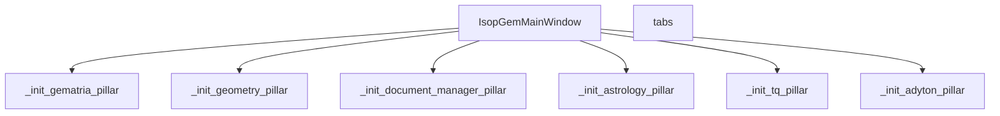
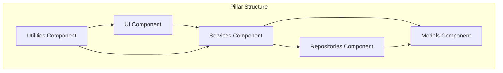
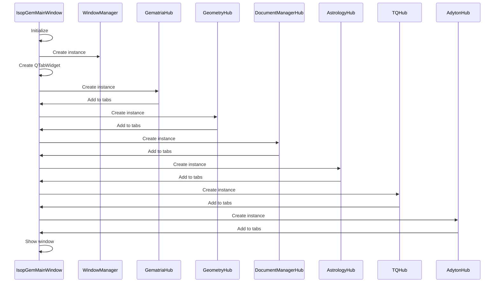

# Pillar-Based Architecture

<cite>
**Referenced Files in This Document**   
- [main.py](file://src/main.py)
- [gematria_hub.py](file://src/pillars/gematria/ui/gematria_hub.py)
- [geometry_hub.py](file://src/pillars/geometry/ui/geometry_hub.py)
- [document_manager_hub.py](file://src/pillars/document_manager/ui/document_manager_hub.py)
- [astrology_hub.py](file://src/pillars/astrology/ui/astrology_hub.py)
- [tq_hub.py](file://src/pillars/tq/ui/tq_hub.py)
- [adyton_hub.py](file://src/pillars/adyton/ui/adyton_hub.py)
- [window_manager.py](file://src/shared/ui/window_manager.py)
- [ARCHITECTURE.md](file://config/ARCHITECTURE.md)
- [ARCHITECTURE_DIAGRAM.txt](file://config/ARCHITECTURE_DIAGRAM.txt)
- [calculation_service.py](file://src/pillars/gematria/services/calculation_service.py)
- [calculation_record.py](file://src/pillars/gematria/models/calculation_record.py)
- [solid_geometry.py](file://src/pillars/geometry/services/solid_geometry.py)
- [chart_record.py](file://src/pillars/astrology/models/chart_record.py)
</cite>

## Table of Contents
1. [Introduction](#introduction)
2. [Pillar Architecture Overview](#pillar-architecture-overview)
3. [Core Pillars](#core-pillars)
   - [Gematria Pillar](#gematria-pillar)
   - [Geometry Pillar](#geometry-pillar)
   - [Document Manager Pillar](#document-manager-pillar)
   - [Astrology Pillar](#astrology-pillar)
   - [TQ Pillar](#tq-pillar)
   - [Adyton Pillar](#adyton-pillar)
4. [Pillar Structure and Components](#pillar-structure-and-components)
5. [Hub Classes and Main Window Integration](#hub-classes-and-main-window-integration)
6. [Shared Components and Services](#shared-components-and-services)
7. [Design Rationale](#design-rationale)
8. [Extensibility and Future Development](#extensibility-and-future-development)
9. [Conclusion](#conclusion)

## Introduction

The isopgem application implements a pillar-based architecture, organizing its functionality into six distinct esoteric analysis domains: Gematria, Geometry, Document Manager, Astrology, TQ (Trigrammaton QBLH), and Adyton. Each pillar represents a self-contained module with its own specialized tools, services, and user interface components. This architectural approach enables deep specialization within each domain while providing unified access through a central tabbed interface. The design emphasizes isolation of concerns, independent development, and extensibility, allowing new pillars to be added following established patterns.

**Section sources**
- [main.py](file://src/main.py#L1-L156)
- [ARCHITECTURE.md](file://config/ARCHITECTURE.md#L1-L51)

## Pillar Architecture Overview

The isopgem application follows a modular pillar architecture where each major functional domain is encapsulated as a separate pillar. This design pattern promotes separation of concerns by isolating domain-specific logic, data models, and user interfaces within dedicated modules. The architecture is documented in the configuration files, which outline the five main pillars (with Adyton as the sixth) and their consistent internal structure.

Each pillar follows a standardized directory structure with five primary components: UI, services, models, repositories, and utilities. This consistent organization across all pillars enables developers to quickly understand and navigate the codebase. The main application window integrates these pillars through a tabbed interface, with each pillar represented by a hub class that serves as the entry point to its functionality.

**Diagram sources **
- [main.py](file://src/main.py#L26-L111)
- [ARCHITECTURE.md](file://config/ARCHITECTURE.md#L32-L43)

**Section sources**
- [main.py](file://src/main.py#L1-L156)
- [ARCHITECTURE.md](file://config/ARCHITECTURE.md#L1-L51)

## Core Pillars

### Gematria Pillar

The Gematria pillar provides tools for numerical analysis of Hebrew, Greek, and English texts. It includes multiple calculator types for different gematria systems, saved calculations browser, batch processing, text analysis, and database tools. The hub interface presents these tools as a series of primary action buttons, allowing users to launch specialized windows for each function. The pillar implements a comprehensive service layer for managing calculation records, with support for metadata, tagging, and search functionality.

**Section sources**
- [gematria_hub.py](file://src/pillars/gematria/ui/gematria_hub.py#L1-L352)
- [calculation_service.py](file://src/pillars/gematria/services/calculation_service.py#L1-L273)
- [calculation_record.py](file://src/pillars/gematria/models/calculation_record.py#L1-L89)

### Geometry Pillar

The Geometry pillar offers visualization and calculation tools for sacred geometry, including 2D shapes, 3D solids, and mathematical patterns. It features an extensive collection of geometric forms organized into categories such as circles, triangles, quadrilaterals, polygons, pyramids, prisms, antiprisms, Platonic solids, and Archimedean solids. The hub interface uses a categorized navigation system with detailed descriptions for each geometric form. The pillar includes both 2D and 3D visualization capabilities, with specialized services for geometric calculations and solid geometry computations.

**Section sources**
- [geometry_hub.py](file://src/pillars/geometry/ui/geometry_hub.py#L1-L800)
- [solid_geometry.py](file://src/pillars/geometry/services/solid_geometry.py#L1-L156)

### Document Manager Pillar

The Document Manager pillar provides tools for analyzing and organizing texts and documents. It includes a document editor, library browser, search functionality, and a "Mindscape" feature described as "The Living Graph." The hub interface presents these tools as distinct action buttons, with specialized windows for document editing, library management, and search operations. The pillar implements a service layer for document management with support for versioning, metadata, and relationship tracking between documents.

**Section sources**
- [document_manager_hub.py](file://src/pillars/document_manager/ui/document_manager_hub.py#L1-L205)

### Astrology Pillar

The Astrology pillar provides tools for cosmic calendar and zodiacal mappings. It includes generators for natal charts, current transit viewers, planetary positions tables, and specialized tools like the Neo-Aubrey Eclipse Clock and Cytherean Rose. The hub interface presents these tools as action buttons with descriptive labels. The pillar integrates with external dependencies like OpenAstro2 and Swiss Ephemeris for astronomical calculations, with services for chart generation and storage.

**Section sources**
- [astrology_hub.py](file://src/pillars/astrology/ui/astrology_hub.py#L1-L126)
- [chart_record.py](file://src/pillars/astrology/models/chart_record.py#L1-L99)

### TQ Pillar

The TQ (Trigrammaton QBLH) pillar focuses on integration and pattern analysis. It includes tools for ternary conversion, quadset analysis, geometric transitions (both 2D and 3D), conrune pair finding, Amun sound calculation, and Kamea grid visualization. The hub interface presents these tools with distinct styling, including specialized buttons for the Kamea of Maut and Kamea of Baphomet with custom border styling. The pillar implements services for pattern analysis and integration between different esoteric systems.

**Section sources**
- [tq_hub.py](file://src/pillars/tq/ui/tq_hub.py#L1-L326)

### Adyton Pillar

The Adyton pillar, representing "The Inner Sanctuary of the Seven," provides specialized tools for advanced esoteric analysis. It includes a 3D engine for exploring the "Chamber of the Adepts" and Amun color mapping. The hub interface is minimal, focusing on launching the Adyton Sanctuary Engine. This pillar appears to serve as a container for the most advanced and specialized tools within the application, potentially integrating concepts from other pillars in a unified 3D environment.

**Section sources**
- [adyton_hub.py](file://src/pillars/adyton/ui/adyton_hub.py#L1-L67)

## Pillar Structure and Components

Each pillar in the isopgem application follows a consistent structure with five primary components: UI, services, models, repositories, and utilities. This standardized organization ensures consistency across domains while allowing each pillar to maintain its specialized functionality.

The UI component contains the user interface elements for each pillar, including the hub class that serves as the main entry point and various specialized windows for specific tools. The services component contains the business logic and core functionality, implementing the domain-specific algorithms and processing. The models component defines the data structures and type definitions used within the pillar. The repositories component handles data access and persistence, abstracting the storage mechanisms. The utilities component contains helper functions and shared utilities specific to the pillar's domain.

This component structure is explicitly documented in the architecture configuration and visually represented in the architecture diagram. The consistent pattern across all pillars enables developers to quickly understand and extend the application's functionality.

**Diagram sources **
- [ARCHITECTURE.md](file://config/ARCHITECTURE.md#L32-L43)
- [ARCHITECTURE_DIAGRAM.txt](file://config/ARCHITECTURE_DIAGRAM.txt#L24-L40)

**Section sources**
- [ARCHITECTURE.md](file://config/ARCHITECTURE.md#L1-L51)
- [ARCHITECTURE_DIAGRAM.txt](file://config/ARCHITECTURE_DIAGRAM.txt#L24-L40)

## Hub Classes and Main Window Integration

The integration of pillars into the main application window is facilitated through hub classes, with each pillar implementing a hub widget that serves as its entry point. These hub classes are QWidget subclasses that provide a user interface for launching the pillar's various tools and windows.

The main window (IsopGemMainWindow) initializes each pillar by creating an instance of its hub class and adding it as a tab to the central QTabWidget. The initialization methods in the main window follow a consistent pattern, creating the hub instance and adding it to the tab widget with an appropriate icon and label. This approach allows for a clean separation between the main application shell and the individual pillar implementations.

The hub classes use a shared window manager to coordinate the opening and management of tool windows across the application. When a user clicks a button in a hub, the corresponding method uses the window manager to open the appropriate tool window, ensuring consistent window behavior and lifecycle management. The window manager handles details such as window positioning, focus management, and closure, providing a unified experience across all pillars.

**Diagram sources **
- [main.py](file://src/main.py#L26-L111)
- [gematria_hub.py](file://src/pillars/gematria/ui/gematria_hub.py#L1-L352)
- [geometry_hub.py](file://src/pillars/geometry/ui/geometry_hub.py#L1-L800)
- [document_manager_hub.py](file://src/pillars/document_manager/ui/document_manager_hub.py#L1-L205)
- [astrology_hub.py](file://src/pillars/astrology/ui/astrology_hub.py#L1-L126)
- [tq_hub.py](file://src/pillars/tq/ui/tq_hub.py#L1-L326)
- [adyton_hub.py](file://src/pillars/adyton/ui/adyton_hub.py#L1-L67)

**Section sources**
- [main.py](file://src/main.py#L1-L156)
- [gematria_hub.py](file://src/pillars/gematria/ui/gematria_hub.py#L1-L352)
- [window_manager.py](file://src/shared/ui/window_manager.py#L1-L221)

## Shared Components and Services

The isopgem application includes a shared component directory that contains functionality used across multiple pillars. This shared layer promotes code reuse and consistency in user experience while maintaining the isolation of pillar-specific logic.

The shared/ui directory contains common UI components, including the WindowManager class that manages the lifecycle of tool windows across the application. The window manager handles window creation, positioning, focus management, and closure, ensuring consistent behavior regardless of which pillar launched the window. It also provides methods for raising all windows when the main window gains focus, creating a cohesive multi-window experience.

The shared/database module provides database connection and session management using SQLAlchemy. It defines the base model class and implements a session factory for database operations. The init_db function initializes the database tables by importing models from the pillars and creating the necessary tables. This shared database layer allows all pillars to persist their data while maintaining a single, consistent database schema.

The shared theme system provides a consistent visual style across the application, with a defined color palette and stylesheet that is applied application-wide. This ensures a unified look and feel regardless of which pillar the user is interacting with.

**Section sources**
- [window_manager.py](file://src/shared/ui/window_manager.py#L1-L221)
- [database.py](file://src/shared/database.py#L1-L53)
- [theme.py](file://src/shared/ui/theme.py#L1-L372)

## Design Rationale

The pillar-based architecture of isopgem was designed to address several key requirements for an esoteric analysis platform. The primary design goals include isolation of concerns, independent development, extensibility, and unified access to specialized tools.

Isolation of concerns is achieved by encapsulating each esoteric domain within its own pillar, with dedicated models, services, and UI components. This prevents cross-domain dependencies and allows each pillar to evolve independently. For example, changes to the gematria calculation algorithms do not affect the geometry visualization tools.

Independent development is facilitated by the modular structure, allowing different developers or teams to work on separate pillars without conflicts. Each pillar can be developed, tested, and debugged in isolation, with well-defined interfaces for integration with the main application.

Extensibility is a core principle of the architecture, with a clear pattern for adding new pillars. The consistent structure across existing pillars provides a template for new domains, and the hub-based integration mechanism makes it straightforward to add new tabs to the main window.

Unified access is provided through the central tabbed interface, which presents all pillars in a consistent manner regardless of their internal complexity. This allows users to seamlessly switch between different types of esoteric analysis while maintaining a familiar navigation pattern.

The architecture also supports deep specialization within each domain by allowing pillars to implement complex, domain-specific functionality without cluttering the main interface. The hub pattern provides a curated entry point to each pillar's tools, presenting only the most important functions while hiding implementation details.

**Section sources**
- [ARCHITECTURE.md](file://config/ARCHITECTURE.md#L1-L51)
- [main.py](file://src/main.py#L1-L156)

## Extensibility and Future Development

The pillar-based architecture of isopgem is designed to be highly extensible, allowing for the addition of new esoteric analysis domains following the established patterns. The consistent structure across all pillars provides a clear template for implementing new functionality.

To add a new pillar, a developer would create a new directory under src/pillars with the standard component structure (UI, services, models, repositories, utilities). The UI component would include a hub class that inherits from QWidget and implements the entry point interface used by the main window. The hub would provide buttons or other controls to launch the pillar's specialized tools.

The new pillar would be integrated into the main application by adding an initialization method to the IsopGemMainWindow class that creates an instance of the new hub and adds it to the tab widget. This method would follow the same pattern as the existing pillar initialization methods, ensuring consistency in the integration process.

Future development could include additional pillars for other esoteric systems, such as alchemy, numerology, or tarot. The architecture also supports enhancement of existing pillars by adding new tools or improving existing functionality. For example, the TQ pillar already indicates future tools like the "Trigrammaton Mapper" and "QBLH Pattern Analyzer" in its hub interface.

The shared components, particularly the window manager and database layer, provide a solid foundation for extending the application while maintaining consistency in user experience and data management.

**Section sources**
- [ARCHITECTURE.md](file://config/ARCHITECTURE.md#L1-L51)
- [main.py](file://src/main.py#L1-L156)
- [tq_hub.py](file://src/pillars/tq/ui/tq_hub.py#L239-L247)

## Conclusion

The pillar-based architecture of the isopgem application provides a robust framework for integrating multiple esoteric analysis domains into a unified platform. By organizing functionality into six main pillars—Gematria, Geometry, Document Manager, Astrology, TQ, and Adyton—the application achieves a balance between deep specialization within each domain and unified access through a central interface.

The consistent structure across pillars, with standardized components for UI, services, models, repositories, and utilities, promotes code reuse, simplifies development, and enhances maintainability. The hub-based integration pattern allows for seamless addition of new pillars while maintaining a cohesive user experience.

This architectural approach supports the application's core mission of providing specialized tools for esoteric analysis while enabling future expansion and enhancement. The design effectively balances isolation of concerns with unified access, allowing users to explore different domains of esoteric knowledge within a single, integrated environment.

**Section sources**
- [main.py](file://src/main.py#L1-L156)
- [ARCHITECTURE.md](file://config/ARCHITECTURE.md#L1-L51)