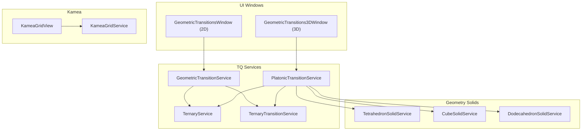
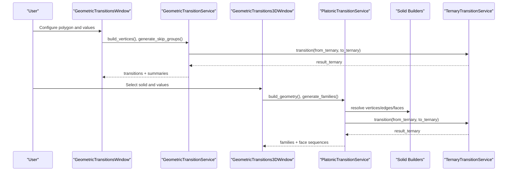
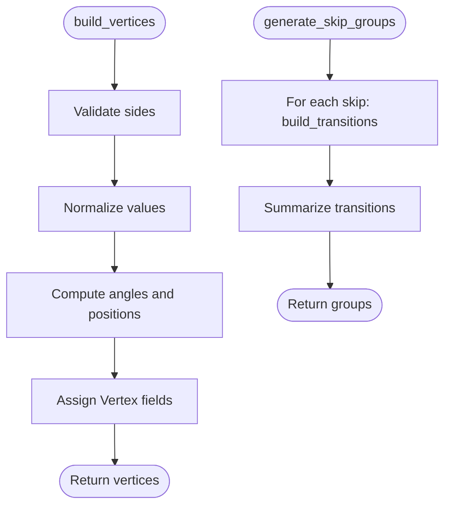
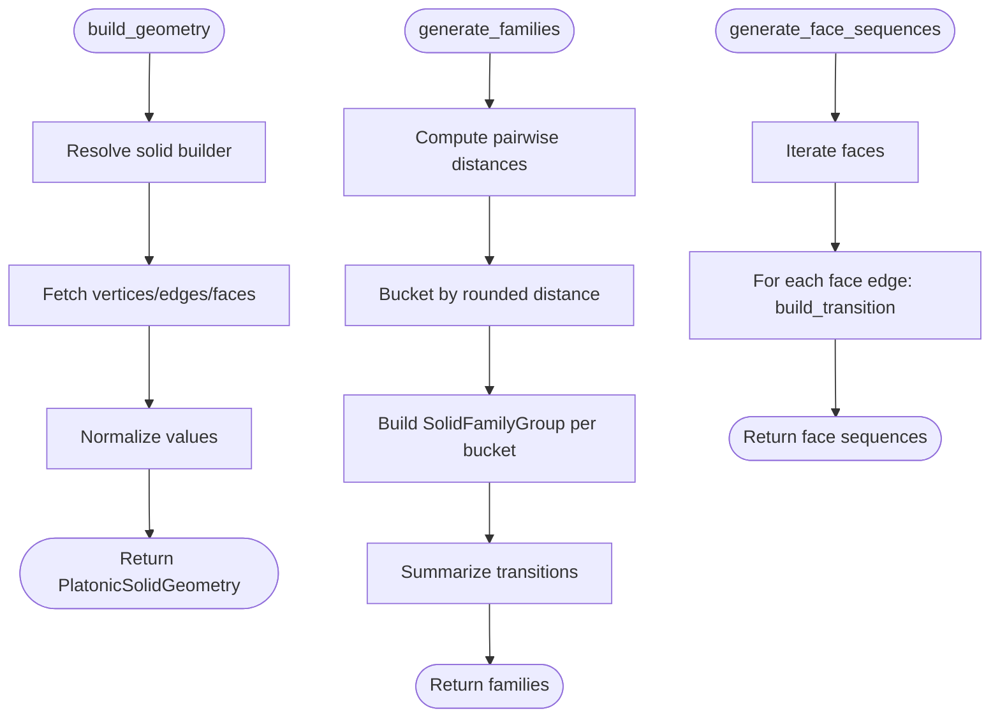
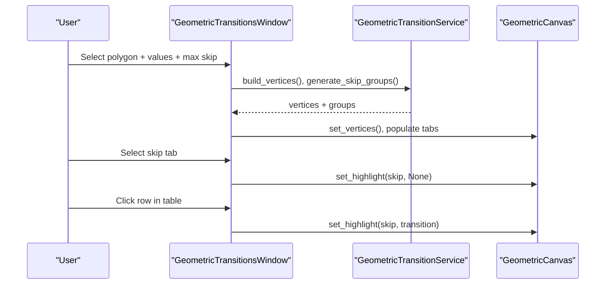
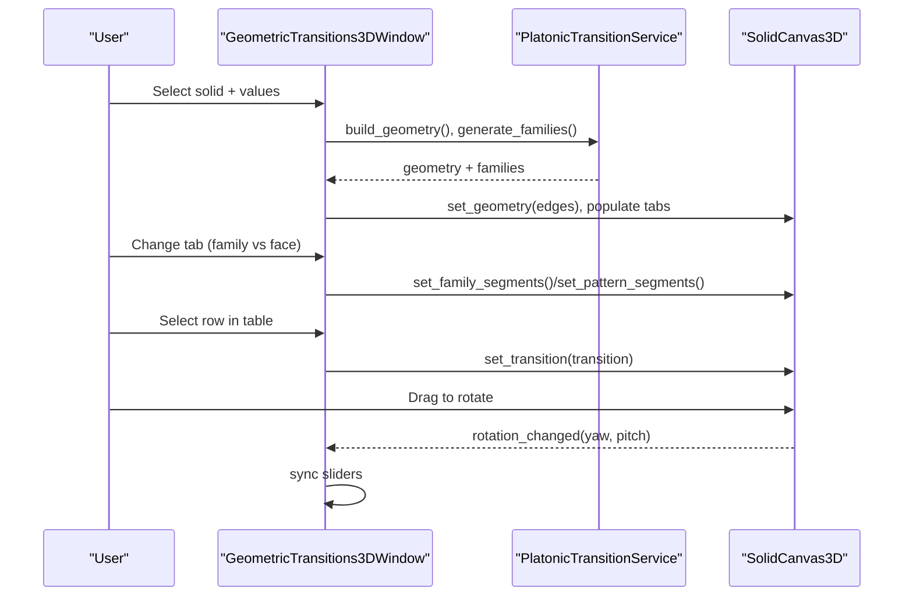
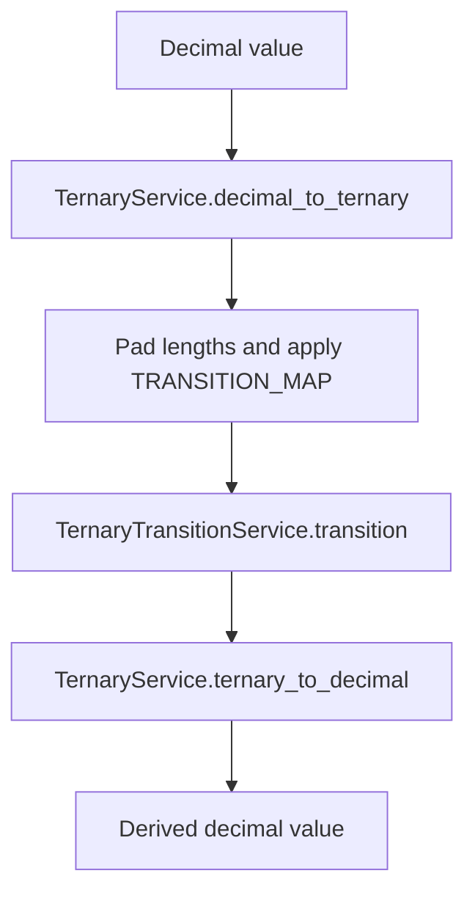
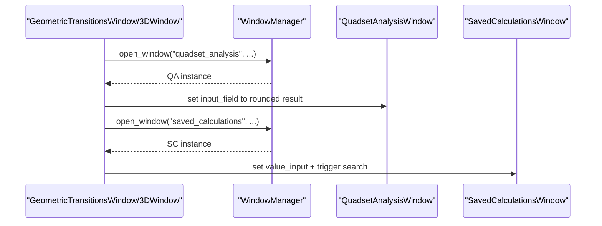
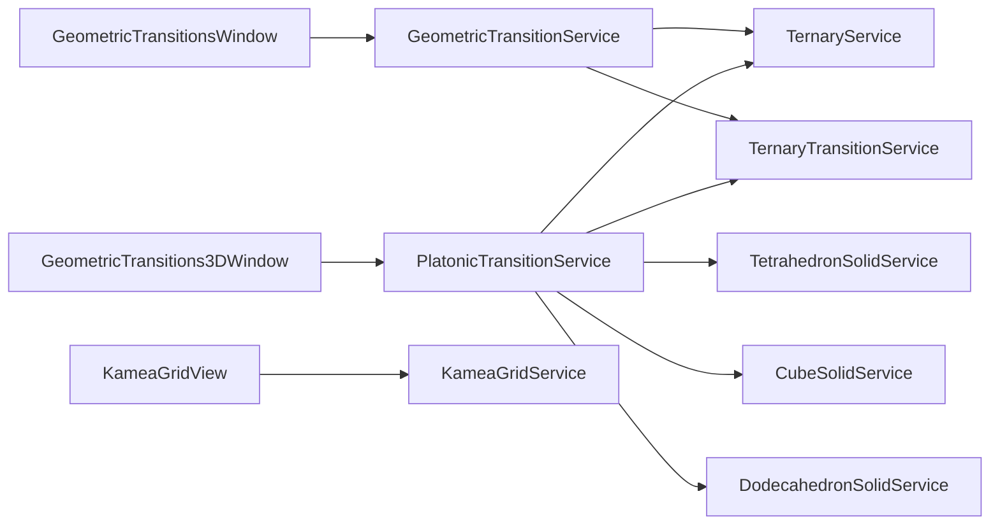

# Geometric Transitions

<cite>
**Referenced Files in This Document**
- [geometric_transition_service.py](file://src/pillars/tq/services/geometric_transition_service.py)
- [platonic_transition_service.py](file://src/pillars/tq/services/platonic_transition_service.py)
- [ternary_service.py](file://src/pillars/tq/services/ternary_service.py)
- [ternary_transition_service.py](file://src/pillars/tq/services/ternary_transition_service.py)
- [geometric_transitions_window.py](file://src/pillars/tq/ui/geometric_transitions_window.py)
- [geometric_transitions_3d_window.py](file://src/pillars/tq/ui/geometric_transitions_3d_window.py)
- [tetrahedron_solid.py](file://src/pillars/geometry/services/tetrahedron_solid.py)
- [cube_solid.py](file://src/pillars/geometry/services/cube_solid.py)
- [dodecahedron_solid.py](file://src/pillars/geometry/services/dodecahedron_solid.py)
- [kamea_grid_service.py](file://src/pillars/tq/services/kamea_grid_service.py)
- [kamea_grid_view.py](file://src/pillars/tq/ui/kamea_grid_view.py)
- [tq_hub.py](file://src/pillars/tq/ui/tq_hub.py)
</cite>

## Table of Contents
1. [Introduction](#introduction)
2. [Project Structure](#project-structure)
3. [Core Components](#core-components)
4. [Architecture Overview](#architecture-overview)
5. [Detailed Component Analysis](#detailed-component-analysis)
6. [Dependency Analysis](#dependency-analysis)
7. [Performance Considerations](#performance-considerations)
8. [Troubleshooting Guide](#troubleshooting-guide)
9. [Conclusion](#conclusion)
10. [Appendices](#appendices)

## Introduction
This document explains the Geometric Transitions subsystem within the TQ pillar. It covers how shape-based transformations are computed and visualized for both 2D polygons and 3D Platonic solids. The system maps numerical values to geometric properties and applies a ternary transition system to produce derived values along edges or connections. It integrates with gematria workflows and kamea grid mappings to connect numeric patterns to sacred geometry and cosmological grids.

## Project Structure
The subsystem spans services and UI windows:
- Services: geometric_transition_service.py (2D polygon transitions), platonic_transition_service.py (3D solid transitions), ternary_service.py and ternary_transition_service.py (ternary arithmetic).
- UI: geometric_transitions_window.py (2D visualization), geometric_transitions_3d_window.py (3D visualization).
- Geometry solids: tetrahedron_solid.py, cube_solid.py, dodecahedron_solid.py (3D geometry payloads).
- Kamea integration: kamea_grid_service.py and kamea_grid_view.py (grid mapping and visualization).
- Entry point: tq_hub.py (opens the geometric transition windows).

**Diagram sources**
- [geometric_transition_service.py](file://src/pillars/tq/services/geometric_transition_service.py#L1-L323)
- [platonic_transition_service.py](file://src/pillars/tq/services/platonic_transition_service.py#L1-L371)
- [ternary_service.py](file://src/pillars/tq/services/ternary_service.py#L1-L114)
- [ternary_transition_service.py](file://src/pillars/tq/services/ternary_transition_service.py#L1-L70)
- [geometric_transitions_window.py](file://src/pillars/tq/ui/geometric_transitions_window.py#L1-L875)
- [geometric_transitions_3d_window.py](file://src/pillars/tq/ui/geometric_transitions_3d_window.py#L1-L977)
- [tetrahedron_solid.py](file://src/pillars/geometry/services/tetrahedron_solid.py#L1-L238)
- [cube_solid.py](file://src/pillars/geometry/services/cube_solid.py#L1-L265)
- [dodecahedron_solid.py](file://src/pillars/geometry/services/dodecahedron_solid.py#L1-L311)
- [kamea_grid_service.py](file://src/pillars/tq/services/kamea_grid_service.py#L1-L220)
- [kamea_grid_view.py](file://src/pillars/tq/ui/kamea_grid_view.py#L1-L268)

**Section sources**
- [geometric_transition_service.py](file://src/pillars/tq/services/geometric_transition_service.py#L1-L323)
- [platonic_transition_service.py](file://src/pillars/tq/services/platonic_transition_service.py#L1-L371)
- [geometric_transitions_window.py](file://src/pillars/tq/ui/geometric_transitions_window.py#L1-L875)
- [geometric_transitions_3d_window.py](file://src/pillars/tq/ui/geometric_transitions_3d_window.py#L1-L977)
- [tq_hub.py](file://src/pillars/tq/ui/tq_hub.py#L1-L326)

## Core Components
- GeometricTransitionService: Builds vertices on a unit circle, generates skip-group transitions, and computes summaries. Uses ternary conversion and transition logic.
- PlatonicTransitionService: Resolves Platonic solids, builds vertex positions, segments edges by geometric distance families, and generates face-circuit transitions.
- TernaryService and TernaryTransitionService: Provide decimal-to-ternary conversion, ternary-to-decimal conversion, and the ternary transition operator.
- UI windows: Provide interactive controls, visualization canvases, and result tables for both 2D and 3D transitions.
- Kamea integration: Provides grid mapping and visualization for connecting numeric values to grid coordinates and families.

**Section sources**
- [geometric_transition_service.py](file://src/pillars/tq/services/geometric_transition_service.py#L1-L323)
- [platonic_transition_service.py](file://src/pillars/tq/services/platonic_transition_service.py#L1-L371)
- [ternary_service.py](file://src/pillars/tq/services/ternary_service.py#L1-L114)
- [ternary_transition_service.py](file://src/pillars/tq/services/ternary_transition_service.py#L1-L70)
- [geometric_transitions_window.py](file://src/pillars/tq/ui/geometric_transitions_window.py#L1-L875)
- [geometric_transitions_3d_window.py](file://src/pillars/tq/ui/geometric_transitions_3d_window.py#L1-L977)
- [kamea_grid_service.py](file://src/pillars/tq/services/kamea_grid_service.py#L1-L220)
- [kamea_grid_view.py](file://src/pillars/tq/ui/kamea_grid_view.py#L1-L268)

## Architecture Overview
The subsystem is layered:
- Data layer: Solid geometry builders (tetrahedron, cube, dodecahedron) supply 3D coordinates.
- Computation layer: Services compute transitions and summaries.
- Presentation layer: UI windows render 2D polygons and 3D solids with interactive controls.
- Integration layer: Kamea grid service bridges numeric values to grid coordinates and families.

**Diagram sources**
- [geometric_transitions_window.py](file://src/pillars/tq/ui/geometric_transitions_window.py#L1-L875)
- [geometric_transitions_3d_window.py](file://src/pillars/tq/ui/geometric_transitions_3d_window.py#L1-L977)
- [geometric_transition_service.py](file://src/pillars/tq/services/geometric_transition_service.py#L1-L323)
- [platonic_transition_service.py](file://src/pillars/tq/services/platonic_transition_service.py#L1-L371)
- [ternary_transition_service.py](file://src/pillars/tq/services/ternary_transition_service.py#L1-L70)
- [tetrahedron_solid.py](file://src/pillars/geometry/services/tetrahedron_solid.py#L1-L238)
- [cube_solid.py](file://src/pillars/geometry/services/cube_solid.py#L1-L265)
- [dodecahedron_solid.py](file://src/pillars/geometry/services/dodecahedron_solid.py#L1-L311)

## Detailed Component Analysis

### GeometricTransitionService (2D Polygon Transitions)
Responsibilities:
- Build vertices around a unit circle with configurable values.
- Generate skip groups (perimeter and diagonals) and compute ternary transitions for each edge.
- Provide summaries (count, sum, mean, min/max, unique results).
- Support special patterns for specific polygons (e.g., heptagon stars).

Key algorithms:
- Vertex construction: places vertices evenly around a circle, computes x/y coordinates, and assigns labels/values.
- Skip group generation: iterates over indices and targets at offset “skip” to form edges.
- Ternary transition: converts values to ternary, pads lengths, applies transition map, and converts back to decimal.

**Diagram sources**
- [geometric_transition_service.py](file://src/pillars/tq/services/geometric_transition_service.py#L96-L154)

**Section sources**
- [geometric_transition_service.py](file://src/pillars/tq/services/geometric_transition_service.py#L96-L216)
- [geometric_transition_service.py](file://src/pillars/tq/services/geometric_transition_service.py#L250-L323)

### PlatonicTransitionService (3D Solid Transitions)
Responsibilities:
- Resolve Platonic solids (tetrahedron, cube, octahedron, dodecahedron, icosahedron, cuboctahedron) and build geometry payloads.
- Segment edges into “families” by rounded geometric distances.
- Generate face-circuit transitions for traversal around each face.
- Compute ternary transitions for each segment and summarize.

Key algorithms:
- Distance bucketing: computes pairwise distances and buckets them to families.
- Family labeling: orders buckets and labels edge network, opposition, and chord families.
- Face sequences: cycles around each face and builds transitions for perimeter edges.

**Diagram sources**
- [platonic_transition_service.py](file://src/pillars/tq/services/platonic_transition_service.py#L121-L204)
- [platonic_transition_service.py](file://src/pillars/tq/services/platonic_transition_service.py#L205-L247)
- [platonic_transition_service.py](file://src/pillars/tq/services/platonic_transition_service.py#L268-L362)
- [tetrahedron_solid.py](file://src/pillars/geometry/services/tetrahedron_solid.py#L60-L95)
- [cube_solid.py](file://src/pillars/geometry/services/cube_solid.py#L114-L146)
- [dodecahedron_solid.py](file://src/pillars/geometry/services/dodecahedron_solid.py#L168-L198)

**Section sources**
- [platonic_transition_service.py](file://src/pillars/tq/services/platonic_transition_service.py#L104-L204)
- [platonic_transition_service.py](file://src/pillars/tq/services/platonic_transition_service.py#L205-L247)
- [platonic_transition_service.py](file://src/pillars/tq/services/platonic_transition_service.py#L268-L362)

### UI: GeometricTransitionsWindow (2D)
Highlights:
- Left panel: polygon selector, max skip, vertex value inputs, generate/clear buttons.
- Visualization: polygon canvas with perimeter, skip-group edges, special patterns, and single-transition highlighting.
- Results: tabs per skip group with summary labels and tables of transitions.
- Special patterns: named heptagon patterns and others.

**Diagram sources**
- [geometric_transitions_window.py](file://src/pillars/tq/ui/geometric_transitions_window.py#L127-L239)
- [geometric_transitions_window.py](file://src/pillars/tq/ui/geometric_transitions_window.py#L271-L431)
- [geometric_transitions_window.py](file://src/pillars/tq/ui/geometric_transitions_window.py#L557-L597)

**Section sources**
- [geometric_transitions_window.py](file://src/pillars/tq/ui/geometric_transitions_window.py#L127-L239)
- [geometric_transitions_window.py](file://src/pillars/tq/ui/geometric_transitions_window.py#L271-L431)
- [geometric_transitions_window.py](file://src/pillars/tq/ui/geometric_transitions_window.py#L557-L597)

### UI: GeometricTransitions3DWindow (3D)
Highlights:
- Left panel: solid selector, vertex value inputs, generate/clear, view controls (azimuth/elevation sliders).
- Visualization: SolidCanvas3D renders edges, family segments, face circuits, and selected transitions with rotation controls.
- Results: tabs per family with summaries and tables; face circuits tab with combo and summary.

**Diagram sources**
- [geometric_transitions_3d_window.py](file://src/pillars/tq/ui/geometric_transitions_3d_window.py#L241-L390)
- [geometric_transitions_3d_window.py](file://src/pillars/tq/ui/geometric_transitions_3d_window.py#L391-L556)
- [geometric_transitions_3d_window.py](file://src/pillars/tq/ui/geometric_transitions_3d_window.py#L642-L710)

**Section sources**
- [geometric_transitions_3d_window.py](file://src/pillars/tq/ui/geometric_transitions_3d_window.py#L241-L390)
- [geometric_transitions_3d_window.py](file://src/pillars/tq/ui/geometric_transitions_3d_window.py#L391-L556)
- [geometric_transitions_3d_window.py](file://src/pillars/tq/ui/geometric_transitions_3d_window.py#L642-L710)

### Transition Algorithms and Mapping
- Numerical to geometric property mapping:
  - 2D: Vertex values are mapped onto polygon vertices; transitions are edges defined by skip offsets.
  - 3D: Vertex values are mapped onto solid vertices; transitions are edges grouped by geometric distance families.
- Ternary transition system:
  - Converts decimal values to ternary strings.
  - Applies a fixed transition map to pairs of ternary digits (padded to equal length).
  - Converts result back to decimal for downstream analysis.

**Diagram sources**
- [ternary_service.py](file://src/pillars/tq/services/ternary_service.py#L1-L114)
- [ternary_transition_service.py](file://src/pillars/tq/services/ternary_transition_service.py#L1-L70)

**Section sources**
- [ternary_service.py](file://src/pillars/tq/services/ternary_service.py#L1-L114)
- [ternary_transition_service.py](file://src/pillars/tq/services/ternary_transition_service.py#L1-L70)

### Concrete Examples: Transition Sequences
Examples are derived from the code’s APIs and UI flows:
- Tetrahedron to Cube to Dodecahedron:
  - Use the 3D window to select a solid, enter vertex values, and generate families.
  - Observe how edges are grouped by distance families and how face circuits traverse each face.
  - Compare transition sums and unique results across families to understand morphing behavior.
- Heptagon star patterns:
  - Use the 2D window to select a heptagon (7 sides) and generate special patterns.
  - Inspect the predefined “Lovely Star,” “Mountain Star,” and “Atomic Star” sequences.

These examples demonstrate how numerical values on vertices transform under the ternary transition system and how geometric proximity influences grouping.

**Section sources**
- [geometric_transitions_window.py](file://src/pillars/tq/ui/geometric_transitions_window.py#L1-L875)
- [geometric_transitions_3d_window.py](file://src/pillars/tq/ui/geometric_transitions_3d_window.py#L1-L977)
- [geometric_transition_service.py](file://src/pillars/tq/services/geometric_transition_service.py#L44-L86)

### Integration with Gematria and Kamea Grid Mappings
- Kamea Grid Service:
  - Loads 27x27 grid from CSVs, constructs KameaCell objects, and exposes reverse lookup from decimal to coordinates.
  - Supports variants (Maut and Baphomet) and computes quadsets for chord values.
- Kamea Grid View:
  - Renders grid cells with tooltips and highlights quadsets on selection.
- Cross-pillar integration:
  - 2D and 3D transition windows expose context menus to send results to Quadset Analysis and Saved Calculations windows, enabling gematria workflows.

**Diagram sources**
- [geometric_transitions_window.py](file://src/pillars/tq/ui/geometric_transitions_window.py#L733-L776)
- [geometric_transitions_3d_window.py](file://src/pillars/tq/ui/geometric_transitions_3d_window.py#L712-L788)
- [tq_hub.py](file://src/pillars/tq/ui/tq_hub.py#L274-L325)

**Section sources**
- [kamea_grid_service.py](file://src/pillars/tq/services/kamea_grid_service.py#L1-L220)
- [kamea_grid_view.py](file://src/pillars/tq/ui/kamea_grid_view.py#L1-L268)
- [geometric_transitions_window.py](file://src/pillars/tq/ui/geometric_transitions_window.py#L733-L776)
- [geometric_transitions_3d_window.py](file://src/pillars/tq/ui/geometric_transitions_3d_window.py#L712-L788)
- [tq_hub.py](file://src/pillars/tq/ui/tq_hub.py#L274-L325)

## Dependency Analysis
- Services depend on:
  - TernaryService and TernaryTransitionService for numeric transformations.
  - Solid builders (tetrahedron, cube, dodecahedron) for 3D geometry payloads.
- UI windows depend on:
  - Their respective services for computation and data.
  - WindowManager for cross-window navigation and gematria integration.
- Kamea grid service depends on CSV parsing and provides reverse lookup and quadset computation.

**Diagram sources**
- [geometric_transition_service.py](file://src/pillars/tq/services/geometric_transition_service.py#L1-L323)
- [platonic_transition_service.py](file://src/pillars/tq/services/platonic_transition_service.py#L1-L371)
- [geometric_transitions_window.py](file://src/pillars/tq/ui/geometric_transitions_window.py#L1-L875)
- [geometric_transitions_3d_window.py](file://src/pillars/tq/ui/geometric_transitions_3d_window.py#L1-L977)
- [kamea_grid_view.py](file://src/pillars/tq/ui/kamea_grid_view.py#L1-L268)
- [kamea_grid_service.py](file://src/pillars/tq/services/kamea_grid_service.py#L1-L220)

**Section sources**
- [geometric_transition_service.py](file://src/pillars/tq/services/geometric_transition_service.py#L1-L323)
- [platonic_transition_service.py](file://src/pillars/tq/services/platonic_transition_service.py#L1-L371)
- [geometric_transitions_window.py](file://src/pillars/tq/ui/geometric_transitions_window.py#L1-L875)
- [geometric_transitions_3d_window.py](file://src/pillars/tq/ui/geometric_transitions_3d_window.py#L1-L977)
- [kamea_grid_view.py](file://src/pillars/tq/ui/kamea_grid_view.py#L1-L268)
- [kamea_grid_service.py](file://src/pillars/tq/services/kamea_grid_service.py#L1-L220)

## Performance Considerations
- 2D polygon transitions:
  - Complexity is O(n·s) for n vertices and s skip steps. Limit max skip to reduce workload.
  - Avoid excessive recomputation by caching normalized values and precomputing group summaries.
- 3D solid transitions:
  - Pairwise distance computation is O(v^2); consider limiting vertex counts or using spatial indexing for very large meshes.
  - Rendering updates: minimize repaints by batching canvas updates and using efficient drawing routines.
- UI responsiveness:
  - Defer heavy computations to background threads if needed; keep UI responsive during generation.
  - Use lazy initialization for geometry payloads and defer CSV loading until grid is opened.

[No sources needed since this section provides general guidance]

## Troubleshooting Guide
Common issues and solutions:
- Invalid polygon sides or values:
  - Ensure sides are within supported bounds and values are integers; the service validates inputs and raises errors on invalid ranges.
- Empty or missing special patterns:
  - Special patterns are only available for specific polygons (e.g., heptagon). Verify polygon selection.
- 3D rendering artifacts:
  - Rotation sensitivity and projection scaling can cause clipping or misalignment. Adjust sliders and reset view to default.
  - Large solids with many vertices can slow down rendering; reduce vertex counts or simplify geometry.
- Context menu actions disabled:
  - Cross-pillar actions require a valid window manager instance; ensure the window was opened via the TQ hub.

**Section sources**
- [geometric_transition_service.py](file://src/pillars/tq/services/geometric_transition_service.py#L293-L323)
- [geometric_transitions_window.py](file://src/pillars/tq/ui/geometric_transitions_window.py#L733-L776)
- [geometric_transitions_3d_window.py](file://src/pillars/tq/ui/geometric_transitions_3d_window.py#L712-L788)

## Conclusion
The Geometric Transitions subsystem provides a robust pipeline for mapping numerical values to geometric properties and applying a ternary transition system across 2D polygons and 3D Platonic solids. Its UI components offer interactive exploration, while integration with gematria and kamea grid services enables deeper symbolic and cosmological analysis. By understanding the algorithms and leveraging the UI affordances, users can explore morphing patterns between sacred forms and connect numeric outcomes to grid-based mappings.

[No sources needed since this section summarizes without analyzing specific files]

## Appendices

### Example Workflows
- 2D polygon transitions:
  - Choose a polygon, set vertex values, adjust max skip, generate groups, and inspect summaries and tables.
- 3D solid transitions:
  - Select a Platonic solid, set vertex values, generate families and face circuits, and navigate tabs to compare transition distributions.
- Kamea integration:
  - From either window, right-click a decimal result and choose “Send to Quadset Analysis” or “Look up in Database.”

**Section sources**
- [geometric_transitions_window.py](file://src/pillars/tq/ui/geometric_transitions_window.py#L271-L431)
- [geometric_transitions_3d_window.py](file://src/pillars/tq/ui/geometric_transitions_3d_window.py#L391-L556)
- [tq_hub.py](file://src/pillars/tq/ui/tq_hub.py#L274-L325)