# TQ Pillar

<cite>
**Referenced Files in This Document**   
- [tq_hub.py](file://src/pillars/tq/ui/tq_hub.py)
- [quadset_engine.py](file://src/pillars/tq/services/quadset_engine.py)
- [geometric_transition_service.py](file://src/pillars/tq/services/geometric_transition_service.py)
- [kamea_grid_service.py](file://src/pillars/tq/services/kamea_grid_service.py)
- [cipher_token.py](file://src/pillars/tq/models/cipher_token.py)
- [kamea_cell.py](file://src/pillars/tq/models/kamea_cell.py)
- [quadset_models.py](file://src/pillars/tq/models/quadset_models.py)
- [symphony_config.py](file://src/pillars/tq/models/symphony_config.py)
- [quadset_analysis_window.py](file://src/pillars/tq/ui/quadset_analysis_window.py)
- [kamea_baphomet_grid.csv](file://src/pillars/tq/data/kamea_baphomet_grid.csv)
- [kamea_baphomet_ternary.csv](file://src/pillars/tq/data/kamea_baphomet_ternary.csv)
- [conrune_pair_finder_service.py](file://src/pillars/tq/services/conrune_pair_finder_service.py)
- [ternary_service.py](file://src/pillars/tq/services/ternary_service.py)
- [ternary_transition_service.py](file://src/pillars/tq/services/ternary_transition_service.py)
</cite>

## Table of Contents
1. [Introduction](#introduction)
2. [Component Architecture](#component-architecture)
3. [Data Models](#data-models)
4. [UI Components](#ui-components)
5. [CSV Data Integration](#csv-data-integration)
6. [Rune Pairing and Geometric Transitions](#rune-pairing-and-geometric-transitions)
7. [Gematria and Sacred Geometry Integration](#gematria-and-sacred-geometry-integration)
8. [Conclusion](#conclusion)

## Introduction

The TQ (Trigrammaton QBLH) pillar of the isopgem application serves as a specialized research environment for advanced QBLH pattern analysis. This pillar focuses on the exploration of trigram patterns, kamea grids, and geometric transitions through a structured framework of quadsets. The system enables users to analyze complex relationships between numbers, symbols, and sacred geometries using ternary representations and transformation logic. The TQ pillar integrates multiple analytical tools that work in concert to reveal hidden patterns in numerical and symbolic data, providing insights into the underlying structure of QBLH systems.

**Section sources**
- [tq_hub.py](file://src/pillars/tq/ui/tq_hub.py#L1-L326)
- [__init__.py](file://src/pillars/tq/__init__.py#L1-L2)

## Component Architecture

The TQ pillar is structured around a central controller and several specialized services that handle specific aspects of QBLH analysis. The architecture follows a modular design pattern where each component has a well-defined responsibility and interacts with others through clearly defined interfaces.

### tq_hub as Central Controller

The `tq_hub` serves as the central controller and entry point for all TQ pillar functionality. It provides a unified interface that launches various analytical tools and manages their lifecycle. The hub implements a window management system that ensures consistent user experience across different tools. It coordinates the initialization of services and maintains references to active windows, allowing for proper resource management and state preservation.

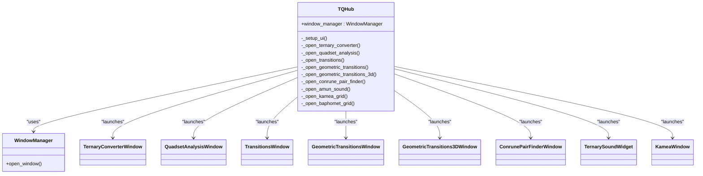

**Diagram sources **
- [tq_hub.py](file://src/pillars/tq/ui/tq_hub.py#L17-L326)

**Section sources**
- [tq_hub.py](file://src/pillars/tq/ui/tq_hub.py#L1-L326)

### quadset_engine Processing Trigram Patterns

The `quadset_engine` is responsible for processing trigram patterns and performing comprehensive quadset analysis. It orchestrates the transformation pipeline that generates the complete result model from an input decimal number. The engine implements the core logic for calculating quadset members, differentials, and transgrams, following the established QBLH pattern analysis methodology.

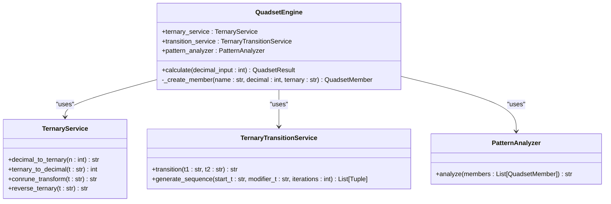

**Diagram sources **
- [quadset_engine.py](file://src/pillars/tq/services/quadset_engine.py#L11-L87)

**Section sources**
- [quadset_engine.py](file://src/pillars/tq/services/quadset_engine.py#L1-L87)

### geometric_transition_service Handling Shape-Based Transformations

The `geometric_transition_service` handles shape-based transformations on regular polygons, enabling the analysis of vertex transitions and geometric patterns. It supports polygons with 3 to 27 sides and provides functionality for generating skip groups and special sequences. The service implements algorithms for constructing vertices, calculating transitions, and summarizing results, making it a powerful tool for exploring geometric relationships in QBLH systems.

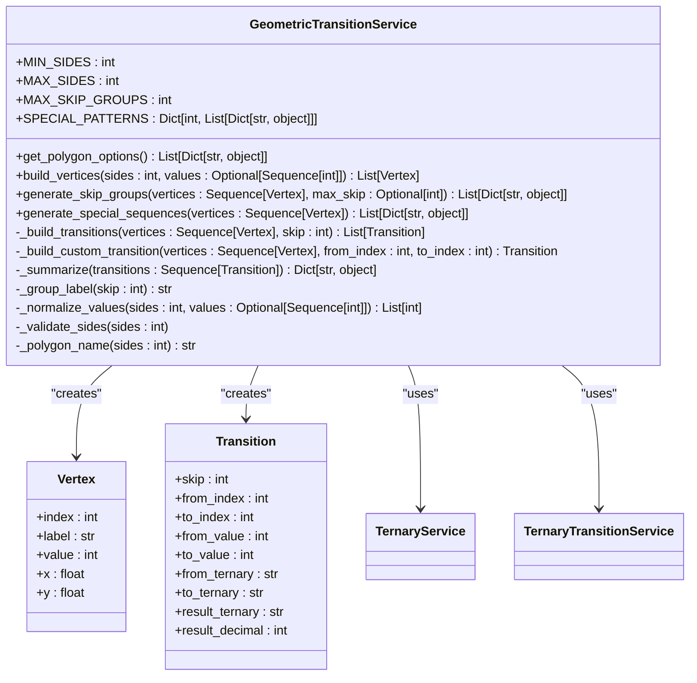

**Diagram sources **
- [geometric_transition_service.py](file://src/pillars/tq/services/geometric_transition_service.py#L38-L323)

**Section sources**
- [geometric_transition_service.py](file://src/pillars/tq/services/geometric_transition_service.py#L1-L323)

### kamea_grid_service Managing Magic Square Logic

The `kamea_grid_service` manages the 27x27 Kamea grid, serving as the source of truth for all grid-related operations. It loads data from validated CSV files and provides methods for accessing cells, calculating quadsets, and determining geometric chords. The service supports both Maut and Baphomet variants, with different logic for handling quadset relationships. It also integrates with the Baphomet color service to provide visual feedback based on cell properties.

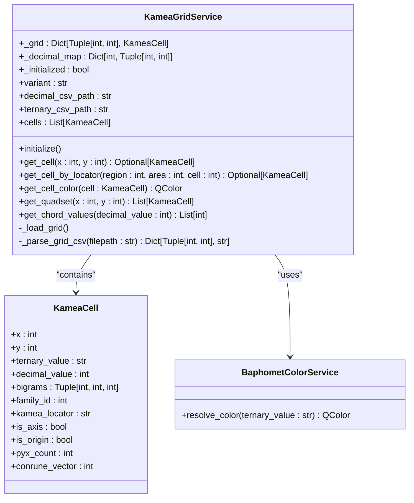

**Diagram sources **
- [kamea_grid_service.py](file://src/pillars/tq/services/kamea_grid_service.py#L11-L220)

**Section sources**
- [kamea_grid_service.py](file://src/pillars/tq/services/kamea_grid_service.py#L1-L220)

## Data Models

The TQ pillar employs several specialized data models to represent the various entities involved in QBLH pattern analysis. These models provide a structured way to store and manipulate data, ensuring consistency and integrity throughout the system.

### cipher_token Data Model

The `cipher_token` model represents a single entry in the TQ Base-27 Cipher, mapping a decimal value (0-26) to its categorical, symbolic, and alphabetic correspondences. Each token includes properties for the decimal value, trigram representation, category, symbol, and letter. The model also provides computed properties for determining the ontological stratum based on the count of zeros in the trigram.

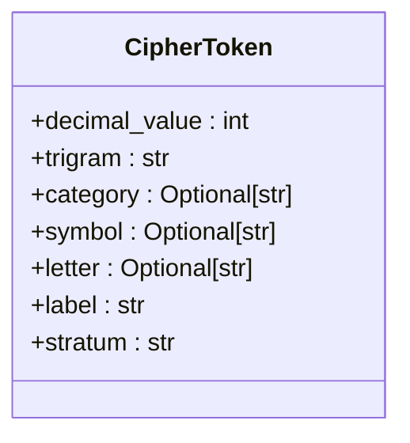

**Diagram sources **
- [cipher_token.py](file://src/pillars/tq/models/cipher_token.py#L5-L35)

**Section sources**
- [cipher_token.py](file://src/pillars/tq/models/cipher_token.py#L1-L35)

### kamea_cell Data Model

The `kamea_cell` model represents a single cell in the 27x27 Kamea grid, with attributes for Cartesian coordinates, ternary and decimal values, bigrams, and family ID. The model includes computed properties for determining the cell's position relative to the axes, its kamea locator string, and its dimensional density (count of zeros in the ternary value). It also provides a method for calculating the conrune vector, which represents the magnitude of the vector between the cell and its conrune.

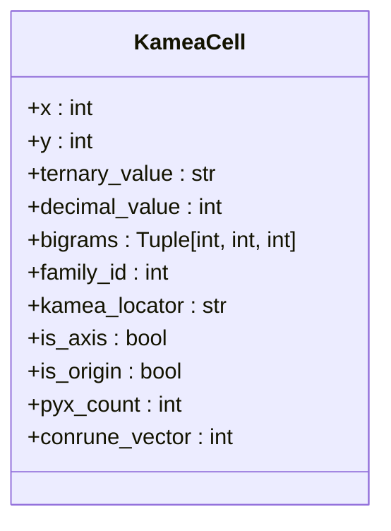

**Diagram sources **
- [kamea_cell.py](file://src/pillars/tq/models/kamea_cell.py#L5-L59)

**Section sources**
- [kamea_cell.py](file://src/pillars/tq/models/kamea_cell.py#L1-L59)

### symphony_config Data Model

The `symphony_config` model defines the orchestral archetypes and physics constants used in the audio synthesis system. It includes a dataclass for `SymphonyFamily` that specifies the properties of each family, such as ID, name, color, instrument, and audio type. The model also defines the base frequencies for octaves and scale ratios for just intonation, providing the foundation for musical representation of QBLH patterns.

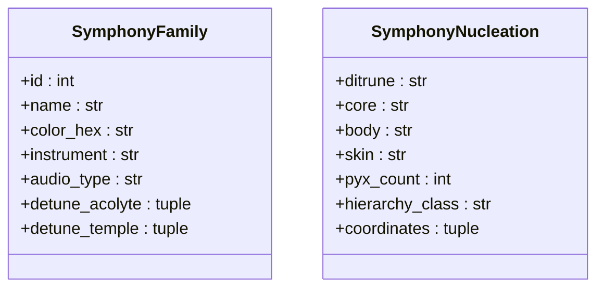

**Diagram sources **
- [symphony_config.py](file://src/pillars/tq/models/symphony_config.py#L5-L46)

**Section sources**
- [symphony_config.py](file://src/pillars/tq/models/symphony_config.py#L1-L46)

## UI Components

The TQ pillar includes several specialized UI components that provide interactive interfaces for quadset analysis, conrune pairing, and ternary conversion. These components are designed to be intuitive and informative, allowing users to explore complex QBLH patterns with ease.

### quadset_analysis_window

The `quadset_analysis_window` provides a comprehensive interface for quadset analysis, with tabs for overview, detailed member information, advanced calculations, and gematria database lookup. The window includes a visual representation of the quadset grid, with panels for each member showing decimal and ternary values. It also provides detailed property cards that display number type, factorization, factors analysis, geometric properties, and digit sum.

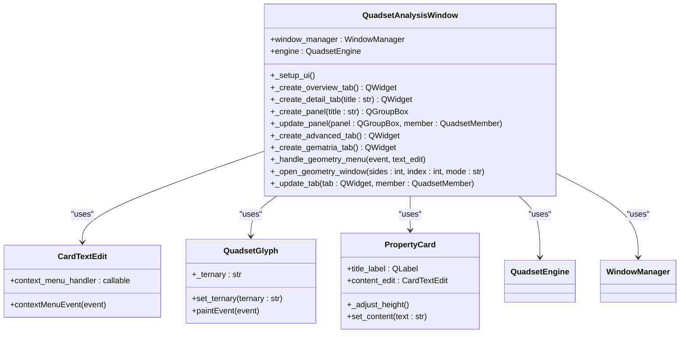

**Diagram sources **
- [quadset_analysis_window.py](file://src/pillars/tq/ui/quadset_analysis_window.py#L175-L800)

**Section sources**
- [quadset_analysis_window.py](file://src/pillars/tq/ui/quadset_analysis_window.py#L1-L800)

## CSV Data Integration

The TQ pillar integrates CSV data files to provide the source of truth for kamea grid values and ternary mappings. These files are loaded at initialization and used to populate the kamea grid service, ensuring consistency and accuracy in all grid-related operations.

### kamea_baphomet.csv Integration

The `kamea_baphomet.csv` file contains the decimal values for the 27x27 Kamea grid in a structured format. The file uses a header row for X coordinates (-13 to 13) and the first column for Y coordinates (+13 to -13), with the intersection representing the cell value. This format allows for easy parsing and mapping to the Cartesian coordinate system used in the application.

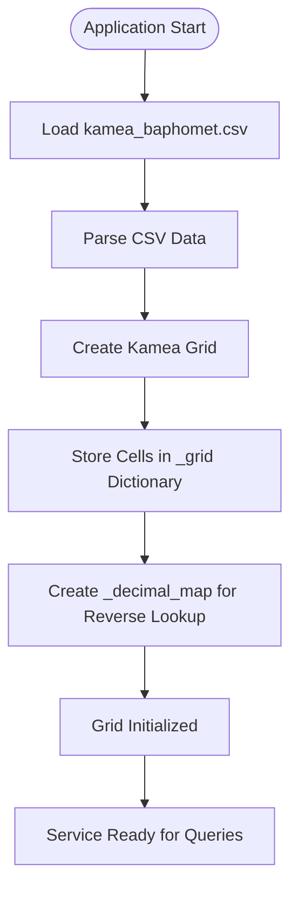

**Diagram sources **
- [kamea_baphomet_grid.csv](file://src/pillars/tq/data/kamea_baphomet_grid.csv#L1-L29)

**Section sources**
- [kamea_grid_service.py](file://src/pillars/tq/services/kamea_grid_service.py#L120-L182)

### ternary_mappings Integration

The ternary mapping files, including `kamea_baphomet_ternary.csv`, provide the ternary string representations for each cell in the Kamea grid. These files follow the same structure as the decimal CSV files, with headers for X coordinates and the first column for Y coordinates. The ternary values are used to calculate bigrams, determine cell properties, and perform conrune transformations.

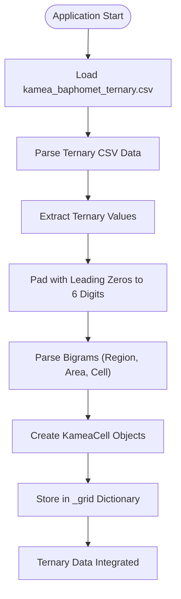

**Diagram sources **
- [kamea_baphomet_ternary.csv](file://src/pillars/tq/data/kamea_baphomet_ternary.csv#L1-L29)

**Section sources**
- [kamea_grid_service.py](file://src/pillars/tq/services/kamea_grid_service.py#L120-L182)

## Rune Pairing and Geometric Transitions

The TQ pillar implements specialized algorithms for rune pairing and geometric transitions, enabling the analysis of complex relationships between numbers and shapes. These algorithms are based on the principles of balanced ternary arithmetic and geometric transformations.

### Rune Pairing Logic

The rune pairing logic is implemented in the `conrune_pair_finder_service`, which analyzes pairs of numbers based on their difference. The service converts the difference to balanced ternary notation, where -1 is represented by a special symbol, and then maps this to the original ternary system. This allows for the identification of conrune pairs that have a specific difference, providing insights into the underlying structure of the number system.

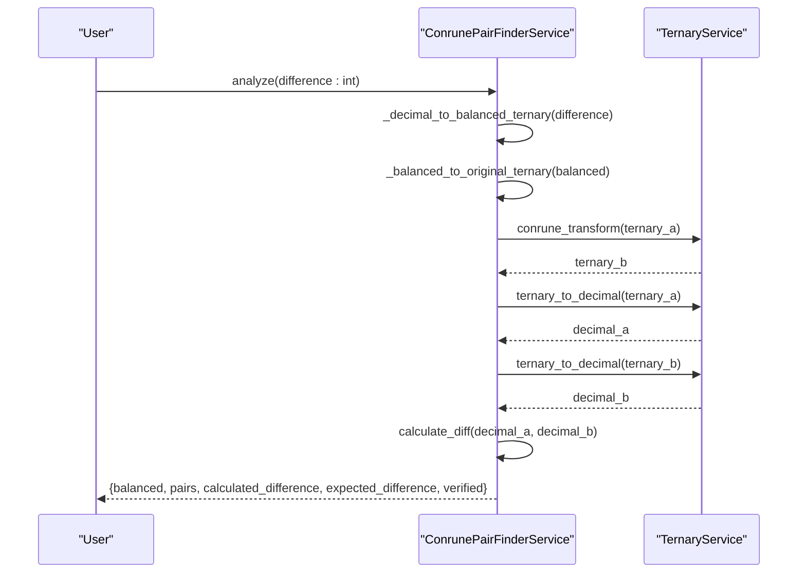

**Diagram sources **
- [conrune_pair_finder_service.py](file://src/pillars/tq/services/conrune_pair_finder_service.py#L19-L82)

**Section sources**
- [conrune_pair_finder_service.py](file://src/pillars/tq/services/conrune_pair_finder_service.py#L1-L82)

### Geometric Transition Sequences

Geometric transition sequences are generated by the `geometric_transition_service`, which creates patterns of vertex transitions on regular polygons. The service supports both skip groups (perimeter and diagonal transitions) and special sequences (predefined patterns like the Lovely Star and Mountain Star). These sequences can be used to explore the geometric relationships between numbers and their symbolic representations.

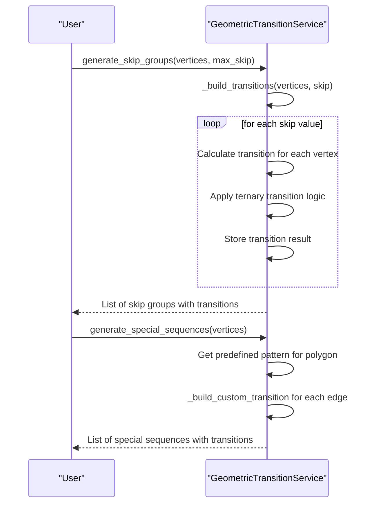

**Diagram sources **
- [geometric_transition_service.py](file://src/pillars/tq/services/geometric_transition_service.py#L127-L182)

**Section sources**
- [geometric_transition_service.py](file://src/pillars/tq/services/geometric_transition_service.py#L1-L323)

## Gematria and Sacred Geometry Integration

The TQ pillar integrates with gematria values and sacred geometry representations to provide a comprehensive analysis framework. This integration allows users to explore the relationships between numbers, words, and geometric forms, revealing deeper patterns in the QBLH system.

### Gematria Value Integration

The TQ pillar connects to gematria values through the quadset analysis window, which includes a dedicated tab for gematria database lookup. When a number is analyzed, the system queries the gematria database to find words or phrases that have the same numerical value. This allows users to explore the symbolic meaning of numbers in the context of sacred texts and esoteric traditions.

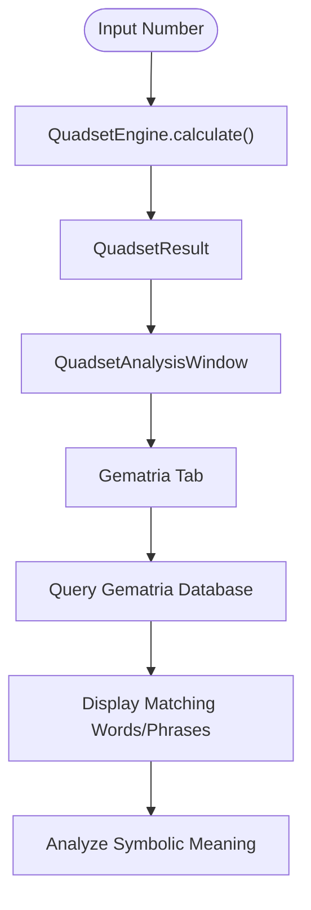

**Section sources**
- [quadset_analysis_window.py](file://src/pillars/tq/ui/quadset_analysis_window.py#L777-L800)

### Sacred Geometry Representations

Sacred geometry representations are integrated through the geometric transition service and the polygonal number visualizer. Users can explore the geometric properties of numbers, such as whether they are triangular, square, or pentagonal numbers, and visualize these shapes in the application. The system also supports the visualization of centered polygonal numbers and star numbers, providing a comprehensive view of the geometric aspects of QBLH patterns.

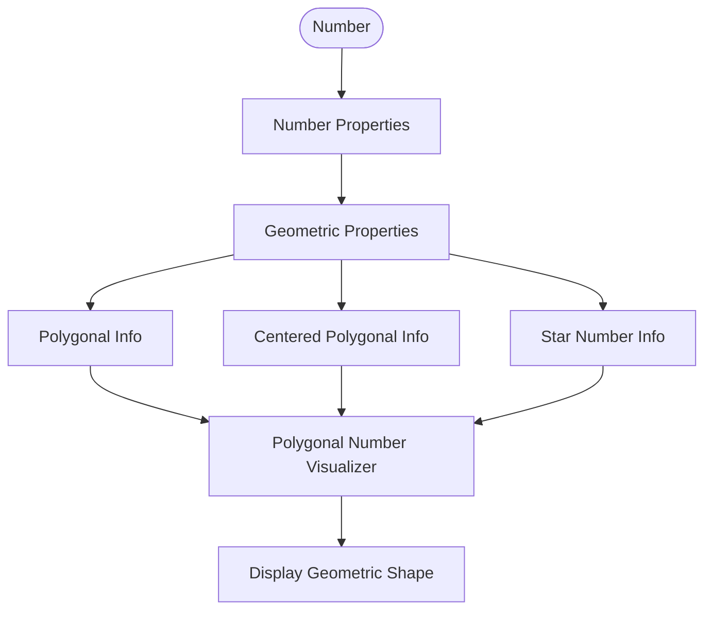

**Section sources**
- [quadset_analysis_window.py](file://src/pillars/tq/ui/quadset_analysis_window.py#L659-L687)

## Conclusion

The TQ (Trigrammaton QBLH) pillar of the isopgem application provides a comprehensive research environment for advanced QBLH pattern analysis. Through its modular architecture, specialized data models, and integrated tools, the system enables users to explore complex relationships between numbers, symbols, and sacred geometries. The central `tq_hub` controller coordinates access to various analytical tools, while the `quadset_engine`, `geometric_transition_service`, and `kamea_grid_service` handle specific aspects of pattern analysis. The integration of CSV data files ensures consistency and accuracy in grid-related operations, while the specialized UI components provide intuitive interfaces for exploring quadset analysis, conrune pairing, and ternary conversion. The connection to gematria values and sacred geometry representations further enhances the system's analytical capabilities, making it a powerful tool for researchers in the field of QBLH studies.