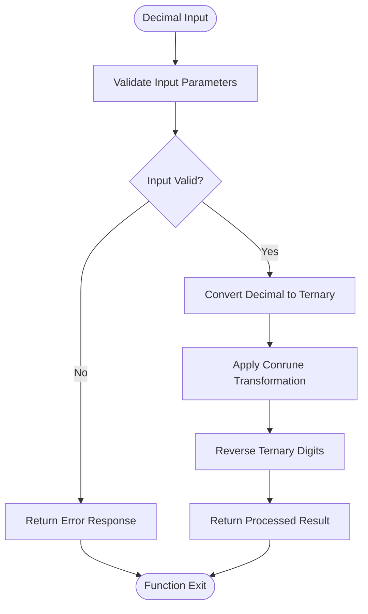
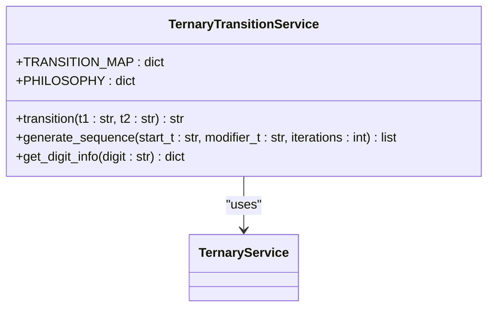
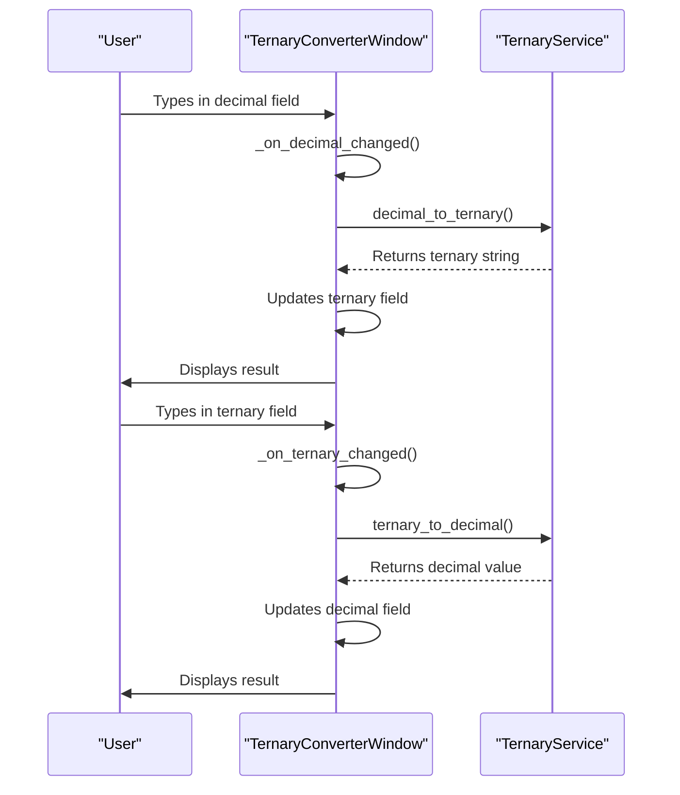
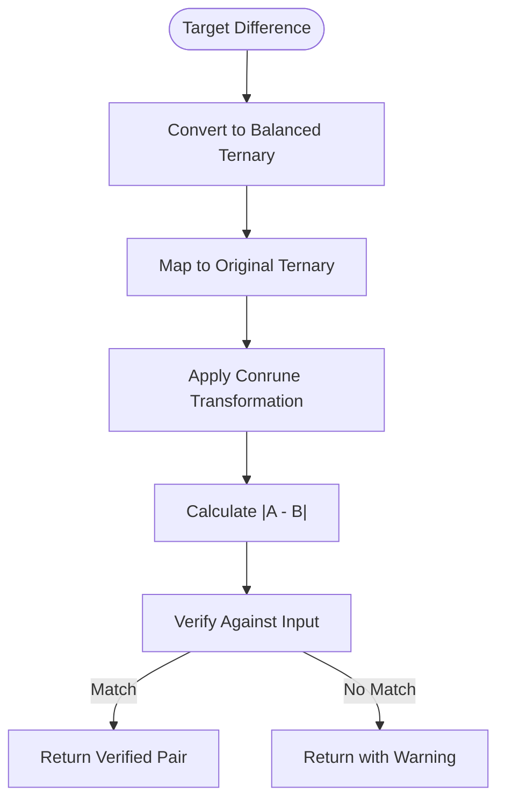
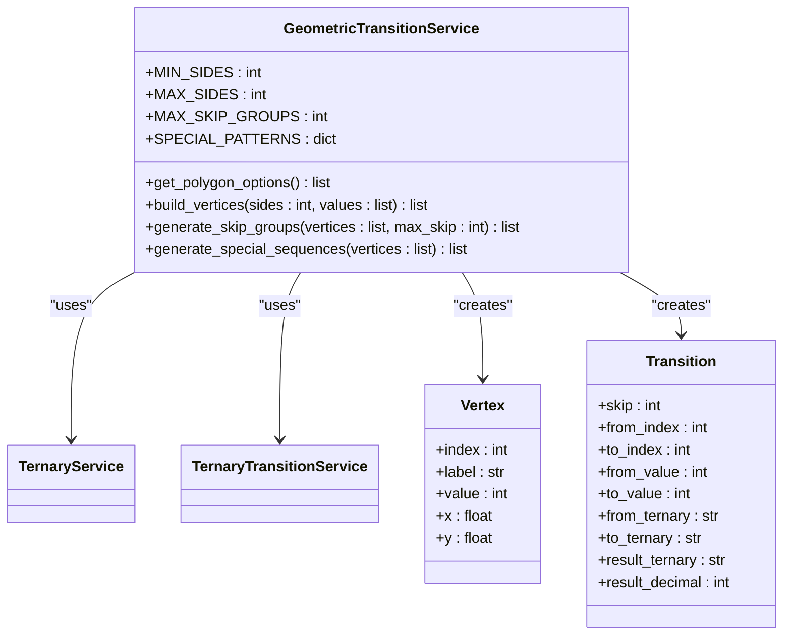
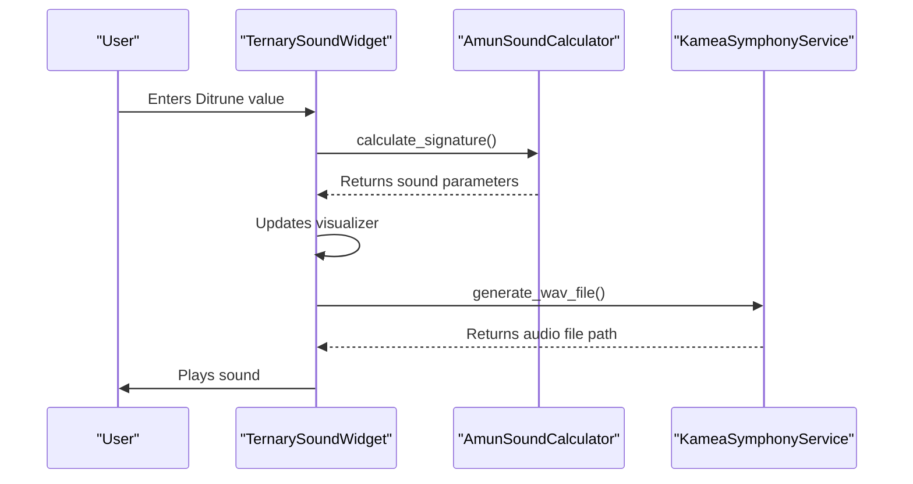
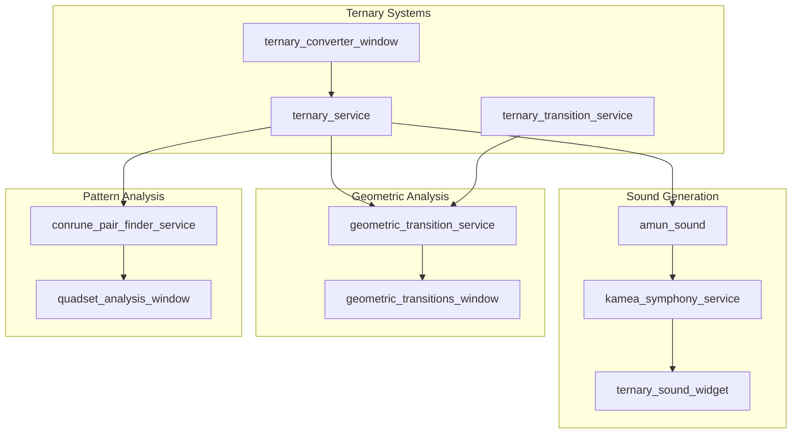

# Ternary Systems

<cite>
**Referenced Files in This Document**   
- [ternary_service.py](file://src/pillars/tq/services/ternary_service.py)
- [ternary_transition_service.py](file://src/pillars/tq/services/ternary_transition_service.py)
- [ternary_converter_window.py](file://src/pillars/tq/ui/ternary_converter_window.py)
- [kamea_baphomet_ternary.csv](file://Docs/kamea/kamea_baphomet_ternary.csv)
- [conrune_pair_finder_service.py](file://src/pillars/tq/services/conrune_pair_finder_service.py)
- [geometric_transition_service.py](file://src/pillars/tq/services/geometric_transition_service.py)
- [symphony_config.py](file://src/pillars/tq/models/symphony_config.py)
- [amun_sound.py](file://src/pillars/tq/models/amun_sound.py)
- [kamea_symphony_service.py](file://src/pillars/tq/services/kamea_symphony_service.py)
- [ternary_sound_widget.py](file://src/pillars/tq/ui/ternary_sound_widget.py)
- [kamea_cell.py](file://src/pillars/tq/models/kamea_cell.py)
- [ternary_transition_system.md](file://Docs/kamea/ternary_transition_system.md)
</cite>

## Table of Contents
1. [Introduction](#introduction)
2. [Ternary Number System Fundamentals](#ternary-number-system-fundamentals)
3. [Core Services: ternary_service and ternary_transition_service](#core-services-ternary_service-and-ternary_transition_service)
4. [Ternary Converter UI Component](#ternary-converter-ui-component)
5. [Kamea-Based Mappings and Pattern Analysis](#kamea-based-mappings-and-pattern-analysis)
6. [Conrune Pairing and Geometric Transitions](#conrune-pairing-and-geometric-transitions)
7. [Sound Generation and the Amun Sonic System](#sound-generation-and-the-amun-sonic-system)
8. [Integration with Other TQ Components](#integration-with-other-tq-components)
9. [Edge Cases and Error Handling](#edge-cases-and-error-handling)
10. [Conclusion](#conclusion)

## Introduction
The Ternary Systems subsystem is a foundational component of the TQ pillar, providing the mathematical and philosophical framework for base-3 numerical transformations. This system extends beyond simple arithmetic to create a rich, qualitative model for analyzing patterns, generating sound, and exploring geometric relationships. At its core, the system converts decimal values to ternary representations and applies sophisticated mappings based on the kamea_baphomet_ternary.csv data. The implementation revolves around two primary services—`ternary_service` and `ternary_transition_service`—which handle the conversion logic and philosophical transitions between ternary digits. The system is accessible through the `ternary_converter_window` UI component, which provides an interactive tool for users to explore these transformations. This document will thoroughly explain the algorithms, data flows, and integrations that make up this subsystem, providing both beginner-friendly explanations and technical depth for developers.

## Ternary Number System Fundamentals
The Ternary Systems subsystem operates on base-3 (ternary) numbers, which use only the digits 0, 1, and 2. This system provides a more nuanced representation than binary by introducing a third state that represents equilibrium or the "included middle." Each digit in the ternary system carries both mathematical and philosophical significance, forming the foundation for all transformations within the TQ pillar.

### Mathematical Representation
In the ternary system, each digit position represents a power of 3, similar to how decimal positions represent powers of 10. For example, the ternary number "120" represents (1 × 3²) + (2 × 3¹) + (0 × 3⁰) = 9 + 6 + 0 = 15 in decimal. The system handles both positive and negative numbers, with negative values represented by a leading minus sign, consistent with standard mathematical notation.

### Philosophical Significance
The three digits in the ternary system are imbued with deep philosophical meaning, drawing from Taoist principles:

| Digit | Mathematical Role | Philosophical Meaning | Force of Motion |
|-------|-------------------|------------------------|-----------------|
| 0 | Zero / None | Tao (Pyx) - The void, undifferentiated whole | Equilibrium / Rest |
| 1 | One / Single | Yang (Vertex) - Active principle, expansion | Outward motion |
| 2 | Two / Pair | Yin (Nexus) - Receptive principle, contraction | Inward motion |

This philosophical framework transforms the ternary system from a mere mathematical tool into a comprehensive model for understanding dynamic relationships and transformations. The digit "0" represents the Tao, the undifferentiated source from which all things emerge. The digit "1" embodies the Yang principle of active expansion and outward motion, while "2" represents the Yin principle of receptive contraction and inward motion. This triadic structure allows for a more complete representation of reality than binary systems, which force phenomena into dualistic oppositions.

## Core Services: ternary_service and ternary_transition_service
The `ternary_service` and `ternary_transition_service` classes form the computational backbone of the Ternary Systems subsystem, implementing the core algorithms for number conversion and philosophical transformation.

### ternary_service Implementation
The `TernaryService` class provides fundamental operations for converting between decimal and ternary representations. The `decimal_to_ternary` method converts a decimal integer to its ternary string equivalent by repeatedly dividing the number by 3 and collecting the remainders. This algorithm handles negative numbers by preserving the sign while processing the absolute value. The reverse operation, `ternary_to_decimal`, uses Python's built-in `int()` function with base 3 to convert a ternary string back to decimal, with validation to ensure only valid ternary characters (0, 1, 2) are present.

The service also implements specialized transformations like `conrune_transform`, which applies a specific mapping where 0→0, 1→2, and 2→1. This transformation is used to generate Conrune pairs, where each number has a counterpart that represents its philosophical opposite. The `reverse_ternary` method simply reverses the digit order of a ternary string, preserving any negative sign at the beginning.



**Diagram sources**
- [ternary_service.py](file://src/pillars/tq/services/ternary_service.py#L6-L113)

**Section sources**
- [ternary_service.py](file://src/pillars/tq/services/ternary_service.py#L3-L113)

### ternary_transition_service Implementation
The `TernaryTransitionService` implements a sophisticated transformation system based on a 3×3 transition map that defines how pairs of ternary digits interact. This service goes beyond quantitative calculation to create a qualitative transformation framework with roots in Taoist philosophy.

The core transition map is defined as:
```
(0,0) → 0    (1,0) → 2    (2,0) → 1
(0,1) → 2    (1,1) → 1    (2,1) → 0
(0,2) → 1    (1,2) → 0    (2,2) → 2
```

The `transition` method takes two ternary numbers as input and produces a new ternary number by applying this map to each corresponding digit pair. When the input numbers have different lengths, the service pads the shorter number with leading zeros to ensure proper alignment. This allows transition operations between any two ternary numbers regardless of length.

The service also provides a `generate_sequence` method that applies the transition operation repeatedly, creating interesting patterns such as cycles, fixed points, or complex sequences. For example, applying transitions to "220" and "111" creates a 2-cycle: 002 → 220 → 002.



**Diagram sources**
- [ternary_transition_service.py](file://src/pillars/tq/services/ternary_transition_service.py#L4-L69)

**Section sources**
- [ternary_transition_service.py](file://src/pillars/tq/services/ternary_transition_service.py#L1-L69)
- [ternary_transition_system.md](file://Docs/kamea/ternary_transition_system.md#L1-L158)

## Ternary Converter UI Component
The `ternary_converter_window` provides an interactive interface for users to explore the ternary conversion system. This PyQt6-based window allows users to enter decimal or ternary numbers and see the corresponding conversion in real-time.

### User Interface Design
The converter window features a clean, intuitive layout with two main sections: a decimal input field and a ternary input field, connected by a double-headed arrow symbol (⇅) to indicate bidirectional conversion. The interface includes proper error handling, displaying validation messages when invalid input is detected (e.g., non-numeric characters in the decimal field or digits other than 0, 1, 2 in the ternary field).

The window's event-driven architecture ensures that changes in one input field automatically update the other. When a user types in the decimal field, the `_on_decimal_changed` method converts the value to ternary using the `TernaryService` and updates the ternary field. Similarly, changes in the ternary field trigger the `_on_ternary_changed` method to convert back to decimal. To prevent recursive updates, the code temporarily blocks signals when programmatically setting field values.

### Implementation Details
The `TernaryConverterWindow` class inherits from `QMainWindow` and initializes with a reference to the `TernaryService` for conversion operations. The `_setup_ui` method constructs the entire interface, including styling with CSS-like syntax for visual consistency. The clear button resets both input fields and the status label, providing a simple way to start over.



**Diagram sources**
- [ternary_converter_window.py](file://src/pillars/tq/ui/ternary_converter_window.py#L12-L153)

**Section sources**
- [ternary_converter_window.py](file://src/pillars/tq/ui/ternary_converter_window.py#L1-L153)

## Kamea-Based Mappings and Pattern Analysis
The Ternary Systems subsystem incorporates sophisticated pattern analysis through kamea-based mappings, particularly using the `kamea_baphomet_ternary.csv` dataset. This file contains a 28×27 grid of 6-digit ternary strings that form the basis for advanced pattern recognition and transformation.

### kamea_baphomet_ternary.csv Structure
The CSV file contains 28 rows, each with 27 comma-separated 6-digit ternary strings. These strings represent a complex mapping system where each position in the grid corresponds to a specific transformation or pattern. The data appears to be organized in a way that facilitates geometric and numerical analysis, with patterns that repeat and transform across rows and columns.

The ternary strings in this file are used to generate Conrune pairs and analyze geometric transitions. Each 6-digit string can be interpreted as a Ditrune, which is central to the Amun sonic system and other TQ components. The patterns in this file enable the system to identify meaningful relationships between different numerical representations and their philosophical interpretations.

### Pattern Recognition Algorithms
The system uses the kamea data to identify and analyze patterns in ternary sequences. For example, the `geometric_transition_service` uses these patterns to generate special sequences like the "Lovely Star," "Mountain Star," and "Atomic Star" heptagrams. These predefined patterns represent significant geometric configurations that have specific philosophical meanings.

The pattern analysis extends to identifying cycles and fixed points in transition sequences. By applying the ternary transition operation repeatedly, the system can determine whether a given input converges to a stable state, oscillates between values, or generates an infinitely complex sequence. This analysis is crucial for understanding the long-term behavior of ternary transformations and their philosophical implications.

**Section sources**
- [kamea_baphomet_ternary.csv](file://Docs/kamea/kamea_baphomet_ternary.csv#L1-L28)

## Conrune Pairing and Geometric Transitions
The Ternary Systems subsystem implements sophisticated algorithms for generating Conrune pairs and analyzing geometric transitions, creating a bridge between numerical computation and spatial representation.

### Conrune Pair Generation
The `conrune_pair_finder_service` implements an algorithm that generates Conrune pairs based on a target difference value. The process begins by converting the input difference to balanced ternary notation, where digits can be -1, 0, or 1 (represented as "-", "0", "1"). This balanced representation is then mapped to the original ternary system, where -1 becomes 1, 0 remains 0, and 1 becomes 2.

The service then applies the `conrune_transform` to generate the Conrune counterpart, creating a pair of numbers that have a specific mathematical relationship. The system verifies that the absolute difference between the decimal values of the pair matches the original input difference, ensuring the integrity of the transformation.



**Diagram sources**
- [conrune_pair_finder_service.py](file://src/pillars/tq/services/conrune_pair_finder_service.py#L19-L81)

**Section sources**
- [conrune_pair_finder_service.py](file://src/pillars/tq/services/conrune_pair_finder_service.py#L1-L81)
- [conrune_pair_finder_window.py](file://src/pillars/tq/ui/conrune_pair_finder_window.py#L30-L397)

### Geometric Transitions
The `geometric_transition_service` extends the ternary system into the geometric domain by generating transitions on regular polygons with 3 to 27 sides. This service creates a visual representation of ternary transformations by mapping numbers to vertices on a polygon and drawing connections between them.

The service supports multiple types of transitions:
- **Perimeter transitions**: Connections between adjacent vertices (skip=1)
- **Diagonal transitions**: Connections with larger skips (skip=2 to skip=13)
- **Special patterns**: Predefined sequences like the "Lovely Star" heptagram

For each transition, the service calculates the ternary representations of the source and target vertex values, applies the ternary transition operation, and stores the result. This creates a rich dataset that combines numerical computation with geometric visualization, allowing users to explore the interplay between number theory and spatial relationships.



**Diagram sources**
- [geometric_transition_service.py](file://src/pillars/tq/services/geometric_transition_service.py#L38-L322)

**Section sources**
- [geometric_transition_service.py](file://src/pillars/tq/services/geometric_transition_service.py#L1-L322)
- [geometric_transitions_window.py](file://src/pillars/tq/ui/geometric_transitions_window.py#L127-L874)

## Sound Generation and the Amun Sonic System
The Ternary Systems subsystem integrates with the Amun sonic system to generate sound based on ternary patterns, creating a direct link between numerical computation and auditory experience.

### Ditrune-Based Sound Synthesis
The `amun_sound` model implements a nucleation-based synthesis engine that translates 6-digit ternary numbers (Ditrunes) into complex acoustic events. Each Ditrune is parsed into three concentric layers that correspond to different aspects of sound:

| Layer | Lines | Channel | Function |
| :---- | :---- | :---- | :---- |
| **Outer** | Lines 1 & 6 | **Red** | Determines the fundamental frequency (Octave). |
| **Inner** | Lines 2 & 5 | **Green** | Determines the amplitude envelope (Attack/Sustain). |
| **Core** | Lines 3 & 4 | **Blue** | Determines the waveform purity (Stability). |

The `AmunSoundCalculator` processes a decimal value by first converting it to a 6-digit ternary string. It then extracts three bigrams from this string: the outer pair (digits 1 and 6), the middle pair (digits 2 and 5), and the inner pair (digits 3 and 4). Each bigram is used to determine specific sound parameters:

- **Red channel (Pitch)**: Maps to specific musical notes and frequencies
- **Green channel (Dynamics)**: Determines attack and release times
- **Blue channel (Timbre)**: Controls harmonic density and instrument type

### Symphony Configuration
The `symphony_config` module defines nine orchestral archetypes, each associated with a specific 2-digit ternary code. These archetypes determine the instrument and audio characteristics for sound generation:

| Code | Name | Instrument | Audio Type |
|------|------|------------|------------|
| '00' | Void | Cosmic Breath | Ambient |
| '01' | Pulse | Taiko & Sub | Percussive |
| '02' | Recoil | String Ensemble | Sustained |
| '10' | Projector | Cinematic Brass | Brassy |
| '11' | Monolith | Cathedral Organ | Additive |
| '12' | Weaver | Woodwinds | Reedy |
| '20' | Receiver | Spectral Choir | Formant |
| '21' | Splicer | Crystalline Pluck | Plucked |
| '22' | Abyss | Dark Matter Drone | Bass |

The `KameaSymphonyService` uses these configurations to generate high-quality audio with realistic instrument characteristics, reverb, and panning effects. The service can generate individual notes, sequences, or chords by combining multiple nucleation events.



**Diagram sources**
- [amun_sound.py](file://src/pillars/tq/models/amun_sound.py#L6-L196)
- [symphony_config.py](file://src/pillars/tq/models/symphony_config.py#L4-L45)
- [kamea_symphony_service.py](file://src/pillars/tq/services/kamea_symphony_service.py#L11-L209)
- [ternary_sound_widget.py](file://src/pillars/tq/ui/ternary_sound_widget.py#L337-L385)

**Section sources**
- [amun_sound.py](file://src/pillars/tq/models/amun_sound.py#L1-L196)
- [symphony_config.py](file://src/pillars/tq/models/symphony_config.py#L1-L45)
- [kamea_symphony_service.py](file://src/pillars/tq/services/kamea_symphony_service.py#L1-L209)
- [ternary_sound_widget.py](file://src/pillars/tq/ui/ternary_sound_widget.py#L1-L385)
- [ditrune sonic system.md](file://Docs/ditrune sonic system.md#L1-L119)

## Integration with Other TQ Components
The Ternary Systems subsystem is deeply integrated with other components of the TQ pillar, creating a cohesive ecosystem for numerical, geometric, and auditory analysis.

### Quadset Analysis Integration
The ternary system serves as the foundation for quadset analysis, where numbers are grouped into sets of four based on their ternary representations. The `kamea_grid_service` uses the ternary patterns to identify geometric siblings and create chord structures. When a user inputs a number in the `conrune_pair_finder_window`, they can send the result to the `quadset_analysis_window` for further exploration of its relationships with other numbers.

The integration is facilitated through shared data models like `KameaCell`, which represents a single cell in the 27×27 Kamea grid. Each cell contains its Cartesian coordinates, ternary value, decimal value, bigrams, and family ID, providing a rich data structure that connects numerical, geometric, and categorical information.

### Geometric and Visual Integration
The ternary system is also integrated with geometric visualization components through the `geometric_transitions_window`. This window displays a polygon with vertices labeled by their values, allowing users to visualize the transitions generated by the ternary system. The canvas highlights specific skip groups or special patterns, creating an interactive bridge between abstract computation and concrete visualization.

The `kamea_fractal_view` and `kamea_grid_view` components use the ternary patterns to generate fractal structures and grid layouts, respectively. These visualizations help users identify higher-order patterns and symmetries in the data that might not be apparent from numerical analysis alone.



**Diagram sources**
- [kamea_cell.py](file://src/pillars/tq/models/kamea_cell.py#L4-L58)

**Section sources**
- [kamea_cell.py](file://src/pillars/tq/models/kamea_cell.py#L1-L58)

## Edge Cases and Error Handling
The Ternary Systems subsystem includes comprehensive error handling to manage edge cases and ensure robust operation across all components.

### Numerical Edge Cases
The system handles several numerical edge cases in the conversion algorithms:
- **Zero input**: The `decimal_to_ternary` method returns "0" for input 0, avoiding an empty result
- **Negative numbers**: Both conversion methods preserve the negative sign while processing the absolute value
- **Invalid ternary characters**: The `ternary_to_decimal` method validates input and raises a `ValueError` if characters other than 0, 1, 2 are present
- **Empty strings**: Conversion methods handle empty inputs by returning appropriate default values

The `conrune_pair_finder_service` includes additional validation for balanced ternary conversion, ensuring that the final digit mapping produces valid results. The service verifies that the calculated difference between Conrune pairs matches the expected difference, providing feedback when discrepancies occur.

### UI Error Handling
The user interface components implement robust error handling to provide clear feedback to users:
- **Input validation**: Fields display error messages when invalid input is detected
- **Signal blocking**: The converter window blocks signals when programmatically updating fields to prevent infinite loops
- **Graceful degradation**: When integration with other components fails (e.g., window manager not available), the system disables related functionality rather than crashing
- **Status feedback**: Components provide visual feedback about operation status, such as verification results in the Conrune pair finder

These error handling mechanisms ensure that the system remains stable and user-friendly, even when presented with unexpected inputs or operating conditions.

**Section sources**
- [ternary_service.py](file://src/pillars/tq/services/ternary_service.py#L47-L62)
- [ternary_converter_window.py](file://src/pillars/tq/ui/ternary_converter_window.py#L122-L147)
- [conrune_pair_finder_service.py](file://src/pillars/tq/services/conrune_pair_finder_service.py#L27-L48)

## Conclusion
The Ternary Systems subsystem of the TQ pillar provides a comprehensive framework for base-3 numerical transformations that integrates mathematical computation with philosophical interpretation. Through the `ternary_service` and `ternary_transition_service`, the system implements robust algorithms for converting between decimal and ternary representations and applying sophisticated transformation rules. The `ternary_converter_window` provides an accessible interface for users to explore these concepts interactively.

The system's integration with kamea-based mappings, particularly through the `kamea_baphomet_ternary.csv` data, enables advanced pattern analysis and geometric transitions. This foundation supports higher-level applications like Conrune pairing and the Amun sonic system, where ternary patterns are used to generate sound and analyze relationships between numbers.

The subsystem demonstrates a thoughtful balance between accessibility for beginners and technical depth for experienced developers. The clear separation of concerns between services, models, and UI components makes the system maintainable and extensible. Comprehensive error handling ensures robust operation across edge cases, while the integration with other TQ components creates a cohesive ecosystem for numerical, geometric, and auditory analysis.

This documentation provides a thorough understanding of the Ternary Systems subsystem, from its fundamental algorithms to its practical applications, serving as a valuable resource for both new users and developers working with the TQ pillar.