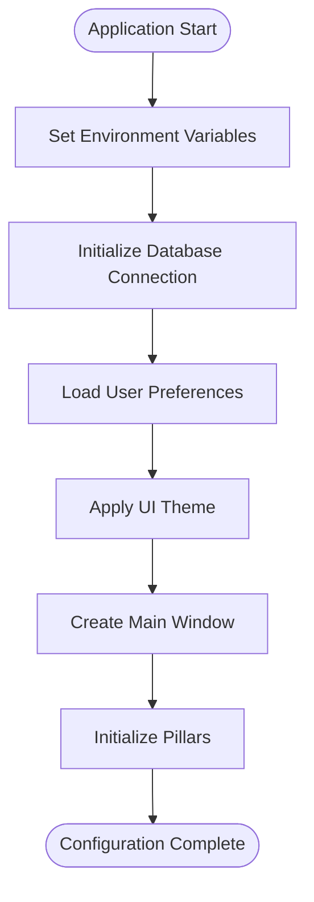
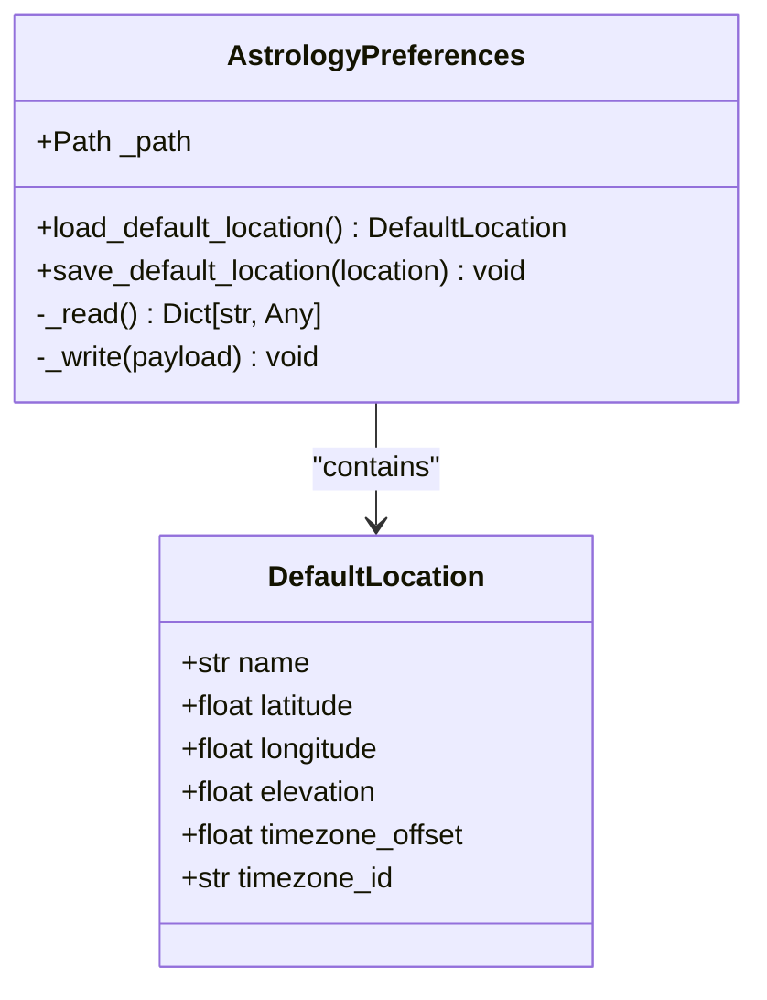
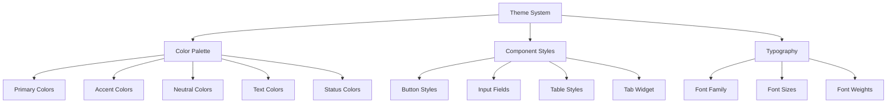
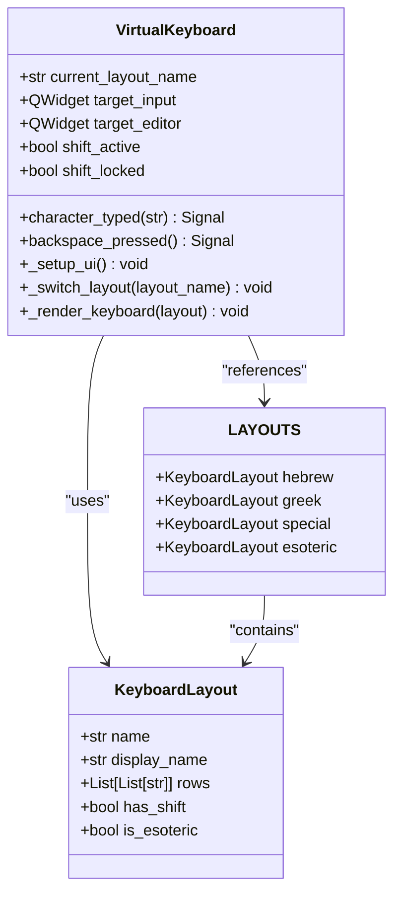
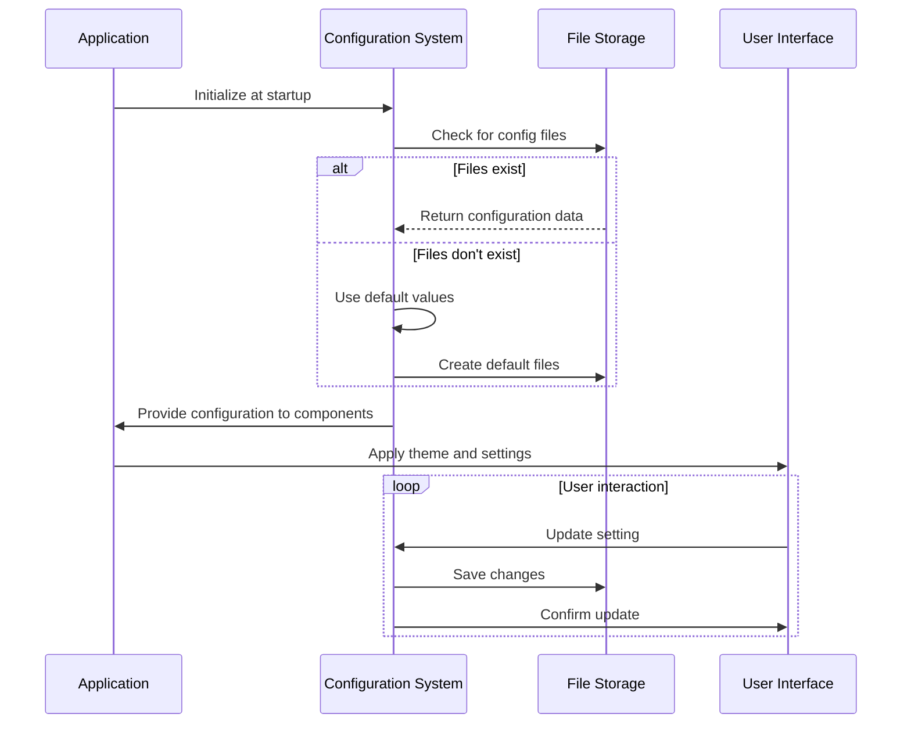
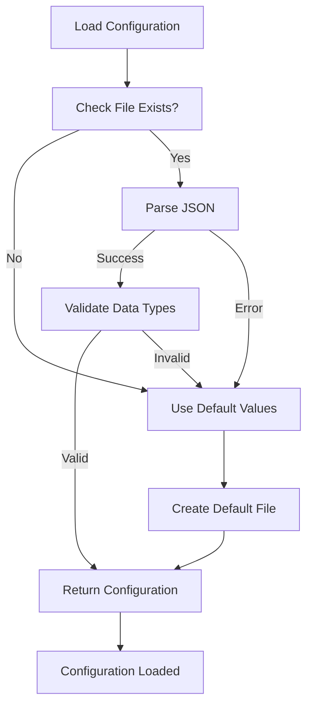

# Configuration

<cite>
**Referenced Files in This Document**   
- [preferences.py](file://src/pillars/astrology/utils/preferences.py)
- [theme.py](file://src/shared/ui/theme.py)
- [keyboard_layouts.py](file://src/shared/ui/keyboard_layouts.py)
- [virtual_keyboard.py](file://src/shared/ui/virtual_keyboard.py)
- [astrology_prefs.json](file://src/data/astrology_prefs.json)
- [database.py](file://src/shared/database.py)
</cite>

## Table of Contents
1. [Introduction](#introduction)
2. [Configuration File Structure and Location](#configuration-file-structure-and-location)
3. [Application Settings Management](#application-settings-management)
4. [User Preferences System](#user-preferences-system)
5. [UI Customization and Theme Settings](#ui-customization-and-theme-settings)
6. [Keyboard Layout Configurations](#keyboard-layout-configurations)
7. [Service-Specific Configuration Parameters](#service-specific-configuration-parameters)
8. [Configuration Loading and Runtime Management](#configuration-loading-and-runtime-management)
9. [Configuration Validation and Error Handling](#configuration-validation-and-error-handling)
10. [Custom Configuration Profiles and Sharing](#custom-configuration-profiles-and-sharing)
11. [Troubleshooting Configuration Issues](#troubleshooting-configuration-issues)
12. [Best Practices for Deployment Environments](#best-practices-for-deployment-environments)

## Introduction
The isopgem application implements a comprehensive configuration system that manages application settings, user preferences, UI customization, and service-specific parameters across its various pillars. The configuration system is designed to provide flexibility while maintaining consistency across the application's esoteric analysis domains including Gematria, Astrology, Geometry, and TQ (Theosophical Quotient) calculations. This document details the complete configuration architecture, covering file structure, loading mechanisms, customization options, and best practices for managing configuration in different environments.

## Configuration File Structure and Location
The isopgem application organizes configuration files in a structured directory hierarchy with specific locations for different types of configuration data. The primary configuration directory is located at `src/config/` in the project root, while runtime configuration files are stored in the `data/` directory.

The main configuration components include:
- **User preferences**: Stored in JSON format in the `data/` directory
- **UI themes**: Defined in Python modules within `src/shared/ui/`
- **Keyboard layouts**: Configured in Python data structures in `src/shared/ui/`
- **Database configuration**: Managed through SQLAlchemy in `src/shared/database.py`

Runtime configuration files are created automatically on first launch, with the `data/` directory serving as the primary location for user-specific settings. The application ensures this directory exists by creating it during initialization if it doesn't already exist.

**Section sources**
- [database.py](file://src/shared/database.py#L14-L17)
- [preferences.py](file://src/pillars/astrology/utils/preferences.py#L9-L11)

## Application Settings Management
The isopgem application manages application settings through a combination of code-based configuration and persistent storage. The core application settings are initialized in the main application entry point (`main.py`) and include window management, database initialization, and pillar registration.

Application settings are managed through several mechanisms:
- **Environment variables**: Used for platform-specific configuration (e.g., Qt platform selection)
- **Code-based defaults**: Hardcoded default values for application behavior
- **Runtime configuration**: User-modifiable settings stored in JSON files
- **Database connections**: Configuration for the SQLite database backend

The application sets specific environment variables at startup, such as `QT_QPA_PLATFORM=xcb` to ensure stable Qt operation across different platforms. Database settings are configured programmatically, with the database path resolved relative to the project root to ensure consistent behavior regardless of the current working directory.

**Diagram sources**
- [main.py](file://src/main.py#L8-L11)
- [database.py](file://src/shared/database.py#L14-L20)

**Section sources**
- [main.py](file://src/main.py#L1-L156)
- [database.py](file://src/shared/database.py#L1-L53)

## User Preferences System
The isopgem application implements a modular preferences system that allows different pillars to manage their own configuration independently. The system is exemplified by the astrology pillar's preferences implementation, which provides a clean API for storing and retrieving user settings.

The preferences system follows these key principles:
- **JSON-based storage**: All user preferences are stored in human-readable JSON format
- **Modular design**: Each pillar can implement its own preferences class
- **Automatic directory creation**: Configuration directories are created on demand
- **Error resilience**: Invalid configuration files are handled gracefully with fallback to defaults

The astrology preferences system demonstrates this approach with the `AstrologyPreferences` class, which manages default location settings including name, coordinates, elevation, and timezone information. The system uses Python's dataclasses for type safety and provides methods for loading and saving preferences with proper error handling.

**Diagram sources**
- [preferences.py](file://src/pillars/astrology/utils/preferences.py#L24-L59)

**Section sources**
- [preferences.py](file://src/pillars/astrology/utils/preferences.py#L1-L59)
- [astrology_prefs.json](file://src/data/astrology_prefs.json#L1-L10)

## UI Customization and Theme Settings
The isopgem application provides extensive UI customization through a comprehensive theme system implemented in the `theme.py` module. The theme system defines a complete visual language for the application, including color palettes, typography, and component styling.

The theme configuration includes:
- **Color palette**: A comprehensive set of named colors for different UI elements
- **Component styles**: Detailed styling for buttons, input fields, tables, and other widgets
- **Typography**: Font family and size definitions for consistent text rendering
- **Layout properties**: Spacing, padding, and border radius values

The color system is organized into logical groups including primary colors, accent colors, neutral backgrounds, text colors, borders, and status indicators. These colors are used consistently across all UI components to maintain visual harmony. The theme is applied application-wide through a QSS (Qt Style Sheets) stylesheet that is loaded at startup.

**Diagram sources**
- [theme.py](file://src/shared/ui/theme.py#L4-L372)

**Section sources**
- [theme.py](file://src/shared/ui/theme.py#L1-L372)
- [main.py](file://src/main.py#L133)

## Keyboard Layout Configurations
The isopgem application supports multiple keyboard layouts through a flexible configuration system implemented in the `keyboard_layouts.py` module. This system enables input in various esoteric scripts and special characters required for the application's analytical functions.

The keyboard layout system includes the following configurations:
- **Hebrew layout**: Standard Hebrew alphabet characters
- **Greek layout**: Greek alphabet with shift functionality
- **Special layout**: Mathematical and symbolic characters
- **Esoteric layout**: Astrological, alchemical, and zodiac symbols

Each layout is defined as a dataclass instance with properties for the layout name, display name, key rows, and special features like shift support. The layouts are registered in a central dictionary for easy access by the virtual keyboard component. The system separates layout data from UI logic, allowing for easy extension and modification of keyboard configurations.

**Diagram sources**
- [keyboard_layouts.py](file://src/shared/ui/keyboard_layouts.py#L8-L69)
- [virtual_keyboard.py](file://src/shared/ui/virtual_keyboard.py#L15-L379)

**Section sources**
- [keyboard_layouts.py](file://src/shared/ui/keyboard_layouts.py#L1-L69)
- [virtual_keyboard.py](file://src/shared/ui/virtual_keyboard.py#L1-L379)

## Service-Specific Configuration Parameters
The isopgem application implements service-specific configuration parameters for each of its analytical pillars. These configurations are tailored to the specific requirements of each domain while maintaining a consistent approach to settings management.

### Astrology Engine Configuration
The astrology pillar configuration focuses on astronomical and geographical parameters:
- Default location settings (name, coordinates, elevation)
- Timezone configuration (offset and ID)
- Ephemeris data sources
- Chart calculation preferences

### Gematria Calculators Configuration
The gematria system configuration includes:
- Alphabet mapping tables
- Calculation method preferences
- Text analysis rules
- Reference text sources

### Geometry Visualization Configuration
The geometry pillar settings manage:
- 3D rendering parameters
- Coordinate system preferences
- Shape generation rules
- Visualization quality settings

### TQ System Configuration
The TQ (Theosophical Quotient) system configuration handles:
- Kamea grid parameters
- Cipher correspondence tables
- Symphony analysis rules
- Transition algorithms

Each pillar implements its own configuration class with methods for loading, saving, and validating settings. This modular approach allows each analytical domain to evolve independently while maintaining a consistent user experience.

**Section sources**
- [preferences.py](file://src/pillars/astrology/utils/preferences.py#L1-L59)
- [symphony_config.py](file://src/pillars/tq/models/symphony_config.py)

## Configuration Loading and Runtime Management
The isopgem application follows a systematic approach to configuration loading and runtime management. The process begins at application startup and continues throughout the application lifecycle.

The configuration loading sequence is as follows:
1. **Environment setup**: Initialize environment variables for platform compatibility
2. **Database initialization**: Establish database connection and create tables if needed
3. **Theme application**: Load and apply the UI theme stylesheet
4. **Preferences loading**: Read user preferences from JSON files
5. **Pillar initialization**: Configure each analytical pillar with appropriate settings

Runtime configuration management is handled through event-driven updates and user interactions. When users modify settings through the UI, the application immediately updates the in-memory configuration and persists changes to disk. The window manager coordinates configuration changes across related components, ensuring consistency throughout the application.

The application also implements a singleton pattern for certain configuration components, such as the virtual keyboard, to ensure consistent behavior across different parts of the application. This approach reduces memory usage and prevents configuration conflicts between different UI elements.

**Diagram sources**
- [main.py](file://src/main.py#L113-L156)
- [preferences.py](file://src/pillars/astrology/utils/preferences.py#L46-L58)
- [database.py](file://src/shared/database.py#L25-L29)

**Section sources**
- [main.py](file://src/main.py#L1-L156)
- [preferences.py](file://src/pillars/astrology/utils/preferences.py#L1-L59)
- [database.py](file://src/shared/database.py#L1-L53)

## Configuration Validation and Error Handling
The isopgem application implements robust configuration validation and error handling to ensure reliability and user experience. The system anticipates potential configuration issues and provides appropriate fallback mechanisms.

Key validation and error handling features include:
- **File existence checks**: Verify configuration files exist before attempting to read them
- **JSON parsing validation**: Handle malformed JSON gracefully with fallback to defaults
- **Type checking**: Validate data types when loading preferences
- **Directory creation**: Automatically create configuration directories as needed
- **Error logging**: Record configuration issues for debugging purposes

When loading preferences, the system first checks if the configuration file exists. If the file is missing, an empty dictionary is returned, effectively using default values. If the file exists but contains invalid JSON, the system catches the parsing exception and returns an empty dictionary as a fallback. This ensures the application can start even with corrupted configuration files.

For data validation, the system uses Python's dataclasses with type hints to ensure proper data structure. When loading complex objects like the `DefaultLocation`, the system wraps the instantiation in a try-except block to handle potential TypeError exceptions that might occur if the JSON structure doesn't match the expected format.

**Diagram sources**
- [preferences.py](file://src/pillars/astrology/utils/preferences.py#L47-L58)

**Section sources**
- [preferences.py](file://src/pillars/astrology/utils/preferences.py#L1-L59)

## Custom Configuration Profiles and Sharing
The isopgem application supports custom configuration profiles through its modular preferences system, allowing users to create and manage different settings configurations for various use cases. While the current implementation focuses on a single user preferences file per pillar, the architecture supports extension to multiple profiles.

The foundation for custom profiles is established through:
- **Modular preferences classes**: Each pillar has its own preferences class that could be extended to support multiple profiles
- **Named configuration files**: The system uses specific file names that could be parameterized to support profile naming
- **Programmatic configuration loading**: The ability to specify a custom path when initializing preferences

For sharing settings between users, the JSON-based configuration format enables easy transfer of preferences. Users can share their configuration files directly, allowing others to adopt their settings for specific analytical approaches. The human-readable JSON format makes it possible to manually edit and customize shared configurations.

Potential extensions to enhance profile management could include:
- Profile naming and selection UI
- Import/export functionality for sharing configurations
- Versioning of configuration files
- Cloud synchronization options
- Template configurations for common use cases

**Section sources**
- [preferences.py](file://src/pillars/astrology/utils/preferences.py#L27-L28)
- [astrology_prefs.json](file://src/data/astrology_prefs.json)

## Troubleshooting Configuration Issues
When encountering configuration-related issues in isopgem, users and administrators can follow these troubleshooting steps:

### Common Issues and Solutions
1. **Application fails to start**
   - Check if the `data/` directory is writable
   - Verify that configuration files are not corrupted
   - Ensure proper file permissions

2. **Settings not persisting**
   - Confirm the application has write permissions to the configuration directory
   - Check if the disk is full
   - Verify that the configuration files are not read-only

3. **Theme not applying correctly**
   - Ensure the theme module is properly imported
   - Check for syntax errors in the stylesheet
   - Verify that the stylesheet is being applied to the correct components

4. **Preferences not loading**
   - Validate the JSON syntax in configuration files
   - Check if the file path is correct
   - Ensure the file is not locked by another process

### Diagnostic Steps
1. **Check configuration file locations**:
   - User preferences: `data/astrology_prefs.json`
   - Database: `data/isopgem.db`
   - Application logs: Console output

2. **Verify file integrity**:
   - Open JSON files in a text editor to check for syntax errors
   - Validate JSON structure using online tools
   - Compare with default configuration templates

3. **Test with default configuration**:
   - Rename existing configuration files
   - Restart the application to generate defaults
   - Compare new and old configurations

4. **Enable debug logging**:
   - The application uses Python's logging module
   - Check console output for configuration-related messages
   - Look for error messages during startup

**Section sources**
- [preferences.py](file://src/pillars/astrology/utils/preferences.py#L47-L58)
- [database.py](file://src/shared/database.py#L14-L17)
- [astrology_prefs.json](file://src/data/astrology_prefs.json)

## Best Practices for Deployment Environments
When deploying isopgem in different environments, follow these best practices to ensure optimal configuration management:

### Development Environment
- Use version control for configuration templates
- Implement configuration validation in testing
- Maintain separate configuration files for different development scenarios
- Document configuration changes in commit messages

### Production Environment
- Set appropriate file permissions for configuration directories
- Implement backup procedures for user configuration files
- Monitor disk space to prevent configuration write failures
- Document the configuration management process for administrators

### Multi-User Environments
- Ensure each user has their own configuration directory
- Implement proper file locking to prevent conflicts
- Consider using profile-based configuration for shared systems
- Provide clear documentation for configuration sharing

### Cross-Platform Deployment
- Test configuration handling on all target platforms
- Account for path separator differences (Windows vs. Unix)
- Verify font availability for UI components
- Test environment variable settings on each platform

### Security Considerations
- Protect configuration files from unauthorized access
- Avoid storing sensitive information in plain text
- Validate all configuration inputs to prevent injection attacks
- Regularly audit configuration files for security issues

Following these best practices will help ensure reliable configuration management across different deployment scenarios and user requirements.

**Section sources**
- [database.py](file://src/shared/database.py#L14-L17)
- [main.py](file://src/main.py#L8-L11)
- [preferences.py](file://src/pillars/astrology/utils/preferences.py#L9-L11)