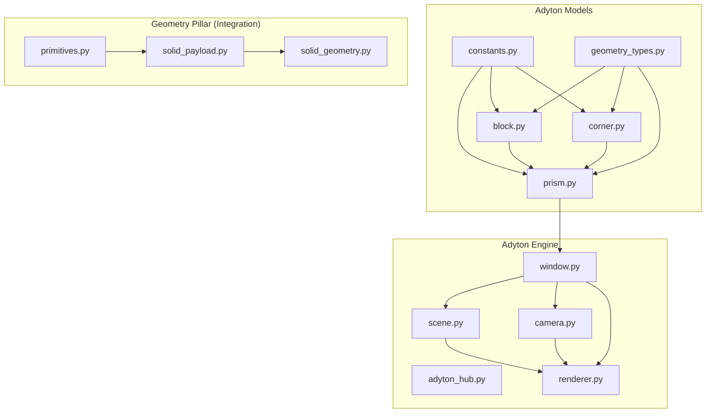
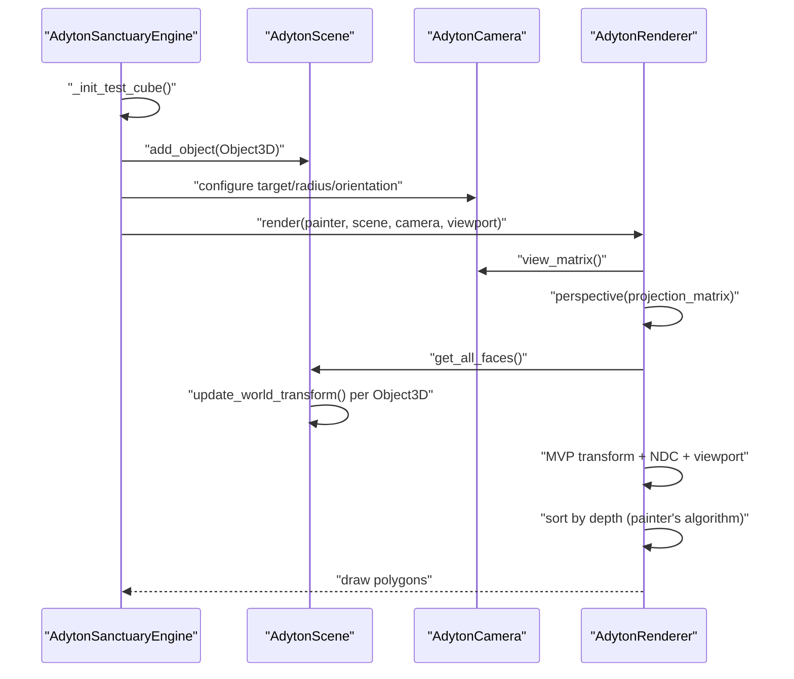
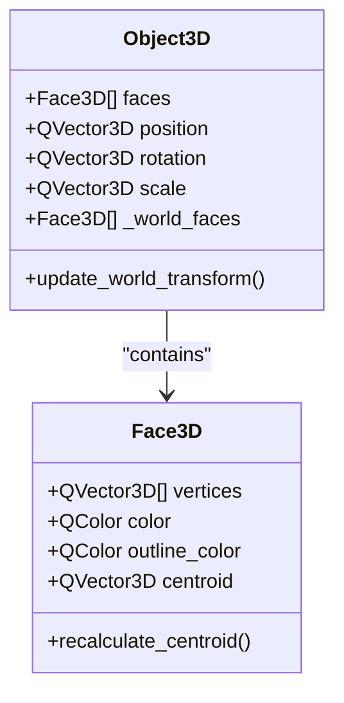
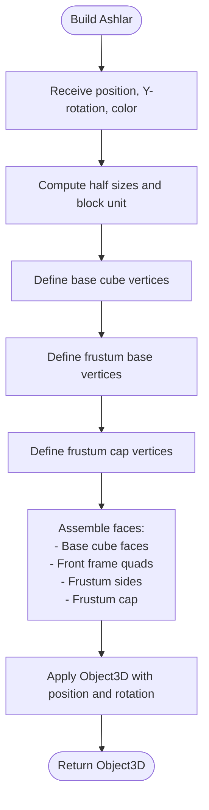
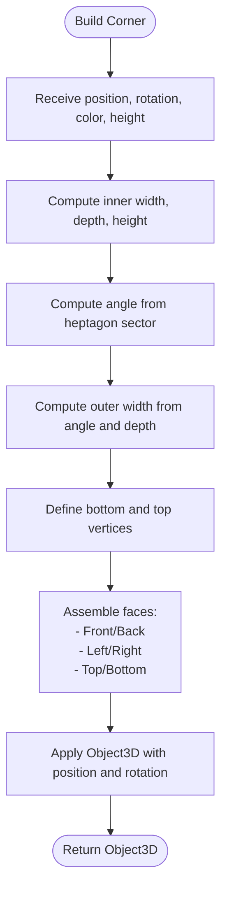
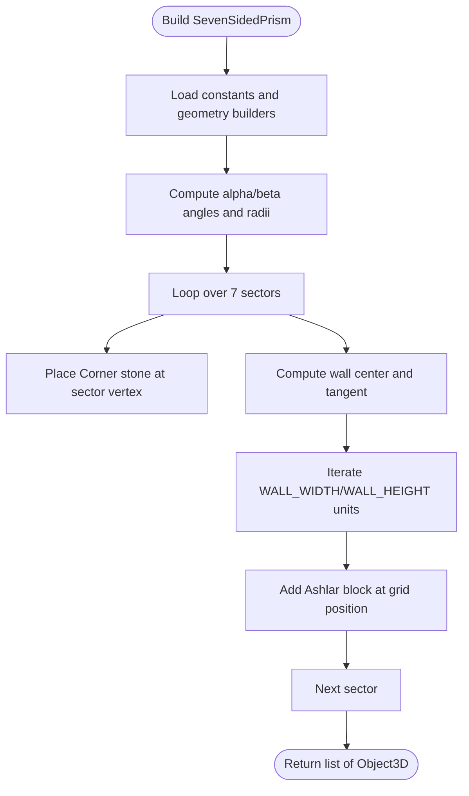
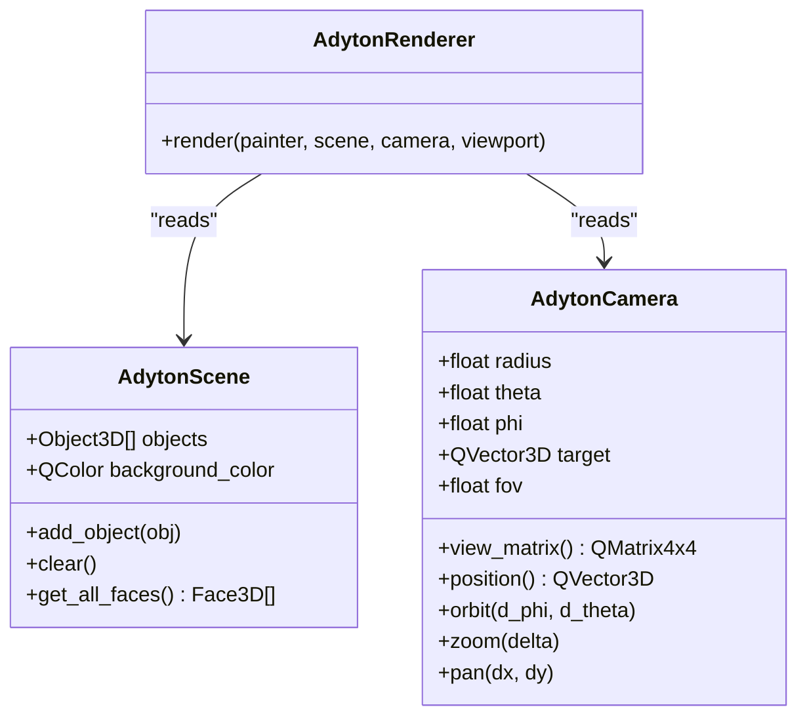
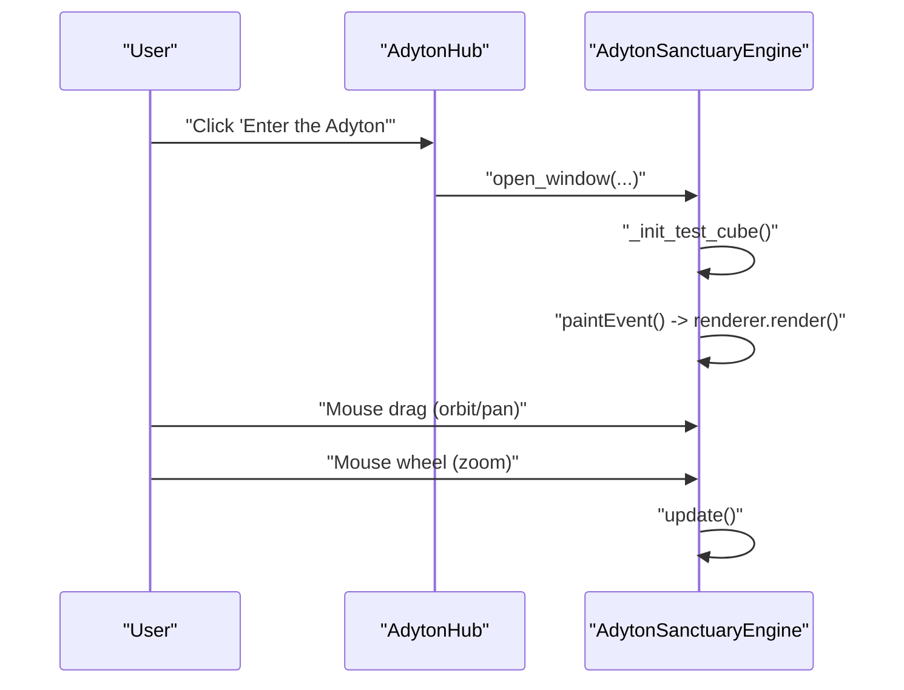
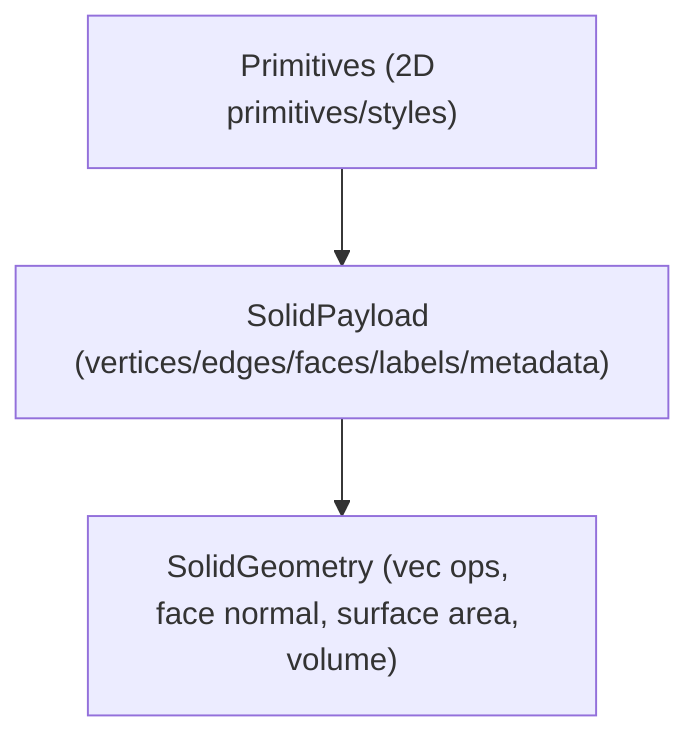
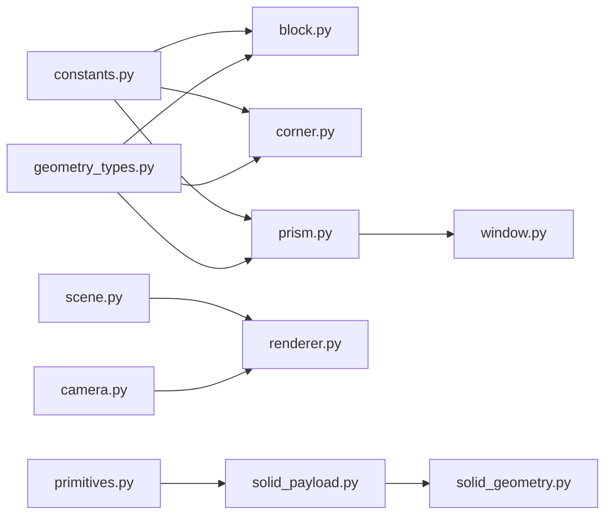

# Adyton Pillar

<cite>
**Referenced Files in This Document**
- [constants.py](file://src/pillars/adyton/constants.py)
- [geometry_types.py](file://src/pillars/adyton/models/geometry_types.py)
- [block.py](file://src/pillars/adyton/models/block.py)
- [corner.py](file://src/pillars/adyton/models/corner.py)
- [prism.py](file://src/pillars/adyton/models/prism.py)
- [adyton_hub.py](file://src/pillars/adyton/ui/adyton_hub.py)
- [window.py](file://src/pillars/adyton/ui/engine/window.py)
- [scene.py](file://src/pillars/adyton/ui/engine/scene.py)
- [camera.py](file://src/pillars/adyton/ui/engine/camera.py)
- [renderer.py](file://src/pillars/adyton/ui/engine/renderer.py)
- [solid_payload.py](file://src/pillars/geometry/shared/solid_payload.py)
- [solid_geometry.py](file://src/pillars/geometry/services/solid_geometry.py)
- [primitives.py](file://src/pillars/geometry/ui/primitives.py)
</cite>

## Table of Contents
1. [Introduction](#introduction)
2. [Project Structure](#project-structure)
3. [Core Components](#core-components)
4. [Architecture Overview](#architecture-overview)
5. [Detailed Component Analysis](#detailed-component-analysis)
6. [Dependency Analysis](#dependency-analysis)
7. [Performance Considerations](#performance-considerations)
8. [Troubleshooting Guide](#troubleshooting-guide)
9. [Conclusion](#conclusion)
10. [Appendices](#appendices)

## Introduction
The Adyton Pillar is a 3D inner sanctuary engine that constructs a seven-sided chamber using sacred geometry. It integrates a Scene, Camera, and Renderer pipeline to visualize the Adyton vault and walls. The system defines geometric models for the Ashlar (Block), Keystone (Corner), and the seven-sided Prism that forms the chamber. It also establishes a constants system based on Z'Bit measurements and Phi-based proportions, and a color mapping aligned with planetary correspondences. The AdytonHub provides a launcher to open the 3D engine window, while the engine exposes interactive camera navigation (orbit, pan, zoom). Integration with the Geometry pillar enables reuse of shared 3D primitives and math utilities.

## Project Structure
The Adyton pillar is organized into:
- Constants and geometry types: Z'Bit and Phi-based dimensions, and shared 3D data structures
- Model builders: Ashlar, Keystone, and the seven-sided Prism
- Engine UI: Hub launcher, 3D window, scene container, camera, and renderer
- Integration with Geometry pillar: shared payload and math utilities

**Diagram sources**
- [constants.py](file://src/pillars/adyton/constants.py#L1-L40)
- [geometry_types.py](file://src/pillars/adyton/models/geometry_types.py#L1-L57)
- [block.py](file://src/pillars/adyton/models/block.py#L1-L115)
- [corner.py](file://src/pillars/adyton/models/corner.py#L1-L145)
- [prism.py](file://src/pillars/adyton/models/prism.py#L1-L174)
- [adyton_hub.py](file://src/pillars/adyton/ui/adyton_hub.py#L1-L67)
- [window.py](file://src/pillars/adyton/ui/engine/window.py#L1-L98)
- [scene.py](file://src/pillars/adyton/ui/engine/scene.py#L1-L38)
- [camera.py](file://src/pillars/adyton/ui/engine/camera.py#L1-L75)
- [renderer.py](file://src/pillars/adyton/ui/engine/renderer.py#L1-L102)
- [solid_payload.py](file://src/pillars/geometry/shared/solid_payload.py#L1-L52)
- [solid_geometry.py](file://src/pillars/geometry/services/solid_geometry.py#L1-L156)
- [primitives.py](file://src/pillars/geometry/ui/primitives.py#L1-L120)

**Section sources**
- [adyton_hub.py](file://src/pillars/adyton/ui/adyton_hub.py#L1-L67)
- [window.py](file://src/pillars/adyton/ui/engine/window.py#L1-L98)

## Core Components
- Constants: Z'Bit measurements, wall units, Phi-based frustum geometry, and planetary color mapping
- Geometry Types: Face3D and Object3D with TRS transforms and world-space caching
- Models: Ashlar (Block), Keystone (Corner), SevenSidedPrism
- Engine: Scene container, Camera (spherical orbit), Renderer (software rasterization with painter’s algorithm)
- Integration: SolidPayload and math helpers from the Geometry pillar

**Section sources**
- [constants.py](file://src/pillars/adyton/constants.py#L1-L40)
- [geometry_types.py](file://src/pillars/adyton/models/geometry_types.py#L1-L57)
- [block.py](file://src/pillars/adyton/models/block.py#L1-L115)
- [corner.py](file://src/pillars/adyton/models/corner.py#L1-L145)
- [prism.py](file://src/pillars/adyton/models/prism.py#L1-L174)
- [scene.py](file://src/pillars/adyton/ui/engine/scene.py#L1-L38)
- [camera.py](file://src/pillars/adyton/ui/engine/camera.py#L1-L75)
- [renderer.py](file://src/pillars/adyton/ui/engine/renderer.py#L1-L102)
- [solid_payload.py](file://src/pillars/geometry/shared/solid_payload.py#L1-L52)
- [solid_geometry.py](file://src/pillars/geometry/services/solid_geometry.py#L1-L156)

## Architecture Overview
The Adyton engine follows a classic graphics pipeline:
- Scene holds all 3D objects and provides flattened world-space faces for rendering
- Camera manages position (spherical coordinates) and target, generating view/projection matrices
- Renderer performs MVP transformation, near-plane clipping, viewport transform, painter’s sort, and draws polygons

**Diagram sources**
- [window.py](file://src/pillars/adyton/ui/engine/window.py#L1-L98)
- [scene.py](file://src/pillars/adyton/ui/engine/scene.py#L1-L38)
- [camera.py](file://src/pillars/adyton/ui/engine/camera.py#L1-L75)
- [renderer.py](file://src/pillars/adyton/ui/engine/renderer.py#L1-L102)

## Detailed Component Analysis

### Constants System (Z'Bit and Phi-based Proportions)
- Z'Bit measurement: base unit for blocks and walls
- Block unit: twice the Z'Bit
- Wall dimensions: counts of units across width and height
- Phi-based frustum geometry: base/top and height derived from the block unit and Phi
- Planetary color mapping: predefined colors for the seven walls

Key constants and their roles:
- Z_BIT_INCHES: base linear measure
- BLOCK_UNIT: 2 × Z'Bit
- WALL_WIDTH_UNITS/WALL_HEIGHT_UNITS: counts for grid layout
- WALL_WIDTH_INCHES/WALL_HEIGHT_INCHES: physical dimensions
- PHI: golden ratio
- FRUSTUM_MARGIN/FRUSTUM_BASE/FRUSTUM_TOP/FRUSTUM_HEIGHT: inner pyramid geometry
- WALL_COLORS: seven colors mapped to walls

**Section sources**
- [constants.py](file://src/pillars/adyton/constants.py#L1-L40)

### Geometry Types (Object3D and Face3D)
- Face3D: polygon with vertices, color, outline color, and centroid
- Object3D: collection of faces with TRS transform (position, rotation, scale), and cached world-space faces

Implementation highlights:
- Centroid computed from vertex average
- World transform applied via a combined TRS matrix
- Caching of transformed faces to avoid recomputation

**Diagram sources**
- [geometry_types.py](file://src/pillars/adyton/models/geometry_types.py#L1-L57)

**Section sources**
- [geometry_types.py](file://src/pillars/adyton/models/geometry_types.py#L1-L57)

### Ashlar (Block) Geometry
- Composite geometry: base cube plus an inner pyramidal frustum
- Margin/frame around the front face to simulate ashlar spacing
- Frustum base/top and height derived from constants
- Returns an Object3D with faces and rotation applied

**Diagram sources**
- [block.py](file://src/pillars/adyton/models/block.py#L1-L115)

**Section sources**
- [block.py](file://src/pillars/adyton/models/block.py#L1-L115)

### Keystone (Corner) Geometry
- Trapezoidal prism bridging the 128.57-degree angle between walls
- Inner face width equals 1 Z'Bit
- Side depth equals block depth
- Outer width calculated from the heptagon sector angle
- Returns an Object3D with faces and rotation applied

**Diagram sources**
- [corner.py](file://src/pillars/adyton/models/corner.py#L1-L145)

**Section sources**
- [corner.py](file://src/pillars/adyton/models/corner.py#L1-L145)

### Seven-Sided Prism (Chamber Construction)
- Builds the chamber using 728 Ashlar blocks and 7 Corner stones
- Uses a 14-gon irregular polygon to ensure perfect joinery
- Computes angles and radii from chord lengths (corner and wall segments)
- Places Corner stones at heptagon vertices and walls along tangent grids
- Applies wall color cycling and block grid placement

**Diagram sources**
- [prism.py](file://src/pillars/adyton/models/prism.py#L1-L174)

**Section sources**
- [prism.py](file://src/pillars/adyton/models/prism.py#L1-L174)

### Scene, Camera, and Renderer Pipeline
- Scene: stores objects, background color, and flattens world-space faces
- Camera: spherical coordinates (radius, theta, phi) with target and FOV; supports orbit, zoom, pan
- Renderer: MVP transform, near-plane clipping, viewport transform, painter’s sort, and drawing

**Diagram sources**
- [scene.py](file://src/pillars/adyton/ui/engine/scene.py#L1-L38)
- [camera.py](file://src/pillars/adyton/ui/engine/camera.py#L1-L75)
- [renderer.py](file://src/pillars/adyton/ui/engine/renderer.py#L1-L102)

**Section sources**
- [scene.py](file://src/pillars/adyton/ui/engine/scene.py#L1-L38)
- [camera.py](file://src/pillars/adyton/ui/engine/camera.py#L1-L75)
- [renderer.py](file://src/pillars/adyton/ui/engine/renderer.py#L1-L102)

### AdytonHub and Engine Window
- AdytonHub: provides a launcher button to open the 3D engine window
- AdytonSanctuaryEngine: initializes the scene with the seven-sided prism, sets camera, and handles mouse/keyboard interactions for orbit, pan, and zoom

**Diagram sources**
- [adyton_hub.py](file://src/pillars/adyton/ui/adyton_hub.py#L1-L67)
- [window.py](file://src/pillars/adyton/ui/engine/window.py#L1-L98)

**Section sources**
- [adyton_hub.py](file://src/pillars/adyton/ui/adyton_hub.py#L1-L67)
- [window.py](file://src/pillars/adyton/ui/engine/window.py#L1-L98)

### Integration with the Geometry Pillar
- SolidPayload: shared payload structure for solids with vertices, edges, faces, labels, and metadata
- SolidGeometry: math helpers for vectors, areas, normals, surface area/volume computation, and edge extraction
- Primitives: 2D primitives and styles used in geometry UI; conceptually analogous to 3D primitives for visualization

**Diagram sources**
- [solid_payload.py](file://src/pillars/geometry/shared/solid_payload.py#L1-L52)
- [solid_geometry.py](file://src/pillars/geometry/services/solid_geometry.py#L1-L156)
- [primitives.py](file://src/pillars/geometry/ui/primitives.py#L1-L120)

**Section sources**
- [solid_payload.py](file://src/pillars/geometry/shared/solid_payload.py#L1-L52)
- [solid_geometry.py](file://src/pillars/geometry/services/solid_geometry.py#L1-L156)
- [primitives.py](file://src/pillars/geometry/ui/primitives.py#L1-L120)

## Dependency Analysis
- Adyton models depend on constants and geometry types
- Prism composes Ashlar and Corner geometries
- Engine window composes scene, camera, and renderer
- Renderer reads scene and camera state
- Geometry pillar provides reusable payload and math utilities

**Diagram sources**
- [constants.py](file://src/pillars/adyton/constants.py#L1-L40)
- [geometry_types.py](file://src/pillars/adyton/models/geometry_types.py#L1-L57)
- [block.py](file://src/pillars/adyton/models/block.py#L1-L115)
- [corner.py](file://src/pillars/adyton/models/corner.py#L1-L145)
- [prism.py](file://src/pillars/adyton/models/prism.py#L1-L174)
- [window.py](file://src/pillars/adyton/ui/engine/window.py#L1-L98)
- [scene.py](file://src/pillars/adyton/ui/engine/scene.py#L1-L38)
- [camera.py](file://src/pillars/adyton/ui/engine/camera.py#L1-L75)
- [renderer.py](file://src/pillars/adyton/ui/engine/renderer.py#L1-L102)
- [solid_payload.py](file://src/pillars/geometry/shared/solid_payload.py#L1-L52)
- [solid_geometry.py](file://src/pillars/geometry/services/solid_geometry.py#L1-L156)
- [primitives.py](file://src/pillars/geometry/ui/primitives.py#L1-L120)

**Section sources**
- [prism.py](file://src/pillars/adyton/models/prism.py#L1-L174)
- [window.py](file://src/pillars/adyton/ui/engine/window.py#L1-L98)

## Performance Considerations
- Object count: The seven-sided chamber builds approximately 728 blocks plus 7 corner stones. Rendering many small objects can be expensive.
- Sorting cost: Painter’s algorithm sorts all projected faces by depth; complexity grows with the number of faces.
- Near-plane clipping: Early rejection of invalid clip-space W prevents unnecessary work.
- World transform caching: Object3D caches transformed faces to avoid repeated TRS application.
- Suggestions:
  - Use spatial partitioning or coarse culling for large scenes
  - Batch faces by material or color to reduce draw calls
  - Consider backface culling for closed meshes
  - Use level-of-detail or instancing for repetitive blocks
  - Optimize viewport transform and avoid redundant matrix multiplications

[No sources needed since this section provides general guidance]

## Troubleshooting Guide
Common issues and resolutions:
- Rendering artifacts or missing geometry
  - Verify Object3D.update_world_transform is called before rendering
  - Ensure Face3D centroids are recalculated when vertices change
- Incorrect lighting or shading
  - The software rasterizer does not compute normals; use color variations to indicate directionality
- Coordinate alignment problems in complex scenes
  - Confirm consistent units (inches) and correct application of rotations and translations
  - Validate prism sector angles and radii calculations
- Performance bottlenecks
  - Reduce object count or merge meshes where appropriate
  - Limit the number of rendered faces by simplifying geometry
  - Use near-plane threshold tuning to avoid clipping artifacts

**Section sources**
- [geometry_types.py](file://src/pillars/adyton/models/geometry_types.py#L1-L57)
- [renderer.py](file://src/pillars/adyton/ui/engine/renderer.py#L1-L102)
- [prism.py](file://src/pillars/adyton/models/prism.py#L1-L174)

## Conclusion
The Adyton Pillar delivers a robust 3D inner sanctuary engine grounded in sacred geometry. Its Scene-Camera-Renderer pipeline, combined with Phi-based proportions and planetary color mapping, creates a visually coherent and mathematically sound visualization. The modular design allows easy extension and integration with the broader Geometry pillar for shared primitives and math utilities. By following the performance and troubleshooting guidance, developers can maintain smooth rendering and accurate coordinate alignment in complex scenes.

[No sources needed since this section summarizes without analyzing specific files]

## Appendices

### Example: Scene Construction in AdytonHub
- Launch the engine via the hub
- The engine initializes the seven-sided prism and sets camera parameters
- Interactive controls enable orbit, pan, and zoom

**Section sources**
- [adyton_hub.py](file://src/pillars/adyton/ui/adyton_hub.py#L1-L67)
- [window.py](file://src/pillars/adyton/ui/engine/window.py#L1-L98)

### Example: Camera Navigation Patterns
- Orbit: left-click drag rotates around the target
- Pan: right-click drag shifts the camera target
- Zoom: scroll adjusts the radius

**Section sources**
- [window.py](file://src/pillars/adyton/ui/engine/window.py#L1-L98)
- [camera.py](file://src/pillars/adyton/ui/engine/camera.py#L1-L75)

### Color Mapping Based on Planetary Correspondences
- Colors are defined for each of the seven walls
- These colors can be applied to blocks and corners during construction

**Section sources**
- [constants.py](file://src/pillars/adyton/constants.py#L1-L40)
- [prism.py](file://src/pillars/adyton/models/prism.py#L1-L174)

### Integration with Geometry Pillar
- Use SolidPayload to represent solids and share geometry across modules
- Leverage SolidGeometry helpers for vector math and property computations
- Adopt 2D primitives styles as inspiration for 3D visualization styling

**Section sources**
- [solid_payload.py](file://src/pillars/geometry/shared/solid_payload.py#L1-L52)
- [solid_geometry.py](file://src/pillars/geometry/services/solid_geometry.py#L1-L156)
- [primitives.py](file://src/pillars/geometry/ui/primitives.py#L1-L120)