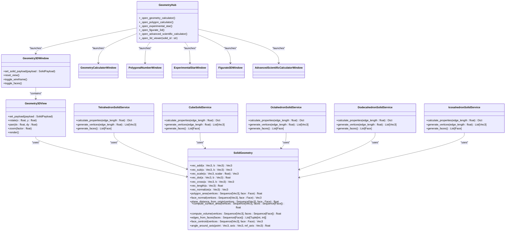

# Core Modules

<cite>
**Referenced Files in This Document**   
- [main.py](file://src/main.py)
- [gematria_hub.py](file://src/pillars/gematria/ui/gematria_hub.py)
- [calculation_service.py](file://src/pillars/gematria/services/calculation_service.py)
- [calculation_record.py](file://src/pillars/gematria/models/calculation_record.py)
- [sqlite_calculation_repository.py](file://src/pillars/gematria/repositories/sqlite_calculation_repository.py)
- [geometry_hub.py](file://src/pillars/geometry/ui/geometry_hub.py)
- [solid_geometry.py](file://src/pillars/geometry/services/solid_geometry.py)
- [document_manager_hub.py](file://src/pillars/document_manager/ui/document_manager_hub.py)
- [document_service.py](file://src/pillars/document_manager/services/document_service.py)
- [document.py](file://src/pillars/document_manager/models/document.py)
- [search_repository.py](file://src/pillars/document_manager/repositories/search_repository.py)
- [astrology_hub.py](file://src/pillars/astrology/ui/astrology_hub.py)
- [chart_storage_service.py](file://src/pillars/astrology/services/chart_storage_service.py)
- [chart_models.py](file://src/pillars/astrology/models/chart_models.py)
- [tq_hub.py](file://src/pillars/tq/ui/tq_hub.py)
- [kamea_grid_service.py](file://src/pillars/tq/services/kamea_grid_service.py)
- [quadset_engine.py](file://src/pillars/tq/services/quadset_engine.py)
- [adyton_hub.py](file://src/pillars/adyton/ui/adyton_hub.py)
</cite>

## Table of Contents
1. [Gematria](#gematria)
2. [Geometry](#geometry)
3. [Document Manager](#document-manager)
4. [Astrology](#astrology)
5. [TQ](#tq)
6. [Adyton](#adyton)

## Gematria

The Gematria module serves as the primary numerical analysis engine within IsopGem, providing comprehensive tools for calculating and analyzing gematria values across Hebrew, Greek, and English systems. This module is designed for researchers and practitioners of esoteric traditions who require detailed numerical analysis of texts and phrases.

### Purpose and Key Features
The Gematria pillar enables users to perform various types of gematria calculations, including standard, ordinal, reduced, and specialized methods like AtBash and Albam for Hebrew, and digital, reverse substitution, and pair matching for Greek. The module supports saving calculations for future reference, batch processing of multiple texts, and detailed text analysis with statistical breakdowns.

Key features include:
- **Multiple Calculation Methods**: Support for over 30 different gematria systems across Hebrew, Greek, and English/TQ traditions
- **Persistent Storage**: Saved calculations with metadata including notes, sources, tags, and user ratings
- **Text Analysis Tools**: Comprehensive analysis of texts with breakdowns of individual character values
- **Batch Processing**: Ability to process multiple texts simultaneously
- **Database Management**: Tools for managing and organizing calculation records

### Architectural Structure
The Gematria module follows a clean layered architecture with distinct separation between UI, services, repositories, and models:

**Diagram sources**
- [gematria_hub.py](file://src/pillars/gematria/ui/gematria_hub.py)
- [calculation_service.py](file://src/pillars/gematria/services/calculation_service.py)
- [sqlite_calculation_repository.py](file://src/pillars/gematria/repositories/sqlite_calculation_repository.py)
- [calculation_record.py](file://src/pillars/gematria/models/calculation_record.py)

### Service Interfaces
The core service interface is provided by the `CalculationService` class, which manages all operations related to gematria calculations:

**Diagram sources**
- [calculation_service.py](file://src/pillars/gematria/services/calculation_service.py)
- [sqlite_calculation_repository.py](file://src/pillars/gematria/repositories/sqlite_calculation_repository.py)
- [calculation_record.py](file://src/pillars/gematria/models/calculation_record.py)

### User Interaction Patterns
Users interact with the Gematria module through the Gematria Hub, which provides access to various tools:

1. **Gematria Calculator**: The primary interface for performing calculations on single texts
2. **Saved Calculations**: Browser for viewing and managing previously saved calculations
3. **Batch Calculator**: Tool for processing multiple texts simultaneously
4. **Text Analysis**: Advanced analysis of texts with statistical breakdowns
5. **Database Tools**: Utilities for managing the calculation database
6. **Methods Reference**: Documentation and reference for different calculation methods

Each tool is launched as a separate window from the hub, allowing users to work with multiple tools simultaneously.

### Configuration and Customization
The Gematria module supports several customization options:
- **User-defined categories**: Organize calculations into custom categories
- **Tagging system**: Apply multiple tags to calculations for flexible organization
- **Rating system**: Rate calculations from 0-5 stars for prioritization
- **Favorite marking**: Mark important calculations as favorites for quick access
- **Source references**: Link calculations to specific sources or references

### Troubleshooting Guidance
Common issues and solutions:
- **Calculation not saving**: Ensure the database connection is active and the application has write permissions to the data directory
- **Search not returning expected results**: Verify that the search index is up to date; use the database tools to rebuild the index if necessary
- **Performance issues with large datasets**: Use filters to narrow down searches and avoid loading all calculations at once
- **Missing calculation methods**: Check that all required calculator classes are properly imported in the hub module

**Section sources**
- [gematria_hub.py](file://src/pillars/gematria/ui/gematria_hub.py)
- [calculation_service.py](file://src/pillars/gematria/services/calculation_service.py)
- [calculation_record.py](file://src/pillars/gematria/models/calculation_record.py)
- [sqlite_calculation_repository.py](file://src/pillars/gematria/repositories/sqlite_calculation_repository.py)

## Geometry

The Geometry module provides comprehensive tools for analyzing and visualizing 2D and 3D geometric forms, with a focus on sacred geometry and mathematical relationships. This module serves as a powerful calculator and visualization platform for geometric shapes and solids.

### Purpose and Key Features
The Geometry pillar enables users to calculate properties of various geometric shapes and solids, from basic 2D forms to complex 3D polyhedra. The module supports both calculation and visualization, allowing users to explore geometric relationships in depth.

Key features include:
- **2D Shape Calculations**: Support for circles, ellipses, annuli, crescents, triangles, quadrilaterals, and regular polygons
- **3D Solid Calculations**: Comprehensive support for Platonic solids, Archimedean solids, pyramids, prisms, and antiprisms
- **3D Visualization**: Interactive 3D viewer for visualizing solids with rotation, zoom, and pan controls
- **Advanced Calculators**: Specialized tools for polygonal numbers, figurate numbers, and experimental star patterns
- **Scientific Calculator**: Advanced calculator with support for geometric functions

### Architectural Structure
The Geometry module follows a modular architecture with clear separation between UI components, service layers, and mathematical calculations:

**Diagram sources**
- [geometry_hub.py](file://src/pillars/geometry/ui/geometry_hub.py)
- [solid_geometry.py](file://src/pillars/geometry/services/solid_geometry.py)

### Service Interfaces
The core functionality is provided by various service classes that handle specific types of geometric calculations:

**Diagram sources**
- [geometry_hub.py](file://src/pillars/geometry/ui/geometry_hub.py)
- [solid_geometry.py](file://src/pillars/geometry/services/solid_geometry.py)

### User Interaction Patterns
Users interact with the Geometry module through the Geometry Hub, which organizes tools by category:

1. **Circles**: Tools for circles, ellipses, annuli, crescents, and vesica piscis
2. **Triangles**: Various types of triangles including equilateral, right, isosceles, and specialized forms
3. **Quadrilaterals**: Tools for squares, rectangles, parallelograms, rhombuses, and other four-sided shapes
4. **Polygons**: Regular polygons from pentagons to dodecagons and custom n-gons
5. **Pyramids**: Square, rectangular, triangular, and other pyramid types including frustums
6. **Prisms**: Various prism types including triangular, rectangular, and hexagonal prisms
7. **Antiprisms**: Triangular, square, pentagonal, and other antiprism types
8. **Platonic Solids**: The five regular polyhedra
9. **Archimedean Solids**: Thirteen semi-regular polyhedra

The 3D viewer allows interactive exploration of solids with mouse controls for rotation, panning, and zooming.

### Configuration and Customization
The Geometry module supports several customization options:
- **Unit system**: Support for different measurement units
- **Display options**: Toggle between wireframe and solid rendering
- **Color schemes**: Customizable colors for different elements
- **Precision settings**: Control over decimal places in calculations
- **View presets**: Save and recall specific camera angles for 3D viewing

### Troubleshooting Guidance
Common issues and solutions:
- **3D viewer not rendering**: Ensure OpenGL is properly installed and supported by the system
- **Calculation inaccuracies**: Verify that input values are in the correct units and format
- **Performance issues with complex solids**: Reduce the rendering quality or simplify the display
- **Missing shape types**: Check that all required service classes are properly registered in the hub

**Section sources**
- [geometry_hub.py](file://src/pillars/geometry/ui/geometry_hub.py)
- [solid_geometry.py](file://src/pillars/geometry/services/solid_geometry.py)

## Document Manager

The Document Manager module provides a comprehensive system for organizing, analyzing, and connecting textual documents, with features inspired by Zettelkasten and wiki-style knowledge management systems.

### Purpose and Key Features
The Document Manager pillar enables users to import, organize, and analyze textual documents, creating a personal knowledge base with interconnected ideas. The module supports full-text search, document relationships, and visual network exploration.

Key features include:
- **Document Import**: Support for importing documents from various formats including TXT, HTML, PDF, DOCX, and RTF
- **Full-Text Search**: Powerful search capabilities with highlighting of matching terms
- **Document Relationships**: Wiki-style links using [[Title]] syntax to create connections between documents
- **Mindscape**: Visual graph representation of document relationships and connections
- **Rich Text Editing**: Advanced editor with formatting capabilities
- **Metadata Management**: Support for tags, collections, authors, and other metadata

### Architectural Structure
The Document Manager follows a layered architecture with clear separation between UI, services, repositories, and data models:

**Diagram sources**
- [document_manager_hub.py](file://src/pillars/document_manager/ui/document_manager_hub.py)
- [document_service.py](file://src/pillars/document_manager/services/document_service.py)
- [document.py](file://src/pillars/document_manager/models/document.py)
- [search_repository.py](file://src/pillars/document_manager/repositories/search_repository.py)

### Service Interfaces
The core functionality is provided by the `DocumentService` class, which manages all document operations:

**Diagram sources**
- [document_manager_hub.py](file://src/pillars/document_manager/ui/document_manager_hub.py)
- [document_service.py](file://src/pillars/document_manager/services/document_service.py)
- [document.py](file://src/pillars/document_manager/models/document.py)
- [search_repository.py](file://src/pillars/document_manager/repositories/search_repository.py)

### User Interaction Patterns
Users interact with the Document Manager through several key interfaces:

1. **Document Editor**: Create and edit documents with rich text formatting
2. **Document Library**: Browse and manage imported documents
3. **Document Search**: Search across all documents with result highlighting
4. **Mindscape**: Visualize document relationships as a network graph

The system automatically detects [[WikiLinks]] in document content and creates bidirectional relationships between documents.

### Configuration and Customization
The Document Manager supports several customization options:
- **Import settings**: Configure default tags and collections for imported documents
- **Search preferences**: Adjust search sensitivity and result limits
- **Display options**: Customize the appearance of the document library and mindscape
- **Metadata templates**: Define custom metadata fields for documents
- **File type associations**: Map specific file types to default collections or tags

### Troubleshooting Guidance
Common issues and solutions:
- **Search not finding expected results**: Rebuild the search index using the document service tools
- **Links not being detected**: Ensure links are formatted as [[Title]] with exact title matching
- **Import failures**: Verify file format compatibility and sufficient read permissions
- **Performance issues with large document sets**: Optimize the search index and consider archiving older documents
- **Mindscape not updating**: Refresh the mindscape view or check for circular link dependencies

**Section sources**
- [document_manager_hub.py](file://src/pillars/document_manager/ui/document_manager_hub.py)
- [document_service.py](file://src/pillars/document_manager/services/document_service.py)
- [document.py](file://src/pillars/document_manager/models/document.py)
- [search_repository.py](file://src/pillars/document_manager/repositories/search_repository.py)

## Astrology

The Astrology module provides tools for creating and analyzing astrological charts, with integration to astronomical calculation engines for precise celestial data.

### Purpose and Key Features
The Astrology pillar enables users to generate and analyze natal charts, transit charts, and planetary positions. The module integrates with astronomical libraries to provide accurate celestial calculations.

Key features include:
- **Natal Chart Generation**: Create birth charts with planetary positions and aspects
- **Transit Analysis**: Compare current planetary positions to natal charts
- **Planetary Position Tables**: Detailed tables showing planetary positions over time
- **Chart Visualization**: Interactive charts with customizable displays
- **Location Services**: Tools for looking up geographic coordinates

### Architectural Structure
The Astrology module follows a service-oriented architecture with clear separation between UI components and calculation services:

**Diagram sources**
- [astrology_hub.py](file://src/pillars/astrology/ui/astrology_hub.py)
- [chart_storage_service.py](file://src/pillars/astrology/services/chart_storage_service.py)
- [chart_models.py](file://src/pillars/astrology/models/chart_models.py)

### Service Interfaces
The core functionality is provided by the `ChartStorageService` and `OpenAstroService` classes:

**Diagram sources**
- [astrology_hub.py](file://src/pillars/astrology/ui/astrology_hub.py)
- [chart_storage_service.py](file://src/pillars/astrology/services/chart_storage_service.py)
- [chart_models.py](file://src/pillars/astrology/models/chart_models.py)

### User Interaction Patterns
Users interact with the Astrology module through several specialized windows:

1. **Natal Chart**: Create and view birth charts with planetary positions and aspects
2. **Current Transit**: Compare current planetary positions to a natal chart
3. **Planetary Positions**: View detailed tables of planetary positions
4. **Venus Rose**: Visualize Venus retrograde cycles
5. **Neo Aubrey**: Specialized chart analysis tool

### Configuration and Customization
The Astrology module supports several customization options:
- **House systems**: Choose from different house calculation methods
- **Aspect orbs**: Customize the allowable orb for aspects
- **Display preferences**: Adjust chart colors, fonts, and layout
- **Default locations**: Set default geographic locations for calculations
- **Time zone handling**: Configure how time zones are processed

### Troubleshooting Guidance
Common issues and solutions:
- **Incorrect planetary positions**: Verify the accuracy of birth data and time zone settings
- **Location lookup failures**: Check internet connectivity and verify location names
- **Chart rendering issues**: Adjust display settings or refresh the chart view
- **Performance issues with complex charts**: Simplify the display or reduce the number of elements shown
- **Data persistence problems**: Verify database connectivity and permissions

**Section sources**
- [astrology_hub.py](file://src/pillars/astrology/ui/astrology_hub.py)
- [chart_storage_service.py](file://src/pillars/astrology/services/chart_storage_service.py)
- [chart_models.py](file://src/pillars/astrology/models/chart_models.py)

## TQ

The TQ (Trigrammaton QBLH) module provides specialized tools for research and analysis within the Trigrammaton Qabalah system, focusing on geometric transitions, kamea grids, and quadset analysis.

### Purpose and Key Features
The TQ pillar enables users to explore the complex relationships within the Trigrammaton Qabalah system, with tools for analyzing geometric transitions, kamea grids, and quadsets. The module supports both calculation and visualization of these esoteric structures.

Key features include:
- **Kamea Grid Analysis**: Tools for working with kamea grids including Baphomet and Maut grids
- **Quadset Analysis**: Analysis of quadsets and their relationships
- **Geometric Transitions**: Visualization of geometric transitions between forms
- **Conrune Pair Finding**: Tools for finding conrune pairs
- **Ternary Conversion**: Conversion between different ternary systems
- **Platonic Transitions**: Analysis of transitions between Platonic solids

### Architectural Structure
The TQ module follows a modular architecture with specialized services for different types of analysis:

**Diagram sources**
- [tq_hub.py](file://src/pillars/tq/ui/tq_hub.py)
- [kamea_grid_service.py](file://src/pillars/tq/services/kamea_grid_service.py)
- [quadset_engine.py](file://src/pillars/tq/services/quadset_engine.py)

### Service Interfaces
The core functionality is provided by specialized service classes for different aspects of TQ analysis:

```mermaid
classDiagram
class TQHub {
+_open_kamea_grid()
+_open_quadset_analysis()
+_open_geometric_transitions()
+_open_geometric_transitions_3d()
+_open_conrune_pair_finder()
+_open_ternary_converter()
+_open_transitions()
+_open_amun_visualizer()
+_open_baphomet_panel()
+_open_nuclear_mutation_panel()
+_open_fractal_network()
}
class KameaGridService {
+load_kamea_grid(grid_type : str) List[List[int]]
+find_quadsets(grid : List[List[int]]) List[Quadset]
+analyze_symmetries(grid : List[List[int]]) Dict
+generate_kamea_fractal(grid : List[List[int]], iterations : int) List[List[int]]
}
class QuadsetEngine {
+find_quadsets_in_text(text : str, grid : List[List[int]]) List[QuadsetMatch]
+analyze_quadset_patterns(quadsets : List[Quadset]) Dict
+generate_quadset_sequences(start_quadset : Quadset, length : int) List[Quadset]
+find_quadset_transitions(quadsets : List[Quadset]) List[Transition]
}
class GeometricTransitionService {
+calculate_transition_matrix(from_shape : str, to_shape : str) List[List[float]]
+generate_transition_sequence(start_shape : str, end_shape : str, steps : int) List[Shape]
+analyze_transition_properties(matrix : List[List[float]]) Dict
}
class ConrunePairFinderService {
+find_conrune_pairs(text : str, grid : List[List[int]]) List[ConrunePair]
+validate_conrune_pair(pair : ConrunePair) bool
+generate_conrune_variants(pair : ConrunePair) List[ConrunePair]
}
class TernaryService {
+convert_to_ternary(value : int) str
+convert_from_ternary(ternary : str) int
+analyze_ternary_patterns(sequence : List[int]) Dict
+generate_ternary_sequences(length : int) List[str]
}
class PlatonicTransitionService {
+calculate_dual_transitions() List[Transition]
+generate_compound_solids() List[Solid]
+analyze_symmetry_transitions() Dict
}
class AmunAudioService {
+generate_amun_sound(frequency : float, duration : float) AudioData
+analyze_sound_patterns(audio : AudioData) Dict
+generate_ditrunal_sequence(pattern : List[int]) List[AudioData]
}
class BaphometColorService {
+generate_baphomet_colors(grid : List[List[int]]) List[Color]
+analyze_color_patterns(colors : List[Color]) Dict
+generate_color_transitions(start_color : Color, end_color : Color, steps : int) List[Color]
}
class KameaSymphonyService {
+generate_kamea_symphony(grid : List[List[int]], tempo : float) MusicalScore
+analyze_musical_patterns(score : MusicalScore) Dict
+generate_fractal_compositions(base_score : MusicalScore, iterations : int) List[MusicalScore]
}
TQHub --> KameaWindow : "launches"
TQHub --> QuadsetAnalysisWindow : "launches"
TQHub --> GeometricTransitionsWindow : "launches"
TQHub --> GeometricTransitions3DWindow : "launches"
TQHub --> ConrunePairFinderWindow : "launches"
TQHub --> TernaryConverterWindow : "launches"
TQHub --> TransitionsWindow : "launches"
TQHub --> AmunVisualizer : "launches"
TQHub --> BaphometPanel : "launches"
TQHub --> NuclearMutationPanel : "launches"
TQHub --> FractalNetworkDialog : "launches"
KameaWindow --> KameaGridService : "uses"
QuadsetAnalysisWindow --> QuadsetEngine : "uses"
GeometricTransitionsWindow --> GeometricTransitionService : "uses"
GeometricTransitions3DWindow --> GeometricTransitionService : "uses"
ConrunePairFinderWindow --> ConrunePairFinderService : "uses"
TernaryConverterWindow --> TernaryService : "uses"
TransitionsWindow --> PlatonicTransitionService : "uses"
AmunVisualizer --> AmunAudioService : "uses"
BaphometPanel --> BaphometColorService : "uses"
FractalNetworkDialog --> KameaSymphonyService : "uses"
```

**Diagram sources**
- [tq_hub.py](file://src/pillars/tq/ui/tq_hub.py)
- [kamea_grid_service.py](file://src/pillars/tq/services/kamea_grid_service.py)
- [quadset_engine.py](file://src/pillars/tq/services/quadset_engine.py)

### User Interaction Patterns
Users interact with the TQ module through specialized analysis windows:

1. **Kamea Grid**: Analyze kamea grids and their properties
2. **Quadset Analysis**: Find and analyze quadsets in texts
3. **Geometric Transitions**: Visualize transitions between geometric forms
4. **Conrune Pair Finder**: Identify conrune pairs in texts
5. **Ternary Converter**: Convert between decimal and ternary systems
6. **Transitions**: Analyze transitions between Platonic solids
7. **Amun Visualizer**: Visualize Amun sounds and patterns
8. **Baphomet Panel**: Explore Baphomet color mappings
9. **Nuclear Mutation Panel**: Analyze nuclear mutation patterns
10. **Fractal Network**: Generate fractal compositions from kamea grids

### Configuration and Customization
The TQ module supports several customization options:
- **Grid types**: Select different kamea grid types (Baphomet, Maut, etc.)
- **Analysis depth**: Configure the depth of quadset and transition analysis
- **Visualization settings**: Customize colors, shapes, and layouts for visualizations
- **Audio parameters**: Adjust frequency ranges and durations for sound generation
- **Pattern recognition**: Tune sensitivity for pattern detection algorithms

### Troubleshooting Guidance
Common issues and solutions:
- **Slow analysis performance**: Reduce the analysis depth or limit the scope of analysis
- **Visualization rendering issues**: Adjust display settings or simplify complex visualizations
- **Incorrect pattern recognition**: Verify input data and adjust sensitivity settings
- **Audio generation problems**: Check audio output configuration and system permissions
- **Data loading failures**: Verify file paths and permissions for kamea grid data files

**Section sources**
- [tq_hub.py](file://src/pillars/tq/ui/tq_hub.py)
- [kamea_grid_service.py](file://src/pillars/tq/services/kamea_grid_service.py)
- [quadset_engine.py](file://src/pillars/tq/services/quadset_engine.py)

## Adyton

The Adyton module provides advanced 3D modeling and visualization capabilities, focusing on architectural and geometric forms with a sacred geometry emphasis.

### Purpose and Key Features
The Adyton pillar enables users to create and manipulate complex 3D geometric forms and architectural models. The module provides a specialized 3D engine for rendering and interacting with these forms.

Key features include:
- **3D Modeling**: Create and manipulate 3D geometric primitives and complex forms
- **Architectural Elements**: Specialized tools for architectural components like blocks, corners, and prisms
- **Advanced Rendering**: High-quality 3D rendering with lighting and material effects
- **Camera Controls**: Sophisticated camera controls for viewing models from different angles
- **Scene Management**: Tools for organizing and managing complex 3D scenes

### Architectural Structure
The Adyton module follows a component-based architecture with specialized classes for different aspects of 3D modeling:

**Diagram sources**
- [adyton_hub.py](file://src/pillars/adyton/ui/adyton_hub.py)

### Service Interfaces
The core functionality is provided by the Adyton UI components and 3D engine classes:

**Diagram sources**
- [adyton_hub.py](file://src/pillars/adyton/ui/adyton_hub.py)

### User Interaction Patterns
Users interact with the Adyton module through the Adyton window, which provides a comprehensive 3D workspace:

1. **Scene Creation**: Create new 3D scenes and add geometric objects
2. **Object Manipulation**: Position, rotate, and scale 3D objects
3. **Camera Navigation**: Navigate the 3D space using camera controls
4. **Rendering**: Adjust rendering settings and view the scene in different modes
5. **Model Export**: Export models in various 3D formats

### Configuration and Customization
The Adyton module supports several customization options:
- **Rendering quality**: Adjust the quality and performance of 3D rendering
- **Display modes**: Switch between wireframe, solid, and textured rendering
- **Lighting settings**: Configure lighting for scenes
- **Material properties**: Customize materials for 3D objects
- **Unit system**: Set the measurement units for 3D modeling

### Troubleshooting Guidance
Common issues and solutions:
- **3D rendering failures**: Verify graphics drivers and OpenGL support
- **Performance issues**: Reduce rendering quality or simplify complex scenes
- **Object manipulation problems**: Check coordinate systems and transformation matrices
- **Camera navigation issues**: Reset camera settings or adjust navigation sensitivity
- **Export failures**: Verify file permissions and supported export formats

**Section sources**
- [adyton_hub.py](file://src/pillars/adyton/ui/adyton_hub.py)