# Gematria Pillar

<cite>
**Referenced Files in This Document**
- [base_calculator.py](file://src/pillars/gematria/services/base_calculator.py)
- [hebrew_calculator.py](file://src/pillars/gematria/services/hebrew_calculator.py)
- [greek_calculator.py](file://src/pillars/gematria/services/greek_calculator.py)
- [tq_calculator.py](file://src/pillars/gematria/services/tq_calculator.py)
- [calculation_service.py](file://src/pillars/gematria/services/calculation_service.py)
- [calculation_repository.py](file://src/pillars/gematria/repositories/calculation_repository.py)
- [calculation_record.py](file://src/pillars/gematria/models/calculation_record.py)
- [verse_parser.py](file://src/pillars/gematria/utils/verse_parser.py)
- [numeric_utils.py](file://src/pillars/gematria/utils/numeric_utils.py)
- [gematria_hub.py](file://src/pillars/gematria/ui/gematria_hub.py)
- [holy_book_teacher_window.py](file://src/pillars/gematria/ui/holy_book_teacher_window.py)
- [verse_teacher_service.py](file://src/pillars/document_manager/services/verse_teacher_service.py)
- [test_calculation_service.py](file://test/pillars/gematria/test_calculation_service.py)
</cite>

## Table of Contents
1. [Introduction](#introduction)
2. [Project Structure](#project-structure)
3. [Core Components](#core-components)
4. [Architecture Overview](#architecture-overview)
5. [Detailed Component Analysis](#detailed-component-analysis)
6. [Dependency Analysis](#dependency-analysis)
7. [Performance Considerations](#performance-considerations)
8. [Troubleshooting Guide](#troubleshooting-guide)
9. [Conclusion](#conclusion)
10. [Appendices](#appendices)

## Introduction
The Gematria Pillar provides Hebrew, Greek, and English (TQ) numerical analysis tools for exploring sacred texts and names through gematria, isopsephy, and modern English systems. It implements the Strategy Pattern in the calculator engine so that different gematria systems (Hebrew, Greek, English) are interchangeable strategies. The service layer coordinates text normalization, numeric transformations, and result aggregation. The UI includes the Gematria Hub, calculator windows, saved calculations, batch calculator, and the Holy Book Teacher interface for curated verse analysis. Utilities support advanced numerological operations and parsing of biblical references. Integration with the Document Manager enables verse-based analysis and rule-driven curation.

## Project Structure
The Gematria Pillar is organized by functional areas:
- Services: calculator strategies, calculation orchestration, and repositories
- Models: persistent calculation records
- Utils: text parsing and numeric helpers
- UI: hub and interactive windows
- Tests: service behavior and repository persistence

**Diagram sources**
- [base_calculator.py](file://src/pillars/gematria/services/base_calculator.py#L1-L107)
- [hebrew_calculator.py](file://src/pillars/gematria/services/hebrew_calculator.py#L1-L120)
- [greek_calculator.py](file://src/pillars/gematria/services/greek_calculator.py#L1-L120)
- [tq_calculator.py](file://src/pillars/gematria/services/tq_calculator.py#L1-L120)
- [calculation_service.py](file://src/pillars/gematria/services/calculation_service.py#L1-L120)
- [calculation_repository.py](file://src/pillars/gematria/repositories/calculation_repository.py#L1-L120)
- [calculation_record.py](file://src/pillars/gematria/models/calculation_record.py#L1-L89)
- [verse_parser.py](file://src/pillars/gematria/utils/verse_parser.py#L1-L107)
- [numeric_utils.py](file://src/pillars/gematria/utils/numeric_utils.py#L1-L22)
- [gematria_hub.py](file://src/pillars/gematria/ui/gematria_hub.py#L1-L120)
- [holy_book_teacher_window.py](file://src/pillars/gematria/ui/holy_book_teacher_window.py#L1-L120)
- [verse_teacher_service.py](file://src/pillars/document_manager/services/verse_teacher_service.py#L1-L120)

**Section sources**
- [base_calculator.py](file://src/pillars/gematria/services/base_calculator.py#L1-L107)
- [gematria_hub.py](file://src/pillars/gematria/ui/gematria_hub.py#L1-L120)

## Core Components
- Strategy Pattern via Base Calculator: An abstract base class defines the interface and shared normalization/diagnostic logic. Concrete calculators implement letter-to-value mappings and optional specialized calculation methods.
- Hebrew Calculators: Multiple strategies for standard, sofitt, letter value, ordinal, small value, AtBash, Kolel, square, cube, triangular, integral reduced, ordinal square, full value, and others.
- Greek Calculators: Multiple strategies mirroring Hebrew variants for isopsephy, including reverse substitution (AtBash-equivalent), pair matching, digital reduction, and more.
- TQ Calculators: English-based strategies aligned with Trigrammaton Qabbalah, including standard, reduced, square, triangular, and positional weighting.
- Calculation Service: Orchestrates saving, updating, searching, and retrieving calculations; normalizes text via the active calculator; serializes breakdowns; toggles favorites; parses breakdown JSON.
- Calculation Repository: Whoosh-backed persistence with schema fields for text, normalized text, value, language, method, timestamps, notes, source, tags, breakdown, counts, ratings, favorites, categories, and related IDs.
- Verse Parser: Parses plain text into numbered verses with heuristics for line-start vs inline markers, sequences, and confidence.
- Numeric Utils: Extracts and sums numeric tokens from text.
- UI Hub and Windows: Launchpad for calculators, saved calculations, batch calculator, text analysis, database tools, and methods reference; Holy Book Teacher for curated verse runs and rule authoring.

**Section sources**
- [base_calculator.py](file://src/pillars/gematria/services/base_calculator.py#L1-L107)
- [hebrew_calculator.py](file://src/pillars/gematria/services/hebrew_calculator.py#L1-L120)
- [greek_calculator.py](file://src/pillars/gematria/services/greek_calculator.py#L1-L120)
- [tq_calculator.py](file://src/pillars/gematria/services/tq_calculator.py#L1-L120)
- [calculation_service.py](file://src/pillars/gematria/services/calculation_service.py#L1-L120)
- [calculation_repository.py](file://src/pillars/gematria/repositories/calculation_repository.py#L1-L120)
- [verse_parser.py](file://src/pillars/gematria/utils/verse_parser.py#L1-L107)
- [numeric_utils.py](file://src/pillars/gematria/utils/numeric_utils.py#L1-L22)
- [gematria_hub.py](file://src/pillars/gematria/ui/gematria_hub.py#L1-L120)
- [holy_book_teacher_window.py](file://src/pillars/gematria/ui/holy_book_teacher_window.py#L1-L120)

## Architecture Overview
The calculator engine uses the Strategy Pattern. The base class encapsulates normalization and traversal logic, while concrete calculators supply mappings and optional overrides. The service composes a calculator with repository persistence and exposes a unified API for saving and searching calculations. The UI invokes calculators and integrates with the Document Manager’s verse teacher workflow.

```mermaid
classDiagram
class GematriaCalculator {
+normalize_text(text) str
+calculate(text) int
+get_letter_value(char) int
+get_breakdown(text) list
<<abstract>>
}
class HebrewGematriaCalculator
class HebrewSofitCalculator
class HebrewLetterValueCalculator
class HebrewOrdinalCalculator
class HebrewSmallValueCalculator
class HebrewAtBashCalculator
class HebrewKolelCalculator
class HebrewSquareCalculator
class HebrewCubeCalculator
class HebrewTriangularCalculator
class HebrewIntegralReducedCalculator
class HebrewOrdinalSquareCalculator
class HebrewFullValueCalculator
class HebrewAlbamCalculator
class GreekGematriaCalculator
class GreekLetterValueCalculator
class GreekOrdinalCalculator
class GreekSmallValueCalculator
class GreekKolelCalculator
class GreekSquareCalculator
class GreekCubeCalculator
class GreekTriangularCalculator
class GreekDigitalCalculator
class GreekOrdinalSquareCalculator
class GreekFullValueCalculator
class GreekReverseSubstitutionCalculator
class GreekPairMatchingCalculator
class GreekNextLetterCalculator
class TQGematriaCalculator
class TQReducedCalculator
class TQSquareCalculator
class TQTriangularCalculator
class TQPositionCalculator
class CalculationService {
+save_calculation(...)
+update_calculation(...)
+search_calculations(...)
+get_all_calculations(...)
+toggle_favorite(...)
+get_breakdown_from_record(...)
}
class CalculationRepository {
+save(record) CalculationRecord
+get_by_id(id) CalculationRecord?
+delete(id) bool
+search(query, filters...) List[CalculationRecord]
+get_all(limit) List[CalculationRecord]
+get_by_value(value) List[CalculationRecord]
+get_favorites(limit) List[CalculationRecord]
}
class CalculationRecord {
+text : str
+value : int
+language : str
+method : str
+breakdown : str
+character_count : int
+normalized_text : str
+tags : List[str]
+notes : str
+source : str
+user_rating : int
+is_favorite : bool
+category : str
+related_ids : List[str]
}
class VerseTeacherService {
+get_or_parse_verses(...)
+generate_parser_run(...)
+save_curated_verses(...)
+record_rule(...)
}
class VerseParser {
+parse_verses(text, allow_inline) List[Dict]
}
GematriaCalculator <|-- HebrewGematriaCalculator
GematriaCalculator <|-- HebrewSofitCalculator
GematriaCalculator <|-- HebrewLetterValueCalculator
GematriaCalculator <|-- HebrewOrdinalCalculator
GematriaCalculator <|-- HebrewSmallValueCalculator
GematriaCalculator <|-- HebrewAtBashCalculator
GematriaCalculator <|-- HebrewKolelCalculator
GematriaCalculator <|-- HebrewSquareCalculator
GematriaCalculator <|-- HebrewCubeCalculator
GematriaCalculator <|-- HebrewTriangularCalculator
GematriaCalculator <|-- HebrewIntegralReducedCalculator
GematriaCalculator <|-- HebrewOrdinalSquareCalculator
GematriaCalculator <|-- HebrewFullValueCalculator
GematriaCalculator <|-- HebrewAlbamCalculator
GematriaCalculator <|-- GreekGematriaCalculator
GematriaCalculator <|-- GreekLetterValueCalculator
GematriaCalculator <|-- GreekOrdinalCalculator
GematriaCalculator <|-- GreekSmallValueCalculator
GematriaCalculator <|-- GreekKolelCalculator
GematriaCalculator <|-- GreekSquareCalculator
GematriaCalculator <|-- GreekCubeCalculator
GematriaCalculator <|-- GreekTriangularCalculator
GematriaCalculator <|-- GreekDigitalCalculator
GematriaCalculator <|-- GreekOrdinalSquareCalculator
GematriaCalculator <|-- GreekFullValueCalculator
GematriaCalculator <|-- GreekReverseSubstitutionCalculator
GematriaCalculator <|-- GreekPairMatchingCalculator
GematriaCalculator <|-- GreekNextLetterCalculator
GematriaCalculator <|-- TQGematriaCalculator
GematriaCalculator <|-- TQReducedCalculator
GematriaCalculator <|-- TQSquareCalculator
GematriaCalculator <|-- TQTriangularCalculator
GematriaCalculator <|-- TQPositionCalculator
CalculationService --> CalculationRepository : "persists"
CalculationService --> GematriaCalculator : "uses"
CalculationRepository --> CalculationRecord : "stores"
VerseTeacherService --> VerseParser : "parses"
```

**Diagram sources**
- [base_calculator.py](file://src/pillars/gematria/services/base_calculator.py#L1-L107)
- [hebrew_calculator.py](file://src/pillars/gematria/services/hebrew_calculator.py#L1-L120)
- [greek_calculator.py](file://src/pillars/gematria/services/greek_calculator.py#L1-L120)
- [tq_calculator.py](file://src/pillars/gematria/services/tq_calculator.py#L1-L120)
- [calculation_service.py](file://src/pillars/gematria/services/calculation_service.py#L1-L120)
- [calculation_repository.py](file://src/pillars/gematria/repositories/calculation_repository.py#L1-L120)
- [calculation_record.py](file://src/pillars/gematria/models/calculation_record.py#L1-L89)
- [verse_teacher_service.py](file://src/pillars/document_manager/services/verse_teacher_service.py#L1-L120)
- [verse_parser.py](file://src/pillars/gematria/utils/verse_parser.py#L1-L107)

## Detailed Component Analysis

### Strategy Pattern in the Calculator Engine
- Abstraction: The base calculator defines normalization and traversal, exposing a shared interface for all strategies.
- Concrete Strategies: Hebrew, Greek, and TQ calculators implement letter-to-value mappings and optional specialized calculations (e.g., square, triangular, reduced).
- Composition: The service composes a calculator with repository persistence and exposes a unified API for saving and searching calculations.

**Diagram sources**
- [calculation_service.py](file://src/pillars/gematria/services/calculation_service.py#L1-L120)
- [base_calculator.py](file://src/pillars/gematria/services/base_calculator.py#L1-L107)
- [calculation_repository.py](file://src/pillars/gematria/repositories/calculation_repository.py#L1-L120)

**Section sources**
- [base_calculator.py](file://src/pillars/gematria/services/base_calculator.py#L1-L107)
- [hebrew_calculator.py](file://src/pillars/gematria/services/hebrew_calculator.py#L1-L120)
- [greek_calculator.py](file://src/pillars/gematria/services/greek_calculator.py#L1-L120)
- [tq_calculator.py](file://src/pillars/gematria/services/tq_calculator.py#L1-L120)

### Calculation Service Orchestration
- Responsibilities: Save, update, delete, search, list, toggle favorites, and parse breakdown JSON.
- Normalization: Delegates to the calculator’s normalization routine to remove diacritics and accents.
- Persistence: Serializes breakdown to JSON and stores metadata/tags/ratings/favorites.
- Robustness: Gracefully handles malformed breakdown JSON by returning an empty list.

**Diagram sources**
- [calculation_service.py](file://src/pillars/gematria/services/calculation_service.py#L1-L120)
- [calculation_repository.py](file://src/pillars/gematria/repositories/calculation_repository.py#L1-L120)
- [calculation_record.py](file://src/pillars/gematria/models/calculation_record.py#L1-L89)

**Section sources**
- [calculation_service.py](file://src/pillars/gematria/services/calculation_service.py#L1-L120)
- [calculation_record.py](file://src/pillars/gematria/models/calculation_record.py#L1-L89)
- [test_calculation_service.py](file://test/pillars/gematria/test_calculation_service.py#L1-L134)

### Hebrew Calculator Strategies
- Standard, Sofit, Letter Value, Ordinal, Small Value, AtBash, Kolel, Square, Cube, Triangular, Integral Reduced, Ordinal Square, Full Value, and Albam variants.
- Each strategy defines a name and a letter-to-value mapping; some override calculate to incorporate additional logic (e.g., adding letter count for Kolel).

Examples of invoking strategies:
- HebrewCalculator: Instantiate a Hebrew calculator and call calculate on normalized text to produce a value and get_breakdown for per-character values.
- TQCalculator: Instantiate a TQ calculator and call calculate on normalized text; optionally use TQReducedCalculator to reduce to a single digit.

**Section sources**
- [hebrew_calculator.py](file://src/pillars/gematria/services/hebrew_calculator.py#L1-L120)
- [tq_calculator.py](file://src/pillars/gematria/services/tq_calculator.py#L1-L120)

### Greek Calculator Strategies
- Standard isopsephy, letter value, ordinal, small value, Kolel, square, cube, triangular, digital reduction, reverse substitution (AtBash-equivalent), pair matching, ordinal square, full value, and next-letter variants.

**Section sources**
- [greek_calculator.py](file://src/pillars/gematria/services/greek_calculator.py#L1-L120)

### Verse Parser and Document Manager Integration
- Verse Parser: Identifies numbered verses using regex heuristics for line-start vs inline markers, sequences, and uppercase-following patterns.
- Verse Teacher Service: Coordinates curated versus parser-generated runs, applies rules, detects anomalies (duplicates, missing numbers, overlaps), and logs edits.
- UI: Holy Book Teacher window renders parser runs, allows manual edits, merges/splits, renumbers, ignores, and rule creation; saves curated verses back to the Document Manager.

**Diagram sources**
- [holy_book_teacher_window.py](file://src/pillars/gematria/ui/holy_book_teacher_window.py#L1-L200)
- [verse_teacher_service.py](file://src/pillars/document_manager/services/verse_teacher_service.py#L1-L200)
- [verse_parser.py](file://src/pillars/gematria/utils/verse_parser.py#L1-L107)

**Section sources**
- [verse_parser.py](file://src/pillars/gematria/utils/verse_parser.py#L1-L107)
- [verse_teacher_service.py](file://src/pillars/document_manager/services/verse_teacher_service.py#L1-L200)
- [holy_book_teacher_window.py](file://src/pillars/gematria/ui/holy_book_teacher_window.py#L1-L200)

### UI Components
- Gematria Hub: Central launcher for calculator windows, saved calculations, batch calculator, text analysis, database tools, and methods reference. It prepares lists of calculators for each window.
- Text Analysis Window: Redirects to a modular implementation; integrates with the hub and calculator strategies.
- Holy Book Teacher: Interactive editor for curated verses, anomaly detection, undo/redo, rule creation, and saving curated runs.

**Section sources**
- [gematria_hub.py](file://src/pillars/gematria/ui/gematria_hub.py#L1-L200)
- [holy_book_teacher_window.py](file://src/pillars/gematria/ui/holy_book_teacher_window.py#L1-L200)

## Dependency Analysis
- Calculator strategies depend on the base calculator for normalization and traversal.
- Calculation service depends on calculators and repositories.
- Verse teacher service depends on the verse parser and document manager repositories.
- UI hubs depend on calculators and services.

**Diagram sources**
- [base_calculator.py](file://src/pillars/gematria/services/base_calculator.py#L1-L107)
- [hebrew_calculator.py](file://src/pillars/gematria/services/hebrew_calculator.py#L1-L120)
- [greek_calculator.py](file://src/pillars/gematria/services/greek_calculator.py#L1-L120)
- [tq_calculator.py](file://src/pillars/gematria/services/tq_calculator.py#L1-L120)
- [calculation_service.py](file://src/pillars/gematria/services/calculation_service.py#L1-L120)
- [calculation_repository.py](file://src/pillars/gematria/repositories/calculation_repository.py#L1-L120)
- [verse_teacher_service.py](file://src/pillars/document_manager/services/verse_teacher_service.py#L1-L120)
- [verse_parser.py](file://src/pillars/gematria/utils/verse_parser.py#L1-L107)
- [holy_book_teacher_window.py](file://src/pillars/gematria/ui/holy_book_teacher_window.py#L1-L120)

**Section sources**
- [calculation_service.py](file://src/pillars/gematria/services/calculation_service.py#L1-L120)
- [calculation_repository.py](file://src/pillars/gematria/repositories/calculation_repository.py#L1-L120)
- [verse_teacher_service.py](file://src/pillars/document_manager/services/verse_teacher_service.py#L1-L120)

## Performance Considerations
- Strategy Pattern minimizes duplication and keeps calculations localized to mappings and optional overrides.
- Whoosh indexing supports fast text search across notes, sources, and normalized text; pagination and sorting by modification time improve responsiveness.
- Normalization uses Unicode normalization to remove combining marks efficiently.
- Large-scale searches should leverage pagination and filters to avoid heavy scans.

[No sources needed since this section provides general guidance]

## Troubleshooting Guide
Common issues and resolutions:
- Malformed breakdown JSON: The service returns an empty breakdown list when parsing fails, preventing crashes.
- Inline marker ambiguity: Adjust the “Allow inline markers” setting in the Holy Book Teacher to refine parser runs.
- Overlaps and gaps: The verse teacher service detects overlaps and missing numbers; use merge/split/rename actions to resolve.
- Rule conflicts: Review applied rules and adjust priorities or patterns to achieve desired outcomes.

**Section sources**
- [calculation_service.py](file://src/pillars/gematria/services/calculation_service.py#L200-L273)
- [verse_teacher_service.py](file://src/pillars/document_manager/services/verse_teacher_service.py#L240-L352)
- [holy_book_teacher_window.py](file://src/pillars/gematria/ui/holy_book_teacher_window.py#L1-L200)

## Conclusion
The Gematria Pillar cleanly separates concerns through the Strategy Pattern in its calculator engine, enabling extensible support for Hebrew, Greek, and English systems. The service layer orchestrates normalization, computation, and persistence, while the UI provides powerful tools for interactive analysis and curated verse management. Utilities like the verse parser and numeric helpers support advanced numerological workflows and integration with the Document Manager.

[No sources needed since this section summarizes without analyzing specific files]

## Appendices

### Example Invocation Paths
- HebrewCalculator invocation: [hebrew_calculator.py](file://src/pillars/gematria/services/hebrew_calculator.py#L1-L120)
- TQCalculator invocation: [tq_calculator.py](file://src/pillars/gematria/services/tq_calculator.py#L1-L120)
- Saving a calculation: [calculation_service.py](file://src/pillars/gematria/services/calculation_service.py#L1-L120)
- Parsing verses: [verse_parser.py](file://src/pillars/gematria/utils/verse_parser.py#L1-L107)
- Numeric face value extraction: [numeric_utils.py](file://src/pillars/gematria/utils/numeric_utils.py#L1-L22)