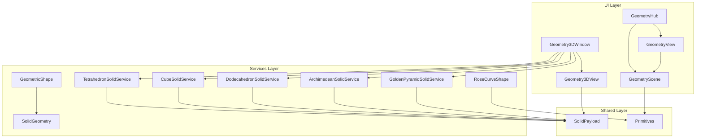
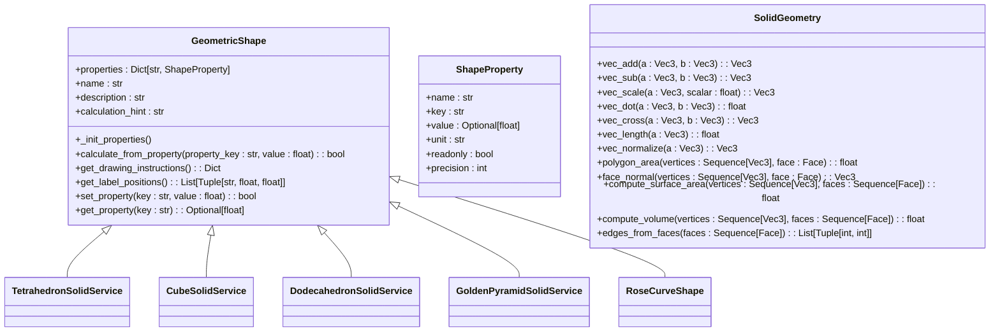
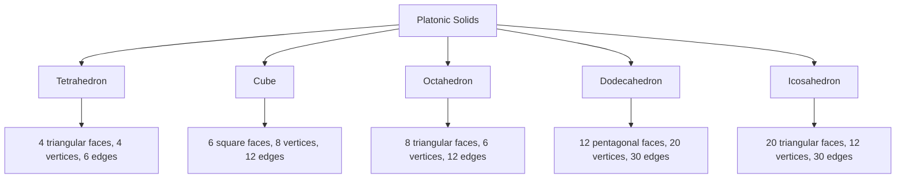
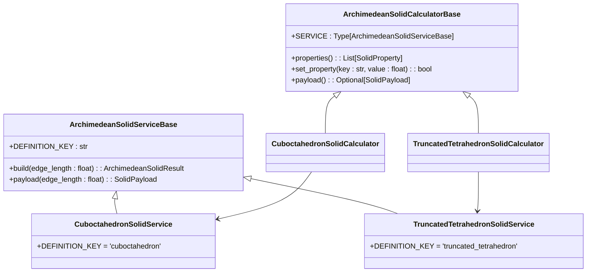
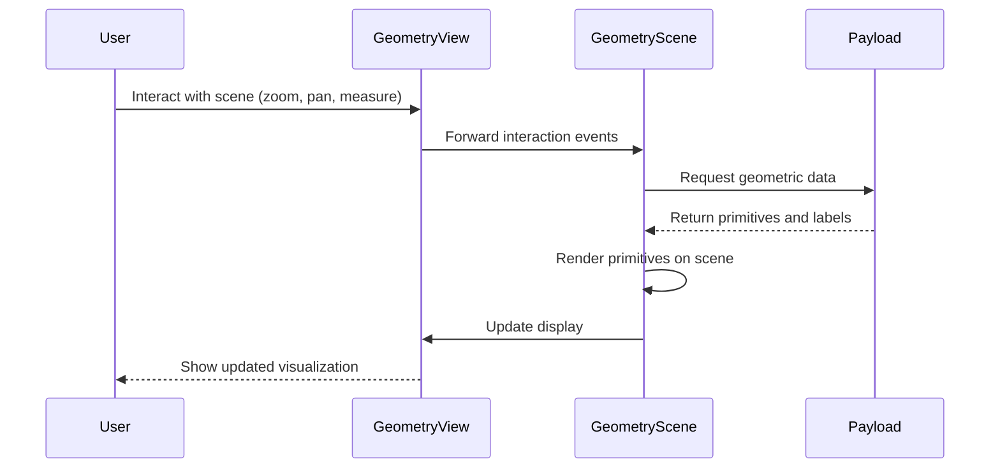
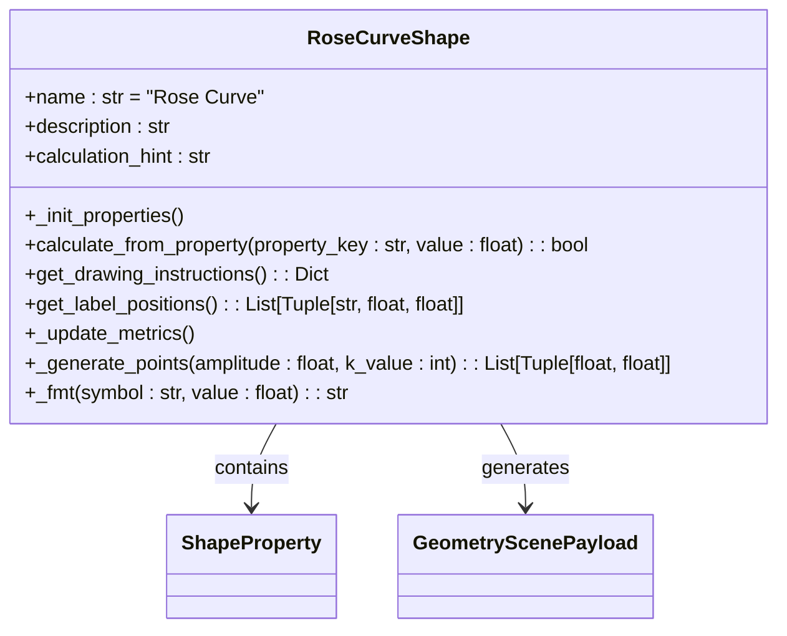
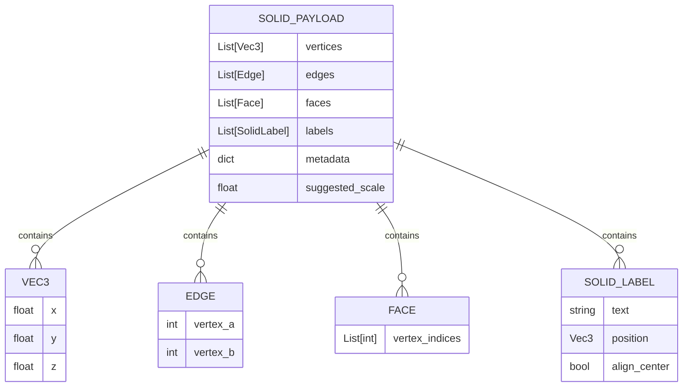
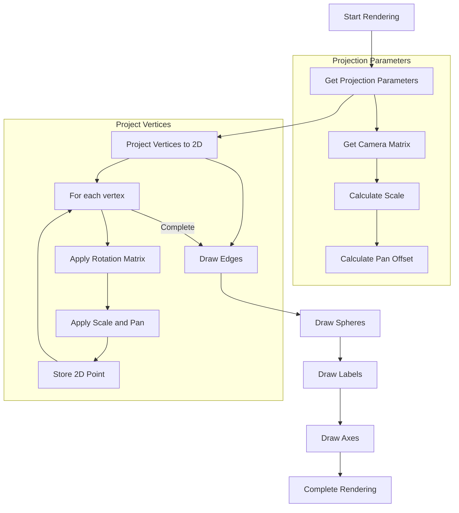
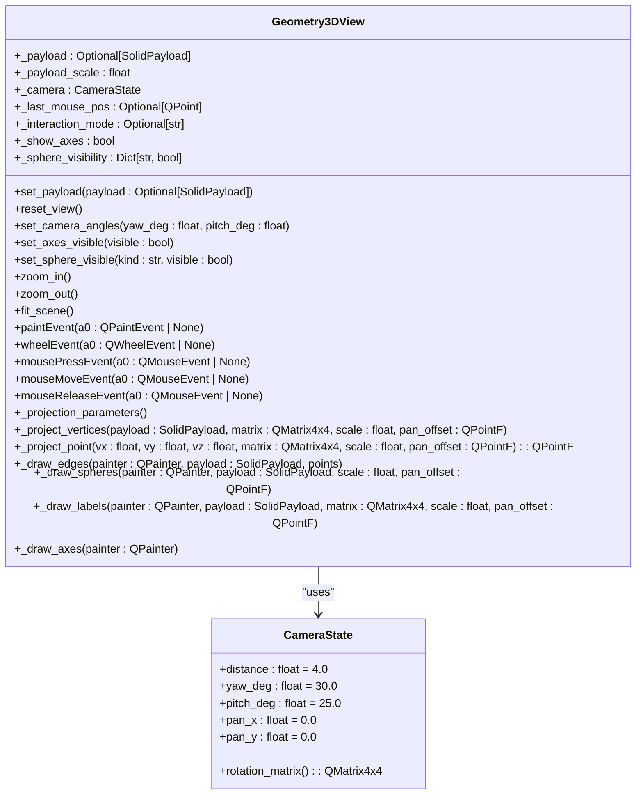

# Geometry Pillar

<cite>
**Referenced Files in This Document**   
- [geometry_hub.py](file://src/pillars/geometry/ui/geometry_hub.py)
- [geometry_scene.py](file://src/pillars/geometry/ui/geometry_scene.py)
- [geometry_view.py](file://src/pillars/geometry/ui/geometry_view.py)
- [base_shape.py](file://src/pillars/geometry/services/base_shape.py)
- [solid_geometry.py](file://src/pillars/geometry/services/solid_geometry.py)
- [tetrahedron_solid.py](file://src/pillars/geometry/services/tetrahedron_solid.py)
- [cube_solid.py](file://src/pillars/geometry/services/cube_solid.py)
- [dodecahedron_solid.py](file://src/pillars/geometry/services/dodecahedron_solid.py)
- [golden_pyramid_solid.py](file://src/pillars/geometry/services/golden_pyramid_solid.py)
- [archimedean_solids.py](file://src/pillars/geometry/services/archimedean_solids.py)
- [rose_curve_shape.py](file://src/pillars/geometry/services/rose_curve_shape.py)
- [window3d.py](file://src/pillars/geometry/ui/geometry3d/window3d.py)
- [view3d.py](file://src/pillars/geometry/ui/geometry3d/view3d.py)
- [solid_payload.py](file://src/pillars/geometry/shared/solid_payload.py)
- [primitives.py](file://src/pillars/geometry/ui/primitives.py)
</cite>

## Table of Contents
1. [Introduction](#introduction)
2. [Architecture Overview](#architecture-overview)
3. [Core Components](#core-components)
4. [Platonic and Archimedean Solids](#platonic-and-archimedean-solids)
5. [Visualization System](#visualization-system)
6. [3D Rendering Pipeline](#3d-rendering-pipeline)
7. [Integration with Adyton Pillar](#integration-with-adyton-pillar)
8. [Troubleshooting Common Issues](#troubleshooting-common-issues)
9. [Conclusion](#conclusion)

## Introduction

The Geometry Pillar is a comprehensive system designed to provide 2D and 3D sacred geometry calculators and visualizations. This document details the architecture, implementation, and functionality of the system, focusing on the solid geometry engine, visualization components, and integration points. The system enables users to explore mathematical foundations of geometric forms, calculate properties, and visualize complex structures in both two and three dimensions.

**Section sources**
- [geometry_hub.py](file://src/pillars/geometry/ui/geometry_hub.py#L1-L800)

## Architecture Overview

The Geometry Pillar follows a modular architecture with distinct layers for services, UI components, and shared data structures. The core design separates geometric calculations from visualization, allowing for flexible integration and extension.

The system is organized into several key components:
- **Services Layer**: Contains the mathematical logic for geometric calculations, including base shapes, Platonic solids, Archimedean solids, and specialized forms like the Golden Pyramid.
- **UI Layer**: Implements visualization components using PyQt6's graphics framework, with a clear separation between scene management and view controls.
- **Shared Layer**: Defines common data structures used across the system, particularly for 3D solid representation.

The architecture enables bidirectional calculation where users can input any valid property and derive all other related properties, maintaining mathematical consistency across all geometric forms.



**Diagram sources**
- [geometry_hub.py](file://src/pillars/geometry/ui/geometry_hub.py#L1-L800)
- [geometry_scene.py](file://src/pillars/geometry/ui/geometry_scene.py#L1-L710)
- [geometry_view.py](file://src/pillars/geometry/ui/geometry_view.py#L1-L281)
- [window3d.py](file://src/pillars/geometry/ui/geometry3d/window3d.py#L1-L800)
- [view3d.py](file://src/pillars/geometry/ui/geometry3d/view3d.py#L1-L298)
- [base_shape.py](file://src/pillars/geometry/services/base_shape.py#L1-L143)
- [solid_geometry.py](file://src/pillars/geometry/services/solid_geometry.py#L1-L156)
- [tetrahedron_solid.py](file://src/pillars/geometry/services/tetrahedron_solid.py#L1-L238)
- [cube_solid.py](file://src/pillars/geometry/services/cube_solid.py#L1-L265)
- [dodecahedron_solid.py](file://src/pillars/geometry/services/dodecahedron_solid.py#L1-L311)
- [archimedean_solids.py](file://src/pillars/geometry/services/archimedean_solids.py#L1-L406)
- [golden_pyramid_solid.py](file://src/pillars/geometry/services/golden_pyramid_solid.py#L1-L212)
- [rose_curve_shape.py](file://src/pillars/geometry/services/rose_curve_shape.py#L1-L137)
- [solid_payload.py](file://src/pillars/geometry/shared/solid_payload.py#L1-L52)
- [primitives.py](file://src/pillars/geometry/ui/primitives.py#L1-L120)

**Section sources**
- [geometry_hub.py](file://src/pillars/geometry/ui/geometry_hub.py#L1-L800)
- [geometry_scene.py](file://src/pillars/geometry/ui/geometry_scene.py#L1-L710)
- [geometry_view.py](file://src/pillars/geometry/ui/geometry_view.py#L1-L281)
- [base_shape.py](file://src/pillars/geometry/services/base_shape.py#L1-L143)
- [solid_geometry.py](file://src/pillars/geometry/services/solid_geometry.py#L1-L156)

## Core Components

The Geometry Pillar consists of several core components that work together to provide a comprehensive geometric calculation and visualization system. The foundation is built on two key modules: `base_shape` and `solid_geometry`.

The `base_shape` module defines the `GeometricShape` abstract base class, which establishes a consistent interface for all geometric forms. This class provides a framework for property management, calculation, and visualization instructions. Each concrete shape inherits from this base class and implements specific mathematical relationships.

The `solid_geometry` module contains utility functions for 3D geometric calculations, including vector operations, polygon area computation, volume calculation, and surface area determination. These functions form the mathematical backbone for all 3D solid calculations in the system.



**Diagram sources**
- [base_shape.py](file://src/pillars/geometry/services/base_shape.py#L1-L143)
- [solid_geometry.py](file://src/pillars/geometry/services/solid_geometry.py#L1-L156)

**Section sources**
- [base_shape.py](file://src/pillars/geometry/services/base_shape.py#L1-L143)
- [solid_geometry.py](file://src/pillars/geometry/services/solid_geometry.py#L1-L156)

## Platonic and Archimedean Solids

The Geometry Pillar implements a comprehensive suite of Platonic and Archimedean solids, providing both mathematical calculations and 3D visualizations. These solids are implemented as specialized services that inherit from common base classes, ensuring consistency in interface and behavior.

### Platonic Solids

Platonic solids are regular, convex polyhedra with identical faces composed of congruent regular polygons. The system implements all five Platonic solids: tetrahedron, cube, octahedron, dodecahedron, and icosahedron. Each solid is defined by its canonical vertices, edges, and faces, with mathematical formulas for calculating all derived properties.

The implementation uses a base vertex configuration scaled according to the input edge length. For example, the tetrahedron is defined by four vertices at (1,1,1), (-1,-1,1), (-1,1,-1), and (1,-1,-1), which are then scaled to achieve the desired edge length.



**Diagram sources**
- [tetrahedron_solid.py](file://src/pillars/geometry/services/tetrahedron_solid.py#L1-L238)
- [cube_solid.py](file://src/pillars/geometry/services/cube_solid.py#L1-L265)
- [dodecahedron_solid.py](file://src/pillars/geometry/services/dodecahedron_solid.py#L1-L311)

### Archimedean Solids

Archimedean solids are semi-regular convex polyhedra composed of two or more types of regular polygons meeting in identical vertices. The system implements all 13 Archimedean solids through a generic service architecture that uses pre-computed vertex data.

The implementation follows a factory pattern where each solid type is defined by a key that references its geometric data in the `ARCHIMEDEAN_DATA` dictionary. The `ArchimedeanSolidServiceBase` provides common functionality for scaling and property calculation, while specific solid classes only need to specify their definition key.



**Diagram sources**
- [archimedean_solids.py](file://src/pillars/geometry/services/archimedean_solids.py#L1-L406)

### Golden Pyramid Solid

The Golden Pyramid is a specialized square pyramid where the ratio between the slant height and half the base edge equals the golden ratio (φ ≈ 1.618). This geometric form is mathematically significant and appears in various sacred geometry contexts.

The implementation enforces the golden ratio relationship between dimensions, allowing users to input any one property (base edge, height, slant height, or volume) and automatically calculating all other properties while maintaining the φ relationship.

```mermaid
flowchart TD
A[Input Parameter] --> B{Parameter Type}
B --> |Base Edge| C[Calculate height = base_edge * √(φ² - 1) / 2]
B --> |Height| D[Calculate base_edge = height / (√(φ² - 1) / 2)]
B --> |Slant Height| E[Calculate base_edge = (2 * slant_height) / φ]
B --> |Volume| F[Calculate base_edge = (3 * volume / (√(φ² - 1) / 2))^(1/3)]
C --> G[Calculate all other properties]
D --> G
E --> G
F --> G
G --> H[Generate 3D model and labels]
```

**Diagram sources**
- [golden_pyramid_solid.py](file://src/pillars/geometry/services/golden_pyramid_solid.py#L1-L212)

**Section sources**
- [tetrahedron_solid.py](file://src/pillars/geometry/services/tetrahedron_solid.py#L1-L238)
- [cube_solid.py](file://src/pillars/geometry/services/cube_solid.py#L1-L265)
- [dodecahedron_solid.py](file://src/pillars/geometry/services/dodecahedron_solid.py#L1-L311)
- [archimedean_solids.py](file://src/pillars/geometry/services/archimedean_solids.py#L1-L406)
- [golden_pyramid_solid.py](file://src/pillars/geometry/services/golden_pyramid_solid.py#L1-L212)

## Visualization System

The visualization system in the Geometry Pillar consists of two main components: `GeometryScene` and `GeometryView`, which work together to render 2D geometric forms, and a separate 3D rendering system for solid geometry.

### 2D Visualization with GeometryScene and GeometryView

The 2D visualization system uses Qt's QGraphics framework to provide an interactive canvas for geometric forms. `GeometryScene` manages the content and rendering of geometric primitives, while `GeometryView` handles user interaction and display.

The system uses a payload-based architecture where geometric data is encapsulated in a `GeometryScenePayload` object containing primitives (circles, polygons, lines) and labels. This separation allows for efficient scene updates and consistent rendering across different geometric forms.



**Diagram sources**
- [geometry_scene.py](file://src/pillars/geometry/ui/geometry_scene.py#L1-L710)
- [geometry_view.py](file://src/pillars/geometry/ui/geometry_view.py#L1-L281)
- [primitives.py](file://src/pillars/geometry/ui/primitives.py#L1-L120)

### Rose Curve Shape Example

The Rose Curve (Rhodonea curve) is an example of a 2D parametric curve implemented in the system. It demonstrates the visualization system's capability to render complex mathematical curves.

The Rose Curve is defined by the polar equation r = a · cos(kθ), where 'a' is the amplitude and 'k' determines the number of petals. When k is an integer, the curve has k petals if k is odd, and 2k petals if k is even.



**Diagram sources**
- [rose_curve_shape.py](file://src/pillars/geometry/services/rose_curve_shape.py#L1-L137)

**Section sources**
- [geometry_scene.py](file://src/pillars/geometry/ui/geometry_scene.py#L1-L710)
- [geometry_view.py](file://src/pillars/geometry/ui/geometry_view.py#L1-L281)
- [primitives.py](file://src/pillars/geometry/ui/primitives.py#L1-L120)
- [rose_curve_shape.py](file://src/pillars/geometry/services/rose_curve_shape.py#L1-L137)

## 3D Rendering Pipeline

The 3D rendering pipeline in the Geometry Pillar provides visualization of solid geometry through an orthographic wireframe renderer. The system is implemented in the `geometry3d` package with two main components: `Geometry3DView` and `Geometry3DWindow`.

### Data Flow and Structure

The 3D rendering system uses a payload-based architecture centered around the `SolidPayload` data structure. This payload contains all necessary information to render a 3D solid, including vertices, edges, faces, labels, and metadata.



**Diagram sources**
- [solid_payload.py](file://src/pillars/geometry/shared/solid_payload.py#L1-L52)

### Rendering Process

The 3D rendering process follows a series of steps to transform 3D coordinates into a 2D display. The `Geometry3DView` component handles the entire rendering pipeline, from camera transformation to final drawing.



**Diagram sources**
- [view3d.py](file://src/pillars/geometry/ui/geometry3d/view3d.py#L1-L298)

### Camera and Interaction Model

The 3D viewing system implements an interactive camera model that allows users to rotate, pan, and zoom the view. The camera state is defined by yaw, pitch, distance, and pan coordinates, providing intuitive control over the 3D perspective.



**Diagram sources**
- [view3d.py](file://src/pillars/geometry/ui/geometry3d/view3d.py#L1-L298)

**Section sources**
- [window3d.py](file://src/pillars/geometry/ui/geometry3d/window3d.py#L1-L800)
- [view3d.py](file://src/pillars/geometry/ui/geometry3d/view3d.py#L1-L298)
- [solid_payload.py](file://src/pillars/geometry/shared/solid_payload.py#L1-L52)

## Integration with Adyton Pillar

The Geometry Pillar integrates with the Adyton pillar to enable 3D sanctuary rendering. This integration allows geometric forms created in the Geometry Pillar to be used as components in larger sacred architecture designs.

The integration is facilitated through shared data structures and cross-pillar service calls. The `Geometry3DWindow` includes context menu options that allow numeric values from geometric calculations to be sent to other pillars, including Adyton, for use in sanctuary design.

The integration follows a service-oriented architecture where each pillar exposes well-defined interfaces for data exchange. This allows the Geometry Pillar to remain focused on geometric calculations while enabling seamless use of its output in architectural visualization.

**Section sources**
- [window3d.py](file://src/pillars/geometry/ui/geometry3d/window3d.py#L1-L800)

## Troubleshooting Common Issues

When working with the Geometry Pillar, several common issues may arise related to coordinate systems, scaling, and rendering. Understanding these issues and their solutions is essential for effective use of the system.

### Coordinate System Issues

The 3D rendering system uses a right-handed coordinate system with Y-axis pointing up, X-axis pointing right, and Z-axis pointing out of the screen. This can sometimes cause confusion when comparing with other systems that use different conventions.

**Solution**: Always verify the coordinate system orientation when importing or exporting geometric data. The system provides axis visualization in the 3D view to help identify orientation.

### Scaling Problems

Scaling issues can occur when the suggested scale of a solid does not match the viewing area, causing the object to appear too large or too small.

**Solution**: Use the "Fit Solid" button in the 3D view controls to automatically adjust the camera distance to properly frame the current solid. The `suggested_scale` parameter in the `SolidPayload` helps the system determine appropriate initial scaling.

### Rendering Artifacts

Wireframe rendering artifacts can appear when edges are not properly ordered or when floating-point precision issues occur in vertex calculations.

**Solution**: The system implements robust vertex projection and edge drawing algorithms that minimize these artifacts. For persistent issues, check that the input data has sufficient precision and that vertices are properly defined.

### Performance Considerations

Complex solids with many vertices and faces can impact rendering performance, especially when multiple solids are displayed simultaneously.

**Solution**: The system uses efficient data structures and rendering techniques to maximize performance. For very complex scenes, consider simplifying the geometry or using level-of-detail techniques.

**Section sources**
- [view3d.py](file://src/pillars/geometry/ui/geometry3d/view3d.py#L1-L298)
- [window3d.py](file://src/pillars/geometry/ui/geometry3d/window3d.py#L1-L800)

## Conclusion

The Geometry Pillar provides a comprehensive system for 2D and 3D sacred geometry calculations and visualizations. Its modular architecture separates mathematical calculations from visualization, enabling flexible extension and integration with other systems like the Adyton pillar for 3D sanctuary rendering.

The system implements a wide range of geometric forms, from basic shapes to complex Platonic and Archimedean solids, with precise mathematical foundations. The visualization components provide intuitive interfaces for exploring these forms in both two and three dimensions.

Key strengths of the system include its consistent API across different geometric types, bidirectional calculation capabilities, and robust 3D rendering pipeline. The integration with other pillars enables the use of geometric calculations in broader sacred geometry applications, making it a powerful tool for researchers and practitioners.