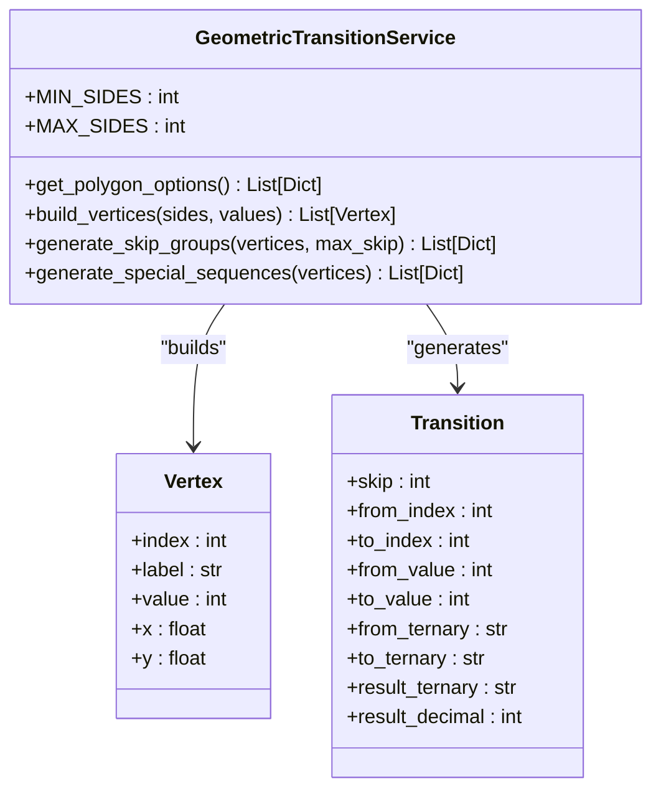
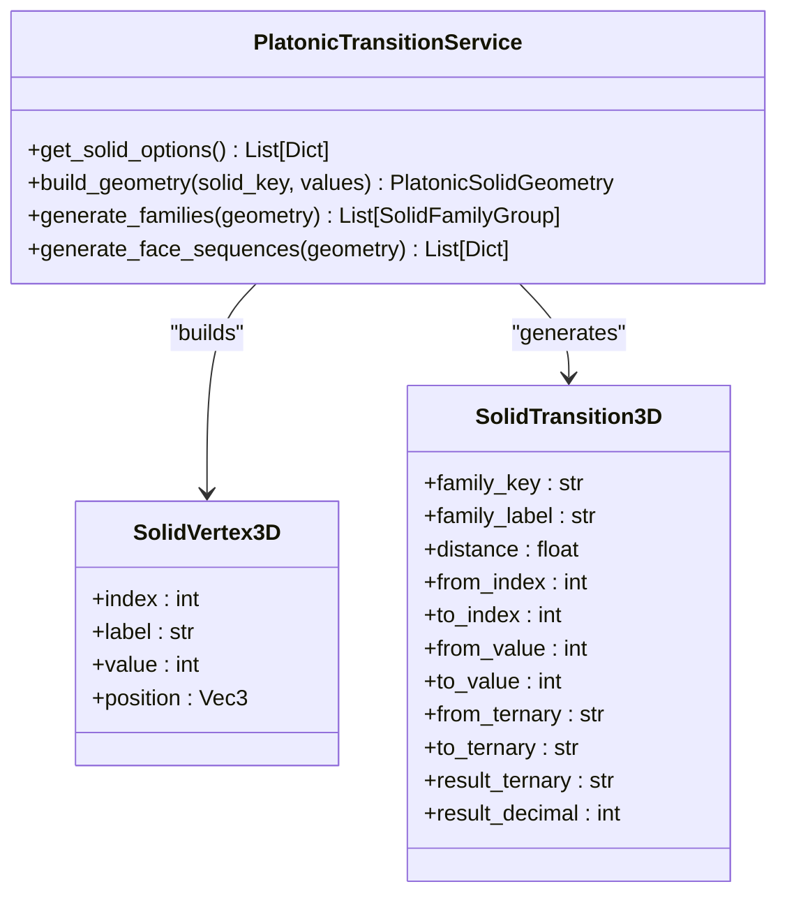
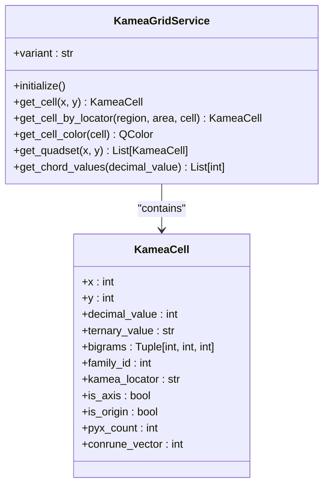
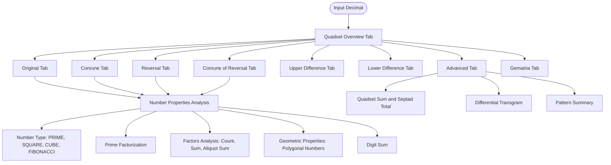
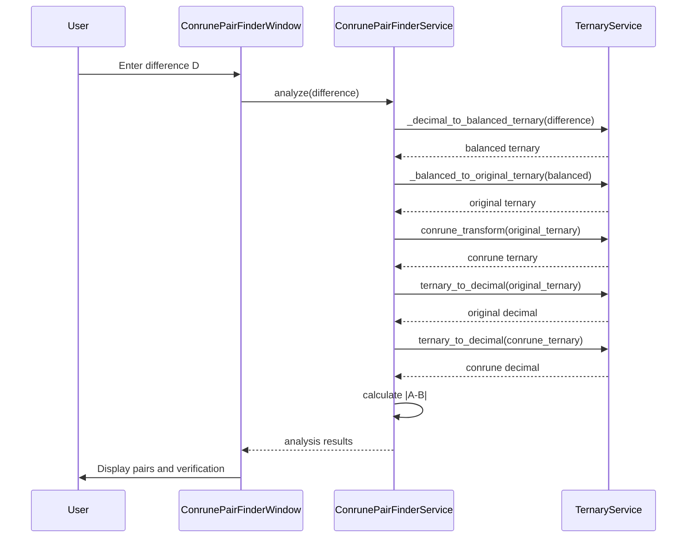
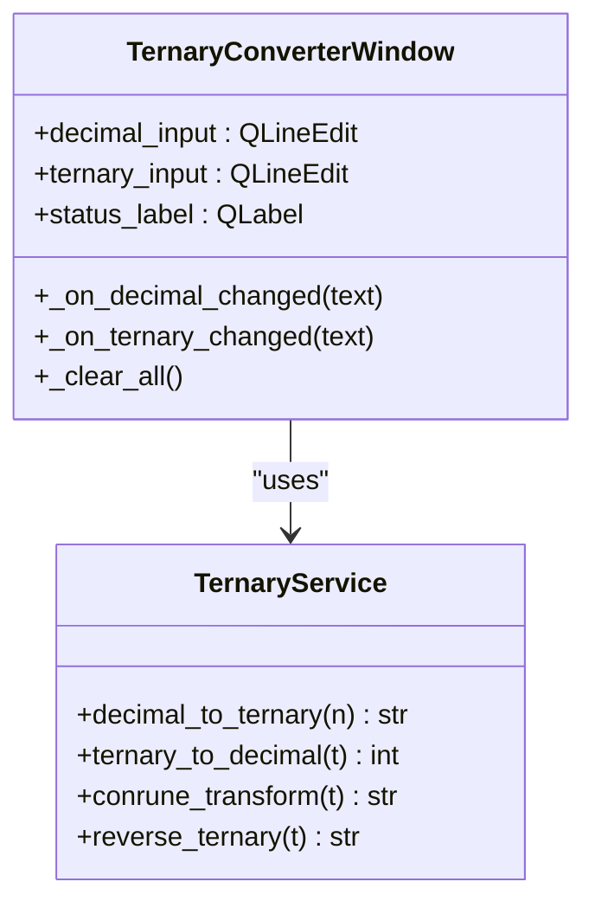
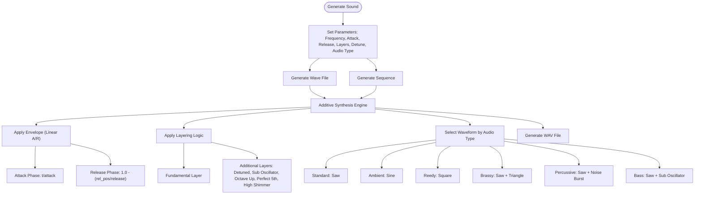

# TQ Pillar

<cite>
**Referenced Files in This Document**   
- [quadset_engine.py](file://src/pillars/tq/services/quadset_engine.py)
- [geometric_transition_service.py](file://src/pillars/tq/services/geometric_transition_service.py)
- [platonic_transition_service.py](file://src/pillars/tq/services/platonic_transition_service.py)
- [kamea_grid_service.py](file://src/pillars/tq/services/kamea_grid_service.py)
- [kamea_cell.py](file://src/pillars/tq/models/kamea_cell.py)
- [quadset_analysis_window.py](file://src/pillars/tq/ui/quadset_analysis_window.py)
- [conrune_pair_finder_service.py](file://src/pillars/tq/services/conrune_pair_finder_service.py)
- [conrune_pair_finder_window.py](file://src/pillars/tq/ui/conrune_pair_finder_window.py)
- [ternary_service.py](file://src/pillars/tq/services/ternary_service.py)
- [amun_audio_service.py](file://src/pillars/tq/services/amun_audio_service.py)
- [ternary_converter_window.py](file://src/pillars/tq/ui/ternary_converter_window.py)
- [geometric_transitions_window.py](file://src/pillars/tq/ui/geometric_transitions_window.py)
- [kamea_baphomet.csv](file://Docs/kamea/kamea_baphomet.csv)
- [kamea_baphomet_ternary.csv](file://Docs/kamea/kamea_baphomet_ternary.csv)
</cite>

## Table of Contents
1. [Introduction](#introduction)
2. [QuadsetEngine](#quadsetengine)
3. [Geometric and Platonic Transition Services](#geometric-and-platonic-transition-services)
4. [Kamea Grid System](#kamea-grid-system)
5. [Quadset Analysis and Rune Pairing](#quadset-analysis-and-rune-pairing)
6. [Ternary Conversion and Sound Generation](#ternary-conversion-and-sound-generation)
7. [Integration and Troubleshooting](#integration-and-troubleshooting)

## Introduction
The TQ (Trigrammaton QBLH) Pillar provides advanced research tools for analyzing QBLH patterns through trigrammatic systems. This documentation details the core components of the TQ Pillar, including the QuadsetEngine for processing trigrammatic patterns, geometric transformation services, the Kamea grid system, and audio generation capabilities. The system integrates numerical analysis with symbolic meanings, enabling comprehensive pattern analysis for esoteric research.

## QuadsetEngine
The QuadsetEngine orchestrates the transformation pipeline for Quadset calculations, performing a full analysis on decimal numbers to generate comprehensive result models. It processes input through multiple transformation stages including original value, conrune transformation, reversal, and conrune of reversal, while calculating differentials and transgrams.

The engine follows a systematic process:
1. Converts the input decimal to ternary representation
2. Applies conrune transformation (0→0, 1→2, 2→1)
3. Calculates reversals of both original and conrune values
4. Computes upper and lower differentials between transformed values
5. Generates transgrams through ternary transitions
6. Performs pattern analysis on the resulting quadset

The QuadsetEngine returns a structured result containing all transformation members, their properties, and analytical summaries, enabling comprehensive analysis of numerical patterns and their symbolic relationships.

**Section sources**
- [quadset_engine.py](file://src/pillars/tq/services/quadset_engine.py#L1-L87)

## Geometric and Platonic Transition Services
The TQ Pillar includes specialized services for mapping numerical patterns to geometric transformations. The GeometricTransitionService generates transitions on regular polygons from 3 to 27 sides, creating vertex connections based on skip values and special sequences. It supports predefined patterns like the "Lovely Star" heptagram and provides comprehensive analysis of transition groups.

**Diagram sources**
- [geometric_transition_service.py](file://src/pillars/tq/services/geometric_transition_service.py#L1-L323)

The PlatonicTransitionService extends this capability to three-dimensional geometric analysis using Platonic and Archimedean solids. It generates ternary transitions based on vertex connections in tetrahedrons, cubes, octahedrons, dodecahedrons, icosahedrons, and cuboctahedrons. The service calculates geometric families based on distance metrics between vertices and supports face-based sequence generation.

**Diagram sources**
- [platonic_transition_service.py](file://src/pillars/tq/services/platonic_transition_service.py#L1-L371)

## Kamea Grid System
The Kamea grid system implements a 27x27 matrix for advanced pattern analysis, with data sourced from validated CSV files. The KameaGridService acts as the Source of Truth, loading data from kamea_baphomet.csv and kamea_baphomet_ternary.csv for the Baphomet variant, or from kamea_maut.csv and kamea_maut_ternary.csv for the Maut variant.

The system represents each cell with Cartesian coordinates (x, y) ranging from -13 to +13, containing decimal values, 6-digit ternary representations, and bigram values. Each KameaCell includes properties for region (macro), area (meso), and cell (micro) identification, with family IDs derived from the core bigram.

**Diagram sources**
- [kamea_grid_service.py](file://src/pillars/tq/services/kamea_grid_service.py#L1-L220)
- [kamea_cell.py](file://src/pillars/tq/models/kamea_cell.py#L1-L59)

The service supports two operational modes:
- **Maut variant**: Returns full quadsets (Identity, Conrune, Conrune-Reversal, Reversal) using coordinate transformations (x,y), (-x,-y), (-x,y), (x,-y)
- **Baphomet variant**: Returns converse pairs using horizontal reflection (x,y) and (-x,y), with identity for x=0

Additional cell properties include axis detection, origin identification, dimensional density (count of '0's in ternary value), and conrune vector magnitude calculations.

**Section sources**
- [kamea_grid_service.py](file://src/pillars/tq/services/kamea_grid_service.py#L1-L220)
- [kamea_cell.py](file://src/pillars/tq/models/kamea_cell.py#L1-L59)
- [kamea_baphomet.csv](file://Docs/kamea/kamea_baphomet.csv)
- [kamea_baphomet_ternary.csv](file://Docs/kamea/kamea_baphomet_ternary.csv)

## Quadset Analysis and Rune Pairing
The TQ Pillar provides specialized tools for analyzing quadsets and performing rune pairing operations. The QuadsetAnalysisWindow offers a comprehensive interface for detailed property analysis, featuring tabbed views for each quadset member and their properties.

**Diagram sources**
- [quadset_analysis_window.py](file://src/pillars/tq/ui/quadset_analysis_window.py#L1-L800)

The ConrunePairFinderService and associated ConrunePairFinderWindow enable rune pairing operations by computing conrune pair information based on a target difference D. The service converts the difference to balanced ternary, maps it to the original ternary pair and its conrune counterpart, then verifies the absolute difference matches the input value.

**Diagram sources**
- [conrune_pair_finder_service.py](file://src/pillars/tq/services/conrune_pair_finder_service.py#L1-L82)
- [conrune_pair_finder_window.py](file://src/pillars/tq/ui/conrune_pair_finder_window.py#L1-L398)

## Ternary Conversion and Sound Generation
The TQ Pillar implements a comprehensive ternary conversion system through the TernaryService, which handles bidirectional transformations between decimal and ternary representations. The service supports negative numbers and provides transformation functions including conrune (0→0, 1→2, 2→1) and reversal operations.

**Diagram sources**
- [ternary_service.py](file://src/pillars/tq/services/ternary_service.py#L1-L114)
- [ternary_converter_window.py](file://src/pillars/tq/ui/ternary_converter_window.py#L1-L154)

Sound generation is handled by the AmunAudioService, which creates WAV files using additive synthesis. The service supports multiple audio types (Standard, Ambient, Reedy, Brassy, Percussive, Plucked, Bass, Pulse) with configurable parameters including frequency, attack, release, layers, and detuning. It can generate both individual wave files and sequences of signatures.

**Diagram sources**
- [amun_audio_service.py](file://src/pillars/tq/services/amun_audio_service.py#L1-L256)

## Integration and Troubleshooting
The TQ Pillar integrates with the Geometry pillar for visualizing geometric transitions through specialized windows like GeometricTransitionsWindow and GeometricTransitions3DWindow. These interfaces provide interactive visualization of polygonal and polyhedral transitions, allowing users to explore numerical patterns in geometric contexts.

Key integration points include:
- Context menu actions for sending values to Quadset Analysis
- Database lookup functionality for gematria research
- Cross-pillar value conversion and rounding
- Shared window management through WindowManager

Common troubleshooting issues with pattern matching algorithms include:
1. **CSV data loading failures**: Verify the existence and accessibility of kamea_baphomet.csv and kamea_baphomet_ternary.csv files
2. **Ternary conversion errors**: Ensure input values are valid integers and ternary strings contain only digits 0, 1, and 2
3. **Geometric transition mismatches**: Validate that polygon side counts are within the supported range (3-27)
4. **Platonic solid initialization**: Confirm that solid builders return valid SolidPayload objects
5. **Audio generation issues**: Check that frequency values are non-zero and within audible ranges

The system provides comprehensive error handling and logging, with the KameaGridService logging initialization status and the various UI components providing user feedback through status labels and context-appropriate error messages.

**Section sources**
- [geometric_transitions_window.py](file://src/pillars/tq/ui/geometric_transitions_window.py#L1-L800)
- [quadset_analysis_window.py](file://src/pillars/tq/ui/quadset_analysis_window.py#L1-L800)
- [conrune_pair_finder_window.py](file://src/pillars/tq/ui/conrune_pair_finder_window.py#L1-L398)