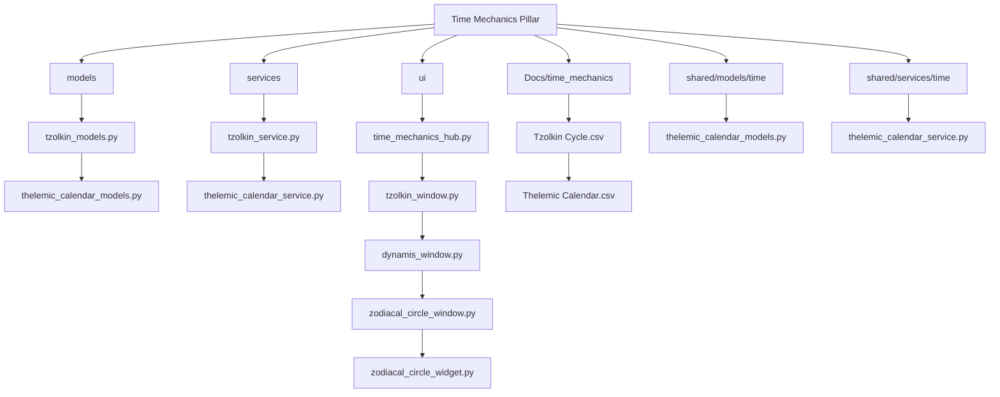
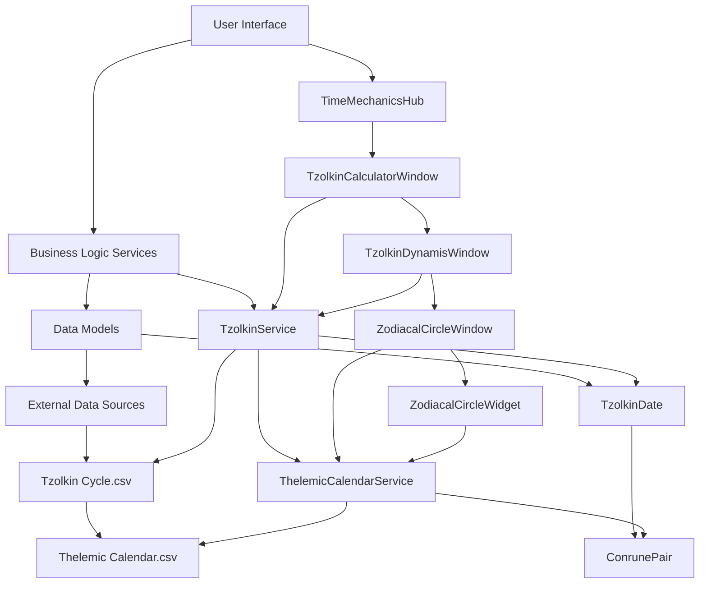
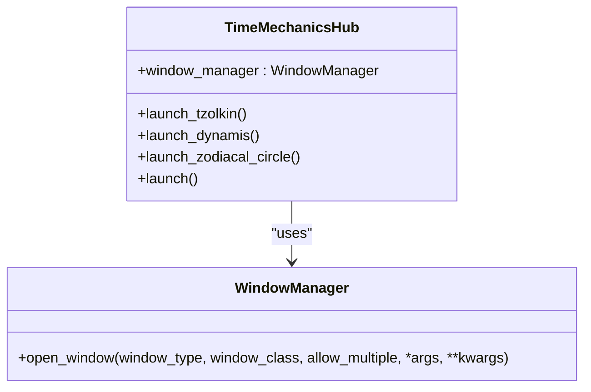
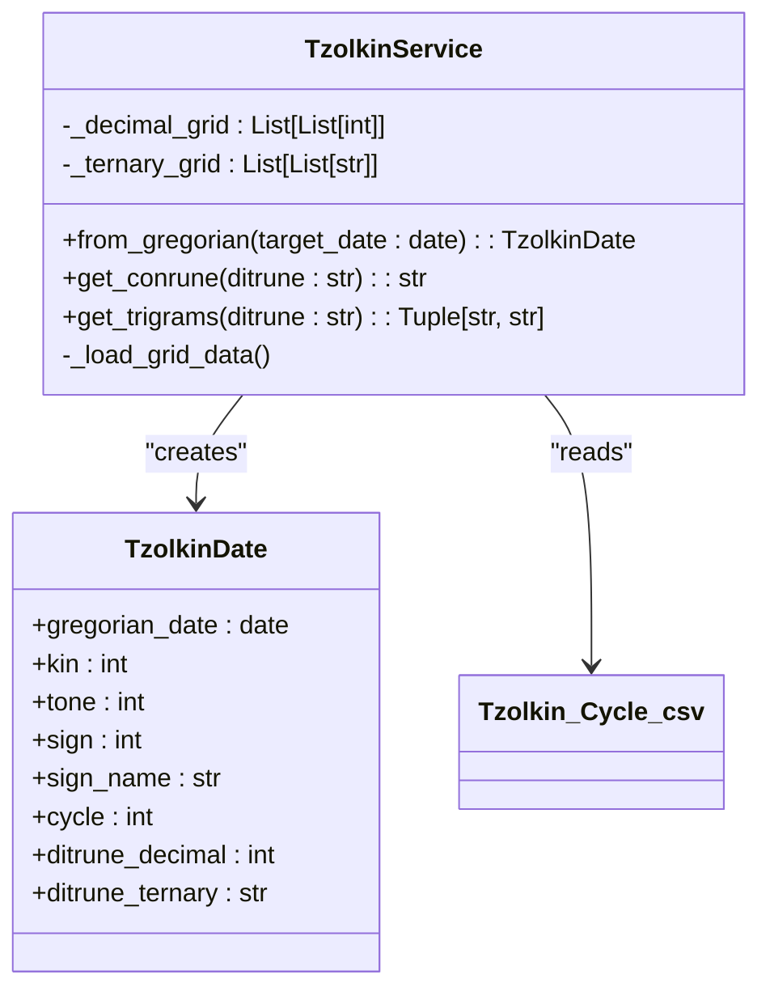
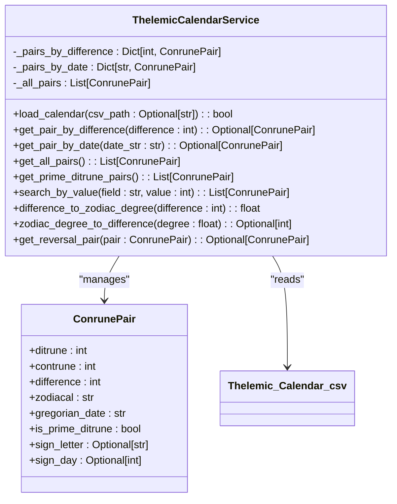
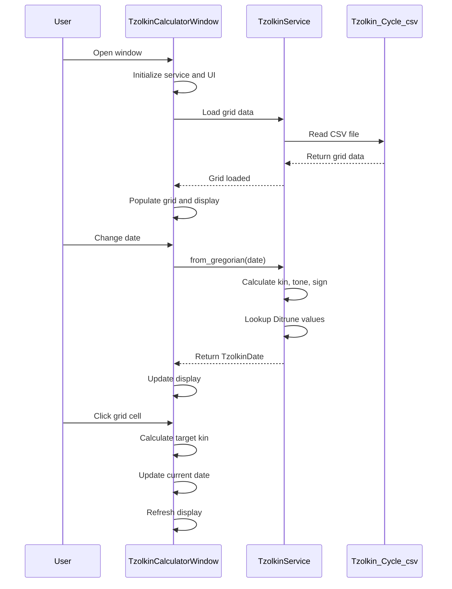
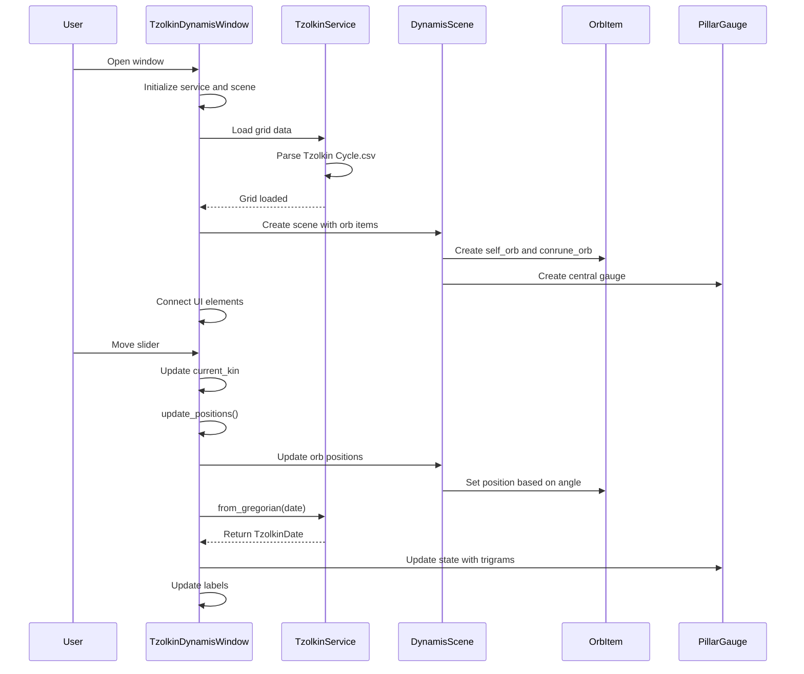
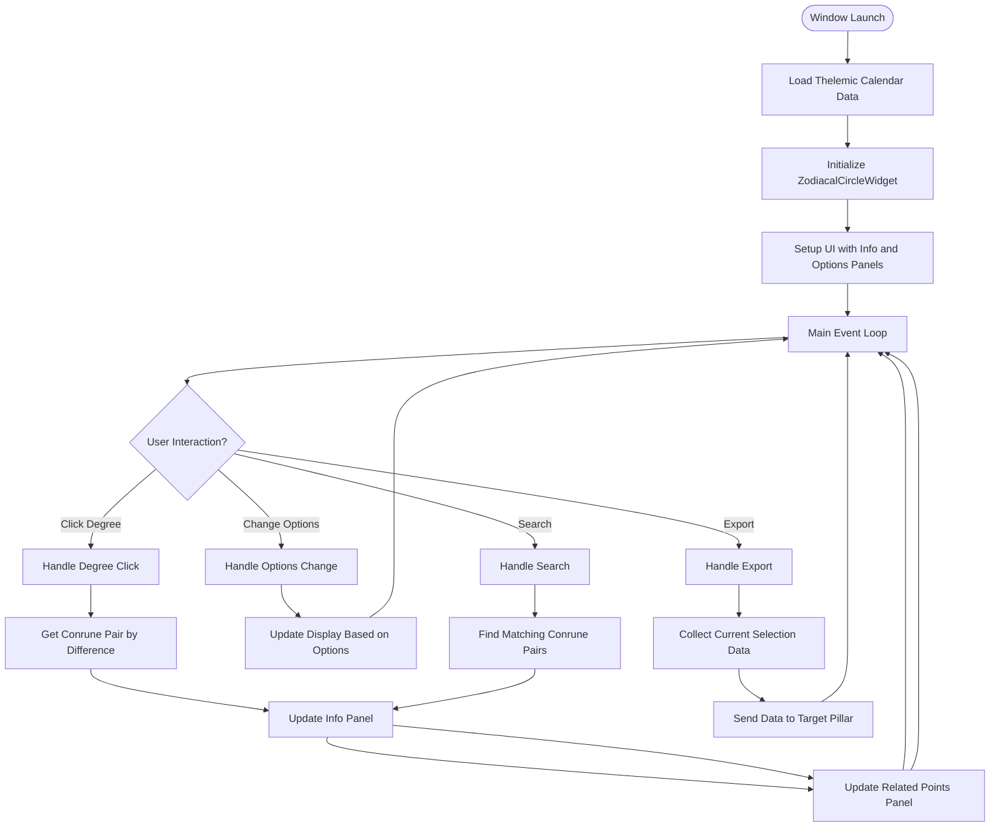
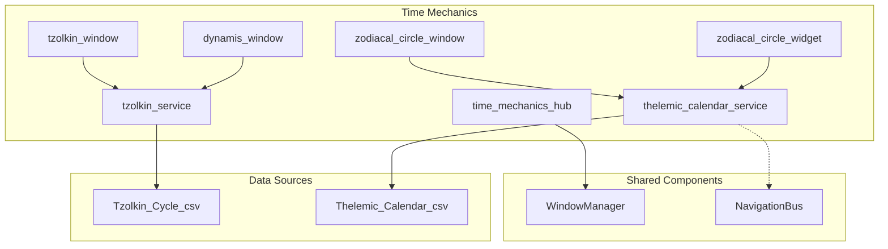

# Time Mechanics Hub

<cite>
**Referenced Files in This Document**   
- [time_mechanics_hub.py](file://src/pillars/time_mechanics/ui/time_mechanics_hub.py)
- [tzolkin_window.py](file://src/pillars/time_mechanics/ui/tzolkin_window.py)
- [dynamis_window.py](file://src/pillars/time_mechanics/ui/dynamis_window.py)
- [zodiacal_circle_window.py](file://src/pillars/time_mechanics/ui/zodiacal_circle_window.py)
- [zodiacal_circle_widget.py](file://src/pillars/time_mechanics/ui/zodiacal_circle_widget.py)
- [tzolkin_models.py](file://src/pillars/time_mechanics/models/tzolkin_models.py)
- [tzolkin_service.py](file://src/pillars/time_mechanics/services/tzolkin_service.py)
- [thelemic_calendar_models.py](file://shared/models/time/thelemic_calendar_models.py)
- [thelemic_calendar_service.py](file://shared/services/time/thelemic_calendar_service.py)
- [Tzolkin Cycle.csv](file://Docs/time_mechanics/Tzolkin Cycle.csv)
- [Thelemic Calendar.csv](file://Docs/time_mechanics/Thelemic Calendar.csv)
</cite>

## Table of Contents
1. [Introduction](#introduction)
2. [Project Structure](#project-structure)
3. [Core Components](#core-components)
4. [Architecture Overview](#architecture-overview)
5. [Detailed Component Analysis](#detailed-component-analysis)
6. [Dependency Analysis](#dependency-analysis)
7. [Performance Considerations](#performance-considerations)
8. [Troubleshooting Guide](#troubleshooting-guide)
9. [Conclusion](#conclusion)

## Introduction
The Time Mechanics Hub is a sophisticated temporal analysis system that integrates multiple calendrical and symbolic systems to provide deep insights into time-based patterns and relationships. This documentation provides a comprehensive overview of the Time Mechanics Hub's architecture, components, and functionality, focusing on its implementation of the Tzolkin calendar, the Thelemic calendar, and their visualization through interactive interfaces.

## Project Structure
The Time Mechanics Hub is organized within the `src/pillars/time_mechanics` directory, which contains models, services, and UI components that work together to provide temporal analysis capabilities. The system integrates with shared services and models in the `shared` directory for cross-pillar functionality.

**Diagram sources**
- [time_mechanics_hub.py](file://src/pillars/time_mechanics/ui/time_mechanics_hub.py)
- [tzolkin_window.py](file://src/pillars/time_mechanics/ui/tzolkin_window.py)
- [dynamis_window.py](file://src/pillars/time_mechanics/ui/dynamis_window.py)
- [zodiacal_circle_window.py](file://src/pillars/time_mechanics/ui/zodiacal_circle_window.py)
- [zodiacal_circle_widget.py](file://src/pillars/time_mechanics/ui/zodiacal_circle_widget.py)
- [tzolkin_models.py](file://src/pillars/time_mechanics/models/tzolkin_models.py)
- [tzolkin_service.py](file://src/pillars/time_mechanics/services/tzolkin_service.py)
- [thelemic_calendar_models.py](file://shared/models/time/thelemic_calendar_models.py)
- [thelemic_calendar_service.py](file://shared/services/time/thelemic_calendar_service.py)

**Section sources**
- [time_mechanics_hub.py](file://src/pillars/time_mechanics/ui/time_mechanics_hub.py)
- [tzolkin_window.py](file://src/pillars/time_mechanics/ui/tzolkin_window.py)
- [dynamis_window.py](file://src/pillars/time_mechanics/ui/dynamis_window.py)
- [zodiacal_circle_window.py](file://src/pillars/time_mechanics/ui/zodiacal_circle_window.py)
- [zodiacal_circle_widget.py](file://src/pillars/time_mechanics/ui/zodiacal_circle_widget.py)

## Core Components
The Time Mechanics Hub consists of several core components that work together to provide temporal analysis capabilities. The system is built around two primary calendrical systems: the 260-day Tzolkin cycle and the 364-day Thelemic calendar. These systems are implemented through models that define data structures, services that provide business logic, and UI components that offer interactive interfaces.

The Tzolkin system is implemented through the `TzolkinDate` model and `TzolkinService` class, which handle the conversion between Gregorian dates and Tzolkin dates, as well as the mapping of Ditrune values from a CSV data source. The Thelemic calendar system is implemented through the `ConrunePair` model and `ThelemicCalendarService` class, which manage the 364-day cycle with its Prime Ditrune Gates and zodiacal positions.

**Section sources**
- [tzolkin_models.py](file://src/pillars/time_mechanics/models/tzolkin_models.py)
- [tzolkin_service.py](file://src/pillars/time_mechanics/services/tzolkin_service.py)
- [thelemic_calendar_models.py](file://shared/models/time/thelemic_calendar_models.py)
- [thelemic_calendar_service.py](file://shared/services/time/thelemic_calendar_service.py)

## Architecture Overview
The Time Mechanics Hub follows a layered architecture with clear separation between data models, business logic, and user interface components. The system is designed to be extensible and maintainable, with services that can be easily tested and UI components that can be developed independently.

**Diagram sources**
- [time_mechanics_hub.py](file://src/pillars/time_mechanics/ui/time_mechanics_hub.py)
- [tzolkin_window.py](file://src/pillars/time_mechanics/ui/tzolkin_window.py)
- [dynamis_window.py](file://src/pillars/time_mechanics/ui/dynamis_window.py)
- [zodiacal_circle_window.py](file://src/pillars/time_mechanics/ui/zodiacal_circle_window.py)
- [zodiacal_circle_widget.py](file://src/pillars/time_mechanics/ui/zodiacal_circle_widget.py)
- [tzolkin_service.py](file://src/pillars/time_mechanics/services/tzolkin_service.py)
- [thelemic_calendar_service.py](file://shared/services/time/thelemic_calendar_service.py)
- [tzolkin_models.py](file://src/pillars/time_mechanics/models/tzolkin_models.py)
- [thelemic_calendar_models.py](file://shared/models/time/thelemic_calendar_models.py)

## Detailed Component Analysis

### Time Mechanics Hub Analysis
The TimeMechanicsHub serves as the entry point for all temporal tools in the system. It provides a unified interface for accessing the various time mechanics features, including the Tzolkin calculator, Dynamis visualization, and Zodiacal Circle.

**Diagram sources**
- [time_mechanics_hub.py](file://src/pillars/time_mechanics/ui/time_mechanics_hub.py)
- [window_manager.py](file://src/shared/ui/window_manager.py)

**Section sources**
- [time_mechanics_hub.py](file://src/pillars/time_mechanics/ui/time_mechanics_hub.py)

### Tzolkin System Analysis
The Tzolkin system implements a 260-day harmonic cycle with Ditrune mapping and Conrune logic. The system converts Gregorian dates to Tzolkin dates and provides access to Ditrune values from a CSV data source.

**Diagram sources**
- [tzolkin_models.py](file://src/pillars/time_mechanics/models/tzolkin_models.py)
- [tzolkin_service.py](file://src/pillars/time_mechanics/services/tzolkin_service.py)
- [Tzolkin Cycle.csv](file://Docs/time_mechanics/Tzolkin Cycle.csv)

**Section sources**
- [tzolkin_models.py](file://src/pillars/time_mechanics/models/tzolkin_models.py)
- [tzolkin_service.py](file://src/pillars/time_mechanics/services/tzolkin_service.py)

### Thelemic Calendar System Analysis
The Thelemic Calendar system manages a 364-day cycle with 4 Prime Ditrune Gates that serve as intercalary days. The system maps dates to zodiacal positions and provides lookup methods for Conrune pairs by difference, date, or zodiacal position.

**Diagram sources**
- [thelemic_calendar_models.py](file://shared/models/time/thelemic_calendar_models.py)
- [thelemic_calendar_service.py](file://shared/services/time/thelemic_calendar_service.py)
- [Thelemic Calendar.csv](file://Docs/time_mechanics/Thelemic Calendar.csv)

**Section sources**
- [thelemic_calendar_models.py](file://shared/models/time/thelemic_calendar_models.py)
- [thelemic_calendar_service.py](file://shared/services/time/thelemic_calendar_service.py)

### Tzolkin Calculator Analysis
The TzolkinCalculatorWindow provides an interactive interface for calculating and navigating Tzolkin dates. The window features a 13x20 grid that represents the Tzolkin cycle, with each cell corresponding to a specific tone and sign combination.

**Diagram sources**
- [tzolkin_window.py](file://src/pillars/time_mechanics/ui/tzolkin_window.py)
- [tzolkin_service.py](file://src/pillars/time_mechanics/services/tzolkin_service.py)
- [Tzolkin Cycle.csv](file://Docs/time_mechanics/Tzolkin Cycle.csv)

**Section sources**
- [tzolkin_window.py](file://src/pillars/time_mechanics/ui/tzolkin_window.py)

### Dynamis Visualization Analysis
The TzolkinDynamisWindow provides a visual representation of the Tzolkin cycle as a circulating energy system. The visualization features an Ouroboros track with orbs representing the current kin and its Conrune (anti-self) position.

**Diagram sources**
- [dynamis_window.py](file://src/pillars/time_mechanics/ui/dynamis_window.py)
- [tzolkin_service.py](file://src/pillars/time_mechanics/services/tzolkin_service.py)
- [Tzolkin Cycle.csv](file://Docs/time_mechanics/Tzolkin Cycle.csv)

**Section sources**
- [dynamis_window.py](file://src/pillars/time_mechanics/ui/dynamis_window.py)

### Zodiacal Circle Analysis
The ZodiacalCircleWindow provides an interactive visualization of the Thelemic calendar as a 360-degree zodiacal circle. The interface allows users to explore Conrune pairs at specific degrees and analyze their relationships through various aspects.

**Diagram sources**
- [zodiacal_circle_window.py](file://src/pillars/time_mechanics/ui/zodiacal_circle_window.py)
- [zodiacal_circle_widget.py](file://src/pillars/time_mechanics/ui/zodiacal_circle_widget.py)
- [thelemic_calendar_service.py](file://shared/services/time/thelemic_calendar_service.py)

**Section sources**
- [zodiacal_circle_window.py](file://src/pillars/time_mechanics/ui/zodiacal_circle_window.py)
- [zodiacal_circle_widget.py](file://src/pillars/time_mechanics/ui/zodiacal_circle_widget.py)

## Dependency Analysis
The Time Mechanics Hub has a well-defined dependency structure that ensures separation of concerns and maintainability. The system relies on shared services and models for cross-pillar functionality while maintaining independence in its core time mechanics logic.

**Diagram sources**
- [time_mechanics_hub.py](file://src/pillars/time_mechanics/ui/time_mechanics_hub.py)
- [tzolkin_window.py](file://src/pillars/time_mechanics/ui/tzolkin_window.py)
- [dynamis_window.py](file://src/pillars/time_mechanics/ui/dynamis_window.py)
- [zodiacal_circle_window.py](file://src/pillars/time_mechanics/ui/zodiacal_circle_window.py)
- [zodiacal_circle_widget.py](file://src/pillars/time_mechanics/ui/zodiacal_circle_widget.py)
- [tzolkin_service.py](file://src/pillars/time_mechanics/services/tzolkin_service.py)
- [thelemic_calendar_service.py](file://shared/services/time/thelemic_calendar_service.py)
- [window_manager.py](file://src/shared/ui/window_manager.py)
- [navigation_bus.py](file://src/shared/signals/navigation_bus.py)

**Section sources**
- [time_mechanics_hub.py](file://src/pillars/time_mechanics/ui/time_mechanics_hub.py)
- [tzolkin_window.py](file://src/pillars/time_mechanics/ui/tzolkin_window.py)
- [dynamis_window.py](file://src/pillars/time_mechanics/ui/dynamis_window.py)
- [zodiacal_circle_window.py](file://src/pillars/time_mechanics/ui/zodiacal_circle_window.py)
- [zodiacal_circle_widget.py](file://src/pillars/time_mechanics/ui/zodiacal_circle_widget.py)
- [tzolkin_service.py](file://src/pillars/time_mechanics/services/tzolkin_service.py)
- [thelemic_calendar_service.py](file://shared/services/time/thelemic_calendar_service.py)

## Performance Considerations
The Time Mechanics Hub is designed with performance in mind, particularly in its handling of large data sets and frequent UI updates. The system loads CSV data into memory at initialization, which allows for fast lookups during runtime. The TzolkinService loads the Tzolkin Cycle.csv data into two grids (decimal and ternary) that are used for quick Ditrune value lookups.

The ZodiacalCircleWidget pre-calculates hitboxes for all 360 degrees during each paint event, which could be optimized by caching these calculations when the widget size doesn't change. The ThelemicCalendarService loads the entire Thelemic Calendar.csv into memory and creates lookup dictionaries by difference and date, enabling O(1) access to Conrune pairs.

For large-scale operations, the system could benefit from lazy loading of data or pagination of results, particularly in the search functionality of the ZodiacalCircleWindow. The current implementation loads all 364 Conrune pairs into memory, which is acceptable for the current data size but may need optimization if the data set grows significantly.

## Troubleshooting Guide
When encountering issues with the Time Mechanics Hub, consider the following common problems and solutions:

1. **CSV files not found**: Ensure that the Docs/time_mechanics directory contains the Tzolkin Cycle.csv and Thelemic Calendar.csv files. The services use relative paths to locate these files, so moving the application directory may break these paths.

2. **Empty or incorrect Ditrune values**: Verify that the Tzolkin Cycle.csv file is properly formatted with 20 rows of decimal values followed by 20 rows of ternary values. The service expects this specific format to populate its internal grids.

3. **Zodiacal Circle not displaying correctly**: Check that the Astronomicon font is available in the system. The ZodiacalCircleWidget attempts to load this font for displaying zodiac signs, falling back to Arial if unavailable.

4. **Performance issues with large operations**: If the application becomes unresponsive during data operations, consider optimizing the data loading process or implementing asynchronous operations for long-running tasks.

5. **Cross-pillar communication failures**: When exporting data to other pillars (e.g., Emerald Tablet), ensure that the NavigationBus is properly initialized and that the target windows are registered in the window manager.

**Section sources**
- [tzolkin_service.py](file://src/pillars/time_mechanics/services/tzolkin_service.py)
- [thelemic_calendar_service.py](file://shared/services/time/thelemic_calendar_service.py)
- [zodiacal_circle_widget.py](file://src/pillars/time_mechanics/ui/zodiacal_circle_widget.py)
- [zodiacal_circle_window.py](file://src/pillars/time_mechanics/ui/zodiacal_circle_window.py)

## Conclusion
The Time Mechanics Hub provides a comprehensive system for analyzing temporal patterns through the integration of the Tzolkin calendar and the Thelemic calendar. The system's modular architecture, with clear separation between models, services, and UI components, enables maintainability and extensibility. The interactive visualizations, including the Tzolkin calculator, Dynamis animation, and Zodiacal Circle, provide intuitive interfaces for exploring complex temporal relationships. By leveraging shared services and models, the Time Mechanics Hub integrates seamlessly with other pillars in the IsopGem application while maintaining its specialized functionality for time-based analysis.