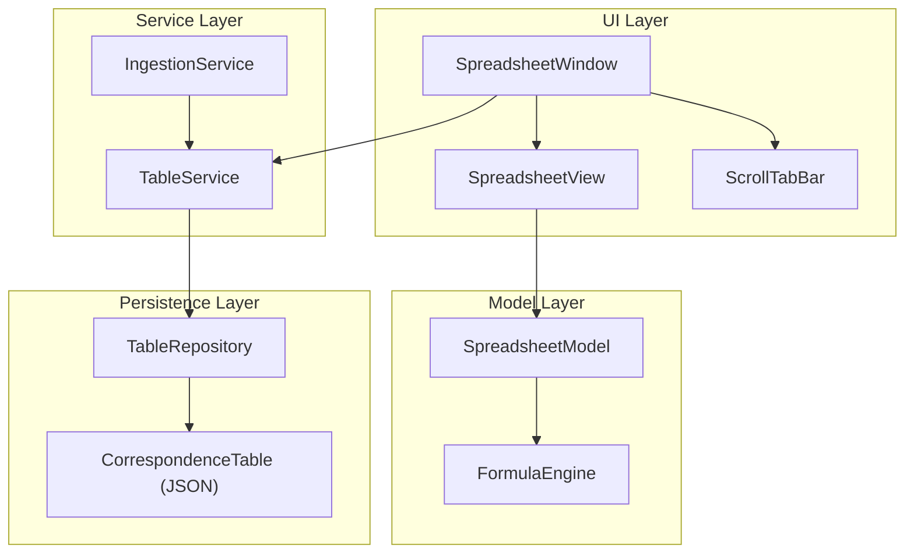
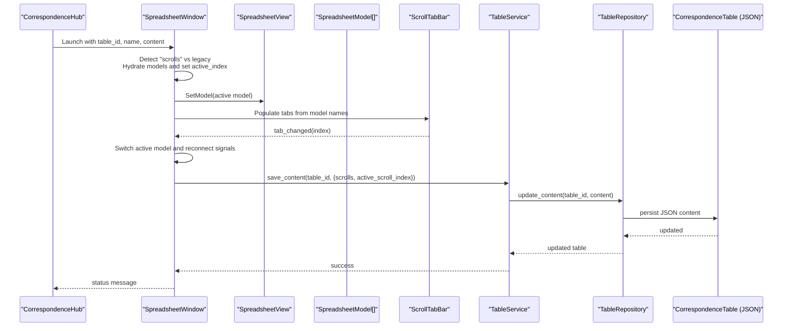
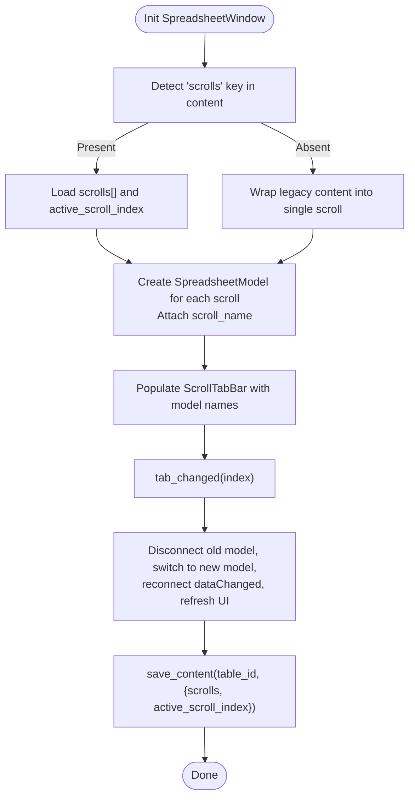
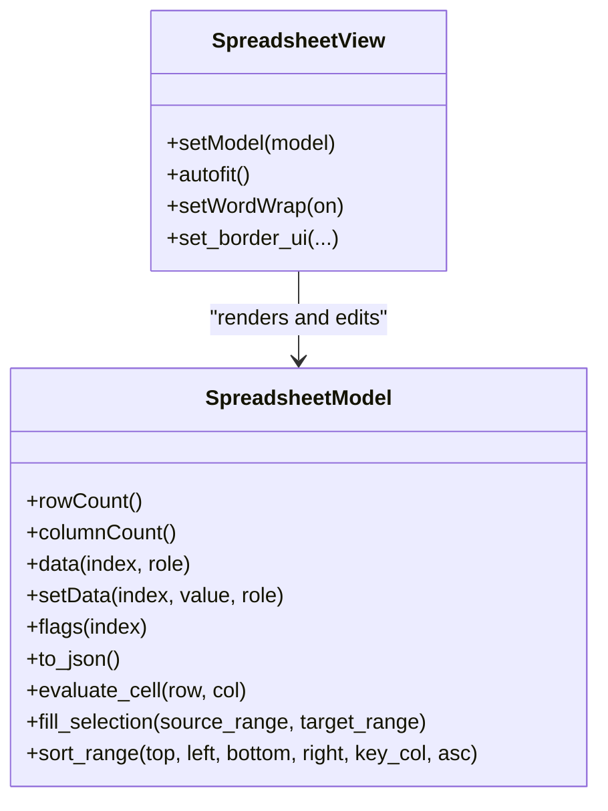
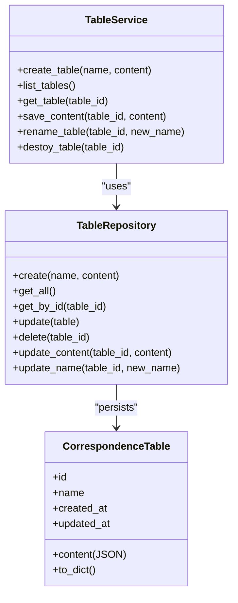
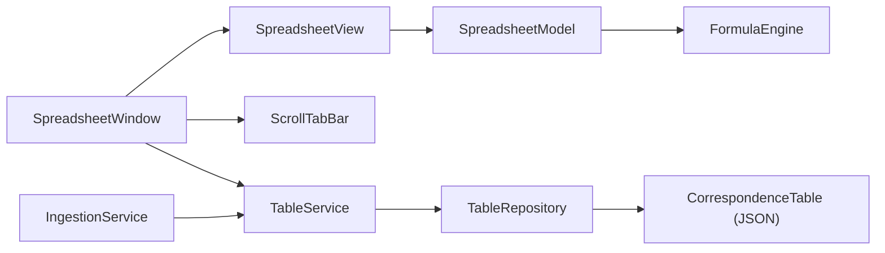

# Correspondences Spreadsheet Multi-Sheet Support

<cite>
**Referenced Files in This Document**
- [spreadsheet_window.py](file://src/pillars/correspondences/ui/spreadsheet_window.py)
- [spreadsheet_view.py](file://src/pillars/correspondences/ui/spreadsheet_view.py)
- [scroll_tab_bar.py](file://src/pillars/correspondences/ui/scroll_tab_bar.py)
- [table_service.py](file://src/pillars/correspondences/services/table_service.py)
- [table_repository.py](file://src/pillars/correspondences/repos/table_repository.py)
- [correspondence_models.py](file://src/pillars/correspondences/models/correspondence_models.py)
- [formula_engine.py](file://src/pillars/correspondences/services/formula_engine.py)
- [ingestion_service.py](file://src/pillars/correspondences/services/ingestion_service.py)
- [correspondence_hub.py](file://src/pillars/correspondences/ui/correspondence_hub.py)
</cite>

## Table of Contents
1. [Introduction](#introduction)
2. [Project Structure](#project-structure)
3. [Core Components](#core-components)
4. [Architecture Overview](#architecture-overview)
5. [Detailed Component Analysis](#detailed-component-analysis)
6. [Dependency Analysis](#dependency-analysis)
7. [Performance Considerations](#performance-considerations)
8. [Troubleshooting Guide](#troubleshooting-guide)
9. [Conclusion](#conclusion)

## Introduction
This document explains how the Correspondences Spreadsheet supports multiple sheets (“scrolls”) within a single tablet. It covers the UI architecture, data model, persistence, and the end-to-end flow for creating, switching, and saving multi-sheet spreadsheets. It also highlights how formulas and references behave across sheets and how legacy single-sheet content is migrated to the new multi-scroll format.

## Project Structure
The multi-sheet feature spans UI, model, service, and persistence layers:
- UI: SpreadsheetWindow hosts the grid, formula bar, toolbar, and a ScrollTabBar for sheet navigation.
- Model: SpreadsheetModel adapts JSON grid data to Qt’s table model and evaluates formulas.
- Services: TableService and TableRepository manage CRUD and persistence of tablets.
- Persistence: CorrespondenceTable stores the entire content as JSON, including multiple scrolls.
- Formula Engine: FormulaEngine resolves cell and range references within and across sheets.
- Ingestion: IngestionService converts CSV/Excel into the grid JSON format.
- Hub: CorrespondenceHub manages the library of tablets and launches SpreadsheetWindows.

**Diagram sources**
- [spreadsheet_window.py](file://src/pillars/correspondences/ui/spreadsheet_window.py#L1-L120)
- [spreadsheet_view.py](file://src/pillars/correspondences/ui/spreadsheet_view.py#L1-L120)
- [scroll_tab_bar.py](file://src/pillars/correspondences/ui/scroll_tab_bar.py#L1-L98)
- [table_service.py](file://src/pillars/correspondences/services/table_service.py#L1-L39)
- [table_repository.py](file://src/pillars/correspondences/repos/table_repository.py#L1-L66)
- [correspondence_models.py](file://src/pillars/correspondences/models/correspondence_models.py#L1-L41)
- [formula_engine.py](file://src/pillars/correspondences/services/formula_engine.py#L1-L120)
- [ingestion_service.py](file://src/pillars/correspondences/services/ingestion_service.py#L1-L87)
- [correspondence_hub.py](file://src/pillars/correspondences/ui/correspondence_hub.py#L1-L120)

**Section sources**
- [spreadsheet_window.py](file://src/pillars/correspondences/ui/spreadsheet_window.py#L1-L120)
- [spreadsheet_view.py](file://src/pillars/correspondences/ui/spreadsheet_view.py#L1-L120)
- [table_service.py](file://src/pillars/correspondences/services/table_service.py#L1-L39)
- [table_repository.py](file://src/pillars/correspondences/repos/table_repository.py#L1-L66)
- [correspondence_models.py](file://src/pillars/correspondences/models/correspondence_models.py#L1-L41)
- [formula_engine.py](file://src/pillars/correspondences/services/formula_engine.py#L1-L120)
- [ingestion_service.py](file://src/pillars/correspondences/services/ingestion_service.py#L1-L87)
- [correspondence_hub.py](file://src/pillars/correspondences/ui/correspondence_hub.py#L1-L120)

## Core Components
- SpreadsheetWindow: Orchestrates the UI, initializes multiple SpreadsheetModel instances from content, manages the ScrollTabBar, and coordinates saving to the service.
- SpreadsheetView and SpreadsheetModel: Provide the grid, rendering, editing, and formula evaluation.
- ScrollTabBar: Provides add, navigation, and menu actions for managing multiple sheets.
- TableService/TableRepository/CorrespondenceTable: Persist and retrieve the entire tablet content, including multiple scrolls and active sheet index.
- FormulaEngine: Parses and evaluates formulas, resolving cell and range references.
- IngestionService: Converts CSV/Excel into the grid JSON structure.
- CorrespondenceHub: Launches SpreadsheetWindow and manages the library of tablets.

**Section sources**
- [spreadsheet_window.py](file://src/pillars/correspondences/ui/spreadsheet_window.py#L1-L120)
- [spreadsheet_view.py](file://src/pillars/correspondences/ui/spreadsheet_view.py#L1-L120)
- [scroll_tab_bar.py](file://src/pillars/correspondences/ui/scroll_tab_bar.py#L1-L98)
- [table_service.py](file://src/pillars/correspondences/services/table_service.py#L1-L39)
- [table_repository.py](file://src/pillars/correspondences/repos/table_repository.py#L1-L66)
- [correspondence_models.py](file://src/pillars/correspondences/models/correspondence_models.py#L1-L41)
- [formula_engine.py](file://src/pillars/correspondences/services/formula_engine.py#L1-L120)
- [ingestion_service.py](file://src/pillars/correspondences/services/ingestion_service.py#L1-L87)
- [correspondence_hub.py](file://src/pillars/correspondences/ui/correspondence_hub.py#L1-L120)

## Architecture Overview
The multi-sheet architecture centers on a single SpreadsheetWindow hosting multiple SpreadsheetModel instances. Content is stored as a JSON object with a “scrolls” array and an “active_scroll_index”. The UI renders a ScrollTabBar populated from the model names and switches the active model on tab change. Saving serializes all models into the “scrolls” array and persists the active index.

**Diagram sources**
- [correspondence_hub.py](file://src/pillars/correspondences/ui/correspondence_hub.py#L420-L459)
- [spreadsheet_window.py](file://src/pillars/correspondences/ui/spreadsheet_window.py#L29-L120)
- [spreadsheet_window.py](file://src/pillars/correspondences/ui/spreadsheet_window.py#L948-L996)
- [table_service.py](file://src/pillars/correspondences/services/table_service.py#L24-L31)
- [table_repository.py](file://src/pillars/correspondences/repos/table_repository.py#L45-L54)
- [correspondence_models.py](file://src/pillars/correspondences/models/correspondence_models.py#L1-L41)

## Detailed Component Analysis

### SpreadsheetWindow: Multi-Sheet Orchestration
- Content hydration:
  - Detects presence of a “scrolls” key to support the new multi-scroll format.
  - Falls back to legacy single-sheet format by wrapping content into a single scroll.
  - Stores model names on each SpreadsheetModel instance for tab display.
- Tab management:
  - Adds a ScrollTabBar and populates tabs from model names.
  - Emits signals for adding and switching tabs.
- Active sheet switching:
  - Disconnects old model dataChanged, switches to new model, reconnects, and refreshes UI state.
- Saving:
  - Serializes all models into a “scrolls” array and persists the “active_scroll_index”.

**Diagram sources**
- [spreadsheet_window.py](file://src/pillars/correspondences/ui/spreadsheet_window.py#L29-L120)
- [spreadsheet_window.py](file://src/pillars/correspondences/ui/spreadsheet_window.py#L948-L996)
- [scroll_tab_bar.py](file://src/pillars/correspondences/ui/scroll_tab_bar.py#L1-L98)

**Section sources**
- [spreadsheet_window.py](file://src/pillars/correspondences/ui/spreadsheet_window.py#L29-L120)
- [spreadsheet_window.py](file://src/pillars/correspondences/ui/spreadsheet_window.py#L948-L996)
- [scroll_tab_bar.py](file://src/pillars/correspondences/ui/scroll_tab_bar.py#L1-L98)

### SpreadsheetView and SpreadsheetModel: Rendering and Editing
- SpreadsheetModel:
  - Adapts JSON columns/data/styles to Qt’s model interface.
  - Evaluates formulas via FormulaEngine and caches results to avoid recomputation.
  - Supports batch fill operations and range sorting with undo commands.
- SpreadsheetView:
  - Provides rich text rendering, custom delegate painting, and fill handle drag behavior.
  - Manages selection, context menus, and border UI wiring.

**Diagram sources**
- [spreadsheet_view.py](file://src/pillars/correspondences/ui/spreadsheet_view.py#L1-L120)
- [spreadsheet_view.py](file://src/pillars/correspondences/ui/spreadsheet_view.py#L608-L720)

**Section sources**
- [spreadsheet_view.py](file://src/pillars/correspondences/ui/spreadsheet_view.py#L1-L120)
- [spreadsheet_view.py](file://src/pillars/correspondences/ui/spreadsheet_view.py#L608-L720)

### ScrollTabBar: Sheet Navigation
- Provides:
  - Add scroll button (+).
  - Menu of all scrolls (≡).
  - Previous/next navigation buttons.
  - Draggable tabs and current index management.
- Emits signals for adding and switching tabs.

**Section sources**
- [scroll_tab_bar.py](file://src/pillars/correspondences/ui/scroll_tab_bar.py#L1-L98)

### TableService, TableRepository, and CorrespondenceTable: Persistence
- TableService:
  - Exposes create/list/get/save/rename/delete operations.
- TableRepository:
  - Persists the entire JSON content of a tablet, including “scrolls” and “active_scroll_index”.
- CorrespondenceTable:
  - SQLAlchemy model storing id, name, timestamps, and JSON content.

**Diagram sources**
- [table_service.py](file://src/pillars/correspondences/services/table_service.py#L1-L39)
- [table_repository.py](file://src/pillars/correspondences/repos/table_repository.py#L1-L66)
- [correspondence_models.py](file://src/pillars/correspondences/models/correspondence_models.py#L1-L41)

**Section sources**
- [table_service.py](file://src/pillars/correspondences/services/table_service.py#L1-L39)
- [table_repository.py](file://src/pillars/correspondences/repos/table_repository.py#L1-L66)
- [correspondence_models.py](file://src/pillars/correspondences/models/correspondence_models.py#L1-L41)

### Formula Engine: Cross-Sheet References
- FormulaEngine parses formulas and resolves:
  - Single cell references (e.g., A1).
  - Range references (e.g., A1:B2).
- It delegates resolution to the model’s evaluation context, which supports cyclic dependency detection and caching.

Notes:
- The current implementation focuses on cell/range resolution within the active model. Cross-sheet references are not explicitly implemented in the provided code. If cross-sheet references are needed, the model evaluation context would need to be extended to resolve references across models.

**Section sources**
- [formula_engine.py](file://src/pillars/correspondences/services/formula_engine.py#L1-L120)
- [formula_engine.py](file://src/pillars/correspondences/services/formula_engine.py#L362-L446)
- [spreadsheet_view.py](file://src/pillars/correspondences/ui/spreadsheet_view.py#L140-L170)

### IngestionService: Importing CSV/Excel
- Converts CSV/XLSX/XLS into the grid JSON structure with “columns” and “data”.
- Sanitizes values to ensure JSON serializability.
- Provides a helper to create empty grids with default dimensions.

**Section sources**
- [ingestion_service.py](file://src/pillars/correspondences/services/ingestion_service.py#L1-L87)

### CorrespondenceHub: Library and Launch
- Presents a library of tablets and allows creating/importing new ones.
- Launches SpreadsheetWindow with the selected tablet’s content and keeps the session alive for the window.

**Section sources**
- [correspondence_hub.py](file://src/pillars/correspondences/ui/correspondence_hub.py#L1-L120)
- [correspondence_hub.py](file://src/pillars/correspondences/ui/correspondence_hub.py#L420-L459)

## Dependency Analysis
- SpreadsheetWindow depends on SpreadsheetView, ScrollTabBar, and TableService.
- SpreadsheetView depends on SpreadsheetModel and FormulaEngine.
- TableService depends on TableRepository.
- TableRepository persists to CorrespondenceTable (JSON content).
- IngestionService produces content consumed by TableService.

**Diagram sources**
- [spreadsheet_window.py](file://src/pillars/correspondences/ui/spreadsheet_window.py#L1-L120)
- [spreadsheet_view.py](file://src/pillars/correspondences/ui/spreadsheet_view.py#L1-L120)
- [table_service.py](file://src/pillars/correspondences/services/table_service.py#L1-L39)
- [table_repository.py](file://src/pillars/correspondences/repos/table_repository.py#L1-L66)
- [correspondence_models.py](file://src/pillars/correspondences/models/correspondence_models.py#L1-L41)
- [formula_engine.py](file://src/pillars/correspondences/services/formula_engine.py#L1-L120)
- [ingestion_service.py](file://src/pillars/correspondences/services/ingestion_service.py#L1-L87)

**Section sources**
- [spreadsheet_window.py](file://src/pillars/correspondences/ui/spreadsheet_window.py#L1-L120)
- [spreadsheet_view.py](file://src/pillars/correspondences/ui/spreadsheet_view.py#L1-L120)
- [table_service.py](file://src/pillars/correspondences/services/table_service.py#L1-L39)
- [table_repository.py](file://src/pillars/correspondences/repos/table_repository.py#L1-L66)
- [correspondence_models.py](file://src/pillars/correspondences/models/correspondence_models.py#L1-L41)
- [formula_engine.py](file://src/pillars/correspondences/services/formula_engine.py#L1-L120)
- [ingestion_service.py](file://src/pillars/correspondences/services/ingestion_service.py#L1-L87)

## Performance Considerations
- Evaluation caching: SpreadsheetModel caches formula results to avoid repeated computation.
- Batch operations: fill_selection uses beginResetModel/endResetModel to minimize UI updates during large writes.
- Sorting: sort_range captures blocks and pushes a single command to the undo stack.
- Rendering: RichTextDelegate paints HTML content and borders efficiently; word wrap respects text width to avoid unnecessary recomputation.

[No sources needed since this section provides general guidance]

## Troubleshooting Guide
- Saving fails:
  - Verify TableService.save_content is invoked with a dictionary containing “scrolls” and “active_scroll_index”.
  - Confirm TableRepository.update_content succeeds and updates the JSON content.
- Tabs not updating:
  - Ensure ScrollTabBar.add_tab is called with the model name and tab_changed is connected to the window’s handler.
- Formula errors:
  - FormulaEngine returns error strings for invalid references or unknown functions; check the cell content and referenced ranges.
- Import failures:
  - Ensure pandas is installed and the file path is valid; IngestionService raises descriptive errors for unsupported formats.

**Section sources**
- [spreadsheet_window.py](file://src/pillars/correspondences/ui/spreadsheet_window.py#L693-L716)
- [table_service.py](file://src/pillars/correspondences/services/table_service.py#L24-L31)
- [table_repository.py](file://src/pillars/correspondences/repos/table_repository.py#L45-L54)
- [scroll_tab_bar.py](file://src/pillars/correspondences/ui/scroll_tab_bar.py#L1-L98)
- [formula_engine.py](file://src/pillars/correspondences/services/formula_engine.py#L362-L446)
- [ingestion_service.py](file://src/pillars/correspondences/services/ingestion_service.py#L1-L87)

## Conclusion
The multi-sheet support in the Correspondences Spreadsheet is implemented by:
- Storing multiple sheets within a single tablet using a “scrolls” array and an “active_scroll_index”.
- Creating and switching SpreadsheetModel instances per sheet while maintaining a unified UI.
- Persisting the entire structure through TableService/TableRepository/CorrespondenceTable.
- Leveraging SpreadsheetView and SpreadsheetModel for rendering, editing, and formula evaluation.
- Providing robust import/export and library management via IngestionService and CorrespondenceHub.

Cross-sheet references are not implemented in the current code; extending the model evaluation context would be required to support them.