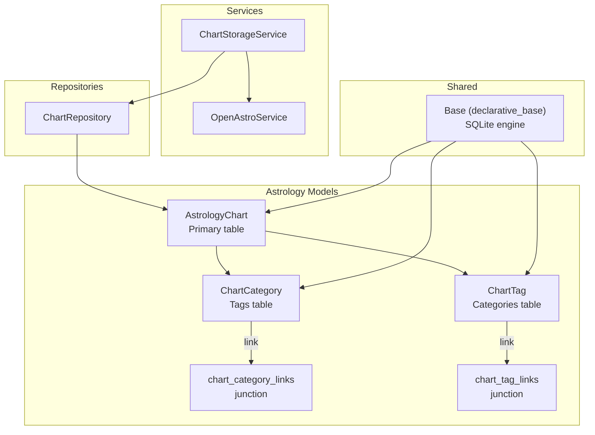
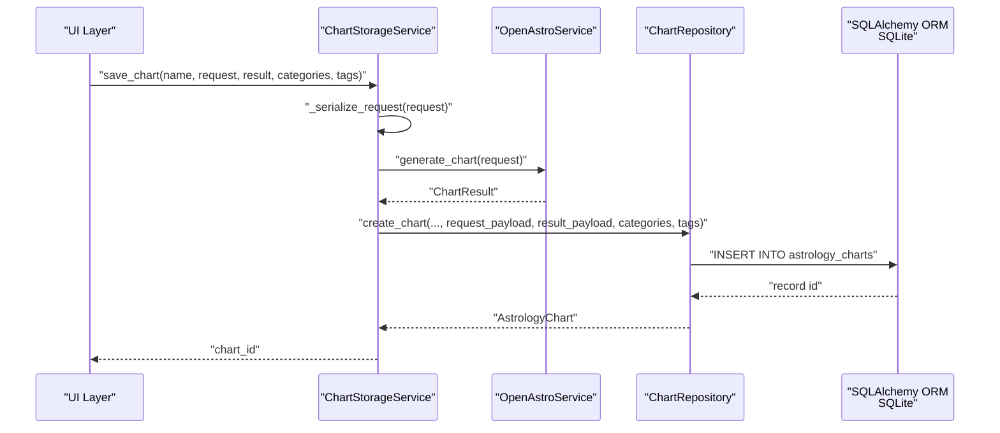
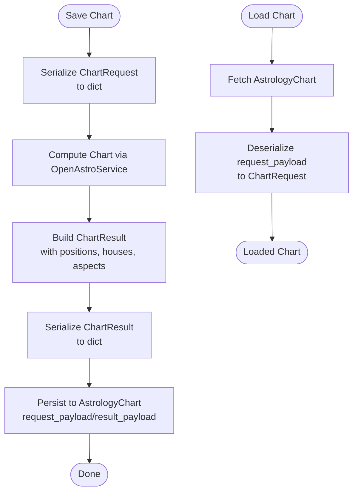
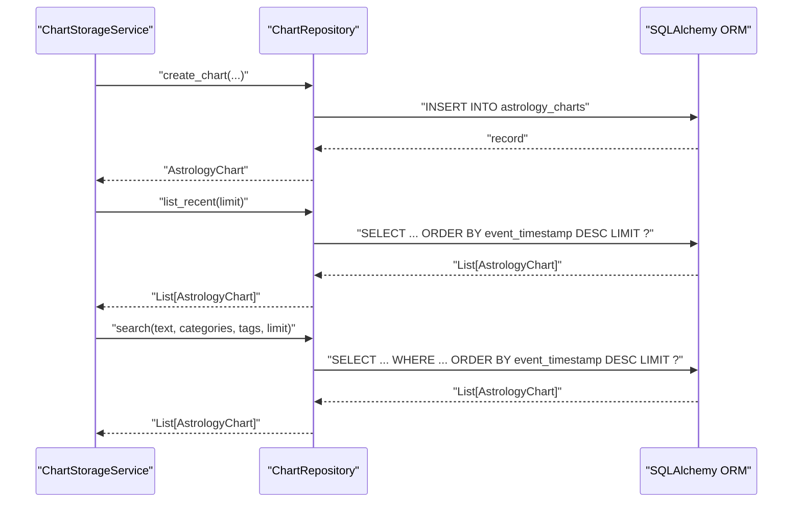
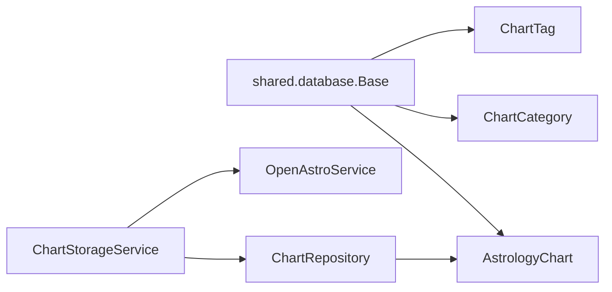

# Astrology Database Schema

<cite>
**Referenced Files in This Document**
- [chart_record.py](file://src/pillars/astrology/models/chart_record.py)
- [chart_models.py](file://src/pillars/astrology/models/chart_models.py)
- [chart_repository.py](file://src/pillars/astrology/repositories/chart_repository.py)
- [chart_storage_service.py](file://src/pillars/astrology/services/chart_storage_service.py)
- [openastro_service.py](file://src/pillars/astrology/services/openastro_service.py)
- [database.py](file://src/shared/database.py)
- [test_chart_storage_service.py](file://test/test_chart_storage_service.py)
</cite>

## Table of Contents
1. [Introduction](#introduction)
2. [Project Structure](#project-structure)
3. [Core Components](#core-components)
4. [Architecture Overview](#architecture-overview)
5. [Detailed Component Analysis](#detailed-component-analysis)
6. [Dependency Analysis](#dependency-analysis)
7. [Performance Considerations](#performance-considerations)
8. [Troubleshooting Guide](#troubleshooting-guide)
9. [Conclusion](#conclusion)
10. [Appendices](#appendices)

## Introduction
This document describes the Astrology pillar’s database schema and data model for storing natal and transit charts. It focuses on the ChartRecord model and associated chart-related data structures, detailing fields, data types, primary keys, and relationships. It also covers serialization/deserialization of complex astrological data, indexing strategies for efficient querying, data access patterns via ChartRepository, and lifecycle considerations for chart history and retention. Privacy and security considerations for personal birth data are addressed alongside migration guidance for evolving schema needs.

## Project Structure
The Astrology schema is implemented using SQLAlchemy ORM models and a SQLite backend. The relevant components are organized under the Astrology pillar and share a common database base class.



**Diagram sources**
- [chart_record.py](file://src/pillars/astrology/models/chart_record.py#L37-L99)
- [chart_storage_service.py](file://src/pillars/astrology/services/chart_storage_service.py#L39-L205)
- [chart_repository.py](file://src/pillars/astrology/repositories/chart_repository.py#L12-L139)
- [database.py](file://src/shared/database.py#L1-L53)

**Section sources**
- [chart_record.py](file://src/pillars/astrology/models/chart_record.py#L1-L99)
- [database.py](file://src/shared/database.py#L1-L53)

## Core Components
This section defines the primary data model and its relationships, along with the domain models used for serialization.

- AstrologyChart (primary table)
  - id: Integer, primary key, indexed
  - name: String(255), not null
  - description: Text, nullable
  - chart_type: String(64), default "Radix", not null
  - include_svg: Boolean, default True
  - house_system: String(8), nullable
  - event_timestamp: DateTime(timezone=True), not null
  - timezone_offset: Float, not null
  - location_label: String(255), not null
  - latitude: Float, not null
  - longitude: Float, not null
  - elevation: Float, nullable
  - request_payload: JSON, not null
  - result_payload: JSON, nullable
  - created_at: DateTime(timezone=True), server default now
  - updated_at: DateTime(timezone=True), server default now, on update now
  - categories: relationship to ChartCategory via junction
  - tags: relationship to ChartTag via junction

- ChartCategory
  - id: Integer, primary key
  - name: String(128), unique, not null, indexed

- ChartTag
  - id: Integer, primary key
  - name: String(128), unique, not null, indexed

- Composition relationships
  - AstrologyChart has many-to-many relationships with ChartCategory and ChartTag via junction tables chart_category_links and chart_tag_links.

- Domain models used for serialization
  - GeoLocation: name, latitude, longitude, elevation, country_code
  - AstrologyEvent: name, timestamp, location(GeoLocation), timezone_offset, metadata
  - ChartRequest: primary_event, chart_type, reference_event, include_svg, settings
  - PlanetPosition: name, degree, sign_index
  - HousePosition: number, degree
  - ChartResult: chart_type, planet_positions(List[PlanetPosition]), house_positions(List[HousePosition]), aspect_summary(Dict), svg_document(Optional[str]), raw_payload(Dict)

**Section sources**
- [chart_record.py](file://src/pillars/astrology/models/chart_record.py#L37-L99)
- [chart_models.py](file://src/pillars/astrology/models/chart_models.py#L9-L133)

## Architecture Overview
The data flow from UI to persistence follows a layered approach:
- UI constructs ChartRequest and ChartResult
- OpenAstroService orchestrates chart computation and produces ChartResult
- ChartStorageService serializes ChartRequest and ChartResult into payloads and persists them via ChartRepository
- ChartRepository maps domain models to SQLAlchemy ORM models and writes to SQLite



**Diagram sources**
- [chart_storage_service.py](file://src/pillars/astrology/services/chart_storage_service.py#L48-L116)
- [openastro_service.py](file://src/pillars/astrology/services/openastro_service.py#L64-L139)
- [chart_repository.py](file://src/pillars/astrology/repositories/chart_repository.py#L21-L60)
- [chart_record.py](file://src/pillars/astrology/models/chart_record.py#L37-L66)

## Detailed Component Analysis

### Data Model: AstrologyChart and Related Entities
```mermaid
classDiagram
class AstrologyChart {
+int id
+string name
+string? description
+string chart_type
+bool include_svg
+string? house_system
+datetime event_timestamp
+float timezone_offset
+string location_label
+float latitude
+float longitude
+float? elevation
+dict request_payload
+dict? result_payload
+datetime created_at
+datetime updated_at
}
class ChartCategory {
+int id
+string name
}
class ChartTag {
+int id
+string name
}
class chart_category_links {
+int chart_id
+int category_id
}
class chart_tag_links {
+int chart_id
+int tag_id
}
AstrologyChart "1" o-- "*" ChartCategory : "many-to-many"
AstrologyChart "1" o-- "*" ChartTag : "many-to-many"
chart_category_links }|--|| AstrologyChart
chart_category_links }|--|| ChartCategory
chart_tag_links }|--|| AstrologyChart
chart_tag_links }|--|| ChartTag
```

**Diagram sources**
- [chart_record.py](file://src/pillars/astrology/models/chart_record.py#L22-L34)
- [chart_record.py](file://src/pillars/astrology/models/chart_record.py#L37-L99)

**Section sources**
- [chart_record.py](file://src/pillars/astrology/models/chart_record.py#L37-L99)

### Serialization and Deserialization of Complex Data
- ChartStorageService handles serialization of ChartRequest and ChartResult into JSON payloads stored in request_payload and result_payload.
- ChartStorageService deserializes request payloads back into domain models for loading charts.
- OpenAstroService converts AstrologyEvent into the kwargs expected by the OpenAstro2 library and extracts structured results (planets, houses, aspects) into ChartResult.



**Diagram sources**
- [chart_storage_service.py](file://src/pillars/astrology/services/chart_storage_service.py#L48-L116)
- [openastro_service.py](file://src/pillars/astrology/services/openastro_service.py#L64-L139)
- [chart_models.py](file://src/pillars/astrology/models/chart_models.py#L102-L133)

**Section sources**
- [chart_storage_service.py](file://src/pillars/astrology/services/chart_storage_service.py#L48-L116)
- [openastro_service.py](file://src/pillars/astrology/services/openastro_service.py#L64-L139)
- [chart_models.py](file://src/pillars/astrology/models/chart_models.py#L102-L133)

### Data Access Patterns via ChartRepository
- Creation: ChartRepository.create_chart maps ChartRequest and ChartResult to AstrologyChart fields, resolves categories/tags, commits, and refreshes.
- Retrieval: get_chart fetches a single record by id.
- Listing: list_recent orders by event_timestamp descending with a limit.
- Search: search supports text search across name and location_label, and filtering by categories/tags; results ordered by event_timestamp descending.



**Diagram sources**
- [chart_repository.py](file://src/pillars/astrology/repositories/chart_repository.py#L21-L107)
- [chart_storage_service.py](file://src/pillars/astrology/services/chart_storage_service.py#L83-L116)

**Section sources**
- [chart_repository.py](file://src/pillars/astrology/repositories/chart_repository.py#L21-L107)
- [chart_storage_service.py](file://src/pillars/astrology/services/chart_storage_service.py#L83-L116)

### Indexing Strategies for Efficient Querying
- Primary key: id is primary key and indexed by SQLAlchemy definition.
- Categories and tags: ChartCategory.name and ChartTag.name are unique and indexed, enabling fast joins and lookups.
- Temporal fields: event_timestamp is a DateTime with timezone support; ordering by it is used for recent lists and search results.
- Location fields: latitude, longitude, and location_label are persisted; while no explicit spatial index is defined, they are suitable for range queries and geospatial analytics if needed.

Note: The current schema does not define explicit indexes on event_timestamp or location fields. For improved performance on large datasets:
- Consider adding an index on event_timestamp for frequent chronological queries.
- Consider adding composite indexes on (location_label, event_timestamp) or (latitude, longitude, event_timestamp) for location-aware queries.
- Consider adding indexes on chart_type and include_svg for filtering by chart type and SVG availability.

**Section sources**
- [chart_record.py](file://src/pillars/astrology/models/chart_record.py#L37-L66)
- [chart_repository.py](file://src/pillars/astrology/repositories/chart_repository.py#L69-L107)

### Data Lifecycle Management and Retention Policies
- Created and updated timestamps: created_at and updated_at are maintained automatically via server defaults and onupdate triggers.
- No explicit deletion or soft-delete mechanism is present in the schema. Retention policy should be implemented at the application layer (e.g., periodic cleanup jobs, user-triggered deletions).
- Recommendations:
  - Implement a scheduled job to archive or delete old charts based on user preferences or compliance requirements.
  - Consider adding a deleted_at flag or a separate archive table for historical retention.
  - Ensure backups include the SQLite database file located under the data directory.

**Section sources**
- [chart_record.py](file://src/pillars/astrology/models/chart_record.py#L57-L60)
- [database.py](file://src/shared/database.py#L1-L53)

### Privacy and Security Considerations
- Personal data: The schema stores sensitive personal information including birth time, location coordinates, and optional elevation. Treat these fields as personal data.
- Storage: SQLite database file is stored under the data directory; restrict filesystem access to authorized users.
- Transport: When exposing chart data externally, avoid returning raw request_payload and result_payload; sanitize and redact sensitive fields.
- Authentication and authorization: Enforce access controls at the application layer to ensure only authorized users can read/write chart records.
- Logging: Avoid logging sensitive fields; mask or redact personal data in logs.

[No sources needed since this section provides general guidance]

### Sample Data and Migration Strategies
- Sample data: Tests demonstrate saving and loading a chart with categories and tags, and searching by text and category. See the test file for a representative example.
- Migration strategy:
  - Use Alembic or a similar migration tool to evolve the schema safely.
  - For JSON payloads, treat request_payload and result_payload as opaque blobs; add new top-level keys rather than altering nested structures to preserve backward compatibility.
  - When adding new scalar fields, provide defaults and nullable semantics to support gradual rollout.
  - For indexes, add them in separate migration steps to minimize downtime.

**Section sources**
- [test_chart_storage_service.py](file://test/test_chart_storage_service.py#L48-L93)

## Dependency Analysis
The Astrology models depend on the shared Base class and SQLAlchemy constructs. ChartStorageService depends on ChartRepository and OpenAstroService. ChartRepository depends on SQLAlchemy ORM and the AstrologyChart model.



**Diagram sources**
- [chart_record.py](file://src/pillars/astrology/models/chart_record.py#L37-L99)
- [chart_storage_service.py](file://src/pillars/astrology/services/chart_storage_service.py#L39-L205)
- [chart_repository.py](file://src/pillars/astrology/repositories/chart_repository.py#L12-L139)
- [database.py](file://src/shared/database.py#L1-L53)

**Section sources**
- [chart_record.py](file://src/pillars/astrology/models/chart_record.py#L37-L99)
- [chart_storage_service.py](file://src/pillars/astrology/services/chart_storage_service.py#L39-L205)
- [chart_repository.py](file://src/pillars/astrology/repositories/chart_repository.py#L12-L139)
- [database.py](file://src/shared/database.py#L1-L53)

## Performance Considerations
- Current state: The schema uses SQLite with basic indexes (primary key and unique+indexed fields). Ordering by event_timestamp is used for recent queries.
- Recommendations:
  - Add indexes on frequently filtered fields (e.g., chart_type, include_svg) and composite indexes for location/time queries.
  - Consider partitioning strategies if the dataset grows large (e.g., by year or user).
  - Optimize search queries by limiting result sets and using pagination.

[No sources needed since this section provides general guidance]

## Troubleshooting Guide
- Missing openastro2 dependency: OpenAstroService raises a specific error when the dependency is not installed. Ensure the package is installed before attempting chart generation.
- Serialization errors: ChartStorageService validates and serializes payloads; ensure ChartRequest and ChartResult conform to expected structures.
- Repository search behavior: Search filters by lowercased text and performs case-insensitive matching on name and location_label. Verify that categories/tags exist or are created before filtering.

**Section sources**
- [openastro_service.py](file://src/pillars/astrology/services/openastro_service.py#L23-L30)
- [chart_storage_service.py](file://src/pillars/astrology/services/chart_storage_service.py#L120-L178)
- [chart_repository.py](file://src/pillars/astrology/repositories/chart_repository.py#L77-L107)

## Conclusion
The Astrology schema provides a robust foundation for storing natal and transit charts with flexible categorization and tagging. The design separates concerns between domain models, persistence, and external computation, enabling extensibility and maintainability. For production deployments, consider adding targeted indexes, implementing retention policies, and enforcing strict privacy and security controls.

## Appendices

### Appendix A: Field Definitions and Types
- AstrologyChart
  - id: Integer, primary key, indexed
  - name: String(255), not null
  - description: Text, nullable
  - chart_type: String(64), default "Radix", not null
  - include_svg: Boolean, default True
  - house_system: String(8), nullable
  - event_timestamp: DateTime(timezone=True), not null
  - timezone_offset: Float, not null
  - location_label: String(255), not null
  - latitude: Float, not null
  - longitude: Float, not null
  - elevation: Float, nullable
  - request_payload: JSON, not null
  - result_payload: JSON, nullable
  - created_at: DateTime(timezone=True), server default now
  - updated_at: DateTime(timezone=True), server default now, on update now
  - categories: relationship to ChartCategory
  - tags: relationship to ChartTag

- ChartCategory
  - id: Integer, primary key
  - name: String(128), unique, not null, indexed

- ChartTag
  - id: Integer, primary key
  - name: String(128), unique, not null, indexed

**Section sources**
- [chart_record.py](file://src/pillars/astrology/models/chart_record.py#L37-L99)