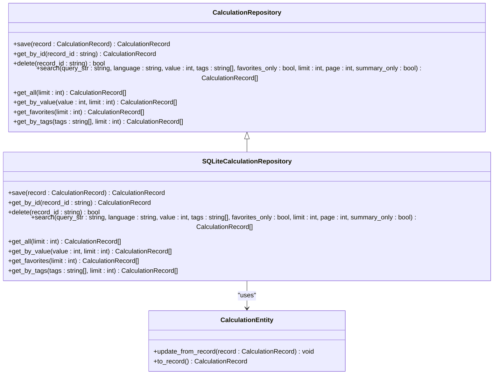
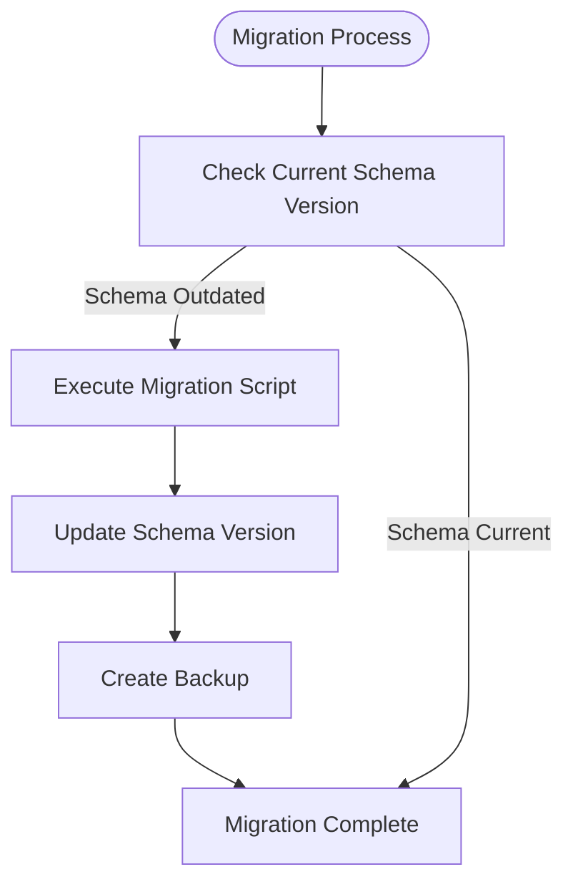
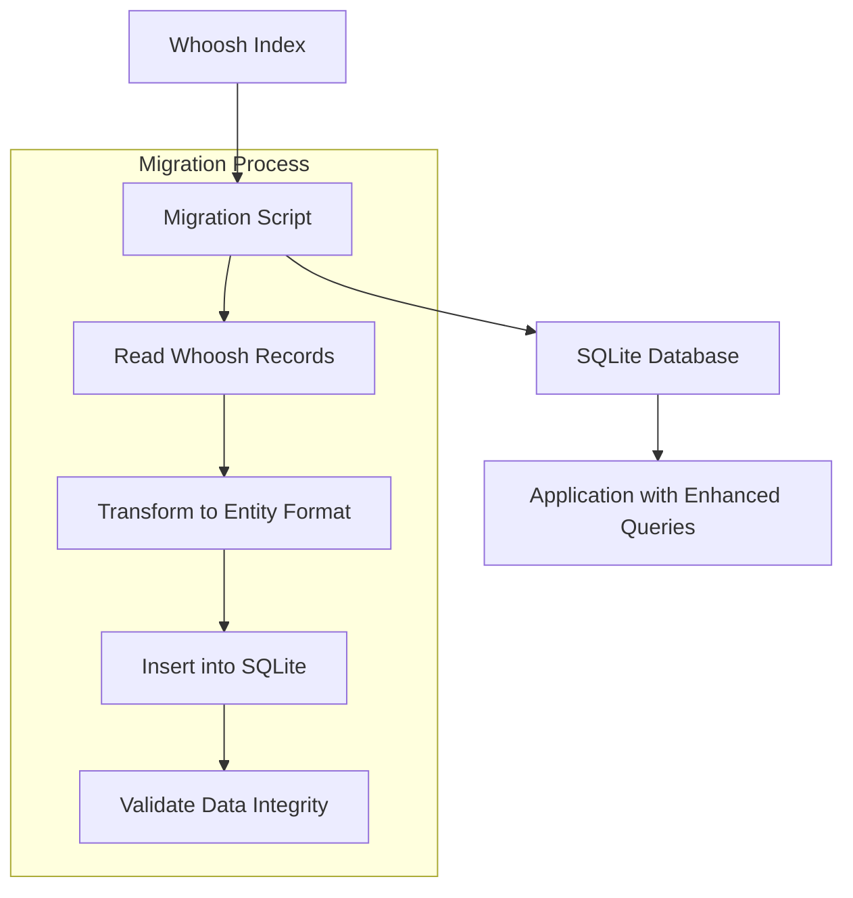

# Database Schema Design

<cite>
**Referenced Files in This Document**   
- [calculation_record.py](file://src/pillars/gematria/models/calculation_record.py)
- [calculation_entity.py](file://src/pillars/gematria/models/calculation_entity.py)
- [document.py](file://src/pillars/document_manager/models/document.py)
- [document_verse.py](file://src/pillars/document_manager/models/document_verse.py)
- [chart_record.py](file://src/pillars/astrology/models/chart_record.py)
- [geometry_types.py](file://src/pillars/adyton/models/geometry_types.py)
- [sqlite_calculation_repository.py](file://src/pillars/gematria/repositories/sqlite_calculation_repository.py)
- [database.py](file://src/shared/database.py)
</cite>

## Table of Contents
1. [Introduction](#introduction)
2. [Core Data Models](#core-data-models)
3. [Entity Relationships](#entity-relationships)
4. [Database Schema Diagram](#database-schema-diagram)
5. [Data Access Patterns](#data-access-patterns)
6. [Data Lifecycle Management](#data-lifecycle-management)
7. [Data Security and Privacy](#data-security-and-privacy)
8. [Sample Data](#sample-data)
9. [Schema Migration and Versioning](#schema-migration-and-versioning)
10. [Extensibility Guidelines](#extensibility-guidelines)

## Introduction

The isopgem application implements a comprehensive data model to support esoteric analysis across multiple domains including gematria, document management, astrology, and sacred geometry. This document provides detailed documentation of the primary data models used in the application, focusing on the CalculationRecord, Document, ChartRecord, and Object3D entities. The data architecture follows a domain-pillar design pattern with each major functional area encapsulated in its own module, sharing a common database infrastructure built on SQLAlchemy with SQLite storage.

The application's data persistence strategy has evolved from an initial Whoosh-based indexing system to a more robust relational model, enabling complex queries, relationships, and transactional integrity. The current implementation supports rich metadata, user annotations, and cross-referencing between entities, facilitating deep analysis and knowledge organization.

## Core Data Models

### CalculationRecord Model

The CalculationRecord model represents a stored gematria calculation, capturing both the computational result and associated metadata for user reference and organization.

**Field Definitions:**
- `id`: Unique identifier (string, generated)
- `text`: Original word or phrase calculated (string)
- `value`: Computed gematria value (integer)
- `language`: Language/system used (e.g., "Hebrew (Standard)") (string)
- `method`: Calculation method employed (e.g., "Standard Value") (string)
- `date_created`: Timestamp of record creation (datetime)
- `date_modified`: Timestamp of last modification (datetime)
- `notes`: User-provided notes about the calculation (string)
- `source`: Source reference (e.g., Bible verse, book) (string)
- `tags`: Searchable tags (list of strings)
- `breakdown`: JSON string of letter-value breakdown (string)
- `character_count`: Number of characters counted (integer)
- `normalized_text`: Text after normalization (no diacritics) (string)
- `user_rating`: User rating (0-5 stars) (integer)
- `is_favorite`: Favorite flag (boolean)
- `category`: User-defined category (string)
- `related_ids`: IDs of related calculations (list of strings)

**Constraints and Indexes:**
- Primary Key: `id`
- The model includes methods for serialization (`to_dict`) and deserialization (`from_dict`), handling JSON encoding of list fields like `tags` and `related_ids`.

**Section sources**
- [calculation_record.py](file://src/pillars/gematria/models/calculation_record.py#L8-L89)

### CalculationEntity Model

The CalculationEntity model serves as the SQLAlchemy ORM representation of a gematria calculation, mapping directly to database storage.

**Field Definitions:**
- `id`: Primary key with UUID generation (string, 36 characters)
- `text`: Original text (Text field, not nullable)
- `normalized_text`: Normalized version of text (Text field)
- `value`: Calculated gematria value (integer, indexed)
- `language`: Language/system used (string, 120 characters, indexed)
- `method`: Calculation method (string, 120 characters)
- `notes`: User notes (Text field)
- `source`: Source reference (Text field)
- `tags`: JSON-encoded list of tags (Text field)
- `breakdown`: JSON-encoded calculation breakdown (Text field)
- `character_count`: Count of characters (integer)
- `normalized_hash`: Lowercase normalized text for indexing (string, 64 characters, indexed)
- `user_rating`: User rating (integer)
- `is_favorite`: Favorite status (boolean, indexed)
- `category`: User-defined category (string, 120 characters)
- `related_ids`: JSON-encoded list of related calculation IDs (Text field)
- `date_created`: Creation timestamp (datetime, defaults to UTC)
- `date_modified`: Last modification timestamp (datetime, auto-updated)

**Constraints and Indexes:**
- Primary Key: `id`
- Indexes: `value`, `language`, `is_favorite`, and `normalized_hash` fields are indexed for query performance
- Foreign Key Constraints: None (standalone entity)
- Check Constraints: None

**Section sources**
- [calculation_entity.py](file://src/pillars/gematria/models/calculation_entity.py#L18-L92)

### Document Model

The Document model represents a managed document within the application, supporting text analysis and organization.

**Field Definitions:**
- `id`: Primary key (integer, auto-incremented)
- `title`: Document title (string, indexed)
- `file_path`: Unique file path (string, unique constraint)
- `file_type`: Document type ('txt', 'html', 'pdf', 'docx', 'rtf') (string)
- `content`: Extracted text content for search (Text field)
- `raw_content`: HTML/RTF raw content if needed (Text field, nullable)
- `tags`: Comma-separated tags (string, nullable)
- `author`: Document author (string, nullable)
- `collection`: Virtual folder/collection name (string, nullable)
- `created_at`: Creation timestamp with timezone (datetime, server default)
- `updated_at`: Last update timestamp with timezone (datetime, auto-updates)

**Constraints and Indexes:**
- Primary Key: `id`
- Unique Constraint: `file_path`
- Indexes: `title` and `file_path` fields are indexed
- Foreign Key Constraints: None

**Section sources**
- [document.py](file://src/pillars/document_manager/models/document.py#L16-L47)

### ChartRecord Model

The ChartRecord model (AstrologyChart) represents a stored astrology chart with comprehensive astronomical and metadata.

**Field Definitions:**
- `id`: Primary key (integer, auto-incremented)
- `name`: Chart name (string, 255 characters, not nullable)
- `description`: Chart description (Text field, nullable)
- `chart_type`: Type of chart (e.g., "Radix") (string, 64 characters, default "Radix")
- `include_svg`: Flag to include SVG representation (boolean, default True)
- `house_system`: House system used (string, 8 characters, nullable)
- `event_timestamp`: Date/time of the astrological event (datetime with timezone, not nullable)
- `timezone_offset`: Timezone offset in hours (float, not nullable)
- `location_label`: Human-readable location name (string, 255 characters, not nullable)
- `latitude`: Geographic latitude (float, not nullable)
- `longitude`: Geographic longitude (float, not nullable)
- `elevation`: Altitude above sea level (float, nullable)
- `request_payload`: JSON payload of the original request (JSON field, not nullable)
- `result_payload`: JSON payload of the calculation result (JSON field, nullable)
- `created_at`: Creation timestamp (datetime with timezone, server default)
- `updated_at`: Last update timestamp (datetime with timezone, auto-updating)

**Relationship Fields:**
- `categories`: Many-to-many relationship with ChartCategory
- `tags`: Many-to-many relationship with ChartTag

**Constraints and Indexes:**
- Primary Key: `id`
- Foreign Key Constraints: None (relationships managed through association tables)
- Check Constraints: None

**Section sources**
- [chart_record.py](file://src/pillars/astrology/models/chart_record.py#L37-L99)

### Object3D Model

The Object3D model represents a three-dimensional geometric object composed of faces in 3D space.

**Field Definitions:**
- `faces`: List of Face3D objects comprising the 3D object (List[Face3D])
- `position`: 3D position vector (QVector3D, default origin)
- `rotation`: Euler angles for rotation (QVector3D, default zero)
- `scale`: Scaling factors for each axis (QVector3D, default unity)
- `_world_faces`: Cache for transformed faces (List[Face3D], not represented in persistence)

**Face3D Sub-model:**
- `vertices`: List of 3D vertices defining the polygon (List[QVector3D])
- `color`: Fill color of the face (QColor, default gray)
- `outline_color`: Border color of the face (QColor, default dark gray)
- `centroid`: Calculated geometric center (QVector3D, calculated post-initialization)

**Constraints and Indexes:**
- Note: The Object3D model is currently a dataclass used for in-memory representation and rendering, not directly persisted to the database. It serves as the foundation for the Geometry pillar which is planned but not yet fully implemented.

**Section sources**
- [geometry_types.py](file://src/pillars/adyton/models/geometry_types.py#L32-L41)

## Entity Relationships

The isopgem application implements several relationship patterns across its data models to support complex analysis and organization.

### Document Relationships

The Document model implements a Zettelkasten-style linking system through the DocumentLink association table, enabling wiki-like connections between documents.

```mermaid
erDiagram
DOCUMENT ||--o{ DOCUMENT_LINK : "has"
DOCUMENT_LINK }o--|| DOCUMENT : "links to"
class Document {
+int id PK
+string title
+string file_path UK
+string file_type
+text content
+text raw_content
+string tags
+string author
+string collection
+datetime created_at
+datetime updated_at
}
class DocumentLink {
+int id PK
+int source_id FK
+int target_id FK
+datetime created_at
}
```

**Diagram sources**
- [document.py](file://src/pillars/document_manager/models/document.py#L7-L47)

### Document-Verses Relationships

The document analysis system implements a hierarchical relationship between documents and their constituent verses, with additional relationships to rules and edit logs.

```mermaid
erDiagram
DOCUMENT ||--o{ DOCUMENT_VERSE : "contains"
DOCUMENT_VERSE }o--|| VERSE_RULE : "applies"
DOCUMENT_VERSE ||--o{ VERSE_EDIT_LOG : "has"
VERSE_RULE ||--o{ VERSE_EDIT_LOG : "has"
class Document {
+int id PK
+string title
+string file_path UK
}
class DocumentVerse {
+int id PK
+int document_id FK
+int verse_number
+int start_offset
+int end_offset
+text text
+string status
+float confidence
+string source_type
+int rule_id FK
+text notes
+text extra_data
+datetime created_at
+datetime updated_at
}
class VerseRule {
+int id PK
+string scope_type
+string scope_value
+string description
+string pattern_before
+string pattern_after
+string action
+text parameters
+int priority
+bool enabled
+int hit_count
+datetime created_at
+datetime updated_at
}
class VerseEditLog {
+int id PK
+int document_id FK
+int verse_id FK
+int rule_id FK
+string action
+text payload
+text notes
+datetime created_at
}
```

**Diagram sources**
- [document_verse.py](file://src/pillars/document_manager/models/document_verse.py#L21-L104)

### Astrology Chart Relationships

The astrology system implements many-to-many relationships between charts and their categories and tags through association tables.

```mermaid
erDiagram
ASTROLOGY_CHART ||--o{ CHART_CATEGORY_LINKS : "categorized as"
CHART_CATEGORY_LINKS }o--|| CHART_CATEGORY : "belongs to"
ASTROLOGY_CHART ||--o{ CHART_TAG_LINKS : "tagged with"
CHART_TAG_LINKS }o--|| CHART_TAG : "tag"
class AstrologyChart {
+int id PK
+string name
+text description
+string chart_type
+bool include_svg
+string house_system
+datetime event_timestamp
+float timezone_offset
+string location_label
+float latitude
+float longitude
+float elevation
+json request_payload
+json result_payload
+datetime created_at
+datetime updated_at
}
class ChartCategory {
+int id PK
+string name UK
}
class ChartTag {
+int id PK
+string name UK
}
class chart_category_links {
+int chart_id PK,FK
+int category_id PK,FK
}
class chart_tag_links {
+int chart_id PK,FK
+int tag_id PK,FK
}
```

**Diagram sources**
- [chart_record.py](file://src/pillars/astrology/models/chart_record.py#L22-L99)

### Calculation Record Relationships

The CalculationRecord model implements a self-referential relationship through the `related_ids` field, allowing users to link related calculations.

```mermaid
erDiagram
CALCULATION_RECORD ||--o{ CALCULATION_RECORD : "related to"
class CalculationRecord {
+string id PK
+string text
+int value
+string language
+string method
+datetime date_created
+datetime date_modified
+string notes
+string source
+string[] tags
+string breakdown
+int character_count
+string normalized_text
+int user_rating
+bool is_favorite
+string category
+string[] related_ids
}
```

**Diagram sources**
- [calculation_record.py](file://src/pillars/gematria/models/calculation_record.py#L8-L89)

## Database Schema Diagram

The complete database schema for the isopgem application integrates multiple domains with a consistent pattern of entities, relationships, and metadata.

```mermaid
erDiagram
%% Gematria Module
CALCULATION_ENTITY ||--o{ CALCULATION_RECORD : "maps to"
%% Document Module
DOCUMENT ||--o{ DOCUMENT_LINK : "has"
DOCUMENT_LINK }o--|| DOCUMENT : "links to"
DOCUMENT ||--o{ DOCUMENT_VERSE : "contains"
DOCUMENT_VERSE }o--|| VERSE_RULE : "applies"
DOCUMENT_VERSE ||--o{ VERSE_EDIT_LOG : "has"
VERSE_RULE ||--o{ VERSE_EDIT_LOG : "has"
%% Astrology Module
ASTROLOGY_CHART ||--o{ CHART_CATEGORY_LINKS : "categorized as"
CHART_CATEGORY_LINKS }o--|| CHART_CATEGORY : "belongs to"
ASTROLOGY_CHART ||--o{ CHART_TAG_LINKS : "tagged with"
CHART_TAG_LINKS }o--|| CHART_TAG : "tag"
%% Mindscape Module
MIND_NODE ||--o{ MIND_EDGE : "source"
MIND_EDGE }o--|| MIND_NODE : "target"
class CalculationEntity {
+string id PK
+text text
+text normalized_text
+int value
+string language
+string method
+text notes
+text source
+text tags
+text breakdown
+int character_count
+string normalized_hash
+int user_rating
+bool is_favorite
+string category
+text related_ids
+datetime date_created
+datetime date_modified
}
class Document {
+int id PK
+string title
+string file_path UK
+string file_type
+text content
+text raw_content
+string tags
+string author
+string collection
+datetime created_at
+datetime updated_at
}
class DocumentLink {
+int id PK
+int source_id FK
+int target_id FK
+datetime created_at
}
class DocumentVerse {
+int id PK
+int document_id FK
+int verse_number
+int start_offset
+int end_offset
+text text
+string status
+float confidence
+string source_type
+int rule_id FK
+text notes
+text extra_data
+datetime created_at
+datetime updated_at
}
class VerseRule {
+int id PK
+string scope_type
+string scope_value
+string description
+string pattern_before
+string pattern_after
+string action
+text parameters
+int priority
+bool enabled
+int hit_count
+datetime created_at
+datetime updated_at
}
class VerseEditLog {
+int id PK
+int document_id FK
+int verse_id FK
+int rule_id FK
+string action
+text payload
+text notes
+datetime created_at
}
class AstrologyChart {
+int id PK
+string name
+text description
+string chart_type
+bool include_svg
+string house_system
+datetime event_timestamp
+float timezone_offset
+string location_label
+float latitude
+float longitude
+float elevation
+json request_payload
+json result_payload
+datetime created_at
+datetime updated_at
}
class ChartCategory {
+int id PK
+string name UK
}
class ChartTag {
+int id PK
+string name UK
}
class chart_category_links {
+int chart_id PK,FK
+int category_id PK,FK
}
class chart_tag_links {
+int chart_id PK,FK
+int tag_id PK,FK
}
class MindNode {
+int id PK
+string title
+string type
+text content
+text tags
+text appearance
+text metadata_payload
+string icon
+datetime created_at
+datetime updated_at
}
class MindEdge {
+int id PK
+int source_id FK
+int target_id FK
+string relation_type
+text appearance
+datetime created_at
}
```

**Diagram sources**
- [calculation_entity.py](file://src/pillars/gematria/models/calculation_entity.py#L18-L92)
- [document.py](file://src/pillars/document_manager/models/document.py#L16-L47)
- [document_verse.py](file://src/pillars/document_manager/models/document_verse.py#L21-L104)
- [chart_record.py](file://src/pillars/astrology/models/chart_record.py#L37-L99)
- [mindscape.py](file://src/pillars/document_manager/models/mindscape.py#L15-L52)

## Data Access Patterns

The isopgem application implements a repository pattern for data access, providing abstraction between business logic and persistence mechanisms.

### Calculation Repository Implementation

The application supports multiple repository implementations for gematria calculations, with a transition from Whoosh-based indexing to SQLite persistence.



**Diagram sources**
- [calculation_repository.py](file://src/pillars/gematria/repositories/calculation_repository.py#L16-L329)
- [sqlite_calculation_repository.py](file://src/pillars/gematria/repositories/sqlite_calculation_repository.py#L16-L143)
- [calculation_entity.py](file://src/pillars/gematria/models/calculation_entity.py#L18-L92)

### Query Performance Considerations

The application implements several strategies to optimize query performance:

1. **Indexing Strategy**: Critical fields like `value`, `language`, `is_favorite`, and `normalized_hash` are indexed in the CalculationEntity table to accelerate common search patterns.

2. **Summary vs. Detail Queries**: The search method supports a `summary_only` parameter that returns lightweight records with minimal data, reducing I/O and memory usage for list views.

3. **Pagination**: All search methods support pagination through `limit` and `page` parameters, preventing excessive memory consumption with large result sets.

4. **Caching**: The Object3D model includes a `_world_faces` cache field to store transformed faces, avoiding recalculation during rendering.

5. **Database Connection Management**: The application uses SQLAlchemy's session pool and context managers to efficiently manage database connections.

**Section sources**
- [sqlite_calculation_repository.py](file://src/pillars/gematria/repositories/sqlite_calculation_repository.py#L16-L143)
- [database.py](file://src/shared/database.py#L1-L53)

## Data Lifecycle Management

The isopgem application implements comprehensive data lifecycle management through creation, modification, and archival policies.

### Retention Policies

The application does not implement automatic data deletion or retention policies. All user-created data is retained indefinitely unless explicitly deleted by the user. This design decision supports the application's purpose as a knowledge repository for esoteric studies, where historical calculations and analyses maintain long-term value.

### Archival Rules

The application does not currently implement formal archival mechanisms. However, the data model supports archival through several features:

1. **Metadata Fields**: The `created_at` and `updated_at` timestamps provide temporal context for all records.
2. **Status Fields**: The DocumentVerse model includes a `status` field that could be extended to support archival states.
3. **Soft Deletion**: The application could implement soft deletion by adding an `is_deleted` flag to entities, preserving data while hiding it from normal views.

### Data Migration

The application includes migration scripts to transition from older data storage formats to the current SQLite schema.



**Diagram sources**
- [MIGRATION.md](file://MIGRATION.md#L1-L174)
- [migrate_gematria_whoosh_to_sqlite.py](file://scripts/migrate_gematria_whoosh_to_sqlite.py)
- [migrate_mindscape_schema.py](file://src/scripts/migrate_mindscape_schema.py)

**Section sources**
- [MIGRATION.md](file://MIGRATION.md#L1-L174)

## Data Security and Privacy

The isopgem application implements several security and privacy measures to protect user data.

### Access Control Mechanisms

The current implementation is designed for single-user desktop use, with access control managed at the operating system level. The application does not implement user authentication or role-based access control, as it is intended for personal use.

### Data Privacy Considerations

The application handles user data with the following privacy principles:

1. **Local Storage**: All data is stored locally in SQLite databases within the user's home directory, minimizing exposure to network-based threats.
2. **No Telemetry**: The application does not collect usage data or analytics.
3. **User-Controlled Sharing**: Users can export data in standard formats (CSV, JSON) for sharing, but this is an explicit user action.

### Security Requirements

The application's security model includes:

1. **File System Permissions**: Database files inherit the permissions of the user's home directory.
2. **Data Integrity**: SQLite's ACID properties ensure data consistency and durability.
3. **Backup Recommendations**: Users are encouraged to back up their data directory regularly.

**Section sources**
- [database.py](file://src/shared/database.py#L1-L53)

## Sample Data

### CalculationRecord Sample

```json
{
  "id": "a1b2c3d4-e5f6-7890-g1h2-i3j4k5l6m7n8",
  "text": "Chokmah",
  "value": 73,
  "language": "Hebrew (Standard)",
  "method": "Standard Value",
  "date_created": "2025-01-15T10:30:00Z",
  "date_modified": "2025-01-15T10:30:00Z",
  "notes": "Wisdom, the second Sephirah on the Tree of Life",
  "source": "Sefer Yetzirah, Chapter 1",
  "tags": ["sephiroth", "wisdom", "kabbalah"],
  "breakdown": "[{\"letter\":\"Cheth\",\"value\":8},{\"letter\":\"Vav\",\"value\":6},{\"letter\":\"Kaph\",\"value\":20},{\"letter\":\"Mem\",\"value\":40}]",
  "character_count": 7,
  "normalized_text": "chokmah",
  "user_rating": 5,
  "is_favorite": true,
  "category": "Sephirah Names",
  "related_ids": ["b2c3d4e5-f6g7-8901-h2i3-j4k5l6m7n8o9"]
}
```

### Document Sample

```json
{
  "id": 1,
  "title": "Book of Genesis Analysis",
  "file_path": "/documents/genesis_analysis.txt",
  "file_type": "txt",
  "content": "In the beginning God created the heavens and the earth...",
  "raw_content": null,
  "tags": "genesis,creation,bible",
  "author": "John Doe",
  "collection": "Biblical Studies",
  "created_at": "2025-01-10T09:15:00+00:00",
  "updated_at": "2025-01-12T14:20:00+00:00"
}
```

### ChartRecord Sample

```json
{
  "id": 1,
  "name": "Natal Chart - John Doe",
  "description": "Birth chart for John Doe, born on January 1, 1990",
  "chart_type": "Radix",
  "include_svg": true,
  "house_system": "Placidus",
  "event_timestamp": "1990-01-01T06:30:00+00:00",
  "timezone_offset": -5.0,
  "location_label": "New York, NY",
  "latitude": 40.7128,
  "longitude": -74.0060,
  "elevation": 10.0,
  "request_payload": {
    "name": "John Doe",
    "datetime": "1990-01-01T06:30:00",
    "location": {
      "lat": 40.7128,
      "lon": -74.0060,
      "elevation": 10.0,
      "timezone": -5.0
    }
  },
  "result_payload": {
    "planets": [
      {"name": "Sun", "position": 9.5, "sign": "Capricorn"},
      {"name": "Moon", "position": 15.2, "sign": "Aries"}
    ],
    "houses": [
      {"number": 1, "cusp": 25.8, "sign": "Aquarius"},
      {"number": 2, "cusp": 20.3, "sign": "Pisces"}
    ]
  },
  "created_at": "2025-01-14T11:45:00+00:00",
  "updated_at": "2025-01-14T11:45:00+00:00"
}
```

### Object3D Sample

```json
{
  "faces": [
    {
      "vertices": [
        {"x": -1.0, "y": -1.0, "z": -1.0},
        {"x": 1.0, "y": -1.0, "z": -1.0},
        {"x": 1.0, "y": 1.0, "z": -1.0},
        {"x": -1.0, "y": 1.0, "z": -1.0}
      ],
      "color": {"r": 200, "g": 200, "b": 200},
      "outline_color": {"r": 50, "g": 50, "b": 50}
    }
  ],
  "position": {"x": 0.0, "y": 0.0, "z": 0.0},
  "rotation": {"x": 0.0, "y": 0.0, "z": 0.0},
  "scale": {"x": 1.0, "y": 1.0, "z": 1.0}
}
```

**Section sources**
- [calculation_record.py](file://src/pillars/gematria/models/calculation_record.py#L8-L89)
- [document.py](file://src/pillars/document_manager/models/document.py#L16-L47)
- [chart_record.py](file://src/pillars/astrology/models/chart_record.py#L37-L99)
- [geometry_types.py](file://src/pillars/adyton/models/geometry_types.py#L32-L41)

## Schema Migration and Versioning

The isopgem application implements a structured approach to schema migration and version management.

### Migration Strategy

The application uses explicit migration scripts to transition between schema versions, as documented in the MIGRATION.md file. The migration process follows these steps:

1. **Assessment**: Determine the current schema version and required changes.
2. **Backup**: Create a backup of the existing database.
3. **Execution**: Run the migration script to modify the schema.
4. **Verification**: Validate the migrated data and schema integrity.
5. **Cleanup**: Remove obsolete data structures and optimize the database.

### Version Management

The application's architecture supports version management through:

1. **Modular Pillars**: Each functional domain (Gematria, Document Manager, Astrology, etc.) is encapsulated in its own module, allowing independent evolution.
2. **Repository Pattern**: The separation between data models and persistence mechanisms enables switching storage backends without affecting business logic.
3. **Data Migration Scripts**: Dedicated scripts handle schema transformations, preserving data integrity during upgrades.

### Migration Example

The transition from Whoosh-based storage to SQLite is documented in the migration scripts:



**Diagram sources**
- [MIGRATION.md](file://MIGRATION.md#L1-L174)
- [migrate_gematria_whoosh_to_sqlite.py](file://scripts/migrate_gematria_whoosh_to_sqlite.py)

**Section sources**
- [MIGRATION.md](file://MIGRATION.md#L1-L174)

## Extensibility Guidelines

The isopgem application is designed with extensibility in mind, following a domain-pillar architecture that facilitates the addition of new features and data models.

### Custom Schema Extensions

To extend the schema for custom use cases, follow these guidelines:

1. **New Pillar Creation**: Create a new directory under `src/pillars/` for the custom domain.
2. **Model Definition**: Define new data models in the `models/` subdirectory, inheriting from the shared `Base` class.
3. **Repository Implementation**: Implement data access through repositories in the `repositories/` subdirectory.
4. **Service Layer**: Add business logic in the `services/` subdirectory.
5. **UI Integration**: Create user interface components in the `ui/` subdirectory.

### Example: Adding a Custom Calculation Type

To add a new calculation type, extend the existing gematria framework:

```python
# src/pillars/gematria/models/custom_calculation.py
from sqlalchemy import Column, String, Integer
from shared.database import Base

class CustomCalculationEntity(Base):
    __tablename__ = "custom_calculations"
    
    id = Column(Integer, primary_key=True)
    text = Column(String, nullable=False)
    value = Column(Integer, nullable=False)
    custom_parameter = Column(String)
    # inherit common fields from base pattern
```

### Integration with Existing Systems

Custom extensions can integrate with existing systems through:

1. **Shared Database**: All pillars share the same SQLite database, enabling cross-domain queries.
2. **Common Models**: Reuse shared data structures and patterns for consistency.
3. **Event System**: Implement event listeners to respond to changes in other domains.

**Section sources**
- [MIGRATION.md](file://MIGRATION.md#L1-L174)
- [database.py](file://src/shared/database.py#L1-L53)