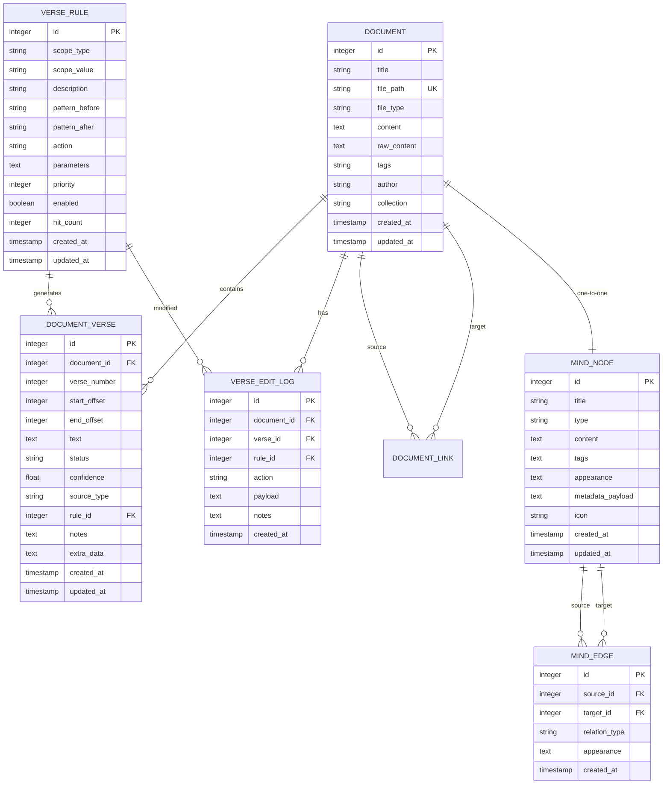

# Document Manager Database Schema

<cite>
**Referenced Files in This Document**   
- [document.py](file://src/pillars/document_manager/models/document.py)
- [document_verse.py](file://src/pillars/document_manager/models/document_verse.py)
- [mindscape.py](file://src/pillars/document_manager/models/mindscape.py)
- [document_repository.py](file://src/pillars/document_manager/repositories/document_repository.py)
- [search_repository.py](file://src/pillars/document_manager/repositories/search_repository.py)
- [document_service.py](file://src/pillars/document_manager/services/document_service.py)
- [mindscape_service.py](file://src/pillars/document_manager/services/mindscape_service.py)
- [parsers.py](file://src/pillars/document_manager/utils/parsers.py)
- [database.py](file://src/shared/database.py)
- [migrate_mindscape_schema.py](file://src/scripts/migrate_mindscape_schema.py)
- [update_db_schema.py](file://scripts/update_db_schema.py)
</cite>

## Table of Contents
1. [Introduction](#introduction)
2. [Core Data Models](#core-data-models)
3. [Schema Diagram](#schema-diagram)
4. [Data Relationships](#data-relationships)
5. [Indexing and Search Strategy](#indexing-and-search-strategy)
6. [Data Access Patterns](#data-access-patterns)
7. [Data Lifecycle Management](#data-lifecycle-management)
8. [Data Security and Access Control](#data-security-and-access-control)
9. [Sample Data and Workflows](#sample-data-and-workflows)
10. [Migration Strategies](#migration-strategies)

## Introduction

The Document Manager pillar provides a comprehensive system for managing documents, their verse structures, and associated knowledge graphs (Mindscape). This documentation details the database schema, focusing on the Document, DocumentVerse, and Mindscape models that form the core of the system. The schema supports document storage, verse extraction for holy book analysis, and a flexible knowledge graph for connecting ideas. The system implements efficient search capabilities through Whoosh integration and provides robust data access patterns through repository and service layers.

## Core Data Models

The Document Manager pillar consists of three primary models: Document, DocumentVerse, and Mindscape (comprising MindNode and MindEdge). These models are implemented using SQLAlchemy ORM and stored in a SQLite database.

### Document Model

The Document model represents a stored document with its metadata and content. It serves as the primary entity for document management.

**Field Definitions:**
- `id`: Integer, primary key, indexed - Unique identifier for the document
- `title`: String, indexed - Document title for display and search
- `file_path`: String, unique - Path to the original file on disk
- `file_type`: String - Document type ('txt', 'html', 'pdf', 'docx', 'rtf')
- `content`: Text - Extracted plain text content for search and processing
- `raw_content`: Text, nullable - Original formatted content (HTML/RTF) for rendering
- `tags`: String, nullable - Comma-separated tags for categorization
- `author`: String, nullable - Document author
- `collection`: String, nullable - Virtual folder or collection name
- `created_at`: DateTime with timezone - Timestamp of document creation
- `updated_at`: DateTime with timezone - Timestamp of last update

The Document model also includes relationships for document linking through the DocumentLink association table, enabling Zettelkasten-style wiki-links between documents.

**Section sources**
- [document.py](file://src/pillars/document_manager/models/document.py#L1-L47)

### DocumentVerse Model

The DocumentVerse model represents curated verse segments within a document, primarily used for holy book analysis and parser training.

**Field Definitions:**
- `id`: Integer, primary key, indexed - Unique identifier for the verse
- `document_id`: Integer, foreign key to documents.id with CASCADE delete - Reference to the parent document
- `verse_number`: Integer - Sequential number of the verse within the document
- `start_offset`: Integer - Character offset where the verse text begins in the document content
- `end_offset`: Integer - Character offset where the verse text ends in the document content
- `text`: Text - Extracted text of the verse
- `status`: String, default="auto", indexed - Processing status ('auto', 'manual', 'ignored')
- `confidence`: Float, default=0.0 - Confidence score of automated verse detection
- `source_type`: String, default="parser" - Source of the verse data
- `rule_id`: Integer, foreign key to verse_rules.id, nullable - Reference to the parsing rule used
- `notes`: Text, nullable - User notes about the verse
- `extra_data`: Text, nullable - JSON blob for additional metadata
- `created_at`: DateTime with timezone - Timestamp of verse creation
- `updated_at`: DateTime with timezone - Timestamp of last update

The model includes database indexes on `(document_id, verse_number)` and `(document_id, start_offset, end_offset)` for efficient querying.

**Section sources**
- [document_verse.py](file://src/pillars/document_manager/models/document_verse.py#L1-L104)

### Mindscape Model

The Mindscape model implements a knowledge graph system with nodes and edges, allowing users to create interconnected networks of ideas.

#### MindNode

**Field Definitions:**
- `id`: Integer, primary key, indexed - Unique identifier for the node
- `title`: String, not nullable - Node title for display
- `type`: String, default="concept" - Type of node ('concept', 'document', 'url', 'person', 'tag')
- `content`: Text, nullable - Markdown/HTML notes associated with the node
- `tags`: Text, nullable - JSON list of strings for categorization
- `appearance`: Text, nullable - JSON dictionary for visual styling
- `metadata_payload`: Text, nullable - JSON dictionary for esoteric data storage
- `icon`: String, nullable - Icon resource name or emoji
- `created_at`: DateTime - Timestamp of node creation
- `updated_at`: DateTime - Timestamp of last update

#### MindEdge

**Field Definitions:**
- `id`: Integer, primary key, indexed - Unique identifier for the edge
- `source_id`: Integer, foreign key to mind_nodes.id - Source node of the relationship
- `target_id`: Integer, foreign key to mind_nodes.id - Target node of the relationship
- `relation_type`: String, default="parent" - Type of relationship ('parent', 'jump')
- `appearance`: Text, nullable - JSON dictionary for edge styling
- `created_at`: DateTime - Timestamp of edge creation

The Mindscape model supports two relationship types: "parent" (hierarchical, source is parent of target) and "jump" (associative, bidirectional conceptually).

**Section sources**
- [mindscape.py](file://src/pillars/document_manager/models/mindscape.py#L1-L52)

## Schema Diagram



**Diagram sources**
- [document.py](file://src/pillars/document_manager/models/document.py#L1-L47)
- [document_verse.py](file://src/pillars/document_manager/models/document_verse.py#L1-L104)
- [mindscape.py](file://src/pillars/document_manager/models/mindscape.py#L1-L52)

## Data Relationships

The Document Manager schema implements several key relationships between entities:

### One-to-Many: Document to DocumentVerse

The primary relationship in the system is one-to-many between Document and DocumentVerse. Each Document can contain multiple DocumentVerse entities, but each DocumentVerse belongs to exactly one Document. This relationship is enforced through the `document_id` foreign key in the DocumentVerse table with CASCADE delete semantics. When a Document is deleted, all associated DocumentVerses are automatically removed from the database.

This relationship enables the system to store multiple verse segments within a single document, which is essential for analyzing holy books or other texts with verse-based structures. The indexing on `(document_id, verse_number)` ensures efficient retrieval of verses in sequential order.

### One-to-One: Document to Mindscape

Each Document has a one-to-one relationship with a Mindscape node. This is implemented by creating a MindNode with type "document" that corresponds to each Document. The connection is maintained through metadata in the MindNode's `metadata_payload` field, which contains a reference to the Document's ID.

This relationship allows documents to be integrated into the knowledge graph as nodes, enabling users to connect documents with other concepts, people, or ideas in the Mindscape. The find_node_by_document_id method in MindscapeService demonstrates how this relationship is queried.

### Other Key Relationships

- **Document to DocumentLink**: Many-to-many self-referential relationship enabling wiki-style links between documents
- **VerseRule to DocumentVerse**: One-to-many relationship where parsing rules generate multiple verses
- **MindNode to MindEdge**: Two one-to-many relationships (source and target) forming the knowledge graph structure

**Section sources**
- [document.py](file://src/pillars/document_manager/models/document.py#L1-L47)
- [document_verse.py](file://src/pillars/document_manager/models/document_verse.py#L1-L104)
- [mindscape.py](file://src/pillars/document_manager/models/mindscape.py#L1-L52)
- [mindscape_service.py](file://src/pillars/document_manager/services/mindscape_service.py#L1-L310)

## Indexing and Search Strategy

The Document Manager implements a comprehensive indexing and search strategy to enable efficient document retrieval and full-text search capabilities.

### Database Indexing

The schema includes several database-level indexes to optimize query performance:

- **Document table**: Indexes on `id`, `title`, and `file_path` for efficient lookups
- **DocumentVerse table**: Composite indexes on `(document_id, verse_number)` for sequential verse retrieval and `(document_id, start_offset, end_offset)` for position-based queries
- **VerseRule table**: Indexes on `(scope_type, scope_value)` for rule scoping and `(priority, enabled)` for rule processing
- **VerseEditLog table**: Index on `(document_id, created_at)` for chronological audit logging

These indexes ensure that common query patterns perform efficiently, particularly those involving document retrieval by ID, title search, and verse enumeration.

### Full-Text Search with Whoosh

For advanced full-text search capabilities, the system integrates Whoosh, a pure-Python search engine library. The DocumentSearchRepository manages a Whoosh index that contains searchable fields from the Document model.

**Indexed Fields:**
- `id`: Stored, unique identifier
- `title`: TEXT field with field boost of 2.0 for higher relevance
- `content`: TEXT field with stemming analyzer for improved matching
- `file_type`: KEYWORD field for filtering by document type
- `tags`: KEYWORD field with comma splitting for tag-based search
- `author`: TEXT field for author search
- `collection`: KEYWORD field for collection filtering
- `created_at` and `updated_at`: DATETIME fields for date-based queries

The search system uses a StemmingAnalyzer to improve matching by treating word variations (e.g., "running" matches "run"). The MultifieldParser enables searching across multiple fields simultaneously, with configurable boosting to prioritize title matches over content matches.

The DocumentService coordinates between the database and search index, ensuring that document operations (create, update, delete) are reflected in both systems. When a document is updated, the search index is automatically updated to maintain consistency.

**Section sources**
- [search_repository.py](file://src/pillars/document_manager/repositories/search_repository.py#L1-L201)
- [document_service.py](file://src/pillars/document_manager/services/document_service.py#L1-L257)

## Data Access Patterns

The Document Manager implements a layered architecture with repositories and services to manage data access patterns.

### Repository Pattern

The system follows the repository pattern to abstract data access logic:

- **DocumentRepository**: Provides CRUD operations for Document entities with optimized methods like `get_all_metadata()` that defer loading of heavy content fields
- **DocumentVerseRepository**: Manages DocumentVerse operations with batch operations for efficiency
- **DocumentSearchRepository**: Handles Whoosh index operations including indexing, searching, and index maintenance

The repositories encapsulate database-specific logic and provide a clean interface to the service layer.

### Service Layer

The service layer coordinates business logic and multiple data access operations:

- **DocumentService**: Orchestrates document operations, including file parsing, link extraction, and search index synchronization
- **MindscapeService**: Manages the knowledge graph operations, including graph traversal and node/edge manipulation

The service layer ensures transactional integrity and implements complex business rules. For example, when a document is updated, the DocumentService automatically re-parses wiki-links and updates the search index.

### Data Access Workflows

Key data access workflows include:

1. **Document Import**: Parse file → Create Document → Extract links → Index for search
2. **Document Search**: Query Whoosh index → Retrieve document IDs → Fetch from database → Reorder by relevance
3. **Graph Traversal**: Retrieve focus node → Query parents/children/jumps → Return structured graph
4. **Verse Management**: Delete existing verses → Insert new verses → Maintain audit log

**Section sources**
- [document_repository.py](file://src/pillars/document_manager/repositories/document_repository.py#L1-L86)
- [document_service.py](file://src/pillars/document_manager/services/document_service.py#L1-L257)
- [mindscape_service.py](file://src/pillars/document_manager/services/mindscape_service.py#L1-L310)
- [parsers.py](file://src/pillars/document_manager/utils/parsers.py#L1-L275)

## Data Lifecycle Management

The Document Manager implements comprehensive data lifecycle management for document versions and retention.

### Document Versioning

While the current schema does not implement explicit versioning, the system maintains document history through:

- `created_at` and `updated_at` timestamps for tracking document modifications
- Audit logs in the VerseEditLog table for tracking verse-level changes
- The raw_content field which preserves original formatting across edits

The system could be extended to support full versioning by adding a document_versions table that stores snapshots of document content at different points in time.

### Data Retention

The system implements several data retention policies:

- **Document Deletion**: When a document is deleted, all associated verses are automatically removed due to the CASCADE delete constraint
- **Search Index Maintenance**: The search index is kept in sync with the database, with documents removed from the index when deleted from the database
- **Mindscape Cleanup**: When a document is deleted, the associated MindNode should be cleaned up, though this requires explicit application logic

The DocumentService provides methods for bulk operations like `delete_all_documents()` which remove documents from both the database and search index.

### Migration Strategy

The system includes migration scripts to handle schema evolution:

- `update_db_schema.py`: Adds new columns to existing tables (tags, author, collection to documents)
- `migrate_mindscape_schema.py`: Adds new columns to MindNode and MindEdge tables for enhanced functionality

These scripts use ALTER TABLE statements with existence checks to safely apply migrations to existing databases without data loss.

**Section sources**
- [update_db_schema.py](file://scripts/update_db_schema.py#L1-L33)
- [migrate_mindscape_schema.py](file://src/scripts/migrate_mindscape_schema.py#L1-L49)
- [document_service.py](file://src/pillars/document_manager/services/document_service.py#L1-L257)

## Data Security and Access Control

The Document Manager implements several data security measures for sensitive document storage and access control.

### Data Storage Security

- **File Path Management**: Document file paths are stored as relative paths to prevent directory traversal attacks
- **Content Sanitization**: When parsing HTML content, the system extracts text while preserving basic layout, reducing the risk of XSS attacks
- **JSON Field Validation**: JSON fields (tags, appearance, metadata_payload) are validated through application logic before storage

### Access Control

While the current implementation does not include user authentication, the schema is designed to support access control through:

- **Metadata Fields**: Author and collection fields can be used to implement access control policies
- **Audit Logging**: The VerseEditLog table provides a foundation for tracking user actions
- **Document Links**: The Zettelkasten linking system could be extended to include permission-based visibility

The system could be enhanced with user authentication and role-based access control to restrict document access based on user roles or ownership.

### Sensitive Data Handling

For sensitive document storage, the system should implement:

- **Encryption at Rest**: Database encryption for protecting stored documents
- **Access Logging**: Comprehensive logging of document access and modifications
- **Data Minimization**: Storing only necessary metadata and content

The Mindscape's metadata_payload field is designed to store esoteric data, which could include sensitive information, making proper access controls essential.

**Section sources**
- [document.py](file://src/pillars/document_manager/models/document.py#L1-L47)
- [mindscape.py](file://src/pillars/document_manager/models/mindscape.py#L1-L52)
- [verse_edit_log_repository.py](file://src/pillars/document_manager/repositories/verse_edit_log_repository.py)

## Sample Data and Workflows

The following illustrates typical document ingestion workflows and sample data for the Document Manager system.

### Document Ingestion Workflow

1. **File Selection**: User selects a document file (e.g., "holy_book.pdf")
2. **File Parsing**: DocumentParser extracts text content and metadata
3. **Document Creation**: DocumentService creates a new Document record with title, content, and metadata
4. **Link Extraction**: The system parses the content for wiki-links ([[Title]]) and establishes document relationships
5. **Search Indexing**: The document is added to the Whoosh search index for full-text search
6. **Mindscape Integration**: A corresponding MindNode is created to integrate the document into the knowledge graph

### Sample Document Data

```json
{
  "id": 123,
  "title": "Book of Wisdom",
  "file_path": "/documents/holy_book.pdf",
  "file_type": "pdf",
  "content": "In the beginning was the Word... And the Word was with God...",
  "raw_content": "<html><body><p>In the beginning was the Word...</p></body></html>",
  "tags": "religious, scripture, wisdom",
  "author": "Anonymous",
  "collection": "Sacred Texts",
  "created_at": "2023-01-15T10:30:00Z",
  "updated_at": "2023-01-15T10:30:00Z"
}
```

### Sample DocumentVerse Data

```json
{
  "id": 456,
  "document_id": 123,
  "verse_number": 1,
  "start_offset": 0,
  "end_offset": 35,
  "text": "In the beginning was the Word...",
  "status": "auto",
  "confidence": 0.95,
  "source_type": "parser",
  "rule_id": 789,
  "notes": "Opening verse of the text",
  "extra_data": "{\"chapter\": 1}",
  "created_at": "2023-01-15T10:30:00Z",
  "updated_at": "2023-01-15T10:30:00Z"
}
```

### Sample Mindscape Node Data

```json
{
  "id": 101,
  "title": "Book of Wisdom",
  "type": "document",
  "content": "Notes about the theological significance of this text...",
  "tags": "[\"religious\", \"scripture\", \"wisdom\"]",
  "appearance": "{\"color\": \"#3498db\", \"icon\": \"book\"}",
  "metadata_payload": "{\"document_id\": 123, \"importance\": \"high\"}",
  "icon": "book",
  "created_at": "2023-01-15T10:30:00Z",
  "updated_at": "2023-01-15T10:30:00Z"
}
```

These sample data structures demonstrate how the system integrates document content, verse segmentation, and knowledge graph functionality.

**Section sources**
- [parsers.py](file://src/pillars/document_manager/utils/parsers.py#L1-L275)
- [document_service.py](file://src/pillars/document_manager/services/document_service.py#L1-L257)
- [document.py](file://src/pillars/document_manager/models/document.py#L1-L47)

## Migration Strategies

The Document Manager implements a pragmatic approach to schema migrations that balances backward compatibility with feature evolution.

### Schema Evolution Process

The system uses imperative migration scripts rather than a declarative migration framework. This approach provides fine-grained control over the migration process and ensures compatibility with the SQLite database.

The migration process follows these principles:

1. **Non-destructive Changes**: Migrations only add columns or tables, never remove or modify existing ones
2. **Existence Checks**: Migration scripts check for column/table existence before applying changes
3. **Data Preservation**: Existing data is preserved during migrations
4. **Idempotent Operations**: Migrations can be safely re-run without causing errors

### Migration Examples

The `update_db_schema.py` script demonstrates adding metadata fields to the documents table:

```python
def add_column(cursor, table, column, type_def):
    try:
        cursor.execute(f"ALTER TABLE {table} ADD COLUMN {column} {type_def}")
        print(f"Added column {column} to {table}")
    except sqlite3.OperationalError as e:
        if "duplicate column name" in str(e):
            print(f"Column {column} already exists in {table}")
```

Similarly, `migrate_mindscape_schema.py` adds enhanced fields to the Mindscape tables:

```python
def add_column(table, col, type_def):
    if not column_exists(table, col):
        print(f"Adding {col} to {table}...")
        cursor.execute(f"ALTER TABLE {table} ADD COLUMN {col} {type_def}")
```

### Future Migration Considerations

For future schema changes, the following strategies should be considered:

- **Versioned Migrations**: Implement a migration versioning system to track applied migrations
- **Data Migration**: Include data transformation logic when changing data structures
- **Rollback Capability**: Implement rollback procedures for failed migrations
- **Testing**: Add migration testing to ensure compatibility with existing data

The current approach works well for additive changes but would need enhancement for more complex schema modifications.

**Section sources**
- [update_db_schema.py](file://scripts/update_db_schema.py#L1-L33)
- [migrate_mindscape_schema.py](file://src/scripts/migrate_mindscape_schema.py#L1-L49)
- [database.py](file://src/shared/database.py#L1-L53)