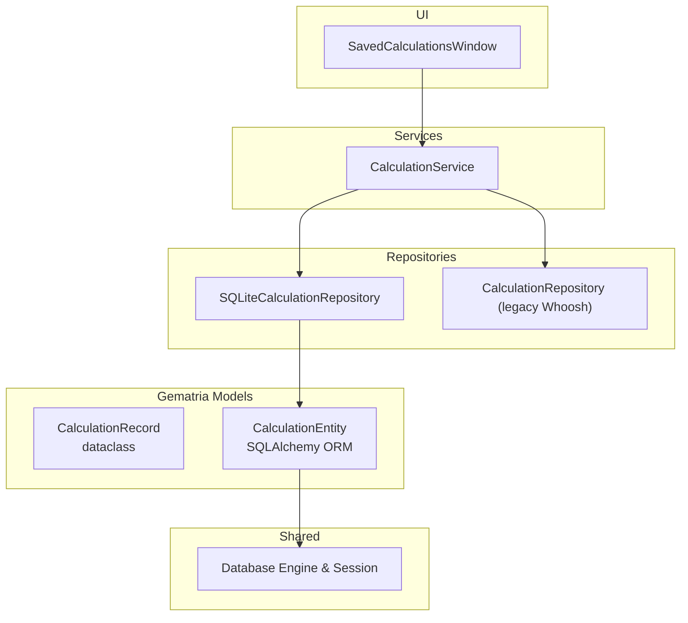
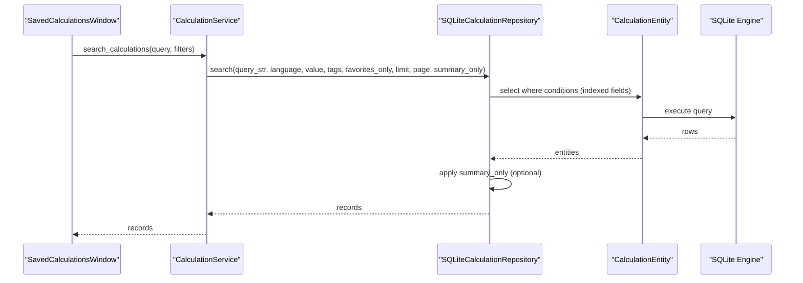
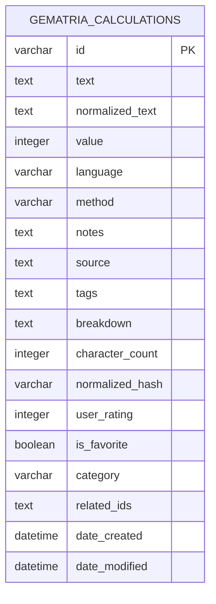
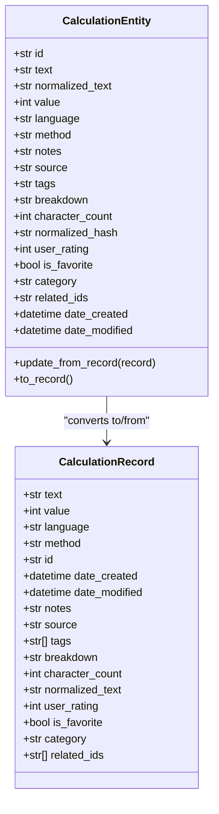
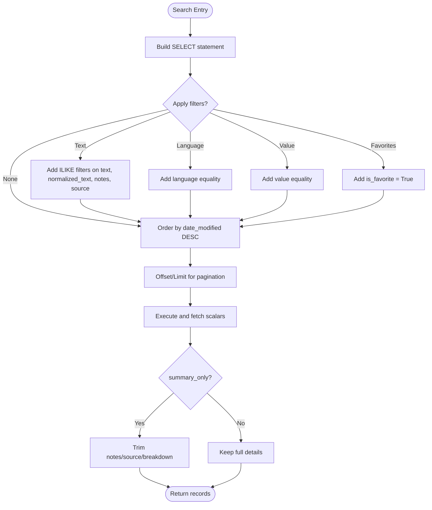

# Gematria Database Schema

<cite>
**Referenced Files in This Document**
- [calculation_record.py](file://src/pillars/gematria/models/calculation_record.py)
- [calculation_entity.py](file://src/pillars/gematria/models/calculation_entity.py)
- [sqlite_calculation_repository.py](file://src/pillars/gematria/repositories/sqlite_calculation_repository.py)
- [calculation_repository.py](file://src/pillars/gematria/repositories/calculation_repository.py)
- [database.py](file://src/shared/database.py)
- [migrate_gematria_whoosh_to_sqlite.py](file://scripts/migrate_gematria_whoosh_to_sqlite.py)
- [update_db_schema.py](file://scripts/update_db_schema.py)
- [calculation_service.py](file://src/pillars/gematria/services/calculation_service.py)
- [saved_calculations_window.py](file://src/pillars/gematria/ui/saved_calculations_window.py)
- [test_sqlite_repository.py](file://test/pillars/gematria/test_sqlite_repository.py)
</cite>

## Table of Contents
1. [Introduction](#introduction)
2. [Project Structure](#project-structure)
3. [Core Components](#core-components)
4. [Architecture Overview](#architecture-overview)
5. [Detailed Component Analysis](#detailed-component-analysis)
6. [Dependency Analysis](#dependency-analysis)
7. [Performance Considerations](#performance-considerations)
8. [Troubleshooting Guide](#troubleshooting-guide)
9. [Conclusion](#conclusion)
10. [Appendices](#appendices)

## Introduction
This document provides comprehensive data model documentation for the Gematria pillar’s database schema. It focuses on the CalculationRecord and CalculationEntity models, detailing field definitions, data types, primary keys, constraints, and indexing strategies. It explains the one-to-one relationship between CalculationRecord and CalculationEntity, documents data access patterns through SQLiteCalculationRepository, and outlines query optimization techniques. It also covers data lifecycle management, retention considerations, security aspects for stored user inputs and results, and migration strategies for schema evolution.

## Project Structure
The Gematria data layer consists of:
- Models: CalculationRecord (dataclass) and CalculationEntity (SQLAlchemy ORM entity)
- Repository: SQLiteCalculationRepository (SQLAlchemy-backed persistence)
- Shared infrastructure: database engine/session and initialization
- Migration scripts: Whoosh-to-SQLite migration and schema update utilities
- Service layer: CalculationService orchestrates saving/updating/deleting/searching
- UI: SavedCalculationsWindow demonstrates search/filter usage

**Diagram sources**
- [calculation_record.py](file://src/pillars/gematria/models/calculation_record.py#L1-L89)
- [calculation_entity.py](file://src/pillars/gematria/models/calculation_entity.py#L1-L92)
- [sqlite_calculation_repository.py](file://src/pillars/gematria/repositories/sqlite_calculation_repository.py#L1-L143)
- [calculation_repository.py](file://src/pillars/gematria/repositories/calculation_repository.py#L1-L329)
- [database.py](file://src/shared/database.py#L1-L53)
- [calculation_service.py](file://src/pillars/gematria/services/calculation_service.py#L1-L200)
- [saved_calculations_window.py](file://src/pillars/gematria/ui/saved_calculations_window.py#L1-L200)

**Section sources**
- [calculation_record.py](file://src/pillars/gematria/models/calculation_record.py#L1-L89)
- [calculation_entity.py](file://src/pillars/gematria/models/calculation_entity.py#L1-L92)
- [sqlite_calculation_repository.py](file://src/pillars/gematria/repositories/sqlite_calculation_repository.py#L1-L143)
- [database.py](file://src/shared/database.py#L1-L53)
- [calculation_service.py](file://src/pillars/gematria/services/calculation_service.py#L1-L200)
- [saved_calculations_window.py](file://src/pillars/gematria/ui/saved_calculations_window.py#L1-L200)

## Core Components
This section defines the data model and its persistence mapping.

- CalculationRecord (dataclass)
  - Purpose: Portable, typed representation of a saved gematria calculation with metadata and user fields.
  - Key fields and types:
    - text: str (original input)
    - value: int (gematria value)
    - language: str (e.g., "Hebrew (Standard)", "Greek (Isopsephy)", "English (TQ)")
    - method: str (calculation method name)
    - id: Optional[str] (UUID)
    - date_created: datetime
    - date_modified: datetime
    - notes: str
    - source: str
    - tags: List[str]
    - breakdown: str (JSON string of letter-value pairs)
    - character_count: int
    - normalized_text: str
    - user_rating: int (0–5)
    - is_favorite: bool
    - category: str
    - related_ids: List[str]
  - Notes:
    - Uses JSON serialization for tags and related_ids.
    - Provides to_dict/from_dict conversion helpers.

- CalculationEntity (SQLAlchemy ORM)
  - Purpose: Persistent representation mapped to the SQLite table.
  - Table: gematria_calculations
  - Primary key: id (String(36), UUID)
  - Notable columns and constraints:
    - text: Text, not null
    - normalized_text: Text, not null, default ""
    - value: Integer, not null, indexed
    - language: String(120), not null, indexed
    - method: String(120), not null
    - notes: Text, not null, default ""
    - source: Text, not null, default ""
    - tags: Text, not null, default "[]"
    - breakdown: Text, not null, default "[]"
    - character_count: Integer, not null, default 0
    - normalized_hash: String(64), not null, default "", indexed
    - user_rating: Integer, not null, default 0
    - is_favorite: Boolean, not null, default False, indexed
    - category: String(120), not null, default ""
    - related_ids: Text, not null, default "[]"
    - date_created: DateTime, not null, default UTC
    - date_modified: DateTime, not null, default UTC, on update UTC
  - Relationship mapping:
    - One CalculationRecord corresponds to one CalculationEntity (one-to-one mapping via id).
    - Conversion methods:
      - update_from_record(): populate entity fields from a CalculationRecord
      - to_record(): convert entity back to CalculationRecord

- Relationship between CalculationRecord and CalculationEntity
  - Mapping direction: CalculationEntity persists CalculationRecord.
  - Primary key alignment: Both share the id field (UUID).
  - Normalization: normalized_text is persisted; normalized_hash is derived from normalized_text for indexing.

**Section sources**
- [calculation_record.py](file://src/pillars/gematria/models/calculation_record.py#L1-L89)
- [calculation_entity.py](file://src/pillars/gematria/models/calculation_entity.py#L1-L92)

## Architecture Overview
The data access layer uses SQLAlchemy with a SQLite backend. The service layer coordinates business logic and delegates persistence to the repository. The UI triggers searches and displays results.

**Diagram sources**
- [saved_calculations_window.py](file://src/pillars/gematria/ui/saved_calculations_window.py#L1-L200)
- [calculation_service.py](file://src/pillars/gematria/services/calculation_service.py#L1-L200)
- [sqlite_calculation_repository.py](file://src/pillars/gematria/repositories/sqlite_calculation_repository.py#L75-L143)
- [calculation_entity.py](file://src/pillars/gematria/models/calculation_entity.py#L1-L92)
- [database.py](file://src/shared/database.py#L1-L53)

## Detailed Component Analysis

### Data Model ER Diagram

**Diagram sources**
- [calculation_entity.py](file://src/pillars/gematria/models/calculation_entity.py#L1-L92)

**Section sources**
- [calculation_entity.py](file://src/pillars/gematria/models/calculation_entity.py#L1-L92)

### Field Definitions and Constraints
- Primary key: id (UUID)
- Indexed fields (for query performance):
  - value (Integer)
  - language (String)
  - normalized_hash (String)
  - is_favorite (Boolean)
- Not null constraints:
  - text, normalized_text, value, language, method, notes, source, tags, breakdown, related_ids
- Defaults:
  - character_count: 0
  - user_rating: 0
  - category: empty string
  - tags and related_ids: empty JSON arrays
  - date_created/date_modified: UTC timestamps
- Special handling:
  - normalized_hash is set to lowercase normalized_text for fast lookups.

**Section sources**
- [calculation_entity.py](file://src/pillars/gematria/models/calculation_entity.py#L1-L92)

### Relationship Between CalculationRecord and CalculationEntity
- Mapping: One CalculationRecord maps to one CalculationEntity via id.
- Conversion:
  - update_from_record(): populates entity fields from a record and sets normalized_hash from normalized_text.
  - to_record(): reconstructs a record from an entity, parsing JSON fields.

**Diagram sources**
- [calculation_record.py](file://src/pillars/gematria/models/calculation_record.py#L1-L89)
- [calculation_entity.py](file://src/pillars/gematria/models/calculation_entity.py#L1-L92)

**Section sources**
- [calculation_record.py](file://src/pillars/gematria/models/calculation_record.py#L1-L89)
- [calculation_entity.py](file://src/pillars/gematria/models/calculation_entity.py#L1-L92)

### Indexing Strategies
- Frequently queried fields and indexes:
  - value: Integer, indexed
  - language: String, indexed
  - normalized_hash: String, indexed
  - is_favorite: Boolean, indexed
- Additional considerations:
  - normalized_text is used for ILIKE searches in repository queries.
  - date_modified is used for ordering recent records.

**Section sources**
- [calculation_entity.py](file://src/pillars/gematria/models/calculation_entity.py#L1-L92)
- [sqlite_calculation_repository.py](file://src/pillars/gematria/repositories/sqlite_calculation_repository.py#L75-L143)

### Data Access Patterns Through SQLiteCalculationRepository
- CRUD operations:
  - save(record): Upsert by id; sets timestamps; returns saved record.
  - get_by_id(record_id): Fetch by primary key.
  - delete(record_id): Remove by id.
- Query operations:
  - search(query_str, language, value, tags, favorites_only, limit, page, summary_only):
    - Supports text search across text, normalized_text, notes, source.
    - Filters by language, exact value, favorites_only.
    - Applies pagination and optional summary-only mode (removes detailed fields).
  - get_all(limit): Returns all records.
  - get_by_value(value, limit): Returns records with exact value.
  - get_favorites(limit): Returns favorite records.
  - get_by_tags(tags, limit): Returns records matching any tag.

**Diagram sources**
- [sqlite_calculation_repository.py](file://src/pillars/gematria/repositories/sqlite_calculation_repository.py#L75-L143)

**Section sources**
- [sqlite_calculation_repository.py](file://src/pillars/gematria/repositories/sqlite_calculation_repository.py#L1-L143)

### Query Optimization Techniques
- Use indexed fields for filtering:
  - value, language, normalized_hash, is_favorite
- Prefer exact equality filters over LIKE where possible.
- Use summary_only to reduce payload size for listing views.
- Limit pages and use offset/limit for large result sets.
- Normalize text and derive normalized_hash to enable efficient lookups.

**Section sources**
- [calculation_entity.py](file://src/pillars/gematria/models/calculation_entity.py#L1-L92)
- [sqlite_calculation_repository.py](file://src/pillars/gematria/repositories/sqlite_calculation_repository.py#L75-L143)

### Data Lifecycle Management and Retention
- Creation and updates:
  - date_created and date_modified are managed during save operations.
  - On update, date_modified is refreshed.
- Deletion:
  - delete(record_id) removes a record by id.
- Cleanup utilities:
  - DatabaseToolsWindow includes logic to remove empty or invalid records and to delete selected records.
- Retention:
  - No explicit retention policy is enforced in the repository or service; deletion is performed on demand via UI or programmatic calls.

**Section sources**
- [sqlite_calculation_repository.py](file://src/pillars/gematria/repositories/sqlite_calculation_repository.py#L37-L71)
- [calculation_service.py](file://src/pillars/gematria/services/calculation_service.py#L127-L138)
- [saved_calculations_window.py](file://src/pillars/gematria/ui/saved_calculations_window.py#L1-L200)

### Security Considerations
- Stored data:
  - text, notes, source, breakdown, tags, related_ids are user-provided and persisted.
- Risk mitigation:
  - Store sensitive user inputs minimally; avoid storing highly sensitive data.
  - Consider sanitizing inputs at ingestion points (outside the scope of the repository).
  - Ensure database file permissions restrict access to authorized users.
  - Use encrypted storage if required by policy.
- Privacy:
  - Respect user expectations about data retention; provide deletion mechanisms.

[No sources needed since this section provides general guidance]

### Sample Data and Typical Workflows
- Typical save workflow:
  - CalculationService constructs a CalculationRecord from calculator results and calls repository.save().
  - Repository persists via CalculationEntity and returns the saved record.
- Typical search workflow:
  - UI collects filters (query, language, value, favorites).
  - Service calls repository.search() and returns records to UI for display.
- Example scenarios:
  - Favorite toggling: Service updates is_favorite and saves.
  - Tagging: Service updates tags and saves.
  - Bulk deletion: UI triggers service.delete_calculation() for selected ids.

**Section sources**
- [calculation_service.py](file://src/pillars/gematria/services/calculation_service.py#L23-L79)
- [sqlite_calculation_repository.py](file://src/pillars/gematria/repositories/sqlite_calculation_repository.py#L37-L71)
- [saved_calculations_window.py](file://src/pillars/gematria/ui/saved_calculations_window.py#L191-L200)

### Migration Strategies for Schema Evolution
- Legacy Whoosh to SQLite migration:
  - A dedicated script reads all Whoosh documents and writes them into SQLite via SQLiteCalculationRepository.
  - Initializes database tables and iterates over all records to insert them.
- Schema updates:
  - A utility script adds columns to existing tables if needed (example shows adding tags, author, collection to documents).
- Recommendations:
  - Back up the database before migrations.
  - Use atomic transactions and handle errors gracefully.
  - Validate data types and defaults during migration.

**Section sources**
- [migrate_gematria_whoosh_to_sqlite.py](file://scripts/migrate_gematria_whoosh_to_sqlite.py#L1-L75)
- [update_db_schema.py](file://scripts/update_db_schema.py#L1-L33)
- [database.py](file://src/shared/database.py#L25-L30)

## Dependency Analysis
- Model-to-repository mapping:
  - CalculationEntity is the ORM mapping used by SQLiteCalculationRepository.
  - CalculationRecord is the portable model used by services and UI.
- Shared database:
  - Base metadata and engine are initialized centrally; tables are created on demand.
- UI-to-service-to-repository chain:
  - UI triggers service methods; service delegates to repository; repository uses SQLAlchemy ORM.

**Diagram sources**
- [saved_calculations_window.py](file://src/pillars/gematria/ui/saved_calculations_window.py#L1-L200)
- [calculation_service.py](file://src/pillars/gematria/services/calculation_service.py#L1-L200)
- [sqlite_calculation_repository.py](file://src/pillars/gematria/repositories/sqlite_calculation_repository.py#L1-L143)
- [calculation_entity.py](file://src/pillars/gematria/models/calculation_entity.py#L1-L92)
- [database.py](file://src/shared/database.py#L1-L53)

**Section sources**
- [sqlite_calculation_repository.py](file://src/pillars/gematria/repositories/sqlite_calculation_repository.py#L1-L143)
- [calculation_entity.py](file://src/pillars/gematria/models/calculation_entity.py#L1-L92)
- [database.py](file://src/shared/database.py#L1-L53)

## Performance Considerations
- Indexed fields:
  - value, language, normalized_hash, is_favorite support efficient filtering and sorting.
- Query patterns:
  - Favor exact equality filters; avoid leading wildcards in ILIKE for performance.
  - Use summary_only for listing screens to minimize payload.
- Pagination:
  - Use limit/page with offset to constrain result sets.
- Storage:
  - JSON fields (tags, related_ids) are stored as text; keep lists small to reduce overhead.

[No sources needed since this section provides general guidance]

## Troubleshooting Guide
- Common issues:
  - Missing database tables: initialize via init_db() before first use.
  - Session management: ensure exceptions trigger rollback and sessions close.
  - Data integrity: verify id uniqueness and JSON serialization/deserialization.
- Tests:
  - Unit tests demonstrate saving, retrieving, filtering by favorites/value/tags, and summary-only behavior.

**Section sources**
- [database.py](file://src/shared/database.py#L25-L30)
- [sqlite_calculation_repository.py](file://src/pillars/gematria/repositories/sqlite_calculation_repository.py#L22-L33)
- [test_sqlite_repository.py](file://test/pillars/gematria/test_sqlite_repository.py#L1-L66)

## Conclusion
The Gematria database schema centers on a single table (gematria_calculations) with a robust set of indexed fields to support common queries. The CalculationRecord and CalculationEntity models provide a clean separation between portable data and persistent mapping. SQLiteCalculationRepository encapsulates CRUD and search operations with pagination and summary modes. Migration tools facilitate evolving from legacy storage to SQLite. Security and retention practices should be considered at the application level, while the repository provides straightforward persistence and querying capabilities.

## Appendices

### Appendix A: Field Reference
- id: UUID, primary key
- text: Text, not null
- normalized_text: Text, not null, default ""
- value: Integer, not null, indexed
- language: String(120), not null, indexed
- method: String(120), not null
- notes: Text, not null, default ""
- source: Text, not null, default ""
- tags: Text, not null, default "[]"
- breakdown: Text, not null, default "[]"
- character_count: Integer, not null, default 0
- normalized_hash: String(64), not null, default "", indexed
- user_rating: Integer, not null, default 0
- is_favorite: Boolean, not null, default False, indexed
- category: String(120), not null, default ""
- related_ids: Text, not null, default "[]"
- date_created: DateTime, not null, default UTC
- date_modified: DateTime, not null, default UTC, on update UTC

**Section sources**
- [calculation_entity.py](file://src/pillars/gematria/models/calculation_entity.py#L1-L92)