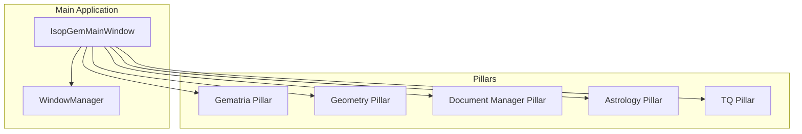

# Development Guide

<cite>
**Referenced Files in This Document**   
- [README.md](file://README.md)
- [requirements.txt](file://requirements.txt)
- [run.sh](file://run.sh)
- [main.py](file://src/main.py)
- [ARCHITECTURE.md](file://config/ARCHITECTURE.md)
- [app_config.py](file://config/app_config.py)
- [database.py](file://src/shared/database.py)
- [window_manager.py](file://src/shared/ui/window_manager.py)
- [gematria_hub.py](file://src/pillars/gematria/ui/gematria_hub.py)
- [base_calculator.py](file://src/pillars/gematria/services/base_calculator.py)
- [calculation_repository.py](file://src/pillars/gematria/repositories/calculation_repository.py)
- [calculation_record.py](file://src/pillars/gematria/models/calculation_record.py)
- [conftest.py](file://test/conftest.py)
</cite>

## Table of Contents
1. [Setting Up the Development Environment](#setting-up-the-development-environment)
2. [Building and Running the Application](#building-and-running-the-application)
3. [Contribution Workflow](#contribution-workflow)
4. [Pillar-Based Architecture Patterns](#pillar-based-architecture-patterns)
5. [Creating New Calculators, UI Components, and Services](#creating-new-calculators-ui-components-and-services)
6. [Testing and Code Quality](#testing-and-code-quality)
7. [Debugging Techniques and Tools](#debugging-techniques-and-tools)
8. [Common Development Challenges and Solutions](#common-development-challenges-and-solutions)
9. [Extending Functionality and Creating New Pillars](#extending-functionality-and-creating-new-pillars)
10. [Performance Optimization and Code Organization](#performance-optimization-and-code-organization)

## Setting Up the Development Environment

To set up a development environment for the isopgem application, follow these step-by-step instructions:

1. **Clone the repository**:
   ```bash
   git clone https://github.com/TheDaniel166/IsopGem.git
   cd IsopGem
   ```

2. **Create a virtual environment**:
   ```bash
   python3 -m venv .venv
   source .venv/bin/activate
   ```

3. **Install dependencies**:
   ```bash
   pip install --upgrade pip
   pip install -r requirements.txt
   ```

The application requires Python 3.11+ and uses PyQt6, SQLAlchemy, and other libraries as specified in the requirements.txt file. The virtual environment ensures that dependencies are isolated from other Python projects.

**Section sources**
- [README.md](file://README.md#L63-L77)
- [requirements.txt](file://requirements.txt#L1-L40)

## Building and Running the Application

The isopgem application can be built and run in development mode using the provided run.sh script or manually:

**Recommended Method**:
```bash
./run.sh
```

This script handles virtual environment activation, sets necessary Qt platform flags (QT_QPA_PLATFORM=xcb for Linux stability), and launches the application.

**Manual Launch**:
```bash
source .venv/bin/activate
cd src
python main.py
```

The main.py file serves as the entry point for the application, initializing the database, creating the main window, and setting up the UI components. The run.sh script ensures proper terminal state preservation and Qt platform configuration.

**Section sources**
- [README.md](file://README.md#L81-L92)
- [run.sh](file://run.sh#L1-L24)
- [main.py](file://src/main.py#L1-L156)

## Contribution Workflow

The contribution workflow for the isopgem application follows standard Git practices with a focus on pillar-based development:

1. **Branching Strategy**: Create feature branches from the main branch for new development. Use descriptive branch names that indicate the pillar and feature being developed (e.g., "gematria-add-calculator-type").

2. **Code Review Process**: All changes must go through a pull request process with code review. The review should focus on adherence to the pillar architecture, code quality, and test coverage.

3. **Testing Requirements**: All new features must include appropriate tests. The test suite is located in the test/ directory and uses pytest as the testing framework. Tests should cover both positive and negative cases for all new functionality.

The application uses a consistent structure across all pillars, making it easier to review and understand contributions. Each pillar follows the same pattern of models, services, repositories, and UI components.

**Section sources**
- [test/conftest.py](file://test/conftest.py#L1-L8)
- [README.md](file://README.md#L32-L33)

## Pillar-Based Architecture Patterns

The isopgem application follows a domain-pillar architecture with five main pillars: Gematria, Geometry, Document Manager, Astrology, and TQ (Trigrammaton QBLH). Each pillar follows a consistent structure:

```
pillar/
├── ui/              # PyQt6-based interface components
├── services/        # Business logic and core functionality
├── models/          # Data structures and type definitions
├── repositories/    # Data access and persistence
└── utils/           # Helper functions and utilities
```

The shared/ directory contains components used across multiple pillars, including common UI widgets, data models, and utility functions. This architecture promotes consistency and makes it easier to develop new features.

The main application window (IsopGemMainWindow) initializes all pillar tabs and manages their lifecycle through a centralized window manager. Each pillar hub provides access to its specific tools and functionality.



**Diagram sources **
- [main.py](file://src/main.py#L26-L156)
- [window_manager.py](file://src/shared/ui/window_manager.py#L1-L221)
- [ARCHITECTURE.md](file://config/ARCHITECTURE.md#L32-L43)

**Section sources**
- [ARCHITECTURE.md](file://config/ARCHITECTURE.md#L5-L51)
- [main.py](file://src/main.py#L26-L156)

## Creating New Calculators, UI Components, and Services

To create new calculators, UI components, and services in the isopgem application, follow the established patterns within each pillar:

### Creating New Calculators
New calculators should inherit from the GematriaCalculator base class and implement the required abstract methods. The base class provides common functionality like text normalization and value calculation.

```python
class MyNewCalculator(GematriaCalculator):
    def _initialize_mapping(self) -> Dict[str, int]:
        # Define the letter-to-value mapping
        return {"A": 1, "B": 2, "C": 3}
    
    @property
    def name(self) -> str:
        return "My New Calculator"
```

### Creating New UI Components
UI components should be placed in the ui/ directory of the appropriate pillar. They should use PyQt6 widgets and follow the application's styling guidelines. The window manager handles the lifecycle of tool windows, ensuring proper opening, closing, and positioning.

### Creating New Services
Services contain the business logic for a pillar and should be placed in the services/ directory. They interact with models and repositories to provide functionality to the UI components. Services should be designed to be reusable and testable.

**Section sources**
- [base_calculator.py](file://src/pillars/gematria/services/base_calculator.py#L7-L107)
- [gematria_hub.py](file://src/pillars/gematria/ui/gematria_hub.py#L49-L352)

## Testing and Code Quality

The isopgem application uses pytest for testing, with tests located in the test/ directory. The test suite includes unit tests, integration tests, and verification scripts.

### Writing Tests
Tests should follow the structure and patterns established in the existing test files. For example, the test_calculation_service.py file demonstrates how to test the calculation service using a fake repository and pytest fixtures.

```python
@pytest.fixture
def repo_and_service():
    repo = FakeCalculationRepository()
    service = CalculationService(repository=repo)
    return service, repo
```

### Maintaining Code Quality
Code quality is maintained through consistent coding standards, comprehensive testing, and regular code reviews. The application uses type hints, docstrings, and follows PEP 8 guidelines. The test suite provides high coverage of the codebase, ensuring reliability and maintainability.

**Section sources**
- [test_calculation_service.py](file://test/pillars/gematria/test_calculation_service.py#L1-L134)
- [conftest.py](file://test/conftest.py#L1-L8)

## Debugging Techniques and Tools

The isopgem application provides several tools and techniques for debugging:

1. **Logging**: The application uses Python's logging module with a DEBUG level for detailed output. This can be configured in the main() function of main.py.

2. **Verification Scripts**: The test/ directory contains several verification scripts (e.g., verify_alignment_mutex.py, verify_pdf_export.py) that can be used to test specific functionality.

3. **Database Tools**: The database_tools_window.py component provides a UI for inspecting and managing the application's database.

4. **Debug Scripts**: Several debug scripts are available in the root directory (e.g., debug_natal_fix.py, debug_rose_calibration.py) for testing specific features.

The window manager also provides debugging capabilities, such as logging window events and tracking active windows.

**Section sources**
- [main.py](file://src/main.py#L115-L119)
- [window_manager.py](file://src/shared/ui/window_manager.py#L12-L13)

## Common Development Challenges and Solutions

Developers working on the isopgem application may encounter several common challenges:

### Qt Platform Issues
The application sets QT_QPA_PLATFORM=xcb to ensure stability on Linux systems. This can be modified in the run.sh script or in the main.py file.

### Database Initialization
The database is initialized in the init_db() function of database.py. This function creates the database tables and ensures that all models are properly registered with SQLAlchemy.

### Window Management
The window manager handles the lifecycle of tool windows, but developers should be aware of the window flags and attributes used to ensure proper behavior across different platforms.

### Dependency Management
The application uses a virtual environment to manage dependencies. Developers should ensure that all new dependencies are added to the requirements.txt file.

**Section sources**
- [run.sh](file://run.sh#L13-L13)
- [database.py](file://src/shared/database.py#L25-L29)
- [window_manager.py](file://src/shared/ui/window_manager.py#L88-L92)

## Extending Functionality and Creating New Pillars

To extend existing functionality or create new pillars in the isopgem application:

1. **Follow the Pillar Structure**: Create a new directory under src/pillars/ with the standard structure (ui/, services/, models/, repositories/, utils/).

2. **Register the Pillar**: Add the new pillar to the main application window in main.py by creating an initialization method similar to _init_gematria_pillar().

3. **Implement Core Components**: Create the hub UI component, services, models, and repositories following the patterns established in existing pillars.

4. **Add Configuration**: Update the app_config.py file to include the new pillar with its name, description, and icon.

5. **Write Tests**: Create a test directory for the new pillar and implement comprehensive tests for all functionality.

When extending existing functionality, ensure that changes are made in a way that maintains backward compatibility and follows the established architecture patterns.

**Section sources**
- [main.py](file://src/main.py#L75-L104)
- [app_config.py](file://config/app_config.py#L9-L40)

## Performance Optimization and Code Organization

To optimize performance and maintain good code organization in the isopgem application:

1. **Use Efficient Data Structures**: Choose appropriate data structures for the task at hand. For example, use sets for membership testing and dictionaries for key-value lookups.

2. **Minimize Database Queries**: Use SQLAlchemy's query optimization features and batch operations when possible to reduce database round-trips.

3. **Lazy Loading**: Implement lazy loading for expensive operations, such as loading large datasets or initializing complex UI components.

4. **Caching**: Use caching for expensive calculations or frequently accessed data.

5. **Code Organization**: Follow the established pillar structure and keep related functionality together. Use meaningful names for classes, functions, and variables.

6. **Documentation**: Maintain up-to-date documentation for all components, including docstrings for classes and functions.

The application's architecture promotes good code organization by separating concerns into distinct layers (UI, services, models, repositories) and reusing shared components.

**Section sources**
- [ARCHITECTURE.md](file://config/ARCHITECTURE.md#L32-L43)
- [database.py](file://src/shared/database.py#L20-L23)