# Project Overview

<cite>
**Referenced Files in This Document**   
- [README.md](file://README.md)
- [main.py](file://src/main.py)
- [requirements.txt](file://requirements.txt)
- [config/ARCHITECTURE.md](file://config/ARCHITECTURE.md)
- [config/ARCHITECTURE_DIAGRAM.txt](file://config/ARCHITECTURE_DIAGRAM.txt)
- [run.sh](file://run.sh)
- [src/pillars/gematria/ui/gematria_hub.py](file://src/pillars/gematria/ui/gematria_hub.py)
- [src/pillars/geometry/ui/geometry_hub.py](file://src/pillars/geometry/ui/geometry_hub.py)
- [src/pillars/astrology/ui/astrology_hub.py](file://src/pillars/astrology/ui/astrology_hub.py)
- [src/pillars/tq/ui/tq_hub.py](file://src/pillars/tq/ui/tq_hub.py)
- [src/pillars/adyton/ui/adyton_hub.py](file://src/pillars/adyton/ui/adyton_hub.py)
- [src/shared/ui/window_manager.py](file://src/shared/ui/window_manager.py)
- [src/shared/database.py](file://src/shared/database.py)
</cite>

## Table of Contents
1. [Introduction](#introduction)
2. [Core Purpose and Use Cases](#core-purpose-and-use-cases)
3. [Architecture Overview](#architecture-overview)
4. [System Requirements and Supported Platforms](#system-requirements-and-supported-platforms)
5. [Key Features and Components](#key-features-and-components)
6. [User Workflows](#user-workflows)
7. [Target Audience](#target-audience)

## Introduction

The isopgem project is an Integrated Esoteric Analysis Platform designed to unify multiple esoteric disciplines into a single, cohesive desktop application. Built on a modern Python 3.11+ foundation with a PyQt6-based interface, isopgem provides researchers and developers with a comprehensive suite of tools for gematria, sacred geometry, document research, astrology, and Trigrammaton QBLH analysis. The platform's modular architecture, organized around the concept of "pillars," enables extensibility and maintainability while providing a consistent user experience across all domains.

**Section sources**
- [README.md](file://README.md#L3-L6)
- [main.py](file://src/main.py#L1-L156)

## Core Purpose and Use Cases

isopgem serves as a unified workspace for esoteric research, eliminating the need for multiple disparate tools by integrating several key disciplines into a single application. Its primary purpose is to facilitate deep, interdisciplinary analysis through a shared data model and consistent user interface.

The platform supports the following core use cases:

- **Numerological Analysis**: Perform gematria calculations across Hebrew, Greek, and English systems using various methodologies such as standard gematria, sofit values, ordinal values, atbash, albam, and more. The gematria pillar provides comprehensive tools for text analysis, batch calculations, and saved calculation management.

- **Sacred Geometry Visualization**: Explore and calculate properties of 2D and 3D geometric forms, including circles, triangles, quadrilaterals, regular polygons, Platonic solids, Archimedean solids, pyramids, prisms, antiprisms, and hypercubes. The geometry pillar offers interactive calculators and visualization tools for sacred geometric forms.

- **Esoteric Document Research**: Ingest, analyze, and organize texts and documents with full-text search capabilities, metadata graph visualization, and integrated document editing. The document manager pillar supports multiple document formats and provides tools for text analysis and research organization.

- **Astrological Calculations**: Generate natal charts, analyze planetary positions, and study cosmic calendars and zodiacal mappings using high-precision astronomical data from the OpenAstro2 stack with Swiss Ephemeris integration.

- **QBLH Pattern Analysis**: Conduct Trigrammaton QBLH research with tools for quadset analysis, rune pairing, geometric transitions, ternary conversion, and kamea grid visualization. The TQ pillar provides specialized tools for pattern recognition and symbolic analysis.

**Section sources**
- [README.md](file://README.md#L3-L6)
- [config/ARCHITECTURE.md](file://config/ARCHITECTURE.md#L1-L51)
- [src/pillars/gematria/ui/gematria_hub.py](file://src/pillars/gematria/ui/gematria_hub.py#L49-L352)
- [src/pillars/geometry/ui/geometry_hub.py](file://src/pillars/geometry/ui/geometry_hub.py#L1111-L1750)
- [src/pillars/astrology/ui/astrology_hub.py](file://src/pillars/astrology/ui/astrology_hub.py#L13-L126)
- [src/pillars/tq/ui/tq_hub.py](file://src/pillars/tq/ui/tq_hub.py#L17-L326)

## Architecture Overview

isopgem follows a modular, domain-pillar architecture that organizes functionality into distinct, self-contained components. This architectural approach promotes extensibility, maintainability, and consistency across the application.

The system is structured around five main pillars:
- **Gematria**: Hebrew, Greek, and English numerical analysis tools
- **Geometry**: Sacred geometry visualization and calculation tools
- **Document Manager**: Text and document analysis and organization
- **Astrology**: Cosmic calendar and zodiacal mappings
- **TQ (Trigrammaton QBLH)**: Integration and pattern analysis

Each pillar adheres to a consistent component structure:
```
pillar/
├── ui/              # PyQt6-based interface components
├── services/        # Business logic and core functionality
├── models/          # Data structures and type definitions
├── repositories/    # Data access and persistence
└── utils/           # Helper functions and utilities
```

The main application, defined in `main.py`, serves as the central hub that integrates all pillars through a tabbed interface. Each pillar is initialized and added as a tab to the main window, providing seamless navigation between different domains of analysis.

A shared component system provides cross-pillar functionality:
- `shared/ui/` - Common UI widgets, dialogs, and the WindowManager for managing tool windows
- `shared/models/` - Shared data models
- `shared/utils/` - General utility functions
- `shared/database.py` - Centralized database connection and session management using SQLAlchemy

The WindowManager class plays a crucial role in the application's user experience, managing the lifecycle of tool windows across all pillars, including opening, closing, positioning, and tracking active windows. This enables the "floating palettes" feature where tools can be opened as separate windows while remaining pinned to the main application.

Data persistence is handled through a hybrid approach using SQLite for structured data and Whoosh for full-text search indexing. The database is automatically created in a `data/` directory and managed through SQLAlchemy ORM.

```mermaid
graph TD
A[Main Application] --> B[Gematria Pillar]
A --> C[Geometry Pillar]
A --> D[Document Manager Pillar]
A --> E[Astrology Pillar]
A --> F[TQ Pillar]
A --> G[Adyton Pillar]
A --> H[Shared Components]
H --> I[UI Widgets]
H --> J[Database Management]
H --> K[Window Manager]
B --> L[UI]
B --> M[Services]
B --> N[Models]
B --> O[Repositories]
B --> P[Utils]
C --> Q[UI]
C --> R[Services]
C --> S[Models]
C --> T[Repositories]
C --> U[Utils]
D --> V[UI]
D --> W[Services]
D --> X[Models]
D --> Y[Repositories]
D --> Z[Utils]
E --> AA[UI]
E --> AB[Services]
E --> AC[Models]
E --> AD[Repositories]
E --> AE[Utils]
F --> AF[UI]
F --> AG[Services]
F --> AH[Models]
F --> AI[Repositories]
F --> AJ[Utils]
G --> AK[WindowManager]
G --> AL[Database]
G --> AM[Theme]
```



**Diagram sources **
- [config/ARCHITECTURE.md](file://config/ARCHITECTURE.md#L1-L51)
- [config/ARCHITECTURE_DIAGRAM.txt](file://config/ARCHITECTURE_DIAGRAM.txt#L1-L189)
- [main.py](file://src/main.py#L1-L156)
- [shared/ui/window_manager.py](file://src/shared/ui/window_manager.py#L1-L221)
- [shared/database.py](file://src/shared/database.py#L1-L53)

**Section sources**
- [config/ARCHITECTURE.md](file://config/ARCHITECTURE.md#L1-L51)
- [config/ARCHITECTURE_DIAGRAM.txt](file://config/ARCHITECTURE_DIAGRAM.txt#L1-L189)
- [main.py](file://src/main.py#L1-L156)
- [shared/ui/window_manager.py](file://src/shared/ui/window_manager.py#L1-L221)
- [shared/database.py](file://src/shared/database.py#L1-L53)

## System Requirements and Supported Platforms

isopgem has the following system requirements:

- **Python Version**: Python 3.11 or higher
- **UI Framework**: PyQt6 (version 6.6.0 or higher)
- **Database**: SQLite (via SQLAlchemy ORM)
- **Search**: Whoosh (for full-text search capabilities)
- **Document Processing**: Various libraries for handling DOCX, PDF, RTF, and other document formats
- **Astrology Engine**: OpenAstro2, pyswisseph, skyfield, and related astronomy libraries
- **Data Processing**: numpy, pandas, and opencv-python-headless

The application is designed to be cross-platform and supports the following operating systems:
- Linux (with X11 via QT_QPA_PLATFORM=xcb for stability)
- Windows
- macOS

The recommended method for running the application is through the provided `run.sh` script, which handles virtual environment activation, sets necessary Qt platform flags, and launches the application. For manual execution, users should activate a virtual environment, set the QT_QPA_PLATFORM environment variable to 'xcb' on Linux systems, and run `python main.py` from the `src/` directory.

**Section sources**
- [README.md](file://README.md#L5-L6)
- [requirements.txt](file://requirements.txt#L1-L40)
- [run.sh](file://run.sh#L1-L24)
- [main.py](file://src/main.py#L8-L11)

## Key Features and Components

isopgem offers a rich set of features organized within its pillar-based architecture:

### Gematria Pillar
The active gematria pillar provides comprehensive numerical analysis tools with support for multiple calculation methods:
- Hebrew gematria (standard, sofit, letter value, ordinal, small value, atbash, albam, kolel, square, cube, triangular, integral reduced, ordinal square, full value)
- Greek gematria (standard, letter value, ordinal, small value, kolel, square, cube, triangular, digital, ordinal square, full value, reverse substitution, pair matching, next letter)
- TQ gematria (standard, reduced, square, triangular, position)

Key components include the Gematria Calculator, Saved Calculations browser, Batch Calculator, Text Analysis tool, Database Tools, and Methods Reference.

### Geometry Pillar
The geometry pillar offers extensive tools for sacred geometry analysis:
- 2D shapes: Circles, ellipses, annuli, crescents, vesica piscis, rose curves, triangles (equilateral, right, isosceles, scalene, acute, obtuse, isosceles right, 30-60-90, golden, heronian), quadrilaterals (square, rectangle, parallelogram, rhombus, trapezoid, isosceles trapezoid, kite, deltoid, cyclic, tangential, bicentric), and regular polygons (3-12 sides)
- 3D solids: Platonic solids (tetrahedron, cube, octahedron, dodecahedron, icosahedron), Archimedean solids (truncated tetrahedron, cuboctahedron, truncated cube, truncated octahedron, rhombicuboctahedron, truncated cuboctahedron, snub cube, icosidodecahedron, truncated dodecahedron, truncated icosahedron, rhombicosidodecahedron, truncated icosidodecahedron, snub dodecahedron), pyramids (square, rectangular, triangular, pentagonal, hexagonal, heptagonal, golden, step, frustums), prisms (triangular, rectangular, pentagonal, hexagonal, heptagonal, octagonal, oblique, frustums), antiprisms (triangular, square, pentagonal, hexagonal, heptagonal, octagonal), and hypercubes (tesseract)

### Astrology Pillar
The astrology pillar provides tools for astrological calculations:
- Natal Chart Generator
- Current Transit Viewer
- Planetary Positions Table
- Neo-Aubrey Eclipse Clock
- The Cytherean Rose (Venus Rose)

### TQ Pillar
The TQ pillar offers specialized tools for Trigrammaton QBLH analysis:
- Ternary Converter
- Quadset Analysis
- Ternary Transitions
- Geometric Transitions (2D and 3D)
- Conrune Pair Finder
- Amun Sound Calculator
- Kamea Grid Visualizer (Maut and Baphomet variants)

### Adyton Pillar
The Adyton pillar provides access to the 3D engine for the "Inner Sanctuary of the Seven," featuring chamber visualization, Amun color mapping, and sacred geometry exploration.

**Section sources**
- [README.md](file://README.md#L47-L51)
- [src/pillars/gematria/ui/gematria_hub.py](file://src/pillars/gematria/ui/gematria_hub.py#L49-L352)
- [src/pillars/geometry/ui/geometry_hub.py](file://src/pillars/geometry/ui/geometry_hub.py#L1111-L1750)
- [src/pillars/astrology/ui/astrology_hub.py](file://src/pillars/astrology/ui/astrology_hub.py#L13-L126)
- [src/pillars/tq/ui/tq_hub.py](file://src/pillars/tq/ui/tq_hub.py#L17-L326)
- [src/pillars/adyton/ui/adyton_hub.py](file://src/pillars/adyton/ui/adyton_hub.py#L8-L67)

## User Workflows

Users interact with isopgem through a consistent workflow pattern across all pillars:

1. **Launching the Application**: Users can launch isopgem using the `./run.sh` script, which handles environment setup and application startup. The application launches in full-screen mode by default, providing an immersive workspace.

2. **Navigating Between Pillars**: The main interface presents a tabbed navigation system with icons representing each pillar (📖 Gematria, 📐 Geometry, 📚 Documents, ⭐ Astrology, 🔺 TQ, 🏛️ Adyton). Users can switch between pillars by clicking on the corresponding tab.

3. **Accessing Tools Within a Pillar**: Each pillar contains a hub interface that displays available tools as prominently styled buttons. For example, the Gematria hub provides access to the Gematria Calculator, Saved Calculations, Batch Calculator, Text Analysis, Database Tools, and Methods Reference.

4. **Using Floating Palettes**: Most tools open as floating palettes that remain "pinned" to the main application. These tool windows can be moved to any monitor while maintaining their connection to the main application, ensuring they never get lost behind other windows. The WindowManager ensures proper Z-ordering and window management.

5. **Performing Analysis**: Users can perform various types of analysis depending on the selected pillar, such as entering text for gematria calculation, selecting geometric shapes for visualization, generating astrological charts, or analyzing QBLH patterns.

6. **Saving and Managing Results**: Many tools provide functionality for saving calculations, searches, or analyses to the SQLite database for future reference and research continuity.

**Section sources**
- [README.md](file://README.md#L39-L42)
- [main.py](file://src/main.py#L148)
- [src/pillars/gematria/ui/gematria_hub.py](file://src/pillars/gematria/ui/gematria_hub.py#L49-L352)
- [src/shared/ui/window_manager.py](file://src/shared/ui/window_manager.py#L1-L221)

## Target Audience

isopgem serves two primary audiences:

### Esoteric Researchers
The platform is designed for researchers and practitioners in various esoteric disciplines who require sophisticated tools for numerical analysis, geometric visualization, document research, astrological calculations, and QBLH pattern analysis. The unified workspace eliminates the need to switch between multiple specialized applications, allowing for integrated, interdisciplinary research. The consistent user experience across all pillars reduces the learning curve when moving between different domains of analysis.

### Technical Developers
The modular, well-documented architecture makes isopgem accessible to developers who wish to contribute to the project or extend its functionality. The pillar-based design with consistent component structure (ui, services, models, repositories, utils) provides a predictable framework for implementing new features. Developers can leverage the shared components and established patterns to create new tools or enhance existing ones. The use of standard Python libraries and frameworks (PyQt6, SQLAlchemy, Whoosh) ensures compatibility with existing development workflows and tooling.

The platform's open-source nature and clear architectural principles make it suitable for both individual researchers and collaborative development teams interested in advancing esoteric analysis tools.

**Section sources**
- [README.md](file://README.md#L30-L34)
- [config/ARCHITECTURE.md](file://config/ARCHITECTURE.md#L1-L51)
- [src/pillars/__init__.py](file://src/pillars/__init__.py#L1-L2)