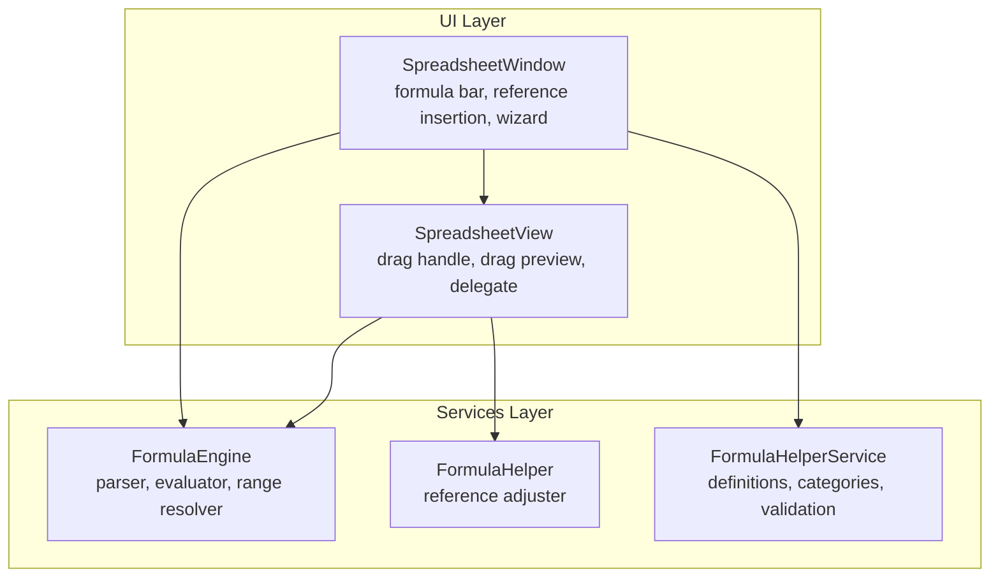
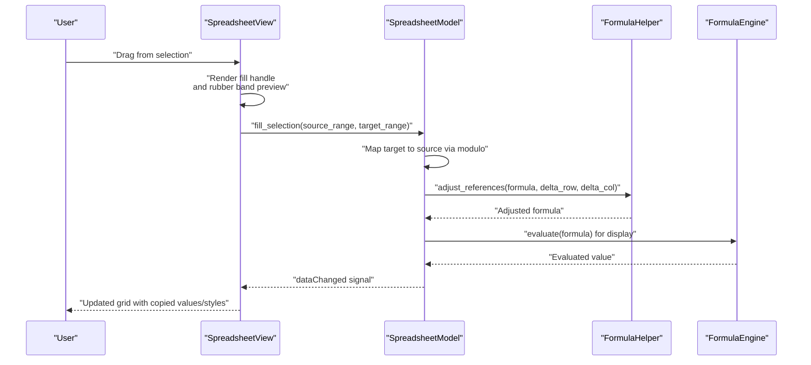
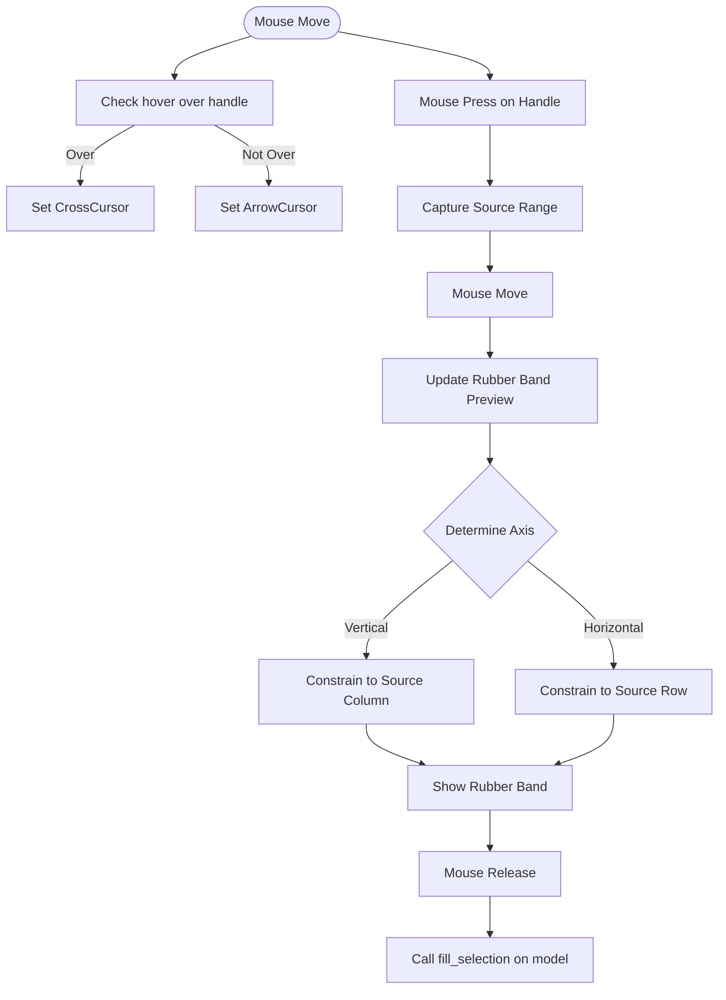
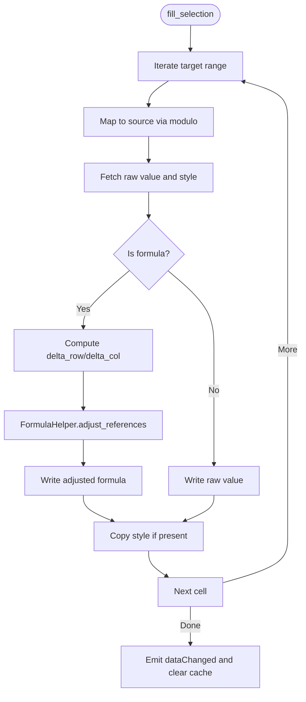
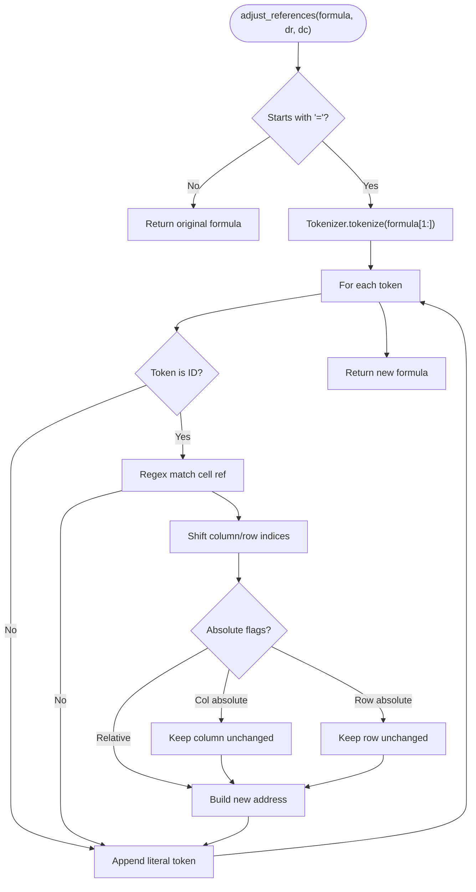
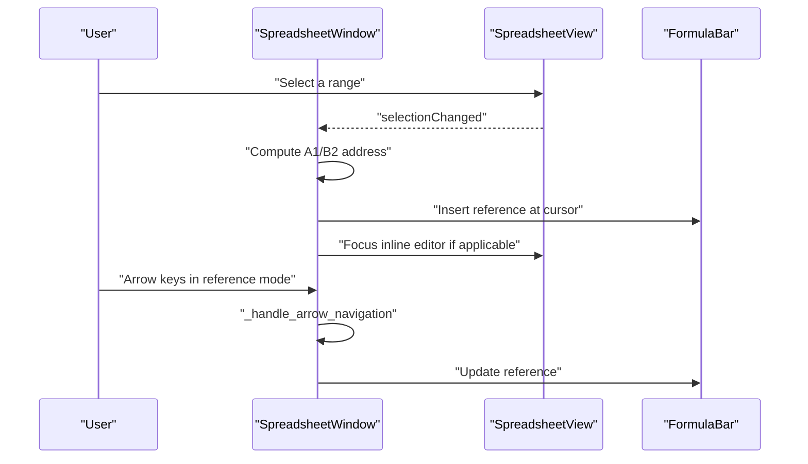
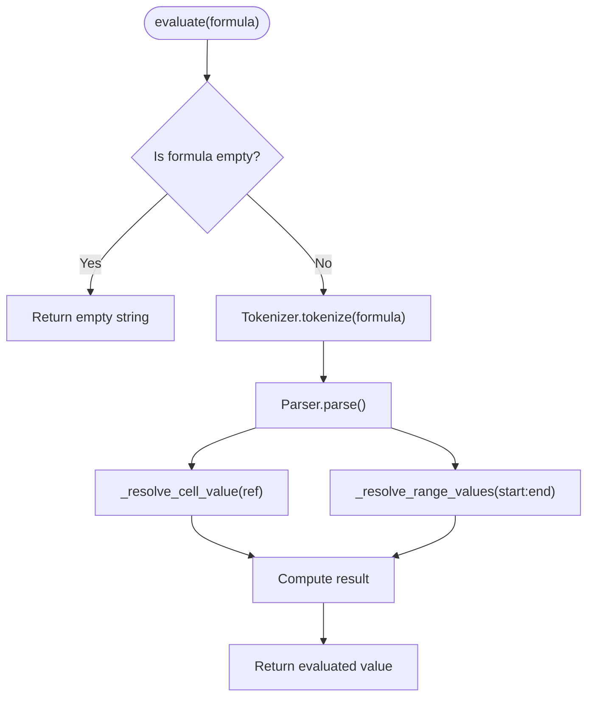
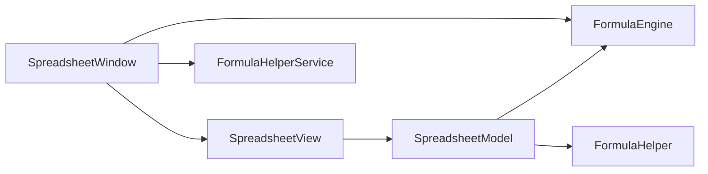

# Spreadsheet Fill Handle and Formula Reference Adjustment

<cite>
**Referenced Files in This Document**
- [spreadsheet_view.py](file://src/pillars/correspondences/ui/spreadsheet_view.py)
- [spreadsheet_window.py](file://src/pillars/correspondences/ui/spreadsheet_window.py)
- [formula_engine.py](file://src/pillars/correspondences/services/formula_engine.py)
- [formula_helper.py](file://src/pillars/correspondences/services/formula_helper.py)
- [Spreadsheet_Feature_Roadmap.md](file://Docs/Spreadsheet_Feature_Roadmap.md)
- [verify_formula_range.py](file://scripts/verify_formula_range.py)
</cite>

## Table of Contents
1. [Introduction](#introduction)
2. [Project Structure](#project-structure)
3. [Core Components](#core-components)
4. [Architecture Overview](#architecture-overview)
5. [Detailed Component Analysis](#detailed-component-analysis)
6. [Dependency Analysis](#dependency-analysis)
7. [Performance Considerations](#performance-considerations)
8. [Troubleshooting Guide](#troubleshooting-guide)
9. [Conclusion](#conclusion)
10. [Appendices](#appendices)

## Introduction
This document explains the Spreadsheet Fill Handle and Formula Reference Adjustment features implemented in the IsopGem project. It focuses on how drag-to-fill works, how the fill handle is rendered, and how formulas are adjusted when dragged across cells. It also covers the formula bar integration for inserting references and the underlying formula engine that evaluates ranges and adjusts references.

## Project Structure
The spreadsheet feature spans UI and service layers:
- UI layer: SpreadsheetView and SpreadsheetWindow manage rendering, input, drag preview, and the formula bar.
- Service layer: FormulaEngine parses and evaluates formulas; FormulaHelper adjusts cell references; FormulaHelperService provides formula discovery and validation helpers.

**Diagram sources**
- [spreadsheet_view.py](file://src/pillars/correspondences/ui/spreadsheet_view.py#L608-L1129)
- [spreadsheet_window.py](file://src/pillars/correspondences/ui/spreadsheet_window.py#L1-L400)
- [formula_engine.py](file://src/pillars/correspondences/services/formula_engine.py#L1-L200)
- [formula_helper.py](file://src/pillars/correspondences/services/formula_helper.py#L1-L56)

**Section sources**
- [spreadsheet_view.py](file://src/pillars/correspondences/ui/spreadsheet_view.py#L608-L1129)
- [spreadsheet_window.py](file://src/pillars/correspondences/ui/spreadsheet_window.py#L1-L200)
- [formula_engine.py](file://src/pillars/correspondences/services/formula_engine.py#L1-L120)
- [formula_helper.py](file://src/pillars/correspondences/services/formula_helper.py#L1-L56)

## Core Components
- SpreadsheetView: Implements drag-to-fill, renders the fill handle, and manages rubber-band preview.
- SpreadsheetModel: Performs batch fill operations, maps target cells to source values/styles, and adjusts formulas via FormulaHelper.
- FormulaEngine: Tokenizes, parses, and evaluates formulas; resolves cell and range references.
- FormulaHelper: Adjusts cell references in formulas respecting absolute and relative addressing.
- SpreadsheetWindow: Integrates the formula bar, inserts references, and coordinates reference mode and wizard workflows.

**Section sources**
- [spreadsheet_view.py](file://src/pillars/correspondences/ui/spreadsheet_view.py#L608-L1129)
- [spreadsheet_window.py](file://src/pillars/correspondences/ui/spreadsheet_window.py#L80-L200)
- [formula_engine.py](file://src/pillars/correspondences/services/formula_engine.py#L362-L446)
- [formula_helper.py](file://src/pillars/correspondences/services/formula_helper.py#L1-L56)

## Architecture Overview
The fill handle and formula reference adjustment pipeline connects UI input to model mutation and formula evaluation.

**Diagram sources**
- [spreadsheet_view.py](file://src/pillars/correspondences/ui/spreadsheet_view.py#L608-L806)
- [spreadsheet_view.py](file://src/pillars/correspondences/ui/spreadsheet_view.py#L807-L1129)
- [formula_engine.py](file://src/pillars/correspondences/services/formula_engine.py#L362-L446)
- [formula_engine.py](file://src/pillars/correspondences/services/formula_engine.py#L815-L880)

## Detailed Component Analysis

### Fill Handle Rendering and Drag Preview
- The fill handle is drawn in the delegate when the view’s handle position equals the cell index. It appears as a small square at the bottom-right corner of the selected cell.
- Drag preview uses a rubber band rectangle constrained to either horizontal or vertical axis based on the larger delta between source and target positions.

**Diagram sources**
- [spreadsheet_view.py](file://src/pillars/correspondences/ui/spreadsheet_view.py#L608-L791)
- [spreadsheet_view.py](file://src/pillars/correspondences/ui/spreadsheet_view.py#L792-L806)

**Section sources**
- [spreadsheet_view.py](file://src/pillars/correspondences/ui/spreadsheet_view.py#L518-L538)
- [spreadsheet_view.py](file://src/pillars/correspondences/ui/spreadsheet_view.py#L690-L751)
- [spreadsheet_view.py](file://src/pillars/correspondences/ui/spreadsheet_view.py#L752-L791)
- [spreadsheet_view.py](file://src/pillars/correspondences/ui/spreadsheet_view.py#L792-L806)

### Fill Operation and Formula Reference Adjustment
- The model computes target indices by mapping to the source rectangle using modulo arithmetic. This ensures repeating patterns when dragging beyond the source bounds.
- For each target cell, the model copies style from the mapped source and, if the source contains a formula, adjusts references using FormulaHelper.
- The model emits dataChanged to refresh the view.

**Diagram sources**
- [spreadsheet_view.py](file://src/pillars/correspondences/ui/spreadsheet_view.py#L57-L127)
- [formula_engine.py](file://src/pillars/correspondences/services/formula_engine.py#L815-L880)

**Section sources**
- [spreadsheet_view.py](file://src/pillars/correspondences/ui/spreadsheet_view.py#L57-L127)
- [formula_engine.py](file://src/pillars/correspondences/services/formula_engine.py#L815-L880)

### Formula Reference Adjustment Logic
- FormulaHelper.tokenize splits the formula body into tokens, preserving whitespace.
- For each identifier token, the helper checks if it matches a cell reference and shifts column/row indices according to deltas, respecting absolute references.
- The adjusted tokens are concatenated back into a new formula string.

**Diagram sources**
- [formula_engine.py](file://src/pillars/correspondences/services/formula_engine.py#L815-L880)

**Section sources**
- [formula_engine.py](file://src/pillars/correspondences/services/formula_engine.py#L120-L181)
- [formula_engine.py](file://src/pillars/correspondences/services/formula_engine.py#L815-L880)

### Formula Bar and Reference Insertion
- The formula bar is integrated into SpreadsheetWindow and synchronized with inline editors.
- When a range is selected, SpreadsheetWindow constructs an A1-style address string and inserts it at the current cursor position in the formula bar.
- Reference mode allows navigating with arrow keys and inserting references without closing the editor.

**Diagram sources**
- [spreadsheet_window.py](file://src/pillars/correspondences/ui/spreadsheet_window.py#L880-L917)
- [spreadsheet_window.py](file://src/pillars/correspondences/ui/spreadsheet_window.py#L166-L209)
- [spreadsheet_window.py](file://src/pillars/correspondences/ui/spreadsheet_window.py#L211-L243)

**Section sources**
- [spreadsheet_window.py](file://src/pillars/correspondences/ui/spreadsheet_window.py#L880-L917)
- [spreadsheet_window.py](file://src/pillars/correspondences/ui/spreadsheet_window.py#L166-L209)
- [spreadsheet_window.py](file://src/pillars/correspondences/ui/spreadsheet_window.py#L211-L243)

### Formula Engine and Range Evaluation
- FormulaEngine evaluates formulas by tokenizing and parsing, resolving cell and range references, and invoking registered functions.
- Range resolution flattens 2D ranges into lists of values for functions expecting arrays.

**Diagram sources**
- [formula_engine.py](file://src/pillars/correspondences/services/formula_engine.py#L362-L446)
- [formula_engine.py](file://src/pillars/correspondences/services/formula_engine.py#L447-L446)

**Section sources**
- [formula_engine.py](file://src/pillars/correspondences/services/formula_engine.py#L362-L446)
- [formula_engine.py](file://src/pillars/correspondences/services/formula_engine.py#L447-L446)

### Formula Discovery and Validation
- FormulaHelperService provides helpers to list all formulas, group by category, search by name/description, and perform basic syntax validation.

**Section sources**
- [formula_helper.py](file://src/pillars/correspondences/services/formula_helper.py#L1-L56)

## Dependency Analysis
- SpreadsheetView depends on SpreadsheetModel for data and on FormulaHelper for reference adjustments.
- SpreadsheetModel depends on FormulaEngine for evaluating non-formula values and on FormulaHelper for adjusting formulas.
- SpreadsheetWindow depends on SpreadsheetView for selection and on FormulaEngine for formula bar operations.

**Diagram sources**
- [spreadsheet_view.py](file://src/pillars/correspondences/ui/spreadsheet_view.py#L608-L751)
- [spreadsheet_window.py](file://src/pillars/correspondences/ui/spreadsheet_window.py#L1-L120)
- [formula_engine.py](file://src/pillars/correspondences/services/formula_engine.py#L362-L446)
- [formula_helper.py](file://src/pillars/correspondences/services/formula_helper.py#L1-L56)

**Section sources**
- [spreadsheet_view.py](file://src/pillars/correspondences/ui/spreadsheet_view.py#L608-L751)
- [spreadsheet_window.py](file://src/pillars/correspondences/ui/spreadsheet_window.py#L1-L120)
- [formula_engine.py](file://src/pillars/correspondences/services/formula_engine.py#L362-L446)
- [formula_helper.py](file://src/pillars/correspondences/services/formula_helper.py#L1-L56)

## Performance Considerations
- The fill operation uses beginResetModel/endResetModel to batch updates, minimizing UI redraw overhead.
- Formula evaluation caches results to avoid recomputation during a single evaluation pass.
- Reference adjustment operates on tokenized formulas and performs minimal regex and arithmetic operations per identifier.

[No sources needed since this section provides general guidance]

## Troubleshooting Guide
- Drag handle does not appear:
  - Ensure the selection model’s last index corresponds to the bottom-right cell and that the view’s handle position is set accordingly.
  - Verify delegate painting logic for the handle is executed.
- Drag preview not shown:
  - Confirm mouse press on handle sets dragging state and captures the source range.
  - Ensure axis constraint logic chooses the dominant direction and updates the rubber band geometry.
- Fill does not adjust formulas:
  - Check that the source value starts with “=” and that adjust_references is invoked with correct deltas.
  - Validate that absolute references are respected (e.g., $A$1 should not shift).
- Formula bar reference insertion:
  - Confirm the range bounds are computed and the address string is inserted at the cursor position.
  - Ensure focus is returned to the formula bar after insertion.

**Section sources**
- [spreadsheet_view.py](file://src/pillars/correspondences/ui/spreadsheet_view.py#L690-L751)
- [spreadsheet_view.py](file://src/pillars/correspondences/ui/spreadsheet_view.py#L752-L791)
- [spreadsheet_view.py](file://src/pillars/correspondences/ui/spreadsheet_view.py#L792-L806)
- [spreadsheet_view.py](file://src/pillars/correspondences/ui/spreadsheet_view.py#L57-L127)
- [formula_engine.py](file://src/pillars/correspondences/services/formula_engine.py#L815-L880)
- [spreadsheet_window.py](file://src/pillars/correspondences/ui/spreadsheet_window.py#L880-L917)

## Conclusion
The Spreadsheet Fill Handle and Formula Reference Adjustment feature integrates UI drag feedback, batch fill operations, and precise formula reference shifting. The design cleanly separates concerns between view, model, and services, enabling robust behavior for both simple fills and formula-aware fills.

[No sources needed since this section summarizes without analyzing specific files]

## Appendices

### Feature Status and Roadmap
- Drag-to-Fill is listed as a Todo item in the roadmap, indicating planned enhancement beyond MVP.
- The implementation already provides a functional fill handle and reference adjustment.

**Section sources**
- [Spreadsheet_Feature_Roadmap.md](file://Docs/Spreadsheet_Feature_Roadmap.md#L1-L53)

### Testing References
- A script verifies range evaluation correctness for SUM over 1D and 2D blocks and mixed arguments.

**Section sources**
- [verify_formula_range.py](file://scripts/verify_formula_range.py#L1-L73)