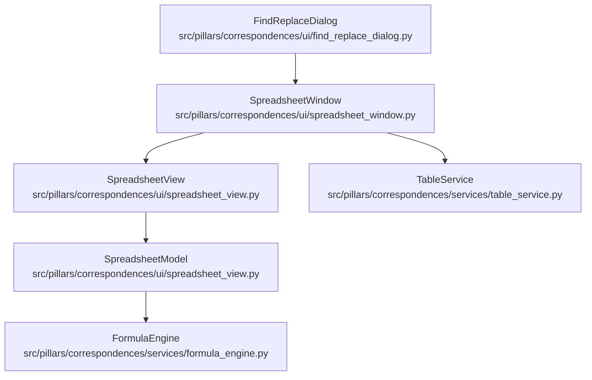
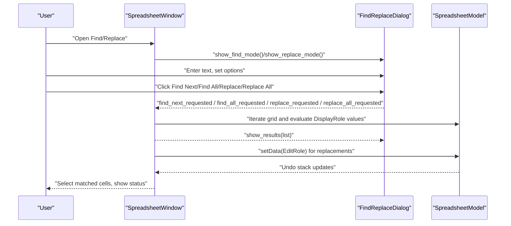
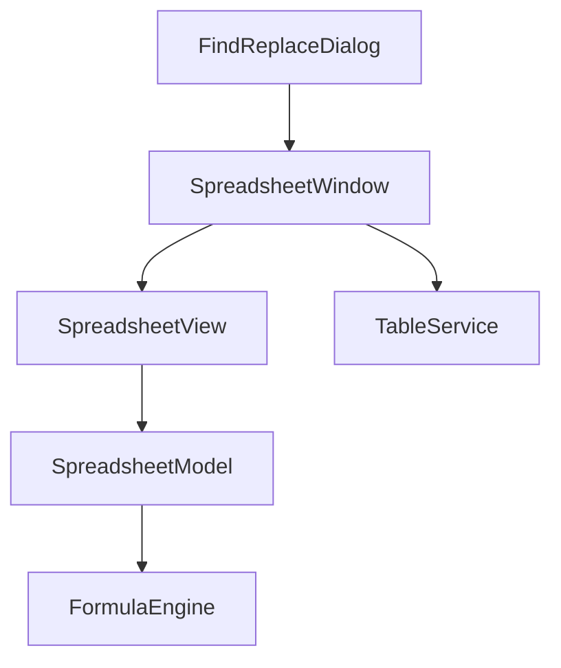

# Spreadsheet Find and Replace Functionality

<cite>
**Referenced Files in This Document**
- [find_replace_dialog.py](file://src/pillars/correspondences/ui/find_replace_dialog.py)
- [spreadsheet_window.py](file://src/pillars/correspondences/ui/spreadsheet_window.py)
- [spreadsheet_view.py](file://src/pillars/correspondences/ui/spreadsheet_view.py)
- [formula_engine.py](file://src/pillars/correspondences/services/formula_engine.py)
- [table_service.py](file://src/pillars/correspondences/services/table_service.py)
</cite>

## Table of Contents
1. [Introduction](#introduction)
2. [Project Structure](#project-structure)
3. [Core Components](#core-components)
4. [Architecture Overview](#architecture-overview)
5. [Detailed Component Analysis](#detailed-component-analysis)
6. [Dependency Analysis](#dependency-analysis)
7. [Performance Considerations](#performance-considerations)
8. [Troubleshooting Guide](#troubleshooting-guide)
9. [Conclusion](#conclusion)

## Introduction
This document explains the Spreadsheet Find and Replace functionality implemented in the “Emerald Tablet” spreadsheet UI. It covers how the find and replace dialogs integrate with the spreadsheet window and model, how matching and replacement are performed, and how the undo stack is used to support reversible operations. It also clarifies the supported matching modes and how results are presented to the user.

## Project Structure
The find and replace feature spans three primary areas:
- UI dialog for user input and options
- Spreadsheet window orchestrating find/replace logic and UI updates
- Spreadsheet model providing data access and undo support

**Diagram sources**
- [find_replace_dialog.py](file://src/pillars/correspondences/ui/find_replace_dialog.py#L1-L146)
- [spreadsheet_window.py](file://src/pillars/correspondences/ui/spreadsheet_window.py#L1188-L1386)
- [spreadsheet_view.py](file://src/pillars/correspondences/ui/spreadsheet_view.py#L1-L200)
- [formula_engine.py](file://src/pillars/correspondences/services/formula_engine.py#L1-L200)
- [table_service.py](file://src/pillars/correspondences/services/table_service.py#L1-L39)

**Section sources**
- [find_replace_dialog.py](file://src/pillars/correspondences/ui/find_replace_dialog.py#L1-L146)
- [spreadsheet_window.py](file://src/pillars/correspondences/ui/spreadsheet_window.py#L1188-L1386)
- [spreadsheet_view.py](file://src/pillars/correspondences/ui/spreadsheet_view.py#L1-L200)
- [formula_engine.py](file://src/pillars/correspondences/services/formula_engine.py#L1-L200)
- [table_service.py](file://src/pillars/correspondences/services/table_service.py#L1-L39)

## Core Components
- FindReplaceDialog: Provides the modal-like dialog with inputs for find/replace text, options checkboxes, buttons, and a results list. Emits signals for find/replace operations and navigation requests.
- SpreadsheetWindow: Owns the spreadsheet UI and implements find/replace logic. It connects dialog signals to handlers, iterates the grid to find matches, selects results, and performs replacements using the model’s undo stack.
- SpreadsheetModel: Supplies cell data and evaluation for matching, and applies edits via commands that push onto the undo stack.
- FormulaEngine: Used by the model to evaluate cell values; find/replace operates on the DisplayRole values returned by the model.
- TableService: Persists spreadsheet content to storage; not directly involved in find/replace, but used by the window for saving.

**Section sources**
- [find_replace_dialog.py](file://src/pillars/correspondences/ui/find_replace_dialog.py#L1-L146)
- [spreadsheet_window.py](file://src/pillars/correspondences/ui/spreadsheet_window.py#L1188-L1386)
- [spreadsheet_view.py](file://src/pillars/correspondences/ui/spreadsheet_view.py#L1-L200)
- [formula_engine.py](file://src/pillars/correspondences/services/formula_engine.py#L1-L200)
- [table_service.py](file://src/pillars/correspondences/services/table_service.py#L1-L39)

## Architecture Overview
The find/replace workflow is event-driven:
- The user opens the dialog from the SpreadsheetWindow toolbar.
- The dialog emits signals with the search text, replacement text, and options.
- The SpreadsheetWindow locates matches, updates the UI (selection and results list), and performs replacements via the model’s undo stack.

**Diagram sources**
- [spreadsheet_window.py](file://src/pillars/correspondences/ui/spreadsheet_window.py#L1188-L1386)
- [find_replace_dialog.py](file://src/pillars/correspondences/ui/find_replace_dialog.py#L1-L146)
- [spreadsheet_view.py](file://src/pillars/correspondences/ui/spreadsheet_view.py#L1-L200)

## Detailed Component Analysis

### FindReplaceDialog
Responsibilities:
- Presents inputs for find and replace text.
- Provides options: case sensitivity and match entire cell contents.
- Emits signals for find/replace operations and navigation.
- Displays results in a list with clickable entries.

Behavior highlights:
- Uses a non-modal dialog window with independent behavior.
- Exposes show_find_mode and show_replace_mode helpers to focus the appropriate input.
- Maintains a results list and hides it when empty.

**Section sources**
- [find_replace_dialog.py](file://src/pillars/correspondences/ui/find_replace_dialog.py#L1-L146)

### SpreadsheetWindow (Find/Replace Orchestrator)
Responsibilities:
- Launches the dialog and wires signals to handlers.
- Implements matching logic across the grid.
- Navigates to results and updates selection.
- Performs single and bulk replacements using the model’s undo stack.

Key methods:
- _launch_find_replace: Creates and connects the dialog, switching to find or replace mode.
- _on_navigate_to_result: Scrolls to and selects a matched cell.
- _find_matching_indexes: Iterates the grid in row-major order, yielding matching indices based on options.
- _on_find_next: Selects the next match after the current cell.
- _on_find_all: Builds a list of all matches, shows them in the dialog, and selects them in the grid.
- _on_replace: Checks if the current cell matches, replaces it, and moves to the next match.
- _on_replace_all: Bulk replacement across all matches, wrapped in a macro for undo.

Options supported:
- Case sensitive: toggles case-sensitive matching.
- Match entire cell contents: requires the entire cell value to equal the search text.

Matching behavior:
- Uses DisplayRole values from the model, which may be evaluated formulas.
- For “match entire”, compares equality; otherwise checks substring containment.
- For case-insensitive substring matching, uses a compiled regex with IGNORECASE.

Navigation:
- Clicking a result in the dialog triggers navigation to the matched index.

Undo support:
- Replace All wraps all edits in a single undo macro.
- Replace uses setData commands that push onto the undo stack.

**Section sources**
- [spreadsheet_window.py](file://src/pillars/correspondences/ui/spreadsheet_window.py#L1188-L1386)

### SpreadsheetModel (Data Access and Undo)
Responsibilities:
- Supplies cell data and evaluation for matching.
- Applies edits via SetCellDataCommand, pushing changes to the undo stack.
- Provides DisplayRole values that include formula evaluation and caching.

Notes:
- Find/replace operates on DisplayRole values, which may differ from raw EditRole values if formulas are present.
- The model caches formula evaluations to optimize performance during operations.

**Section sources**
- [spreadsheet_view.py](file://src/pillars/correspondences/ui/spreadsheet_view.py#L1-L200)

### FormulaEngine (Evaluation Context)
Responsibilities:
- Evaluates cell formulas and returns values used by the model for DisplayRole.
- Not directly involved in find/replace, but affects the values matched.

**Section sources**
- [formula_engine.py](file://src/pillars/correspondences/services/formula_engine.py#L1-L200)

### TableService (Persistence Context)
Responsibilities:
- Saves spreadsheet content to storage.
- Not directly involved in find/replace operations.

**Section sources**
- [table_service.py](file://src/pillars/correspondences/services/table_service.py#L1-L39)

## Dependency Analysis
High-level dependencies:
- FindReplaceDialog depends on PyQt6 widgets and signals.
- SpreadsheetWindow depends on SpreadsheetView and SpreadsheetModel, and exposes find/replace actions in the toolbar.
- SpreadsheetModel depends on FormulaEngine for value evaluation and on QUndoStack for undo support.
- TableService is used by the window to persist content.

**Diagram sources**
- [find_replace_dialog.py](file://src/pillars/correspondences/ui/find_replace_dialog.py#L1-L146)
- [spreadsheet_window.py](file://src/pillars/correspondences/ui/spreadsheet_window.py#L1188-L1386)
- [spreadsheet_view.py](file://src/pillars/correspondences/ui/spreadsheet_view.py#L1-L200)
- [formula_engine.py](file://src/pillars/correspondences/services/formula_engine.py#L1-L200)
- [table_service.py](file://src/pillars/correspondences/services/table_service.py#L1-L39)

**Section sources**
- [spreadsheet_window.py](file://src/pillars/correspondences/ui/spreadsheet_window.py#L1188-L1386)
- [spreadsheet_view.py](file://src/pillars/correspondences/ui/spreadsheet_view.py#L1-L200)

## Performance Considerations
- Grid iteration: Matching scans the entire grid in row-major order. For typical spreadsheet sizes (e.g., 100 rows × 26 columns), this is efficient.
- Evaluation cache: The model caches formula evaluations to avoid repeated computation during matching and replacement.
- Regex usage: Case-insensitive substring matching uses a compiled regex; this avoids repeated compilation overhead.
- Undo batching: Replace All is wrapped in a single macro to minimize undo stack growth and improve responsiveness.

[No sources needed since this section provides general guidance]

## Troubleshooting Guide
Common issues and resolutions:
- No results found:
  - Verify the search text is not empty.
  - Confirm options (case sensitive, match entire) are set appropriately.
  - Ensure the grid contains the expected values; remember that DisplayRole values may reflect formula evaluation.
- Replace does not occur:
  - For “match entire”, the entire cell content must equal the search text.
  - For case-insensitive substring, the replacement uses regex; confirm the expected behavior.
- Replace All appears slow:
  - Large grids or heavy formulas can impact performance. Consider disabling word wrap and reducing complex formulas temporarily.
- Undo not working:
  - Replace All uses a macro; ensure the operation completes. Replace uses individual commands; verify the undo stack is enabled.

**Section sources**
- [spreadsheet_window.py](file://src/pillars/correspondences/ui/spreadsheet_window.py#L1188-L1386)
- [spreadsheet_view.py](file://src/pillars/correspondences/ui/spreadsheet_view.py#L1-L200)

## Conclusion
The Spreadsheet Find and Replace feature integrates a lightweight dialog with robust matching and navigation. It supports case sensitivity and entire-cell matching, operates on evaluated DisplayRole values, and leverages the model’s undo stack for reversible edits. The implementation is straightforward, efficient for typical spreadsheets, and user-friendly with immediate selection and status feedback.