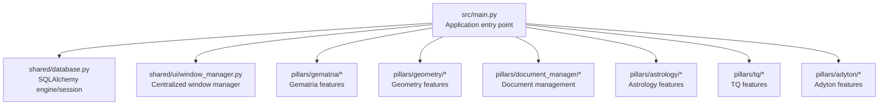
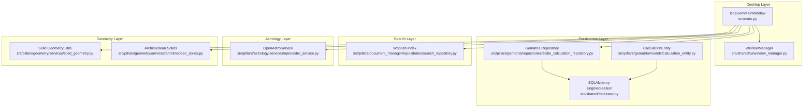
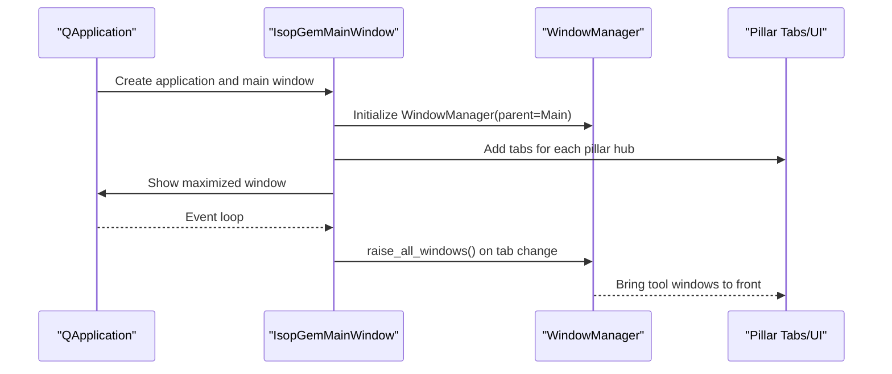
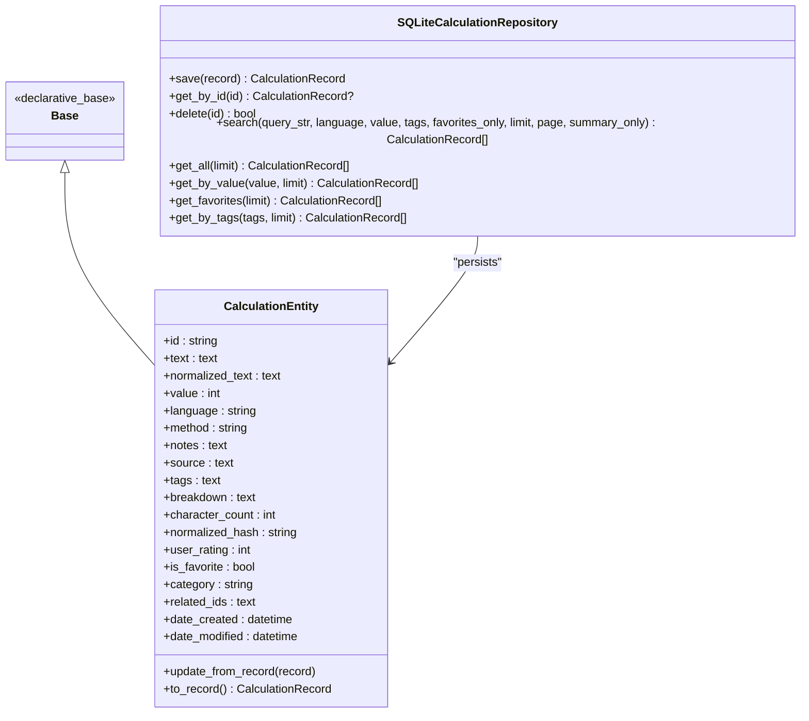
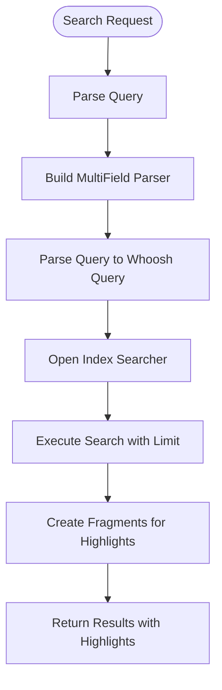
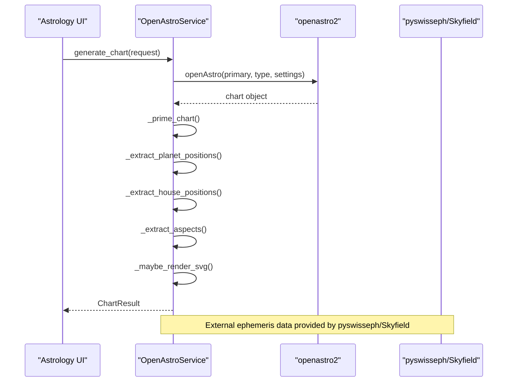
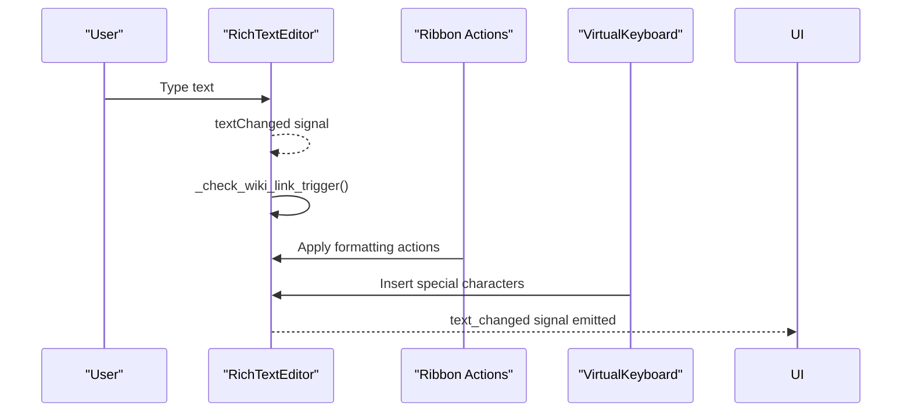
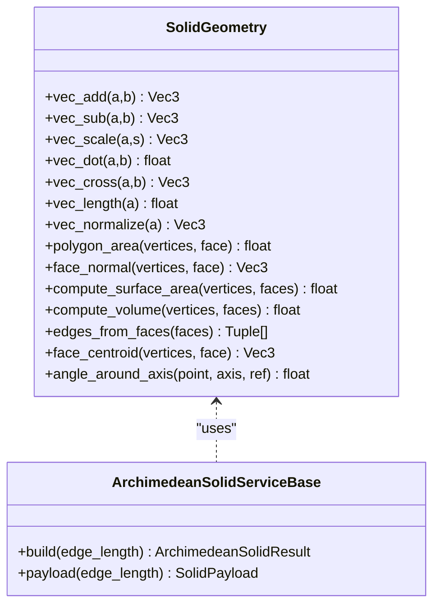
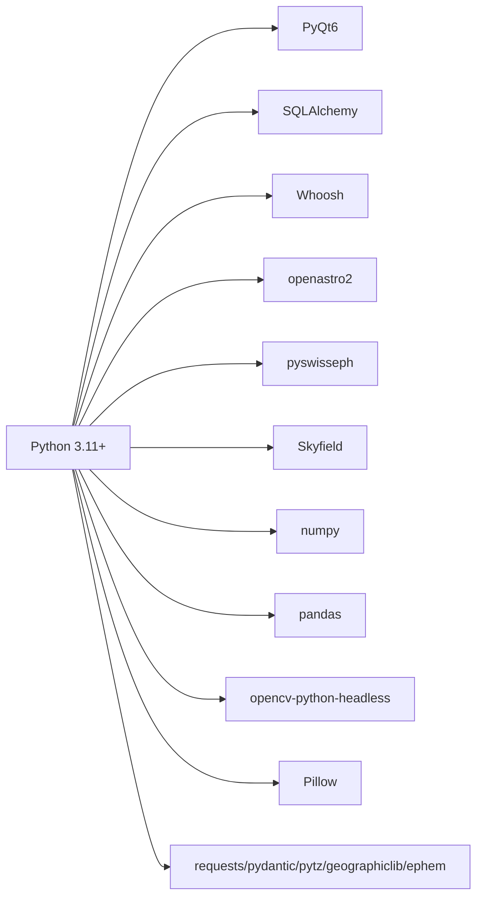

# Technology Stack & Dependencies

<cite>
**Referenced Files in This Document**
- [README.md](file://README.md)
- [requirements.txt](file://requirements.txt)
- [src/main.py](file://src/main.py)
- [src/shared/database.py](file://src/shared/database.py)
- [src/shared/ui/window_manager.py](file://src/shared/ui/window_manager.py)
- [src/pillars/gematria/repositories/sqlite_calculation_repository.py](file://src/pillars/gematria/repositories/sqlite_calculation_repository.py)
- [src/pillars/gematria/models/calculation_entity.py](file://src/pillars/gematria/models/calculation_entity.py)
- [src/pillars/astrology/services/openastro_service.py](file://src/pillars/astrology/services/openastro_service.py)
- [src/pillars/document_manager/repositories/search_repository.py](file://src/pillars/document_manager/repositories/search_repository.py)
- [src/pillars/document_manager/ui/rich_text_editor.py](file://src/pillars/document_manager/ui/rich_text_editor.py)
- [src/pillars/geometry/services/solid_geometry.py](file://src/pillars/geometry/services/solid_geometry.py)
- [src/pillars/geometry/services/archimedean_solids.py](file://src/pillars/geometry/services/archimedean_solids.py)
- [run.sh](file://run.sh)
</cite>

## Table of Contents
1. [Introduction](#introduction)
2. [Project Structure](#project-structure)
3. [Core Components](#core-components)
4. [Architecture Overview](#architecture-overview)
5. [Detailed Component Analysis](#detailed-component-analysis)
6. [Dependency Analysis](#dependency-analysis)
7. [Performance Considerations](#performance-considerations)
8. [Troubleshooting Guide](#troubleshooting-guide)
9. [Conclusion](#conclusion)

## Introduction
This section documents the technology stack and dependencies used by the isopgem desktop application. The project is built with Python 3.11+ and a cohesive set of libraries enabling a modern desktop experience: PyQt6 for UI, SQLAlchemy for ORM, Whoosh for full-text search, OpenAstro2 for astrology calculations, and pyswisseph for astronomical data. Supporting libraries such as numpy and pandas are used for data processing tasks. The document also covers environment setup, dependency management, deployment and packaging implications, integration points with external systems, and performance characteristics.

## Project Structure
The application follows a layered architecture with a shared foundation and pillar-based feature modules. The main entry point initializes the application, sets up the database, and composes the UI tabs for each pillar. Shared modules provide database connectivity and window management.

**Diagram sources**
- [src/main.py](file://src/main.py#L1-L156)
- [src/shared/database.py](file://src/shared/database.py#L1-L53)
- [src/shared/ui/window_manager.py](file://src/shared/ui/window_manager.py#L1-L221)

**Section sources**
- [src/main.py](file://src/main.py#L1-L156)
- [README.md](file://README.md#L53-L61)

## Core Components
- Language and UI: Python 3.11+ with PyQt6 for desktop UI, including a custom Window Manager for multi-window tooling and floating palettes.
- Data persistence: SQLAlchemy ORM backed by SQLite, with a shared engine and session factory.
- Full-text search: Whoosh index for hybrid metadata/content search.
- Astronomy: OpenAstro2 integration for high-precision chart computation, complemented by pyswisseph and Skyfield for ephemeris data.
- Data processing: numpy and pandas for numerical operations and tabular analytics.
- Application lifecycle: Environment variables and launch script ensure stable Qt platform behavior and consistent startup.

**Section sources**
- [README.md](file://README.md#L53-L61)
- [src/main.py](file://src/main.py#L1-L156)
- [src/shared/database.py](file://src/shared/database.py#L1-L53)
- [src/shared/ui/window_manager.py](file://src/shared/ui/window_manager.py#L1-L221)
- [requirements.txt](file://requirements.txt#L1-L40)

## Architecture Overview
The desktop application architecture centers on a main window composed of multiple “pillars,” each encapsulating models, services, repositories, and UI components. The shared database module initializes SQLite and provides sessions. The Window Manager coordinates tool windows across pillars. The astrology service wraps OpenAstro2 to isolate external dependencies and expose a clean API surface. The document manager integrates Whoosh for indexing and search. Geometry services implement mathematical utilities and Archimedean solid builders.

**Diagram sources**
- [src/main.py](file://src/main.py#L1-L156)
- [src/shared/ui/window_manager.py](file://src/shared/ui/window_manager.py#L1-L221)
- [src/shared/database.py](file://src/shared/database.py#L1-L53)
- [src/pillars/gematria/repositories/sqlite_calculation_repository.py](file://src/pillars/gematria/repositories/sqlite_calculation_repository.py#L1-L143)
- [src/pillars/gematria/models/calculation_entity.py](file://src/pillars/gematria/models/calculation_entity.py#L1-L92)
- [src/pillars/document_manager/repositories/search_repository.py](file://src/pillars/document_manager/repositories/search_repository.py#L1-L201)
- [src/pillars/astrology/services/openastro_service.py](file://src/pillars/astrology/services/openastro_service.py#L1-L254)
- [src/pillars/geometry/services/solid_geometry.py](file://src/pillars/geometry/services/solid_geometry.py#L1-L156)
- [src/pillars/geometry/services/archimedean_solids.py](file://src/pillars/geometry/services/archimedean_solids.py#L1-L406)

## Detailed Component Analysis

### PyQt6 Desktop Application and Window Management
- The main window composes tabs for each pillar and delegates tool window lifecycle to a central WindowManager.
- The WindowManager tracks active windows, supports raising all windows, and ensures proper closing semantics.
- The application enforces a full-screen startup and uses a stable Qt platform flag for Linux environments.

**Diagram sources**
- [src/main.py](file://src/main.py#L1-L156)
- [src/shared/ui/window_manager.py](file://src/shared/ui/window_manager.py#L1-L221)

**Section sources**
- [src/main.py](file://src/main.py#L1-L156)
- [src/shared/ui/window_manager.py](file://src/shared/ui/window_manager.py#L1-L221)
- [run.sh](file://run.sh#L1-L24)

### SQLAlchemy ORM and Repository Pattern
- A shared database module defines a declarative Base, SQLite engine, and session factory.
- The gematria repository demonstrates a classic repository pattern with SQLAlchemy ORM, including CRUD operations and search filters.
- The CalculationEntity model maps to a SQLite table with indexed fields for efficient querying.

**Diagram sources**
- [src/shared/database.py](file://src/shared/database.py#L1-L53)
- [src/pillars/gematria/models/calculation_entity.py](file://src/pillars/gematria/models/calculation_entity.py#L1-L92)
- [src/pillars/gematria/repositories/sqlite_calculation_repository.py](file://src/pillars/gematria/repositories/sqlite_calculation_repository.py#L1-L143)

**Section sources**
- [src/shared/database.py](file://src/shared/database.py#L1-L53)
- [src/pillars/gematria/models/calculation_entity.py](file://src/pillars/gematria/models/calculation_entity.py#L1-L92)
- [src/pillars/gematria/repositories/sqlite_calculation_repository.py](file://src/pillars/gematria/repositories/sqlite_calculation_repository.py#L1-L143)

### Full-Text Search with Whoosh
- The document manager’s search repository builds a Whoosh index schema with stemming and keyword fields.
- It supports indexing, searching, and rebuilding the index, integrating with the document model.

**Diagram sources**
- [src/pillars/document_manager/repositories/search_repository.py](file://src/pillars/document_manager/repositories/search_repository.py#L1-L201)

**Section sources**
- [src/pillars/document_manager/repositories/search_repository.py](file://src/pillars/document_manager/repositories/search_repository.py#L1-L201)

### OpenAstro2 and pyswisseph Integration
- The astrology service wraps OpenAstro2, exposing a clean API for chart generation and isolating import-time failures.
- It extracts planets, houses, aspects, and optional SVG rendering, while handling default settings and error propagation.

**Diagram sources**
- [src/pillars/astrology/services/openastro_service.py](file://src/pillars/astrology/services/openastro_service.py#L1-L254)

**Section sources**
- [src/pillars/astrology/services/openastro_service.py](file://src/pillars/astrology/services/openastro_service.py#L1-L254)

### Data Processing with numpy and pandas
- numpy and pandas are included for numerical computing and tabular analytics. While direct usage is not shown in the referenced files, they support data-driven features across pillars (e.g., statistics, transformations, and visualization-ready datasets).
- The presence of opencv-python-headless indicates potential image processing workflows.

**Section sources**
- [requirements.txt](file://requirements.txt#L15-L20)

### Desktop UI Patterns: Signals, Slots, and Rich Text Editing
- PyQt6 signals/slots are used extensively in UI components. For example, the rich text editor emits a signal on text changes and triggers wiki link detection.
- The editor integrates ribbon-style actions and context menus, demonstrating a modular UI composition pattern.

**Diagram sources**
- [src/pillars/document_manager/ui/rich_text_editor.py](file://src/pillars/document_manager/ui/rich_text_editor.py#L1-L561)

**Section sources**
- [src/pillars/document_manager/ui/rich_text_editor.py](file://src/pillars/document_manager/ui/rich_text_editor.py#L1-L561)

### Geometry Services and Mathematical Utilities
- Geometry services implement vector math and solid geometry computations, including surface area and volume calculations.
- Archimedean solids are generated from canonical definitions and scaled uniformly, with metadata and payloads for visualization.

**Diagram sources**
- [src/pillars/geometry/services/solid_geometry.py](file://src/pillars/geometry/services/solid_geometry.py#L1-L156)
- [src/pillars/geometry/services/archimedean_solids.py](file://src/pillars/geometry/services/archimedean_solids.py#L1-L406)

**Section sources**
- [src/pillars/geometry/services/solid_geometry.py](file://src/pillars/geometry/services/solid_geometry.py#L1-L156)
- [src/pillars/geometry/services/archimedean_solids.py](file://src/pillars/geometry/services/archimedean_solids.py#L1-L406)

## Dependency Analysis
The project’s dependencies are declared in requirements.txt and enforced by the README’s installation steps. The key categories include:
- Core UI and persistence: PyQt6, SQLAlchemy
- Search: Whoosh
- Astronomy: openastro2, pyswisseph, Skyfield
- Data processing: numpy, pandas, opencv-python-headless, Pillow
- Utilities: requests, pydantic, pytz, geographiclib, ephem

**Diagram sources**
- [requirements.txt](file://requirements.txt#L1-L40)
- [README.md](file://README.md#L53-L61)

**Section sources**
- [requirements.txt](file://requirements.txt#L1-L40)
- [README.md](file://README.md#L53-L61)

## Performance Considerations
- Database operations: SQLAlchemy sessions are scoped per operation with commit/rollback semantics; ensure transactions are kept short to minimize contention.
- Search index: Whoosh indexing uses a schema with stemming and keyword fields; batch writes reduce overhead when indexing multiple documents.
- UI responsiveness: PyQt6 signals/slots and a central window manager help keep tool windows responsive; avoid long-running operations on the main thread.
- Numerical computations: numpy and pandas enable vectorized operations; cache intermediate results where appropriate.
- Astronomy calculations: OpenAstro2 and pyswisseph/Skyfield offload heavy computations; precompute and cache frequently accessed chart data.

[No sources needed since this section provides general guidance]

## Troubleshooting Guide
- Missing dependencies: The astrology service raises a specific error when openastro2 is unavailable. Ensure the dependency is installed as indicated in requirements.
- Qt platform issues: The application sets a stable platform flag for Linux; if Wayland-related issues persist, verify environment configuration.
- Database initialization: The database is initialized on startup; confirm the data directory exists and is writable.
- Search index corruption: The search repository detects schema mismatches and can rebuild the index; use the rebuild method when encountering unexpected behavior.

**Section sources**
- [src/pillars/astrology/services/openastro_service.py](file://src/pillars/astrology/services/openastro_service.py#L1-L254)
- [run.sh](file://run.sh#L1-L24)
- [src/shared/database.py](file://src/shared/database.py#L1-L53)
- [src/pillars/document_manager/repositories/search_repository.py](file://src/pillars/document_manager/repositories/search_repository.py#L1-L201)

## Conclusion
The isopgem technology stack combines a modern PyQt6 desktop UI with robust backend libraries for persistence, search, and scientific computation. The architecture emphasizes modularity through shared database and window management, clear separation of concerns in the repository/service layers, and disciplined integration with external systems like OpenAstro2 and pyswisseph. Following the environment setup and dependency management guidance ensures a smooth developer and user experience, with clear pathways for deployment and packaging.