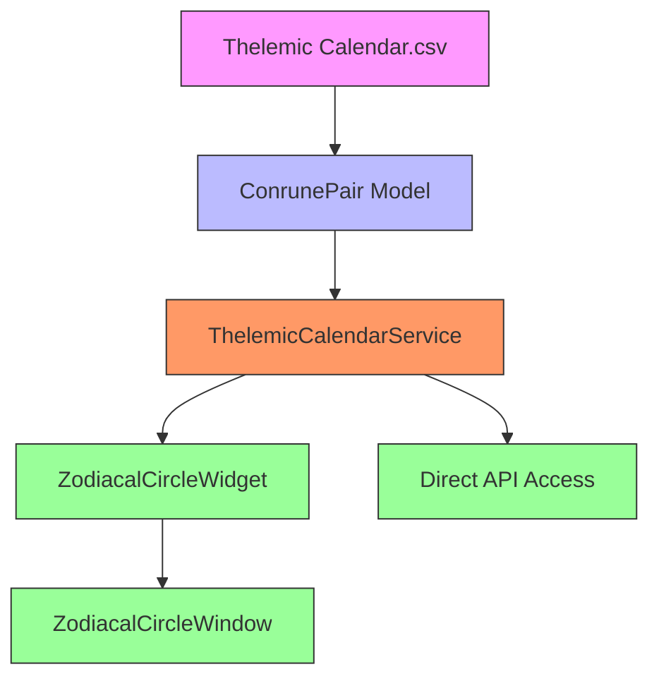
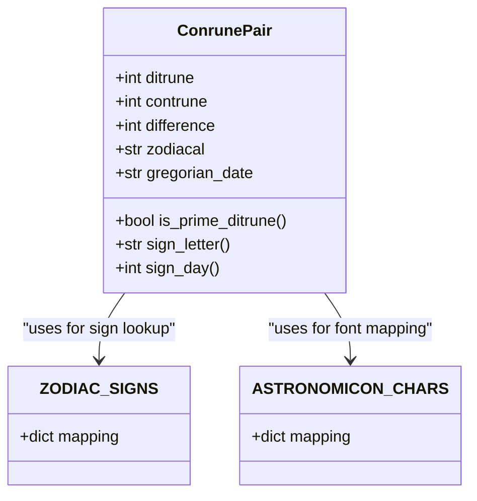
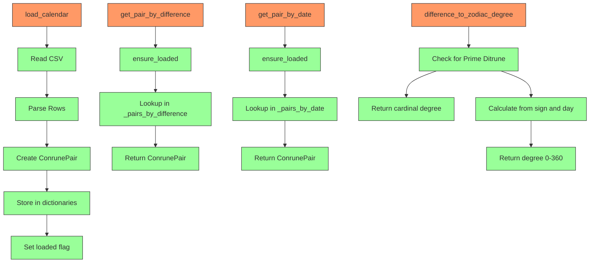
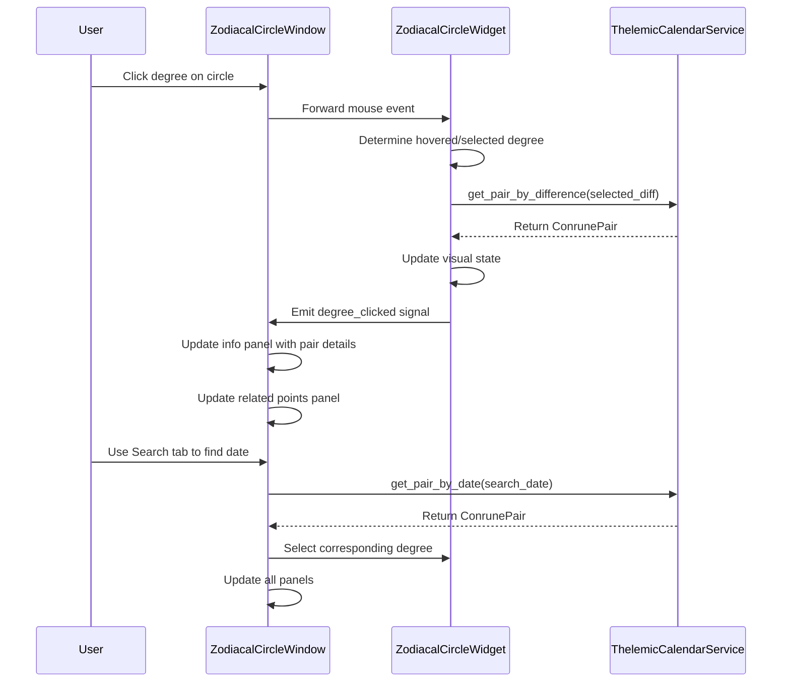

# Thelemic Calendar

<cite>
**Referenced Files in This Document**   
- [thelemic_calendar_models.py](file://src/shared/models/time/thelemic_calendar_models.py)
- [thelemic_calendar_service.py](file://src/shared/services/time/thelemic_calendar_service.py)
- [zodiacal_circle_widget.py](file://src/pillars/time_mechanics/ui/zodiacal_circle_widget.py)
- [zodiacal_circle_window.py](file://src/pillars/time_mechanics/ui/zodiacal_circle_window.py)
- [time_mechanics_hub.py](file://src/pillars/time_mechanics/ui/time_mechanics_hub.py)
- [Thelemic Calendar.csv](file://Docs/time_mechanics/Thelemic Calendar.csv)
</cite>

## Table of Contents
1. [Introduction](#introduction)
2. [Core Components](#core-components)
3. [Architecture Overview](#architecture-overview)
4. [Detailed Component Analysis](#detailed-component-analysis)
5. [Performance Considerations](#performance-considerations)
6. [Troubleshooting Guide](#troubleshooting-guide)
7. [Conclusion](#conclusion)

## Introduction
The Thelemic Calendar system is a sophisticated temporal framework that maps 364 days to Ditrune/Contrune pairs with zodiacal positions, forming the foundation for the Zodiacal Circle visualization and time mechanics within the application. This system integrates mathematical, astronomical, and symbolic elements to create a comprehensive timekeeping mechanism that supports various esoteric calculations and visualizations. The calendar serves as a bridge between Gregorian dates and a symbolic system of Conrune pairs, where each day is represented by a unique combination of Ditrune (day-aspect) and Contrune (night-aspect) values, with their difference determining the degree position in the Zodiacal Circle.

## Core Components
The Thelemic Calendar system consists of several core components that work together to provide calendar functionality. The ConrunePair data model represents a single day's Conrune pair with properties for Ditrune, Contrune, difference, zodiacal position, and Gregorian date, including methods to determine if a pair is a Prime Ditrune Set (intercalary days). The ThelemicCalendarService class provides the primary interface for accessing calendar data, offering methods to load the calendar from CSV, retrieve pairs by difference or date, and perform conversions between zodiacal degrees and difference values. The service maintains internal dictionaries for efficient lookups and ensures data is loaded before operations are performed.

**Section sources**
- [thelemic_calendar_models.py](file://src/shared/models/time/thelemic_calendar_models.py#L11-L81)
- [thelemic_calendar_service.py](file://src/shared/services/time/thelemic_calendar_service.py#L17-L299)

## Architecture Overview
The Thelemic Calendar system follows a layered architecture with clear separation of concerns. At the foundation is the data layer, represented by the Thelemic Calendar.csv file which contains the complete calendar data with Ditrune, Contrune, Difference, Zodiacal, and Day columns. Above this is the model layer, implemented in thelemic_calendar_models.py, which defines the ConrunePair data structure and related constants. The service layer, implemented in thelemic_calendar_service.py, provides business logic for loading, querying, and transforming calendar data. Finally, the presentation layer consists of UI components like ZodiacalCircleWidget and ZodiacalCircleWindow that visualize the calendar data and provide user interaction. This architecture enables efficient data access while supporting rich visualizations and user interactions.

**Diagram sources **
- [Thelemic Calendar.csv](file://Docs/time_mechanics/Thelemic Calendar.csv)
- [thelemic_calendar_models.py](file://src/shared/models/time/thelemic_calendar_models.py)
- [thelemic_calendar_service.py](file://src/shared/services/time/thelemic_calendar_service.py)
- [zodiacal_circle_widget.py](file://src/pillars/time_mechanics/ui/zodiacal_circle_widget.py)
- [zodiacal_circle_window.py](file://src/pillars/time_mechanics/ui/zodiacal_circle_window.py)

## Detailed Component Analysis

### Data Model Analysis
The ConrunePair class is a dataclass that represents a single day in the Thelemic Calendar system. It contains five essential fields: ditrune (day-aspect value), contrune (night-aspect value), difference (tension between day and night that determines degree position), zodiacal (sign and day or "XXXX" for intercalary days), and gregorian_date (Gregorian date in "21-Mar" format). The class includes several computed properties that enhance its functionality: is_prime_ditrune determines if the pair represents one of the four intercalary days, sign_letter extracts the zodiac sign letter (A-L), and sign_day extracts the day within the sign (0-29). These properties enable rich interactions with the calendar data without requiring external processing.

**Diagram sources **
- [thelemic_calendar_models.py](file://src/shared/models/time/thelemic_calendar_models.py#L11-L81)

### Service Layer Analysis
The ThelemicCalendarService class provides comprehensive functionality for accessing and manipulating Thelemic Calendar data. The service follows a singleton-like pattern with lazy loading, ensuring the calendar data is loaded only when needed. Key methods include load_calendar for loading data from CSV, get_pair_by_difference for retrieving pairs by degree position (1-364), get_pair_by_date for retrieving pairs by Gregorian date, and get_all_pairs for accessing all calendar entries. The service also provides specialized methods like get_prime_ditrune_pairs to retrieve the four intercalary days and search_by_value for finding pairs matching specific Ditrune, Contrune, or difference values. Two important conversion methods, difference_to_zodiac_degree and zodiac_degree_to_difference, enable bidirectional translation between calendar differences and zodiacal degrees (0-360), accounting for the four intercalary positions at cardinal points.

**Diagram sources **
- [thelemic_calendar_service.py](file://src/shared/services/time/thelemic_calendar_service.py#L17-L299)

### User Interface Analysis
The Zodiacal Circle visualization is implemented through two primary components: ZodiacalCircleWidget and ZodiacalCircleWindow. The widget provides the core circular visualization with interactive degree selection, while the window wraps this with a comprehensive UI including information panels, search functionality, and export options. The widget uses QPainter to render a 360-degree circle with zodiac signs displayed using the Astronomicon font, degree markers, and interactive hitboxes for each degree. It supports multiple visualization modes including relationship lines based on divisors of 360 (representing astrological aspects) and reversal pair lines. The window component adds a tabbed interface with Info, Search, and Options tabs, allowing users to explore calendar data, jump to specific dates, and export information to other components like the Emerald Tablet.

**Diagram sources **
- [zodiacal_circle_widget.py](file://src/pillars/time_mechanics/ui/zodiacal_circle_widget.py#L29-L618)
- [zodiacal_circle_window.py](file://src/pillars/time_mechanics/ui/zodiacal_circle_window.py#L25-L839)

## Performance Considerations
The Thelemic Calendar system is designed with performance in mind, particularly for data access operations. The ThelemicCalendarService loads the entire calendar into memory during initialization, creating hash maps for O(1) lookups by difference and date. This approach trades memory usage for fast access times, which is appropriate given the relatively small size of the dataset (364 entries). The service uses lazy loading with the ensure_loaded method, preventing unnecessary file I/O until the data is actually needed. For the visualization components, the ZodiacalCircleWidget pre-calculates hitboxes for all degrees during each paint operation, ensuring responsive interaction. The system avoids redundant calculations by caching frequently accessed data and using efficient data structures for lookups.

## Troubleshooting Guide
When working with the Thelemic Calendar system, several common issues may arise. If calendar data fails to load, verify that the Thelemic Calendar.csv file exists in the Docs/time_mechanics directory and is properly formatted with the required columns. Check the console output for warning messages from the load_calendar method. For display issues in the Zodiacal Circle, ensure the Astronomicon font is available in the system's font database, as the visualization relies on this font for zodiac symbols. If degree selection is not working correctly, verify that the hitbox calculations in the ZodiacalCircleWidget are functioning properly and that the coordinate transformations between screen space and degree positions are accurate. When performing date conversions, ensure that Gregorian dates are formatted correctly (e.g., "21-Mar", "1-Apr") to match the format used in the CSV data.

**Section sources**
- [thelemic_calendar_service.py](file://src/shared/services/time/thelemic_calendar_service.py#L37-L96)
- [zodiacal_circle_widget.py](file://src/pillars/time_mechanics/ui/zodiacal_circle_widget.py#L112-L130)

## Conclusion
The Thelemic Calendar system represents a sophisticated integration of calendrical, mathematical, and symbolic systems within the application. By mapping 364 days to Ditrune/Contrune pairs with zodiacal positions, it creates a rich temporal framework that supports both practical date calculations and esoteric interpretations. The system's architecture demonstrates good software engineering practices with clear separation of concerns between data, model, service, and presentation layers. The implementation efficiently handles data access through in-memory caching and provides an intuitive visualization through the interactive Zodiacal Circle. This system serves as a foundational component for time-related functionality in the application, enabling various temporal analyses and providing a bridge between conventional timekeeping and symbolic interpretations.