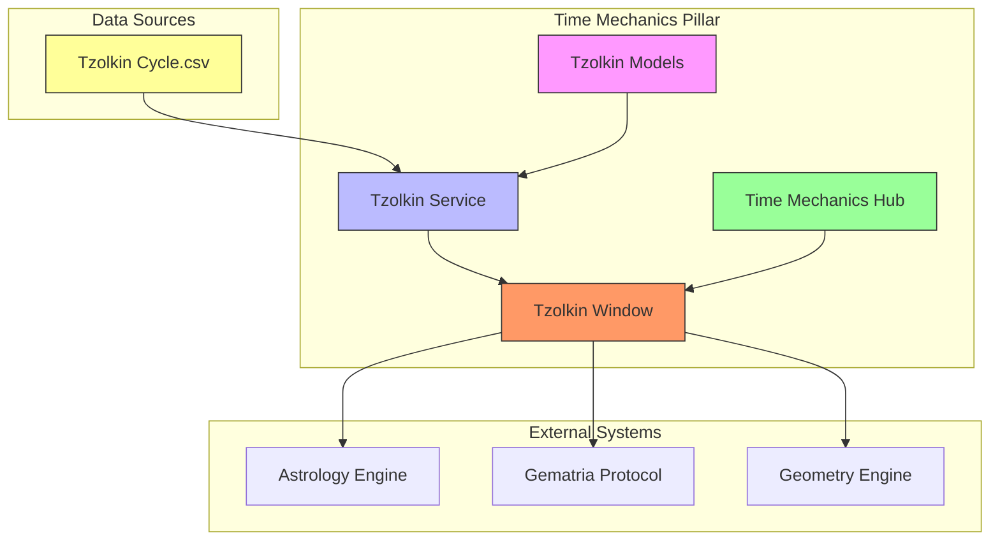
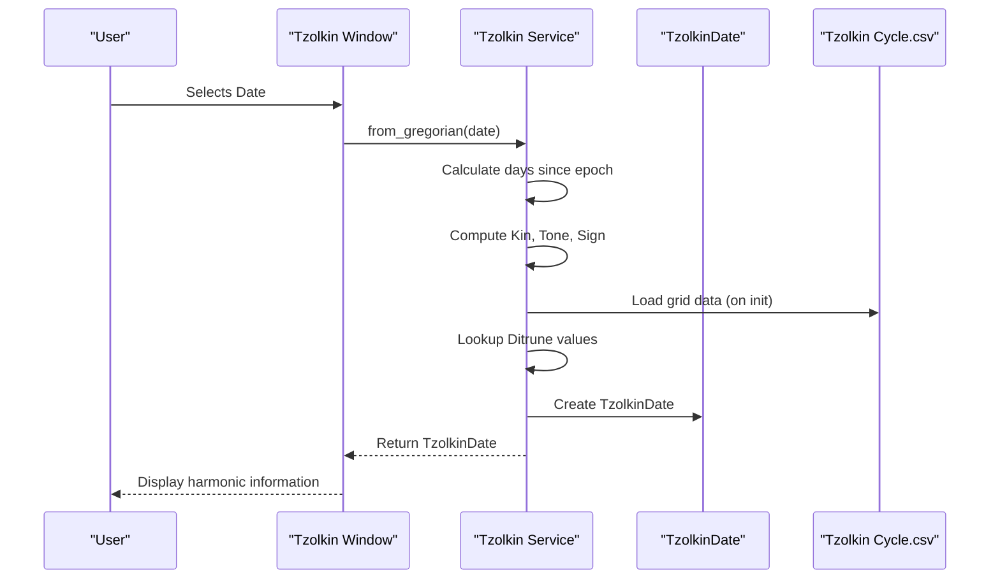
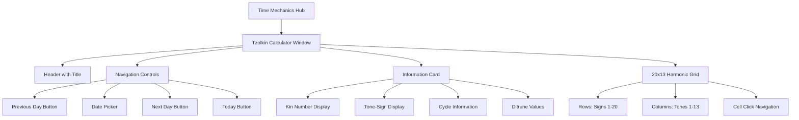

# Tzolkin Cycle

<cite>
**Referenced Files in This Document**   
- [tzolkin_models.py](file://src/pillars/time_mechanics/models/tzolkin_models.py)
- [tzolkin_service.py](file://src/pillars/time_mechanics/services/tzolkin_service.py)
- [tzolkin_window.py](file://src/pillars/time_mechanics/ui/tzolkin_window.py)
- [time_mechanics_hub.py](file://src/pillars/time_mechanics/ui/time_mechanics_hub.py)
- [Tzolkin Cycle.csv](file://Docs/time_mechanics/Tzolkin Cycle.csv)
- [rite_of_tzolkin.py](file://tests/rituals/rite_of_tzolkin.py)
- [verify_tzolkin.py](file://scripts/verify_tzolkin.py)
- [thelemic_calendar_models.py](file://src/shared/models/time/thelemic_calendar_models.py)
- [EXPLANATION.md](file://wiki/02_pillars/time_mechanics/EXPLANATION.md)
</cite>

## Table of Contents
1. [Introduction](#introduction)
2. [Core Architecture](#core-architecture)
3. [Tzolkin Cycle Data Structure](#tzolkin-cycle-data-structure)
4. [Service Layer Implementation](#service-layer-implementation)
5. [User Interface Components](#user-interface-components)
6. [Mathematical Foundations](#mathematical-foundations)
7. [Verification and Testing](#verification-and-testing)
8. [Integration with Other Systems](#integration-with-other-systems)
9. [Conclusion](#conclusion)

## Introduction

The Tzolkin Cycle in the IsopGem platform represents a 260-day harmonic time system that serves as a filter for temporal resonance, specifically tuned to the frequency of 133 (the Mercury Current). This implementation extends beyond the traditional Mayan calendar by incorporating a trigrammic structure that maps each day to a unique Ditrune - a 6-digit ternary number that encodes the harmonic quality of time. The system is anchored to a specific epoch date of January 12, 2020, which corresponds to Kin 1, Cycle 1.

The Tzolkin Cycle functions as part of the Time Mechanics pillar, one of the Sovereign Domains within the IsopGem architecture. Unlike the Astrology Engine which calculates planetary positions, the Time Mechanics pillar interprets the harmonic quality of time itself, providing a complementary layer of temporal analysis. The system integrates sacred geometry, numerology, and astronomical cycles into a unified framework for esoteric research.

**Section sources**
- [EXPLANATION.md](file://wiki/02_pillars/time_mechanics/EXPLANATION.md#L1-L71)
- [README.md](file://README.md#L1-L155)

## Core Architecture

The Tzolkin Cycle implementation follows the Sovereign Pillar architecture that governs the entire IsopGem platform. This architectural pattern ensures strict separation between domains, preventing entanglement between different esoteric systems. The Tzolkin functionality is contained within the Time Mechanics pillar, which communicates with other pillars through defined interfaces rather than direct imports.

The architecture follows a clean separation of concerns with three distinct layers: models, services, and user interface components. The models define the data structures, the services contain the business logic and calculations, and the UI components provide user interaction. This separation ensures that the core mathematical logic remains independent of presentation concerns.

The system is designed with extensibility in mind, allowing for future integration with other temporal systems such as the Thelemic calendar and various esoteric timekeeping methods. The modular design enables researchers to explore harmonic relationships between different calendrical systems without compromising the integrity of each individual system.



**Diagram sources**
- [tzolkin_models.py](file://src/pillars/time_mechanics/models/tzolkin_models.py#L1-L25)
- [tzolkin_service.py](file://src/pillars/time_mechanics/services/tzolkin_service.py#L1-L181)
- [tzolkin_window.py](file://src/pillars/time_mechanics/ui/tzolkin_window.py#L1-L270)
- [time_mechanics_hub.py](file://src/pillars/time_mechanics/ui/time_mechanics_hub.py#L1-L111)

**Section sources**
- [README.md](file://README.md#L78-L97)
- [EXPLANATION.md](file://wiki/02_pillars/time_mechanics/EXPLANATION.md#L1-L71)

## Tzolkin Cycle Data Structure

The core data structure of the Tzolkin system is the TzolkinDate, an immutable dataclass that represents a date within the 260-day harmonic cycle. This structure captures multiple dimensions of temporal information, transforming a simple Gregorian date into a rich harmonic signature.

The TzolkinDate model contains several key properties: the original Gregorian date, the Kin number (1-260), the tone (1-13), the sign (1-20), the sign name, the cycle count since the epoch, and the Ditrune values in both decimal and ternary formats. The immutability of this dataclass ensures that once a Tzolkin date is calculated, it cannot be altered, preserving the integrity of the temporal calculation.

The sign names follow the traditional Maya nomenclature (Imix, Ik, Akbal, etc.), providing continuity with historical systems while allowing for potential mapping to Thelemic equivalents in future implementations. The cycle property tracks the number of complete 260-day cycles since the epoch date, enabling long-term harmonic analysis across multiple years.

```mermaid
classDiagram
class TzolkinDate {
+gregorian_date : date
+kin : int
+tone : int
+sign : int
+sign_name : str
+cycle : int
+ditrune_decimal : int
+ditrune_ternary : str
+__repr__() : str
}
note right of TzolkinDate
Immutable dataclass representing
a date in the 260-day Tzolkin cycle.
Frozen to prevent modification
after creation.
end note
```

**Diagram sources**
- [tzolkin_models.py](file://src/pillars/time_mechanics/models/tzolkin_models.py#L8-L25)

**Section sources**
- [tzolkin_models.py](file://src/pillars/time_mechanics/models/tzolkin_models.py#L1-L25)

## Service Layer Implementation

The TzolkinService class serves as the sovereign service for all Tzolkin calculations, implementing the core business logic for converting Gregorian dates to their harmonic equivalents. This service is responsible for loading the Tzolkin Cycle data from the CSV file, performing date calculations, and providing access to the Ditrune mapping system.

The service initializes by loading the Tzolkin Cycle.csv file, which contains two grids: a 20x13 matrix of decimal values and a corresponding matrix of ternary representations. These grids are stored in memory as _decimal_grid and _ternary_grid, allowing for efficient lookup during calculations. The service handles file path resolution and includes error logging for cases where the data file is missing or corrupted.

The primary method, from_gregorian, converts a standard Gregorian date to a TzolkinDate by calculating the number of days elapsed since the epoch (January 12, 2020). This delta is used to determine the Kin number through modulo 260 arithmetic, ensuring the cyclical nature of the system. The tone and sign are derived from the Kin number using standard Tzolkin calculations (modulo 13 and modulo 20 respectively).

Additional utility methods include get_conrune, which calculates the "Anti-Self" or opposing force by inverting the Ditrune (swapping 1s and 2s while leaving 0s unchanged), and get_trigrams, which splits the 6-digit Ditrune into upper and lower trigrams for further analysis.



**Diagram sources**
- [tzolkin_service.py](file://src/pillars/time_mechanics/services/tzolkin_service.py#L14-L181)

**Section sources**
- [tzolkin_service.py](file://src/pillars/time_mechanics/services/tzolkin_service.py#L1-L181)

## User Interface Components

The user interface for the Tzolkin system consists of multiple components that provide different levels of interaction with the harmonic cycle. The primary interface is the TzolkinCalculatorWindow, which presents a comprehensive view of the 20x13 grid and allows users to navigate through the cycle.

The TzolkinCalculatorWindow features a dual-panel layout with an information card on the left and the harmonic grid on the right. The information card displays the current date's Kin number, tone-sign combination, cycle information, and Ditrune values. The grid visualization presents the 260 cells as a 20x13 table, with each cell containing the decimal Ditrune value. Users can click on any cell to navigate to that specific Kin, enabling exploration of harmonic relationships.

Navigation controls include previous/next day buttons, a date picker, and a "Today" button for quick access to the current date. The interface is designed to highlight the current position within the cycle, with visual feedback when cells are selected. The window is launched through the TimeMechanicsHub, which serves as the entry point for all temporal tools within the platform.



**Diagram sources**
- [tzolkin_window.py](file://src/pillars/time_mechanics/ui/tzolkin_window.py#L15-L270)
- [time_mechanics_hub.py](file://src/pillars/time_mechanics/ui/time_mechanics_hub.py#L8-L111)

**Section sources**
- [tzolkin_window.py](file://src/pillars/time_mechanics/ui/tzolkin_window.py#L1-L270)
- [time_mechanics_hub.py](file://src/pillars/time_mechanics/ui/time_mechanics_hub.py#L1-L111)

## Mathematical Foundations

The Tzolkin Cycle is grounded in a sophisticated mathematical framework that connects the 260-day cycle to the number 133, representing the Mercury Current. The entire system is designed to resonate with this harmonic frequency, creating a filter for temporal analysis that aligns with mercurial energies.

The sum of all 260 Ditrune values in the cycle is 82,992, which is precisely 624 times 133 (82,992 = 624 × 133). This mathematical relationship establishes the fundamental harmonic connection between the Tzolkin cycle and the Mercury frequency. Further astronomical correlations include the orbital period of Mercury (approximately 87.969 days), where 45 Tzolkin cycles (11,700 days) divided by 133 equals the orbital period, and the rotational period of Mercury (approximately 58.646 days), where 30 Tzolkin cycles divided by 133 equals the rotational period.

The grid structure itself follows specific construction logic: the 20 rows represent zodiacal or elemental signs derived from zodiacal trigrams ordered by decreasing difference value, while the 13 columns represent the tones. The columns are balanced to maintain yang trigrams on one half and yin trigrams on the other, preserving the harmonic equilibrium of the system.

**Section sources**
- [EXPLANATION.md](file://wiki/02_pillars/time_mechanics/EXPLANATION.md#L40-L51)
- [verify_tzolkin.py](file://scripts/verify_tzolkin.py#L1-L32)

## Verification and Testing

The Tzolkin system includes comprehensive verification mechanisms to ensure the accuracy and integrity of its calculations. The rite_of_tzolkin.py test script performs multiple validation checks on the core functionality, serving as a ritual of confirmation for the system's correctness.

Key test cases include verifying that the epoch date (January 12, 2020) correctly resolves to Kin 1, Cycle 1; confirming that one day after the epoch produces Kin 2; validating that 260 days after the epoch returns to Kin 1 but in Cycle 2; checking that Ditrune values are properly loaded and non-zero; and ensuring that dates before the epoch correctly calculate with negative cycle numbers (e.g., January 11, 2020 is Kin 260, Cycle 0).

Additionally, the verify_tzolkin.py script validates the mathematical integrity of the Tzolkin Cycle.csv data by calculating the sum of all decimal values and confirming it equals 82,992, the expected value that demonstrates resonance with the 133 frequency. This external verification ensures that the data file has not been corrupted and maintains its harmonic properties.

**Section sources**
- [rite_of_tzolkin.py](file://tests/rituals/rite_of_tzolkin.py#L1-L79)
- [verify_tzolkin.py](file://scripts/verify_tzolkin.py#L1-L32)

## Integration with Other Systems

The Tzolkin Cycle is designed to integrate with other components of the IsopGem platform, particularly the Astrology Engine and the Emerald Tablet correspondence database. While currently implemented as a standalone temporal system, the architecture allows for future integration where the Tzolkin radical for a given date can be used alongside standard planetary positions for harmonic analysis.

The shared models in the time module, particularly the ConrunePair class, provide a bridge between the Tzolkin system and the Thelemic calendar. These models define the structure for conrune pairs that map 364 days to ditrune/contrune pairs with zodiacal positions, enabling synchronization between different calendrical systems.

The system's design遵循 the platform's strict separation of concerns, with integration occurring through defined interfaces rather than direct dependencies. This approach ensures that each esoteric system maintains its integrity while allowing researchers to explore the resonances between different domains of knowledge.

**Section sources**
- [thelemic_calendar_models.py](file://src/shared/models/time/thelemic_calendar_models.py#L1-L81)
- [EXPLANATION.md](file://wiki/02_pillars/time_mechanics/EXPLANATION.md#L70-L71)

## Conclusion

The Tzolkin Cycle implementation in IsopGem represents a sophisticated integration of ancient calendrical systems with modern computational methods. By anchoring the 260-day harmonic cycle to a specific epoch and enriching it with Ditrune mappings, the system provides a powerful tool for temporal analysis that resonates with the frequency of 133.

The architecture demonstrates the platform's commitment to the Sovereign Pillar doctrine, maintaining clear boundaries between different esoteric domains while providing pathways for meaningful integration. The combination of rigorous mathematical foundations, comprehensive testing, and intuitive user interfaces creates a robust system for exploring the harmonic qualities of time.

Future development opportunities include deeper integration with the Astrology Engine for combined planetary and harmonic analysis, expansion of the correspondence database to include Tzolkin-specific mappings, and enhanced visualization tools for exploring long-term cyclical patterns. The Tzolkin Cycle stands as a testament to the platform's ability to synthesize traditional wisdom with contemporary technology in the pursuit of esoteric understanding.