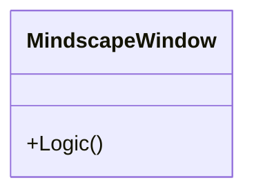
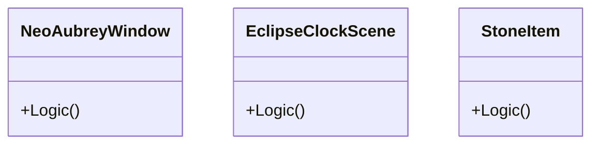
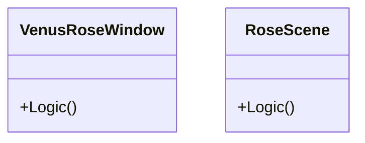

# source_documentation.md

Architectural Analysis of `src` directory.

## Chart

### chart.svg
**Path**: `src/Chart/chart.svg`

**Summary**: Non-Python file. Size: 137529 bytes

---

## calculators

### __init__.py
**Path**: `src/calculators/__init__.py`

**Architectural Purpose**: Business Logic Layer (Service)

**Summary**: Gematria calculator modules.

#### Deep Analysis
- **Key Logic**: Standard boilerplate.
- **Inputs**: Standard method arguments
- **Outputs**: Return values
- **Critical Relationships**: None detected.

---

### base.py
**Path**: `src/calculators/base.py`

**Architectural Purpose**: Business Logic Layer (Service)

**Summary**: Base class for gematria calculators following DRY principles.

#### Deep Analysis
- **Key Logic**: `get_breakdown`: Get a breakdown of each character's value in the text.
- **Inputs**: Standard method arguments
- **Outputs**: Return values
- **Critical Relationships**: None detected.

---

### hebrew.py
**Path**: `src/calculators/hebrew.py`

**Architectural Purpose**: Business Logic Layer (Service)

**Summary**: Hebrew gematria calculator implementation.

#### Deep Analysis
- **Key Logic**: `name`: Return the name of this gematria system.
- **Inputs**: Standard method arguments
- **Outputs**: Return values
- **Critical Relationships**: None detected.

---

## data

### astrology_prefs.json
**Path**: `src/data/astrology_prefs.json`

**Summary**: Non-Python file. Size: 228 bytes

---

### isopgem.db
**Path**: `src/data/isopgem.db`

**Summary**: Non-Python file. Size: 1470496768 bytes

---

### isopgem.db-shm
**Path**: `src/data/isopgem.db-shm`

**Summary**: Non-Python file. Size: 32768 bytes

---

### isopgem.db-wal
**Path**: `src/data/isopgem.db-wal`

**Summary**: Non-Python file. Size: 86260472 bytes

---

## Root

### de421.bsp
**Path**: `src/de421.bsp`

**Summary**: Non-Python file. Size: 16788480 bytes

---

### main.py
**Path**: `src/main.py`

**Architectural Purpose**: Presentation Layer (View)

**Summary**: Main entry point for the IsopGem application.

#### Deep Analysis
- **Key Logic**: `closeEvent`: Handle main window close event.
- **Inputs**: Standard method arguments
- **Outputs**: Return values
- **Critical Relationships**:
  - pillars.astrology.ui.AstrologyHub
  - pillars.document_manager.ui.DocumentManagerHub
  - pillars.gematria.ui.GematriaHub
  - pillars.geometry.ui.GeometryHub
  - pillars.tq.ui.TQHub
  - shared.database.init_db
  - shared.ui.WindowManager
  - shared.ui.get_app_stylesheet

---

## pillars

### __init__.py
**Path**: `src/pillars/__init__.py`

**Architectural Purpose**: Infrastructure / Utility

**Summary**: IsopGem domain pillars.

#### Deep Analysis
- **Key Logic**: Standard boilerplate.
- **Inputs**: Standard method arguments
- **Outputs**: Return values
- **Critical Relationships**: None detected.

---

## pillars/astrology

### __init__.py
**Path**: `src/pillars/astrology/__init__.py`

**Architectural Purpose**: Infrastructure / Utility

**Summary**: Astrology pillar - Cosmic calendar and zodiacal mappings.

> [!IMPORTANT]
> **Degree Notation Standard**: All UI components in the Astrology Pillar must display degrees in **Zodiacal Notation** (e.g., `12° Aries 30'`) unless specialized raw data display is explicitly requested. Use `utils.conversions.to_zodiacal_string` for this purpose.

#### Deep Analysis
- **Key Logic**: Standard boilerplate.
- **Inputs**: Standard method arguments
- **Outputs**: Return values
- **Critical Relationships**: None detected.

---

## pillars/astrology/models

### __init__.py
**Path**: `src/pillars/astrology/models/__init__.py`

**Architectural Purpose**: Domain Model

**Summary**: Astrology data models.

#### Deep Analysis
- **Key Logic**: Standard boilerplate.
- **Inputs**: Standard method arguments
- **Outputs**: Return values
- **Critical Relationships**: None detected.

---

### chart_models.py
**Path**: `src/pillars/astrology/models/chart_models.py`

**Architectural Purpose**: Domain Model

**Summary**: Astrology domain models for OpenAstro2 integration.

#### Deep Analysis
- **Key Logic**: `__post_init__`: performs core logic (Complexity: 3)
- **Inputs**: Standard method arguments
- **Outputs**: Return values
- **Critical Relationships**: None detected.

---

### chart_record.py
**Path**: `src/pillars/astrology/models/chart_record.py`

**Architectural Purpose**: Domain Model

**Summary**: SQLAlchemy models for persisting astrology charts.

#### Deep Analysis
- **Key Logic**: Standard boilerplate.
- **Inputs**: Standard method arguments
- **Outputs**: Return values
- **Critical Relationships**:
  - shared.database.Base

---

## pillars/astrology/repositories

### __init__.py
**Path**: `src/pillars/astrology/repositories/__init__.py`

**Architectural Purpose**: Infrastructure / Utility

**Summary**: Astrology data repositories.

#### Deep Analysis
- **Key Logic**: Standard boilerplate.
- **Inputs**: Standard method arguments
- **Outputs**: Return values
- **Critical Relationships**: None detected.

---

### chart_repository.py
**Path**: `src/pillars/astrology/repositories/chart_repository.py`

**Architectural Purpose**: Persistence Layer

**Summary**: Persistence helpers for astrology chart records.

#### Deep Analysis
- **Key Logic**: `search`: performs core logic (Complexity: 6)
- **Inputs**: Standard method arguments
- **Outputs**: Return values
- **Critical Relationships**: None detected.
#### Visual Model


---

## pillars/astrology/services

### __init__.py
**Path**: `src/pillars/astrology/services/__init__.py`

**Architectural Purpose**: Business Logic Layer (Service)

**Summary**: Astrology calculation services.

#### Deep Analysis
- **Key Logic**: Standard boilerplate.
- **Inputs**: Standard method arguments
- **Outputs**: Return values
- **Critical Relationships**: None detected.

---

### chart_storage_service.py
**Path**: `src/pillars/astrology/services/chart_storage_service.py`

**Architectural Purpose**: Business Logic Layer (Service)

**Summary**: Service layer for persisting and retrieving natal chart definitions.

#### Deep Analysis
- **Key Logic**: `_extract_house_system`: performs core logic (Complexity: 4)
- **Inputs**: Standard method arguments
- **Outputs**: Return values
- **Critical Relationships**:
  - shared.database.get_db_session

---

### location_lookup.py
**Path**: `src/pillars/astrology/services/location_lookup.py`

**Architectural Purpose**: Business Logic Layer (Service)

**Summary**: Location lookup helpers for the astrology pillar.

#### Deep Analysis
- **Key Logic**: `search`: performs core logic (Complexity: 6)
- **Inputs**: Standard method arguments
- **Outputs**: Return values
- **Critical Relationships**: None detected.
#### Visual Model


---

### openastro_service.py
**Path**: `src/pillars/astrology/services/openastro_service.py`

**Architectural Purpose**: Business Logic Layer (Service)

**Summary**: Wrapper service that integrates OpenAstro2 with IsopGem.

#### Deep Analysis
- **Key Logic**: `_extract_planet_positions`: performs core logic (Complexity: 7)
- **Inputs**: Standard method arguments
- **Outputs**: Return values
- **Critical Relationships**: None detected.
#### Visual Model


---

## pillars/astrology/ui

### __init__.py
**Path**: `src/pillars/astrology/ui/__init__.py`

**Architectural Purpose**: Presentation Layer (View)

**Summary**: Astrology UI components.

#### Deep Analysis
- **Key Logic**: Standard boilerplate.
- **Inputs**: Standard method arguments
- **Outputs**: Return values
- **Critical Relationships**: None detected.

---

### astrology_hub.py
**Path**: `src/pillars/astrology/ui/astrology_hub.py`

**Architectural Purpose**: Presentation Layer (View)

**Summary**: Astrology pillar hub - launcher interface for astrology tools.

#### Deep Analysis
- **Key Logic**: `__init__`: Initialize the Astrology hub.
- **Inputs**: Standard method arguments
- **Outputs**: Return values
- **Critical Relationships**:
  - shared.ui.WindowManager

---

### current_transit_window.py
**Path**: `src/pillars/astrology/ui/current_transit_window.py`

**Architectural Purpose**: Presentation Layer (View)

**Summary**: Current transit viewer window.

#### Deep Analysis
- **Key Logic**: `_search_location`: performs core logic (Complexity: 5)
- **Inputs**: Standard method arguments
- **Outputs**: Return values
- **Critical Relationships**: None detected.

---

### natal_chart_window.py
**Path**: `src/pillars/astrology/ui/natal_chart_window.py`

**Architectural Purpose**: Presentation Layer (View)

**Summary**: Interactive UI for generating natal charts through OpenAstro2.

#### Deep Analysis
- **Key Logic**: `_load_chart`: performs core logic (Complexity: 6)
- **UI Structure**: Uses `QTabWidget` to separate "Configuration" (inputs) from "Report & Visualization" (results).
- **Inputs**: Standard method arguments
- **Outputs**: Return values
- **Critical Relationships**: None detected.
#### Visual Model


---

### planetary_positions_window.py
**Path**: `src/pillars/astrology/ui/planetary_positions_window.py`

**Architectural Purpose**: Presentation Layer (View)

**Summary**: Ephemeris-style planetary positions viewer.

#### Deep Analysis
- **Key Logic**: `_generate_ephemeris`: performs core logic (Complexity: 8)
- **Inputs**: Standard method arguments
- **Outputs**: Return values
- **Critical Relationships**: None detected.
#### Visual Model


---

### mindscape_window.py
**Path**: `src/pillars/document_manager/ui/mindscape_window.py`

**Architectural Purpose**: Presentation Layer (View)

**Summary**: The Sovereign Window for the Mindscape Interface.

#### Deep Analysis
- **Key Logic**:
    -   **Graph Interaction**: Handles selection, creation (Root/Linked), and inspection.
    -   **Tool Docks**: Manages the `NodeInspectorWidget` and `SearchResultsPanel` stacks.
    -   **Service Integration**: Acts as the bridge between User Input and `MindscapeService`.
-   **Inputs**: User Events (Clicks, Context Menus).
-   **Outputs**: Visual updates to `MindscapeView`.
-   **Critical Relationships**:
    -   `pillars.document_manager.ui.mindscape_view.MindscapeView`
    -   `pillars.document_manager.services.mindscape_service.MindscapeService`

#### Visual Model



---

### mindscape_theme.py
**Path**: `src/pillars/document_manager/ui/mindscape_theme.py`

**Architectural Purpose**: Presentation Layer (View) / Utility

**Summary**: Definitions for Mindscape visual themes (Palettes).

#### Deep Analysis
- **Key Logic**: `get_color`: Resolve semantic color key to Hex/QColor based on active mode (Dark/Light/Egyptian).
- **Inputs**: Color Key (str)
-   **Outputs**: `QColor`
-   **Critical Relationships**: None detected.


### neo_aubrey_window.py
**Path**: `src/pillars/astrology/ui/neo_aubrey_window.py`

**Architectural Purpose**: Presentation Layer (View)

**Summary**: A "Neolithic Computer" simulation for eclipse prediction.

#### Deep Analysis
- **Key Logic**:
    -   **Saros Ring**: 223 items, tracks the 18-year Saros cycle.
    -   **Aubrey Ring**: 56 items, tracks Lunar Nodes (Hawkins/Hoyle method).
    -   **J2000 Calibration**: Markers calibrated to J2000.0 mean longitudes.
-   **Inputs**: User interaction (Zoom/Pan/Time Control)
-   **Outputs**: Visual state
-   **Critical Relationships**: None detected.

#### Visual Model



---

### venus_rose_window.py
**Path**: `src/pillars/astrology/ui/venus_rose_window.py`

**Architectural Purpose**: Presentation Layer (View)

**Summary**: Generative art visualization of the Venus Pentagram.

#### Deep Analysis
- **Key Logic**:
    -   **Orbital Simulation**: Earth (T=1.0) and Venus (T=0.615) revolve around Sun.
    -   **Calibration**: J2000 Initial Epoch (Earth: 100.46°, Venus: 181.98°).
    -   **The Trace**: A line is drawn between Earth and Venus at every tick.
    -   **Resonance**: The strict 13:8 orbital ratio causes the lines to form a 5-pointed star/rose over 8 years.
    -   **Drift**: "Real Physics" mode (1.5°/8y).
    -   **Prediction**: Calculates future Inferior/Superior conjunctions using Synodic Period (583.92 days).
-   **Inputs**: Physics Toggle, Turbo Mode.
-   **Outputs**:
    -   Animated geometric pattern.
    -   Data Pane listing future conjunction dates.
    -   Visual "Glowing Point" effects at conjunction moments.
-   **Critical Relationships**: None detected.

#### Visual Model



---

## pillars/astrology/utils

### __init__.py
**Path**: `src/pillars/astrology/utils/__init__.py`

**Architectural Purpose**: Infrastructure / Utility

**Summary**: Astrology utility functions.

#### Deep Analysis
- **Key Logic**: Standard boilerplate.
- **Inputs**: Standard method arguments
- **Outputs**: Return values
- **Critical Relationships**: None detected.

---

### conversions.py
**Path**: `src/pillars/astrology/utils/conversions.py`

**Architectural Purpose**: Infrastructure / Utility

**Summary**: Conversion helpers for astrology values (e.g. degrees to zodiac sign).

#### Deep Analysis
- **Key Logic**: `to_zodiacal_string`: Converts absolute degree (0-360) to `Deg Sign Min` format (Complexity: 1).
- **Inputs**: float (degree)
- **Outputs**: str (formatted string)
- **Critical Relationships**: None detected.

---

### preferences.py
**Path**: `src/pillars/astrology/utils/preferences.py`

**Architectural Purpose**: Infrastructure / Utility

**Summary**: Preferences storage for the astrology pillar.

#### Deep Analysis
- **Key Logic**: `_read`: performs core logic (Complexity: 4)
- **Inputs**: Standard method arguments
- **Outputs**: Return values
- **Critical Relationships**: None detected.

---

## pillars/document_manager

### __init__.py
**Path**: `src/pillars/document_manager/__init__.py`

**Architectural Purpose**: Business Logic Layer (Service)

**Summary**: Document Manager pillar - Analysis and organization of texts and documents.

#### Deep Analysis
- **Key Logic**: Standard boilerplate.
- **Inputs**: Standard method arguments
- **Outputs**: Return values
- **Critical Relationships**: None detected.

---

## pillars/document_manager/models

### __init__.py
**Path**: `src/pillars/document_manager/models/__init__.py`

**Architectural Purpose**: Business Logic Layer (Service)

**Summary**: No module docstring.

#### Deep Analysis
- **Key Logic**: Standard boilerplate.
- **Inputs**: Standard method arguments
- **Outputs**: Return values
- **Critical Relationships**: None detected.

---

### document.py
**Path**: `src/pillars/document_manager/models/document.py`

**Architectural Purpose**: Business Logic Layer (Service)

**Summary**: Document database model.

#### Deep Analysis
- **Key Logic**: `__repr__`: performs core logic (Complexity: 1)
- **Inputs**: Standard method arguments
- **Outputs**: Return values
- **Critical Relationships**:
  - shared.database.Base

---

### document_verse.py
**Path**: `src/pillars/document_manager/models/document_verse.py`

**Architectural Purpose**: Business Logic Layer (Service)

**Summary**: Models supporting curated Holy Book verses and parser training.

#### Deep Analysis
- **Key Logic**: Standard boilerplate.
- **Inputs**: Standard method arguments
- **Outputs**: Return values
- **Critical Relationships**:
  - shared.database.Base

---

### mindscape.py
**Path**: `src/pillars/document_manager/models/mindscape.py`

**Architectural Purpose**: Domain Model

**Summary**: The Living Graph data models.

#### Deep Analysis
- **Key Logic**:
    -   **MindNode**: Represents a concept/thought. Stores `appearance` (JSON) for shapes/colors.
    -   **MindEdge**: Represents a relationship. Stores `appearance` (JSON) for line styles.
- **Inputs**: Standard method arguments
- **Outputs**: Return values
- **Critical Relationships**:
  - shared.database.Base

---


## pillars/document_manager/repositories

### __init__.py
**Path**: `src/pillars/document_manager/repositories/__init__.py`

**Architectural Purpose**: Business Logic Layer (Service)

**Summary**: Document Manager data repositories.

#### Deep Analysis
- **Key Logic**: Standard boilerplate.
- **Inputs**: Standard method arguments
- **Outputs**: Return values
- **Critical Relationships**: None detected.

---

### document_repository.py
**Path**: `src/pillars/document_manager/repositories/document_repository.py`

**Architectural Purpose**: Business Logic Layer (Service)

**Summary**: Repository for Document model.

#### Deep Analysis
- **Key Logic**: `update`: performs core logic (Complexity: 3)
- **Inputs**: Standard method arguments
- **Outputs**: Return values
- **Critical Relationships**:
  - pillars.document_manager.models.document.Document

---

### document_verse_repository.py
**Path**: `src/pillars/document_manager/repositories/document_verse_repository.py`

**Architectural Purpose**: Business Logic Layer (Service)

**Summary**: Repository helpers for document verse records.

#### Deep Analysis
- **Key Logic**: `replace_document_verses`: Replace all verse rows for a document with the provided payload.
- **Inputs**: Standard method arguments
- **Outputs**: Return values
- **Critical Relationships**:
  - pillars.document_manager.models.DocumentVerse

---

### search_repository.py
**Path**: `src/pillars/document_manager/repositories/search_repository.py`

**Architectural Purpose**: Business Logic Layer (Service)

**Summary**: Whoosh-based repository for searching documents.

#### Deep Analysis
- **Key Logic**: `__init__`: Initialize the search repository.
- **Inputs**: Standard method arguments
- **Outputs**: Return values
- **Critical Relationships**:
  - pillars.document_manager.models.document.Document

---

### verse_edit_log_repository.py
**Path**: `src/pillars/document_manager/repositories/verse_edit_log_repository.py`

**Architectural Purpose**: Business Logic Layer (Service)

**Summary**: Audit log repository for verse teaching actions.

#### Deep Analysis
- **Key Logic**: `__init__`: performs core logic (Complexity: 1)
- **Inputs**: Standard method arguments
- **Outputs**: Return values
- **Critical Relationships**:
  - pillars.document_manager.models.VerseEditLog

---

### verse_rule_repository.py
**Path**: `src/pillars/document_manager/repositories/verse_rule_repository.py`

**Architectural Purpose**: Business Logic Layer (Service)

**Summary**: Repository helpers for verse rules.

#### Deep Analysis
- **Key Logic**: `list_rules`: performs core logic (Complexity: 4)
- **Inputs**: Standard method arguments
- **Outputs**: Return values
- **Critical Relationships**:
  - pillars.document_manager.models.VerseRule

---

## pillars/document_manager/services

### __init__.py
**Path**: `src/pillars/document_manager/services/__init__.py`

**Architectural Purpose**: Business Logic Layer (Service)

**Summary**: Document Manager services.

#### Deep Analysis
- **Key Logic**: Standard boilerplate.
- **Inputs**: Standard method arguments
- **Outputs**: Return values
- **Critical Relationships**: None detected.

---

### document_service.py
**Path**: `src/pillars/document_manager/services/document_service.py`

**Architectural Purpose**: Business Logic Layer (Service)

**Summary**: Service layer for Document Manager.

#### Deep Analysis
- **Key Logic**: `import_document`: Import file and populate metadata (Title/Author) automatically.
- **Inputs**: Standard method arguments
- **Outputs**: Return values
- **Critical Relationships**:
  - pillars.document_manager.models.document.Document
  - pillars.document_manager.repositories.document_repository.DocumentRepository
  - pillars.document_manager.repositories.document_verse_repository.DocumentVerseRepository
  - pillars.document_manager.repositories.search_repository.DocumentSearchRepository
  - pillars.document_manager.utils.parsers.DocumentParser
  - shared.database.get_db_session

---


### verse_teacher_service.py
**Path**: `src/pillars/document_manager/services/verse_teacher_service.py`

**Architectural Purpose**: Business Logic Layer (Service)

**Summary**: Service that powers the Holy Book "teacher" workflow.

#### Deep Analysis
- **Key Logic**: `_apply_rules`: performs core logic (Complexity: 7)
- **Inputs**: Standard method arguments
- **Outputs**: Return values
- **Critical Relationships**:
  - pillars.document_manager.models.Document
  - pillars.document_manager.models.VerseRule
  - pillars.document_manager.repositories.document_repository.DocumentRepository
  - pillars.document_manager.repositories.document_verse_repository.DocumentVerseRepository
  - pillars.document_manager.repositories.verse_edit_log_repository.VerseEditLogRepository
  - pillars.document_manager.repositories.verse_rule_repository.VerseRuleRepository
  - pillars.gematria.utils.verse_parser.parse_verses
  - shared.database.get_db_session
#### Visual Model


---

### mindscape_service.py
**Path**: `src/pillars/document_manager/services/mindscape_service.py`

**Architectural Purpose**: Business Logic Layer (Service)

**Summary**: Orchestrates Node and Edge operations (CRUD).

#### Deep Analysis
- **Key Logic**: 
    -   `create_node`/`update_node`: Manages Node lifecycle.
    -   `link_nodes`: Creates Edges between nodes.
    -   `update_edge`: Updates edge appearance.
- **Inputs**: Standard method arguments
- **Outputs**: Return values
- **Critical Relationships**:
  - pillars.document_manager.repositories.mindscape_repository

---

## pillars/document_manager/ui

### __init__.py
**Path**: `src/pillars/document_manager/ui/__init__.py`

**Architectural Purpose**: Presentation Layer (View)

**Summary**: Document Manager UI components.

#### Deep Analysis
- **Key Logic**: Standard boilerplate.
- **Inputs**: Standard method arguments
- **Outputs**: Return values
- **Critical Relationships**: None detected.

---

### mindscape_window.py
**Path**: `src/pillars/document_manager/ui/mindscape_window.py`

**Architectural Purpose**: Presentation Layer (View/Controller)

**Summary**: Main Window for the Mindscape ("Living Graph").

#### Deep Analysis
- **Key Logic**: 
    -   `_load_graph`: Orchestrates graph initialization.
    -   `_show_context_menu`: Context-sensitive actions for Nodes (Inspector) and Edges.
    -   `_save_node_changes`: Bridges Inspector changes to Service layer.
- **Inputs**: User Interaction
- **Outputs**: Visual Graph State
- **Critical Relationships**:
  - mindscape_view.MindscapeView
  - mindscape_inspector.NodeInspectorWidget
  - mindscape_service.MindscapeService

---

### mindscape_view.py
**Path**: `src/pillars/document_manager/ui/mindscape_view.py`

**Architectural Purpose**: Presentation Layer (View)

**Summary**: Interactive QGraphicsView for the Mindscape.

#### Deep Analysis
- **Key Logic**: 
    -   `load_graph`: Syncs scene with list of Node/Edge DTOs.
    -   `edge_selected`: Custom signal for edge click detection.
    -   `mousePressEvent`: Handles precise selection logic for shapes and thin edges.
- **Inputs**: DTO Lists
- **Outputs**: QGraphicsScene
- **Critical Relationships**:
  - mindscape_items.MindscapeNodeItem
  - mindscape_items.MindscapeEdgeItem

---

### mindscape_items.py
**Path**: `src/pillars/document_manager/ui/mindscape_items.py`

**Architectural Purpose**: Presentation Layer (Visuals)

**Summary**: Custom QGraphicsItems for Nodes and Edges.

#### Deep Analysis
- **Key Logic**: 
    -   `MindscapeNodeItem.paint`: Renders Shapes (Orb, Diamond, etc.), Custom Borders, and Gradients.
    -   `MindscapeNodeItem.shape`: Returns precise collision path to prevent bounding-box overlap.
    -   `MindscapeEdgeItem.paint`: Renders Styled Lines (Solid, Dashed, Dotted).
    -   `MindscapeEdgeItem.shape`: Returns widened path for easier hit-testing.
- **Inputs**: Appearance Data (JSON)
- **Outputs**: QPainter Commands
- **Critical Relationships**: None

---

### mindscape_inspector.py
**Path**: `src/pillars/document_manager/ui/mindscape_inspector.py`

**Architectural Purpose**: Presentation Layer (View)

**Summary**: Side panel for editing Node/Edge properties.

#### Deep Analysis
- **Key Logic**: 
    -   `set_data`: Switches between Node and Edge modes (`QStackedWidget`).
    -   `_save_node`/`_save_edge`: Collects UI state into DTO/JSON.
    -   **Controls**: Shapes, Fonts, Borders (Width/Style/Color), Edge Styles.
- **Inputs**: Node/Edge DTOs
- **Outputs**: Updated Data Signals
- **Critical Relationships**: None

---

### document_editor_window.py
**Path**: `src/pillars/document_manager/ui/document_editor_window.py`

**Architectural Purpose**: Presentation Layer (View)

**Summary**: Document Editor Window.

#### Deep Analysis
- **Key Logic**: `_show_wiki_link_selector`: Show a dialog to select a document to link.
- **Inputs**: Standard method arguments
- **Outputs**: Return values
- **Critical Relationships**:
  - pillars.document_manager.services.document_service.document_service_context
#### Visual Model


---

### document_library.py
**Path**: `src/pillars/document_manager/ui/document_library.py`

**Architectural Purpose**: Presentation Layer (View)

**Summary**: Document Library UI.

#### Deep Analysis
- **Key Logic**: `_add_tags_to_selection`: performs core logic (Complexity: 10)
- **Inputs**: Standard method arguments
- **Outputs**: Signals: document_opened
- **Critical Relationships**:
  - pillars.document_manager.services.document_service.document_service_context
#### Visual Model


---

### document_manager_hub.py
**Path**: `src/pillars/document_manager/ui/document_manager_hub.py`

**Architectural Purpose**: Presentation Layer (View)

**Summary**: Document Manager pillar hub - launcher interface for document tools.

#### Deep Analysis
- **Key Logic**: `_open_document_by_id`: Open a document by ID in the editor.
- **Inputs**: Standard method arguments
- **Outputs**: Return values
- **Critical Relationships**:
  - pillars.document_manager.services.document_service.document_service_context
  - shared.ui.WindowManager

---

### document_properties_dialog.py
**Path**: `src/pillars/document_manager/ui/document_properties_dialog.py`

**Architectural Purpose**: Presentation Layer (View)

**Summary**: Dialog for editing document metadata.

#### Deep Analysis
- **Key Logic**: `_setup_ui`: performs core logic (Complexity: 5)
- **Inputs**: Standard method arguments
- **Outputs**: Return values
- **Critical Relationships**:
  - pillars.document_manager.models.document.Document

---

### document_search_window.py
**Path**: `src/pillars/document_manager/ui/document_search_window.py`

**Architectural Purpose**: Presentation Layer (View)

**Summary**: Document Search Window.

#### Deep Analysis
- **Key Logic**: `_perform_search`: performs core logic (Complexity: 5)
- **Inputs**: Standard method arguments
- **Outputs**: Signals: document_opened
- **Critical Relationships**:
  - pillars.document_manager.services.document_service.document_service_context

---

### graph_view.py
**Path**: `src/pillars/document_manager/ui/graph_view.py`

**Architectural Purpose**: Presentation Layer (View)

**Summary**: Deprecated knowledge graph placeholder; implementation removed.

#### Deep Analysis
- **Key Logic**: `removed_knowledge_graph`: Placeholder to avoid import errors after removing graph view.
- **Inputs**: Standard method arguments
- **Outputs**: Return values
- **Critical Relationships**: None detected.

---

### image_features.py
**Path**: `src/pillars/document_manager/ui/image_features.py`

**Architectural Purpose**: Presentation Layer (View)

**Summary**: Image management features for RichTextEditor.

#### Deep Analysis
- **Key Logic**: `_edit_image_properties`: performs core logic (Complexity: 7)
- **Inputs**: Standard method arguments
- **Outputs**: Signals: selection_made
- **Critical Relationships**: None detected.
#### Visual Model


---

### import_options_dialog.py
**Path**: `src/pillars/document_manager/ui/import_options_dialog.py`

**Architectural Purpose**: Presentation Layer (View)

**Summary**: Dialog for managing document import options (Collection, Tags).

#### Deep Analysis
- **Key Logic**: `get_data`: Returns dictionary of user-entered import settings.
- **Inputs**: User input.
- **Outputs**: Dictionary.
- **Critical Relationships**: None detected.


#### Deep Analysis
- **Key Logic**: `_setup_ui`: performs core logic (Complexity: 2)
- **Inputs**: Standard method arguments
- **Outputs**: Return values
- **Critical Relationships**: None detected.

---

### list_features.py
**Path**: `src/pillars/document_manager/ui/list_features.py`

**Architectural Purpose**: Presentation Layer (View)

**Summary**: Helper class for managing rich text lists and indentation.

#### Deep Analysis
- **Key Logic**: 
  - `toggle_list`: Converts block to list or back to standard paragraph.
  - `indent`/`outdent`: Manages list nesting levels using `QTextListFormat`.
- **Inputs**: `QTextEditor` cursor.
- **Outputs**: Document structure changes.
- **Critical Relationships**: None detected.


#### Deep Analysis
- **Key Logic**: `outdent`: Decrease indentation or list level.
- **Inputs**: Standard method arguments
- **Outputs**: Return values
- **Critical Relationships**: None detected.

---


### ribbon_widget.py
**Path**: `src/pillars/document_manager/ui/ribbon_widget.py`

**Architectural Purpose**: Presentation Layer (View)

**Summary**: Custom "Ribbon" style navigation widget with Tabs and Groups.

#### Deep Analysis
- **Key Logic**: 
  - `add_ribbon_tab`: Creates a horizontal container page.
  - `add_group`: Creates a labeled group container within a tab.
- **Inputs**: Widget hierarchy construction.
- **Outputs**: Layout structure.
- **Critical Relationships**: None detected.


#### Deep Analysis
- **Key Logic**: `__init__`: performs core logic (Complexity: 1)
- **Inputs**: Standard method arguments
- **Outputs**: Return values
- **Critical Relationships**: None detected.

---

### rich_text_editor.py
**Path**: `src/pillars/document_manager/ui/rich_text_editor.py`

**Architectural Purpose**: Presentation Layer (View)

**Summary**: Reusable Rich Text Editor widget with Ribbon UI.

#### Deep Analysis
- **Key Logic**: `_apply_style`: Apply a semantic style to the current selection/block.
- **Inputs**: Standard method arguments
- **Outputs**: Signals: text_changed, wiki_link_requested
- **Critical Relationships**:
  - shared.ui.VirtualKeyboard
  - shared.ui.get_shared_virtual_keyboard
#### Visual Model


---

### search_features.py
**Path**: `src/pillars/document_manager/ui/search_features.py`

**Architectural Purpose**: Presentation Layer (View)

**Summary**: Search and Replace features for RichTextEditor.

#### Deep Analysis
- **Key Logic**: `find_next`: Find next occurrence of text.
- **Inputs**: Standard method arguments
- **Outputs**: Signals: find_next_requested, find_all_requested, replace_requested, replace_all_requested, navigate_requested
- **Critical Relationships**: None detected.

---

### graph_physics.py
**Path**: `src/pillars/document_manager/ui/graph_physics.py`

**Architectural Purpose**: Business Logic Layer (Presentation Utility)

**Summary**: Force-Directed Graph physics engine for Mindscape.

#### Deep Analysis
- **Key Logic**: `tick`: Applies Repulsion (node-node), Springs (edge-node), and Damping forces to simulate organic layout.
- **Inputs**: Node positions, Edge connections.
- **Outputs**: Updated positions (`x`, `y`).
- **Critical Relationships**: None detected.

---

### search_results_panel.py
**Path**: `src/pillars/document_manager/ui/search_results_panel.py`

**Architectural Purpose**: Presentation Layer (View)

**Summary**: Mindscape side panel for displaying and interacting with search results.

#### Deep Analysis
- **Key Logic**: `load_results`: Renders search hits with cleansed HTML snippets.
- **Inputs**: List of search result dictionaries.
- **Outputs**: Signals (`add_to_graph_requested`, `open_document_requested`).
- **Critical Relationships**: None detected.

#### Visual Model


---

### table_features.py
**Path**: `src/pillars/document_manager/ui/table_features.py`

**Architectural Purpose**: Presentation Layer (View)

**Summary**: Table management features for RichTextEditor.

#### Deep Analysis
- **Key Logic**: `extend_context_menu`: Add table actions to a context menu.
- **Inputs**: Standard method arguments
- **Outputs**: Return values
- **Critical Relationships**: None detected.

---

## pillars/document_manager/utils

### __init__.py
**Path**: `src/pillars/document_manager/utils/__init__.py`

**Architectural Purpose**: Business Logic Layer (Service)

**Summary**: Document Manager utility functions.

#### Deep Analysis
- **Key Logic**: Standard boilerplate.
- **Inputs**: Standard method arguments
- **Outputs**: Return values
- **Critical Relationships**: None detected.

---


### parsers.py
**Path**: `src/pillars/document_manager/utils/parsers.py`

**Architectural Purpose**: Business Logic Layer (Service)

**Summary**: File parsing utilities for document import.

#### Deep Analysis
- **Key Logic**:
  - `HTMLTextExtractor`: Custom HTML parser that preserves basic structure (paragraphs, headers) as newlines.
  - `parse_file`: Orchestrate parsing and return content + metadata. Route HTML through the extractor.
- **Inputs**: File path
- **Outputs**: Tuple (text, html, ext, metadata)
- **Critical Relationships**: None detected.
#### Visual Model


---

## pillars/gematria

### __init__.py
**Path**: `src/pillars/gematria/__init__.py`

**Architectural Purpose**: Infrastructure / Utility

**Summary**: Gematria pillar - Hebrew, Greek, and English numerical analysis tools.

#### Deep Analysis
- **Key Logic**: Standard boilerplate.
- **Inputs**: Standard method arguments
- **Outputs**: Return values
- **Critical Relationships**: None detected.

---

## pillars/gematria/models

### __init__.py
**Path**: `src/pillars/gematria/models/__init__.py`

**Architectural Purpose**: Domain Model

**Summary**: Gematria data models.

#### Deep Analysis
- **Key Logic**: Standard boilerplate.
- **Inputs**: Standard method arguments
- **Outputs**: Return values
- **Critical Relationships**: None detected.

---

### calculation_entity.py
**Path**: `src/pillars/gematria/models/calculation_entity.py`

**Architectural Purpose**: Domain Model

**Summary**: SQLAlchemy entity for persisting gematria calculations.

#### Deep Analysis
- **Key Logic**: `update_from_record`: Populate entity fields from a `CalculationRecord`.
- **Inputs**: Standard method arguments
- **Outputs**: Return values
- **Critical Relationships**:
  - shared.database.Base

---

### calculation_record.py
**Path**: `src/pillars/gematria/models/calculation_record.py`

**Architectural Purpose**: Domain Model

**Summary**: Data model for stored gematria calculations.

#### Deep Analysis
- **Key Logic**: `to_dict`: Convert to dictionary for storage.
- **Inputs**: Standard method arguments
- **Outputs**: Return values
- **Critical Relationships**: None detected.

---

## pillars/gematria/repositories

### __init__.py
**Path**: `src/pillars/gematria/repositories/__init__.py`

**Architectural Purpose**: Infrastructure / Utility

**Summary**: Gematria data repositories.

#### Deep Analysis
- **Key Logic**: Standard boilerplate.
- **Inputs**: Standard method arguments
- **Outputs**: Return values
- **Critical Relationships**: None detected.

---

### calculation_repository.py
**Path**: `src/pillars/gematria/repositories/calculation_repository.py`

**Architectural Purpose**: Persistence Layer

**Summary**: Whoosh-based repository for storing and searching gematria calculations.

#### Deep Analysis
- **Key Logic**: `search`: Search for calculation records.
- **Inputs**: Standard method arguments
- **Outputs**: Return values
- **Critical Relationships**: None detected.
#### Visual Model


---

### sqlite_calculation_repository.py
**Path**: `src/pillars/gematria/repositories/sqlite_calculation_repository.py`

**Architectural Purpose**: Persistence Layer

**Summary**: SQLite-backed repository for gematria calculations.

#### Deep Analysis
- **Key Logic**: `search`: Search calculations by metadata.
- **Inputs**: Standard method arguments
- **Outputs**: Return values
- **Critical Relationships**:
  - shared.database.SessionLocal
#### Visual Model


---

## pillars/gematria/services

### __init__.py
**Path**: `src/pillars/gematria/services/__init__.py`

**Architectural Purpose**: Business Logic Layer (Service)

**Summary**: Gematria calculation services.

#### Deep Analysis
- **Key Logic**: Standard boilerplate.
- **Inputs**: Standard method arguments
- **Outputs**: Return values
- **Critical Relationships**: None detected.

---

### base_calculator.py
**Path**: `src/pillars/gematria/services/base_calculator.py`

**Architectural Purpose**: Business Logic Layer (Service)

**Summary**: Base class for gematria calculators following DRY principles.

#### Deep Analysis
- **Key Logic**: `get_breakdown`: Get a breakdown of each character's value in the text.
- **Inputs**: Standard method arguments
- **Outputs**: Return values
- **Critical Relationships**: None detected.

---

### calculation_service.py
**Path**: `src/pillars/gematria/services/calculation_service.py`

**Architectural Purpose**: Business Logic Layer (Service)

**Summary**: Service layer for managing gematria calculations.

#### Deep Analysis
- **Key Logic**:
  - `save_calculation`: Persists calculation record, correctly storing `calculator.name` as the method (Fixed hardcoded "Standard Value" bug).
  - `update_calculation`: Update an existing calculation's metadata.
- **Inputs**: Standard method arguments
- **Outputs**: Return values
- **Critical Relationships**: None detected.
#### Visual Model


---

### greek_calculator.py
**Path**: `src/pillars/gematria/services/greek_calculator.py`

**Architectural Purpose**: Business Logic Layer (Service)

**Summary**: Greek isopsephy calculator implementation.

#### Deep Analysis
- **Key Logic**: `calculate`: Calculate sum of squared letter values.
- **Inputs**: Standard method arguments
- **Outputs**: Return values
- **Critical Relationships**: None detected.

---

### hebrew_calculator.py
**Path**: `src/pillars/gematria/services/hebrew_calculator.py`

**Architectural Purpose**: Business Logic Layer (Service)

**Summary**: Hebrew gematria calculator implementation.

#### Deep Analysis
- **Key Logic**: `calculate`: Calculate sum of squared letter values.
- **Inputs**: Standard method arguments
- **Outputs**: Return values
- **Critical Relationships**: None detected.

---

### text_analysis_service.py
**Path**: `src/pillars/gematria/services/text_analysis_service.py`

**Architectural Purpose**: Business Logic Layer (Service)

**Summary**: No module docstring.

- **Critical Relationships**:
  - pillars.document_manager.services.verse_teacher_service.verse_teacher_service_context

> [!NOTE] Complexity Alert
> - High Cyclomatic Complexity (15)

#### Visual Model


---

### smart_filter_service.py
**Path**: `src/pillars/gematria/services/smart_filter_service.py`

**Architectural Purpose**: Business Logic Layer (Service)

**Summary**: Intelligent NLP filter for Gematria results using Spacy heuristics.

#### Deep Analysis
- **Key Logic**: 
  - `_is_valid_phrase`: Checks POS tags to filter out "nonsense" phrases (e.g., must contain a Noun/Verb, no dangling prepositions like "The of").
  - `filter_phrases`: Batch processes matches through Spacy NLP pipeline.
- **Inputs**: List of raw match tuples.
- **Outputs**: List of valid match tuples.
- **Critical Relationships**: None detected.


---

### tq_calculator.py
**Path**: `src/pillars/gematria/services/tq_calculator.py`

**Architectural Purpose**: Business Logic Layer (Service)

**Summary**: TQ (Trigrammaton Qabbalah) English gematria calculator implementation.

#### Deep Analysis
- **Key Logic**: `calculate`: Calculate sum of squared TQ letter values.
- **Inputs**: Standard method arguments
- **Outputs**: Return values
- **Critical Relationships**: None detected.

---

## pillars/gematria/ui

### __init__.py
**Path**: `src/pillars/gematria/ui/__init__.py`

**Architectural Purpose**: Presentation Layer (View)

**Summary**: Gematria UI components.

#### Deep Analysis
- **Key Logic**: Standard boilerplate.
- **Inputs**: Standard method arguments
- **Outputs**: Return values
- **Critical Relationships**: None detected.

---

### batch_calculator_window.py
**Path**: `src/pillars/gematria/ui/batch_calculator_window.py`

**Architectural Purpose**: Presentation Layer (View)

**Summary**: Batch calculator window for importing and processing spreadsheet data.

#### Deep Analysis
- **Key Logic**: `_import_file`: Import spreadsheet file.
- **Inputs**: Standard method arguments
- **Outputs**: Signals: progress_updated, calculation_completed, processing_finished
- **Critical Relationships**: None detected.

> [!NOTE] Complexity Alert
> - High Cyclomatic Complexity (13)

#### Visual Model


---

### database_tools_window.py
**Path**: `src/pillars/gematria/ui/database_tools_window.py`

**Architectural Purpose**: Presentation Layer (View)

**Summary**: Database management tools window for cleaning and maintaining calculation database.

#### Deep Analysis
- **Key Logic**: `_delete_all_entries`: Delete ALL calculations from the database (dangerous operation).
- **Inputs**: Standard method arguments
- **Outputs**: Return values
- **Critical Relationships**: None detected.

> [!NOTE] Complexity Alert
> - High Cyclomatic Complexity (11)

#### Visual Model

```mermaid
classDiagram
    class DatabaseToolsWindow {
        +Logic()
    }
```

---

### gematria_calculator_window.py
**Path**: `src/pillars/gematria/ui/gematria_calculator_window.py`

**Architectural Purpose**: Presentation Layer (View)

**Summary**: Gematria calculator tool window.

#### Deep Analysis
- **Key Logic**: `_setup_ui`: Set up the calculator interface.
- **Inputs**: Standard method arguments
- **Outputs**: Return values
- **Critical Relationships**:
  - shared.ui.VirtualKeyboard
  - shared.ui.get_shared_virtual_keyboard

> [!NOTE] Complexity Alert
> - High Cyclomatic Complexity (16)

#### Visual Model

```mermaid
classDiagram
    class GematriaCalculatorWindow {
        +Logic()
    }
    GematriaCalculatorWindow ..> VirtualKeyboard : depends
    GematriaCalculatorWindow ..> get_shared_virtual_keyboard : depends
```

---

### gematria_hub.py
**Path**: `src/pillars/gematria/ui/gematria_hub.py`

**Architectural Purpose**: Presentation Layer (View)

**Summary**: Gematria pillar hub - launcher interface for gematria tools.

#### Deep Analysis
- **Key Logic**: `_setup_ui`: Set up the hub interface.
- **Inputs**: Standard method arguments
- **Outputs**: Return values
- **Critical Relationships**:
  - shared.ui.WindowManager

---

### holy_book_teacher_window.py
**Path**: `src/pillars/gematria/ui/holy_book_teacher_window.py`

**Architectural Purpose**: Presentation Layer (View)

**Summary**: Dialog for teaching the Holy Book parser and saving curated verses.

#### Deep Analysis
- **Key Logic**: `_create_rule_from_row`: performs core logic (Complexity: 11)
- **Inputs**: Standard method arguments
- **Outputs**: Signals: verses_saved
- **Critical Relationships**:
  - pillars.document_manager.services.verse_teacher_service.verse_teacher_service_context
  - pillars.gematria.ui.text_analysis_window.TextAnalysisWindow

> [!NOTE] Complexity Alert
> - High Cyclomatic Complexity (11)

#### Visual Model

```mermaid
classDiagram
    class HolyBookTeacherWindow {
        +Logic()
    }
    class VerseEditorDialog {
        +Logic()
    }
    HolyBookTeacherWindow ..> verse_teacher_service_context : depends
    HolyBookTeacherWindow ..> TextAnalysisWindow : depends
```

---

### methods_reference_window.py
**Path**: `src/pillars/gematria/ui/methods_reference_window.py`

**Architectural Purpose**: Presentation Layer (View)

**Summary**: Methods Reference Window - lists all gematria calculation systems with descriptions.

#### Deep Analysis
- **Key Logic**: `_on_filter_changed`: performs core logic (Complexity: 8)
- **Inputs**: Standard method arguments
- **Outputs**: Return values
- **Critical Relationships**: None detected.
#### Visual Model

```mermaid
classDiagram
    class MethodsReferenceWindow {
        +Logic()
    }
```

---

### saved_calculations_window.py
**Path**: `src/pillars/gematria/ui/saved_calculations_window.py`

**Architectural Purpose**: Presentation Layer (View)

**Summary**: Saved calculations browser window.

#### Deep Analysis
- **Key Logic**: `_display_details`: Display details of the selected calculation.
- **Inputs**: Standard method arguments
- **Outputs**: Return values
- **Critical Relationships**:
  - shared.ui.VirtualKeyboard
  - shared.ui.get_shared_virtual_keyboard
#### Visual Model

```mermaid
classDiagram
    class SavedCalculationsWindow {
        +Logic()
    }
    SavedCalculationsWindow ..> VirtualKeyboard : depends
    SavedCalculationsWindow ..> get_shared_virtual_keyboard : depends
```

---

## pillars/gematria/ui/text_analysis

### __init__.py
**Path**: `src/pillars/gematria/ui/text_analysis/__init__.py`

**Architectural Purpose**: Presentation Layer (View)

**Summary**: No module docstring.

#### Deep Analysis
- **Key Logic**: Standard boilerplate.
- **Inputs**: Standard method arguments
- **Outputs**: Return values
- **Critical Relationships**: None detected.

---

### document_tab.py
**Path**: `src/pillars/gematria/ui/text_analysis/document_tab.py`

**Architectural Purpose**: Presentation Layer (View)

**Summary**: Single Tab container hosting DocumentViewer and VerseList for one document.

#### Deep Analysis
- **Key Logic**: 
  - `set_view_mode`: Switches `QStackedWidget` between Text View and Verse View.
  - `_on_calculate_selection`: Calculates value of currently selected text range.
- **Inputs**: User interactions.
- **Outputs**: Signals (`text_selected`, `save_verse_requested`).
- **Critical Relationships**:
  - pillars.gematria.ui.text_analysis.document_viewer.DocumentViewer
  - pillars.gematria.ui.text_analysis.verse_list.VerseList


---

### document_viewer.py
**Path**: `src/pillars/gematria/ui/text_analysis/document_viewer.py`

**Architectural Purpose**: Presentation Layer (View)

**Summary**: No module docstring.

#### Deep Analysis
- **Key Logic**: `highlight_ranges`: Applies background color to list of (start, end) ranges.
- **Inputs**: List of tuples.
- **Outputs**: Signals (`text_selected`).
- **Critical Relationships**: None detected.


---

### main_window.py
**Path**: `src/pillars/gematria/ui/text_analysis/main_window.py`

**Architectural Purpose**: Presentation Layer (View)

**Summary**: No module docstring.

#### Deep Analysis
- **Key Logic**: `_on_doc_selected`: performs core logic (Complexity: 6)
- **Inputs**: Standard method arguments
- **Outputs**: Return values
- **Critical Relationships**:
  - pillars.document_manager.models.document.Document
  - pillars.document_manager.services.document_service.document_service_context
#### Visual Model

```mermaid
classDiagram
    class TextAnalysisWindow {
        +Logic()
    }
    TextAnalysisWindow ..> Document : depends
    TextAnalysisWindow ..> document_service_context : depends
```

**Summary**: Main MDI Window for Text Analysis, managing tabs, search capabilities, and tools.

#### Deep Analysis
- **Key Logic**: 
  - `_on_search`: Orchestrates global or local search across Document Tabs.
  - `_on_open_document`: Loads document from DB and creates new `DocumentTab`.
  - `_on_save_verse`: Coordinates saving curated verses to the database.
- **Inputs**: User commands.
- **Outputs**: UI updates, Database writes.
- **Critical Relationships**:
  - pillars.gematria.ui.text_analysis.document_tab.DocumentTab
  - pillars.gematria.ui.text_analysis.search_panel.SearchPanel
  - pillars.gematria.services.calculation_service.CalculationService


---

### search_panel.py
**Path**: `src/pillars/gematria/ui/text_analysis/search_panel.py`

**Architectural Purpose**: Presentation Layer (View)

**Summary**: No module docstring.

#### Deep Analysis
- **Key Logic**: 
  - `_on_search`: Emits search parameters signal.
  - `set_results`: Populates QListWidget with match items (filtered by active tab).
  - `_on_smart_filter`: Invokes Smart Filter dialog on current result set.
- **Inputs**: Value, Max Words, Scope (Global/Local).
- **Outputs**: Signals (`search_requested`, `result_selected`, `smart_filter_requested`).
- **Critical Relationships**: None detected.

#### Visual Model
```mermaid
classDiagram
    class SearchPanel {
        +Logic()
    }
```

---

### verse_list.py
**Path**: `src/pillars/gematria/ui/text_analysis/verse_list.py`

**Architectural Purpose**: Presentation Layer (View)

**Summary**: No module docstring.

#### Deep Analysis
- **Key Logic**: `render_verses`: Dynamically builds `QGroupBox` items for each verse.
- **Inputs**: List of verse dictionaries.
- **Outputs**: Signals (`verse_save_requested`, `verse_jump_requested`).
- **Critical Relationships**: None detected.

#### Visual Model
```mermaid
classDiagram
    class VerseList {
        +Logic()
    }
```

---

## pillars/gematria/ui

### text_analysis_window.py
**Path**: `src/pillars/gematria/ui/text_analysis_window.py`

**Architectural Purpose**: Presentation Layer (View)

**Summary**: Text Analysis Window - Redirect to new modular implementation.

#### Deep Analysis
- **Key Logic**: Standard boilerplate.
- **Inputs**: Standard method arguments
- **Outputs**: Return values
- **Critical Relationships**: None detected.

---

## pillars/gematria/utils

### __init__.py
**Path**: `src/pillars/gematria/utils/__init__.py`

**Architectural Purpose**: Infrastructure / Utility

**Summary**: Gematria utility functions.

#### Deep Analysis
- **Key Logic**: Standard boilerplate.
- **Inputs**: Standard method arguments
- **Outputs**: Return values
- **Critical Relationships**: None detected.

---

### numeric_utils.py
**Path**: `src/pillars/gematria/utils/numeric_utils.py`

**Architectural Purpose**: Infrastructure / Utility

**Summary**: Utility functions for numeric handling in gematria utilities.

#### Deep Analysis
- **Key Logic**: `sum_numeric_face_values`: Sum occurrences of numeric tokens in the text.
- **Inputs**: Standard method arguments
- **Outputs**: Return values
- **Critical Relationships**: None detected.

---

### verse_parser.py
**Path**: `src/pillars/gematria/utils/verse_parser.py`

**Architectural Purpose**: Infrastructure / Utility

**Summary**: Utilities for parsing documents into verses by number.

#### Deep Analysis
- **Key Logic**: `parse_verses`: Parse the given plain text into numbered verses.
- **Inputs**: Standard method arguments
- **Outputs**: Return values
- **Critical Relationships**: None detected.

> [!NOTE] Complexity Alert
> - High Cyclomatic Complexity (16)


---

## pillars/geometry

### __init__.py
**Path**: `src/pillars/geometry/__init__.py`

**Architectural Purpose**: Infrastructure / Utility

**Summary**: Geometry pillar - Sacred geometry visualization and calculation tools.

#### Deep Analysis
- **Key Logic**: Standard boilerplate.
- **Inputs**: Standard method arguments
- **Outputs**: Return values
- **Critical Relationships**: None detected.

---

## pillars/geometry/models

### __init__.py
**Path**: `src/pillars/geometry/models/__init__.py`

**Architectural Purpose**: Domain Model

**Summary**: Geometry data models.

#### Deep Analysis
- **Key Logic**: Standard boilerplate.
- **Inputs**: Standard method arguments
- **Outputs**: Return values
- **Critical Relationships**: None detected.

---

## pillars/geometry/repositories

### __init__.py
**Path**: `src/pillars/geometry/repositories/__init__.py`

**Architectural Purpose**: Infrastructure / Utility

**Summary**: Geometry data repositories.

#### Deep Analysis
- **Key Logic**: Standard boilerplate.
- **Inputs**: Standard method arguments
- **Outputs**: Return values
- **Critical Relationships**: None detected.

---

## pillars/geometry/services

### __init__.py
**Path**: `src/pillars/geometry/services/__init__.py`

**Architectural Purpose**: Business Logic Layer (Service)

**Summary**: Geometry services module.

#### Deep Analysis
- **Key Logic**: Standard boilerplate.
- **Inputs**: Standard method arguments
- **Outputs**: Return values
- **Critical Relationships**: None detected.

---

### annulus_shape.py
**Path**: `src/pillars/geometry/services/annulus_shape.py`

**Architectural Purpose**: Business Logic Layer (Service)

**Summary**: Annulus (ring) shape calculator.

#### Deep Analysis
- **Key Logic**: `calculate_from_property`: performs core logic (Complexity: 9)
- **Inputs**: Standard method arguments
- **Outputs**: Return values
- **Critical Relationships**: None detected.
#### Visual Model

```mermaid
classDiagram
    class AnnulusShape {
        +Logic()
    }
```

---

### archimedean_data.py
**Path**: `src/pillars/geometry/services/archimedean_data.py`

**Architectural Purpose**: Business Logic Layer (Service)

**Summary**: Canonical Archimedean solid datasets auto-generated from dmccooey.com.

#### Deep Analysis
- **Key Logic**: Standard boilerplate.
- **Inputs**: Standard method arguments
- **Outputs**: Return values
- **Critical Relationships**: None detected.

---

### figurate_3d.py
**Path**: `src/pillars/geometry/services/figurate_3d.py`

**Architectural Purpose**: Business Logic Layer (Service)

**Summary**: 3D Figurate Number calculations (Tetrahedral, Pyramidal, Cubic, etc.) and isometric projection logic.

#### Deep Analysis
- **Key Logic**: 
  - `tetrahedral_points`, `stellated_octahedron_points`: Generate 3D point coordinates centered at origin.
  - `project_dynamic`: Project 3D points to 2D isometric view with Yaw/Pitch rotation.
- **Inputs**: `n` (index), `spacing`.
- **Outputs**: List of `(x, y, z)` tuples.
- **Critical Relationships**: None detected.


---

### archimedean_solids.py
**Path**: `src/pillars/geometry/services/archimedean_solids.py`

**Architectural Purpose**: Business Logic Layer (Service)

**Summary**: Archimedean solid services and calculators.

#### Deep Analysis
- **Key Logic**: `_order_face_vertices`: performs core logic (Complexity: 9)
- **Inputs**: Standard method arguments
- **Outputs**: Return values
- **Critical Relationships**:
  - shared.solid_payload.Edge
  - shared.solid_payload.Face
  - shared.solid_payload.SolidLabel
  - shared.solid_payload.SolidPayload
  - shared.solid_payload.Vec3
#### Visual Model

```mermaid
classDiagram
    class ArchimedeanSolidMetrics {
        +Logic()
    }
    class ArchimedeanSolidResult {
        +Logic()
    }
    class ArchimedeanSolidDefinition {
        +Logic()
    }
    class ArchimedeanSolidServiceBase {
        +Logic()
    }
    class ArchimedeanSolidCalculatorBase {
        +Logic()
    }
    class CuboctahedronSolidService {
        +Logic()
    }
    class CuboctahedronSolidCalculator {
        +Logic()
    }
    class TruncatedTetrahedronSolidService {
        +Logic()
    }
    class TruncatedTetrahedronSolidCalculator {
        +Logic()
    }
    class TruncatedCubeSolidService {
        +Logic()
    }
    class TruncatedCubeSolidCalculator {
        +Logic()
    }
    class TruncatedOctahedronSolidService {
        +Logic()
    }
    class TruncatedOctahedronSolidCalculator {
        +Logic()
    }
    class RhombicuboctahedronSolidService {
        +Logic()
    }
    class RhombicuboctahedronSolidCalculator {
        +Logic()
    }
    class RhombicosidodecahedronSolidService {
        +Logic()
    }
    class RhombicosidodecahedronSolidCalculator {
        +Logic()
    }
    class TruncatedCuboctahedronSolidService {
        +Logic()
    }
    class TruncatedCuboctahedronSolidCalculator {
        +Logic()
    }
    class IcosidodecahedronSolidService {
        +Logic()
    }
    class IcosidodecahedronSolidCalculator {
        +Logic()
    }
    class TruncatedDodecahedronSolidService {
        +Logic()
    }
    class TruncatedDodecahedronSolidCalculator {
        +Logic()
    }
    class TruncatedIcosahedronSolidService {
        +Logic()
    }
    class TruncatedIcosahedronSolidCalculator {
        +Logic()
    }
    class TruncatedIcosidodecahedronSolidService {
        +Logic()
    }
    class TruncatedIcosidodecahedronSolidCalculator {
        +Logic()
    }
    class SnubCubeSolidService {
        +Logic()
    }
    class SnubCubeSolidCalculator {
        +Logic()
    }
    class SnubDodecahedronSolidService {
        +Logic()
    }
    class SnubDodecahedronSolidCalculator {
        +Logic()
    }
    ArchimedeanSolidMetrics ..> Edge : depends
    ArchimedeanSolidMetrics ..> Face : depends
    ArchimedeanSolidMetrics ..> SolidLabel : depends
    ArchimedeanSolidMetrics ..> SolidPayload : depends
    ArchimedeanSolidMetrics ..> Vec3 : depends
```

---

### base_shape.py
**Path**: `src/pillars/geometry/services/base_shape.py`

**Architectural Purpose**: Business Logic Layer (Service)

**Summary**: Base class for geometric shape calculators.

#### Deep Analysis
- **Key Logic**: `set_property`: Set a property value and recalculate dependent properties.
- **Inputs**: Standard method arguments
- **Outputs**: Return values
- **Critical Relationships**: None detected.

---

### circle_shape.py
**Path**: `src/pillars/geometry/services/circle_shape.py`

**Architectural Purpose**: Business Logic Layer (Service)

**Summary**: Circle shape calculator.

#### Deep Analysis
- **Key Logic**: `calculate_from_property`: Calculate all properties from any given property.
- **Inputs**: Standard method arguments
- **Outputs**: Return values
- **Critical Relationships**: None detected.

> [!NOTE] Complexity Alert
> - High Cyclomatic Complexity (13)

#### Visual Model

```mermaid
classDiagram
    class CircleShape {
        +Logic()
    }
```

---

### crescent_shape.py
**Path**: `src/pillars/geometry/services/crescent_shape.py`

**Architectural Purpose**: Business Logic Layer (Service)

**Summary**: Crescent (lune) shape calculator.

#### Deep Analysis
- **Key Logic**: `calculate_from_property`: performs core logic (Complexity: 11)
- **Inputs**: Standard method arguments
- **Outputs**: Return values
- **Critical Relationships**: None detected.

> [!NOTE] Complexity Alert
> - High Cyclomatic Complexity (11)

#### Visual Model

```mermaid
classDiagram
    class CrescentShape {
        +Logic()
    }
```

---

### cube_solid.py
**Path**: `src/pillars/geometry/services/cube_solid.py`

**Architectural Purpose**: Business Logic Layer (Service)

**Summary**: Cube solid math utilities and calculator.

#### Deep Analysis
- **Key Logic**: `set_property`: performs core logic (Complexity: 3)
- **Inputs**: Standard method arguments
- **Outputs**: Return values
- **Critical Relationships**:
  - shared.solid_payload.SolidLabel
  - shared.solid_payload.SolidPayload

---

### dodecahedron_solid.py
**Path**: `src/pillars/geometry/services/dodecahedron_solid.py`

**Architectural Purpose**: Business Logic Layer (Service)

**Summary**: Dodecahedron solid math utilities and calculator.

#### Deep Analysis
- **Key Logic**: `_build_dual_faces`: performs core logic (Complexity: 5)
- **Inputs**: Standard method arguments
- **Outputs**: Return values
- **Critical Relationships**:
  - shared.solid_payload.SolidLabel
  - shared.solid_payload.SolidPayload

---

### ellipse_shape.py
**Path**: `src/pillars/geometry/services/ellipse_shape.py`

**Architectural Purpose**: Business Logic Layer (Service)

**Summary**: Ellipse (oval) shape calculator.

#### Deep Analysis
- **Key Logic**: `_reconcile_axes`: performs core logic (Complexity: 11)
- **Inputs**: Standard method arguments
- **Outputs**: Return values
- **Critical Relationships**: None detected.

> [!NOTE] Complexity Alert
> - High Cyclomatic Complexity (11)

#### Visual Model

```mermaid
classDiagram
    class EllipseShape {
        +Logic()
    }
```

---

### golden_pyramid_solid.py
**Path**: `src/pillars/geometry/services/golden_pyramid_solid.py`

**Architectural Purpose**: Business Logic Layer (Service)

**Summary**: Golden ratio-aligned square pyramid service and calculator.

#### Deep Analysis
- **Key Logic**: `set_property`: performs core logic (Complexity: 6)
- **Inputs**: Standard method arguments
- **Outputs**: Return values
- **Critical Relationships**:
  - shared.solid_payload.SolidLabel
  - shared.solid_payload.SolidPayload
#### Visual Model

```mermaid
classDiagram
    class GoldenPyramidMetrics {
        +Logic()
    }
    class GoldenPyramidSolidResult {
        +Logic()
    }
    class GoldenPyramidSolidService {
        +Logic()
    }
    class GoldenPyramidSolidCalculator {
        +Logic()
    }
    GoldenPyramidMetrics ..> SolidLabel : depends
    GoldenPyramidMetrics ..> SolidPayload : depends
    GoldenPyramidMetrics ..> SolidPayload : depends
```

---

### irregular_polygon_shape.py
**Path**: `src/pillars/geometry/services/irregular_polygon_shape.py`

**Architectural Purpose**: Business Logic Layer (Service)

**Summary**: Irregular Polygon shape calculator providing Area, Perimeter, and Centroid logic for arbitrary vertices.

#### Deep Analysis
- **Key Logic**: 
  - `_recalculate`: Calls `_shoelace_area` and `_polygon_centroid`.
  - `_sync_coord_properties`: Dynamically creates `vN_x`/`vN_y` properties for vertex editing.
- **Inputs**: List of `(x, y)` points.
- **Outputs**: Derived metrics (Area, Perimeter, Centroid).
- **Critical Relationships**:
  - pillars.geometry.services.GeometricShape


---

### icosahedron_solid.py
**Path**: `src/pillars/geometry/services/icosahedron_solid.py`

**Architectural Purpose**: Business Logic Layer (Service)

**Summary**: Icosahedron solid math utilities and calculator.

#### Deep Analysis
- **Key Logic**: `set_property`: performs core logic (Complexity: 3)
- **Inputs**: Standard method arguments
- **Outputs**: Return values
- **Critical Relationships**:
  - shared.solid_payload.SolidLabel
  - shared.solid_payload.SolidPayload

---

### oblique_prism_solid.py
**Path**: `src/pillars/geometry/services/oblique_prism_solid.py`

**Architectural Purpose**: Business Logic Layer (Service)

**Summary**: Oblique regular prism solid services and calculators.

#### Deep Analysis
- **Key Logic**: `set_property`: performs core logic (Complexity: 8)
- **Inputs**: Standard method arguments
- **Outputs**: Return values
- **Critical Relationships**:
  - shared.solid_payload.Edge
  - shared.solid_payload.Face
  - shared.solid_payload.SolidLabel
  - shared.solid_payload.SolidPayload
  - shared.solid_payload.Vec3
#### Visual Model

```mermaid
classDiagram
    class ObliquePrismMetrics {
        +Logic()
    }
    class ObliquePrismSolidResult {
        +Logic()
    }
    class ObliquePrismSolidService {
        +Logic()
    }
    class ObliquePrismSolidCalculator {
        +Logic()
    }
    ObliquePrismMetrics ..> Edge : depends
    ObliquePrismMetrics ..> Face : depends
    ObliquePrismMetrics ..> SolidLabel : depends
    ObliquePrismMetrics ..> SolidPayload : depends
    ObliquePrismMetrics ..> Vec3 : depends
```

---

### octahedron_solid.py
**Path**: `src/pillars/geometry/services/octahedron_solid.py`

**Architectural Purpose**: Business Logic Layer (Service)

**Summary**: Octahedron solid math utilities and calculator.

#### Deep Analysis
- **Key Logic**: `set_property`: performs core logic (Complexity: 3)
- **Inputs**: Standard method arguments
- **Outputs**: Return values
- **Critical Relationships**:
  - shared.solid_payload.SolidLabel
  - shared.solid_payload.SolidPayload

---

### polygon_shape.py
**Path**: `src/pillars/geometry/services/polygon_shape.py`

**Architectural Purpose**: Business Logic Layer (Service)

**Summary**: Regular polygon shape calculator.

#### Deep Analysis
- **Key Logic**: `calculate_from_property`: Calculate all properties from any given property.
- **Drawing Logic**: Scales unit shape points by `circumradius` to ensure correct visual representation.
- **Inputs**: Standard method arguments
- **Outputs**: Return values
- **Critical Relationships**: None detected.
#### Visual Model

```mermaid
classDiagram
    class RegularPolygonShape {
        +Logic()
    }
```

---

---

### polygonal_numbers.py
**Path**: `src/pillars/geometry/services/polygonal_numbers.py`

**Architectural Purpose**: Business Logic Layer (Service)

**Summary**: Numerological core for calculating and plotting figurate numbers, including star figures.

#### Deep Analysis
- **Key Logic**:
  - `polygonal_number_points`: Implements corner-growth (gnomon) logic.
  - `centered_polygonal_points`: Implements concentric ring growth logic.
  - `generalized_star_number_points`: Implements "P-gram" logic using vector-based ray-casting from a central polygon.
- **Inputs**: `sides`, `index`, `spacing`.
- **Outputs**: List of `(x, y)` points.
- **Critical Relationships**: None detected.

---

### prismatic_frustum_solid.py
**Path**: `src/pillars/geometry/services/prismatic_frustum_solid.py`

**Architectural Purpose**: Business Logic Layer (Service)

**Summary**: Prismatic frustum solid service and calculator.

#### Deep Analysis
- **Key Logic**: `set_property`: performs core logic (Complexity: 7)
- **Inputs**: Standard method arguments
- **Outputs**: Return values
- **Critical Relationships**:
  - shared.solid_payload.Edge
  - shared.solid_payload.Face
  - shared.solid_payload.SolidLabel
  - shared.solid_payload.SolidPayload
  - shared.solid_payload.Vec3
#### Visual Model

```mermaid
classDiagram
    class PrismaticFrustumMetrics {
        +Logic()
    }
    class PrismaticFrustumSolidResult {
        +Logic()
    }
    class PrismaticFrustumSolidService {
        +Logic()
    }
    class PrismaticFrustumSolidCalculator {
        +Logic()
    }
    PrismaticFrustumMetrics ..> Edge : depends
    PrismaticFrustumMetrics ..> Face : depends
    PrismaticFrustumMetrics ..> SolidLabel : depends
    PrismaticFrustumMetrics ..> SolidPayload : depends
    PrismaticFrustumMetrics ..> Vec3 : depends
```

---

### quadrilateral_shape.py
**Path**: `src/pillars/geometry/services/quadrilateral_shape.py`

**Architectural Purpose**: Business Logic Layer (Service)

**Summary**: Quadrilateral shape calculators.

#### Deep Analysis
- **Key Logic**: `_resolve`: performs core logic (Complexity: 20)
- **Inputs**: Standard method arguments
- **Outputs**: Return values
- **Critical Relationships**: None detected.

> [!NOTE] Complexity Alert
> - High Cyclomatic Complexity (20)

#### Visual Model

```mermaid
classDiagram
    class ParallelogramShape {
        +Logic()
    }
    class RhombusShape {
        +Logic()
    }
    class TrapezoidShape {
        +Logic()
    }
    class IsoscelesTrapezoidShape {
        +Logic()
    }
    class _BaseAdjacentEqualShape {
        +Logic()
    }
    class KiteShape {
        +Logic()
    }
    class DeltoidShape {
        +Logic()
    }
    class CyclicQuadrilateralShape {
        +Logic()
    }
    class TangentialQuadrilateralShape {
        +Logic()
    }
    class BicentricQuadrilateralShape {
        +Logic()
    }
    class QuadrilateralSolverShape {
        +Logic()
    }
```

---

### rectangular_prism_solid.py
**Path**: `src/pillars/geometry/services/rectangular_prism_solid.py`

**Architectural Purpose**: Business Logic Layer (Service)

**Summary**: Right rectangular prism solid service and calculator.

#### Deep Analysis
- **Key Logic**: `set_property`: performs core logic (Complexity: 7)
- **Inputs**: Standard method arguments
- **Outputs**: Return values
- **Critical Relationships**:
  - shared.solid_payload.SolidLabel
  - shared.solid_payload.SolidPayload
#### Visual Model

```mermaid
classDiagram
    class RectangularPrismMetrics {
        +Logic()
    }
    class RectangularPrismSolidResult {
        +Logic()
    }
    class RectangularPrismSolidService {
        +Logic()
    }
    class RectangularPrismSolidCalculator {
        +Logic()
    }
    RectangularPrismMetrics ..> SolidLabel : depends
    RectangularPrismMetrics ..> SolidPayload : depends
```

---

### rectangular_pyramid_solid.py
**Path**: `src/pillars/geometry/services/rectangular_pyramid_solid.py`

**Architectural Purpose**: Business Logic Layer (Service)

**Summary**: Right rectangular pyramid solid service and calculator.

#### Deep Analysis
- **Key Logic**: `set_property`: performs core logic (Complexity: 11)
- **Inputs**: Standard method arguments
- **Outputs**: Return values
- **Critical Relationships**:
  - shared.solid_payload.SolidLabel
  - shared.solid_payload.SolidPayload

> [!NOTE] Complexity Alert
> - High Cyclomatic Complexity (11)

#### Visual Model

```mermaid
classDiagram
    class RectangularPyramidMetrics {
        +Logic()
    }
    class RectangularPyramidSolidResult {
        +Logic()
    }
    class RectangularPyramidSolidService {
        +Logic()
    }
    class RectangularPyramidSolidCalculator {
        +Logic()
    }
    RectangularPyramidMetrics ..> SolidLabel : depends
    RectangularPyramidMetrics ..> SolidPayload : depends
```

---

### regular_antiprism_solids.py
**Path**: `src/pillars/geometry/services/regular_antiprism_solids.py`

**Architectural Purpose**: Business Logic Layer (Service)

**Summary**: Regular antiprism solid services and calculators.

#### Deep Analysis
- **Key Logic**: `set_property`: performs core logic (Complexity: 10)
- **Inputs**: Standard method arguments
- **Outputs**: Return values
- **Critical Relationships**:
  - shared.solid_payload.Edge
  - shared.solid_payload.Face
  - shared.solid_payload.SolidLabel
  - shared.solid_payload.SolidPayload
  - shared.solid_payload.Vec3
#### Visual Model

```mermaid
classDiagram
    class RegularAntiprismMetrics {
        +Logic()
    }
    class RegularAntiprismSolidResult {
        +Logic()
    }
    class RegularAntiprismSolidServiceBase {
        +Logic()
    }
    class RegularAntiprismSolidCalculatorBase {
        +Logic()
    }
    class TriangularAntiprismSolidService {
        +Logic()
    }
    class SquareAntiprismSolidService {
        +Logic()
    }
    class PentagonalAntiprismSolidService {
        +Logic()
    }
    class HexagonalAntiprismSolidService {
        +Logic()
    }
    class OctagonalAntiprismSolidService {
        +Logic()
    }
    class HeptagonalAntiprismSolidService {
        +Logic()
    }
    class TriangularAntiprismSolidCalculator {
        +Logic()
    }
    class SquareAntiprismSolidCalculator {
        +Logic()
    }
    class PentagonalAntiprismSolidCalculator {
        +Logic()
    }
    class HexagonalAntiprismSolidCalculator {
        +Logic()
    }
    class OctagonalAntiprismSolidCalculator {
        +Logic()
    }
    class HeptagonalAntiprismSolidCalculator {
        +Logic()
    }
    RegularAntiprismMetrics ..> Edge : depends
    RegularAntiprismMetrics ..> Face : depends
    RegularAntiprismMetrics ..> SolidLabel : depends
    RegularAntiprismMetrics ..> SolidPayload : depends
    RegularAntiprismMetrics ..> Vec3 : depends
```

---

### regular_prism_solids.py
**Path**: `src/pillars/geometry/services/regular_prism_solids.py`

**Architectural Purpose**: Business Logic Layer (Service)

**Summary**: Right regular prism solid services and calculators.

#### Deep Analysis
- **Key Logic**: `set_property`: performs core logic (Complexity: 8)
- **Inputs**: Standard method arguments
- **Outputs**: Return values
- **Critical Relationships**:
  - shared.solid_payload.SolidLabel
  - shared.solid_payload.SolidPayload
#### Visual Model

```mermaid
classDiagram
    class RegularPrismMetrics {
        +Logic()
    }
    class RegularPrismSolidResult {
        +Logic()
    }
    class RegularPrismSolidServiceBase {
        +Logic()
    }
    class RegularPrismSolidCalculatorBase {
        +Logic()
    }
    class TriangularPrismSolidService {
        +Logic()
    }
    class PentagonalPrismSolidService {
        +Logic()
    }
    class HexagonalPrismSolidService {
        +Logic()
    }
    class OctagonalPrismSolidService {
        +Logic()
    }
    class TriangularPrismSolidCalculator {
        +Logic()
    }
    class PentagonalPrismSolidCalculator {
        +Logic()
    }
    class HexagonalPrismSolidCalculator {
        +Logic()
    }
    class OctagonalPrismSolidCalculator {
        +Logic()
    }
    class HeptagonalPrismSolidService {
        +Logic()
    }
    class HeptagonalPrismSolidCalculator {
        +Logic()
    }
    RegularPrismMetrics ..> SolidLabel : depends
    RegularPrismMetrics ..> SolidPayload : depends
```

---

### regular_pyramid_frustum_solids.py
**Path**: `src/pillars/geometry/services/regular_pyramid_frustum_solids.py`

**Architectural Purpose**: Business Logic Layer (Service)

**Summary**: Regular polygon pyramid frustum services and calculators.

#### Deep Analysis
- **Key Logic**: `set_property`: performs core logic (Complexity: 11)
- **Inputs**: Standard method arguments
- **Outputs**: Return values
- **Critical Relationships**:
  - shared.solid_payload.SolidLabel
  - shared.solid_payload.SolidPayload

> [!NOTE] Complexity Alert
> - High Cyclomatic Complexity (11)

#### Visual Model

```mermaid
classDiagram
    class RegularPyramidFrustumMetrics {
        +Logic()
    }
    class RegularPyramidFrustumSolidResult {
        +Logic()
    }
    class RegularPyramidFrustumSolidServiceBase {
        +Logic()
    }
    class RegularPyramidFrustumSolidCalculatorBase {
        +Logic()
    }
    class PentagonalPyramidFrustumSolidService {
        +Logic()
    }
    class PentagonalPyramidFrustumSolidCalculator {
        +Logic()
    }
    class HexagonalPyramidFrustumSolidService {
        +Logic()
    }
    class HexagonalPyramidFrustumSolidCalculator {
        +Logic()
    }
    RegularPyramidFrustumMetrics ..> SolidLabel : depends
    RegularPyramidFrustumMetrics ..> SolidPayload : depends
```

---

### regular_pyramid_solids.py
**Path**: `src/pillars/geometry/services/regular_pyramid_solids.py`

**Architectural Purpose**: Business Logic Layer (Service)

**Summary**: Right regular n-gonal pyramid solid services and calculators.

#### Deep Analysis
- **Key Logic**: `set_property`: performs core logic (Complexity: 10)
- **Inputs**: Standard method arguments
- **Outputs**: Return values
- **Critical Relationships**:
  - shared.solid_payload.SolidLabel
  - shared.solid_payload.SolidPayload
#### Visual Model

```mermaid
classDiagram
    class RegularPyramidMetrics {
        +Logic()
    }
    class RegularPyramidSolidResult {
        +Logic()
    }
    class RegularPyramidSolidServiceBase {
        +Logic()
    }
    class RegularPyramidSolidCalculatorBase {
        +Logic()
    }
    class TriangularPyramidSolidService {
        +Logic()
    }
    class PentagonalPyramidSolidService {
        +Logic()
    }
    class HexagonalPyramidSolidService {
        +Logic()
    }
    class HeptagonalPyramidSolidService {
        +Logic()
    }
    class TriangularPyramidSolidCalculator {
        +Logic()
    }
    class PentagonalPyramidSolidCalculator {
        +Logic()
    }
    class HexagonalPyramidSolidCalculator {
        +Logic()
    }
    class HeptagonalPyramidSolidCalculator {
        +Logic()
    }
    RegularPyramidMetrics ..> SolidLabel : depends
    RegularPyramidMetrics ..> SolidPayload : depends
```

---

### rose_curve_shape.py
**Path**: `src/pillars/geometry/services/rose_curve_shape.py`

**Architectural Purpose**: Business Logic Layer (Service)

**Summary**: Rose (Rhodonea) curve calculator.

#### Deep Analysis
- **Key Logic**: `get_label_positions`: performs core logic (Complexity: 5)
- **Inputs**: Standard method arguments
- **Outputs**: Return values
- **Critical Relationships**: None detected.

---

### solid_geometry.py
**Path**: `src/pillars/geometry/services/solid_geometry.py`

**Architectural Purpose**: Business Logic Layer (Service)

**Summary**: Utility math helpers for solid geometry computations.

#### Deep Analysis
- **Key Logic**: `edges_from_faces`: performs core logic (Complexity: 5)
- **Inputs**: Standard method arguments
- **Outputs**: Return values
- **Critical Relationships**: None detected.

---

### solid_property.py
**Path**: `src/pillars/geometry/services/solid_property.py`

**Architectural Purpose**: Business Logic Layer (Service)

**Summary**: Shared dataclasses for 3D solid calculators.

#### Deep Analysis
- **Key Logic**: Standard boilerplate.
- **Inputs**: Standard method arguments
- **Outputs**: Return values
- **Critical Relationships**: None detected.

---

### square_pyramid_frustum_solid.py
**Path**: `src/pillars/geometry/services/square_pyramid_frustum_solid.py`

**Architectural Purpose**: Business Logic Layer (Service)

**Summary**: Square pyramid frustum solid service and calculator.

#### Deep Analysis
- **Key Logic**: `set_property`: performs core logic (Complexity: 11)
- **Inputs**: Standard method arguments
- **Outputs**: Return values
- **Critical Relationships**:
  - shared.solid_payload.SolidLabel
  - shared.solid_payload.SolidPayload

> [!NOTE] Complexity Alert
> - High Cyclomatic Complexity (11)

#### Visual Model

```mermaid
classDiagram
    class SquarePyramidFrustumMetrics {
        +Logic()
    }
    class SquarePyramidFrustumSolidResult {
        +Logic()
    }
    class SquarePyramidFrustumSolidService {
        +Logic()
    }
    class SquarePyramidFrustumSolidCalculator {
        +Logic()
    }
    SquarePyramidFrustumMetrics ..> SolidLabel : depends
    SquarePyramidFrustumMetrics ..> SolidPayload : depends
```

---

### square_pyramid_solid.py
**Path**: `src/pillars/geometry/services/square_pyramid_solid.py`

**Architectural Purpose**: Business Logic Layer (Service)

**Summary**: Square pyramid solid math utilities and calculator.

#### Deep Analysis
- **Key Logic**: `set_property`: performs core logic (Complexity: 11)
- **Inputs**: Standard method arguments
- **Outputs**: Return values
- **Critical Relationships**:
  - shared.solid_payload.SolidLabel
  - shared.solid_payload.SolidPayload

> [!NOTE] Complexity Alert
> - High Cyclomatic Complexity (11)

#### Visual Model

```mermaid
classDiagram
    class SquarePyramidMetrics {
        +Logic()
    }
    class SquarePyramidSolidResult {
        +Logic()
    }
    class SquarePyramidSolidService {
        +Logic()
    }
    class SquarePyramidSolidCalculator {
        +Logic()
    }
    SquarePyramidMetrics ..> SolidLabel : depends
    SquarePyramidMetrics ..> SolidPayload : depends
```

---

### square_shape.py
**Path**: `src/pillars/geometry/services/square_shape.py`

**Architectural Purpose**: Business Logic Layer (Service)

**Summary**: Square and Rectangle shape calculators.

#### Deep Analysis
- **Key Logic**: `calculate_from_property`: Bidirectional calculation for Square and Rectangle (including solving from Area, Perimeter, Diagonal).
- **Inputs**: Standard method arguments
- **Outputs**: Return values
- **Critical Relationships**: None detected.
#### Visual Model

```mermaid
classDiagram
    class SquareShape {
        +Logic()
    }
    class RectangleShape {
        +Logic()
    }
```

---

### step_pyramid_solid.py
**Path**: `src/pillars/geometry/services/step_pyramid_solid.py`

**Architectural Purpose**: Business Logic Layer (Service)

**Summary**: Terraced step pyramid solid service and calculator.

#### Deep Analysis
- **Key Logic**: `set_property`: performs core logic (Complexity: 7)
- **Inputs**: Standard method arguments
- **Outputs**: Return values
- **Critical Relationships**:
  - shared.solid_payload.Face
  - shared.solid_payload.SolidLabel
  - shared.solid_payload.SolidPayload
#### Visual Model

```mermaid
classDiagram
    class StepPyramidMetrics {
        +Logic()
    }
    class StepPyramidSolidResult {
        +Logic()
    }
    class StepPyramidSolidService {
        +Logic()
    }
    class StepPyramidSolidCalculator {
        +Logic()
    }
    StepPyramidMetrics ..> Face : depends
    StepPyramidMetrics ..> SolidLabel : depends
    StepPyramidMetrics ..> SolidPayload : depends
```

---

### tesseract_solid.py
**Path**: `src/pillars/geometry/services/tesseract_solid.py`

**Architectural Purpose**: Business Logic Layer (Service)

**Summary**: Tesseract (hypercube) solid service and calculator.

#### Deep Analysis
- **Key Logic**: `set_property`: performs core logic (Complexity: 5)
- **Inputs**: Standard method arguments
- **Outputs**: Return values
- **Critical Relationships**:
  - shared.solid_payload.Face
  - shared.solid_payload.SolidLabel
  - shared.solid_payload.SolidPayload
  - shared.solid_payload.Vec3

---

### tetrahedron_solid.py
**Path**: `src/pillars/geometry/services/tetrahedron_solid.py`

**Architectural Purpose**: Business Logic Layer (Service)

**Summary**: Equilateral tetrahedron solid math + payload builder.

#### Deep Analysis
- **Key Logic**: `set_property`: performs core logic (Complexity: 4)
- **Inputs**: Standard method arguments
- **Outputs**: Return values
- **Critical Relationships**:
  - shared.solid_payload.Edge
  - shared.solid_payload.Face
  - shared.solid_payload.SolidLabel
  - shared.solid_payload.SolidPayload
  - shared.solid_payload.Vec3

---

### triangle_shape.py
**Path**: `src/pillars/geometry/services/triangle_shape.py`

**Architectural Purpose**: Business Logic Layer (Service)

**Summary**: Triangle shape calculators.

#### Deep Analysis
- **Key Logic**: `_solve_general`: general SSS solver. `RightTriangleShape`: Enhanced bidirectional solving from Hypotenuse, Area, and Perimeter.
- **Inputs**: Standard method arguments
- **Outputs**: Return values
- **Critical Relationships**: None detected.

> [!NOTE] Complexity Alert
> - High Cyclomatic Complexity (19)

#### Visual Model

```mermaid
classDiagram
    class TriangleSolution {
        +Logic()
    }
    class _BaseSSSTriangleShape {
        +Logic()
    }
    class EquilateralTriangleShape {
        +Logic()
    }
    class RightTriangleShape {
        +Logic()
    }
    class IsoscelesTriangleShape {
        +Logic()
    }
    class ScaleneTriangleShape {
        +Logic()
    }
    class AcuteTriangleShape {
        +Logic()
    }
    class ObtuseTriangleShape {
        +Logic()
    }
    class HeronianTriangleShape {
        +Logic()
    }
    class IsoscelesRightTriangleShape {
        +Logic()
    }
    class ThirtySixtyNinetyTriangleShape {
        +Logic()
    }
    class GoldenTriangleShape {
        +Logic()
    }
    class TriangleSolverShape {
        +Logic()
    }
```

---

### vesica_piscis_shape.py
**Path**: `src/pillars/geometry/services/vesica_piscis_shape.py`

**Architectural Purpose**: Business Logic Layer (Service)

**Summary**: Vesica Piscis shape calculator.

#### Deep Analysis
- **Key Logic**: `calculate_from_property`: performs core logic (Complexity: 7)
- **Inputs**: Standard method arguments
- **Outputs**: Return values
- **Critical Relationships**: None detected.
#### Visual Model

```mermaid
classDiagram
    class VesicaPiscisShape {
        +Logic()
    }
```

---

## pillars/geometry/shared

### solid_payload.py
**Path**: `src/pillars/geometry/shared/solid_payload.py`

**Architectural Purpose**: Infrastructure / Utility

**Summary**: Shared 3D solid payload structures.

#### Deep Analysis
- **Key Logic**: `bounds`: performs core logic (Complexity: 2)
- **Inputs**: Standard method arguments
- **Outputs**: Return values
- **Critical Relationships**: None detected.

---

## pillars/geometry/ui

### __init__.py
**Path**: `src/pillars/geometry/ui/__init__.py`

**Architectural Purpose**: Presentation Layer (View)

**Summary**: Geometry UI module.

#### Deep Analysis
- **Key Logic**: Standard boilerplate.
- **Inputs**: Standard method arguments
- **Outputs**: Return values
- **Critical Relationships**: None detected.

---

### advanced_scientific_calculator_window.py
**Path**: `src/pillars/geometry/ui/advanced_scientific_calculator_window.py`

**Architectural Purpose**: Presentation Layer (View)

**Summary**: Advanced scientific calculator window for quick math operations.

#### Deep Analysis
- **Key Logic**: `_refresh_unit_combos`: performs core logic (Complexity: 5)
- **Inputs**: Standard method arguments
- **Outputs**: Return values
- **Critical Relationships**: None detected.

---

### experimental_star_window.py
**Path**: `src/pillars/geometry/ui/experimental_star_window.py`

**Architectural Purpose**: Presentation Layer (View)

**Summary**: Visualizer for Generalized Star Numbers (P-grams).

#### Deep Analysis
- **Key Logic**: `_render`: Generates star points and builds `GeometryScenePayload` for visualization.
- **Inputs**: User controls (P, N, Spacing).
- **Outputs**: Rendered Scene.
- **Critical Relationships**:
  - pillars.geometry.ui.geometry_scene.GeometryScene
  - pillars.geometry.ui.geometry_interaction.GeometryInteractionManager
  - pillars.geometry.services.polygonal_numbers

---

### figurate_3d_window.py
**Path**: `src/pillars/geometry/ui/figurate_3d_window.py`

**Architectural Purpose**: Presentation Layer (View)

**Summary**: 3D Figurate Numbers Visualization Window with isometric projection control.

#### Deep Analysis
- **Key Logic**: 
  - `_render`: Generates 3D points, projects them using `project_dynamic`, and layers them by Z-depth.
  - `eventFilter`: Handles mouse-drag rotation for 3D camera.
- **Inputs**: Shape type, Index (n).
- **Outputs**: Projected Scene.
- **Critical Relationships**:
  - pillars.geometry.ui.geometry_scene.GeometryScene
  - pillars.geometry.services.figurate_3d


---

## pillars/geometry/ui/geometry3d

### solid_payload.py
**Path**: `src/pillars/geometry/ui/geometry3d/solid_payload.py`

**Architectural Purpose**: Presentation Layer (View)

**Summary**: Backward-compatible shim re-exporting shared solid payload types.

#### Deep Analysis
- **Key Logic**: Standard boilerplate.
- **Inputs**: Standard method arguments
- **Outputs**: Return values
- **Critical Relationships**:
  - shared.solid_payload.Edge
  - shared.solid_payload.Face
  - shared.solid_payload.SolidLabel
  - shared.solid_payload.SolidPayload
  - shared.solid_payload.Vec3

---

### view3d.py
**Path**: `src/pillars/geometry/ui/geometry3d/view3d.py`

**Architectural Purpose**: Presentation Layer (View)

**Summary**: Orthographic wireframe 3D widget for geometry solids.

#### Deep Analysis
- **Key Logic**: `mousePressEvent`: performs core logic (Complexity: 5)
- **Inputs**: Standard method arguments
- **Outputs**: Return values
- **Critical Relationships**:
  - shared.solid_payload.SolidPayload

> [!NOTE] Complexity Alert
> - Custom Painting (paintEvent)


---

### window3d.py
**Path**: `src/pillars/geometry/ui/geometry3d/window3d.py`

**Architectural Purpose**: Presentation Layer (View)

**Summary**: Standalone window hosting the 3D geometry view.

#### Deep Analysis
- **Key Logic**: `_copy_measurement_summary`: performs core logic (Complexity: 8)
- **Inputs**: Standard method arguments
- **Outputs**: Return values
- **Critical Relationships**:
  - pillars.gematria.ui.saved_calculations_window.SavedCalculationsWindow
  - pillars.tq.ui.quadset_analysis_window.QuadsetAnalysisWindow
  - shared.solid_payload.SolidPayload
  - shared.ui.WindowManager
#### Visual Model

```mermaid
classDiagram
    class Geometry3DWindow {
        +Logic()
    }
    Geometry3DWindow ..> SavedCalculationsWindow : depends
    Geometry3DWindow ..> QuadsetAnalysisWindow : depends
    Geometry3DWindow ..> SolidPayload : depends
    Geometry3DWindow ..> SolidPayload : depends
    Geometry3DWindow ..> WindowManager : depends
```

---

### polygonal_number_window.py
**Path**: `src/pillars/geometry/ui/polygonal_number_window.py`

**Architectural Purpose**: Presentation Layer (View)

**Summary**: Interactive viewer for polygonal and centered polygonal numbers.

#### Deep Analysis
- **Key Logic**: `_render`: Switches between Polygonal, Centered, and Star modes to generate points. Integrates interaction panels.
- **Inputs**: User controls (Sides, Index, Mode).
- **Outputs**: Scene display.
- **Critical Relationships**:
  - pillars.geometry.ui.geometry_scene.GeometryScene
  - pillars.geometry.services.polygonal_numbers
  - pillars.geometry.ui.geometry_interaction.GeometryInteractionManager


---

## pillars/geometry/ui

### geometry_calculator_window.py
**Path**: `src/pillars/geometry/ui/geometry_calculator_window.py`

**Architectural Purpose**: Presentation Layer (View)

**Summary**: Geometry calculator window with 3-pane layout.

#### Deep Analysis
- **Key Logic**: `_on_property_changed`: Handle property value change.
- **Inputs**: Standard method arguments
- **Outputs**: Return values
- **Critical Relationships**:
  - pillars.gematria.ui.saved_calculations_window.SavedCalculationsWindow
  - pillars.geometry.services.GeometricShape
  - pillars.geometry.services.RegularPolygonShape
  - pillars.geometry.services.ShapeProperty
  - pillars.tq.ui.quadset_analysis_window.QuadsetAnalysisWindow
  - shared.ui.WindowManager
#### Visual Model

```mermaid
classDiagram
    class GeometryCalculatorWindow {
        +Logic()
    }
    GeometryCalculatorWindow ..> SavedCalculationsWindow : depends
    GeometryCalculatorWindow ..> GeometricShape : depends
    GeometryCalculatorWindow ..> RegularPolygonShape : depends
    GeometryCalculatorWindow ..> ShapeProperty : depends
    GeometryCalculatorWindow ..> QuadsetAnalysisWindow : depends
    GeometryCalculatorWindow ..> WindowManager : depends
```

---

### geometry_hub.py
**Path**: `src/pillars/geometry/ui/geometry_hub.py`

**Architectural Purpose**: Presentation Layer (View)

**Summary**: Geometry pillar hub - launcher interface for geometry tools.

#### Deep Analysis
- **Key Logic**: `_open_shape_calculator`: Launch calculator for a specific shape type.
- **Inputs**: Standard method arguments
- **Outputs**: Return values
- **Critical Relationships**:
  - shared.ui.WindowManager

- **Critical Relationships**:
  - shared.ui.WindowManager

---

### geometry_interaction.py
**Path**: `src/pillars/geometry/ui/geometry_interaction.py`

**Architectural Purpose**: Presentation Layer (Controller/Utility)

**Summary**: Manager for interactive geometry state (grouping, connecting dots), independent of specific windows.

#### Deep Analysis
- **Key Logic**:
  - `GeometryInteractionManager`: Manages `DotGroup`s and `Connection`s.
  - `process_draw_click`: Handles polyline drawing logic ("Connect the Dots").
  - `toggle_dot_in_group`: Manages set membership for dots.
- **Inputs**: Dot indices, Mouse events.
- **Outputs**: Signals (`groups_changed`, `connection_added`).
- **Critical Relationships**:
  - Used by `PolygonalNumberWindow`, `ExperimentalStarWindow`, `Figurate3DWindow`.

---

### geometry_scene.py
**Path**: `src/pillars/geometry/ui/geometry_scene.py`

**Architectural Purpose**: Presentation Layer (View)

**Summary**: Central QGraphicsScene implementation for the geometry pillar (Interactive).

#### Deep Analysis
- **Key Logic**: `mousePressEvent`: Detect clicks on dots (Complexity: 8)
- **Inputs**: Standard method arguments
- **Outputs**: Signals: dot_clicked
- **Critical Relationships**:
  - pillars.geometry.ui.primitives.Primitive
#### Visual Model

```mermaid
classDiagram
    class GeometryScene {
        +Logic()
    }
```

---

### geometry_view.py
**Path**: `src/pillars/geometry/ui/geometry_view.py`

**Architectural Purpose**: Presentation Layer (View)

**Summary**: Reusable QGraphicsView wrapper with zoom and pan helpers.

#### Deep Analysis
- **Key Logic**: `mouseMoveEvent`: performs core logic (Complexity: 5)
- **Inputs**: Standard method arguments
- **Outputs**: Return values
- **Critical Relationships**: None detected.

---

##### `isopgem.src.pillars.geometry.ui.experimental_star_window.py` (Complexity: 5)
**Architectural Purpose:** Dedicated laboratory for "Experimental Star Numbers" (generalized P-grams).

**Key Logic:**
- **Dynamic P-gram Generation:** Allows user to select any point count ($P \ge 3$) unlike the fixed hexagram of the standard view.
- **Interactive Controls:** Spinboxes for Points ($P$), Index ($N$), and Spacing.

**Signal Flow:**
- Launched via `GeometryHub` -> "Experimental Stars".
- Calls `generalized_star_number_points` service.

##### `isopgem.src.pillars.geometry.ui.polygonal_number_window.py` (Complexity: 8)
**Architectural Purpose**: Presentation Layer (View)

**Summary**: Visualizer for polygonal and centered polygonal numbers.

#### Deep Analysis
- **Key Logic**: `_build_payload`: performs core logic (Complexity: 5)
- **Inputs**: Standard method arguments
- **Outputs**: Return values
- **Critical Relationships**:
  - shared.ui.WindowManager

---

### primitives.py
**Path**: `src/pillars/geometry/ui/primitives.py`

**Architectural Purpose**: Presentation Layer (View)

**Summary**: Data primitives for the geometry visualization scene.

#### Deep Analysis
- **Key Logic**: `_color`: Helper to keep default colors short.
- **Inputs**: Standard method arguments
- **Outputs**: Return values
- **Critical Relationships**: None detected.

---

### scene_adapter.py
**Path**: `src/pillars/geometry/ui/scene_adapter.py`

**Architectural Purpose**: Presentation Layer (View)

**Summary**: Adapter to convert legacy drawing dictionaries into scene primitives.

#### Deep Analysis
- **Key Logic**: `_polygon_primitives`: performs core logic (Complexity: 11)
- **Inputs**: Standard method arguments
- **Outputs**: Return values
- **Critical Relationships**: None detected.

> [!NOTE] Complexity Alert
> - High Cyclomatic Complexity (11)


---

## pillars/geometry/utils

### __init__.py
**Path**: `src/pillars/geometry/utils/__init__.py`

**Architectural Purpose**: Infrastructure / Utility

**Summary**: Geometry utility functions.

#### Deep Analysis
- **Key Logic**: Standard boilerplate.
- **Inputs**: Standard method arguments
- **Outputs**: Return values
- **Critical Relationships**: None detected.

---

## pillars/tq

### __init__.py
**Path**: `src/pillars/tq/__init__.py`

**Architectural Purpose**: Infrastructure / Utility

**Summary**: TQ pillar - Trigrammaton QBLH integration and pattern analysis.

#### Deep Analysis
- **Key Logic**: Standard boilerplate.
- **Inputs**: Standard method arguments
- **Outputs**: Return values
- **Critical Relationships**: None detected.

---

## pillars/tq/models

### __init__.py
**Path**: `src/pillars/tq/models/__init__.py`

**Architectural Purpose**: Domain Model

**Summary**: TQ data models.

#### Deep Analysis
- **Key Logic**: Standard boilerplate.
- **Inputs**: Standard method arguments
- **Outputs**: Return values
- **Critical Relationships**: None detected.

---

### amun_sound.py
**Path**: `src/pillars/tq/models/amun_sound.py`

**Architectural Purpose**: Domain Model / Calculator

**Summary**: Calculates the Amun Sound Signature from a Ditrune (0-728), mapping bigrams to an 8-note scale and 9-octave ladder.

#### Deep Analysis
- **Key Logic**: 
  - `calculate_signature`: Maps the 6-digit ternary string to 3 channels: Container, Pitch, Rhythm.
  - **9-Octave Ladder**: Maps Channel 1 Bigram (0-8) to octaves (Sub-Bass to Radiance).
  - **Ratio Mapping**: Maps Bigram value to musical ratios (1.0 to 2.0).
- **Inputs**: Decimal Ditrune (0-728).
- **Outputs**: Dictionary with structure, channel details, and summary.
- **Critical Relationships**:
  - pillars.tq.services.ternary_service.TernaryService

---

### quadset_models.py
**Path**: `src/pillars/tq/models/quadset_models.py`

**Architectural Purpose**: Domain Model

**Summary**: Dataclasses for Quadset Analysis transport.

#### Deep Analysis
- **Key Logic**: Standard boilerplate.
- **Inputs**: Standard method arguments
- **Outputs**: Return values
- **Critical Relationships**: None detected.


---

## pillars/tq/repositories

### __init__.py
**Path**: `src/pillars/tq/repositories/__init__.py`

**Architectural Purpose**: Infrastructure / Utility

**Summary**: TQ data repositories.

#### Deep Analysis
- **Key Logic**: Standard boilerplate.
- **Inputs**: Standard method arguments
- **Outputs**: Return values
- **Critical Relationships**: None detected.

---

## pillars/tq/services

### __init__.py
**Path**: `src/pillars/tq/services/__init__.py`

**Architectural Purpose**: Business Logic Layer (Service)

**Summary**: TQ services.

#### Deep Analysis
- **Key Logic**: Standard boilerplate.
- **Inputs**: Standard method arguments
- **Outputs**: Return values
- **Critical Relationships**: None detected.

---

### amun_audio_service.py
**Path**: `src/pillars/tq/services/amun_audio_service.py`

**Architectural Purpose**: Business Logic Layer (Service)

**Summary**: Generates WAV files using AM synthesis for Amun Sound Signatures.

#### Deep Analysis
- **Key Logic**: 
  - `_synthesize_data`: Generates PCM data using Amplitude Modulation (Carrier * Modulator).
  - `generate_sequence`: Concatenates multiple signatures into a single WAV sequence.
- **Inputs**: Frequency (Hz), Mod Rate (Hz), Amplitude.
- **Outputs**: Path to temporary WAV file.
- **Critical Relationships**: None detected.

---

### pattern_analyzer.py
**Path**: `src/pillars/tq/services/pattern_analyzer.py`

**Architectural Purpose**: Business Logic Layer (Service)

**Summary**: Analyzes mathematical patterns in Quadset members (GCD, LCM, Primes, Palindromes, etc.).

#### Deep Analysis
- **Key Logic**: `analyze`: Runs a battery of 15 mathematical tests on the 4 Quadset members and returns a text report.
- **Inputs**: List of `QuadsetMember` objects.
- **Outputs**: Formatted string report.
- **Critical Relationships**:
  - pillars.tq.services.number_properties.NumberPropertiesService

---

### quadset_engine.py
**Path**: `src/pillars/tq/services/quadset_engine.py`

**Architectural Purpose**: Business Logic Layer (Service)

**Summary**: Orchestrates the Transformation Pipeline for Quadset Analysis.

#### Deep Analysis
- **Key Logic**: `calculate`: Derives Original, Conrune, Reversal, Conrune Reversal, Differentials, Transgram, and Septad Total.
- **Inputs**: Decimal input.
- **Outputs**: `QuadsetResult` object.
- **Critical Relationships**:
  - pillars.tq.services.ternary_service.TernaryService
  - pillars.tq.services.ternary_transition_service.TernaryTransitionService
  - pillars.tq.services.pattern_analyzer.PatternAnalyzer
  - pillars.tq.models.quadset_models.QuadsetResult


---

### conrune_pair_finder_service.py
**Path**: `src/pillars/tq/services/conrune_pair_finder_service.py`

**Architectural Purpose**: Business Logic Layer (Service)

**Summary**: Service to compute Conrune pair information.

#### Deep Analysis
- **Key Logic**: `_decimal_to_balanced_ternary`: performs core logic (Complexity: 4)
- **Inputs**: Standard method arguments
- **Outputs**: Return values
- **Critical Relationships**: None detected.

---

### geometric_transition_service.py
**Path**: `src/pillars/tq/services/geometric_transition_service.py`

**Architectural Purpose**: Business Logic Layer (Service)

**Summary**: Services for geometric-based vertex transitions.

#### Deep Analysis
- **Key Logic**: `_polygon_name`: performs core logic (Complexity: 11)
- **Inputs**: Standard method arguments
- **Outputs**: Return values
- **Critical Relationships**: None detected.

> [!NOTE] Complexity Alert
> - High Cyclomatic Complexity (11)

#### Visual Model

```mermaid
classDiagram
    class Vertex {
        +Logic()
    }
    class Transition {
        +Logic()
    }
    class GeometricTransitionService {
        +Logic()
    }
```

---

### number_properties.py
**Path**: `src/pillars/tq/services/number_properties.py`

**Architectural Purpose**: Business Logic Layer (Service)

**Summary**: Service for calculating number properties.

#### Deep Analysis
- **Key Logic**: `get_prime_ordinal`: Get the 1-based index of a prime number.
- **Inputs**: Standard method arguments
- **Outputs**: Return values
- **Critical Relationships**: None detected.
#### Visual Model

```mermaid
classDiagram
    class NumberPropertiesService {
        +Logic()
    }
```

---

### platonic_transition_service.py
**Path**: `src/pillars/tq/services/platonic_transition_service.py`

**Architectural Purpose**: Business Logic Layer (Service)

**Summary**: Platonic solid based transition helpers for 3D geometric analysis.

#### Deep Analysis
- **Key Logic**: `generate_face_sequences`: performs core logic (Complexity: 7)
- **Inputs**: Standard method arguments
- **Outputs**: Return values
- **Critical Relationships**:
  - pillars.geometry.services.archimedean_solids.CuboctahedronSolidService
  - pillars.geometry.services.cube_solid.CubeSolidService
  - pillars.geometry.services.dodecahedron_solid.DodecahedronSolidService
  - pillars.geometry.services.icosahedron_solid.IcosahedronSolidService
  - pillars.geometry.services.octahedron_solid.OctahedronSolidService
  - pillars.geometry.services.tetrahedron_solid.TetrahedronSolidService
  - pillars.geometry.shared.solid_payload.SolidPayload
#### Visual Model

```mermaid
classDiagram
    class SolidVertex3D {
        +Logic()
    }
    class SolidTransition3D {
        +Logic()
    }
    class SolidFamilyGroup {
        +Logic()
    }
    class PlatonicSolidGeometry {
        +Logic()
    }
    class PlatonicTransitionService {
        +Logic()
    }
    SolidVertex3D ..> CuboctahedronSolidService : depends
    SolidVertex3D ..> CubeSolidService : depends
    SolidVertex3D ..> DodecahedronSolidService : depends
    SolidVertex3D ..> IcosahedronSolidService : depends
    SolidVertex3D ..> OctahedronSolidService : depends
    SolidVertex3D ..> TetrahedronSolidService : depends
    SolidVertex3D ..> SolidPayload : depends
```

---

### ternary_service.py
**Path**: `src/pillars/tq/services/ternary_service.py`

**Architectural Purpose**: Business Logic Layer (Service)

**Summary**: Service for ternary conversions.

#### Deep Analysis
- **Key Logic**: `decimal_to_ternary`: Convert a decimal integer to a ternary string.
- **Inputs**: Standard method arguments
- **Outputs**: Return values
- **Critical Relationships**: None detected.

---

### ternary_transition_service.py
**Path**: `src/pillars/tq/services/ternary_transition_service.py`

**Architectural Purpose**: Business Logic Layer (Service)

**Summary**: Service for Ternary Transition System.

#### Deep Analysis
- **Key Logic**: `transition`: Apply transition between two ternary numbers.
- **Inputs**: Standard method arguments
- **Outputs**: Return values
- **Critical Relationships**: None detected.

---

## pillars/tq/ui

### __init__.py
**Path**: `src/pillars/tq/ui/__init__.py`

**Architectural Purpose**: Presentation Layer (View)

**Summary**: TQ UI components.

#### Deep Analysis
- **Key Logic**: Standard boilerplate.
- **Inputs**: Standard method arguments
- **Outputs**: Return values
- **Critical Relationships**: None detected.

---

### amun_visualizer.py
**Path**: `src/pillars/tq/ui/amun_visualizer.py`

**Architectural Purpose**: Presentation Layer (View)

**Summary**: Real-time "Sacred Geometry" Mandala visualizer for Amun Sound System.

#### Deep Analysis
- **Key Logic**: 
  - `paintEvent`: Renders nested polygons/stars based on Bigram value. 
  - `update_animation`: Handles pulse (Rhythm) and rotation (Pitch) animation loops.
- **Inputs**: Frequency, Amplitude, Bigram, Mod Rate.
- **Outputs**: Visual Animation.
- **Critical Relationships**: None detected.

---

### ternary_sound_widget.py
**Path**: `src/pillars/tq/ui/ternary_sound_widget.py`

**Architectural Purpose**: Presentation Layer (View)

**Summary**: Main UI for Amun Sound System, hosting Calculator and Composer tabs.

#### Deep Analysis
- **Key Logic**: 
  - `CalculatorTab.play_sound`: Triggers audio synthesis and plays result.
  - `ComposerTab.play_sequence`: Parses list of Ditrunes and plays them in sequence.
- **Inputs**: User input (Ditrune or Sequence).
- **Outputs**: Audio playback and Visualization updates.
- **Critical Relationships**:
  - pillars.tq.models.amun_sound.AmunSoundCalculator
  - pillars.tq.services.amun_audio_service.AmunAudioService
  - pillars.tq.ui.amun_visualizer.AmunVisualizer


---

### conrune_pair_finder_window.py
**Path**: `src/pillars/tq/ui/conrune_pair_finder_window.py`

**Architectural Purpose**: Presentation Layer (View)

**Summary**: UI for Conrune Pair Finder.

#### Deep Analysis
- **Key Logic**: `_lookup_value_in_database`: performs core logic (Complexity: 5)
- **Inputs**: Standard method arguments
- **Outputs**: Return values
- **Critical Relationships**:
  - pillars.gematria.ui.saved_calculations_window.SavedCalculationsWindow

---

### geometric_transitions_3d_window.py
**Path**: `src/pillars/tq/ui/geometric_transitions_3d_window.py`

**Architectural Purpose**: Presentation Layer (View)

**Summary**: 3D geometric transitions window built on Platonic solids.

#### Deep Analysis
- **Key Logic**: `_copy_results_to_clipboard`: performs core logic (Complexity: 10)
- **Inputs**: Standard method arguments
- **Outputs**: Signals: rotation_changed
- **Critical Relationships**:
  - pillars.gematria.ui.saved_calculations_window.SavedCalculationsWindow

> [!NOTE] Complexity Alert
> - Custom Painting (paintEvent)

#### Visual Model

```mermaid
classDiagram
    class SolidCanvas3D {
        +Logic()
    }
    class GeometricTransitions3DWindow {
        +Logic()
    }
    SolidCanvas3D ..> SavedCalculationsWindow : depends
```

---

### geometric_transitions_window.py
**Path**: `src/pillars/tq/ui/geometric_transitions_window.py`

**Architectural Purpose**: Presentation Layer (View)

**Summary**: Geometric transitions analysis window.

#### Deep Analysis
- **Key Logic**: `_copy_results_to_clipboard`: performs core logic (Complexity: 11)
- **Inputs**: Standard method arguments
- **Outputs**: Return values
- **Critical Relationships**:
  - pillars.gematria.ui.saved_calculations_window.SavedCalculationsWindow

> [!NOTE] Complexity Alert
> - High Cyclomatic Complexity (11)
> - Custom Painting (paintEvent)

#### Visual Model

```mermaid
classDiagram
    class GeometricCanvas {
        +Logic()
    }
    class GeometricTransitionsWindow {
        +Logic()
    }
    GeometricCanvas ..> SavedCalculationsWindow : depends
```

---

### quadset_analysis_window.py
**Path**: `src/pillars/tq/ui/quadset_analysis_window.py`

**Architectural Purpose**: Presentation Layer (View)

**Summary**: Quadset Analysis tool window.

#### Deep Analysis
- **Key Logic**: `_update_tab`: Update a tab with new values and properties.
- **Inputs**: Standard method arguments
- **Outputs**: Return values
- **Critical Relationships**: None detected.

> [!NOTE] Complexity Alert
> - High Cyclomatic Complexity (17)
> - Custom Painting (paintEvent)

#### Visual Model

```mermaid
classDiagram
    class QuadsetGlyph {
        +Logic()
    }
    class QuadsetAnalysisWindow {
        +Logic()
    }
```

---

### ternary_converter_window.py
**Path**: `src/pillars/tq/ui/ternary_converter_window.py`

**Architectural Purpose**: Presentation Layer (View)

**Summary**: Ternary converter tool window.

#### Deep Analysis
- **Key Logic**: `_on_decimal_changed`: Handle changes in decimal input.
- **Inputs**: Standard method arguments
- **Outputs**: Return values
- **Critical Relationships**: None detected.

---

### tq_hub.py
**Path**: `src/pillars/tq/ui/tq_hub.py`

**Architectural Purpose**: Presentation Layer (View)

**Summary**: TQ pillar hub - launcher interface for TQ tools.

#### Deep Analysis
- **Key Logic**: `__init__`: Initialize the TQ hub.
- **Inputs**: Standard method arguments
- **Outputs**: Return values
- **Critical Relationships**:
  - shared.ui.WindowManager

---

### transitions_window.py
**Path**: `src/pillars/tq/ui/transitions_window.py`

**Architectural Purpose**: Presentation Layer (View)

**Summary**: Transitions tool window.

#### Deep Analysis
- **Key Logic**: `_show_context_menu`: Show context menu for table items.
- **Inputs**: Standard method arguments
- **Outputs**: Return values
- **Critical Relationships**: None detected.

---

## pillars/tq/utils

### __init__.py
**Path**: `src/pillars/tq/utils/__init__.py`

**Architectural Purpose**: Infrastructure / Utility

**Summary**: TQ utility functions.

#### Deep Analysis
- **Key Logic**: Standard boilerplate.
- **Inputs**: Standard method arguments
- **Outputs**: Return values
- **Critical Relationships**: None detected.

---

## saved_documents

### fgfhgh.html
**Path**: `src/saved_documents/fgfhgh.html`

**Summary**: Non-Python file. Size: 679 bytes

---

## shared

### __init__.py
**Path**: `src/shared/__init__.py`

**Architectural Purpose**: Infrastructure / Utility

**Summary**: Shared components across all IsopGem pillars.

#### Deep Analysis
- **Key Logic**: Standard boilerplate.
- **Inputs**: Standard method arguments
- **Outputs**: Return values
- **Critical Relationships**: None detected.

---

### database.py
**Path**: `src/shared/database.py`

**Architectural Purpose**: Persistence Layer

**Summary**: Shared database connection and session management.

#### Deep Analysis
- **Key Logic**: `get_db_session`: Context manager wrapper around get_db() that always closes the session.
- **Inputs**: Standard method arguments
- **Outputs**: Return values
- **Critical Relationships**:
  - pillars.document_manager.models

---

## shared/models

### __init__.py
**Path**: `src/shared/models/__init__.py`

**Architectural Purpose**: Domain Model

**Summary**: Shared data models.

#### Deep Analysis
- **Key Logic**: Standard boilerplate.
- **Inputs**: Standard method arguments
- **Outputs**: Return values
- **Critical Relationships**: None detected.

---

## shared/ui

### __init__.py
**Path**: `src/shared/ui/__init__.py`

**Architectural Purpose**: Presentation Layer (View)

**Summary**: Shared UI components.

#### Deep Analysis
- **Key Logic**: Standard boilerplate.
- **Inputs**: Standard method arguments
- **Outputs**: Return values
- **Critical Relationships**: None detected.

---

- **Critical Relationships**: None detected.

---

### keyboard_layouts.py
**Path**: `src/shared/ui/keyboard_layouts.py`

**Architectural Purpose**: Infrastructure / Data

**Summary**: Dataclasses and definitions for Virtual Keyboard layouts (Hebrew, Greek, Esoteric).

#### Deep Analysis
- **Key Logic**: Defines character maps for various esoteric languages.
- **Inputs**: None.
- **Outputs**: `KeyboardLayout` objects.
- **Critical Relationships**: None detected.

---

### theme.py
**Path**: `src/shared/ui/theme.py`

**Architectural Purpose**: Presentation Layer (View)

**Summary**: Modern UI theme and styling for IsopGem application.

#### Deep Analysis
- **Key Logic**: `get_app_stylesheet`: Get the complete application stylesheet.
- **Inputs**: Standard method arguments
- **Outputs**: Return values
- **Critical Relationships**: None detected.

---

### virtual_keyboard.py
**Path**: `src/shared/ui/virtual_keyboard.py`

**Architectural Purpose**: Presentation Layer (View)

**Summary**: Virtual keyboard widget for Hebrew and Greek text input.

#### Deep Analysis
- **Key Logic**: `_switch_layout`: Switch keyboard layout.
- **Inputs**: Standard method arguments
- **Outputs**: Signals: character_typed, backspace_pressed
- **Critical Relationships**: None detected.

> [!NOTE] Complexity Alert
> - High Cyclomatic Complexity (20)

#### Visual Model

```mermaid
classDiagram
    class VirtualKeyboard {
        +Logic()
    }
```

---

### window_manager.py
**Path**: `src/shared/ui/window_manager.py`

**Architectural Purpose**: Presentation Layer (View)

**Summary**: Centralized window manager for IsopGem application.

#### Deep Analysis
- **Key Logic**: `open_window`: Open a tool window, with `MinMaxButtonsHint` and `CloseButtonHint` explicitly set to ensure window controls are visible.
- **Inputs**: Standard method arguments
- **Outputs**: Return values
- **Critical Relationships**: None detected.

---

## shared/utils

### __init__.py
**Path**: `src/shared/utils/__init__.py`

**Architectural Purpose**: Infrastructure / Utility

**Summary**: Shared utility functions.

#### Deep Analysis
- **Key Logic**: Standard boilerplate.
- **Inputs**: Standard method arguments
- **Outputs**: Return values
- **Critical Relationships**: None detected.

---

## ui

### __init__.py
**Path**: `src/ui/__init__.py`

**Architectural Purpose**: Presentation Layer (View)

**Summary**: User interface modules.

#### Deep Analysis
- **Key Logic**: Standard boilerplate.
- **Inputs**: Standard method arguments
- **Outputs**: Return values
- **Critical Relationships**: None detected.

---

### main_window.py
**Path**: `src/ui/main_window.py`

**Architectural Purpose**: Presentation Layer (View)

**Summary**: Main window for the Gematria Calculator application.

#### Deep Analysis
- **Key Logic**: `_calculate`: Calculate and display gematria value for current input.
- **Inputs**: Standard method arguments
- **Outputs**: Return values
- **Critical Relationships**: None detected.

---


---

## scripts

### verification_seal.py
**Path**: `scripts/verification_seal.py`

**Architectural Purpose**: Quality Assurance (Verification)

**Summary**: The Seal of Verification - a ritual script to verify logic pillars in isolation.

#### Deep Analysis
- **Key Logic**: 
  - `Rite`: Base class for verification tests (Setup -> Perform -> Teardown).
  - `Scribe`: standardized logging.
  - `execute`: Runs the test and catches AssertionErrors.
- **Inputs**: None (standalone script).
- **Outputs**: Console output (Success/Failure logs).
- **Critical Relationships**: None detected.
