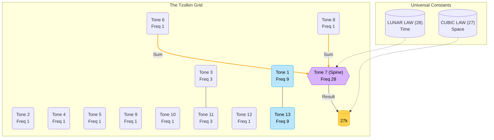

# The Unified Field Theory of the Tzolkin

## 1. The Universal Constant: 27
The number **27** ($3^3$) is the fundamental binding energy of the Tzolkin.
*   **Proof 1**: The Outer Columns (1 & 13) vibrate at frequencies of **54** ($2 \times 27$).
*   **Proof 2**: The Interference between the Mystic Column (Col 7) and its neighbors is locked to multiples of **27**.
    *   Example: Row 5 Sum = 351 ($13 \times 27$).
    *   Example: Row 6 Sum = 297 ($11 \times 27$).
    *   Example: Row 7 Sum = 243 ($9 \times 27$).

## 2. The Resonance Topology
The Tzolkin is a symmetrical standing wave:
*   **Freq 9**: Edges (Tones 1 & 13)
*   **Freq 1**: Chaos Zones (Tones 2, 4-6, 8-10, 12)
*   **Freq 3**: Shoulders (Tones 3 & 11)
*   **Freq 28**: The Spine (Tone 7)

**Symmetry Map**: `9 - 1 - 3 - 1 - 1 - 1 - [28] - 1 - 1 - 1 - 3 - 1 - 9`

## 3. The "Chaos" is Structured
The columns with GCD=1 are not random. Their interaction with the Spine (Col 7) produces perfect Integer Multiples of 27.
This implies the "Chaos" is simply mathematically complex interference designed to sum to Zero (or 27) when integrated with the Center.

## Conclusion
The Tzolkin is a **Cubic-Lunar Hybrid Engine**.
It integrates the **Cubic Law of Space (3^3 = 27)** with the **Lunar Law of Time (4x7 = 28)**.
The "Gap" between 27 and 28 is the driving force of the spiral.

## 4. Visual Topology (The Circuit of Time)

