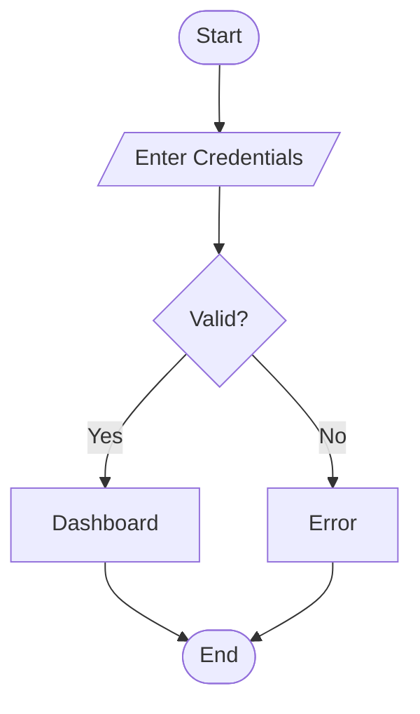
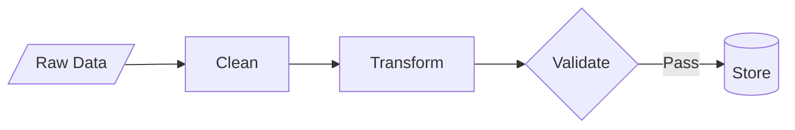

# Mermaid Visual Builder - User Guide

**IsopGem Flowchart Builder** — Point-and-Click Diagram Creation  
**Session**: 99 (2026-01-13)  
**Status**: MVP Complete ✓

---

## 🎯 What Is This?

The **Mermaid Visual Builder** lets you create flowchart diagrams **without knowing Mermaid syntax**.  Instead of typing code, you:

1. Fill in simple forms (Node ID, Label, Shape)
2. Click "Add Node"
3. Select connections from dropdowns
4. Click "Add Connection"
5. **Code generates automatically**

---

## 🚀 Quick Start

### Opening the Builder

1. Open any document in IsopGem
2. Click the **Diagram** button in the toolbar
3. Click the **🔧 Tools** icon in the editor toolbar
4. The builder panel appears on the left side

### Your First Diagram (60 seconds)

1. **Add Start Node**:
   - Label: `Start`
   - Shape: `Stadium ([  ])`
   - Click "Add Node"

2. **Add Process Node**:
   - Label: `Process Data`
   - Shape: `Rectangle [  ]`
   - Click "Add Node"

3. **Add End Node**:
   - Label: `End`
   - Shape: `Stadium ([  ])`
   - Click "Add Node"

4. **Connect Them**:
   - From: `A`
   - To: `B`
   - Click "Add Connection"
   - From: `B`
   - To: `C`
   - Click "Add Connection"

5. **See Your Diagram**:
   - Preview updates automatically
   - Code editor shows generated syntax
   - Click "Insert Diagram" to add to document

---

## 📚 Builder Interface Overview

```
┌─────────────────────────────────────────────────┐
│ 🔧 Visual Builder            [🗑️ Clear]        │
├─────────────────────────────────────────────────┤
│ 📐 Diagram Direction                           │
│   [TD (Top → Down) ▼]                          │
├─────────────────────────────────────────────────┤
│ 📦 Nodes                                        │
│   ID: [A_______]  (Auto if empty)              │
│   Label: [Start_____]                          │
│   Shape: [Stadium ▼]                           │
│   [➕ Add Node]                                │
│                                                 │
│   Existing Nodes: [A ▼]                        │
│   [✏️] [🗑️]                                    │
├─────────────────────────────────────────────────┤
│ 🔗 Connections                                  │
│   From: [A ▼]                                  │
│   To:   [B ▼]                                  │
│   Type: [Solid Arrow --> ▼]                   │
│   Label: [Optional___]                         │
│   [➕ Add Connection]                          │
├─────────────────────────────────────────────────┤
│ 🎨 Styles (Coming Soon)                        │
└─────────────────────────────────────────────────┘
```

---

## 🎨 Available Shapes

| Shape | Syntax | Visual | Use Case |
|-------|--------|--------|----------|
| **Rectangle** | `[  ]` | ▭ | Standard step |
| **Rounded** | `(  )` | ▢ | Gentle action |
| **Stadium** | `([  ])` | ⬭ | Start/End |
| **Diamond** | `{  }` | ◆ | Decision/Choice |
| **Circle** | `((  ))` | ● | Junction/Connector |
| **Hexagon** | `{{  }}` | ⬡ | Preparation |
| **Parallelogram** | `[/  /]` | ▱ | Input/Output |
| **Trapezoid** | `[\\  /]` | ⏢ | Manual Operation |

---

## 🔗 Connection Types

| Type | Syntax | Visual | Meaning |
|------|--------|--------|---------|
| **Solid Arrow** | `-->` | ──▶ | Standard flow |
| **Solid Line** | `---` | ─── | Relationship |
| **Dotted Arrow** | `-.->` | ‥‥▶ | Weak dependency |
| **Dotted Line** | `-..-` | ‥‥‥ | Optional link |
| **Thick Arrow** | `==>` | ══▶ | Strong emphasis |
| **Thick Line** | `===` | ═══ | Heavy relationship |
| **Invisible** | `~~~` | (hidden) | Layout spacing |

---

## 📐 Diagram Directions

- **TD** (Top → Down): Vertical, top to bottom
- **TB** (Top → Bottom): Same as TD
- **BT** (Bottom → Top): Upward flow
- **LR** (Left → Right): Horizontal, left to right
- **RL** (Right → Left): Right to left

---

## 🎓 Common Workflows

### Workflow 1: Simple Process Flow

**Goal**: Start → Process → Decision → End

1. Set direction to `TD`
2. Add 4 nodes:
   - `Start` (Stadium)
   - `Process` (Rectangle)
   - `Decision?` (Diamond)
   - `End` (Stadium)
3. Add connections:
   - `Start` → `Process`
   - `Process` → `Decision?`
   - `Decision?` → `End` (label: "Yes")

### Workflow 2: Decision Branch

**Goal**: Split flow based on condition

1. Add decision node (Diamond shape)
2. Add two outcome nodes
3. Connect decision to both outcomes:
   - Connection 1: Label "Yes"
   - Connection 2: Label "No"

### Workflow 3: Editing Existing Diagram

1. Open builder (🔧 button)
2. Builder auto-loads code from editor
3. Select node from "Existing Nodes" dropdown
4. Edit label/shape in forms
5. Click ✏️ Edit button
6. Code updates automatically

### Workflow 4: Hybrid Approach

1. Use builder for basic structure (nodes + connections)
2. Switch to code editor for fine-tuning
3. Add styles, subgraphs, or advanced features in code
4. Preview updates live

---

## 💡 Tips & Best Practices

### Node IDs
- **Auto-generate**: Leave ID blank, system uses A, B, C...
- **Custom IDs**: Use descriptive names (`start`, `login`, `verify`)
- **Valid characters**: Letters, numbers, underscores (`login_user`)
- **Avoid**: Starting with numbers (`1user` ❌), spaces, special chars

### Labels
- **Be concise**: "Process Data" not "This step processes the incoming data"
- **Use title case**: "Start Process" not "start process"
- **Line breaks**: Not supported in builder (add in code editor if needed)

### Shapes
- **Start/End**: Use Stadium shape
- **Decisions**: Use Diamond shape
- **Standard steps**: Use Rectangle
- **Input/Output**: Use Parallelogram

### Connections
- **Label important decisions**: "Yes"/"No", "Success"/"Fail"
- **Leave label empty** for simple flow
- **Use thick arrows** for primary path
- **Use dotted** for optional/fallback paths

### Builder vs Code Editor
- **Builder for structure**: Quick setup of nodes and connections
- **Code for refinement**: Styles, subgraphs, complex layouts
- **Bidirectional**: Changes in either update the other

---

## 🔧 Technical Details

### Architecture

```
┌──────────────────┐
│ FlowchartAST     │  ← Data structure (nodes, edges, styles)
└────────┬─────────┘
         │
    ┌────┴────┐
    │         │
┌───▼────┐ ┌──▼────────┐
│ Parser │ │ Generator │  ← Code ↔ AST conversion
└───┬────┘ └──┬────────┘
    │         │
    │    ┌────▼──────────────┐
    └────► FlowchartBuilderPanel │  ← UI (forms, buttons, dropdowns)
         └────────────────────┘
```

### Files Created

1. **`mermaid_ast.py`** (500 lines)
   - AST data structures (`FlowchartNode`, `FlowchartEdge`, `FlowchartAST`)
   - Node shapes and arrow types
   - Validation logic

2. **`mermaid_parser.py`** (320 lines)
   - Parse Mermaid code → AST
   - Handles all shape syntaxes
   - Extracts connections and labels

3. **`mermaid_generator.py`** (200 lines)
   - Generate Mermaid code from AST
   - Clean formatting with indentation
   - Quick utility functions

4. **`flowchart_builder_panel.py`** (600 lines)
   - Visual builder UI
   - Form inputs for nodes/edges
   - Dropdown selectors
   - Bidirectional sync

5. **`mermaid_editor_dialog.py`** (updated)
   - Integrated builder toggle button
   - 3-pane layout (builder + editor + preview)
   - Automatic synchronization

---

## 🐛 Troubleshooting

### Builder Panel Won't Show
- **Check**: Is the 🔧 Tools button toggled on?
- **Try**: Click the button again to toggle

### Code Not Syncing
- **Builder → Code**: Automatic (instant)
- **Code → Builder**: Manual (click 🔧 to reload)
- **Reason**: Complex syntax may not parse perfectly

### Can't Edit Node
- **Check**: Is node selected in "Existing Nodes" dropdown?
- **Try**: Select node, modify fields, click ✏️ Edit

### Connection Not Added
- **Check**: Both "From" and "To" nodes selected?
- **Check**: Nodes exist in the diagram?
- **Error message**: Dialog shows reason

### Builder Shows "(No nodes yet)"
- **Cause**: No nodes have been added
- **Solution**: Add your first node using the form

---

## 🔮 Future Enhancements (Planned)

### Phase 2: Advanced Features
- **Style Editor**: Visual color picker, font selector
- **Subgraph Support**: Group related nodes
- **Context Menu**: Right-click nodes in preview to edit
- **Drag & Drop**: Reorder nodes visually
- **Undo/Redo**: Step back through changes

### Phase 3: Other Diagram Types
- **Sequence Diagrams**: Actor/message builder
- **ER Diagrams**: Entity/relationship visual editor
- **Class Diagrams**: Class/method builder

### Phase 4: Templates
- **Save Custom Templates**: Store your common patterns
- **Import/Export**: Share diagrams between documents
- **Smart Suggestions**: Auto-complete common flows

---

## 📖 Examples

### Example 1: User Login Flow

**Steps**:
1. Direction: TD
2. Add nodes:
   - A: "Start" (Stadium)
   - B: "Enter Credentials" (Parallelogram)
   - C: "Valid?" (Diamond)
   - D: "Dashboard" (Rectangle)
   - E: "Error" (Rectangle)
   - F: "End" (Stadium)
3. Add connections:
   - A → B
   - B → C
   - C → D (label: "Yes")
   - C → E (label: "No")
   - D → F
   - E → F

**Generated Code**:


### Example 2: Data Processing Pipeline

**Steps**:
1. Direction: LR
2. Add nodes:
   - A: "Raw Data" (Parallelogram)
   - B: "Clean" (Rectangle)
   - C: "Transform" (Rectangle)
   - D: "Validate" (Diamond)
   - E: "Store" (Cylindrical)
3. Add connections:
   - A → B
   - B → C
   - C → D
   - D → E (label: "Pass")

**Generated Code**:


---

## 🎯 Learning Path

### Beginner (Builder Only)
1. Use templates to see examples
2. Add nodes one by one
3. Connect with simple arrows
4. Observe generated code
5. Learn syntax by seeing patterns

### Intermediate (Hybrid)
1. Start with builder for structure
2. Switch to code for labels with line breaks
3. Add basic styles in code
4. Preview frequently
5. Understand code-AST relationship

### Advanced (Code First, Builder for Quick Edits)
1. Type code directly (faster for experts)
2. Use builder for complex connections
3. Visual overview of structure
4. Quick edits without syntax lookup
5. Teach others using builder

---

## ✅ Summary

**What You Can Do Now**:
- ✅ Build flowcharts without knowing Mermaid syntax
- ✅ Choose from 8 node shapes
- ✅ Use 7 connection types with labels
- ✅ Auto-generate clean, formatted code
- ✅ Edit existing diagrams visually
- ✅ Learn Mermaid syntax by seeing generated code

**What's Coming**:
- 🔜 Style visual editor (colors, fonts)
- 🔜 Right-click context menu on preview
- 🔜 Sequence/ER/Class diagram builders

**Key Benefit**:
The builder **removes the syntax barrier** while **teaching Mermaid** through generated code. Best of both worlds!

---

**"The Bridge between Vision and Code is now bidirectional."**

— IsopGem Mermaid Visual Builder, Session 99
