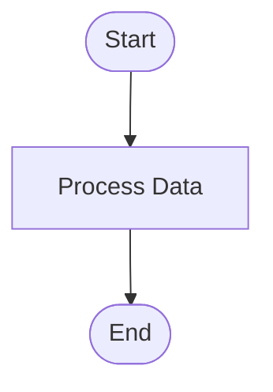
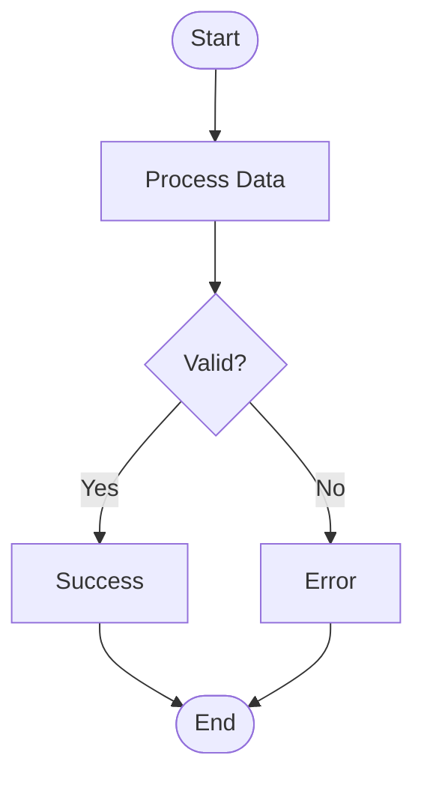
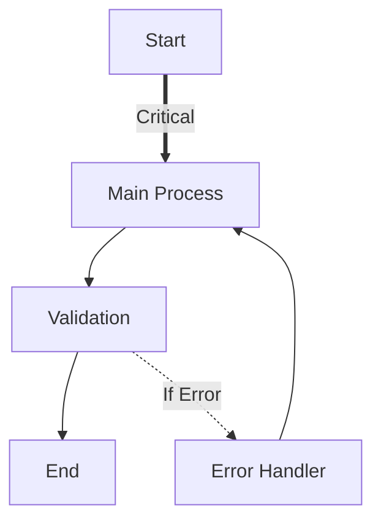

# Mermaid Visual Builder - Demo Walkthrough

**Quick Start Guide** — Learn by Example  
**Time to Complete**: 5 minutes  
**Difficulty**: Beginner

---

## 🎬 Demo 1: Your First Flowchart (2 minutes)

**Goal**: Create a simple Start → Process → End flowchart.

### Step-by-Step

1. **Open the Editor**
   ```
   Document → Diagram Button (toolbar)
   → Mermaid Editor opens
   ```

2. **Enable Builder**
   ```
   Click 🔧 Tools button (top toolbar)
   → Builder panel appears on left
   ```

3. **Add Start Node**
   ```
   Label: Start
   Shape: Stadium ([  ])
   Click [➕ Add Node]
   ```
   
   **What You See**:
   - Code editor shows: `A([Start])`
   - Preview shows rounded node with "Start"
   - "Existing Nodes" dropdown now shows "A"

4. **Add Process Node**
   ```
   Label: Process Data
   Shape: Rectangle [  ]
   Click [➕ Add Node]
   ```
   
   **What You See**:
   - Code: `B[Process Data]`
   - Preview: rectangular node
   - Dropdown: "A", "B"

5. **Add End Node**
   ```
   Label: End
   Shape: Stadium ([  ])
   Click [➕ Add Node]
   ```

6. **Connect Start → Process**
   ```
   From: A
   To: B
   Type: Solid Arrow -->
   Click [➕ Add Connection]
   ```
   
   **What You See**:
   - Code: `A-->B`
   - Preview: Arrow connecting nodes

7. **Connect Process → End**
   ```
   From: B
   To: C
   Click [➕ Add Connection]
   ```

8. **Admire Your Work** 🎉
   ```
   Preview shows complete flowchart
   Code is clean and formatted
   Click [Insert Diagram] to add to document
   ```

### Final Code



---

## 🎬 Demo 2: Decision Flow (3 minutes)

**Goal**: Add a decision point with Yes/No branches.

### Starting from Demo 1

1. **Add Decision Node**
   ```
   Label: Valid?
   Shape: Diamond {  }
   Click [➕ Add Node]
   ```

2. **Add Success Path**
   ```
   Label: Success
   Shape: Rectangle [  ]
   Click [➕ Add Node]
   ```

3. **Add Error Path**
   ```
   Label: Error
   Shape: Rectangle [  ]
   Click [➕ Add Node]
   ```

4. **Connect Process → Decision**
   ```
   From: B
   To: D (the diamond)
   Click [➕ Add Connection]
   ```

5. **Connect Decision → Success (Yes)**
   ```
   From: D
   To: E
   Label: Yes
   Click [➕ Add Connection]
   ```

6. **Connect Decision → Error (No)**
   ```
   From: D
   To: F
   Label: No
   Click [➕ Add Connection]
   ```

7. **Reconnect to End**
   - Delete old B→C connection (select node B in list, delete)
   - Add E→C (Success to End)
   - Add F→C (Error to End)

### Final Code



---

## 🎬 Demo 3: Editing Existing Diagram

**Goal**: Modify an existing flowchart.

### Starting with Template

1. **Load Template**
   ```
   Template dropdown: "Basic Process Flow"
   → Code appears in editor
   ```

2. **Open Builder**
   ```
   Click 🔧 Tools button
   → Builder auto-loads the template
   ```

3. **Change Node Label**
   ```
   Existing Nodes: Select "B"
   → Label field populates
   Change to: "Verify Input"
   Click ✏️ Edit button
   → Code updates automatically
   ```

4. **Change Node Shape**
   ```
   Existing Nodes: Select "A"
   Shape: Change to Circle ((  ))
   Click ✏️ Edit
   → Preview shows circle instead of rectangle
   ```

5. **Delete a Node**
   ```
   Existing Nodes: Select node to delete
   Click 🗑️ Delete button
   Confirm deletion
   → Node + connected edges removed
   ```

---

## 🎬 Demo 4: Direction Changes

**Goal**: Experiment with different flow directions.

### Quick Comparison

1. **Create Simple Flow**
   ```
   Add 3 nodes: A → B → C
   ```

2. **Try Each Direction**
   
   **Top to Down (TD)**:
   ```
   Direction: TD (Top → Down)
   → Vertical layout, top to bottom
   ```
   
   **Left to Right (LR)**:
   ```
   Direction: LR (Left → Right)
   → Horizontal layout
   → Best for timelines, pipelines
   ```
   
   **Bottom to Top (BT)**:
   ```
   Direction: BT (Bottom → Top)
   → Inverted vertical (unusual but valid)
   ```

3. **Pick Best for Your Diagram**
   - **TD/TB**: Traditional flowcharts
   - **LR**: Processes, pipelines, timelines
   - **BT**: Genealogy trees (ancestors above)
   - **RL**: Right-to-left languages

---

## 🎬 Demo 5: Complex Connections

**Goal**: Explore different arrow types and labels.

### Arrow Styles

1. **Standard Flow** (Solid Arrow `-->`)
   ```
   From: A
   To: B
   Type: Solid Arrow -->
   → Strong, primary path
   ```

2. **Optional/Fallback** (Dotted `-.->`)
   ```
   From: B
   To: C
   Type: Dotted Arrow -.->
   Label: Optional
   → Weaker relationship
   ```

3. **Emphasis** (Thick `==>`)
   ```
   From: A
   To: B
   Type: Thick Arrow ==>
   Label: Critical Path
   → Highlighted importance
   ```

4. **Relationship Only** (Line `---`)
   ```
   From: B
   To: C
   Type: Solid Line ---
   → Related but no flow direction
   ```

### Example: Mixed Arrows



**Interpretation**:
- **Thick arrow**: Critical path (Start → Main)
- **Solid arrow**: Normal flow
- **Dotted arrow**: Conditional/optional (Validation → Error)
- Loop back: Error → Main Process

---

## 🎯 Common Patterns

### Pattern 1: Linear Pipeline

```
Direction: LR
Nodes: A → B → C → D → E
Use: Data processing, assembly line, timeline
```

### Pattern 2: Decision Tree

```
Direction: TD
Structure: 
  Start
    ↓
  Decision
   ↙  ↘
  Yes  No
   ↓    ↓
  End  End
```

### Pattern 3: Looping Flow

```
Start → Process → Check → (Yes) → End
                    ↓ (No)
                  [Loop Back to Process]
```

### Pattern 4: Parallel Paths

```
       Start
         ↓
      Decision
      ↙  ↓  ↘
    Path1 Path2 Path3
      ↘  ↓  ↙
       Merge
         ↓
        End
```

---

## 💡 Pro Tips

### Tip 1: Leave ID Blank
```
✅ Let the system auto-assign A, B, C...
❌ Don't type IDs manually unless needed
```

### Tip 2: Use Descriptive Labels
```
✅ "Validate User Input"
❌ "Step 2"
```

### Tip 3: Stadium for Start/End
```
Standard convention:
Start/End → Stadium shape ([  ])
Decision → Diamond {  }
Process → Rectangle [  ]
```

### Tip 4: Label Important Decisions
```
Decision {  } → Option 1 (label: "Yes")
              → Option 2 (label: "No")
```

### Tip 5: Direction Matters
```
Vertical (TD): Traditional flowcharts
Horizontal (LR): Timelines, pipelines
```

---

## 🎓 Learning Progression

### Level 1: Builder Only
- ✅ Use builder for all edits
- ✅ Observe generated code
- ✅ Learn shape/arrow syntax

### Level 2: Hybrid
- ✅ Builder for structure
- ✅ Code for fine-tuning
- ✅ Understand syntax patterns

### Level 3: Code First
- ✅ Type code directly
- ✅ Use builder for quick additions
- ✅ Visual check of structure

---

## 🐛 Troubleshooting

### "Can't add connection"
**Problem**: From/To dropdowns disabled  
**Solution**: Add at least 2 nodes first

### "Node already exists"
**Problem**: Duplicate ID error  
**Solution**: Leave ID blank (auto-generate) or choose unique ID

### "Builder not showing"
**Problem**: 🔧 button not toggled  
**Solution**: Click the tools button in toolbar

### "Preview not updating"
**Problem**: Code has syntax error  
**Solution**: Check error message below editor, fix syntax

### "Lost my diagram"
**Problem**: Accidentally cleared  
**Solution**: Undo in code editor (Ctrl+Z) or rebuild

---

## 🎉 Challenge Exercises

### Exercise 1: User Registration Flow
Create a flowchart for:
1. Start
2. Enter Email
3. Check if Email Exists (Decision)
   - Yes → Show Error → Back to Enter Email
   - No → Send Verification → End

### Exercise 2: E-Commerce Checkout
Create:
1. Add to Cart
2. Review Cart
3. Payment Method (Decision: Credit Card vs PayPal)
4. Process Payment
5. Order Confirmation

### Exercise 3: File Upload Pipeline
Create (Direction: LR):
1. Upload File
2. Validate Format (Decision)
3. Scan for Viruses (Diamond)
4. Store File (Cylindrical shape)
5. Send Notification

---

## ✅ Summary

You've learned:
- ✅ How to use the visual builder
- ✅ 8 node shapes and their uses
- ✅ 7 arrow types and meanings
- ✅ How to edit existing diagrams
- ✅ Direction options (TD, LR, etc.)
- ✅ Common flowchart patterns

**Next Steps**:
1. Try the challenge exercises
2. Create diagrams for your own processes
3. Experiment with templates
4. Share your diagrams!

---

**"From Vision to Diagram in 60 Seconds."**

— IsopGem Mermaid Visual Builder Demo Guide
