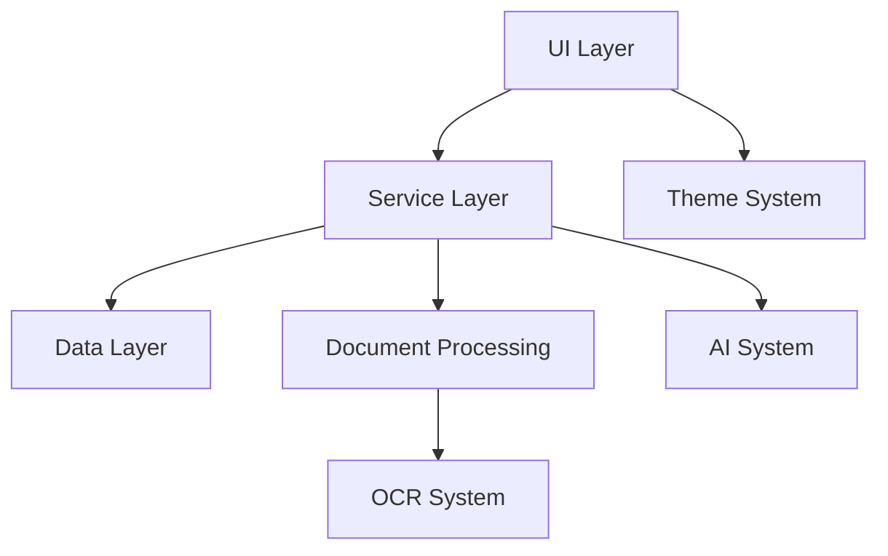
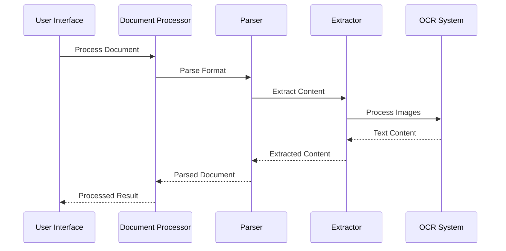
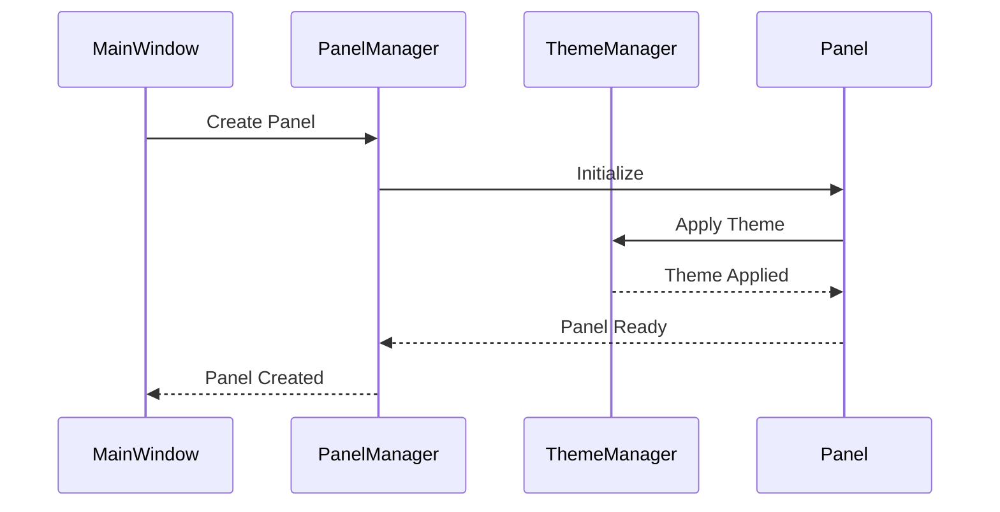

# IsopGem Application Structure Guide 💫

## Core Architecture

### 1. Application Layer Architecture
```
IsopGem/
├── core/               # Core application logic
│   ├── __init__.py    # Module initialization
│   ├── base/          # Base classes and core functionality
│   │   ├── application.py  # Main application class
│   │   ├── config.py      # Configuration management
│   │   └── constants.py   # Global constants
│   └── utils/         # Utility functions and helpers
├── docs/              # Documentation and guides
├── test/              # Test suite and resources
├── main.py            # Application entry point
└── __main__.py        # Package entry point for -m execution
```

### 2. Module Dependencies


## Core Module Structure

### 1. Document Processing System
```
core/documents/
├── analysis/          # Document analysis tools
│   ├── structure.py   # Structure analysis
│   └── content.py     # Content analysis
├── base.py           # Base document classes
├── content/          # Content management
│   ├── table.py      # Table handling
│   ├── text.py       # Text processing
│   └── metadata.py   # Metadata management
├── exporters/        # Document export
│   ├── pdf.py        # PDF export
│   └── html.py       # HTML export
├── extractors/       # Content extraction
│   ├── ocr.py        # OCR processing
│   ├── pdf.py        # PDF extraction
│   └── docx.py       # DOCX extraction
├── parsers/          # Format parsing
│   ├── pdf_parser.py # PDF parsing
│   ├── docx_parser.py# DOCX parsing
│   └── text_parser.py# Text parsing
└── processor.py      # Main document processor
```

#### Document Processing Flow


### 2. UI System Architecture
```
core/ui/
├── base/             # Base UI components
│   ├── window.py     # Main window implementation
│   └── widget.py     # Base widget classes
├── panels/           # Panel system
│   ├── common_panels/# Common panel implementations
│   │   ├── document_viewer.py
│   │   └── properties_panel.py
│   ├── manager.py    # Panel management
│   ├── registry.py   # Panel registration
│   └── state.py      # Panel state management
├── theme/            # Theme system
│   ├── manager.py    # Theme management
│   └── colors.py     # Color definitions
├── widgets/          # Custom widgets
│   ├── collapsible_dock.py
│   ├── color_picker.py
│   └── theme_preview.py
└── state_manager.py  # UI state management
```

#### UI Component Interaction


### 3. AI System Architecture
```
core/ai/
├── embeddings/       # Text embedding system
│   ├── manager.py    # Embedding management
│   └── models.py     # Embedding models
├── rag/             # Retrieval-augmented generation
│   ├── engine.py     # RAG engine
│   ├── retriever.py  # Content retrieval
│   └── generator.py  # Text generation
├── models/          # ML model management
│   ├── loader.py     # Model loading
│   └── cache.py      # Model caching
└── pipeline/        # AI pipelines
    ├── document.py   # Document processing
    └── analysis.py   # Content analysis
```

## Implementation Patterns

### 1. Singleton Pattern Implementation
```python
class Manager:
    """Base singleton manager class"""
    _instance = None
    _initialized = False
    
    def __new__(cls):
        if cls._instance is None:
            cls._instance = super().__new__(cls)
        return cls._instance
    
    def __init__(self):
        if not self._initialized:
            self._initialize()
            self.__class__._initialized = True
    
    def _initialize(self):
        """Initialize singleton instance"""
        raise NotImplementedError
```

#### Usage Examples
```python
class ThemeManager(Manager):
    def _initialize(self):
        self.themes = {}
        self.current_theme = None
        self._load_themes()

class PanelManager(Manager):
    def _initialize(self):
        self.panels = {}
        self.docks = {}
        self._setup_registry()
```

### 2. Factory Pattern Implementation
```python
from abc import ABC, abstractmethod

class PanelFactory(ABC):
    """Abstract factory for panel creation"""
    
    @abstractmethod
    def create_panel(self) -> BasePanel:
        pass
    
    @abstractmethod
    def create_dock(self) -> QDockWidget:
        pass

class DocumentPanelFactory(PanelFactory):
    def create_panel(self) -> DocumentPanel:
        panel = DocumentPanel()
        panel.setup_ui()
        return panel
    
    def create_dock(self) -> QDockWidget:
        dock = QDockWidget()
        dock.setFeatures(
            QDockWidget.DockWidgetFeature.DockWidgetClosable |
            QDockWidget.DockWidgetFeature.DockWidgetMovable
        )
        return dock
```

### 3. Observer Pattern Implementation
```python
class Observable:
    def __init__(self):
        self._observers = []
    
    def add_observer(self, observer):
        if observer not in self._observers:
            self._observers.append(observer)
    
    def remove_observer(self, observer):
        self._observers.remove(observer)
    
    def notify_observers(self, *args, **kwargs):
        for observer in self._observers:
            observer.update(*args, **kwargs)

class ThemeObservable(Observable, QObject):
    theme_changed = pyqtSignal(str)
    
    def __init__(self):
        Observable.__init__(self)
        QObject.__init__(self)
    
    def update_theme(self, theme_name: str):
        self.theme_changed.emit(theme_name)
        self.notify_observers(theme_name)
```

## Module Communication

### 1. Signal-Slot System
```python
class DocumentViewer(QWidget):
    document_loaded = pyqtSignal(str)  # Document path
    processing_complete = pyqtSignal(bool)  # Success status
    
    def __init__(self):
        super().__init__()
        self.processor = DocumentProcessor()
        self.setup_connections()
    
    def setup_connections(self):
        self.document_loaded.connect(self.processor.process_document)
        self.processor.processing_complete.connect(self.handle_processing)
```

### 2. Event System
```python
class ApplicationEvent:
    def __init__(self, event_type: str, data: dict):
        self.type = event_type
        self.data = data
        self.timestamp = datetime.now()

class EventManager(Manager):
    def _initialize(self):
        self.handlers = defaultdict(list)
    
    def register_handler(self, event_type: str, handler: Callable):
        self.handlers[event_type].append(handler)
    
    def emit_event(self, event: ApplicationEvent):
        for handler in self.handlers[event.type]:
            handler(event)
```

## State Management

### 1. Application State
```python
class ApplicationState:
    def __init__(self):
        self.window_state = WindowState()
        self.document_state = DocumentState()
        self.theme_state = ThemeState()
    
    def save_state(self) -> dict:
        return {
            'window': self.window_state.save(),
            'document': self.document_state.save(),
            'theme': self.theme_state.save()
        }
    
    def restore_state(self, state: dict):
        self.window_state.restore(state['window'])
        self.document_state.restore(state['document'])
        self.theme_state.restore(state['theme'])
```

### 2. Panel State Management
```python
class PanelState:
    def __init__(self):
        self.geometry = QRect()
        self.is_visible = False
        self.is_floating = False
        self.dock_area = Qt.DockWidgetArea.LeftDockWidgetArea
    
    def save(self) -> dict:
        return {
            'geometry': self.geometry,
            'visible': self.is_visible,
            'floating': self.is_floating,
            'dock_area': self.dock_area
        }
```

## Error Handling

### 1. Custom Exceptions
```python
class IsopGemError(Exception):
    """Base exception for IsopGem"""
    pass

class DocumentError(IsopGemError):
    """Document processing errors"""
    pass

class PanelError(IsopGemError):
    """Panel-related errors"""
    pass

class ThemeError(IsopGemError):
    """Theme-related errors"""
    pass
```

### 2. Error Handling Pattern
```python
def safe_operation(func):
    @wraps(func)
    def wrapper(*args, **kwargs):
        try:
            return func(*args, **kwargs)
        except DocumentError as e:
            logger.error(f"Document error: {e}")
            show_error_dialog("Document Error", str(e))
        except PanelError as e:
            logger.error(f"Panel error: {e}")
            show_error_dialog("Panel Error", str(e))
        except Exception as e:
            logger.exception("Unexpected error")
            show_error_dialog("Error", "An unexpected error occurred")
    return wrapper
```

## Testing Architecture

### 1. Test Organization
```
tests/
├── unit/
│   ├── test_document/
│   │   ├── test_processor.py
│   │   └── test_parser.py
│   ├── test_ui/
│   │   ├── test_panels.py
│   │   └── test_theme.py
│   └── test_ai/
│       ├── test_embeddings.py
│       └── test_rag.py
├── integration/
│   ├── test_document_ui.py
│   └── test_ai_document.py
└── resources/
    ├── documents/
    │   ├── sample.pdf
    │   └── test.docx
    ├── themes/
    │   └── test_theme.json
    └── fixtures/
        └── test_data.json
```

### 2. Test Base Classes
```python
class IsopGemTestCase(TestCase):
    def setUp(self):
        self.app = QApplication([])
        self.window = MainWindow()
    
    def tearDown(self):
        self.window.close()
        self.app.quit()

class DocumentTestCase(IsopGemTestCase):
    def setUp(self):
        super().setUp()
        self.processor = DocumentProcessor()
        self.test_doc = "tests/resources/documents/sample.pdf"
```

## Documentation Standards

### 1. Code Documentation
```python
def process_document(
    self,
    path: str,
    options: Optional[Dict[str, Any]] = None
) -> Document:
    """
    Process a document with specified options.
    
    Args:
        path: Path to the document file
        options: Processing options
            - ocr: bool, Enable OCR
            - language: str, Document language
            - tables: bool, Extract tables
    
    Returns:
        Document: Processed document object
    
    Raises:
        DocumentError: If processing fails
        FileNotFoundError: If document doesn't exist
    
    Example:
        >>> processor = DocumentProcessor()
        >>> doc = processor.process_document("doc.pdf", {"ocr": True})
    """
```

### 2. Architecture Documentation
```
docs/
├── architecture/
│   ├── overview.md
│   ├── modules.md
│   └── patterns.md
├── api/
│   ├── document.md
│   ├── ui.md
│   └── ai.md
└── guides/
    ├── development.md
    ├── testing.md
    └── deployment.md
```

## Future Extensibility

### 1. Plugin System
```python
class Plugin(ABC):
    @abstractmethod
    def initialize(self):
        """Initialize plugin"""
        pass
    
    @abstractmethod
    def cleanup(self):
        """Clean up plugin resources"""
        pass

class PluginManager(Manager):
    def _initialize(self):
        self.plugins = {}
        self.load_plugins()
    
    def register_plugin(self, name: str, plugin: Plugin):
        self.plugins[name] = plugin
        plugin.initialize()
```

### 2. Service Layer
```python
class ServiceLayer:
    def __init__(self):
        self.document_service = DocumentService()
        self.ai_service = AIService()
        self.theme_service = ThemeService()
    
    def initialize(self):
        """Initialize all services"""
        self.document_service.initialize()
        self.ai_service.initialize()
        self.theme_service.initialize()
```

### 3. API Layer
```python
class APIEndpoint(ABC):
    @abstractmethod
    def handle_request(self, request: dict) -> dict:
        pass

class DocumentAPI(APIEndpoint):
    def handle_request(self, request: dict) -> dict:
        command = request.get('command')
        if command == 'process':
            return self._process_document(request)
        elif command == 'analyze':
            return self._analyze_document(request)
```

## Performance Optimization

### 1. Caching System
```python
class Cache(ABC):
    @abstractmethod
    def get(self, key: str) -> Any:
        pass
    
    @abstractmethod
    def set(self, key: str, value: Any):
        pass

class DocumentCache(Cache):
    def __init__(self):
        self.cache = LRUCache(maxsize=100)
    
    def get(self, key: str) -> Optional[Document]:
        return self.cache.get(key)
    
    def set(self, key: str, document: Document):
        self.cache[key] = document
```

### 2. Async Operations
```python
class AsyncDocumentProcessor:
    async def process_document(self, path: str) -> Document:
        async with aiofiles.open(path, 'rb') as f:
            content = await f.read()
        
        document = await self._process_content(content)
        return document
    
    @staticmethod
    async def _process_content(content: bytes) -> Document:
        return await asyncio.get_event_loop().run_in_executor(
            None, DocumentProcessor.process_content, content
        )
```

## Deployment Configuration

### 1. Environment Configuration
```python
class Environment:
    def __init__(self):
        self.load_env()
        
    def load_env(self):
        self.debug = os.getenv('ISOPGEM_DEBUG', 'False') == 'True'
        self.log_level = os.getenv('ISOPGEM_LOG_LEVEL', 'INFO')
        self.data_dir = os.getenv('ISOPGEM_DATA_DIR', './data')
```

### 2. Logging Configuration
```python
class LogConfig:
    def __init__(self):
        self.configure_logging()
    
    def configure_logging(self):
        logging.basicConfig(
            level=Environment().log_level,
            format='%(asctime)s [%(levelname)s] %(name)s: %(message)s',
            handlers=[
                logging.StreamHandler(),
                logging.FileHandler('isopgem.log')
            ]
        )
```

## Security Considerations

### 1. File Access
```python
class SecureFileHandler:
    def __init__(self):
        self.allowed_extensions = {'.pdf', '.docx', '.txt'}
    
    def validate_file(self, path: str) -> bool:
        ext = os.path.splitext(path)[1].lower()
        if ext not in self.allowed_extensions:
            raise SecurityError(f"Unsupported file type: {ext}")
        return True
```

### 2. Data Sanitization
```python
class InputSanitizer:
    @staticmethod
    def sanitize_filename(filename: str) -> str:
        return secure_filename(filename)
    
    @staticmethod
    def sanitize_path(path: str) -> str:
        return os.path.normpath(path)
```

## Monitoring and Analytics

### 1. Performance Monitoring
```python
class PerformanceMonitor:
    def __init__(self):
        self.metrics = defaultdict(list)
    
    def record_metric(self, name: str, value: float):
        self.metrics[name].append({
            'value': value,
            'timestamp': datetime.now()
        })
```

### 2. Usage Analytics
```python
class AnalyticsCollector:
    def __init__(self):
        self.events = []
    
    def track_event(self, event_type: str, data: dict):
        self.events.append({
            'type': event_type,
            'data': data,
            'timestamp': datetime.now()
        })
