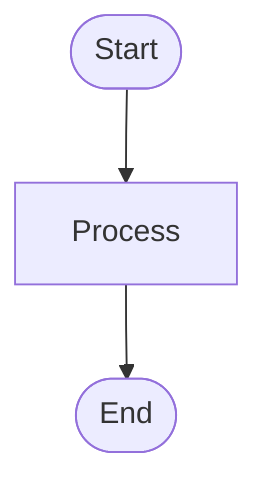

# Mermaid Visual Builder - Technical Reference

**IsopGem Architecture Document**  
**Feature**: Flowchart Visual Builder  
**Session**: 99 (2026-01-13)  
**Status**: MVP Complete

---

## 📋 Overview

The **Mermaid Visual Builder** provides a **point-and-click interface** for creating flowchart diagrams. It implements a **bidirectional transformation** between Mermaid text syntax and a structured Abstract Syntax Tree (AST), allowing users to work in either representation.

### Key Innovation

Most Mermaid tools are **code-only** or **visual-only**. This implementation is **bidirectional**:

```
User Types Code → Parser → AST → Builder UI
User Clicks UI → AST → Generator → Code Display
```

### Architecture Principles

1. **Separation of Concerns**: AST, Parser, Generator, UI are independent modules
2. **Visual Liturgy Compliance**: All UI uses centralized COLORS tokens
3. **Law of Sovereignty**: No shared/ imports from pillars/
4. **Graceful Degradation**: Invalid syntax doesn't crash; best-effort parsing

---

## 🏗️ Architecture

### Component Diagram

```
┌─────────────────────────────────────────────────────┐
│           MermaidEditorDialog (Qt Dialog)           │
│  ┌───────────────┐ ┌──────────┐ ┌───────────────┐  │
│  │ Builder Panel │ │  Editor  │ │   Preview     │  │
│  │  (Forms/UI)   │ │  (Code)  │ │   (Image)     │  │
│  └───────┬───────┘ └────┬─────┘ └───────────────┘  │
│          │              │                            │
│          │ code_changed │                            │
│          └──────────────┘                            │
└──────────────┬─────────────────────────────┬────────┘
               │                             │
        ┌──────▼──────┐              ┌───────▼────────┐
        │   FlowchartAST │              │   Renderer     │
        │  (Data Model)  │              │ (WebEngine)    │
        └──────┬──────┘              └────────────────┘
               │
      ┌────────┴────────┐
      │                 │
┌─────▼──────┐   ┌──────▼────────┐
│   Parser   │   │   Generator   │
│ (Code→AST) │   │  (AST→Code)   │
└────────────┘   └───────────────┘
```

### Data Flow

#### Visual Editing Flow
1. User fills form → clicks "Add Node"
2. `FlowchartBuilderPanel._on_add_node()` called
3. `ast.add_node(id, label, shape)` creates `FlowchartNode`
4. `FlowchartGenerator.generate(ast)` produces code
5. `code_changed` signal emits code string
6. `MermaidEditorDialog._on_builder_code_changed()` updates editor
7. `_render_preview()` renders image

#### Code Editing Flow (Future Enhancement)
1. User types in code editor
2. Debounce timer triggers after 600ms
3. `FlowchartParser.parse(code)` creates AST
4. Builder UI updates to reflect structure
5. Preview re-renders

---

## 📦 Module Reference

### 1. `mermaid_ast.py`

**Purpose**: Define data structures for representing flowcharts as structured data.

#### Key Classes

##### `FlowchartNode`
```python
@dataclass
class FlowchartNode:
    id: str                    # "A", "start", "node1"
    label: str                 # Display text
    shape: NodeShape           # Rectangle, Diamond, etc.
    style_class: str | None    # CSS class name
    metadata: Dict[str, Any]   # Arbitrary data
```

**Methods**:
- `to_mermaid_syntax() -> str`: Generate code (e.g., "A[Label]")

##### `FlowchartEdge`
```python
@dataclass
class FlowchartEdge:
    from_id: str               # Source node ID
    to_id: str                 # Target node ID
    arrow_type: ArrowType      # -->, ===, etc.
    label: str | None          # Optional text
    metadata: Dict[str, Any]
```

**Methods**:
- `to_mermaid_syntax() -> str`: Generate code (e.g., "A-->|Yes|B")

##### `FlowchartAST`
```python
@dataclass
class FlowchartAST:
    direction: str                      # TD, LR, etc.
    nodes: List[FlowchartNode]
    edges: List[FlowchartEdge]
    styles: Dict[str, StyleDefinition]
    subgraphs: List[Any]                # Future
```

**Key Methods**:

| Method | Purpose | Returns |
|--------|---------|---------|
| `add_node(id, label, shape)` | Add a node | `FlowchartNode` |
| `get_node(id)` | Find node by ID | `FlowchartNode \| None` |
| `update_node(id, ...)` | Modify node | `bool` |
| `remove_node(id)` | Delete node + edges | `bool` |
| `add_edge(from, to, type, label)` | Add connection | `FlowchartEdge` |
| `validate()` | Check for errors | `List[str]` |
| `get_next_node_id()` | Suggest next ID | `str` |

**Validation Checks**:
- Duplicate node IDs
- Dangling edges (reference non-existent nodes)
- Empty labels
- Invalid characters in IDs

#### Enums

##### `NodeShape`
```python
RECTANGLE    = "rect"     # [Label]
ROUNDED      = "round"    # (Label)
STADIUM      = "stadium"  # ([Label])
DIAMOND      = "diamond"  # {Label}
CIRCLE       = "circle"   # ((Label))
HEXAGON      = "hexagon"  # {{Label}}
PARALLELOGRAM = "para"    # [/Label/]
TRAPEZOID    = "trapezoid" # [\Label/]
```

##### `ArrowType`
```python
SOLID        = "-->"
SOLID_LINE   = "---"
DOTTED       = ".->"
DOTTED_LINE  = "-..-"
THICK        = "==>"
THICK_LINE   = "==="
INVISIBLE    = "~~~"
```

---

### 2. `mermaid_parser.py`

**Purpose**: Convert Mermaid text code into structured AST.

#### `FlowchartParser`

**Main Method**:
```python
@classmethod
def parse(cls, code: str) -> FlowchartAST
```

**Parsing Strategy**:
1. Split code into lines
2. Detect diagram type and direction
3. For each line:
   - Check for direction declaration
   - Check for style definition
   - Check for edge (connection)
   - Check for standalone node
4. Extract nodes mentioned in edges
5. Build AST incrementally

**Regex Patterns**:

```python
# Direction: flowchart TD
DIRECTION_PATTERN = r'^(?:graph|flowchart)\s+(TD|TB|BT|RL|LR)'

# Nodes (order matters - most specific first):
NODE_PATTERNS = [
    (r'(\w+)\(\[([^\]]+)\]\)', NodeShape.STADIUM),     # A([Label])
    (r'(\w+)\[\[([^\]]+)\]\]', NodeShape.SUBROUTINE),  # A[[Label]]
    (r'(\w+)\[\(([^\)]+)\)\]', NodeShape.CYLINDRICAL), # A[(Label)]
    # ... more patterns
    (r'(\w+)\[([^\]]+)\]', NodeShape.RECTANGLE),       # A[Label] (last)
]

# Edges:
ARROW_PATTERNS = [
    (r'===', ArrowType.THICK_LINE),
    (r'==>', ArrowType.THICK),
    # ... (longer patterns first)
    (r'-->', ArrowType.SOLID),
]
```

**Error Handling**:
- Invalid syntax: Warn and skip line (best-effort)
- Malformed nodes: Use ID as label
- Unknown shapes: Default to Rectangle

**Utility Functions**:
```python
auto_parse(code: str) -> FlowchartAST | None
# Detect diagram type automatically, default to flowchart
```

---

### 3. `mermaid_generator.py`

**Purpose**: Convert AST back into clean Mermaid code.

#### `FlowchartGenerator`

**Main Method**:
```python
@classmethod
def generate(cls, ast: FlowchartAST, compact: bool = False) -> str
```

**Generation Strategy**:
1. Output diagram type + direction
2. Output all nodes (standalone declarations)
3. Output all edges
4. Output style definitions

**Formatting**:
- 4-space indentation for elements
- Blank lines between sections (unless `compact=True`)
- Logical grouping (nodes → edges → styles)

**Example Output**:


**Utility Methods**:

| Method | Purpose |
|--------|---------|
| `generate_compact(ast)` | No blank lines |
| `generate_node_only(node)` | Single node syntax |
| `generate_edge_only(edge)` | Single edge syntax |
| `generate_with_comments(ast, header)` | Add %% comments |

**Helper Functions**:
```python
validate_and_generate(ast) -> (code, errors)
# Validate before generating, return both

quick_flowchart(nodes, edges, direction) -> code
# Fast creation from simple lists
```

---

### 4. `flowchart_builder_panel.py`

**Purpose**: Qt widget providing visual UI for building flowcharts.

#### `FlowchartBuilderPanel(QWidget)`

**Signals**:
```python
code_changed = pyqtSignal(str)       # Emitted when user changes diagram
ast_changed = pyqtSignal(object)     # Emitted with FlowchartAST
```

**Internal State**:
```python
self.ast: FlowchartAST              # Current diagram structure
self._suppress_signals: bool         # Prevent infinite loops
```

**UI Sections**:

##### 1. Direction Selector
- Combobox: TD, LR, TB, BT, RL
- Updates `ast.direction` on change

##### 2. Node Controls
- **Inputs**: ID (auto-suggested), Label, Shape
- **Button**: "Add Node" → `_on_add_node()`
- **List**: Dropdown of existing nodes
- **Actions**: Edit (✏️), Delete (🗑️)

##### 3. Edge Controls
- **Selectors**: From (dropdown), To (dropdown)
- **Inputs**: Arrow Type, Label
- **Button**: "Add Connection" → `_on_add_edge()`

##### 4. Style Controls (Phase 2)
- Placeholder message: "Coming Soon"

**Key Methods**:

| Method | Purpose |
|--------|---------|
| `load_code(code)` | Parse and populate UI |
| `get_code()` | Generate current code |
| `get_ast()` | Get AST reference |
| `clear()` | Reset to empty diagram |

**Signal Flow**:
```
User Action → Update AST → _emit_code_changed() → Generate Code → code_changed signal
```

**Loop Prevention**:
```python
self._suppress_signals = True   # Disable during load_code()
# ... update UI ...
self._suppress_signals = False  # Re-enable
```

---

### 5. `mermaid_editor_dialog.py` (Updated)

**Purpose**: Main dialog integrating code editor, builder, and preview.

#### New Features

##### Toggle Button
```python
self.builder_toggle_btn = QPushButton(...)
self.builder_toggle_btn.setCheckable(True)
self.builder_toggle_btn.toggled.connect(self._toggle_builder_panel)
```

##### 3-Pane Splitter
```python
splitter = QSplitter(Qt.Orientation.Horizontal)
splitter.addWidget(self.builder_panel)   # Left (initially hidden)
splitter.addWidget(editor_frame)         # Middle
splitter.addWidget(preview_frame)        # Right
splitter.setSizes([0, 500, 500])         # Builder width = 0 initially
```

##### Sync Logic
```python
# Builder → Code
def _on_builder_code_changed(self, code: str):
    if not self._updating_from_builder:
        self._updating_from_builder = True
        self.code_editor.setPlainText(code)
        self._render_preview()
        self._updating_from_builder = False

# Code → Builder (manual trigger only)
def _toggle_builder_panel(self, checked: bool):
    if checked:
        code = self.code_editor.toPlainText()
        self.builder_panel.load_code(code)
```

**Design Decision**: Code → Builder sync is **manual** (on toggle) to avoid performance issues with complex syntax.

---

## 🔬 Implementation Details

### Node ID Generation Algorithm

```python
def get_next_node_id(self) -> str:
    existing_ids = {node.id for node in self.nodes}
    
    # Try A-Z first
    for i in range(26):
        candidate = chr(65 + i)  # A, B, C...
        if candidate not in existing_ids:
            return candidate
    
    # Then AA-ZZ
    for i in range(26):
        for j in range(26):
            candidate = chr(65+i) + chr(65+j)  # AA, AB...
            if candidate not in existing_ids:
                return candidate
    
    # Fallback: Node1, Node2...
    i = 1
    while f"Node{i}" in existing_ids:
        i += 1
    return f"Node{i}"
```

**Rationale**: Single letters (A-Z) are clearest for simple diagrams. Scales to 26 + 676 + ∞ nodes.

### Parser Edge Extraction

**Challenge**: Mermaid allows inline node definitions in edges:

```mermaid
A[Start] --> B[End]
```

Both node declarations AND an edge in one line.

**Solution**:
1. Parse edge first (detect arrow)
2. Extract from_id and to_id
3. Check for node syntax in left and right parts
4. Create nodes if not seen before

```python
edge = self._parse_edge(line, ast)
if edge:
    for node_id in [edge.from_id, edge.to_id]:
        if node_id not in seen_nodes:
            node = self._extract_node_from_line(line, node_id)
            if node:
                ast.nodes.append(node)
```

### Bidirectional Sync Strategy

**Problem**: Syncing code ↔ builder on every keystroke causes:
- Performance issues (parsing on every character)
- Cursor jumping in code editor
- Infinite loops if not careful

**Solution**:
- **Builder → Code**: Instant (AST is always valid)
- **Code → Builder**: Manual (user clicks toggle button)
- **Flag**: `_updating_from_builder` prevents circular updates

```python
# In dialog:
self._updating_from_builder = False

# When builder emits:
def _on_builder_code_changed(self, code):
    if self._updating_from_builder:
        return  # Skip if we're already syncing
    
    self._updating_from_builder = True
    self.code_editor.setPlainText(code)
    self._updating_from_builder = False

# When code changes:
def _on_text_changed(self):
    if not self._updating_from_builder:
        # Only trigger render, don't update builder
        self._render_timer.start()
```

### Visual Liturgy Compliance

All colors use `COLORS` tokens from `shared.ui.theme`:

```python
from shared.ui.theme import COLORS, set_archetype

# Correct usage:
self.setStyleSheet(f"""
    QGroupBox {{
        background-color: {COLORS['marble']};
        border: 1px solid {COLORS['ash']};
    }}
""")

# Button archetypes:
set_archetype(add_node_btn, "seeker")  # Blue
set_archetype(delete_btn, "destroyer")  # Red
```

**Forbidden**:
```python
# ❌ WRONG - hardcoded colors
button.setStyleSheet("background-color: #3498db;")
```

---

## 🧪 Testing Strategy

### Unit Tests (Recommended)

```python
# test_mermaid_ast.py
def test_add_node():
    ast = FlowchartAST()
    node = ast.add_node("A", "Start", NodeShape.STADIUM)
    assert node.id == "A"
    assert len(ast.nodes) == 1

def test_duplicate_node_id():
    ast = FlowchartAST()
    ast.add_node("A", "Start")
    with pytest.raises(ValueError):
        ast.add_node("A", "Duplicate")

# test_mermaid_parser.py
def test_parse_simple_flowchart():
    code = "flowchart TD\n    A[Start]-->B[End]"
    ast = FlowchartParser.parse(code)
    assert ast.direction == "TD"
    assert len(ast.nodes) == 2
    assert len(ast.edges) == 1

# test_mermaid_generator.py
def test_generate_code():
    ast = FlowchartAST(direction="LR")
    ast.add_node("A", "Start", NodeShape.STADIUM)
    ast.add_node("B", "End", NodeShape.STADIUM)
    ast.add_edge("A", "B")
    code = FlowchartGenerator.generate(ast)
    assert "flowchart LR" in code
    assert "A([Start])" in code
    assert "A-->B" in code
```

### Integration Tests

```python
# test_builder_sync.py
def test_builder_code_generation(qtbot):
    builder = FlowchartBuilderPanel()
    qtbot.addWidget(builder)
    
    # Simulate user adding node
    builder.node_id_input.setText("A")
    builder.node_label_input.setText("Start")
    qtbot.mouseClick(builder.add_node_btn, Qt.MouseButton.LeftButton)
    
    # Check code generation
    code = builder.get_code()
    assert "A[Start]" in code
```

### Manual Test Cases

1. **Add 5 nodes** → Verify IDs (A, B, C, D, E)
2. **Delete node B** → Verify edges to/from B removed
3. **Add edge A→B** → Verify code contains "A-->B"
4. **Toggle builder on** → Load existing code → Verify UI populated
5. **Change direction** → Verify code first line updates
6. **Clear diagram** → Verify all nodes/edges removed

---

## 🚀 Performance Considerations

### View Pooling (Already Implemented in Renderer)

The `WebViewMermaidRenderer` uses view pooling to reuse `QWebEngineView` instances, reducing render time from 400-600ms to 80-150ms.

Builder benefits from this automatically when preview updates.

### Debouncing

```python
# In MermaidEditorDialog
self._render_timer = QTimer()
self._render_timer.setSingleShot(True)
self._render_timer.setInterval(600)  # 600ms
self._render_timer.timeout.connect(self._render_preview)

def _on_text_changed(self):
    self._render_timer.start()  # Restart timer on each keystroke
```

**Benefit**: Prevents rendering on every keystroke, only renders 600ms after user stops typing.

### AST Validation

Validation is **on-demand**, not automatic:

```python
# Only validate when needed (before export, on explicit check)
errors = ast.validate()
if errors:
    show_warning(errors)
```

**Benefit**: Doesn't slow down normal editing flow.

---

## 🔮 Future Enhancements

### Phase 2: Style Visual Editor

```python
# Planned UI:
class StyleEditorDialog(QDialog):
    def __init__(self, style_def: StyleDefinition):
        # Color pickers for fill, stroke
        # Font size slider
        # Preview of styled node
        pass
```

**Integration**:
- "🎨 Styles" group in builder panel
- "Add Style Class" button
- Apply style to selected nodes

### Phase 3: Context Menu on Preview

```python
# Right-click node in preview → Edit
self.preview_view.setContextMenuPolicy(Qt.CustomContextMenu)
self.preview_view.customContextMenuRequested.connect(
    self._show_node_context_menu
)

def _show_node_context_menu(self, pos):
    # Detect clicked node (via coordinate mapping)
    # Show menu: Edit, Delete, Change Style
    pass
```

### Phase 4: Other Diagram Types

Extend architecture to support:

```python
# Sequence diagram
class SequenceAST:
    actors: List[Actor]
    messages: List[Message]

# ER diagram
class ERD_AST:
    entities: List[Entity]
    relationships: List[Relationship]
```

Same pattern: AST + Parser + Generator + Builder Panel.

---

## 📚 API Reference Summary

### FlowchartAST

| Method | Args | Returns | Purpose |
|--------|------|---------|---------|
| `add_node` | id, label, shape, style_class | FlowchartNode | Create node |
| `get_node` | id | FlowchartNode \| None | Find node |
| `update_node` | id, label?, shape?, style_class? | bool | Modify node |
| `remove_node` | id | bool | Delete node + edges |
| `add_edge` | from_id, to_id, arrow_type, label? | FlowchartEdge | Create edge |
| `validate` | - | List[str] | Check errors |
| `get_next_node_id` | - | str | Suggest ID |

### FlowchartParser

| Method | Args | Returns | Purpose |
|--------|------|---------|---------|
| `parse` | code | FlowchartAST | Code → AST |

### FlowchartGenerator

| Method | Args | Returns | Purpose |
|--------|------|---------|---------|
| `generate` | ast, compact? | str | AST → Code |
| `generate_compact` | ast | str | No blank lines |
| `generate_with_comments` | ast, header? | str | Add comments |

### FlowchartBuilderPanel

| Method | Args | Returns | Purpose |
|--------|------|---------|---------|
| `load_code` | code | - | Parse and populate UI |
| `get_code` | - | str | Generate code |
| `get_ast` | - | FlowchartAST | Get AST |
| `clear` | - | - | Reset |

**Signals**:
- `code_changed(str)`: Emitted when diagram changes
- `ast_changed(FlowchartAST)`: Emitted when structure changes

---

## 🐛 Known Limitations

1. **Parser Coverage**: Handles common syntax, not 100% Mermaid spec compliant
2. **Complex Syntax**: Subgraphs, complex styles may not parse
3. **Code → Builder Sync**: Manual trigger only (performance trade-off)
4. **Single Diagram Type**: Flowchart only (Phase 1)
5. **No Undo/Redo**: Qt's undo framework not yet integrated

---

## ✅ Checklist for Adding New Features

### Adding a New Node Shape

1. Add enum to `NodeShape` in `mermaid_ast.py`
2. Add syntax to `SHAPE_SYNTAX` dict
3. Add regex pattern to `NODE_PATTERNS` in `mermaid_parser.py`
4. Add to shape combo in `flowchart_builder_panel.py`
5. Update shape map in `_on_add_node()`
6. Add to documentation

### Adding a New Arrow Type

1. Add enum to `ArrowType` in `mermaid_ast.py`
2. Add pattern to `ARROW_PATTERNS` in `mermaid_parser.py`
3. Add to arrow combo in `flowchart_builder_panel.py`
4. Update arrow map in `_on_add_edge()`
5. Add to documentation

### Adding a New Diagram Type

1. Create new AST class (e.g., `SequenceAST`)
2. Create parser (e.g., `SequenceParser`)
3. Create generator (e.g., `SequenceGenerator`)
4. Create builder panel (e.g., `SequenceBuilderPanel`)
5. Register in `PARSER_REGISTRY`, `GENERATOR_REGISTRY`
6. Add toggle button in `MermaidEditorDialog`

---

## 📖 References

- [Mermaid Official Docs](https://mermaid.js.org/)
- [Flowchart Syntax](https://mermaid.js.org/syntax/flowchart.html)
- [Qt QSplitter](https://doc.qt.io/qt-6/qsplitter.html)
- [IsopGem Visual Liturgy](/wiki/00_foundations/VISUAL_LITURGY_REFERENCE.md)
- [IsopGem Architecture](/wiki/01_blueprints/ARCHITECTURE.md)

---

**"Code is the manifestation of structure; Structure is the essence of thought."**

— IsopGem Mermaid Visual Builder Technical Reference, Session 99
