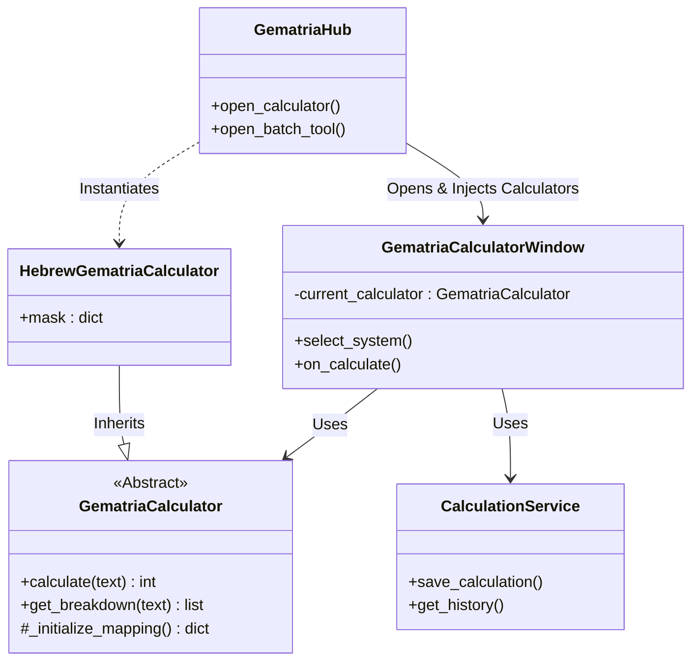

# Gematria Pillar Architecture

> **"Letters are the building blocks of Creation."** - Sefer Yetzirah

## 1. Overview
The Gematria Pillar facilitates the numerical analysis of text across Hebrew, Greek, and English (TQ) systems. It is built on a strict **Strategy Pattern** where the calculation logic is decoupled from the user interface and persistence layers.

## 2. Core Components

### 2.1 The Calculator Engine (Business Logic)
The heart of the system is the `GematriaCalculator` abstract base class.

-   **Base Class**: `src/pillars/gematria/services/base_calculator.py`
    -   Defines the contract: `calculate(text)`, `get_breakdown(text)`.
    -   Implements DRY logic: `normalize_text()` handles diacritic removal (NFD normalization) uniformly across languages.
-   **Concrete Strategies**:
    -   `HebrewGematriaCalculator`, `GreekGematriaCalculator`, `TQGematriaCalculator`, etc.
    -   Each class defines its own `_initialize_mapping()` dictionary.
    -   **Polymorphism**: The UI does not know *how* a calculator works, only that it provides a `.name` and a `.calculate()` method.

### 2.2 The Service Layer (Persistence)
-   **`CalculationService`**: `src/pillars/gematria/services/calculation_service.py`
    -   Acts as the bridge to the database.
    -   **Responsibility**: Converts raw calculation results (value, breakdown) into a persistent `CalculationRecord`.
    -   **Key Method**: `save_calculation(...)` takes a `calculator` instance to extract metadata (language/method name) and normalization rules before saving.

## 3. UI Architecture (Presentation)

### 3.1 The Hub (Entry Point & Factory)
-   **`GematriaHub`**: `src/pillars/gematria/ui/gematria_hub.py`
    -   **Role**: Application Launcher and **Factory**.
    -   **Pattern**: It eagerly instantiates *all* available `GematriaCalculator` subclasses (30+) at startup.
    -   **Injection**: It passes these instances into the various tool windows (Calculator, Batch, Text Analysis).

### 3.2 The Calculator Window
-   **`GematriaCalculatorWindow`**: `src/pillars/gematria/ui/gematria_calculator_window.py`
    -   **Role**: Primary user interface.
    -   **Features**:
        -   Dynamic menu generation based on the list of injected calculators.
        -   "All Methods" mode: Iterates through the list of calculators for a specific language.
        -   Integration with `VirtualKeyboard` for non-Latin input.

## 4. Data Flow

### Calculation Flow
1.  **Input**: User types text (e.g., "שלום") into `GematriaCalculatorWindow`.
2.  **Select**: User selects a "System" (e.g., `HebrewStandard`).
3.  **Delegate**: Window calls `current_calculator.calculate("שלום")`.
4.  **Normalize**: Calculator converts "שלום" -> "שלום" (strips vowel points if present).
5.  **Lookup**: Iterates chars -> matches `_letter_values` -> Sums total.
6.  **Return**: Returns integer value (e.g., 376) and breakdown list.

### Persistence Flow
1.  **Trigger**: User clicks "Save".
2.  **Service Call**: Window calls `calculation_service.save_calculation(text, value, calculator, ...)`
3.  **Record Creation**: Service creates `CalculationRecord`.
4.  **Storage**: Repository saves to SQL database.

## 5. Architectural Critique

### Strengths
-   **High Cohesion**: Each calculator class contains only the logic for its specific cipher.
-   **Open/Closed Principle**: New ciphers can be added by simply creating a new class inheriting from `GematriaCalculator` and adding it to the list in `GematriaHub`. No other code needs to change.
-   **Uniformity**: All languages benefit from the same robust normalization and breakdown logic in the base class.

### Areas for Improvement
-   **Eager Instantiation**: `GematriaHub` initializes all 30+ calculators immediately. While lightweight now, if dictionaries grow (e.g., word-based ciphers), this should move to a Lazy Loading pattern or a `CalculatorFactory`.
-   **Coupling**: The Hub is currently the only place aware of the concrete calculator classes. This is good for centralization but makes the Hub file very long. A dedicated `CalculatorRegistry` might be cleaner.

## 6. Diagram

